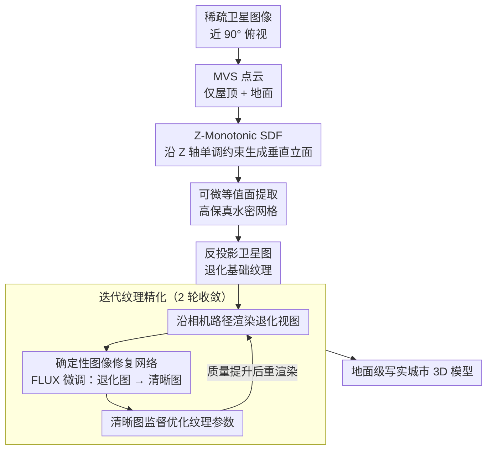

# From Orbit to Ground: Generative City Photogrammetry from Extreme Off-Nadir Satellite Images

**会议**: CVPR 2026  
**arXiv**: [2512.07527](https://arxiv.org/abs/2512.07527)  
**代码**: [项目页面](https://pku-vcl-geometry.github.io/Orbit2Ground/)  
**领域**: 3D Vision  
**关键词**: 城市重建, 卫星图像, 2.5D SDF, 纹理修复, 视点外推

## 一句话总结

提出从稀疏卫星图像重建城市级 3D 模型的两阶段方法：用 Z-Monotonic SDF 建模几何保证建筑结构完整性，再用微调 FLUX 扩散模型做"确定性修复"从退化贴图合成写实纹理，实现从轨道到地面近 90° 视点外推。

## 研究背景与动机

**领域现状**：NeRF/3DGS 在物体和街景级重建取得成功，但城市级重建面临数据采集难题——地面/无人机采集成本高且覆盖有限。卫星图像提供廉价的城市级覆盖。

**现有痛点**：卫星图像的极端挑战——源图（俯视）与目标（地面视角）存在近 90° 视点鸿沟；建筑立面严重透视缩短；大气畸变和传感器限制导致纹理退化。NeRF/3DGS 依赖密集视差和清晰光度，在此场景下完全失败。

**核心矛盾**：卫星图像几乎不提供垂直结构的视差信息（MVS 只能恢复屋顶和地面点云），而我们需要从中合成地面级逼真渲染。

**切入角度**：解耦为几何和外观两个子问题——几何用城市特有的 2.5D 先验约束（建筑基本是垂直拉伸），外观用生成模型先验补偿。

**核心 idea**：Z-Monotonic SDF 保证几何结构正确 → 确定性图像修复网络补偿纹理质量。

## 方法详解

### 整体框架

这篇论文要从一组稀疏的、近乎垂直俯拍的卫星图像，重建出能在地面视角逼真漫游的城市级 3D 模型——而源图和目标视角之间隔着近 90° 的视点鸿沟。直接套 NeRF/3DGS 会失败，因为卫星图几乎不给垂直立面提供视差。作者的破局点是把问题拆成"几何"和"外观"两条独立的线分别攻克。第一阶段只管几何：优化一个 Z-Monotonic SDF，再用可微分等值面提取得到高保真水密网格，城市的垂直结构靠 2.5D 先验强行约束出来。第二阶段只管外观：把卫星图反投影到网格上得到一张布满退化的"基础纹理"，再用微调过的 FLUX 修复网络把退化渲染图洗成清晰图，并迭代地反过来监督纹理。两阶段不联合训练，几何先定死、外观再补齐。

### 关键设计

**1. Z-Monotonic SDF：用单调约束把城市几何的歧义钉死**

卫星 MVS 只能恢复屋顶和地面的点云，垂直立面几乎没有视差，全 3D 的 SDF 在这里会被歧义带跑、长出碎片和漂浮几何。作者的办法是给 SDF 加一条硬约束——让它的值沿 Z 轴单调不递减，$\frac{\partial s(x,y,z)}{\partial z} \geq 0$。这条约束的几何含义很直接：在屋顶或地面这类连续表面处，$s=0$ 只有唯一解，干净地定义出该处高度；而在建筑边缘，$s=0$ 会在 $[z_{ground}, z_{roof}]$ 这段区间里铺成一个竖直平台，于是垂直立面被自动生成出来，不需要任何立面视差。实现上把场景压成一张 256×256 的 2D 网格，每格存一个可学习参数 $h_j$，再用 $\tanh$ 激活构造单调曲线并做空间插值，整套表征因此天然满足单调性。几何优化目标是

$$\mathcal{L}_{geo} = \sum_{p} \|p_z - m^*(p)_z\|_1 + \lambda_{Lap}\mathcal{L}_{Lap} + \lambda_{Nrm}\mathcal{L}_{Nrm}$$

即让重建表面在 Z 方向贴合 MVS 点云，外加 Laplacian 平滑和法向正则。选 2.5D 而非全 3D 是有意为之的取舍：卫星数据本就是俯视的，城市建筑绝大多数是垂直拉伸结构，作者主动放弃对桥梁、立交这类非单调结构的建模能力，换来的是对几何歧义的决定性鲁棒——宁可表达力窄一点，也不让重建跑飞。

**2. 确定性图像修复网络：把生成先验当"修图器"而非"创作者"用**

反投影出来的基础纹理布满退化（大气畸变、传感器限制、分辨率不足），需要生成模型来补质量，但生成模型的随机性是个陷阱——同一栋楼在不同视角下会被"脑补"出互相冲突的细节，跨视图一拼就花了。作者因此把 FLUX-Schnell 微调成一个**确定性**修复器：用 10 万对航拍图像训练它学一个从"退化渲染图"到"清晰目标图"的固定映射，而不是采样多个候选再平均。训练损失同时压感知和像素两层

$$\mathcal{L}_{restorer} = \mathcal{L}_{LPIPS}(\hat{I}, I_{high}) + \lambda_{CHAR}\mathcal{L}_{CHAR}(\hat{I}, I_{high})$$

LPIPS 保证观感清晰，Charbonnier 保证像素层面贴合。这和 SDS 蒸馏那条路线是对立的：SDS 每次采样都引入随机性，多视角下细节难以收敛一致；而确定性映射单次前向就给出唯一结果，既保证了全局一致，又比反复采样平均高效得多。

**3. 迭代纹理精化：让修复结果反哺纹理，越修越准**

单次修复修不干净，因为基础纹理本身太差、修复器输入质量有限。作者把修复做成一个闭环：先沿预设相机路径渲染出当前纹理的退化视图，送进修复网络增强，再把增强后的清晰图当作监督信号去优化纹理参数，下一轮渲染的输入质量就更好，如此正向滚动。相机路径取 150m 均匀网格采样、海拔 450m、俯仰 45°、覆盖四个基本方向，保证监督视角铺满整片区域。实际只需迭代 2 轮纹理就收敛到位，不必无限循环。

### 训练策略

几何和纹理分阶段独立优化、不联合训练：几何用 Adam（lr=0.01）配合上面的 $\mathcal{L}_{geo}$，纹理用 MSE + SSIM 损失驱动；修复网络单独训练 10K 步、batch 96。整套流程效率很高——单张 A6000 GPU 重建 1 km² 仅需 1.5 小时。

## 实验关键数据

### 主实验

| 方法 | MatrixCity F1↑ | MatrixCity CD↓ | DFC PSNR↑ | GoogleEarth PSNR↑ |
|------|---------------|---------------|-----------|-------------------|
| Mip-Splatting | 0.377 | 0.161 | 10.289 | 12.214 |
| 2DGS | 0.556 | 0.073 | 7.366 | 11.022 |
| CityGS-X | 0.189 | 0.227 | FAIL | 12.674 |
| Skyfall-GS | 0.296 | 0.359 | 12.460 | 12.456 |
| **Ours** | **0.643** | **0.036** | **13.059** | **12.770** |

F1 提升 0.09，Chamfer Distance 降低 50%，DFC 数据集提升尤为显著。

### 消融实验

| 配置 | F1↑ | CD↓ | PSNR↑ |
|------|-----|-----|-------|
| Naive MC 128 | 0.279 | 0.0749 | 16.800 |
| Naive MC 256 | 0.412 | 0.0757 | 17.002 |
| w/o Regularization | 0.637 | 0.0364 | 17.115 |
| **Full Model** | **0.643** | **0.0357** | **17.153** |
| w/o Image Restoration | - | - | 17.038 |

### 关键发现

- Z-Monotonic SDF 显著优于朴素 Marching Cubes 方案（F1: 0.643 vs 0.279/0.412）
- 修复网络贡献不可忽略（PSNR: 17.153 vs 17.038），且定性效果差异巨大
- 其他方法在卫星场景下产生碎片化、漂浮几何或模糊纹理，本方法鲁棒稳定

## 亮点与洞察

- **问题定义清晰**：将卫星→地面定义为"极端视点外推"，抓住了问题核心
- **2.5D 表征巧妙**：利用城市结构的领域先验,将不适定问题转化为约束优化
- **确定性修复 vs 生成式蒸馏**：更实用、更一致、更高效的选择
- **规模化验证**：4 km² 真实城市区域的重建展示了实用性

## 局限与展望

- 2.5D 假设无法处理桥梁、立交桥等非单调结构
- 修复网络需要大量配对航拍训练数据
- 纹理质量最终受限于修复模型的幻觉能力，可能与真实外观不一致
- 分辨率受限于 256×256 网格

## 相关工作与启发

- **GaussianShading / Skyfall-GS**：卫星重建近期工作
- **FLUX**：修复网络的基座扩散模型
- **DreamFusion / SDS**：生成先验的另一路线（本文论证其在此场景下的不适用性）

## 评分

- 新颖性: ⭐⭐⭐⭐ Z-Monotonic SDF 设计精巧，两阶段解耦合理
- 实验充分度: ⭐⭐⭐⭐⭐ 合成+真实+大规模验证全面
- 写作质量: ⭐⭐⭐⭐⭐ 问题动机和方法阐述非常清晰
- 价值: ⭐⭐⭐⭐ 卫星重建实用价值高，城市规划/仿真应用明确

<!-- RELATED:START -->

## 相关论文

- [\[CVPR 2025\] Gaussian Splatting for Efficient Satellite Image Photogrammetry (EOGS)](../../CVPR2025/3d_vision/gaussian_splatting_for_efficient_satellite_image_photogrammetry.md)
- [\[ICCV 2025\] Sat2City: 3D City Generation from A Single Satellite Image with Cascaded Latent Diffusion](../../ICCV2025/3d_vision/sat2city_3d_city_generation_from_a_single_satellite_image_with_cascaded_latent_d.md)
- [\[CVPR 2026\] HumanOrbit: 3D Human Reconstruction as 360° Orbit Generation](humanorbit_3d_human_reconstruction_as_360_orbit_generation.md)
- [\[CVPR 2026\] Yo'City: Personalized and Boundless 3D Realistic City Scene Generation via Self-Critic Expansion](yocity_personalized_and_boundless_3d_realistic_city_scene_generation_via_self-cr.md)
- [\[CVPR 2026\] Off The Grid: Detection of Primitives for Feed-Forward 3D Gaussian Splatting](off_the_grid_detection_of_primitives_for_feed-forward_3d_gaussian_splatting.md)

<!-- RELATED:END -->
