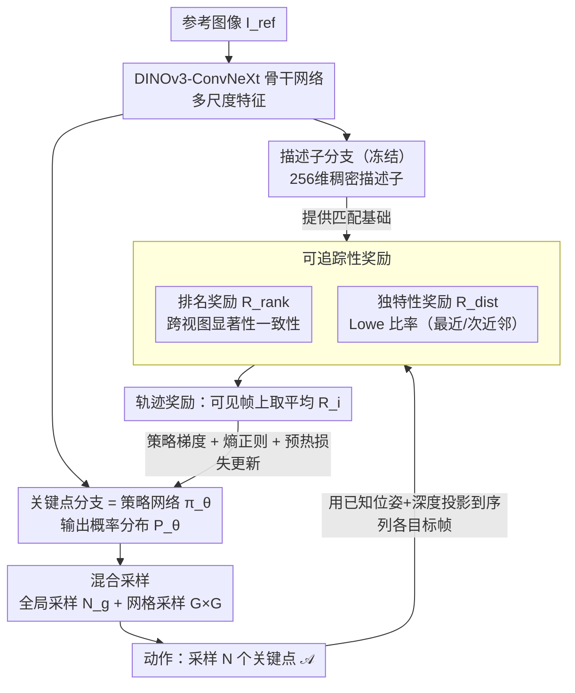

# From Pairs to Sequences: Track-Aware Policy Gradients for Keypoint Detection

**会议**: CVPR 2026  
**arXiv**: [2602.20630](https://arxiv.org/abs/2602.20630)  
**代码**: 无  
**领域**: 3D视觉  
**关键词**: 关键点检测, 强化学习, 长期可追踪性, 序列决策, 特征匹配

## 一句话总结

将关键点检测从「图像对匹配」范式转变为「序列级可追踪性优化」，通过强化学习框架 TraqPoint 在图像序列上直接优化关键点的长期追踪质量，在位姿估计、视觉定位、视觉里程计和三维重建任务上均超越 SOTA。

## 研究背景与动机

现有学习型关键点检测方法（SuperPoint、DISK、ALIKED、RDD 等）均基于**图像对**训练，优化目标是两幅图之间的「可匹配性」(matchability)。然而，SfM 和 SLAM 等实际应用的核心需求是关键点的**长期可追踪性** (trackability)——在长序列中，由于剧烈视角变化、光照变化和运动模糊，仅在单对图像上表现良好的关键点可能在长轨迹中漂移或丢失，直接影响系统稳定性。

此前的 RL 方法（RFP、DISK、RIPE）虽然引入了强化学习来处理离散选择问题，但其奖励函数仍然基于单个图像对，未显式建模时序动态。本文提出从「配对可匹配性」到「长期可追踪性」的范式转变。

## 方法详解

### 整体框架

TraqPoint 要解决的是"现有关键点检测都按图像对优化可匹配性、却没盯住长序列里的可追踪性"这一错配。它采用「先描述后检测」的双分支架构（继承自 RDD）：描述子分支先预训练并冻结，关键点分支作为 RL 的策略网络 $\pi_\theta$。状态 $s$ 是参考图像 $I^{ref}$，动作是从策略输出的概率分布 $P_\theta$ 中采样 $N$ 个关键点 $\mathcal{A} = \{\mathbf{x}_i\}_{i=1}^N$，优化目标是最大化整个序列上的期望追踪质量奖励——把"两帧能不能匹配"换成"在整条轨迹上能不能稳定被追踪"。整条 pipeline 自上而下走：骨干网络出特征 → 关键点分支（策略）采样动作 → 把采样点投影到序列各帧、用冻结描述子算可追踪性奖励 → 用策略梯度回灌更新策略。

### 关键设计

**1. DINOv3-ConvNeXt 骨干网络：用强语义骨干撑起双分支**

整套方法的入口是骨干网络。TraqPoint 把 RDD 中的 ResNet-50 换成 DINOv3-ConvNeXt (base)，提供多尺度特征和更强的语义表征。它向上分叉成两条分支：描述子分支用多尺度可变形 Transformer 聚合四个尺度的特征、输出 256 维稠密描述子图，预训练后冻结，专门为后面的奖励提供稳定的匹配基础；关键点分支则作为 RL 的策略网络 $\pi_\theta$，输出逐像素的关键点概率分布 $P_\theta$。冻住描述子、只训策略，让奖励信号不随训练漂移，是后两个设计能稳定优化的前提。

**2. 混合采样策略 Hybrid Sampling：避免采样的关键点在高概率区扎堆**

拿到策略分布 $P_\theta$ 后要从中采样关键点作为动作。如果直接按分布采样，关键点会聚集在少数高概率区域、丢掉空间覆盖。TraqPoint 把采样拆成两部分：全局采样从全局分布 $P_\theta$ 直接抽 $N_g$ 个点，网格采样把图像划成 $G \times G$ 网格、每格内按局部 softmax 分布采一个点以保证铺开。两类点最终的概率都统一由全局分布 $P_\theta(\mathbf{x}_i)$ 定义再用于策略梯度计算，这样既保住空间均匀性，又让梯度估计仍然一致。

**3. 可追踪性奖励 Trackability Reward：直接用长序列上的追踪质量当回报**

采样出的关键点要被打分，这正是本文范式转变的落点——把奖励从"两帧能否匹配"换成"整条轨迹能否稳定追踪"。对每个关键点 $\mathbf{x}_i$，利用已知位姿和深度把它投影到序列中所有目标帧，在可见帧集合 $\mathcal{V}_i$ 上算一个复合奖励，由两个互补维度构成。排名奖励 $R_{\text{rank}}$ 衡量跨视图显著性一致性，在目标帧的 $K \times K$ 局部区域里算该点 logit 的百分位排名再线性缩放 $R_{\text{rank},i}^t = \max(0, \frac{\text{rank\_prop} - \tau_{\text{rank}}}{1.0 - \tau_{\text{rank}}})$（$\tau_{\text{rank}} = 0.2$）；独特性奖励 $R_{\text{dist}}$ 受 Lowe 比率测试启发，用冻结描述子算最近邻/次近邻距离比 $\text{ratio} = d_1/d_2$，奖励 ratio 低于阈值的点 $R_{\text{dist},i}^t = \max(0, \frac{\tau_{\text{dist}} - \text{ratio}}{\tau_{\text{dist}}})$（$\tau_{\text{dist}} = 0.85$）。最终轨迹奖励对可见帧取平均 $R_i = \frac{1}{|\mathcal{V}_i|} \sum_{t \in \mathcal{V}_i} R_i^t$。两项都设计成连续线性信号、避免稀疏梯度，一起从一致性和区分性两面刻画了"这个点好不好追"。

### 损失函数 / 训练策略

总损失结合策略梯度、空间熵正则化和预热损失：

$$\mathcal{L}(\theta) = -\mathcal{R}(\mathcal{A}) \cdot \left(\frac{1}{N} \sum_{i=1}^N \log P_\theta(\mathbf{x}_i)\right) - \lambda \mathcal{H}(P_\theta) + \alpha_t \mathcal{L}_w$$

- 使用平均奖励 $\mathcal{R}(\mathcal{A}) = \frac{1}{N}\sum_i R_i$ 作为 baseline 降低方差
- 熵正则化系数 $\lambda = 0.001$ 防止模式崩塌
- 预热损失 $\mathcal{L}_w$ 用 FAST 检测器的关键点弱监督前 10% 训练轮次
- 训练数据：MegaDepth 构建的 5 帧序列，$N=256$ 关键点/步
- 8 张 NVIDIA H20 GPU，50000 步

## 实验关键数据

### 主实验

| 数据集 | 指标 | TraqPoint | RDD (之前SOTA) | 提升 |
|--------|------|-----------|----------------|------|
| MegaDepth | AUC@5° | **55.8** | 51.9 | +3.9 |
| MegaDepth | AUC@10° | **71.3** | 68.0 | +3.3 |
| MegaDepth | AUC@20° | **83.0** | 79.9 | +3.1 |
| ScanNet | AUC@5° | **16.6** | 13.7 | +2.9 |
| ScanNet | AUC@10° | **32.8** | 29.3 | +3.5 |
| ScanNet | AUC@20° | **49.5** | 45.3 | +4.2 |
| KITTI Seq-01 | ATE↓ | **29.9** | 35.3 | -5.4 |
| KITTI Seq-01 | AKTL↑ | **7.3** | 4.6 | +2.7 |
| ETH Madrid | Reg.Img↑ | **693** | 632 | +61 |
| ETH Madrid | Sparse Pts↑ | **254k** | 154k | +100k |
| ETH Madrid | Track Len↑ | **11.14** | 9.40 | +1.74 |

### 消融实验

| 配置 | AUC@5°(MegaDepth) | AKTL(KITTI) | 说明 |
|------|-------------------|-------------|------|
| TraqPoint-Full | **55.8** | **6.6** | 完整方法 |
| Pairwise RL | 53.3 | 4.3 | 退化为两帧训练 |
| Match Reward | 49.7 | 2.8 | 用基础匹配奖励替代 |
| w/o Ranking Reward | 52.6 | 4.0 | 去掉排名奖励 |
| w/o Distinctiveness | 54.6 | 5.9 | 去掉独特性奖励 |
| w/o RL (监督) | 52.0 | 3.8 | 用RDD监督训练 |
| ResNet-50 骨干 | 54.5 | 6.1 | 替换骨干网络 |

### 关键发现

- 序列级 RL 相比配对 RL：AUC@5° 提升 2.5，AKTL 提升 2.3，证明序列监督的关键价值
- 仅用 MNN 匹配器即可超越 SP+LG（额外学习匹配器）在 MegaDepth 上 5.9 的 AUC@5°
- 在 ETH 三维重建中，关键点追踪长度提升 ~1.7，重建点数提升 ~65%，关键点分布更聚焦于纹理丰富区域
- 最优超参数：序列长度 5，采样 256 关键点

## 亮点与洞察

- **范式创新**：首次将关键点检测显式建模为序列决策问题，用 RL 优化长期可追踪性而非短期可匹配性
- **奖励设计精巧**：排名奖励和独特性奖励分别从一致性和区分性两个互补维度衡量追踪质量，均设计为连续线性信号避免稀疏梯度
- **解耦策略与描述子**：冻结描述子分支提供稳定奖励信号，策略网络专注优化检测，训练更稳定
- **对下游任务全面有效**：不仅在配对任务上领先，在序列任务（视觉里程计、三维重建）上优势更显著

## 局限与展望

- 训练需要带有深度和位姿标注的序列数据（MegaDepth），数据构建成本高
- 推理时仍用 NMS + sigmoid 提取关键点，未在推理阶段利用序列信息
- 重投影误差略有增加（保留了困难点），可考虑在奖励中加入精度约束
- 未与稠密/半稠密匹配方法（LoFTR、Mast3r）对比下游任务
- 关键点分支轻量但描述子分支（DINOv3-ConvNeXt + 可变形 Transformer）较重，部署成本待评估

## 相关工作与启发

- **RDD** (CVPR'25) 是最直接的 baseline，同架构下 TraqPoint 通过 RL 训练范式全面超越
- **DISK/RIPE** 同为 RL 方法但仍用配对奖励，证明序列级奖励的关键性
- **启发**：该范式可潜在扩展到稠密匹配、光流估计等需要长期一致性的任务；奖励函数设计思路（排名+独特性）可迁移到其他视觉特征学习

## 评分

- 新颖性: ⭐⭐⭐⭐ 首次将关键点检测从配对训练转为序列级 RL 优化，范式创新显著
- 实验充分度: ⭐⭐⭐⭐⭐ 覆盖配对(位姿估计/定位)和序列(里程计/重建)任务，消融详尽
- 写作质量: ⭐⭐⭐⭐ 动机清晰，公式完整，图表丰富
- 价值: ⭐⭐⭐⭐ 对 SfM/SLAM 系统中的关键点质量有直接提升，实用性强
- 价值: 待评

<!-- RELATED:START -->

## 相关论文

- [\[CVPR 2026\] EV-CGNet: Co-visible Focused 3D-guided 2D Event Keypoint Detection Network](ev-cgnet_co-visible_focused_3d-guided_2d_event_keypoint_detection_network.md)
- [\[CVPR 2026\] Generalizable Structure-Aware Keypoint Correspondence for Category-Unified 3D Single Object Tracking](generalizable_structure-aware_keypoint_correspondence_for_category-unified_3d_si.md)
- [\[CVPR 2026\] Towards Intrinsic-Aware Monocular 3D Object Detection](towards_intrinsic-aware_monocular_3d_object_detection.md)
- [\[CVPR 2026\] H²A²: Homogeneity-Aware and Heterogeneity-Aware Feature Perception for Unified Indoor 3D Object Detection](h2a2_homogeneity-aware_and_heterogeneity-aware_feature_perception_for_unified_in.md)
- [\[CVPR 2026\] MV-RoMa: From Pairwise Matching into Multi-View Track Reconstruction](mv-roma_from_pairwise_matching_into_multi-view_track_reconstruction.md)

<!-- RELATED:END -->
