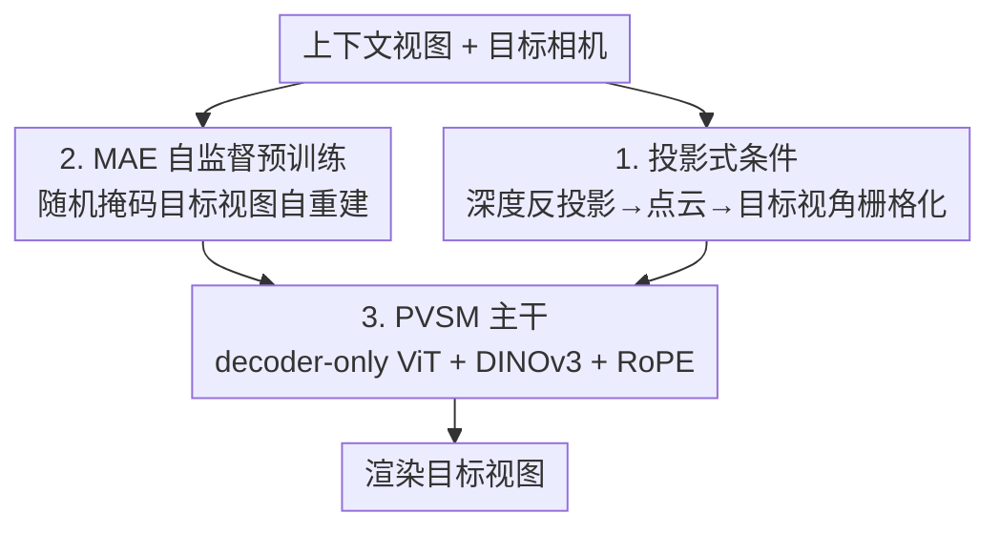

# From Rays to Projections: Better Inputs for Feed-Forward View Synthesis

**会议**: CVPR 2026  
**论文**: [CVF Open Access](https://openaccess.thecvf.com/content/CVPR2026/html/Wu_From_Rays_to_Projections_Better_Inputs_for_Feed-Forward_View_Synthesis_CVPR_2026_paper.html)  
**代码**: 项目页 https://wuzirui.github.io/pvsm-web （代码、数据、模型承诺开源）  
**领域**: 3D视觉  
**关键词**: 前馈视图合成, 投影式条件, 点云栅格化, 掩码自编码预训练, 几何一致性  

## 一句话总结
针对前馈视图合成里把相机编码成 Plücker 射线导致的脆弱性，本文改用"目标视角点云投影图"作为条件输入，把脆弱的几何回归问题重写成稳定的图到图翻译问题，并配上一套 MAE 自监督预训练，在标准 NVS 基准和自建的视角一致性基准上都超过射线条件的 baseline。

## 研究背景与动机

**领域现状**：前馈（feed-forward）视图合成的目标是给几张上下文图 + 一个目标相机，单次前向就直接渲染出新视角，省掉 NeRF / 3DGS 那种逐场景优化。当前最强的一类是大视图合成模型（LVSM 及其后续 RayZer、Less3D 等），它们用纯 ViT 架构，把每个相机的位姿编码成逐像素的 6D Plücker 射线图（ray origin 与方向叉乘得到 moment 向量），和图像 patch 一起拼成 token 喂进 decoder-only Transformer，输出目标视角 RGB。

**现有痛点**：Plücker 射线是**绝对世界坐标系下的表示**，对相机的微小改动极其敏感——视觉上只动了一点点，6D 射线空间里却会发生剧烈、空间非均匀的跳变。结果是稍微缩放、拉伸、滚转相机，输入就偏离训练分布，渲染立刻出现网格状伪影甚至整体崩溃（论文 Fig. 3/4）。

**核心矛盾**：一个合格的视图合成模型本该满足"世界坐标系规范无关性"——把整个场景几何 $G$ 和所有相机一起用全局 $g\in SE(3)$ 变换，渲染结果应当不变。但 Plücker 表示并不满足：在射线空间里这个变换的作用是 $(\mathbf{m}',\mathbf{d}')=(R\mathbf{m}+[\mathbf{t}]_\times R\mathbf{d},\,R\mathbf{d})$，每个像素 token 因位置不同被扰动得不一样。模型只能靠数据增广去"硬学"这个本该天然成立的不变性，既浪费容量又学不干净，留下明显的 train–test gap。

**本文目标 / 切入角度**：作者不再问"怎么把相机编码得更好"，而是问"什么样的输入最适合作为条件，让模型既稳又一致？"观察是：如果把"处理相机几何"这件难事交给一个**确定性的栅格化引擎**，模型只需在稳定的 2D 图像域里工作，那么相机的小改动就只会让输入图发生小而局部的变化。

**核心 idea**：用"目标视角下的点云投影图"代替原始相机参数作为条件——先用现成感知模型从上下文视图取深度、反投影成统一点云，再把点云栅格化到目标相机视角，得到一张直接给出可见几何线索的 2D 图。这样新视图合成就从"射线空间里脆弱的几何回归"变成"目标视角内良态的图到图翻译"。

## 方法详解

### 整体框架

整个系统叫 PVSM（Projective View Synthesis Model）。输入是若干上下文视图 + 目标相机，输出目标视角图像，主干是一个 decoder-only ViT。核心转变只有一句话：**不再把相机当成 token 喂进网络，而是把相机的全部作用浓缩进一张"目标视角点云投影图"**，让网络只看 2D 图。整条管线分两阶段训练：先做 MAE 风格的自监督预训练（条件是"随机掩码后的目标视图自身"，学跨视图补全的先验），再在投影式条件任务上短暂微调（条件换成真正的点云投影图）。两阶段共享同一个 ViT 主干，关键在于二者的输入在结构上长得很像——稀疏点云投影图 ≈ 随机掩码的目标图，所以预训练学到的补全能力能直接迁移到微调。

### 关键设计

**1. 投影式条件：把脆弱的射线回归换成稳定的图到图翻译**

这是全文的核心。针对"Plücker 射线对相机变换不光滑、对坐标规范敏感"这个痛点，作者把相机处理彻底外包给一个确定性几何引擎。具体做法：给每个上下文视图配上现成感知模型（如 MapAnything）估出的深度图 $D_i^c$，先把像素反投影成统一 3D 点云，再从目标相机视角把点云栅格化成一张投影图：

$$\mathcal{I}^{c\rightarrow t}=\mathtt{Rast}(\{\mathtt{UnProj}(\mathcal{D}_i^c,\mathcal{I}_i^c,\mathcal{C}_i^c)\},\,\mathcal{C}^t)$$

其中栅格化用的是 gsplat，每个 3D 点当作参数固定的 3D 高斯渲染。这张投影图 $\mathcal{I}^{c\rightarrow t}$ 直接告诉网络"从目标视角看，可见几何长什么样"，被遮挡/新暴露的区域留成空洞，交给网络去补全。好处是相机一动，投影图只发生**小而局部**的连续变化，于是模型对焦距、长宽比、外推外参等各种变换天然鲁棒。

作者还给了一个商空间（quotient-space）解释说明它为什么从设计上就规范无关：记投影算子 $q=\mathtt{Rast}\circ\mathtt{UnProj}$，对任意 3D 点 $\mathbf{X}$、投影矩阵 $\mathbf{P}$ 和变换 $T$，有 $\mathbf{P}'\mathbf{X}'\sim(\mathbf{P}T^{-1})(T\mathbf{X})=\mathbf{P}\mathbf{X}$——同时变换相机和几何不改变二者的投影关系。因此 $q(\mathcal{X})$ 只依赖相机与几何的**相对**排布，给出的是商空间 $\mathcal{X}/SE(3)$ 上的不变表示：所有只差一个全局坐标规范的配置都被映到同一张投影图。整体函数写成 $f=h\circ q$，网络 $h$ 根本不需要从数据里去学全局不变性，因为不变性已经被投影算子本身编码进去了——这正是它比射线条件强的根因。

**2. MAE 自监督预训练：用未标定数据学跨视图补全先验**

针对"大规模标定 RGB-D 数据贵、纯靠 3D 标注训练受限"这个痛点，作者发现投影式条件的 2D 本性正好能接上 MAE 式预训练。关键观察：稀疏点云投影图在视觉上**酷似一张随机掩码的目标图**（都是"部分可见 + 大片空洞"）。于是设计一个 pretext 任务：把真值目标图 $\mathcal{I}^t$ 损坏成 $\mathcal{I}^{t*}$——先随机丢掉一部分 patch，再对剩下的稀疏掉一些像素，最后加一个随机仿射颜色变换模拟曝光/相机设置变化；然后把 $\mathcal{I}^{t*}$ 连同上下文视图喂进同一个渲染 ViT，训练它重建出原始目标图。这一步在 DL3DV 这类未标定数据上做，让模型学到强健的跨视图图像补全先验，之后只需在投影式条件任务上微调很短的 schedule（甚至 200 步）就能快速形成渲染能力，大幅降低对昂贵 3D 标注的依赖。

**3. PVSM 主干：三路 token + RoPE 消解空洞歧义**

主干沿用 decoder-only ViT，输入 token 来自三个来源：① 上下文图 $\mathcal{I}_i^c$ 的逐 patch token，② 点云投影图 $\mathcal{I}^{c\rightarrow t}$ 的逐 patch token，③ 上下文视图过预训练 DINOv3 得到的特征 $f^{dino}$（实验证明能增强结构一致性）。上下文与目标 patch 分别用独立线性层嵌入：$\mathbf{x}^c_{ij}=\mathtt{Linear}_c(\mathcal{I}^c_{ij})$、$\mathbf{x}^t_j=\mathtt{Linear}_p(\mathcal{I}^{c\rightarrow t}_j)$，拼成序列 $[\{x^c_{ij}\},\{f^{dino}_{ij}\},\{x^t_j\}]$ 过 Transformer，末层目标视图对应的 token 经线性层 + sigmoid 解码成 RGB patch。这里有个投影条件特有的坑：投影图常含空洞，patch 化后这些空 patch 会产生**完全相同的 token**，而自注意力对排列不变，无法区分它们在哪。作者用 RoPE（旋转位置编码）给所有 token 注入唯一位置信息来消除这种歧义。

### 损失函数 / 训练策略
优化用 MSE + 感知损失：$\mathcal{L}=\mathtt{MSE}(\mathcal{I}^t,\hat{\mathcal{I}^t})+\lambda\cdot\mathtt{Perceptual}(\mathcal{I}^t,\hat{\mathcal{I}^t})$，感知损失保高层特征。ViT 取 12 或 24 层，patch size 8，$d_{model}=768$。预训练 10 万步（AdamW，cosine 峰值 lr $10^{-3}$，3000 warm-up），微调换新的 warm-up cosine（峰值 $4\times10^{-4}$）。24 层模型在 H100 上约 1560 GPU-hours，比 baseline LVSM 训练时间低约 7 倍。

## 实验关键数据

### 主实验

视角一致性基准（自建，基于 NoPoSplat，对目标相机施加四类分布外变换）。PSNR(M) 只在有效像素上算。

| 变换类型 | 指标 | 本文 Ours | LVSM | 备注 |
|---------|------|-----------|------|------|
| World Scale | PSNR(M)↑ | **25.43** | 14.56 | 缩放下射线条件几乎崩溃，差距最大 |
| Anisotropic Pixel | PSNR(M)↑ | **19.66** | 19.58 | SSIM 0.763 vs 0.725 |
| FOV | PSNR(M)↑ | **20.88** | 18.67 | LPIPS 0.104 vs 0.119 |
| Roll | PSNR(M)↑ | 17.53 | **19.54** | Roll 上 LVSM 略高，但 +aug 后本文反超 |

RealEstate10K 标准 NVS 基准（按上下文重叠度分档，Total 列）：

| 模型 | PSNR↑ | SSIM↑ | LPIPS↓ |
|------|-------|-------|--------|
| MVSplat | 24.12 | 0.817 | 0.168 |
| NoPoSplat | 23.78 | 0.807 | 0.178 |
| LVSM (12层) | 24.60 | 0.795 | 0.182 |
| **Ours (12层)** | **25.64** | **0.832** | **0.148** |
| LVSM (24层) | 25.74 | 0.830 | 0.150 |
| **Ours (24层)** | **26.90** | **0.851** | **0.133** |

在小重叠（small overlap，视角变化大）档位本文优势最明显：12 层 Ours 23.64 vs LVSM 21.58（+2.06 PSNR），印证投影条件对大视角变化更鲁棒。

### 消融实验

逐组件消融（DL3DV 预训练 + RealEstate10K，对应论文 Tab. 6）：

| 配置 | PSNR↑ | SSIM↑ | LPIPS↓ | 说明 |
|------|-------|-------|--------|------|
| baseline（≈LVSM，无任何组件） | 24.60 | 0.795 | 0.182 | 起点 |
| + 投影式条件 | 25.20 | 0.811 | 0.177 | 单加投影即 +0.60 PSNR |
| + 投影 + DINO 先验 | 25.13 | 0.816 | 0.163 | PSNR 微动，SSIM/LPIPS 明显改善 |
| + 投影 + DINO + 预训练（Full） | **25.64** | **0.832** | **0.148** | 三者叠加最佳 |

预训练消融（Tab. 4）：同样 100K 总步预算下，本文从零训（row 2）已达 25.13，超过 LVSM 的 24.60；在大规模 DL3DV 上预训练后仅微调 200 步（row 4）就有 22.32 PSNR，再延长到 50K 步（row 5）达 25.64，说明预训练提供了强初始化和数据效率。

### 关键发现
- **最大增益来自 World Scale 测试**（25.43 vs 14.56，+10.9 PSNR）：这是 Plücker 射线脆弱性最直接的证据——尺度变化在射线空间里造成剧烈分布漂移，而投影图基本不受影响。
- **seen/unseen 拆分**：把目标像素按是否被点云投影覆盖分成可见/不可见，本文 seen 24.30dB、unseen 21.29dB，分别超 LVSM +2.16/+1.90dB；而直接渲染点云投影图仅 12.54dB（unseen 区为 N/A）。说明提升来自"学会合成"而非"照抄几何"——在需要幻想新暴露内容的 unseen 区反而保持最大领先。
- **运行时**：12 层模型 processing 仅 1.1ms（远低于 3DGS 类的 WorldMirror 74ms），real-time；24 层渲染速度与 LVSM 持平。
- **+aug 适应快**：额外 500 步相机增广后本文快速适应，而"LVSM + aug"提升有限——简单变换在射线空间就能造成大分布漂移，短时间内难以补回。

## 亮点与洞察
- **把"求不变性"从学习问题变成设计问题**：最巧妙之处是商空间论证——通过 $f=h\circ q$ 把 $SE(3)$ 不变性硬编码进确定性投影算子 $q$，网络再也不用从数据里费劲学全局不变性。这是"用正确的输入表示规避难学的归纳偏置"的范例，思路可迁移到任何受坐标规范困扰的几何任务。
- **"稀疏点云图 ≈ 掩码图"的观察打通了 MAE**：正因为条件信号是 2D 且天然带空洞，才能无缝接上 masked image modeling，从而吃下海量未标定数据——把"换了一种条件输入"顺势变成"解锁了自监督预训练"，一举两得。
- **空 patch → 相同 token → RoPE 救场**：这是个容易被忽略但很实在的工程洞察，提醒"投影/掩码这类稀疏输入"在 Transformer 里要特别处理位置歧义。
- **2D 解码能纠几何错**：作者指出前馈高斯方法把几何误差通过固定栅格器直接暴露，而本文让网络在 2D 解码阶段学着修正不完美几何，这解释了为何即便深度估计有噪声，最终渲染仍更干净。

## 局限与展望
- 作者承认：剩余失败模式主要来自**不完美的几何估计**（依赖现成深度/感知模型，深度错了投影图就错）和**动态场景**（管线假设静态场景做点云反投影）。
- 自己发现的局限：方法把相机处理外包给确定性栅格化，因此**强依赖上游感知模型质量**——一旦深度估计在弱纹理/反光区失效，空洞和错位会传导到渲染，且笔记中并未充分量化对深度噪声的敏感度（⚠️ 以原文为准）。Roll 变换上本文未微调时略逊于 LVSM，说明并非所有变换都一边倒占优。
- 改进思路：把单目/多视深度估计与渲染端到端联合训练以缓解几何误差传导；扩展点云表示到时序以支持动态场景；探索更鲁棒的空洞补全先验（如显式不确定性建模）。

## 相关工作与启发
- **vs LVSM / RayZer（射线条件）**：它们直接把 Plücker 射线 token 映射到目标 RGB，可扩展但对坐标规范和相机变换脆弱；本文在相同主干和训练 schedule 下用投影图替换射线，一致性与画质双双反超，核心区别是"把几何外包给确定性引擎，网络只做 2D 翻译"。
- **vs RayZer / Less3D（自监督 SE(3) 隐式相机）**：它们把 NVS 重写成 SSL，把未标定图映到隐式 SE(3) 流形，但存在两个问题——隐式相机构造可能泄露真值目标视图、隐式流形不对齐物理坐标导致难以精确控视角；本文把投影点云当作显式结构信号，无泄露且视角可控。
- **vs 前馈 3D 高斯（PixelSplat / MVSplat / NoPoSplat / AnySplat）**：它们回归像素对齐高斯再 splat，几何误差经固定栅格器直接暴露成伪影/空洞；本文在 2D 解码阶段学习纠错，对深度噪声更宽容，且 processing 时间显著更低。

## 评分
- 新颖性: ⭐⭐⭐⭐⭐ 用"目标视角投影图"重构条件输入并给出商空间不变性证明，是对前馈 NVS 输入表示的本质性反思。
- 实验充分度: ⭐⭐⭐⭐⭐ 自建一致性基准 + 标准基准 + seen/unseen + 运行时 + 多组消融，对照充分且控制了主干/schedule。
- 写作质量: ⭐⭐⭐⭐ 动机—分析—方法—理论解释链条清晰，公式与图配合好；部分符号（如 token 拼接）略密。
- 价值: ⭐⭐⭐⭐⭐ 揭示并解决了 LVSM 系一个普遍的脆弱性根因，投影式条件 + MAE 预训练有很强的可迁移性。

<!-- RELATED:START -->

## 相关论文

- [\[CVPR 2026\] Cross-View Splatter: Feed-Forward View Synthesis with Georeferenced Images](cross-view_splatter_feed-forward_view_synthesis_with_georeferenced_images.md)
- [\[CVPR 2026\] Learning Compact 3D Representations from Feed-Forward Novel View Synthesis](learning_compact_3d_representations_from_feed-forward_novel_view_synthesis.md)
- [\[CVPR 2026\] FlashMesh: Faster and Better Autoregressive Mesh Synthesis via Structured Speculation](flashmesh_faster_and_better_autoregressive_mesh_synthesis_via_structured_specula.md)
- [\[CVPR 2026\] PhysGM: Large Physical Gaussian Model for Feed-Forward 4D Synthesis](physgm_large_physical_gaussian_4d_synthesis.md)
- [\[CVPR 2026\] Reliev3R: Relieving Feed-forward 3D Reconstruction from Multi-View Geometric Annotations](reliev3r_relieving_feed-forward_3d_reconstruction_from_multi-view_geometric_annot.md)

<!-- RELATED:END -->
