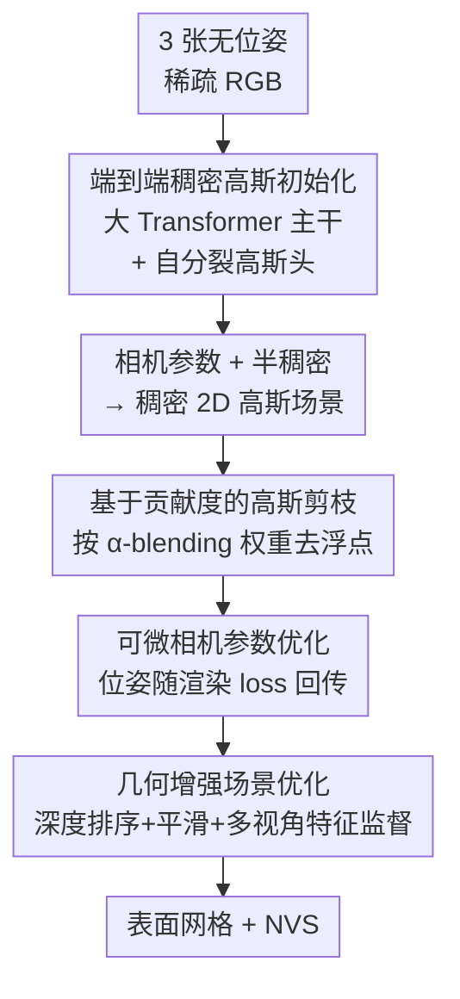

# FSFSplatter: Geometrically Accurate Reconstruction with Free Sparse-view Images within 2 minutes

**会议**: CVPR 2026  
**论文**: [CVF Open Access](https://openaccess.thecvf.com/content/CVPR2026/html/Zhao_FSFSplatter_Geometrically_Accurate_Reconstruction_with_Free_Sparse-view_Images_within_2_CVPR_2026_paper.html)  
**代码**: https://github.com/Zhaoyibinn/FSFSplatter  
**领域**: 3D视觉  
**关键词**: 稀疏视角重建, 3D高斯泼溅, 表面重建, 无位姿重建, 前馈初始化

## 一句话总结
FSFSplatter 用一个大型多视角 Transformer 一次前馈就把 3 张无标定稀疏图像变成稠密、几何一致的 2D 高斯场景并同时估计相机参数，再用基于贡献度的剪枝 + 深度/多视角特征监督的几何增强优化，在 2 分钟内得到既准又能渲染的表面，DTU/Replica/BlendedMVS 上表面误差最少降 28%、NVS 误差最少降 46%。

## 研究背景与动机
**领域现状**：高斯泼溅（3DGS/2DGS）已成为高质量新视角合成（NVS）和细节重建的主流，但绝大多数方法都默认输入是**稠密、已标定**的多视角图像——既要密集覆盖，又要预先跑好相机位姿。

**现有痛点**：现实里常常只有几张稀疏、无位姿的"自由"图像（free sparse-view），此时两条路都崩：① 传统管线把问题拆成位姿估计→稠密重建→表面提取（SDF）多个独立阶段，每阶段都引入误差且**不可逆地累积**；② 稀疏视角下图像重叠不足，Structure-from-Motion（SfM）经常直接失败，即便给了相机参数，稀疏带来的外推/遮挡歧义也会让优化**过拟合到单个视角**，得到塌陷或错误的几何表面。

**核心矛盾**：稀疏输入下，初始化质量和优化稳定性互相牵制——初始化太差优化无法收敛到正确几何，而仅靠 RGB loss 增大迭代数又会放大多视角歧义、让几何"灾难性退化"。已有端到端方法各有短板：DUSt3R 一次只能处理图像对、多视角拼接会累积不一致；VGGT 能从任意张图回归点云但**点云稀疏**、不适合 NVS；FreeSplatter 把场景生成和位姿估计当成独立步骤、后处理对齐又引入额外误差。

**本文目标**：从 3 张自由稀疏图像出发，在 2 分钟内同时拿到**准确的表面**和**高质量 NVS**，且不依赖预标定相机。

**核心 idea**：用一个大 Transformer 一次前馈直接吐出稠密、几何一致的高斯场景 + 相机参数（端到端初始化），把"初始化好坏"这一最关键变量解决掉；再用贡献度剪枝去浮点、用深度和多视角特征监督做几何增强优化来对抗稀疏过拟合，让优化只需极少迭代就能稳定收敛。

## 方法详解

### 整体框架
FSFSplatter 把"自由稀疏视角重建"拆成两个串行的大组件：**(A) 端到端稠密高斯初始化 + 相机参数估计**，输入 3 张无位姿 RGB，一次前馈输出一套稠密、几何一致的 2D 高斯场景和相机内外参；**(B) 几何增强的高斯场景优化**，在初始化基础上先做基于贡献度的剪枝去掉不可见浮点，再用可微相机参数 + 深度/多视角特征监督做短时优化，得到最终表面和 NVS。关键直觉是：把绝大部分几何质量"前置"到初始化里，优化阶段就只需做轻量的几何精修而非从零搜索，因此能压到约 107 秒、远快于动辄数百上千秒的逐场景方法。

### 关键设计

**1. 端到端稠密高斯初始化与自分裂高斯头：把点云稀疏问题在初始化阶段就解决**

VGGT 这类大 Transformer 能从任意张自由图像一次前馈回归相机参数、深度图、点云，但点云对 NVS 来说太稀疏。本文以 VGGT-1B 为主干（图像先经 DINOv2 编码成 token），通过独立预测头拿到相机参数和 DPT 解码特征，先把像素对齐深度图和 DPT 特征融合成一个**半稠密**高斯场景 $G_{init}$，再用一个 Encoder-Decoder $D$ 把它"自分裂"成稠密场景。具体地，DPT 重投影模块用位置编码把 token 投回像素对齐的高维特征 $F_P$，PointMLP 编码点云几何得到 $F_c$，二者与显式高斯属性（球谐 $SH_P^{48}$、旋转 $R_P^4$、尺度 $S_P^2$）拼接后送入相互独立的解码器，预测每个高斯的属性变化量并把它分裂成 $N$ 个新基元：

$$\Delta G_{N\cdot P} = D(\mathrm{Cat}(F_P, SH_P^{48}, R_P^4, S_P^2, F_c)), \quad D(G_P) = G_P + \Delta G_{N\cdot P}$$

为了让网络对不同场景泛化，输入单元用的是**点云 patch** 而非整图——用 KNN 把高维点云切成随机采样的局部 patch，逐 patch 过 encoder-decoder 致密化，最后去归一化再合并：

$$G = N'\Big(B'\big[B(N(G_{init})) + D(B(N(G_{init})))\big]\Big)$$

其中 $N/N'$ 是归一化/去归一化，$B/B'$ 是 patch 切分/合并。这一步是全文几何质量的源头——消融里去掉自分裂致密化 $D$ 后 Replica CD 从 33.66 暴涨到 59.83，几乎翻倍。

**2. 基于贡献度的高斯剪枝：去掉初始化里大量收不到梯度的浮点**

亚像素级稠密初始化虽然提供了强先验，却也带来大量被遮挡或不可见的基元，这些基元在反传时收不到梯度、又无法靠简单的低不透明度过滤剔除，留着会污染几何。本文在优化前先按每个高斯在 α-blending 里的实际权重 $\alpha_i\prod(1-\alpha_n)$ 量化其贡献度 $C_n$，并用它影响的像素数 $|P_n|$ 归一化，防止大尺度高斯靠覆盖面积"刷"贡献：

$$C_n = \sum_{k=1}^{3} \frac{1}{|P_n|}\sum_{p\in P_n}\Big(\alpha_i^p \prod_{i-1}^{n}(1-\alpha_n^p)\Big)$$

对所有基元排序后剪掉低贡献或低不透明度的部分。消融显示去掉该剪枝 $T$ 后 Replica CD 从 40.05（wo Opt.）降到 40.69、DTU 从 2.208 升到 2.930，说明它对去浮点、稳几何确有实效。

**3. 可微相机参数优化：让渲染 loss 直接反传到位姿，避免后处理对齐误差**

无位姿重建里，原生 GS 光栅器不支持相机参数反传，稀疏视角下细微的多视角不一致会在优化中被放大。本文把所有相机位姿统一放到原点，光栅化前对所有高斯基元施加相机位姿的逆变换 $T_k^{cam}$，从而得到和原框架等价的 NVS，但整个过程中 $T_k^{cam}$ 保持可微——任何基于渲染图像的 loss 都会先反传到相机位姿、再传到高斯基元。因为视角稀疏，不同视角的位姿优化彼此独立、收敛很快。消融里去掉可微位姿 $T_k^{cam}$ 后 DTU CD 从 1.581 退到 2.855，是优化阶段掉点最大的单项之一。

**4. 几何增强场景优化：用深度和多视角特征监督对抗稀疏过拟合**

稀疏自由图像直接用 RGB loss 优化会引入不可避免的多视角歧义，导致颜色过拟合、几何灾难性退化。本文在 RGB 项（$L_1, L_{SSIM}$）和法向项 $L_n$ 之外，叠加三类几何监督。其一，用单目深度估计 $D_{est}$ 通过**排序损失**监督渲染深度 $D_{re}$，在局部 patch 里随机采样像素对 $(p_1, p_2)$ 只约束相对前后关系以规避尺度歧义（$\mathrm{sgn}$ 为符号函数、$m$ 为 margin、$\sigma$ 为 ReLU）：

$$L_{rank} = \sum_P \sigma\big(\mathrm{sgn}(S(D_{pre}, p_1, p_2)\cdot S(D_{re}, p_1, p_2)) + m\big), \quad S(D, p_1, p_2)=D(p_1)-D(p_2)$$

其二，深度平滑损失 $L_{smooth}$ 用阈值 $n_1, n_2$ 在估计深度的边缘处约束渲染深度的局部一致性。其三，多视角特征对齐损失 $L_{MVS}$ 用预训练 U-Net 提取高维特征、重投影到参考视角后做余弦相似度比对，专门对付多视角光照不一致：

$$L_{MVS} = \sum_r \Big(1 - \cos\big[R_r(U(c)(I_r)), U(c)(I)\big]\Big)$$

消融里去掉 $L_{MVS}$ 后 DTU CD 从 1.581 升到 3.130（掉得最狠）、去掉 $L_{rank}$ 升到 2.905，印证了深度/特征监督是稀疏场景几何稳定的关键。

### 损失函数 / 训练策略
训练用 512×512 分辨率、patch size 2048，单卡 RTX5090 跑 120 epoch 约 27 小时，数据来自 BlendedMVS + DTU + Virtual KITTI + Replica。采用**几何渐进式训练**避免 RGB 过拟合：先用 VGGT-1B 预训练权重初始化主干并只开 $L_D, L_{Cam}$ 保证几何稳定；再冻结 DPT Head/Camera Head/主干，单独训 DPT 重投影头和致密化 MLP（此阶段关掉 KNN patch 做全局致密化预训练，开 $L_1, L_{SSIM}$）；最后解冻全部参数、恢复 KNN patch、激活完整 loss，让主干直接学 RGB→高斯属性的映射。

## 实验关键数据

### 主实验
DTU 表面重建 Chamfer Distance（CD↓，mm）与三数据集 NVS（PSNR↑），3 张输入、等迭代设置：

| 数据集 / 指标 | 本文 Ours | Ours(wo Opt.) | VGGT | 最强基线* | 说明 |
|--------------|-----------|---------------|------|-----------|------|
| DTU CD↓ | **1.581** | 1.907 | 2.586 | FatesGS* 3.856 | 比 VGGT 降约 39% |
| Replica CD↓ | **32.554** | 37.621 | 50.818 | FatesGS 151.85 | 场景级优势更大 |
| DTU PSNR↑ | 30.251 | 28.61 | 28.61 | 3DGS 29.37 | 等迭代下领先 |
| Replica PSNR↑ | **35.79** | 23.51 | 13.04 | 3DGS 22.05 | 大幅领先 |
| BlendedMVS PSNR↑ | **30.74** | 19.52 | 13.41 | 3DGS 18.75 | 大幅领先 |

作者汇总：表面误差在 DTU/Replica 上**至少降 28.39% / 34.37%**（即便不做逐场景优化也降 14.62% / 21.93%）；NVS 误差（以 LPIPS 计）在 DTU/Replica/BlendedMVS 上**至少降 46.19% / 73.13% / 87.35%**。

位姿估计 RMSE（Replica / DTU）也与 SOTA 持平甚至更优：Replica 旋转 0.634° / 平移 3.746mm、DTU 旋转 0.314° / 平移 1.256mm，与 VGGT 同档且优于 DUSt3R、Fast3R、FreeSplatter。

### 速度对比
Replica 逐场景优化耗时（Time↓，秒）：

| 方法 | 3DGS | 2DGS | FatesGS | PGSR | Ours |
|------|------|------|---------|------|------|
| 耗时(s) | 429.45 | 840.37 | 915.93 | 1018.2 | **107.39** |

初始化在 DTU 上仅需 0.63s（比 VGGT 0.24s + GS init 0.13s 仅多 <0.27s），却换来表面 26.3% 提升、NVS +11.9dB PSNR、后续优化时间减少 80%。

### 消融实验
DTU / Replica 表面 CD↓：

| 配置 | Replica CD | DTU CD | 说明 |
|------|-----------|--------|------|
| Full (Ours) | 33.66 | 1.581 | 完整模型 |
| No $L_{rank}$ | 36.23 | 2.905 | 去单目深度排序监督 |
| No $L_{smooth}$ | 37.71 | 2.653 | 去深度平滑 |
| No $L_{MVS}$ | 35.36 | 3.130 | 去多视角特征，DTU 掉最狠 |
| No $T_k^{cam}$ | 37.05 | 2.855 | 去可微相机位姿 |
| Ours(wo Opt.) | 40.05 | 2.208 | 不做逐场景优化 |
| No $T$（剪枝） | 40.69 | 2.930 | 去贡献度剪枝 |
| No $D$（致密化） | 59.83 | 3.584 | 去自分裂致密化，掉最多 |

### 关键发现
- **自分裂致密化 $D$ 贡献最大**：去掉后 Replica CD 从 33.66 翻到 59.83，说明稠密、几何一致的初始化是全文地基。
- **优化阶段里 $L_{MVS}$ 在 DTU 最关键、$T_k^{cam}$ 在 Replica 最关键**——不同数据集瓶颈不同，多视角特征对付物体级、可微位姿对付场景级。
- **稀疏视角下"多迭代≠更好"**：单纯增大迭代会因过拟合导致几何灾难退化，所以 NVS 必须在等迭代下比较；这也是为什么本文把质量前置到初始化、优化只做轻量精修。
- 有意思的是，去掉额外监督后逐场景优化的结果可能**比初始场景还差**（Ours(wo Opt.) DTU 2.208 优于 No $L_{MVS}$ 的 3.130），说明在稀疏歧义下，没有几何监督的优化是负收益。

## 亮点与洞察
- **"把几何质量前置到初始化"是核心方法论**：与其在优化里反复纠错，不如让一次前馈就给出几何一致的稠密高斯，优化只需 107s、迭代极少——这种"重初始化、轻优化"的思路可迁移到任何需要逐场景优化的 GS 任务。
- **自分裂高斯头 + KNN patch 解决了 VGGT 点云太稀疏的硬伤**：把"点云→稠密高斯"做成可学习的属性增量预测，而非启发式致密化，且 patch 化输入显著提升跨场景泛化。
- **贡献度剪枝用 α-blending 权重而非不透明度判定浮点**，并按像素数归一化避免大尺度高斯刷分——这个度量很自然，可直接用于其他 GS 方法的浮点清理。
- **可微相机位姿把"位姿优化"融进渲染反传**，避免了 FreeSplatter 式独立后处理对齐的额外误差，是 pose-free 重建里干净利落的工程设计。

## 局限与展望
- 依赖 VGGT-1B 这类大 Transformer 预训练权重，训练成本不低（120 epoch / 27h / RTX5090），且几何先验质量受预训练数据域影响。
- 论文主打 3 张输入的稀疏设定，⚠️ 对极端少视角（如 2 张）或视角间几乎无重叠时的鲁棒性论文未充分展开。
- 单目深度排序损失只约束相对前后关系以规避尺度歧义，意味着绝对尺度仍依赖相机/深度先验，对需要度量尺度的下游任务可能不够。
- 多视角特征对齐依赖预训练 U-Net 特征，跨极端域（如医学/卫星）时特征是否仍一致存疑，可作为泛化性改进方向。

## 相关工作与启发
- **vs VGGT**：VGGT 一次前馈出相机参数+深度+点云，但点云稀疏、不利于 NVS；本文以它为主干，加自分裂高斯头把稀疏点云升级成稠密高斯，并叠加几何增强优化，DTU CD 从 2.586 降到 1.581、Replica NVS PSNR 从 13.04 飙到 35.79。
- **vs FreeSplatter**：FreeSplatter 把场景生成和相机位姿估计当作独立步骤、靠优化对齐多视角引入额外误差；本文用可微相机参数把位姿优化融进渲染反传，端到端无后处理对齐。
- **vs FatesGS / PGSR（稀疏视角逐场景优化）**：它们需要相机参数输入且优化耗时数百上千秒；本文无需预标定、107s 完成且 CD 显著更优，胜在"重初始化"省掉了大量优化迭代。
- **vs DUSt3R 系**：DUSt3R 一次只处理图像对、多视角拼接累积不一致；本文走多视角联合前馈 + 稠密高斯表示，既支持任意张输入又直接可渲染。

## 评分
- 新颖性: ⭐⭐⭐⭐ 把大 Transformer 前馈初始化、自分裂稠密高斯头、贡献度剪枝、可微位姿、几何监督优化整合成一条干净的稀疏视角无位姿重建管线，组合创新扎实。
- 实验充分度: ⭐⭐⭐⭐⭐ 三数据集、表面/NVS/位姿/速度四类指标全覆盖，消融逐项拆解每个组件贡献，数据自洽。
- 写作质量: ⭐⭐⭐⭐ 方法描述清晰、公式完整，pipeline 两阶段划分明确，个别符号（如 patch 合并公式）略需对照原文理解。
- 价值: ⭐⭐⭐⭐⭐ 2 分钟从 3 张无标定图像出几何准确表面，对 AR/VR、自动驾驶等仅有稀疏 RGB 的场景实用价值高。

<!-- RELATED:START -->

## 相关论文

- [\[CVPR 2026\] Generalizable Sparse-View 3D Reconstruction from Unconstrained Images](generalizable_sparse-view_3d_reconstruction_from_unconstrained_images.md)
- [\[NeurIPS 2025\] GeoSVR: Taming Sparse Voxels for Geometrically Accurate Surface Reconstruction](../../NeurIPS2025/3d_vision/geosvr_taming_sparse_voxels_for_geometrically_accurate_surface_reconstruction.md)
- [\[ICLR 2026\] UrbanGS: A Scalable and Efficient Architecture for Geometrically Accurate Large-Scene Reconstruction](../../ICLR2026/3d_vision/urbangs_a_scalable_and_efficient_architecture_for_geometrically_accurate_large-s.md)
- [\[CVPR 2026\] Uni3R: Unified 3D Reconstruction and Semantic Understanding via Generalizable Gaussian Splatting from Unposed Multi-View Images](uni3r_unified_3d_reconstruction_and_semantic_understanding_via_generalizable_gau.md)
- [\[CVPR 2026\] HeroGS: Hierarchical Guidance for Robust 3D Gaussian Splatting under Sparse Views](herogs_hierarchical_guidance_for_robust_3d_gaussian_splatting_under_sparse_views.md)

<!-- RELATED:END -->
