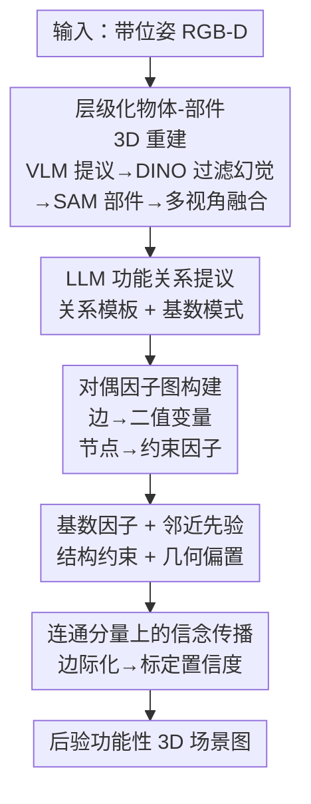

# FunFact: Building Probabilistic Functional 3D Scene Graphs via Factor-Graph Reasoning

**会议**: CVPR 2026  
**论文**: [CVF Open Access](https://openaccess.thecvf.com/content/CVPR2026/html/Fu_FunFact_Building_Probabilistic_Functional_3D_Scene_Graphs_via_Factor-Graph_Reasoning_CVPR_2026_paper.html)  
**代码**: 项目页 https://funfact-scenegraph.github.io/ （未见开源代码仓库）  
**领域**: 3D视觉  
**关键词**: 功能性场景图, 因子图, 信念传播, 置信度标定, 开放词表  

## 一句话总结
FunFact 从带位姿的 RGB-D 图像构建**概率化的开放词表功能性 3D 场景图**：先用基础模型重建物体-部件级 3D 地图，再把候选功能关系转成一张「对偶因子图」，用 LLM 常识先验 + 几何邻近先验做信念传播，从而对全场景所有功能边联合推理、输出**标定良好**的每条边置信度，在功能关系召回和标定误差上显著超过逐对推理的 baseline。

## 研究背景与动机
**领域现状**：3D 场景理解正从「几何/语义」走向「功能性理解」——不只问场景里有什么、在哪里，而是问物体**如何相互作用**：哪个开关控制哪盏灯、哪个旋钮控制哪个灶眼、拔哪根线能给水壶断电。这类信息对 AR 助手、虚拟训练、具身机器人做任务规划至关重要。已有的功能性场景图工作（OpenFunGraph、FunGraph）用 LLM + 2D 视觉语言模型提出开放词表的物体-部件、物体-物体功能关系。

**现有痛点**：现有方法把功能关系当成**孤立的物体对**来判断，每条边各算各的，忽略了人类用来消歧的「全场景相互依赖」。比如墙上有两个开关、两盏灯，单看视觉证据根本分不清谁控制谁——开关和灯可能离得很远甚至被遮挡，拨动开关的因果效应也不写在静态外观里。

**核心矛盾**：功能性本质上**从静态观测里就是欠定的**（视觉证据 ↔ 功能行为之间存在天然鸿沟），但现有模型只给一个「最可能的连接」，既不建模「所有可能选项上的分布」，给出的置信度也没有标定——说 0.9 其实未必有 90% 正确率，下游规划无法据此做风险决策。

**本文目标**：(1) 从带位姿 RGB-D 重建出物体+部件级的 3D 表示；(2) 在此之上对**全部**功能边做联合概率推理，而不是逐对独立判断；(3) 输出**标定良好**的每条边置信度。

**切入角度**：作者注意到功能关系天然带有**结构性约束**——很多关系是一对一的（每个灶眼有专属旋钮）、近的连接更可能（灯一般离自己的开关近）。这些约束跨越多条边、是场景级的，正适合用**因子图 + 信念传播**这种成熟的概率图模型框架来联合求解。

**核心 idea**：把功能场景图「对偶化」成一张因子图——**场景图的边变成因子图的二值变量，场景图的节点变成约束因子**——再用 LLM 常识先验（基数模式）和几何邻近先验约束这些变量，通过信念传播做全局联合推理，得到标定的边际置信度。

## 方法详解

### 整体框架
FunFact 是一条两阶段串行 pipeline。**输入**是一组带位姿的 RGB-D 图像，**输出**是一张后验功能性 3D 场景图（每条功能边带标定置信度）。

第一阶段 **Scene Reconstruction**：用 VLM（GPT-4.1）对每张 RGB 提出功能物体、层级化的部件标签和粗 2D 框；用 GroundingDINO 以这些标签为查询做开放词表检测、并与 VLM 粗框交叉核对来**过滤幻觉**；对每个验证过的物体裁剪局部图、再跑一次 GroundingDINO+SAM 检测细粒度功能部件；最后把所有物体/部件实例反投影到 3D 并跨视角融合，得到物体-部件级的一致 3D 地图。

第二阶段 **Functional Scene-Graph Creation**：让 LLM 对每个带部件的物体提出语义上合理的功能关系模板（并预测其基数模式是否一对一）；把这些候选关系**实例化成对偶因子图的二值变量**，挂上基数约束因子和邻近先验因子；在每个不相连的连通分量上跑信念传播，求出每条边的边际概率，阈值化后得到最终功能场景图。

### 关键设计

**1. 层级化物体-部件 3D 重建 + 幻觉过滤：把小功能部件可靠地挂到父物体上**

功能关系常常发生在**小部件**上（旋钮、按钮、把手），而扁平的物体级 baseline（如 ConceptGraph）会漏掉它们，或者把每个部件当独立物体处理、丢失父子归属。FunFact 用一条层级化流水线解决：先让 VLM 对整图输出「功能物体 + 各物体的层级部件标签 + 物体级描述 + 归一化 xyxy 粗框」。但 VLM 会幻觉出不存在的部件、且框很糙，于是用 GroundingDINO 以 VLM 给的物体标签为文本查询在原图上重检测，**与 VLM 粗框交叉核对**——没被 GroundingDINO 检到、或与粗框强烈不一致的提议被丢弃，相当于用两个模型做集成投票来压制幻觉。对每个验证过的物体，再把它的细框扩一圈、裁剪局部图、**以该物体的部件名为查询再跑一次 GroundingDINO+SAM**：裁剪等于提高了小部件的相对分辨率，让检测器更容易定位细粒度部件。最后按几何/结构规则过滤部件（相对父物体太大/太小、与父框重叠不足的丢掉），并按 BBQ 的做法把所有实例反投影到 3D、跨视角融合（多视角一致重叠的物体合并为一个 3D 实例，其部件被继承）。消融显示：去掉层级表示后，交互元素的映射召回从 69.5% 掉到 41.8%，几乎退化到把部件当独立物体的 OpenFunGraph 水平（41.1%）。

**2. 功能场景图的对偶化：把「边」变成变量、「节点」变成约束因子**

这是全文最核心的建模转换。给定物体-部件 3D 地图，先让 LLM 对每个带部件的物体提议合理的功能关系模板 $T_k=\{r_{k,j}\}$（如「旋钮控制灶眼」「把手开门」），并预测每种关系**典型的基数模式**（一对一，还是一对多）。对每个模板 $r_{k,j}$，**穷举**所有语义类型匹配的部件-物体/部件-部件组合（如同一个灶上所有「旋钮×灶眼」对），连成候选功能边 $E_{k,j}=\{e^{k,j}_i\}$。关键一步是「对偶」：每条候选边 $e^{k,j}_i$ 被映射成一个二值变量 $x^{k,j}_i\in\{0,1\}$，表示这条功能边**是否存在**；而原场景图里的节点则转化为约束这些变量的因子。换句话说，**场景图的边 → 因子图的变量，场景图的节点 → 因子图的因子**。这样一来，「同一个灶上所有旋钮和灶眼之间」就构成了一张稠密相连的局部因子图（如完全二部图），后续可以用概率推理一次性消歧，而不是把每条边孤立地各判一次。对物体-物体关系（如「海绵擦台面」「刀切苹果」）同样处理，但默认不强加邻近先验，而是让 LLM 指出哪些关系才需要邻近（如「窗帘遮窗户」），再和部件级关系一起放进全局模型联合优化。

**3. 基数因子 + 邻近先验：把「一对一结构」和「近者更可能」编码成软约束**

光把边变成变量还不够，需要先验来约束哪些变量该被点亮。FunFact 引入两类因子。**基数因子** $\phi_{card}$ 编码一对一/一对多结构：对参与一对一关系的部件节点 $n$，设 $X_n$ 是与 $n$ 关联的对偶变量、$d_n=\sum_{x\in X_n}x$ 是其活跃连接数，则

$$\phi_{card}(X_n)=\begin{cases}b^{\,d_n-1} & d_n\ge 1\\ b^{\,2} & d_n=0\end{cases}$$

其中 $b\in(0,1)$ 是控制惩罚强度的超参。直觉上：一个旋钮控制多个灶眼（$d_n$ 太大）会被指数压低概率，一个旋钮谁都不连（$d_n=0$）也被惩罚，于是模型偏好结构上合理的一对一分配。**邻近先验** $\phi_{prox}$ 是一元因子，按对偶边的欧氏长度给先验信念：

$$\phi_{prox}(x^{k,j}_i)=\exp\!\left(-\frac{d(e^{k,j}_i)}{\lambda_{k,j}}\right)$$

$d(\cdot)$ 是边长，$\lambda_{k,j}$ 取局部候选边集 $E_{k,j}$ 所有边长的中位数。它把图偏向选择更近的连接（灯更可能连自己附近的开关），但因为只是软先验，仍允许基数约束在需要时把它纠正回来。两类因子配合，正是「逐对推理做不到」的场景级消歧。

**4. 连通分量上的信念传播：联合推理 + 输出标定置信度**

有了变量和因子，FunFact 用 pgmpy 实现对偶因子图、跑**信念传播**求所有候选功能边上的联合分布。为加速，先把图拆成互不共享先验/约束因子的**不相连连通分量** $C_m$（「旋钮控灶眼」和「遥控器控电视」之间不互相帮助消歧），各分量独立推理。对分量 $C_m$、变量集 $X_m$，联合分布为

$$P(X_m)=\frac{1}{Z_m}\prod_{x\in X_m}\phi_{prox}(x)\prod_{f\in F_m}\phi_{card}(\partial f)$$

$F_m$ 是该分量内的基数因子，$\partial f$ 是与因子 $f$ 相连的变量，$Z_m$ 是归一化常数。收敛后**边际化**得到每条边的置信度，阈值化（0.5）产出最终功能场景图。正因为是在全场景上联合推理，边际概率天然反映了「在所有结构约束下这条边有多可能」，所以置信度标定（ECE）远好于逐对预测——这是 FunFact 区别于 baseline 的根本价值：它建模的是**所有可能选项上的分布**，而不是单点最优。

### 损失函数 / 训练策略
FunFact 是**无训练（zero-shot）pipeline**：物体/部件提议来自冻结的 GPT-4.1 与 GroundingDINO/SAM 基础模型，功能关系与基数模式来自 LLM 常识，推理通过因子图信念传播完成，没有任务特定的网络训练。唯一的可调量是基数惩罚强度 $b$、邻近尺度 $\lambda_{k,j}$（取中位边长）和最终阈值 0.5。

## 实验关键数据

数据集：真实数据 SceneFun3D、FunGraph3D + 新提出的合成基准 **FunThor**（基于 AI2-THOR，12 个场景 / 4 类环境 / 26 类功能关系，每场景 60 帧、共 720 张图，规则自动生成稠密 GT，可同时评精度与标定）。

### 主实验：场景重建召回（Recall@K，越高越好）

| 方法 | SceneFun3D Overall R@3 | SceneFun3D Overall R@10 | FunGraph3D 交互元素 R@3 | FunGraph3D Overall R@3 | FunGraph3D Overall R@10 |
|------|------|------|------|------|------|
| Open3DSG | 56.7 | 64.7 | 21.8 | 33.4 | 43.6 |
| ConceptGraph | 28.3 | 31.4 | 2.5 | 20.1 | 25.2 |
| ConceptGraph+IED | 60.1 | 66.0 | 20.5 | 38.9 | 45.0 |
| OpenFunGraph | 73.0 | 82.8 | 44.4 | 55.5 | 65.8 |
| **FunFact** | **73.2** | **83.6** | **68.3** | **77.9** | **86.2** |

在 FunGraph3D 上对小交互元素的召回从 44.4% 跃到 68.3%，归功于层级化物体-部件映射。

### 三元组评估（节点关联 / 三元组召回，Recall@K）

| 数据集 | 指标 | OpenFunGraph | FunFact |
|------|------|------|------|
| FunGraph3D | Overall Triplets R@5 / R@10 | 29.8 / 45.0 | **48.7 / 63.9** |
| FunThor | Overall Triplets R@3 / R@5 | 15.1 / 17.6 | **54.1 / 54.7** |
| SceneFun3D | Overall Triplets R@5 / R@10 | **60.4 / 70.3** | 41.0 / 57.9 |

⚠️ 在 SceneFun3D 上 FunFact 反而落后：作者归因于 SceneFun3D 标签过于笼统（「handle」「knob」），FunFact 细粒度开放词表预测（如「television stand」vs「cabinet」）被 CLIP/BERT 匹配协议系统性误判，而非真错；FunThor 的规则化细粒度标注几乎没有这类伪误配。

### 消融与标定（FunThor，标定误差 ECE 越低越好）

| 配置 | 交互元素映射 R@3 | Prec.[%] | Recall[%] | F1[%] | ECE(全部)↓ | ECE(模糊)↓ |
|------|------|------|------|------|------|------|
| OpenFunGraph | 41.1 | 23.4 | 12.2 | 16.0 | 0.43 | 0.51 |
| **FunFact 完整** | **69.5** | **31.9** | 49.3 | **38.7** | **0.36** | **0.07** |
| w/o 因子图推理 | 69.5 | 21.9 | **53.4** | 31.1 | 0.70 | 0.45 |
| w/o 层级物体-部件提议 | 41.8 | 21.6 | 18.2 | 19.8 | 0.36 | 0.14 |

### 关键发现
- **因子图推理是精度与标定的主力**：去掉它后召回略升（53.4%）但精度从 31.9% 崩到 21.9%、ECE 从 0.36 恶化到 0.70、模糊场景 ECE 从 0.07 暴涨到 0.45——它通过抑制低置信边换来精度和 F1 的大幅提升，且对「灯开关/灶旋钮」这类模糊关系的标定改善最明显（0.51→0.07）。
- **层级表示是召回小部件的关键**：去掉后交互元素映射召回从 69.5% 掉到 41.8%（≈退回 OpenFunGraph 的 41.1%），三元组精度/召回/F1 随之大跌。
- 相比 OpenFunGraph，完整 FunFact 在 FunThor 上精度绝对提升约 8.5pp，体现了用全场景上下文消解视觉歧义的有效性。

## 亮点与洞察
- **「对偶化」这一步很优雅**：把场景图的边↔节点对调成因子图的变量↔因子，正好把「这条关系是否存在」的离散判断变成可联合推理的二值变量，是连接「场景图语义」与「概率图模型工具箱（pgmpy + 信念传播）」的关键桥梁。
- **建模分布而非单点**：作者明确主张先验模型不该只预测最可能连接、而要建模所有可能选项上的分布——这把「功能关系欠定」从缺陷变成了可量化的不确定性，输出的标定置信度对下游规划真正有用。
- **连通分量分解既加速又符合直觉**：互不影响的功能簇（旋钮-灶眼 vs 遥控-电视）天然可分图独立推理，是工程上低成本却有效的剪枝。
- **可迁移的 trick**：VLM 提议 + GroundingDINO 交叉核对压制幻觉、裁剪局部图提升小部件相对分辨率，这套「基础模型集成 + 局部放大」的检测增强思路可直接搬到其他细粒度开放词表 3D grounding 任务。

## 局限与展望
- 作者承认会**过分割/欠分割**：多个橱柜的墙偶尔被融成一个实例；部件分割粒度不稳定（FunGraph3D 只标一个微波炉控制面板，FunFact 可能为每个按钮各出一个部件），这种细粒度反而让现有数据集难以公平评测。
- **重度依赖 LLM 推理**，每张图秒级延迟，限制了严格实时与资源受限平台的应用。
- 评测协议本身的瓶颈：CLIP/BERT 的标签匹配在面对开放词表细粒度输出时会系统性误判（SceneFun3D 上的落后多半源于此），说明这类功能性理解任务亟需更细粒度、规则化的基准（这也是作者造 FunThor 的动机）。
- ⚠️ 个人观察：基数先验默认一对一/一对多的判断完全交给 LLM，若 LLM 对某类关系的典型基数判断错误，因子图会被错误结构约束「带偏」，论文未量化这部分敏感性。

## 相关工作与启发
- **vs OpenFunGraph / FunGraph**：同样用基础模型构建开放词表功能性 3D 场景图，但它们**逐对独立**判断功能关系、不建模场景级依赖也不给标定置信度；FunFact 的因子图把全部边联合推理、输出标定边际，在 FunGraph3D/FunThor 上的三元组召回和 ECE 全面占优（SceneFun3D 因标签粒度问题除外）。
- **vs ConceptGraph / HOV-SG / Open3DSG**：这些 3D 场景图工作只做语义和空间关系，**完全不建模功能交互**；FunFact 复用类似的开放词表语义 grounding 作为骨架，但额外推理「谁控制谁、谁能开谁」的功能结构。
- **vs IFR-Explore**：它在合成环境学物体间功能关系，但只判断关系**是否存在**、不给类型，且依赖 GT 3D 数据、难迁到真实场景；FunFact 在真实 RGB-D 上同时给出关系类型与标定置信度。

## 评分
- 新颖性: ⭐⭐⭐⭐⭐ 「功能场景图对偶成因子图 + 信念传播做标定置信度」是此前功能性场景理解里没有的建模视角。
- 实验充分度: ⭐⭐⭐⭐☆ 三数据集 + 自造稠密基准 FunThor，消融清晰；但 SceneFun3D 上的落后只能归因解释、缺更直接的修正实验。
- 写作质量: ⭐⭐⭐⭐☆ 对偶化与因子定义讲得清楚，图 2/3 帮助很大；公式与表格基本自洽。
- 价值: ⭐⭐⭐⭐⭐ 标定良好的功能关系置信度对机器人/AR 的下游风险决策有实际价值，FunThor 也补齐了带稠密标注的评测基准。

<!-- RELATED:START -->

## 相关论文

- [\[CVPR 2026\] Volumetric Functional Maps](volumetric_functional_maps.md)
- [\[CVPR 2025\] Open-Vocabulary Functional 3D Scene Graphs for Real-World Indoor Spaces](../../CVPR2025/3d_vision/open-vocabulary_functional_3d_scene_graphs_for_real-world_indoor_spaces.md)
- [\[AAAI 2026\] Open-World 3D Scene Graph Generation for Retrieval-Augmented Reasoning](../../AAAI2026/3d_vision/open-world_3d_scene_graph_generation_for_retrieval-augmented_reasoning.md)
- [\[CVPR 2026\] ARES: Unifying Asymmetric RGB-Event Stereo for Probabilistic Scene Flow Estimation](ares_unifying_asymmetric_rgb-event_stereo_for_probabilistic_scene_flow_estimatio.md)
- [\[CVPR 2026\] FunREC: Reconstructing Functional 3D Scenes from Egocentric Interaction Videos](funrec_reconstructing_functional_3d_scenes_from_egocentric_interaction_videos.md)

<!-- RELATED:END -->
