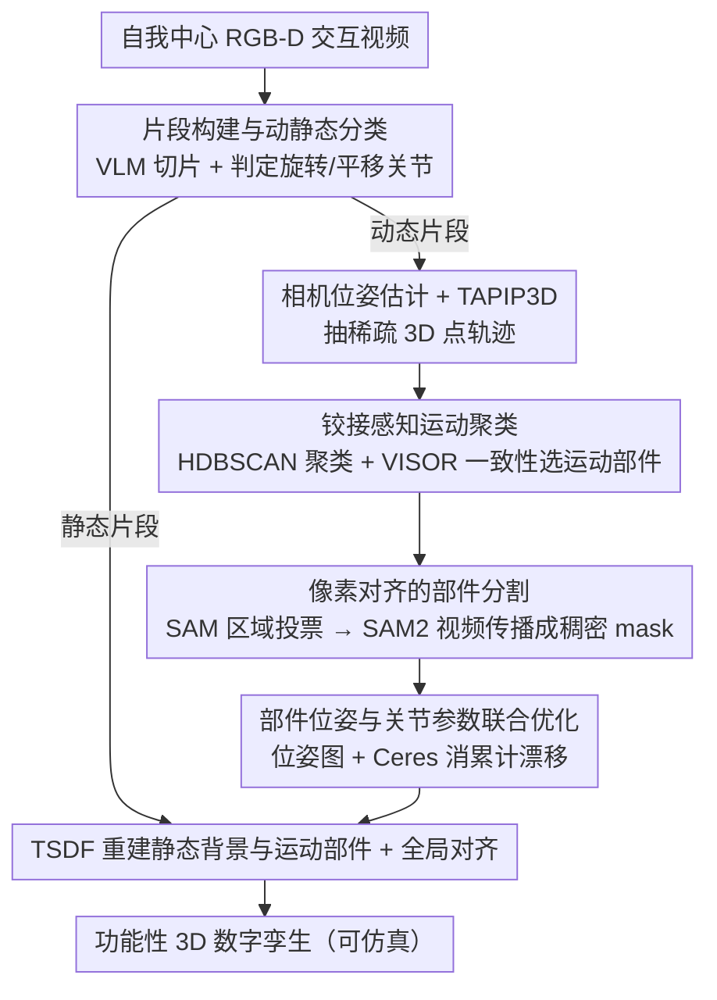

# FunREC: Reconstructing Functional 3D Scenes from Egocentric Interaction Videos

**会议**: CVPR 2026  
**arXiv**: [2604.05621](https://arxiv.org/abs/2604.05621)  
**代码**: [https://functionalscenes.github.io/](https://functionalscenes.github.io/)  
**领域**: 3D视觉  
**关键词**: 功能性3D重建, 自我中心视频, 关节物体重建, 数字孪生, 运动估计

## 一句话总结
本文提出 FunREC，一个无需训练的优化式方法，直接从自我中心 RGB-D 交互视频中重建功能性的铰接式 3D 数字孪生场景——自动发现铰接部件、估计运动学参数、追踪 3D 运动并重建静态和运动几何，在所有基准上大幅超越先前方法（部件分割 mIoU 提升 50+，关节角度误差降低 5-10 倍），并支持仿真导出和机器人交互。

## 研究背景与动机

1. **领域现状**：3D 场景重建取得了长足进展，但现有大规模 RGB-D 数据集（ScanNet、ARKitScenes 等）仅捕获环境的单一静态状态，无法表达门的开合、抽屉的滑动等功能性交互。数字孪生要求不仅捕获几何，还要理解物体如何运动和铰接。

2. **现有痛点**：（1）MultiScan 需要同一房间拍两次（开/关状态）并手动对齐标注，效率极低；（2）SceneFun3D/Articulate3D 在静态 LiDAR 扫描上标注功能性信息，但无法直接观察到运动学属性；（3）digital cousins 方法检索 CAD 代理模型来替代，与实际几何只有松散关联；（4）物体级铰接重建方法普遍假设控制环境、固定相机或已知 CAD 模型，无法处理野外场景级别的重建。

3. **核心矛盾**：人类交互自然地揭示了哪些部件会运动、绕什么关节运动、暴露了什么内部体积——这些丰富的信号没有被利用。现有方法要么依赖多次扫描+手动标注，要么依赖 CAD 检索这种弱代理。

4. **本文目标** 能否从一段普通的自我中心交互视频中，自动重建出完整的、可交互的、物理仿真兼容的功能性 3D 数字孪生？

5. **切入角度**：人类交互提供了最直接和丰富的功能性监督信号。当人们操作环境时，自我中心观察自然揭示了铰接信息。FunREC 利用视觉基础模型的语义和运动先验，无需训练即可完成整个 pipeline。

6. **核心 idea**：通过将自我中心交互视频分段、用基础模型的语义和运动先验发现铰接部件并追踪其运动、联合优化部件位姿和关节参数，直接从视频重建功能性 3D 数字孪生。

## 方法详解

### 整体框架
FunREC 要解决的问题是：给一段人在房间里操作物体的自我中心 RGB-D 视频，自动还原出一个可仿真的功能性数字孪生——不光要几何，还要知道哪个部件会动、绕什么轴动、动了多大幅度。整篇方法是一条**无需训练**的优化式流水线，全程靠现成视觉基础模型的语义和运动先验拼起来，不训练任何新模型。

它的处理顺序是：先把长视频切成"有交互（动态）"和"没交互（静态）"的片段；对每个动态片段，估相机位姿、算稀疏 3D 点轨迹，再从轨迹里把会动的部件聚出来；把聚出的稀疏运动点扩成稠密的像素 mask；把这个部件的逐帧位姿和关节参数放进一个位姿图里联合优化；最后分别用 TSDF 重建静态背景和运动部件，再把所有片段全局对齐成一个统一的数字孪生。下面四个设计点对应这条链路上最关键的四步。

### 关键设计

**1. 片段构建与动静态分类：让 VLM 替代手动标注交互时段**

传统功能性重建最费力的一步是人工标注"哪段视频在交互、关节是什么类型"，FunREC 直接把这件事交给视觉-语言模型（VLM）。VLM 看一遍视频，自动把它切成有交互的动态片段和无交互的静态片段，同时对每个交互预测关节类型是旋转（revolute，如开门）还是平移（prismatic，如拉抽屉）。这样做一方面把"一整段长视频"这个难题拆成若干可独立处理的小片段，降低了后续优化的复杂度；另一方面把原本要靠人标的语义判断，换成了 VLM 的零样本理解，整条流水线因此能脱离人工标注运行。

**2. 铰接感知运动聚类：从几何而非分割网络里发现"会动的部件"**

知道了交互时段，还要在动态片段里精确找出到底是哪块东西在动。FunREC 不靠分割模型猜，而是从运动几何本身入手：先用 TAPIP3D 抽出稀疏 3D 点轨迹，把位移小于阈值 $\epsilon_s$ 的点当静态背景滤掉；对剩下的每个运动点单独拟合一条关节假设（旋转拟合成圆弧、平移拟合成直线），只保留拟合残差低于 $\epsilon_f$ 的点。然后用 HDBSCAN 按关节参数（轴向、枢轴点、运动模式）的相似度把这些点聚类——HDBSCAN 不用预设簇数，正好适配"事先不知道有几个运动部件"的场景。最后拿每个聚类和 VISOR 给的交互物体 mask 比对，算一致性得分 $s_\gamma$，得分最高的那簇就被认定为人正在操作的运动部件。直接从轨迹几何里聚类，比让分割网络去框"哪块在动"鲁棒得多，因为运动信号本身就是最干净的区分依据。

**3. 像素对齐的部件分割：用区域级投票把稀疏轨迹扩成稠密 mask**

上一步得到的运动部件只是一把稀疏点，要重建几何还得有稠密的像素级 mask。如果把稀疏点直接投影到图像上当 mask，遮挡和噪声会让结果很碎。FunREC 改用"区域级投票"：先在关键帧上用 SAM 的自动 mask 生成器做过分割，把画面切成很多小区域；再把运动点和静态点都投影上去，统计每个区域里运动点占的比例

$$\gamma_r = \frac{n_r^m}{n_r^m + n_r^s + \epsilon}$$

其中 $n_r^m$、$n_r^s$ 分别是区域 $r$ 内的运动点数和静态点数。$\gamma_r$ 超过阈值 $\eta_m$ 的区域整块被标成运动部件。这样单个噪声点不会左右整块区域的归属，相当于用"区域多数票"代替"逐点投影"。拿到关键帧 mask 后，再把它当 prompt 喂给 SAM2 的视频传播模块，沿时间扩成整段时间一致的稠密分割序列。

**4. 部件位姿与关节参数联合优化：用位姿图同时锁住运动和关节，消掉累计漂移**

最后要从带噪声的轨迹恢复出全局一致的逐帧部件位姿和一组关节参数。逐帧单独估变换会越积越偏，所以 FunREC 把整段轨迹放进一个位姿图一起优化：每对帧之间先建 3D-3D 对应、用 SupeRANSAC 估出相对变换作为约束，再把相邻帧约束、回环约束（每条带一个可学习的置信度 $l_{ij}^m$，自动压低误匹配的权重）和关节参数约束一并写进目标函数

$$\mathcal{L} = \sum_i f(T_i^m, T_{i+1}^m, T_{i \to i+1}^m) + \sum_{i,j} l_{ij}^m\, f(T_i^m, T_j^m, T_{i \to j}^m) + \mu \sum_{i,j}\big(\sqrt{l_{ij}^m} - 1\big)^2$$

其中 $T^m$ 是部件位姿序列，第三项防止置信度全被压到零。求解时用 Ceres Solver 做非线性优化，并用流形优化强制关节参数满足几何约束（旋转轴落在单位球上、旋转角落在单位圆上）。把位姿和关节参数耦合在同一个能量里联合求解，是 FunREC 相比"3D tracker + RANSAC 直接拟合关节"实现性能跃升的关键——消融显示后者远远不够。

### 一个完整示例：重建一扇被拉开的抽屉
以一段"人走近柜子、拉开一个抽屉、再离开"的自我中心视频为例走一遍：

1. **分片段**：VLM 把视频切成 静态（走近）→ 动态（拉抽屉）→ 静态（离开），并判定这次交互的关节类型是平移（prismatic）。
2. **找运动部件**：在动态片段上，TAPIP3D 抽出几百条 3D 点轨迹；滤掉位移 $<\epsilon_s$ 的墙面、柜体等静态点后，剩下的点各自拟合直线假设，HDBSCAN 把它们聚成"抽屉面板"这一簇，并与 VISOR 的手-物 mask 比对确认就是它。
3. **扩成稠密 mask**：SAM 把关键帧过分割成几十个小区域，抽屉面板所在区域里运动点占比 $\gamma_r$ 高，整块被标为运动部件；SAM2 沿时间传播得到整段的稠密分割。
4. **联合优化**：每对帧建立 3D-3D 对应，位姿图同时解出抽屉每一帧的位姿和那条平移轴的方向、滑动距离。
5. **重建与对齐**：TSDF 分别重建柜体（静态）和抽屉（运动部件），全局对齐后导出一个可在仿真器里真正"拉开"的数字孪生。

### 损失函数 / 训练策略
FunREC 无需训练，唯一的优化目标就是上面那个位姿图能量 $\mathcal{L}$。静态背景和运动部件分别用 TSDF volume 重建，最后用 PREDATOR 提取片段间的几何对应来做全局对齐。

## 实验关键数据

### 主实验——关节运动估计

| 方法 | OmniFun4D轴误差(°) | 位置误差(m) | 状态误差(°/m) | 失败率(%) |
|------|-------------------|-----------|-------------|----------|
| MonST3R (CoTr3) | 46.8/58.9 | 1.20 | 45.3/0.18 | 11.7 |
| BundleSDF (GT mask) | 38.2/55.9 | 0.95 | 23.4/0.20 | 55.0 |
| **FunREC** | **5.3/5.4** | **0.03** | **5.0/0.02** | **1.7** |

FunREC 的轴方向误差仅 5.3°，比 BundleSDF 低 30° 以上；位置误差低一个数量级。

### 6D部件位姿与重建质量

| 方法 | OmniFun4D ADD-S(%) | CD(cm) | HOI4D ADD-S(%) | CD(cm) |
|------|-------------------|--------|---------------|--------|
| MonST3R (GT depth+CoTr3) | 37.12 | 13.9 | 54.83 | 1.3 |
| SpatialTrackerV2 (GT depth) | 29.71 | 9.88 | 60.98 | 0.8 |
| BundleSDF (GT mask) | 22.84 | 17.1 | 53.12 | 1.4 |
| **FunREC** | **78.96** | **3.2** | **79.43** | **0.7** |

ADD-S 精度翻倍以上，Chamfer Distance 大幅降低。

### 运动部件分割

| 方法 | OmniFun4D mIoU | HOI4D mIoU | RealFun4D mIoU |
|------|---------------|-----------|---------------|
| MonST3R | 23.6 | 26.8 | 23.7 |
| SpatialTrackerV2 (SAM2) | 6.2 | 5.8 | 13.4 |
| **FunREC** | **77.9** | **76.4** | **74.8** |

mIoU 提升 50+ 个百分点。

### 关键发现
- FunREC 在所有三个数据集（合成/受控/真实）和所有四个评估任务上都以大幅度领先基线
- 基线方法的失败率很高（BundleSDF 在 OmniFun4D 上 55%），而 FunREC 接近零失败率
- 即使给基线提供 GT depth 和 GT mask 这样的有利条件，FunREC 仍然大幅领先
- 联合优化位姿和关节参数是性能跃升的关键，简单地用 3D tracker + RANSAC 拟合关节参数远远不够

## 亮点与洞察
- **"交互即监督"的范式**：不需要多次扫描或手动标注，人的交互行为本身就是功能性理解的最佳监督信号。这一思路可以迁移到其他需要理解物体功能的任务
- **无需训练的系统设计**：完全基于现有基础模型（VLM、TAPIP3D、SAM2、RoMA、PREDATOR）的能力组合，不训练任何新模型，展示了基础模型组合的强大潜力
- **从稀疏到稠密的分割策略**：稀疏3D轨迹→区域级投票→SAM2 视频传播的三步策略，巧妙地解决了从噪声稀疏信号获得精确稠密分割的问题
- **新数据集贡献**：RealFun4D（351个真实交互视频，4个国家60个公寓）和 OmniFun4D（127个仿真交互序列）填补了功能性场景理解的数据空白

## 局限与展望
- 依赖 RGB-D 输入（需要深度传感器），限制了实际部署场景
- 每次只处理单个铰接部件的交互，无法同时处理多个部件同时运动的复杂场景
- VLM 的关节类型分类可能出错，会导致下游全部失败
- 对于非常小的运动（阈值 $\epsilon_s$ 以下）或完全被手遮挡的部件可能检测不到
- 3D 点追踪器在有遮挡时可能不准确，虽然管线中有过滤机制，但强遮挡仍然是挑战

## 相关工作与启发
- **vs MultiScan**：后者需要同一房间扫描两次+手动对齐，FunREC 从一段交互视频自动完成全部流程，实用性大幅提升
- **vs BundleSDF**：后者需要 GT mask 和固定相机，且假设物体已被预扫描。FunREC 无需任何先验信息，在更难的设置下仍大幅领先
- **vs ArtGS**：后者需要两个静态状态的多视图（开和关），FunREC 处理连续视频，更自然也更实用
- **vs 4D重建方法 (MonST3R)**：这些方法缺乏对铰接语义的理解，无法区分旋转/平移关节，更无法估计关节参数

## 评分
- 新颖性: ⭐⭐⭐⭐⭐ 首次从自我中心交互视频直接重建场景级功能性数字孪生
- 实验充分度: ⭐⭐⭐⭐⭐ 三个数据集（含两个新数据集）、四个评估任务、多个基线对比，差距巨大且一致
- 写作质量: ⭐⭐⭐⭐ 方法描述清晰，实验结果令人信服
- 价值: ⭐⭐⭐⭐⭐ 对具身智能和机器人场景理解有重要推动作用，应用演示（URDF导出、机器人交互）展示了实际价值

<!-- RELATED:START -->

## 相关论文

- [\[CVPR 2026\] Efficiently Reconstructing Dynamic Scenes One D4RT at a Time](efficiently_reconstructing_dynamic_scenes_one_d4rt_at_a_time.md)
- [\[CVPR 2026\] RHINO: Reconstructing Human Interactions with Novel Objects from Monocular Videos](rhino_reconstructing_human_interactions_with_novel_objects_from_monocular_videos.md)
- [\[CVPR 2026\] Volumetric Functional Maps](volumetric_functional_maps.md)
- [\[CVPR 2026\] ForeHOI: Feed-forward 3D Object Reconstruction from Daily Hand-Object Interaction Videos](forehoi_feed-forward_3d_object_reconstruction_from_daily_hand-object_interaction.md)
- [\[CVPR 2026\] MotionScale: Reconstructing Appearance, Geometry, and Motion of Dynamic Scenes with Scalable 4D Gaussian Splatting](motionscale_reconstructing_appearance_geometry_and_motion_of_dynamic_scenes_with.md)

<!-- RELATED:END -->
