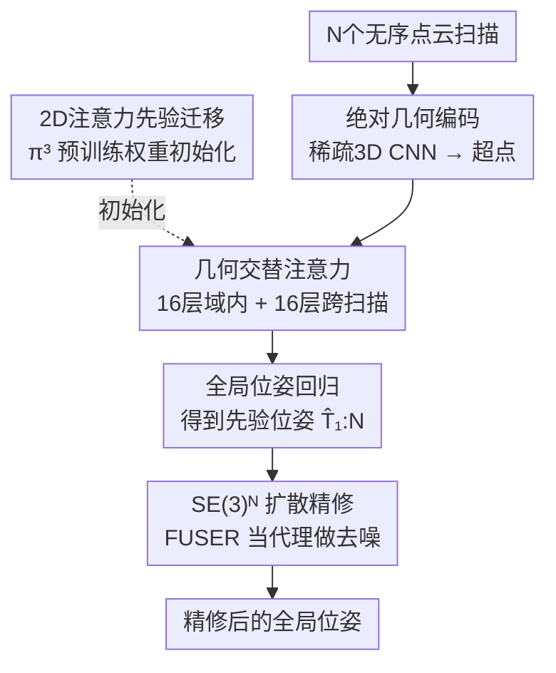

# FUSER: Feed-Forward Multiview 3D Registration Transformer and SE(3)$^N$ Diffusion Refinement

**会议**: CVPR 2026  
**arXiv**: [2512.09373](https://arxiv.org/abs/2512.09373)  
**代码**: https://github.com/Jiang-HB/FUSER （有）  
**领域**: 3D视觉 / 点云配准  
**关键词**: 多视角配准, 前馈Transformer, 位姿同步, SE(3) 扩散, 2D先验迁移

## 一句话总结
FUSER 把"多视角点云配准"从传统的"逐对匹配 + 位姿图同步"两段式流水线，改造成一次前馈推理：把所有扫描一起塞进一个紧凑潜空间联合推理、直接回归每个扫描的全局位姿，再用一个在联合 SE(3)$^N$ 空间上的扩散模型 FUSER-DF 做精修；在 ScanNet/3DMatch/ArkitScenes 上精度大幅领先，且把单序列耗时从几百上千秒降到秒级。

## 研究背景与动机

**领域现状**：多视角点云配准要把一组无序、部分重叠的扫描对齐到同一坐标系，即给每个扫描估计一个全局刚体位姿 $\mathbf{T}_i=(\mathbf{R}_i,\mathbf{t}_i)\in SE(3)$。主流做法是 **pairwise-then-global** 两段式：先对所有扫描两两做配准，构成一张以相对位姿 $\mathbf{T}_{i\leftarrow j}=\mathbf{T}_i^{-1}\mathbf{T}_j$ 为边的位姿图，再做一次位姿同步（transformation synchronization）反解出全局绝对位姿。大量研究精力都花在提升 pairwise 配准精度上，隐含假设是"两两配得越准，多视角自然越一致"。

**现有痛点**：作者把两段式的硬伤拆成四条——(i) **缺全局上下文**：每一对配准都独立进行，看不到其他扫描的几何约束，在低重叠、对称场景里相对位姿会含糊不稳；(ii) **离群点敏感**：少数错的相对位姿会污染同步过程，误差沿位姿图传播放大；(iii) **计算开销大**：$N$ 个扫描要配 $O(N^2)$ 对，每对都要重做特征提取和离群剔除，慢到几百上千秒；(iv) **强归纳偏置**：需要图稀疏化、鲁棒损失、同步调度等一堆手工设计，限制了灵活性也阻碍达到全局最优。

**核心矛盾**：把"全局一致"这个本质是整体性的几何问题，强行拆成一堆孤立的两两子问题再缝合——既丢了全局约束，又把误差累积和算力浪费写进了范式本身。

**本文目标**：彻底跳出两段式，让模型一次性"看到所有扫描"、直接输出每个扫描的全局位姿。

**切入角度**：既然 2D 多视角重建基础模型（VGGT、$\pi^3$ 这类）已经学会了跨视角联合推理，能不能把"所有扫描放进一个 Transformer 联合 attention"这套范式搬到 3D 点云，并把 2D 学到的 attention 先验迁移过来？

**核心 idea**：用一个前馈 Transformer 在紧凑潜空间里对所有扫描做联合几何推理、直接回归全局位姿（FUSER），再用一个以 FUSER 估计为先验的 SE(3)$^N$ 扩散模型做小步精修（FUSER-DF）。

## 方法详解

### 整体框架
FUSER 的输入是一组无序、部分重叠的扫描 $\mathcal{S}=\{\mathbf{S}_i\}_{i=1}^N$，输出是每个扫描的全局位姿 $\hat{\mathbf{T}}_i$，全程不做任何两两配准。流程是：先用一个**绝对坐标感知的稀疏 3D CNN** 把每个扫描压成少量超点（superpoint）特征——关键是要保住"这个扫描大概在世界哪个位置"的绝对平移线索；再用一个 **几何交替注意力** 模块在所有扫描的超点之间交替做"域内 / 跨扫描"消息传递，并用 **2D 注意力先验迁移** 直接拿 $\pi^3$ 的预训练权重来初始化这些注意力层；最后一个全局位姿头把每个扫描的超点特征池化成 scan-level 描述子，回归出平移和旋转。FUSER 给出位姿后，**SE(3)$^N$ 扩散精修（FUSER-DF）** 把这组位姿当先验，在联合位姿流形上做去噪式小步修正，进一步提精度。

### 关键设计

**1. 绝对几何编码：保住绝对平移线索的稀疏 3D CNN**

两段式里的主流描述子（GeoTransformer、RoITr 等）偏好平移不变特征，靠相对坐标归一化（如 KPConv）来稳定两两匹配。但 FUSER 要直接回归**绝对位姿、尤其是平移**，这种"位置无关"的编码反而成了毒药——把全局位置线索抹掉后，模型根本不知道每个扫描落在相机坐标系的哪里，平移回归天然就是病态的。为此作者改用基于 MinkowskiEngine 的**绝对坐标感知稀疏 3D CNN**，对每个扫描做层级体素化和稀疏卷积，得到数量远少于原始点的超点 $\mathbf{S}'_i\in\mathbb{R}^{M_i'\times3}$（$M_i'\ll M_i$）及其特征 $\mathbf{F}_i$。为了让后面"所有扫描一起做 attention"在算力上可行，这里特意用了更深的五层稀疏卷积层级（kernel 3、stride 2）把超点数压得很低；实验证明即便分辨率这么低，超点特征仍保留了足够的几何信息支撑准确的位姿回归

**2. 几何交替注意力：在所有扫描间交替做域内 / 跨扫描推理且对扫描顺序不变**

光有紧凑超点还不够，要让模型"联合理解所有扫描"，但全体扫描两两 attention 的代价又高得吓人。作者借鉴 VGGT 的交替注意力并搬到 3D：Transformer 共 $L=32$ 层，交替排布 16 个**域内（intra-scan）** 块和 16 个**跨扫描（cross-scan）** 块，前者抓单个扫描内部的局部几何、后者建立扫描之间的全局几何关系。两个易踩的坑被针对性解决：其一，VGGT 用可学习的 reference token 来区分参考视角，但这会让结果随扫描输入顺序变化而不稳；FUSER 直接去掉这些 token，强制满足置换等变 $\operatorname{AA}(P_\pi(\mathcal{S}'),P_\pi(\mathcal{F}))=P_\pi(\operatorname{AA}(\mathcal{S}',\mathcal{F}))$，重排扫描不改变其特征。其二，位置编码上不用 VGGT 的 2D RoPE，而换成作用在超点坐标上的正弦位置编码，把绝对位置线索注进每一层 attention；作者也试过相对位置的 3D RoPE，反而掉点，原因是各扫描属于不同坐标系，跨扫描注意力里相对位置信息会产生误导

**3. 2D-to-3D 注意力先验迁移：直接拿 2D 重建基础模型的权重初始化 3D 注意力层**

这是全文最"反直觉但好用"的发现：与其从零训练交替注意力层，不如把 2D 多视角重建基础模型学到的跨视角推理能力迁移过来。作者用 VGGT 变体 $\pi^3$ 在大规模 2D 图像重建上预训练好的权重，**直接初始化** FUSER 的交替注意力层；由于两者结构天然兼容（除 2D/3D 的位置编码和特征编码差异外不做任何架构改动），迁移几乎零成本。跨越 2D→3D 的模态鸿沟还能涨点，作者归因于诸如视角分组、对齐一致性、注意力稀疏性这类**可迁移的注意力先验**，对非结构化 3D 点云出奇地泛化。消融里去掉这个先验掉点非常明显（见 Table 4），这也暗示了"把预训练 2D 注意力模块用于 3D 点云推理"是一个有前景的跨模态方向

**4. FUSER-DF 的 SE(3)$^N$ 扩散精修：以 FUSER 估计为先验、FUSER 自己当代理去噪器**

前馈一遍得到的位姿已经很好，但还想更精。作者把多视角位姿精修建模成在**联合 SE(3)$^N$ 流形**上的去噪扩散，并相对 pairwise SE(3) 扩散做了三处关键改造：(i) **从两两到多视角**——以前只在 $SE(3)$ 上扩散一个相对运动，现在在 $SE(3)^N$ 上扩散整组位姿，全程保住跨扫描依赖；(ii) **从估计到精修**——不再从无信息的单位变换 $\mathbb{H}$ 出发去噪，而是把反向链初始化在 FUSER 的位姿估计 $\hat{\mathbf{T}}_{1:N}$ 上，只做小步修正；(iii) **多视角代理**——以前的去噪器要靠一个两两配准代理模型，根本建模不了多视角，而 FUSER 本身就是多视角配准模型，正好拿来当代理 $f_\theta^{mv}(\mathcal{S}_t)\triangleq\operatorname{FUSER}(\mathcal{S}_t)$，在每个时间步对加噪后的扫描重新估位姿、给出残差变换 $\mathbf{T}_i^{t\to0}$ 来支撑逐步去噪。前向扩散从最优位姿向先验位姿插值并加噪：$\mathbf{T}_i^t=\operatorname{Exp}(\gamma\sqrt{1-\bar\alpha_t}\,\boldsymbol\varepsilon)\,\mathcal{F}(\sqrt{\bar\alpha_t};\mathbf{T}_i^0,\hat{\mathbf{T}}_i)$；反向后验位姿由系数 $\lambda_0,\lambda_1,\lambda_2$ 分别加权最优位姿、当前噪声位姿和先验位姿（$\lambda_2$ 在去噪初期主导、让结果强依赖先验，随去噪推进衰减回常规 SE(3) 形式）。训练上作者推导了一个**先验条件下的变分下界**，其核心的"去噪匹配项"等价于让代理模型预测残差位姿——这恰好就是标准的多视角配准目标，于是 Sec. 3.2.4 的位姿损失可以直接拿来训

### 损失函数 / 训练策略
FUSER 用**无参考（reference-free）相对位姿监督**：直接监督世界系下的绝对位姿是病态的（世界系跨序列/数据集不一致；任选一个参考扫描定义世界系又会破坏置换等变），所以对任意 $i\neq j$ 用预测相对位姿 $\hat{\mathbf{T}}_{i\leftarrow j}=\hat{\mathbf{T}}_i^{-1}\hat{\mathbf{T}}_j$ 去对齐真值，含三项：测地旋转损失 $\mathcal{L}_\mathbf{r}=\arccos\big(\frac{\operatorname{Tr}(\mathbf{R}_{i\leftarrow j}^\top\hat{\mathbf{R}}_{i\leftarrow j})-1}{2}\big)$、带 Huber 的鲁棒平移损失 $\mathcal{L}_\mathbf{t}=\ell_\beta(\hat{\mathbf{t}}_{i\leftarrow j}-\mathbf{t}_{i\leftarrow j})$、以及保证几何一致的逐点损失 $\mathcal{L}_\mathbf{p}$，总损失对所有 $i\neq j$ 求平均、用 $\gamma_t,\gamma_p$（均取 0.1）加权。旋转输出用 9D proxy 经 SVD 正交化投影到 $SO(3)$。FUSER-DF 训练 $T=200$ 步、推理 10 步去噪，扰动权重 $\gamma=0.1$。模型约 0.6B 参数，在 3DMatch/ScanNet/ScanNet++/ArkitScenes 四个室内数据集上用 8×L20 GPU 训练 2 个 epoch（Adam，lr $5\times10^{-5}$）。

## 实验关键数据

### 主实验
三个室内数据集上，FUSER/FUSER-DF 的 `#Pair`（两两配准次数）都是 0，而所有基线都要做上万对。

| 数据集 | 指标 | 最强基线 | FUSER | FUSER-DF |
|--------|------|----------|-------|----------|
| ScanNet (30 scans) | 平移误差均值/中位 (m) | MDGD 0.37/0.31 | 0.15/0.07 | **0.15/0.06** |
| ScanNet (30 scans) | 旋转误差均值/中位 (°) | MDGD 17.4/19.0 | **6.7/2.1** | 7.1/2.0 |
| ScanNet (30 scans) | Rot@3° (%) | MDGD 56.1 | 69.4 | **72.0** |
| 3DMatch (60 scans) | RR (%) ↑ | Full+PARENet 61.9 | 90.3 | **92.0** |
| 3DMatch (60 scans) | RE (°) / TE (m) ↓ | Full+PARENet 31.2/0.68 | 3.2/0.14 | **3.1/0.14** |
| ArkitScenes (200 scans) | RR (%) ↑ | SGHR+GeoTrans 26.7 | 92.1 | **95.0** |
| ArkitScenes (200 scans) | RE (°) ↓ | SGHR+GeoTrans 91.2 | 5.4 | 5.6 |

在 ScanNet 上相比最强的两段式方法 MDGD，平移均值 $0.37\to0.15$ m、旋转均值 $17.4°\to6.7°$；在更现实的单帧 3DMatch（不做 TSDF 融合去噪）和大规模 ArkitScenes 上，RR 直接从 20~60 区间跳到 90+，差距巨大。

### 运行时间（单序列，秒）

| 设置 | GeoTrans (Full) | PARENet (Full) | FUSER | FUSER-DF |
|------|-----------------|----------------|-------|----------|
| 3DMatch (60 scans) | 495.4 | 384.0 | **0.31** | 2.91 |
| ArkitScenes (200 scans) | 2454.6 | 1831.3 | **0.61** | 6.50 |

两段式因为要重复做两两配准，3DMatch 上动辄几百秒、ArkitScenes 上几千秒；FUSER 把它压到亚秒，FUSER-DF 也只到秒级。显存上 200 扫描序列 FUSER 仅 2.83G、FUSER-DF 5.09G（得益于紧凑超点 + FlashAttention）。

### 消融实验（ScanNet）

| 配置 | Rot@3° (%) | 旋转误差均值 (°) | 平移误差均值 (m) |
|------|-----------|------------------|------------------|
| FUSER 全量 (4 数据集) | 69.4 | 6.7 | 0.15 |
| FUSER w/o 2D 注意力先验 (仅 ScaN) | 12.9 | 34.8 | 0.74 |
| FUSER 仅 ScaN | 36.6 | 22.6 | 0.45 |
| FUSER ScaN+ArkitS+ScaNP+3DM | 69.4 | 6.7 | 0.15 |

### 关键发现
- **2D 注意力先验是涨点主力**：同在 ScanNet 训练，去掉 $\pi^3$ 初始化后 Rot@3° 从 36.6 暴跌到 12.9、旋转均值从 22.6° 恶化到 34.8°——跨模态迁移的 attention 先验贡献极大。
- **明显的数据规模效应**：训练数据从 1 个加到 4 个室内数据集，旋转均值 $22.6°\to6.7°$、平移均值 $0.45\to0.15$ m 单调变好，显示出做 3D 基础模型的规模化潜力。
- ⚠️ **FUSER-DF 不是处处更好**：它在严格阈值（Rot@3° 69.4→72.0）和中位误差上提升明显、能让重建表面更平滑，但 ScanNet 上旋转/平移**均值**反而略升（6.7°→7.1°），说明扩散精修主要收紧了高精度区间、对个别难例帮助有限。

## 亮点与洞察
- **范式级转变**：把多视角配准从"逐对匹配 + 同步"的两段式，整体换成"所有扫描一次前馈联合推理"，从根上消掉了误差累积、离群敏感和 $O(N^2)$ 算力浪费——这是论文最大的"啊哈"，效率从分钟级直接到秒级。
- **2D→3D 注意力先验零成本迁移**：不改架构、直接拿 2D 重建基础模型权重初始化 3D 注意力层就能大涨点，这个 trick 很有迁移价值——任何"跨视角/跨实例联合推理"的 3D 任务都可以试着借 VGGT 系预训练权重热启动。
- **绝对 vs 相对编码的取舍很有教益**：当任务从"两两匹配"变成"直接回归绝对位姿"时，长期被奉为圭臬的平移不变/相对坐标编码反而有害，必须换回绝对坐标感知编码——提醒大家编码方式要跟着监督目标走。
- **把前馈模型反过来当扩散代理**：FUSER-DF 用 FUSER 自己充当 SE(3)$^N$ 去噪器的代理模型，让"估计"和"精修"复用同一个网络，是个优雅的结构复用。

## 局限与展望
- **模型偏重、数据需求大**：约 0.6B 参数、需 8×L20 训练、依赖四个大规模室内数据集联合训练才达到最佳——小数据/小算力场景能否复现存疑。
- **均值指标未全面占优**：FUSER-DF 在 ScanNet 旋转/平移均值上略逊于 FUSER（作者自己的表里可见），扩散精修对难例的鲁棒性还有提升空间。
- **泛化范围待验证**：实验全在室内 RGB-D 重建场景，对室外大尺度 LiDAR、低重叠/无重叠、动态场景等是否同样有效未知。
- **超点分辨率是双刃剑**：靠很低分辨率超点换算力，极端细粒度对齐或薄结构场景可能丢信息，可探索自适应分辨率或多尺度超点。

## 相关工作与启发
- **vs 两段式同步方法（SGHR / MDGD / HARA / LITS 等）**：它们都在 pairwise-then-global 框架内做文章——靠重叠预测、三元组一致性、鲁棒平均或层级初始化来挑可靠扫描对、改进同步；本文直接废掉两两配准这一步，单次前馈出全局位姿，既免了误差传播又快了 2-3 个数量级。
- **vs pairwise SE(3) 扩散配准 [38]**：那篇在 $SE(3)$ 上对单个相对运动从单位变换去噪做两两估计；FUSER-DF 把扩散搬到联合 $SE(3)^N$、以 FUSER 估计为先验只做小步精修、并用多视角模型当代理，三点改造都是为了"多视角"而非"两两"。
- **vs VGGT / $\pi^3$（2D 重建基础模型）**：本文把它们的交替注意力范式和预训练权重迁移到 3D 点云，但去掉了破坏置换等变的 reference token、并把 2D RoPE 换成超点正弦位置编码——是一次具体而成功的 2D→3D 基础模型迁移示范。

## 评分
- 新颖性: ⭐⭐⭐⭐⭐ 首个前馈多视角配准 Transformer，叠加 SE(3)$^N$ 扩散精修与 2D→3D 先验迁移，是范式级创新
- 实验充分度: ⭐⭐⭐⭐⭐ 三数据集 + 多基线 + 运行时间/显存/数据规模/先验消融，覆盖到位
- 写作质量: ⭐⭐⭐⭐ 动机和方法讲得清楚，但扩散部分公式密集、对非专家略陡
- 价值: ⭐⭐⭐⭐⭐ 精度大幅领先且把耗时从分钟降到秒级，对 3D 重建/AR/具身落地实用价值高

<!-- RELATED:START -->

## 相关论文

- [\[CVPR 2026\] MVInverse: Feed-forward Multiview Inverse Rendering in Seconds](mvinverse_feed-forward_multiview_inverse_rendering_in_seconds.md)
- [\[CVPR 2026\] Z-Order Transformer for Feed-Forward Gaussian Splatting](z-order_transformer_for_feed-forward_gaussian_splatting.md)
- [\[CVPR 2026\] Feed-forward Gaussian Registration for Head Avatar Creation and Editing](feed-forward_gaussian_registration_for_head_avatar_creation_and_editing.md)
- [\[CVPR 2026\] Particulate: Feed-Forward 3D Object Articulation](particulate_feed-forward_3d_object_articulation.md)
- [\[CVPR 2026\] MoRe: Motion-aware Feed-forward 4D Reconstruction Transformer](more_motion-aware_feed-forward_4d_reconstruction_transformer.md)

<!-- RELATED:END -->
