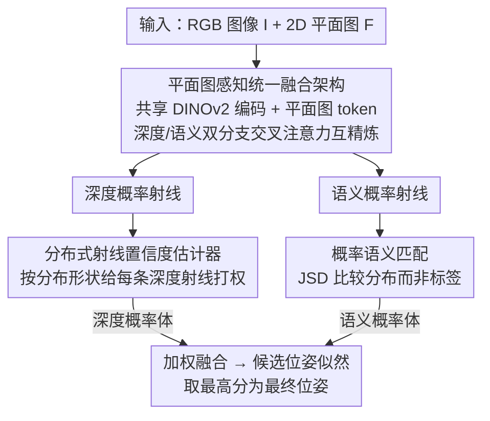

# Fusion of Depth and Semantics for Probabilistic Floorplan Localization

**会议**: CVPR 2026  
**论文**: [CVF Open Access](https://openaccess.thecvf.com/content/CVPR2026/html/Ye_Fusion_of_Depth_and_Semantics_for_Probabilistic_Floorplan_Localization_CVPR_2026_paper.html)  
**代码**: 未公开  
**领域**: 3D视觉  
**关键词**: 平面图定位, 室内定位, 射线匹配, 深度-语义融合, 概率匹配

## 一句话总结
本文把"用一张 RGB 图在 2D 平面图上估计相机位姿"的射线匹配任务做成了一个**概率框架**：在共享表征上耦合预测深度射线与语义射线、用基于分布的置信度给每条深度射线打权重、再用 JSD 做软语义匹配，从而同时压制室内场景中的环境/几何/语义三类歧义，在 Structured3D 和 ZInD 上把 1m·30° 召回率显著推高（S3D-full 57.5%→71.4%）。

## 研究背景与动机
**领域现状**：室内视觉定位若依赖 3D 重建或大型图像库，建图和维护成本高。平面图（floorplan）定位换了个思路——平面图轻量、长期稳定、对外观不敏感，是机器人和 AR 里很有吸引力的替代方案。近年 SOTA 把它建模成**射线匹配**：把图像表示成一组从相机发出的等角射线，给每条射线标上深度或语义标签，再和平面图渲染出的射线对齐，挑出得分最高的候选位姿。

**现有痛点**：射线匹配方法分两派且各有短板。一派只用深度（F3Loc/UnLoc），度量信息强，但在墙体布局相似、结构几何重复的房间里分不清位姿；另一派用离散语义标签（SemRayLoc 给每条射线打 door/window 这类硬标签）提升了判别力，但硬标签 + 多数投票降采样**没法表达语义本身的模糊性**。更关键的是两派都把深度网络和语义网络拆开训练、只在最后做一次加权融合，丢掉了几何与语义之间的互相约束。

**核心矛盾**：作者把根因统一归结为图像-平面图匹配中的**感知歧义（perceptual ambiguity）**——丰富但带噪的图像观测与稀疏但结构化的平面图之间存在信息不对称，具体沿三条轴展开：① **环境歧义**：RGB 里的家具/动态遮挡等非结构元素让深度和语义各自"咬"住不同的场景噪声，无法收敛到一致解释；② **几何歧义**：即便深度估得准，一条射线上仍有多个合理深度候选，必须挑出对应平面图深度（而非图像深度）的那个；③ **语义歧义**：室内语义常非互斥（一扇玻璃门同时像门又像窗），硬标签很脆。

**本文目标**：用一个统一框架同时处理这三类歧义，而不是为每类歧义打补丁。

**核心 idea**：把深度和语义放在**同一套射线、同一个共享表征**上联合建模并让二者特征级互相精炼，再把每条射线的预测保留成**概率分布**——用分布形状估"这条深度射线该信几分"的置信度、用分布间的 JSD 做语义匹配，让模糊性被保留和利用，而不是被硬标签拍平。

## 方法详解

### 整体框架
输入是一张单目 RGB 图像 $I$ 和房屋的 2D 平面图 $F$，输出是平面图坐标系下的相机位姿 $p=(x,y,\theta)$。沿用 F3Loc 的射线建模：把状态空间离散成一组候选位姿，对每个候选位姿，比较图像观测与从平面图渲染出的射线，构造观测似然 $P(I\mid p,F)$。

整个方法分两个阶段。**第一阶段**——平面图感知统一融合架构：共享编码器 + 耦合的深度/语义双分支，输出平面图对齐的概率射线（每条射线给出离散距离 bin 上的深度分布、语义类别分布、以及一个房间类型预测）。**第二阶段**——把这些逐射线分布转成逐位姿的观测似然：深度分布交给基于分布的射线置信度估计器，重加权每条射线在"预测深度 vs 平面图渲染深度"比较中的贡献，得到深度概率体；语义分布用 JSD 与平面图语义匹配，得到语义概率体；两者加权求和得到最终似然，取最高分位姿为结果。

### 关键设计

**1. 平面图感知统一融合架构：让几何与语义在同一表征上互相精炼**

针对的是"环境歧义"以及旧方法深度/语义双网络分训、晚期融合丢掉跨模态约束的问题。作者的观察是：同一条射线上的几何与语义是紧耦合的——射线是否穿过一扇门约束了它可行的深度剖面，而深度的突变又为"门框"这类语义边界提供强证据；忽略这种耦合就让模型更容易被杂物误导。

具体做法：先用 DINOv2 图像编码器 $\phi_{img}$ 抽出稠密特征图 $Z\in\mathbb{R}^{H\times W\times C}$ 和全局描述子 $z_{cls}$（后者用于房间分类）；平面图及其 mask 经平面图编码器 $\phi_{fp}$ 编成全局布局 token $t_F\in\mathbb{R}^{C}$，给网络注入场景尺度、结构模板等先验。然后对 $Z$ 做**垂直池化**：把宽度自适应池化到 $W_0$ 得到 $Z'$，每条射线 $w$ 对应一个竖直 token 序列 $S_w=[Z'_{1,w};\cdots;Z'_{H,w}]$，再把平面图 token 拼进去得到 $\hat S_w=[S_w;t_F]$。深度和语义分支各自维护一组**可学习查询** $\{q^d_w\}$、$\{q^s_w\}$，对共享序列做多头注意力读出初始表征：

$$h^{d,0}_w=M(q^d_w,\hat S_w,\hat S_w),\qquad h^{s,0}_w=M(q^s_w,\hat S_w,\hat S_w).$$

这一步把旧方法的"垂直均值池化"换成"模态专属的可学习读出算子"——深度分支学着抽细粒度几何线索，语义分支汲取更广的上下文。随后两组特征过一叠**交叉注意力块**迭代互精炼，在第 $l$ 层：

$$\hat H^{d,l}=CA(H^{d,l-1},H^{s,l-1}),\quad \hat H^{s,l}=CA(H^{s,l-1},H^{d,l-1}),$$

再各自接残差前馈 $H^{d,l}=H^{d,l-1}+f_d(\hat H^{d,l})$（语义同理）。通过这种交换，几何歧义可借语义上下文化解，语义预测又被几何结构正则化。最终射线特征经轻量 MLP 头投影成深度/语义概率射线。消融里这一架构本身（UFA）就比 SemRayLoc 双网络分训在 1m·30° 上高 10.2%。

**2. 分布式射线置信度估计器：用深度分布形状判断"这条射线该不该信"**

针对"几何歧义"。旧方法只用平面图 GT 深度去监督预测深度，这等于强迫一个预测器同时干两件事——既要忠于图像证据估深度，又要对每条模糊射线决定"localization 该用哪个深度"，在杂乱室内常常两件都干不好；靠加大模型能缓解但会破坏室内定位的实时性。作者的关键洞察是：**歧义往往直接写在预测分布里**，比如近处和远处结构都占质量的双峰/多峰分布。

于是把"估深度"和"判可靠性"解耦：深度分支专心预测每条射线的深度分布，另设一个轻量置信度模块下调不可靠射线的权重。设第 $i$ 条射线的深度 logits 为 $x_i\in\mathbb{R}^{D}$（$D$ 个离散深度 bin），softmax 得分布 $\pi_i$，预测深度取其期望。把射线 token 与分布分别投影到低维 $f_{ray}=\phi_{ray}(r_i)$、$f_{dist}=\phi_{dist}(\pi_i)$，再拼上分布熵 $H_i$（额外标量不确定度，对宽/多峰分布尤其敏感），过线性层 + sigmoid 得每条射线的标量置信度 $c_i=\sigma(f_c([f_{ray};f_{dist};H_i]))\in[0,1]$。推理时对候选位姿 $p$ 渲染平面图深度 $d^{fp}_i(p)$，用置信度加权的深度差异作几何项：

$$D_d(p)=\frac{1}{W_0}\sum_{i=1}^{W_0} c_i\,\lvert \hat d_i-d^{fp}_i(p)\rvert,$$

再反尺度成深度概率体（差异小→概率高）。训练时监督被拆成互补两份：期望深度 $\hat d_i$ 用 L1 对齐 GT 深度；置信度用 $L_{conf}=\frac{1}{W_0}\sum_i\big(\lvert \hat d_i-d^{gt}_i\rvert\cdot c_i+\lambda(1-c_i)^2\big)$，让"误差大的射线"自动被降权，$\lambda(1-c_i)^2$ 防止置信度整体塌成 0。文中分析显示置信度与深度误差强相关，且对熵 $H\approx1.1$ 附近的"近乎对称双峰"（典型几何歧义）给出特别低的置信度。

**3. 概率语义匹配（JSD）：保留语义模糊性，而非用硬标签把它惩罚掉**

针对"语义歧义"。SOTA 普遍给每条射线打硬标签、靠"标签是否相等"惩罚不匹配，有两个毛病：硬标签表达不了语义模糊（玻璃门既是门又是窗），会过度惩罚"不确定但合理"的预测；硬标签不可插值，降采样只能多数投票而丢信息。SemRayLoc 试过用交叉熵（CE）做软匹配但性能暴跌——作者归因于 CE 在目标概率 $p_k$ 很小时会给出**任意大的代价**，一条解释得差的射线就能主导整个位姿得分；且 CE 对 logits 的温度缩放过于敏感、匹配很脆。

作者改成**比较分布而非标签**：语义头对每条射线 $R_i$ 输出 $C_s$ 维概率向量，对候选位姿 $p$ 渲染位姿条件目标分布 $P_i$，用 JSD 度量语义不相似度：

$$D_s(p)=\sum_{i=1}^{W_0}\mathrm{JSD}(R_i\,\|\,P_i),$$

再反尺度（缩放参数 $\alpha$）成语义概率体。JSD 是对称、有界的分布差异，比较的是 $R_i$ 与 $P_i$ 的**形状**：对"模糊但兼容"的预测只给有限合理惩罚而非把它打到谷底，从而保留模糊性、避免过惩罚；实测它对温度也比 CE 稳得多。更妙的是 $R_i$ 活在概率单纯形上，降采样时可**线性插值概率向量**（把 40 条射线聚合成 9 条而保留不确定度与相对偏好），而硬标签降采样会退化成多数投票丢掉细粒度结构。最后语义概率体与深度概率体加权求和，取最高分候选位姿为最终预测。

### 损失函数 / 训练策略
仍沿用平面图 GT 深度做监督但拆成互补两路：期望深度走 L1，置信度走 $L_{conf}$（见设计 2）。融合权重为固定权重的加权和。作者在结论里把"超越分支级标签监督、固定融合权重，转向位姿监督的端到端训练"列为未来方向。

## 实验关键数据

### 主实验
数据集：Structured3D（合成，full 含家具 3296 房 / empty 无家具 3496 房）与 ZInD（真实，1575 场景，全景裁成透视图）。指标为 0.1m / 0.5m / 1m / 1m·30° 阈值下的定位召回率（%）。Oursd 表示只用本模型深度分支；ORACLE 是用 GT 深度+语义射线的上界。

| 数据集 | 指标(1m·30°) | 本文(Ours) | SemRayLoc(SOTA) | F3Loc | 说明 |
|--------|------|------|------|------|------|
| S3D(full) | 召回% | **71.4** | 57.5 | 21.3 | 相对提升 13.9% |
| S3D(full) | 0.1m | **12.0** | 5.7 | 1.5 | 严苛阈值翻倍 |
| S3D(empty) | 召回% | **75.1** | 67.2 | 42.8 | |
| ZInD(真实) | 召回% | **50.2** | 31.9 | 11.5 | 合成→真实泛化 |

鲁棒性对比很说明问题：从 empty 切到 full（加家具变杂乱），F3Loc 从 42.8%→21.3% 掉 21.5 个点、SemRayLoc 67.2%→57.5%，而本文仅从 75.1%→71.4% 掉 3.7 个点。另外 Oursd（只用深度分支）就已超过近期纯深度基线，说明统一融合架构反过来让深度分支也变可靠。

底层预测质量（S3D-full）：

| 方法 | 深度 MAE↓ | 语义 ACC(4类)↑ |
|------|------|------|
| SemRayLoc | 0.423 | 89.1 |
| Ours | **0.287** | **94.5** |

### 消融实验
S3D(full)，1m·30° 召回率（%）。FPA=平面图感知，confidence=分布式置信度，JSD=概率语义匹配，refine=SemRayLoc 的 40 射线精修；UFA=本文统一融合架构。

| 框架 | FPA | confidence | JSD | refine | 1m·30° |
|------|-----|-----|-----|-----|------|
| SemRayLoc | ✗ | ✗ | ✗ | ✗ | 48.4 |
| SemRayLoc | ✗ | ✗ | ✗ | ✓ | 57.5 |
| SemRayLoc | ✗ | ✗ | ✓ | ✓ | 58.5 |
| UFA | ✗ | ✗ | ✗ | ✓ | 67.7 |
| UFA | ✓ | ✗ | ✗ | ✓ | 69.0 |
| UFA | ✗ | ✓ | ✗ | ✓ | 69.8 |
| UFA | ✗ | ✗ | ✓ | ✓ | 70.2 |
| UFA | ✓ | ✓ | ✓ | ✓ | **71.4** |

### 关键发现
- **统一融合架构贡献最大**：同样带 refine，UFA 比 SemRayLoc 双网络高 10.2%（67.7 vs 57.5），证明深度-语义互相强化的必要性。
- **平面图感知（FPA）增益最小**（UFA 上 +1.3%）：作者归因于 S3D 房间结构缺乏多样性（多为矩形、尺寸相近），并预期在学校/曲墙等更多样环境中 FPA 影响会更大。
- **置信度估计器行为可解释**：高熵射线（常源于遮挡的多峰分布）被正确赋低置信度；在熵 $H\approx1.1$ 附近的对称双峰（典型几何歧义）被额外重罚，而非对称双峰（单峰占优）则给较高置信度。
- **JSD 在无 refine 时收益更大**：去掉 refine 后定位只靠 9 条粗射线（从 40 条压缩），降采样方式变得关键——此时 JSD 给 SemRayLoc 带来 8.7% 提升（带 refine 时为 2.5%），因为硬标签压缩退化成多数投票丢信息，而 JSD 聚合分布保留了不确定度。

## 亮点与洞察
- **把"歧义"从需要消除的噪声，重构成需要保留和利用的信息**：置信度估计器主动识别多峰深度并降权、JSD 主动保留语义模糊——这套"概率优先、晚拍平"的思路对任何需要在结构化地图上做匹配的任务（点云配准、车道线-高精地图匹配）都可迁移。
- **可学习查询当"模态专属读出算子"**：用一组 query 从共享特征图按模态各取所需，替代固定的垂直均值池化，是把单一表征拆给多任务用的轻量做法。
- **JSD 替代 CE 的诊断很精彩**：明确指出 CE 在小目标概率处代价爆炸、对温度敏感这两个具体失效点，再用有界对称的 JSD 对症下药，比"换个损失试试"有说服力得多。

## 局限与展望
- **分支级标签监督 + 固定融合权重**：作者承认深度/语义的相对重要性是手设的固定权重，未来想转向位姿监督的端到端训练让模型自学权重。
- **FPA 在当前数据集上收益有限**，依赖更多样的房型才能体现价值——意味着在 S3D 这类规整数据上平面图先验的潜力没被充分检验。⚠️ 这也让 FPA 的真实贡献存疑。
- **仍是离散候选位姿 + 射线渲染的框架**，候选位姿粒度、深度 bin 数等离散化超参未在正文充分给出敏感性分析。
- 代码未公开，复现需自行实现 DINOv2 编码、可学习查询读出与 JSD 匹配等细节。

## 相关工作与启发
- **vs SemRayLoc**：SemRayLoc 也用语义射线但靠硬标签 + 多数投票降采样 + 标签相等匹配；本文把语义全程保留成概率分布、用 JSD 软匹配、用可插值降采样，并把深度/语义从双网络晚融合改成共享表征早耦合。区别在于"硬 vs 软、晚融 vs 早融"，本文在 S3D-full 上 1m·30° 高 13.9% 相对提升。
- **vs F3Loc / UnLoc**：F3Loc 开创单图等角深度射线匹配，UnLoc 用 Laplace 分布建模深度不确定度。本文认为单峰 Laplace 不足以刻画室内深度的多峰歧义，改用离散分布 + 基于分布形状的置信度，并额外引入语义分支。
- **vs LASER / LaLaLoc / PF-Net**：这些把图像和平面图编进共享嵌入做近邻/粒子滤波，常假设全景或正立视角、几何对齐只能粗控；本文是细粒度射线级匹配，对单目透视图更友好。

## 评分
- 新颖性: ⭐⭐⭐⭐ 把三类歧义统一成"概率保留"框架，JSD 软语义匹配与分布式置信度是有针对性的新设计
- 实验充分度: ⭐⭐⭐⭐ 两数据集+合成/真实泛化+逐组件消融+置信度行为可视化分析，较完整；离散化超参敏感性略缺
- 写作质量: ⭐⭐⭐⭐⭐ 三类歧义的问题分解清晰，每个设计都对症一类歧义，CE→JSD 的失效诊断尤其透彻
- 价值: ⭐⭐⭐⭐ 平面图定位轻量实用，"保留而非拍平歧义"的思路对结构化地图匹配类任务有普适启发

<!-- RELATED:START -->

## 相关论文

- [\[CVPR 2026\] C-GenReg: Training-Free 3D Point Cloud Registration by Multi-View-Consistent Geometry-to-Image Generation with Probabilistic Modalities Fusion](c-genreg_training-free_3d_point_cloud_registration_by_multi-view-consistent_geom.md)
- [\[ECCV 2024\] ProDepth: Boosting Self-Supervised Multi-Frame Monocular Depth with Probabilistic Fusion](../../ECCV2024/3d_vision/prodepth_boosting_self-supervised_multi-frame_monocular_depth_with_probabilistic.md)
- [\[CVPR 2026\] LoST: Level of Semantics Tokenization for 3D Shapes](lost_level_of_semantics_tokenization_for_3d_shapes.md)
- [\[CVPR 2026\] Towards Visual Query Localization in the 3D World](towards_visual_query_localization_in_the_3d_world.md)
- [\[ECCV 2024\] PCF-Lift: Panoptic Lifting by Probabilistic Contrastive Fusion](../../ECCV2024/3d_vision/pcf-lift_panoptic_lifting_by_probabilistic_contrastive_fusion.md)

<!-- RELATED:END -->
