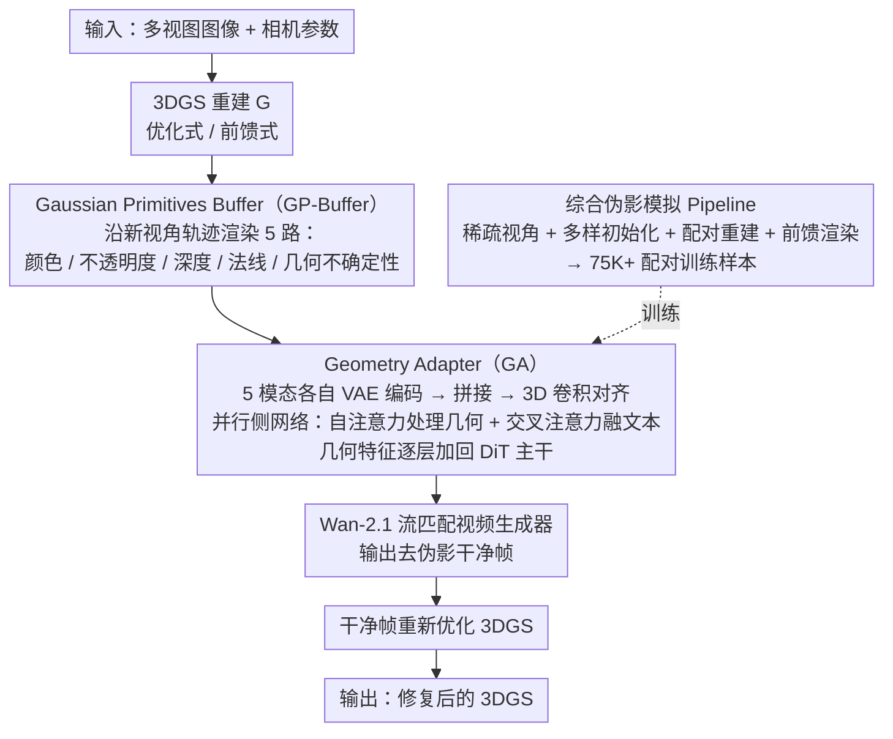

# GaussFusion: Improving 3D Reconstruction in the Wild with A Geometry-Informed Video Generator

**会议**: CVPR 2026  
**arXiv**: [2603.25053](https://arxiv.org/abs/2603.25053)  
**代码**: 无  
**领域**: 3D视觉 / 新视角合成  
**关键词**: 3D高斯溅射, 视频生成模型, 几何先验, 伪影修复, 实时推理

## 一句话总结
提出 GaussFusion，一个几何信息引导的视频到视频生成模型，通过渲染包含深度、法线、不透明度和协方差的 Gaussian Primitives Buffer（GP-Buffer）来条件化视频生成器，有效去除 3DGS 重建中的浮动伪影、闪烁和模糊，且能同时适用于优化式和前馈式两种重建范式，蒸馏版本达到 16 FPS 实时推理。

## 研究背景与动机
1. **领域现状**：3D 高斯溅射（3DGS）已成为主流的 3D 重建表示方法，分为优化式（per-scene optimization）和前馈式（feed-forward prediction）两条技术路线。
2. **现有痛点**：两种范式在稀疏视角和覆盖不足场景下仍会产生严重伪影——浮动物体（floaters）、闪烁（flickering）、模糊（blur）和几何错误。现有修复方法（如 Difix3D、GenFusion、ExploreGS）仅基于 RGB 渲染进行条件化，无法处理大面积浮动物体和缺失区域；且通常只针对某一种重建范式训练，无法跨范式泛化。
3. **核心矛盾**：现有方法仅利用了高斯原语的颜色信息，忽略了深度、不透明度、法线、协方差等丰富的几何线索。同时，训练数据中缺乏多样化的伪影模拟，导致模型过拟合于特定重建流程。
4. **本文目标** 如何训练单一模型既能处理优化式 3DGS 的伪影又能处理前馈式 3DGS 的伪影？
5. **切入角度**：（1）将 3DGS 的全部原语属性编码为像素对齐的视频表示（GP-Buffer），提供比纯 RGB 更丰富的几何线索；（2）设计综合的伪影模拟 pipeline 覆盖多种退化模式。
6. **核心 idea**：用包含完整高斯原语几何信息的 GP-Buffer 来条件化视频生成模型，结合跨范式的伪影模拟策略实现通用的 3DGS 修复。

## 方法详解

### 整体框架
GaussFusion 想解决的是同一个问题在两条技术路线上的两副面孔：无论是优化式还是前馈式的 3DGS，在稀疏视角下都会冒出浮动物、闪烁和模糊，而现有的修复模型只看 RGB 渲染、又各自只服务一种范式。它的做法是把"修复"交给一个视频生成器，但不让它盲修——先沿新视角轨迹把这套 3DGS 重建 $\mathcal{G}$ 渲染成一组带几何信息的缓冲（GP-Buffer），再把缓冲编码后注入到基于 Wan-2.1 的流匹配视频生成器里，让生成器在几何线索的引导下吐出去掉伪影的视频帧；这些干净帧反过来再去优化原始的 3DGS。整条链路输入是多视图图像加相机参数，输出是修复后的 3DGS 表示，中间所有跨范式的差异都被前置到"怎么造训练数据"这一环消化掉。

### 关键设计

**1. Gaussian Primitives Buffer（GP-Buffer）：把高斯的几何全摊到像素上，让模型看得穿伪影**

只拿 RGB 去条件化生成器，最大的难处是模型分不清"这块是正确的渲染"还是"这块是大面积缺失或几何错误"——颜色对了不代表几何对。GP-Buffer 的应对是把每个高斯原语的完整属性都渲染成像素对齐的通道：颜色 $\mathbf{C}$、不透明度 $A$、深度 $D$、法线 $\mathbf{N}$、几何不确定性 $\mathbf{U}$ 共 5 路。法线不是单独预测的，而是从相机空间位置图用有限差分取叉积得到 $\mathbf{N}(\mathbf{u}) = \text{normalize}(\partial_u \mathbf{P}_{\text{cam}} \times \partial_v \mathbf{P}_{\text{cam}})$；几何不确定性则用 alpha-blending 把逆协方差矩阵的唯一元素渲染下来——低纹理区域往往用少量大高斯铺成，数值偏低，高频区域数值偏高，于是这个通道天然成了一张"局部结构有多规整"的图。正是这几路几何通道给了模型透视能力：消融里每补一个模态指标都在涨，而最被忽视的协方差不确定性通道带来的 FID 改善反而最大（8.61→6.72），因为它最直接地标出了"这里是少量大高斯凑出来的低质量区"。

**2. Geometry Adapter（GA）：用并行侧网络做层级化注入，而不是把条件潜变量硬加上去**

有了 GP-Buffer，下一个问题是怎么把它喂进生成器。GenFusion、ExploreGS 那类做法是把条件潜变量直接加到噪声潜变量上，简单但对齐很糙。GaussFusion 改成先把 5 个模态各自用 VAE 编码成视频潜变量，拼接后过 3D 卷积对齐空间和通道维度，再交给 GA 块——它是挂在 DiT 主干旁的并行侧网络，内部用自注意力处理几何特征、用交叉注意力融进文本描述，产出几何感知特征 $\mathbf{x}_g$ 后逐层加回主流潜变量：

$$\mathbf{x} \leftarrow \mathbf{x} + \mathbf{x}_g$$

训练时基础模型整个冻住，只学 GA 层。这种层级化注入比"一加了之"对得更准，消融里 PSNR 从 20.90 抬到 22.55，比直接加条件潜变量高出约 1.6 dB。

**3. 综合伪影模拟 Pipeline：用一套退化数据把两种范式的伪影都灌进训练集**

模型为什么能跨范式，关键不在网络而在数据。之前的方法只靠均匀降采样加欠拟合来造伪影，结果模型只学会修优化式 3DGS 那一类毛病。这里把退化来源摊成四种并混在一起：稀疏视角上随机保留 5% 帧（比均匀抽帧更接近真实的覆盖不足）；初始化故意多样化，混用 SfM、随机点云和 MapAnything 的密集点图；配对重建上干净模型吃全部视图加完整优化、退化模型只给稀疏子集加砍掉的优化步数，凑出"同场景一好一坏"的监督对；最后还直接渲染前馈模型 DepthSplat 预测出的高斯，把前馈特有的几何不一致和半透明伪影也收进来。这样攒出 75K+ 配对视频样本，覆盖的退化谱足够宽，单一模型才得以同时压住优化式和前馈式两边的伪影。

### 损失函数 / 训练策略
训练用流匹配目标 $\mathcal{L} = \mathbb{E}[\|u_\theta(x_t, c, t) - v_t\|^2]$。为了把多步生成器压到能实时跑，推理走两阶段微调：先用 Distribution Matching Distillation（DMD）把多步生成器蒸馏成 4 步模型，再冻住蒸馏后的模型、只微调 GA 层补回几何对齐。基础模型是 Wan-2.1-1.3B，GA 额外引入 0.6B 参数，全程在 8×H200 GPU 上训练 100K 步。

## 实验关键数据

### 主实验（DL3DV 数据集，优化式 3DGS 修复）

| 方法 | PSNR ↑ | SSIM ↑ | LPIPS ↓ | FID ↓ | 推理速度 |
|------|--------|--------|---------|-------|---------|
| Splatfacto (baseline) | 17.42 | 0.605 | 0.412 | 6.49 | 118.3 FPS |
| GenFusion | 18.36 | 0.690 | 0.391 | 9.98 | 1.1 FPS |
| Difix3D+ | 20.10 | 0.765 | 0.302 | 4.22 | 12.8 FPS |
| ExploreGS | 20.69 | 0.760 | 0.345 | 6.27 | 1.2 FPS |
| **Ours (Full)** | **22.55** | **0.832** | **0.278** | **3.93** | 4.3 FPS |
| **Ours (Few-step)** | **22.49** | **0.842** | **0.288** | 7.38 | **15.1 FPS** |

### 消融实验（GP-Buffer 模态消融，DL3DV）

| RGB | Depth | Normal | Alpha | Cov. | PSNR ↑ | LPIPS ↓ | FID ↓ |
|-----|-------|--------|-------|------|--------|---------|-------|
| ✓ | | | | | 19.15 | 0.385 | 15.45 |
| ✓ | ✓ | | | | 19.29 | 0.361 | 10.54 |
| ✓ | ✓ | ✓ | | | 19.74 | 0.355 | 10.29 |
| ✓ | ✓ | ✓ | ✓ | | 19.96 | 0.344 | 8.61 |
| ✓ | ✓ | ✓ | ✓ | ✓ | **20.75** | **0.329** | **6.72** |

### 关键发现
- GP-Buffer 的每个几何模态都有独立贡献。协方差不确定性通道（Cov.）虽然被忽视，但带来了最大的 FID 改善（8.61→6.72）。
- 联合训练（混合多个数据集和退化类型）比单数据集训练效果更好，证明了跨范式伪影模拟的重要性。
- GaussFusion 在前馈模型 DepthSplat 上也能提升性能（PSNR 21.77→22.80），而 Difix3D+ 和 ExploreGS 反而降低了前馈模型的 PSNR。
- 蒸馏后的 4 步模型在 PSNR/SSIM/LPIPS 上几乎不降，但 FID 略高（3.93→7.38），实现了 16 FPS 的实时推理。
- Geometry Adapter 比直接加条件潜变量的方式在 PSNR 上高出 1.6 dB。

## 亮点与洞察
- **GP-Buffer 的设计非常有洞察力**：通过渲染高斯原语的完整属性（而不仅仅是颜色），为修复模型提供了"X光"般的透视能力。特别是协方差不确定性通道，让模型能识别出哪些区域是由少量大高斯覆盖的（即质量差的区域）。
- **范式无关的修复**：通过综合伪影模拟策略，单一模型可以同时处理优化式和前馈式 3DGS 的伪影——之前没有方法能做到这一点。这对实际部署非常重要。
- **蒸馏策略的实用性**：16 FPS 的实时推理速度使得 GaussFusion 可以在渲染时"即时"修复帧，而不需要离线处理。

## 局限与展望
- 作为视频生成模型，即使蒸馏后仍引入 0.6B 额外参数，对内存和计算的要求较高。
- 生成的帧在极端视角变化时可能丢失高频细节（蒸馏后 FID 升高）。
- 当前方法生成修复帧后仍需要重新优化 3DGS，整体流程不是端到端的。
- GP-Buffer 中的 VAE 编码器原本为 RGB 设计，虽然对其他模态的重建误差 <1%，但未来使用专门的多模态编码器可能更好。

## 相关工作与启发
- **vs Difix3D+**：基于图像扩散模型独立处理每帧，缺乏多视图一致性，无法去除大面积浮动伪影。GaussFusion 通过视频生成器保证了时间一致性。
- **vs MVSplat360**：专门为 MVSplat 前馈模型定制，无法泛化到优化式 3DGS。GaussFusion 通过混合训练实现了跨范式通用性。
- **vs ExploreGS / GenFusion**：条件化策略（仅 RGB）和训练数据不够多样，限制了修复能力和泛化性。GaussFusion 的 GP-Buffer 和综合伪影模拟解决了这两个问题。
- 这篇论文的核心启示是：在 3D 重建修复任务中，**充分利用重建本身的几何信息**比仅靠外部生成先验更有效。

## 评分
- 新颖性: ⭐⭐⭐⭐ GP-Buffer 的设计思路和范式无关训练策略都是有意义的创新
- 实验充分度: ⭐⭐⭐⭐⭐ 多数据集、多范式、多消融、速度对比，非常全面
- 写作质量: ⭐⭐⭐⭐ 结构合理，动机阐述清晰
- 价值: ⭐⭐⭐⭐⭐ 实时推理+跨范式泛化使其在实际部署中有很高价值

<!-- RELATED:START -->

## 相关论文

- [\[CVPR 2026\] ORBIT: Benchmarking SfM in the Wild with 360° Video](orbit_benchmarking_sfm_in_the_wild_with_360deg_video.md)
- [\[ICLR 2026\] Text-to-3D by Stitching a Multi-view Reconstruction Network to a Video Generator](../../ICLR2026/3d_vision/text-to-3d_by_stitching_a_multi-view_reconstruction_network_to_a_video_generator.md)
- [\[CVPR 2026\] Selfi: Self-improving Reconstruction Engine via 3D Geometric Feature Alignment](selfi_self-improving_reconstruction_engine_via_3d_geometric_feature_alignment.md)
- [\[CVPR 2026\] BulletGen: Improving 4D Reconstruction with Bullet-Time Generation](bulletgen_improving_4d_reconstruction_with_bullet-time_generation.md)
- [\[CVPR 2026\] Geometry-Guided 3D Visual Token Pruning for Video-Language Models](geometry-guided_3d_visual_token_pruning_for_video-language_models.md)

<!-- RELATED:END -->
