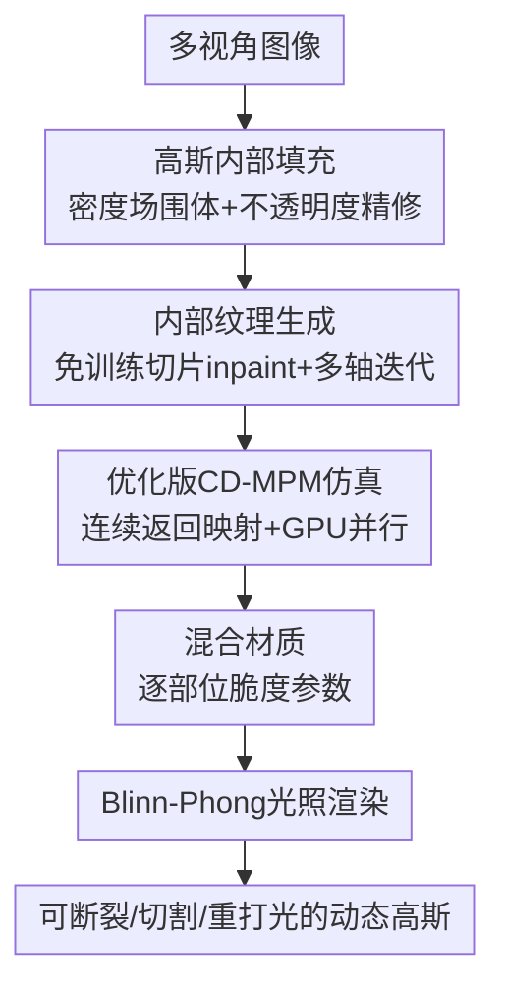

# GaussianFluent: Gaussian Simulation for Dynamic Scenes with Mixed Materials

**会议**: CVPR 2026  
**论文**: [CVF Open Access](https://openaccess.thecvf.com/content/CVPR2026/html/Huang_GaussianFluent_Gaussian_Simulation_for_Dynamic_Scenes_with_Mixed_Materials_CVPR_2026_paper.html)  
**代码**: 无（仅项目页 <https://hb-pencil-zero.github.io/GaussianFluent/>）  
**领域**: 3D视觉  
**关键词**: 3D Gaussian Splatting, 物理仿真, 脆性断裂, CD-MPM, 内部纹理生成  

## 一句话总结
GaussianFluent 给只建表面的 3DGS 补上"内部"——先用生成模型把物体内部填满带真实纹理的高斯，再把一套改稳、改并行的连续损伤材料点法（CD-MPM）接进高斯仿真，让 3DGS 第一次能以实时速度、在混合材质下真实地模拟脆性断裂、切割、子弹击穿等会暴露内部结构的剧烈动态。

## 研究背景与动机
**领域现状**：3DGS 凭借高保真、实时渲染成为主流 3D 表示，把物理仿真耦合进高斯（以 PhysGaussian 为代表）也已经能做弹性形变——给每个高斯赋质量、速度、应力，用材料点法（MPM）在背景欧拉网格上演化。

**现有痛点**：现有 GS 仿真几乎只会做"软的、可变形的"材料，**脆性断裂**这类会改变拓扑、暴露新表面的动态基本做不了。原因有两个很具体的拦路虎：① 高斯是面表示，物体内部是空心、无纹理的——西瓜掉地上摔裂时，本应露出红瓤黑籽，但重建出来的西瓜里面是空的，根本没法渲染断面；② 现有 GS 仿真没有断裂模型，而点云里成熟的脆断方法（CD-MPM-TOG）又和高斯不兼容——它的返回映射（return mapping）在屈服面边界处**不连续**，加上只能跑 CPU、并行度低，搬到 GPU 上会因 CUDA 原子操作的非确定性而数值发散。

**核心矛盾**：要真实渲染断裂，既缺"内部该长什么样"（表示层空洞），又缺"内部怎么裂"（仿真层无脆断、且已有脆断算法数值不稳又慢）。两个缺口必须一起补，缺一个断面就要么没纹理、要么裂得不物理。

**本文目标**：在 3DGS 框架内，端到端地（a）给高斯填出带一致纹理的内部体积、（b）实现可在 GPU 上实时跑的脆性断裂仿真、（c）支持一个物体由多种材质拼成（瓜皮/瓜瓤/瓜籽脆度不同）。

**切入角度 / 核心 idea**：内部纹理不去训专用模型（FruitNinja 那样微调扩散模型代价高又不泛化），而是**免训练**地复用现成生成模型（SD-XL、MVInpainter）切片填补；脆断不另起炉灶，而是把 CD-MPM 的不连续返回映射用一个动态投影点**改连续**、再 GPU 并行化，几乎零额外开销地接进高斯仿真。

## 方法详解

### 整体框架
GaussianFluent 的输入是一个物体的多视角图像，输出是一个内部被真实纹理填满、可在物理引擎里被打碎/切开/击穿并实时重打光渲染的高斯物体。整条管线分两大块串行：先**补内部**（3.1 节，填高斯 + 生成纹理），再**做仿真**（3.2 节，混合材质 CD-MPM），最后接一个 Blinn-Phong 光照系统把动态阴影/高光渲出来。

补内部又拆成"填体积"和"上纹理"两步：先在表面高斯围出的封闭体内塞入新的内部高斯并清掉跑到边界外的杂点，再用切片 + 图像 inpainting 给这些内部高斯逐层、逐轴地刷上一致的纹理。做仿真则是给每个高斯（含新填的内部高斯）赋物理属性，用改造后的 CD-MPM 演化形变梯度，按区域分配不同脆度参数实现混合材质，断裂在"弹性储能耗尽"时自然发生而非靠硬阈值触发。

### 关键设计

**1. 高斯内部填充：先围出封闭体、再用不透明度优化清杂点**

针对"GS 内部空心、断面没法渲染"这个痛点。直接重建只得到表面高斯，作者先在标准渲染损失上加一项尺度正则，把高斯压小、压贴合表面，避免大高斯横跨边界、让内外分界清晰：

$$L_{total} = L_{MSE} + L_{SSIM} + \omega \sum_{i=1}^{N} \|s_i\|_2^2$$

其中 $s_i$ 是第 $i$ 个高斯的尺度参数，$\omega$ 控制正则强度（这一步还顺带让法线更准，利于后面 PCA 求法线做重打光）。然后把场景离散成 $n^3$ 网格，按邻近高斯累加出密度场 $d(x)=\sum_{p\in P}\alpha_p\exp\!\big(-\tfrac12(x-x_p)^T A_p^{-1}(x-x_p)\big)$（$\alpha_p,x_p,A_p$ 为高斯的不透明度/中心/协方差），把 $d(x)\ge\vartheta_d$ 的高密度网格当作物体边界，在围出的封闭体内按 PhysGaussian 的做法初始化内部高斯。

但纯密度阈值填充很容易把高斯填到真实边界之外。作者的巧招是：**只对新填的内部高斯做一次"只优化不透明度"的渲染拟合**，固定其余属性——这会把跑到外面的多余高斯不透明度逼到 0，再剪掉接近 0 的，剩下一个干净、边界明确的实心体积，正好供后续上纹理和仿真用。

**2. 免训练两阶段内部纹理生成：单视 inpaint 起步 + 三轴迭代逼一致**

针对"内部纹理没有训练数据、生成又要求多视角和空间一致"这个痛点。作者不训专用模型，而是免训练地复用现成生成器，分两阶段。**粗纹理初始化**：沿 X 轴把物体均匀切片，对每片渲出初始外观 $C_{initial}$ 和内部掩码，用 MVInpainter（由文本 prompt + SD-XL 生成的参考图引导）把掩码区域 inpaint 成 $C_{inpaint}$；落在该区域的内部高斯按双线性插值取色 $c_i$，初始化其零阶球谐为 $sh^0_i=(c_i-0.5)/C_0$，$C_0=1/(2\sqrt{\pi})$，高阶球谐置零（先给一个各向同性外观）。

单视初始化跨视角不一致，于是**多轴迭代精修**：沿 X、Y、Z 三个主轴各取切片，每片渲正交视图 + 内部掩码喂给 SD-XL，用**低强度 inpaint** 约束去噪，只小幅注入细节、不破坏全局结构；再把这些新 inpaint 的 2D 图当优化目标，反过来小步优化内部高斯的球谐。两步循环到收敛。关键直觉是三轴切片在交线处天然耦合：MVInpainter 让所有 X 切片都呈现（比如三层蛋糕的）三层结构，SD-XL 的低强度 inpaint 再把这个约束传播到 Y/Z 切片——任何偏离都会和已定的 X 切片矛盾，于是优化被逼向三轴一致。相比 vanilla SDS 容易糊、容易过饱和，这种"连续低强度纠错"能出锐利真实的纹理。

**3. GS 上的优化版 CD-MPM：把不连续返回映射改连续，根治 GPU 数值发散**

针对"点云脆断算法 CD-MPM 搬不进 GS"这个痛点——根因是它的返回映射在屈服面边界不连续，GPU 原子操作的非确定性会被这个跳变放大成混沌发散，逼得原算法只能跑 CPU、慢到一帧 3400 秒。仿真上，每个高斯被赋质量/速度/体积/应力，演化由形变映射 $x=\phi(X,t)$ 给出，形变梯度 $F_p(t)=\partial\phi(X,t)/\partial X$ 每步作用到高斯的协方差和球谐上。断裂不靠硬阈值：把 $F_p$ 分解成刚性与非刚性，只有非刚性部分（体积拉伸 $p$、剪切畸变 $q$）贡献断裂；弹性储能区由 Non-Associated Cam-Clay 屈服面界定：

$$y(p,q;p_0,\xi,M) = q^2(1+2\xi) + M^2(p+\xi p_0)(p-p_0),\quad p_0=K\sinh\!\big(\gamma\max(-\alpha,0)\big)$$

形变累积时屈服面在 $(p,q)$ 平面收缩、可承受的弹性应力变小，当残余储能耗尽时断裂自然发生（$\alpha$ 是关键损伤变量，⚠️ 原文该处希腊符号 OCR 混乱，损伤/硬化变量与脆度参数符号以原文为准）。

核心修复在**连续返回映射**：试探态 $(p_{tr},q_{tr})$ 若 $y>0$ 需投影回 $y=0$ 的椭圆上。原算法把内部压力点连到固定中心 $(p_c,0)$，在 $p=p_0$ 处投影点会从椭圆顶点突跳到右端 $(p_0,0)$——机器精度级的抖动就能让同一几何态映到完全不同的点，引发不稳定。作者改用一个随试探态平滑自适应的**动态点** $(p_c^*,0)$：

$$p_c^* = p_c + \lambda_k(p_{tr})(p_{tr}-p_c),\quad \lambda_k(p_{tr})=\Big|\tfrac{p_{tr}-p_c}{p_0-p_c}\Big|^{k}$$

实现取 $k=2$。它在 $k\to\infty$ 时退化回原不连续方案（$\lambda_k\to$ 常数），而有限 $k$ 下 $\lim p_c^*(p_0^-)=p_0$，左右极限都收敛到 $(p_0,0)$，跳变被抹平。投影后由 $p,q$ 重组 $F_p$，并按 $\alpha\leftarrow\alpha+\ln(J_{tr}/J_{new})$（$J=\det F_p$）更新硬化参数演化屈服面。这一改既保住物理合理性，又让算法能在 GPU 上稳定跑。

**4. 混合材质仿真：逐部位分配脆度参数，一个物体多种断裂行为**

针对 PhysGaussian"全物体单一材质"的局限。作者给同一物体的不同部位赋不同的脆度控制参数 $\xi$，例如西瓜按高斯颜色分区：黑籽给高 $\xi$、红瓤给低 $\xi$、绿皮给中 $\xi$（Figure 5 中 rind/flesh/seed 取 2/0.6/5），分区可借助现成分割、部件感知生成或启发式规则。效果上，混合材质让瓜籽与瓜瓤在摔裂时保持分离、棒棒糖碎裂而木棒完好——这些是单一材质会出视觉伪影、PhysGaussian 直接做不出的。一个额外彩蛋：把 $\xi$ 设为 0 时高斯粒子会自然彼此分离，得到一种类流体效果，可当牛奶飞溅的廉价近似（但作者承认仍不如专用流体求解器真实）。

### 损失函数 / 训练策略
训练只发生在表示侧：初始 3DGS 用 $L_{total}$（MSE + SSIM + 尺度正则）训出贴合表面的高斯；内部高斯的填充只做"不透明度单属性"渲染优化；纹理精修是"inpaint 出 2D 目标 → 小步优化球谐"的交替循环，直到 loss 收敛或到最大迭代。仿真侧无需训练，物理参数（杨氏模量、泊松比、摩擦角、密度、脆度参数等）按 PhysGaussian 与 CD-MPM-TOG 的设定手工给定。

## 实验关键数据
实验分内部纹理填充与动态场景物理仿真两块，对比 PhysGaussian、2D Inpainting、OmniPhysGS，用 CLIP score 与用户研究双指标评测。

### 主实验

内部纹理填充质量（CLIP 越高越好、用户偏好越高越好）：

| 方法 | CLIP Score ↑ | User study ↑ |
|------|------|------|
| PhysGaussian（外色直接拷贝） | 22.3 | 3.57% (3/84) |
| 2D Inpainting | 30.1 | 25.00% (21/84) |
| **Ours** | **35.4** | **71.43% (60/84)** |

动态场景物理仿真质量：

| 方法 | CLIP Score ↑ | User study ↑ |
|------|------|------|
| PhysGaussian（做不出脆断） | 12.2 | 3.84% (1/26) |
| OmniPhysGS（受限于 PhysGaussian 框架） | 13.1 | 7.69% (2/26) |
| **Ours** | **22.7** | **88.46% (23/26)** |

两块都大幅领先：PhysGaussian 把外表面颜色直接拷给内部高斯导致模糊，2D inpainting 在斜视角和多视角一致性上崩；仿真侧两个 baseline 都无法产生脆性断裂，用户偏好几乎一边倒到本文。

### 效率分析（消融视角）
不同 MPM 网格分辨率下的单帧仿真时间与峰值显存：

| 方法 | 100³ 时间(s)/显存(GB) | 200³ 时间/显存 | 300³ 时间/显存 |
|------|------|------|------|
| CD-MPM (CPU) | 616 / — | 1539 / — | 3408 / — |
| PhysGaussian | 0.75 / 7.6 | 2.12 / 10.8 | 4.78 / 16.2 |
| **Ours** | 0.78 / 8.2 | 2.08 / 10.7 | 5.05 / 17.7 |

原版 CD-MPM 因不连续返回映射在 GPU 上会混沌发散，只能 CPU 跑，300³ 下一帧要 3400 秒；本文连续化后能上 GPU，相比只做弹性的 PhysGaussian 仅增加极小开销（多出的是损伤场跟踪与拓扑更新），却换来 PhysGaussian 根本做不到的脆断与分离能力。

### 关键发现
- **连续返回映射是脆断能上 GPU 实时跑的关键**：去掉它（即原版 CD-MPM）速度直接掉到 CPU 的几百~几千秒/帧，且 GPU 上数值发散——这是本文从"理论可行"到"实际可用"的命门。
- **混合材质显著影响真实感**：Figure 5 显示给西瓜各部位单一脆度会产生不自然的断裂图样与伪影，逐部位分配 $\xi$ 才能让籽/瓤/皮各自呈现合理断裂。
- **免训练纹理一致性靠"三轴切片交线耦合"**：单视 inpaint 起步 + 三轴低强度迭代，比 vanilla SDS 更锐利、不过饱和，且天然逼出三维一致。

## 亮点与洞察
- **用一行动态投影点公式根治数值不稳**：$p_c^*=p_c+\lambda_k(p_{tr})(p_{tr}-p_c)$ 把固定中心换成随试探态平滑滑动的点，既消除 $p_0$ 处跳变、又能 $k\to\infty$ 退回原方案——这种"参数化地把不连续算法连续化、并以极限保证向后兼容"的思路，可迁移到其他有返回映射/投影步的物理或优化算法。
- **"只优化不透明度"清理填充杂点**：填体积时最难的是把跑到边界外的高斯去掉，作者不去调几何而是固定其它属性、只让不透明度去拟合渲染，多余高斯自动被压到 0——一个很省事的工程巧招。
- **断裂不靠硬阈值而靠"弹性储能耗尽"**：把断裂建模成屈服面收缩到残余储能消失时自然发生，比"形变超过某阈值就断"更物理、过渡更自然。
- **免训练复用现成生成器**：相比 FruitNinja 微调扩散模型的高成本路线，本文把 MVInpainter/SD-XL 当现成工具按轴切片调用，零额外训练拿到可泛化的内部纹理。

## 局限与展望
- **类流体只是近似**：把 $\xi$ 设 0 让粒子分离来模拟牛奶飞溅，作者自己承认明显不如专用流体求解器真实，未来需引入针对性本构模型或专门流体求解器。
- **空心/薄壁结构会过填充**：体积构建假设物体内部是实心，遇到中空或薄壁会把空腔填满；作者建议用预测切片图的 alpha 通道做占据指示来预测"空心度"。
- ⚠️ **物理参数手工给定、依赖外部分割**：脆度等参数靠手调、混合材质分区依赖现成分割/部件生成，没有从数据自动估计——这一点限制了对任意新物体的开箱即用程度（笔记补充观察，非作者明确列出）。
- **依赖现成生成模型的失败模式**：纹理质量受 SD-XL/MVInpainter 能力上限约束，对训练分布外的奇异内部结构可能生成不可信纹理。

## 相关工作与启发
- **vs PhysGaussian**：同样把物理属性赋给高斯、用 MPM 仿真，但 PhysGaussian 只做弹性形变、内部空心、单一材质；本文补上内部纹理 + 脆性断裂 + 混合材质，做的是它根本做不出的会暴露内部的剧烈动态。
- **vs OmniPhysGS**：OmniPhysGS 受限于 PhysGaussian 框架，仍无法产生脆断，仿真用户偏好仅 7.69% vs 本文 88.46%。
- **vs CD-MPM-TOG（点云脆断）**：本文以它为基础，但点云版返回映射不连续、只能 CPU 跑且不兼容 GS；本文将其连续化 + GPU 并行化 + 适配高斯表示，把一帧 3400 秒压到秒级。
- **vs FruitNinja（GS 内部纹理）**：FruitNinja 靠微调扩散模型生成水果内部纹理，代价高且不泛化；本文走免训练切片 inpaint 路线，更省更通用。

## 评分
- 新颖性: ⭐⭐⭐⭐⭐ 首次在 3DGS 内同时解决"内部纹理"与"脆性断裂"两大缺口，动态投影点把不连续返回映射连续化是干净漂亮的关键创新
- 实验充分度: ⭐⭐⭐⭐ 覆盖多材质多场景且有效率对比，但定量仅 CLIP + 用户研究（样本偏小），缺更硬的物理/几何指标
- 写作质量: ⭐⭐⭐⭐ 问题拆解清晰、公式完整，部分关键符号在开放版里 OCR 混乱需对照原文
- 价值: ⭐⭐⭐⭐⭐ 让 GS 能真实模拟断裂/切割/击穿，对 VR、机器人交互等下游有直接价值

<!-- RELATED:START -->

## 相关论文

- [\[CVPR 2026\] Space-Time Forecasting of Dynamic Scenes with Motion-aware Gaussian Grouping](space-time_forecasting_of_dynamic_scenes_with_motion-aware_gaussian_grouping.md)
- [\[CVPR 2026\] FastEventDGS: Deformable Gaussian Splatting for Fast Dynamic Scenes from a Single Event Camera](fasteventdgs_deformable_gaussian_splatting_for_fast_dynamic_scenes_from_a_single.md)
- [\[CVPR 2026\] MoRGS: Efficient Per-Gaussian Motion Reasoning for Streamable Dynamic 3D Scenes](morgs_efficient_per-gaussian_motion_reasoning_for_streamable_dynamic_3d_scenes.md)
- [\[CVPR 2026\] Let it Snow! Animating 3D Gaussian Scenes with Dynamic Weather Effects via Physics-Guided Score Distillation](let_it_snow_animating_3d_gaussian_scenes_with_dynamic_weather_effects_via_physic.md)
- [\[CVPR 2026\] 240FPS Stereo Vision from Monocular Mixed Spikes](240fps_stereo_vision_from_monocular_mixed_spikes.md)

<!-- RELATED:END -->
