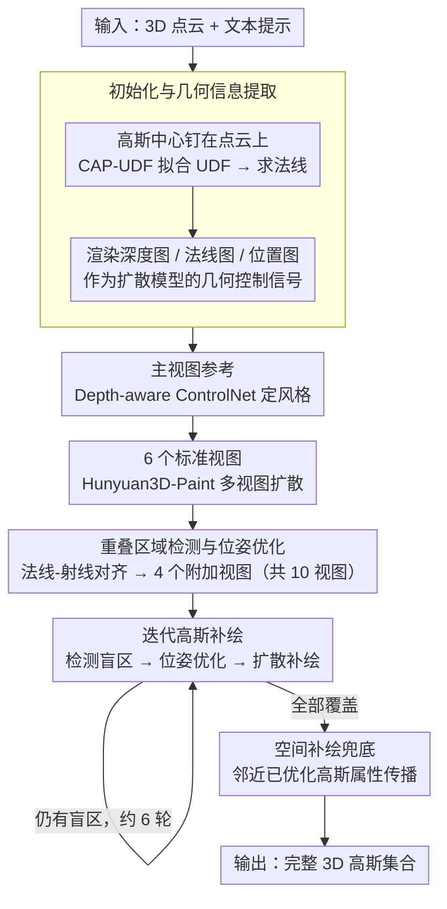

# GaussianGrow: Geometry-aware Gaussian Growing from 3D Point Clouds with Text Guidance

**会议**: CVPR 2026  
**arXiv**: [2604.05721](https://arxiv.org/abs/2604.05721)  
**代码**: [https://weiqi-zhang.github.io/GaussianGrow](https://weiqi-zhang.github.io/GaussianGrow)  
**领域**: 3D视觉 / 3D生成  
**关键词**: 3D高斯溅射, 点云, 文本引导, 多视图扩散, 外观生成

## 一句话总结
提出 GaussianGrow，通过从易获取的 3D 点云"生长"3D 高斯来替代从零预测几何+外观的传统方案，利用多视图扩散模型生成一致的外观监督，并通过重叠区域检测+迭代补全机制解决视图融合伪影和不可见区域问题，在合成和真实扫描点云上大幅超越 SOTA。

## 研究背景与动机
1. **领域现状**：3D 高斯溅射（3DGS）已成为高保真 3D 建模的主流表示，但高质量 3D 高斯的生成仍面临挑战。现有生成方法（GVGEN、DiffSplat 等）需要同时学习几何结构和外观，当几何预测不准确时，整体生成质量严重下降。
2. **现有痛点**：一些方法尝试通过预测 point maps 作为几何参考来推断高斯原语，但估算的几何不可靠，导致生成质量差。另一系列方法通过给 3D 网格贴纹理来生成外观，但网格需要大量人工建模，且依赖 UV 展开会引入纹理重叠和畸变。
3. **核心矛盾**：几何和外观的联合学习使模型对几何预测误差非常敏感，而获取可靠几何先验的代价很高（网格建模要求大量人工）。
4. **本文目标** 如何利用容易获取的几何先验（3D 点云）来显著提升 3D 高斯生成质量？
5. **切入角度**：随着 LiDAR 和深度相机的普及，获取干净的点云数据已经非常便捷。点云可以作为可靠的几何先验，将生成任务从"几何+外观联合学习"简化为"在给定几何上生长外观"。
6. **核心 idea**：将高斯原语的中心固定在点云位置上，利用多视图扩散模型生成外观监督来"生长"高斯的颜色和不透明度属性。

## 方法详解

### 整体框架
两阶段流程。**Stage 1**：利用 depth-aware ControlNet 生成主视图参考图像，然后用几何感知的多视图扩散模型（Hunyuan3D-Paint）生成 6 个标准视图 + 4 个针对重叠区域优化的附加视图共 10 个视图作为外观监督，优化高斯属性。**Stage 2**：迭代地检测未见区域，优化相机位姿观察最大未见区域，用 2D 扩散模型补绘渲染视图，作为监督继续生长高斯，直到所有区域覆盖完毕。输入：3D 点云 + 文本提示。输出：完整的 3D 高斯集合。

### 关键设计

**1. 初始化与几何信息提取：把点云本身当成不会出错的几何先验**

既然几何已经由点云给定，模型就不必再去预测它——这正是 GaussianGrow 绕开"几何预测失败拖垮整体质量"的起点。每个高斯的中心直接钉在对应的点云位置上，几何精度天然由输入保证。为了给后续视图生成提供条件信号，作者先用 CAP-UDF 从点云优化出一个无符号距离场（UDF），再据此求法线 $n_i = \nabla f_u(p_i) / \|\nabla f_u(p_i)\|$，并把高斯表示成沿法线定向的 2D 圆盘（而非椭球），旋转矩阵直接由法线确定。最后从 UDF 里渲出三类几何图——深度图（光线行进）、法线图（梯度推断）、位置图（像素到 XYZ 坐标）——喂给扩散模型当作几何控制。这里选 UDF 而不选 SDF 是有讲究的：UDF 不要求表面水密，能描述开放拓扑和薄壳、镂空一类的复杂结构，对真实扫描点云更友好。

**2. 重叠区域检测与位姿优化：让相邻视图在它们"打架"的地方各退一步**

6 个预设标准视图覆盖物体时，相邻两视图之间必然有大片重叠，而多视图扩散模型在这些重叠带上的生成往往彼此不一致，融合后就成了接缝伪影。GaussianGrow 的做法是先用光线追踪求出每个视点能看到的高斯集合，相邻两视点的交集即重叠区域 $R_{i,j}$；然后为每块重叠区域单独优化一个新相机位姿，让相机射线尽量正对该区域内高斯的法线：

$$\mathcal{L}_{\text{align}} = \sum_{g \in R_{i,j}} \left(1 - \left|\frac{\mathbf{d}_{i,j} \cdot \mathbf{n}_g}{\|\mathbf{d}_{i,j}\| \|\mathbf{n}_g\|}\right|\right)$$

优化时把相机位置约束在单位球面上。正对着看意味着投影失真最小，从这个角度补生成的外观自然更连贯，于是 4 个这样的附加视图就专门去"会诊"标准视图之间最容易出毛病的接缝。可见性检测本身计算量不小，作者用 CUDA 并行实现把它从分钟级压到秒级。

**3. 迭代高斯补绘：让模型自己去找还没被看见的地方，按需补**

即便有 10 个视图，物体的凹陷、内壁、自遮挡区域仍可能从未被任何视图覆盖到。与其堆更多固定视点，GaussianGrow 让模型自适应地发现盲区：每一轮先解一个相机位姿，使"被已优化高斯挡住的未优化高斯"数量最小，

$$\mathcal{L}_{\text{occ}} = \sum_{i,j} \sigma\!\left(\tau(\rho_i+\rho_j)^2 - \|q_i-q_j\|^2\right)\, \sigma\!\left(\tau(z_i-z_j)\right)$$

其中 $q$ 是高斯的 2D 投影中心、$\rho$ 是投影半径、$z$ 是深度——两个 sigmoid 分别判定"投影是否重叠"和"谁挡住谁"。找到这个能看见最多盲区的视角后，渲出当前视图（盲区会是空洞），用 depth-aware inpainting 扩散模型把空洞补上，再拿补绘结果当监督生长对应高斯。如此迭代，每轮覆盖掉一批盲区，通常 6 轮就能补全。最后还有一步空间补绘（Spatial Inpainting）兜底：把已优化高斯的属性传播给紧邻的、仍未被任何视图覆盖到的零散高斯。

### 一个完整示例：从一团点云到完整外观

以一只带把手、内壁中空的马克杯点云 + 文本"a blue ceramic mug"为例：

1. **几何提取**：CAP-UDF 拟合出 UDF，杯壁法线、把手朝向都算好，高斯中心钉在每个点上，渲出深度/法线/位置三张几何图。
2. **主视图 + 标准视图**：depth-aware ControlNet 先出一张正面参考图定下蓝色釉面的风格，Hunyuan3D-Paint 据此生成 6 个标准视图，6 个高斯优化好杯身大部分外侧。
3. **重叠会诊**：检测到正面视图与侧面视图在把手外缘大面积重叠且接缝处颜色对不上，于是优化出 4 个正对把手与杯口边缘的附加视图（共 10 视图），接缝伪影消除。
4. **迭代补绘**：杯子内壁此时仍全黑——它被所有外侧视图遮挡。第 1 轮位姿优化把相机摆到俯视杯口，补绘内壁上半；后续几轮逐步补到杯底，约 6 轮后内壁全部覆盖。
5. **空间补绘**：把手内侧几个零散漏网高斯，从邻近已优化高斯继承颜色与不透明度。最终输出一只内外一致、无接缝的蓝色马克杯高斯。

### 损失函数 / 训练策略
高斯优化采用视图特定的优化方案——只优化当前视角可见的正面朝向高斯，避免背面高斯被干扰。先优化 6 个标准视图，再优化 4 个重叠区域的附加视图。多视图扩散模型使用 Hunyuan3D-Paint，主视图生成使用 Stable Diffusion + Depth-aware ControlNet。

## 实验关键数据

### 主实验（Objaverse 数据集，文本引导的外观生成）

| 方法 | FID ↓ | KID ↓ | CLIP ↑ | User Study (Overall) ↑ |
|------|-------|-------|--------|----------------------|
| TexTure | 42.63 | 7.84 | 26.84 | 1.49 |
| Text2Tex | 41.62 | 6.45 | 26.73 | 2.37 |
| SyncMVD | 40.85 | 5.77 | 27.24 | 4.13 |
| GAP | 40.39 | 5.28 | 27.26 | 3.37 |
| **GaussianGrow** | **36.07** | **3.04** | **27.30** | **4.67** |

### 消融实验

| 配置 | FID ↓ | KID ↓ | CLIP ↑ |
|------|-------|-------|--------|
| **Full Model** | **36.07** | **3.04** | **27.30** |
| W/o Overlap Processing | 40.48 | 4.81 | 26.73 |
| W/o Inpaint | 40.46 | 4.68 | 26.71 |

| 视图数 K | FID ↓ | KID ↓ | CLIP ↑ |
|---------|-------|-------|--------|
| K=6 (仅标准视图) | 40.48 | 4.81 | 26.73 |
| **K=10** | **36.07** | **3.04** | **27.30** |
| K=12 | 36.57 | 2.88 | 26.48 |

### 关键发现
- **重叠区域处理和补绘都很重要**：去掉任一模块，FID 都从 36 升到 40 以上。两者的贡献几乎相当。
- **K=10 是最优视图数**：4 个附加视图聚焦于最关键的重叠区域已经足够，增加到 K=12 时 KID 略降但 CLIP 和 FID 反而略升。
- **点云比重建网格更好用**：baseline 方法在重建网格（BPA/CAP-UDF）上的性能显著下降（FID 上升 15-25 点），说明点云→网格→UV 展开的流程会引入大量几何失真。GaussianGrow 跳过了这些中间步骤。
- 在 T3Bench 文本到 3D 基准上，GaussianGrow+Uni3D 检索方案在所有指标上超越 DiffSplat、GVGEN、LGM 等方法。
- 在真实扫描点云（DeepFashion3D）上也能正常工作，证明方法对噪声和密度变化有鲁棒性。
- 相同点云配合不同文本提示可以生成多种风格的外观，展现了灵活性。

## 亮点与洞察
- **"从点云生长高斯"的视角转换**：将 3D 生成从"同时学几何和外观"简化为"在已有几何上学外观"，这个 insight 简单但非常有效。点云作为几何先验比 point map 预测更可靠，且获取成本（LiDAR扫描或跨模态检索）越来越低。
- **重叠区域的精细处理**：通过法线-射线对齐优化相机位姿来观察重叠区域，这个设计非常工程化但有效。CUDA 并行实现也体现了对实际效率的重视。
- **自适应补绘策略**：不用预定义视点，而是让模型自己发现最需要补绘的区域——这种"按需生成"的思路比暴力密集视图更优雅。

## 局限与展望
- 依赖外部多视图扩散模型（Hunyuan3D-Paint）的质量——如果扩散模型在某些类别上生成质量差，GaussianGrow 也无法挽救。
- 迭代补绘需要多次渲染和扩散模型推理，计算开销比端到端方法大。
- 主视图生成（ControlNet + Stable Diffusion）是单次采样，如果这个参考图不好，后续所有视图的一致性都会受到影响。
- 当前评估主要在物体级别，未验证对场景级别点云的适用性。

## 相关工作与启发
- **vs DiffSplat**：DiffSplat 用图像扩散模型直接生成高斯，几何和外观联合学习。GaussianGrow 通过分离几何（点云提供）和外观（扩散模型生成）来避免几何预测失败的风险。
- **vs DreamGaussian**：DreamGaussian 用 SDS 优化外观，容易过饱和和不自然。GaussianGrow 用多视图扩散提供显式监督，外观更自然。
- **vs TriplaneGaussian**：受限于 triplane 分辨率，无法恢复精细外观。GaussianGrow 直接在 3D 空间优化高斯原语，不受中间表示的分辨率限制。
- **vs 网格贴纹理方法（TexTure、Text2Tex 等）**：GaussianGrow 绕过了 UV 展开这个痛点，在点云重建网格后 baseline 性能大幅下降的对比也证实了这一优势。

## 评分
- 新颖性: ⭐⭐⭐⭐ "从点云生长高斯"的切入点有新意，重叠区域处理和迭代补绘的工程设计扎实
- 实验充分度: ⭐⭐⭐⭐⭐ Objaverse合成+DeepFashion真实扫描+T3Bench文本到3D+多方法对比+全面消融
- 写作质量: ⭐⭐⭐⭐ 方法描述清晰，公式和图表配合好
- 价值: ⭐⭐⭐⭐ 提供了3D生成的新范式，但依赖外部多视图扩散模型限制了独立性

<!-- RELATED:START -->

## 相关论文

- [\[CVPR 2026\] PointINS: Instance-Aware Self-Supervised Learning for Point Clouds](pointins_instance-aware_self-supervised_learning_for_point_clouds.md)
- [\[ICCV 2025\] Egocentric Action-aware Inertial Localization in Point Clouds with Vision-Language Guidance](../../ICCV2025/3d_vision/egocentric_action-aware_inertial_localization_in_point_clouds_with_vision-langua.md)
- [\[CVPR 2026\] Motion-Aware Animatable Gaussian Avatars Deblurring](motion-aware_animatable_gaussian_avatars_deblurring.md)
- [\[CVPR 2026\] 3D sans 3D Scans: Scalable Pre-training from Video-Generated Point Clouds](3d_sans_3d_scans_scalable_pre-training_from_video-generated_point_clouds.md)
- [\[CVPR 2026\] JOPP-3D: Joint Open Vocabulary Semantic Segmentation on Point Clouds and Panoramas](jopp3d_joint_open_vocabulary_semantic_segmentation.md)

<!-- RELATED:END -->
