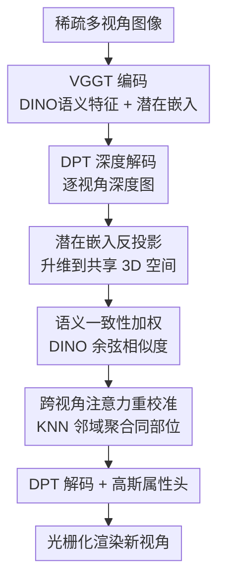

# Generalizable Human Gaussian Splatting via Multi-view Semantic Consistency

**会议**: CVPR2026  
**arXiv**: [2604.25466](https://arxiv.org/abs/2604.25466)  
**代码**: https://github.com/DCVL-3D/GHGS-MVSC_release （有）  
**领域**: 3D视觉 / 人体渲染 / 高斯泼溅  
**关键词**: 泛化人体高斯泼溅, 稀疏视角, 语义一致性, 跨视角注意力, VGGT

## 一句话总结
针对稀疏视角下泛化人体高斯泼溅"高斯定位不准"的问题，本文把各视角的潜在嵌入反投影到共享 3D 空间，再用 DINO 语义特征判断哪些点属于同一身体部位、对它们做跨视角注意力重校准，从而在高纹理和遮挡区域更准地放置 3D 高斯，在 ZJU-Mocap / HuMMan / THuman2.0 上取得 SOTA。

## 研究背景与动机
**领域现状**：3D Gaussian Splatting（3DGS）以显式高斯基元 + 可微光栅化实现实时新视角合成，已成为人体渲染主流。为摆脱"逐人优化、依赖密集视角"的限制，近期工作转向**泛化（generalizable）**前馈方案——给定稀疏视角输入，一次前向就预测出未见人物的 3D 高斯参数。

**现有痛点**：现有泛化方案分两派，各有硬伤。一派用 SMPL 的 UV map / mesh 初始化并细化高斯位置（GHG、RoGSplat），但 SMPL 是"蒙皮"模型，在头发、宽松衣物等非刚性表面上高斯被放偏；且渲染质量强依赖 SMPL 参数估计精度，遇到大幅运动或自遮挡就不可靠。另一派用显式几何约束（plane-sweep cost volume、对极几何）估深度、再反投影点云来定位高斯（GPS-Gaussian、EVA-Gaussian），位置更灵活，但**稀疏视角之间重叠不足**，容易匹配错、深度估不准。

**核心矛盾**：人体关节复杂 + 视角重叠少 → 多视角特征表示在 2D 图像域里**对不齐**。高纹理区域（衣纹、面部）和遮挡部位存在空间歧义，模型分不清"哪两个像素其实是同一身体部位"，导致高斯定位漂移。

**本文目标**：在不依赖精确 SMPL、也不强求显式几何约束的前提下，把多视角特征**对齐到同一身体部位**，从而精确定位 3D 高斯。

**切入角度**：作者观察到——空间相邻的特征点不一定属于同一部位（深度有误差就会混进邻居），但**语义特征（DINO）相似的点大概率是同一部位**。于是把"几何相邻"和"语义一致"两个线索结合起来筛选要聚合的点。

**核心 idea**：把各视角潜在嵌入反投影进共享 3D 空间，对空间近邻里**语义一致**的点做跨视角注意力重校准，让嵌入带上"部位感知"信息，再回归高斯属性。

## 方法详解

### 整体框架
输入是同一人物的稀疏多视角图像（3/4/5 视角），输出是一组 3D 高斯，可渲染任意新视角。整条管线是"编码 → 升维到 3D → 语义一致性重校准 → 解码出高斯 → 光栅化"的前馈流程：用预训练 **VGGT** 编码器同时拿到 DINO 语义特征和多视角潜在嵌入，由 DPT-style 解码器预测逐视角深度图；据此把语义特征和潜在嵌入一起反投影到所有视角共享的 3D 空间；在该空间里用 KNN 找空间近邻，再以语义一致性加权的跨视角注意力把"同部位"的嵌入重校准；重校准后的嵌入投回 2D，经 DPT 解码 + 多个属性头预测高斯的位置偏移/旋转/缩放/不透明度（颜色直接继承输入 RGB），最后光栅化成图。

### 关键设计

**1. 把潜在嵌入本身反投影到共享 3D 空间：让多视角空间关系从 2D 升到 3D 才对得齐**

痛点是多视角之间的空间关系在 2D 图像域里根本建立不起来——同一部位在不同视角的像素位置毫无对应关系。本文不像旧方法那样只反投影"点云坐标"，而是**把潜在嵌入这个高维特征本身**连同语义特征一起，用预测深度 + 标定相机参数反投影成 3D 点：$F\in\mathbb{R}^{N_P\times C}$（语义特征）和 $E\in\mathbb{R}^{N_P\times C}$（潜在嵌入），$N_P$ 是点数、$C$ 是通道数。这样 2D 网格被转成空间对齐的 3D 点，多视角特征在同一坐标系里有了明确空间位置。

之所以有效：把嵌入升到 3D 后，"谁和谁空间相邻"才有意义，后续才能判断邻居是不是同一部位；而且这一步本身也给深度解码器提供了跨视角几何约束，消融显示它对深度估计与定位的贡献最大（去掉后 4 视角 PSNR 从 30.93 掉到 30.19）

**2. 用语义一致性给跨视角注意力加权：靠 DINO 特征区分"空间近但不同部位"的点**

仅靠空间相邻会出错——深度有误差时，不同身体部位的点可能被挤到一起，盲目聚合就会糊掉边界。本文用从 VGGT 编码中间层免费拿到的 **DINO 语义特征**计算语义一致性 $s_{j,k}$，即两点语义特征的余弦相似度：

$$s_{j,k}=\frac{F_j\cdot F_k}{\lVert F_j\rVert\,\lVert F_k\rVert}$$

它被乘进注意力分数里，把"同部位"的点放大、"异部位"的点压低。这一项让模型在高纹理（衣纹、面部）和遮挡区域不再混淆边界，消融里去掉它（把 $s_{j,k}$ 设为 1）4 视角 PSNR 从 30.93 掉到 30.58、LPIPS 变差。注意：语义一致性必须在反投影到 3D 之后才能算，所以"只用语义、不反投影"这种组合不存在

**3. KNN + 跨视角注意力重校准：把同部位嵌入聚合成"部位感知"表示再回归高斯**

即便升到 3D，深度误差仍会让同部位嵌入轻微错位。本文对每个查询点 $j$ 先用 KNN 在 3D 空间找空间近邻集合 $\mathcal{N}(j)$（这些点大概率同部位、语义一致），再在该集合上做跨视角注意力。注意力权重把第 1、2 个设计串起来：

$$\alpha_{j,k}=\mathrm{Softmax}\!\left(\frac{(W_{query}E_j)(W_{key}E_k)^\top}{\sqrt d}\cdot s_{j,k}\right)$$

重校准结果为 $\tilde{E}_j=\sum_{k\in\mathcal{N}(j)}\alpha_{j,k}\,W_{value}E_k$。聚合后的嵌入带上了部位感知信息，再投回 2D 网格、经 DPT 解码 + 属性头输出高斯。这样做有效是因为：高斯定位的准度直接取决于嵌入是否"知道自己属于哪个部位"，重校准把跨视角同部位信息显式注入，消解了空间歧义，从而把高斯准确贴到物理表面上

### 损失函数 / 训练策略
端到端训练，总损失 $\mathcal{L}_{total}=\mathcal{L}_{render}+\lambda_{geom}\mathcal{L}_{geom}$，$\lambda_{geom}=1$。渲染损失是 L1 + SSIM 组合：$\mathcal{L}_{render}=\lambda_{L_1}\lVert\hat I-I_{gt}\rVert_1+\lambda_{SSIM}(1-\mathrm{SSIM}(\hat I,I_{gt}))$，其中 $\lambda_{L_1}=0.8$、$\lambda_{SSIM}=0.2$。几何损失 $\mathcal{L}_{geom}$ 是反投影点云 $\mathcal{P}_{all}$ 与 SMPL 顶点 $\mathcal{V}_{smpl}$ 之间的 Chamfer 距离，作为**弱几何先验**软约束点云贴合人体大形、稳定深度预测器；最终高斯定位主要由渲染目标 + 语义一致性重校准引导。优化器 AdamW，学习率 $1\times10^{-4}$，batch size 1，训练 200k 次迭代，输入统一 resize 到 $518\times518$，单张 RTX 3090。

## 实验关键数据

### 主实验
在 ZJU-Mocap 和 HuMMan 上，与 SMPL 派的 GHG、RoGSplat 对比（4 视角设定）：

| 数据集 | 指标 | 本文 | RoGSplat | GHG |
|--------|------|------|----------|-----|
| ZJU-Mocap | PSNR↑ | **30.58** | 30.12 | 27.94 |
| ZJU-Mocap | SSIM↑ | **0.9621** | 0.9613 | 0.9421 |
| ZJU-Mocap | LPIPS↓ | 0.0463 | **0.0459** | 0.0540 |
| HuMMan | PSNR↑ | **25.06** | 24.94 | 22.40 |
| HuMMan | SSIM↑ | **0.9392** | 0.9390 | 0.8915 |
| HuMMan | LPIPS↓ | 0.0690 | **0.0683** | 0.0945 |

在 ZJU-Mocap 上 PSNR 比 RoGSplat 高 0.46 dB；LPIPS 略逊但 PSNR/SSIM 一致领先，说明重建更锐、结构保持更好。

在 THuman2.0 上跨 3/5 视角与高斯派对比（节选）：

| 视角数 | 指标 | 本文 | RoGSplat | EVA-Gaussian | GPS-Gaussian |
|--------|------|------|----------|--------------|--------------|
| 3-view | PSNR↑ | **27.81** | 26.32 | - | - |
| 4-view | PSNR↑ | **30.93** | 28.94 | 26.31 | - |
| 5-view | PSNR↑ | **31.54** | 30.98 | 27.54 | 26.54 |
| 5-view | LPIPS↓ | **0.0269** | 0.0341 | 0.0297 | 0.0610 |

与 NeRF 派对比（THuman2.0，4 视角）：本文 PSNR 30.93 / SSIM 0.9710 / LPIPS 0.0334，全面碾压 TransHuman（27.36 / 0.9487 / 0.0505）、NHP（25.74）、GP-NeRF（23.28）、SHERF（19.25），且免去体渲染的逐场景优化、前馈推理快数倍。

### 消融实验
THuman2.0、4 视角设定，逐步移除两个核心组件：

| 3D 反投影 | 语义一致性 | PSNR↑ | SSIM↑ | LPIPS↓ |
|-----------|-----------|-------|-------|--------|
| ✗ | ✓ | 30.19 | 0.9676 | 0.0381 |
| ✓ | ✗ | 30.58 | 0.9695 | 0.0351 |
| ✓ | ✓ | **30.93** | **0.9710** | **0.0334** |

### 关键发现
- **3D 反投影贡献最大**：去掉它（仅 2D）PSNR 掉 0.74（30.93→30.19），因为多视角对应关系无法在 2D 建立、深度预测出错，遮挡处高斯漂移、出现浮点伪影。
- **语义一致性加权次之但关键**：把 $s_{j,k}$ 设为 1，PSNR 掉 0.35（30.93→30.58），模型会把"空间近但异部位"的点混淆，导致边界模糊、细节丢失。
- 因为语义一致性要在 3D 空间反投影后才能算，"只用语义不反投影"这一组合天然不存在，故消融表里没有该行。
- **稀疏视角鲁棒**：相机数从 5 减到 3，新视角渲染依然可靠，PSNR 仍达 27.81（3-view），证明对稀疏设定的鲁棒性。

## 亮点与洞察
- **"几何相邻 + 语义一致"双线索筛点**：单靠空间近邻会被深度误差污染，叠加 DINO 余弦相似度当注意力权重，等于给"是不是同一部位"加了一道语义校验——这个把语义当几何匹配先验的思路可迁移到任何多视角特征聚合任务。
- **反投影"特征"而非"点云"**：旧方法只反投影坐标，本文把高维潜在嵌入整体升到 3D，使跨视角注意力能在统一坐标系里直接操作特征，深度解码也因此受益，是"特征级 3D 对齐"的一个干净范式。
- **白嫖 VGGT 的 DINO 特征**：语义一致性所需的特征从 VGGT 编码中间层免费取出，无需额外训练语义分支，几乎零成本拿到部位级先验。
- **不依赖精确 SMPL**：摆脱了 SMPL 派"蒙皮模型管不好头发/宽松衣物"的老毛病，用语义一致性而非模板几何来对齐，对非刚性区域更友好。

## 局限与展望
- **几何先验仍用 SMPL 顶点**：$\mathcal{L}_{geom}$ 用 SMPL 顶点的 Chamfer 距离做软约束，训练阶段仍间接依赖 SMPL 标注；虽是弱约束，但完全无 SMPL 的场景下能否训练未验证。
- **依赖预训练 VGGT**：整个方法建立在 VGGT 编码器之上，其深度/对应估计能力构成性能天花板；VGGT 在极端视角或域外人物上失准时，本文也会跟着退化。
- **LPIPS 偶尔落后**：在 ZJU-Mocap / HuMMan 上 LPIPS 略逊于 RoGSplat，说明感知层面的纹理真实度还有提升空间（论文未深入分析原因）。
- **KNN + 跨视角注意力开销**：在 3D 点上做 KNN 搜索 + 注意力，点数 $N_P$ 大时的计算/显存成本论文未给出，扩展到更高分辨率或更多视角时的可扩展性待考。

## 相关工作与启发
- **vs RoGSplat / GHG（SMPL 锚定派）**: 它们用 SMPL UV/mesh 初始化高斯再加 offset 细化，受蒙皮模型表达力限制、在头发与宽松衣物上失真；本文不锚定 SMPL 模板，靠语义一致性在 3D 空间对齐特征，非刚性区域更准，PSNR 一致领先。
- **vs GPS-Gaussian / EVA-Gaussian（显式几何派）**: 它们用 plane-sweep cost volume / 对极几何估深度后反投影点云，稀疏视角重叠不足时易匹配错；本文用 DINO 语义一致性补救几何匹配的不可靠，深度更准（Fig.6 定性可见纹理更清晰）。
- **vs NeRF 派（NHP / TransHuman / GP-NeRF / SHERF）**: 它们靠体渲染，质量受限且推理慢、需逐场景采样；本文前馈高斯表示渲染快数倍且质量更高（THuman2.0 PSNR 30.93 vs TransHuman 27.36）。

## 评分
- 新颖性: ⭐⭐⭐⭐ "语义一致性加权跨视角注意力 + 反投影特征本身"组合清晰，但建立在 VGGT/DINO 现成能力上，属巧妙工程整合。
- 实验充分度: ⭐⭐⭐⭐ 三个数据集、3/5 视角、NeRF/高斯双派对比 + 两组件消融齐全；缺速度/显存定量与 LPIPS 落后的分析。
- 写作质量: ⭐⭐⭐⭐ 动机—方法—实验逻辑顺畅，公式与图示清楚；部分句子稍啰嗦。
- 价值: ⭐⭐⭐⭐ 给稀疏视角泛化人体渲染提供了"语义对齐特征"的实用范式，代码开源，易被后续工作复用。

<!-- RELATED:START -->

## 相关论文

- [\[CVPR 2026\] Uni3R: Unified 3D Reconstruction and Semantic Understanding via Generalizable Gaussian Splatting from Unposed Multi-View Images](uni3r_unified_3d_reconstruction_and_semantic_understanding_via_generalizable_gau.md)
- [\[CVPR 2026\] AlignPose: Generalizable 6D Pose Estimation via Multi-view Feature-metric Alignment](alignpose_generalizable_6d_pose_estimation_via_multi-view_feature-metric_alignme.md)
- [\[CVPR 2026\] Intrinsic Geometry-Appearance Consistency Optimization for Sparse-View Gaussian Splatting](intrinsic_geometry-appearance_consistency_optimization_for_sparse-view_gaussian_.md)
- [\[CVPR 2026\] BRepGaussian: CAD Reconstruction from Multi-View Images with Gaussian Splatting](brepgaussian_cad_reconstruction_from_multi-view_images_with_gaussian_splatting.md)
- [\[ECCV 2024\] MVSGaussian: Fast Generalizable Gaussian Splatting Reconstruction from Multi-View Stereo](../../ECCV2024/3d_vision/mvsgaussian_fast_generalizable_gaussian_splatting_reconstruction_from_multi-view.md)

<!-- RELATED:END -->
