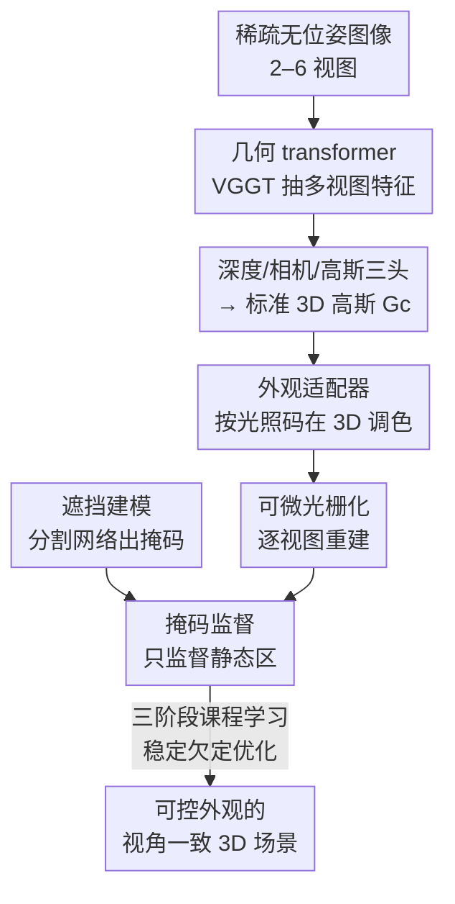

# Generalizable Sparse-View 3D Reconstruction from Unconstrained Images

**会议**: CVPR 2026  
**论文**: [CVF Open Access](https://openaccess.thecvf.com/content/CVPR2026/html/Gupta_Generalizable_Sparse-View_3D_Reconstruction_from_Unconstrained_Images_CVPR_2026_paper.html)  
**代码**: https://genwildsplat.github.io/ （项目页）  
**领域**: 3D视觉  
**关键词**: 稀疏视图重建, 前馈3D高斯, 外观解耦, 遮挡处理, 课程学习  

## 一句话总结
GenWildSplat 把"互联网野外照片重建"从逐场景优化变成单次前馈：给 2–6 张无位姿、光照各异、带行人车辆遮挡的稀疏照片，3 秒内预测出可控外观的 3D 高斯，靠外观适配器在 3D 空间调色、靠分割掩码屏蔽瞬态物体、靠三阶段课程学习稳定训练，在 MegaScenes 上 PSNR 反超耗时数小时的优化方法。

## 研究背景与动机
**领域现状**：从无约束互联网照片做新视角合成（NVS in the wild），主流是 NeRF / 3D 高斯泼溅（3DGS）的逐场景优化路线——给每个场景配一组可学习的外观嵌入（appearance embedding）来吸收光照变化，再用不确定性图或 2D 掩码处理路人、车辆等瞬态遮挡。

**现有痛点**：这类方法有两个硬伤。其一是**慢且依赖稠密视图**：WildGaussians、NexusSplats 这种 SOTA 要 2.4–8 小时逐场景训练，视图一稀疏（< 20 张甚至 2–6 张）就崩——COLMAP 在稀疏下根本估不出位姿，几何出现尖刺和模糊。其二是**外观不可泛化**：测试时要为每个新光照重新优化一个嵌入，无法前馈推理，且换到训练分布外的极端光照就色彩溢出、几何扭曲。

**核心矛盾**：野外重建本质要把**静态场景几何**从**动态光照**和**瞬态遮挡**里解耦出来，但现有方法把这三者捆在一起逐场景联合优化，既学不出可迁移的先验，又在稀疏视图这种高度欠定（ill-posed）的设定下不稳定。而前馈模型（如 AnySplat）虽快，却假设固定光照，遇到光照变化和动态物体直接失败。

**本文目标**：做一个**前馈、免逐场景优化**的框架，输入稀疏无位姿野外照片，同时输出几何 + 可控外观 + 干净的静态结构，并能泛化到没见过的场景。

**切入角度**：作者的关键观察是——大规模合成 + 真实数据混合训练，能让模型学到跨光照的鲁棒关联；而 VGGT 这类预训练几何 transformer 已经提供了强几何先验，可以绕开 COLMAP。于是把外观和遮挡建模"嫁接"进前馈范式，让它们都在一次前向里被预测出来。

**核心 idea**：先用几何 transformer 把稀疏图编码成**与光照无关的"标准空间"（canonical）3D 高斯**，再用一个**外观适配器**根据目标光照码在 3D 里调色，用**外部分割掩码**屏蔽瞬态区域监督，并用**三阶段课程学习**让这个高度欠定的联合学习收敛。据作者所述，这是首个把外观与遮挡建模同时塞进前馈 3D 重建范式的工作。

## 方法详解

### 整体框架
GenWildSplat 建立在前馈框架 AnySplat 之上，整条管线是"几何编码 → 标准高斯 → 外观调制 → 掩码监督"的单次前向。输入是一组无位姿、外观各异、带瞬态物体的稀疏图像 $\{I_i\}_{i=1}^{V}$（$V$ 取 2–6）。一个 VGGT transformer 主干 $\phi_\theta$ 抽出多视图特征 $\bm{F}=\phi_\theta(\mathcal{I})$，三个专用预测头分别解码出每视图深度图 $\bm{D}=h_D(\bm{F})$、相机内外参 $(\bm{K},\bm{E})=h_C(\bm{F})$、以及与外观无关的高斯属性 $(\bm{s},\bm{r},\bm{\sigma},\bm{c})=h_{\mathrm{gauss}}(\bm{F})$。把这些逐像素高斯反投影到 3D，就得到**标准 3D 高斯** $\mathcal{G}_c$——它捕获的是从光照里剥离出来的统一场景几何，每个高斯带位置 $\bm{\mu}\in\mathbb{R}^3$、不透明度、旋转、尺度，以及 75 维的标准球谐（SH）颜色系数 $\bm{c}\in\mathbb{R}^{75}$。

光是把标准高斯直接拿去可微光栅化会出现多视图不一致（每张输入图光照不同，没法用同一组颜色拟合）。所以接一个**光照编码器** $\mathcal{E}_{Light}$ 给每张输入图抽出紧凑光照码 $\bm{L}_i$，再用 MLP $F_{light}$ 把标准颜色调制成该视图光照下的颜色，得到一组**光照变换后的高斯** $\mathcal{G}_{l_i}$；每组独立光栅化重建对应那张输入图，实现**无需测试时优化的自监督**。同时一个预训练分割网络给出瞬态物体的二值遮挡掩码，把监督集中在静态内容上。

### 关键设计

**1. 标准空间几何编码：把几何从光照里剥出来**

野外重建的根上的难点是几何、光照、遮挡纠缠在一起。本文先解决"几何"这一层：复用 AnySplat / VGGT 的前馈主干，把稀疏无位姿图直接映射成一组**与外观无关**的标准 3D 高斯 $\mathcal{G}_c$，预测的 SH 颜色 $\bm{c}\in\mathbb{R}^{75}$ 是一个不绑定任何具体光照的"基准外观"。这一步的价值在于绕开了 COLMAP——稀疏视图下 COLMAP 估位姿会失败，而 transformer 主干直接回归相机参数和逐像素深度，再反投影成高斯。把"几何 + 基准颜色"固化在标准空间，是后面外观能被单独调制、遮挡能被单独屏蔽的前提：只有先有一个干净的、光照无关的几何底座，调色和屏蔽才不会污染几何本身。

**2. 外观适配器：单次前向预测光照，免测试时优化**

WildGaussians、NexusSplats 用随机初始化的外观嵌入和几何**联合优化**，测试时每个新视角/新光照都得重新优化一个嵌入，根本无法前馈。本文反其道而行：所有场景参数（含外观）都在一次前向里预测出来。具体地，一个 2D CNN 光照编码器对第 $i$ 张输入图抽出光照码 $\bm{L}_i=\mathcal{E}_{Light}(I^{(i)})$，再由 MLP $F_{light}$ 把标准高斯颜色 $\mathcal{G}_c$ 调制成该光照下的颜色：

$$\mathcal{G}_{l_i}=F_{light}(\mathcal{G}_c,\bm{L}_i),\quad i=1,\dots,V$$

每组变换后的高斯 $\mathcal{G}_{l_i}$ 独立光栅化去重建第 $i$ 张输入图。妙处在于：因为调色发生在共享的 3D 高斯上、只是颜色随光照码变，几何保持一致，所以天然多视图一致；而光照码是从图像编码出来的（不是优化出来的），换光照只需换一个码，于是支持**跨场景光照迁移**——拿 A 场景的光照码去渲染 B 场景，这是逐场景联合优化方法做不到的。

**3. 外部分割掩码遮挡建模：用先验掩码代替自估可见性**

行人、车辆等瞬态物体当成静态几何会产生漂浮伪影和不稳定梯度。先前工作用模型**内部预测**的可见性图或不确定性来下权困难区域，但在无监督训练里容易"塌缩"——把树木这类稀疏视图下本就难重建的**静态结构**也一并抑制掉，越抑制越错。本文改用一个**预训练语义分割网络**（YOLOv8-Seg）检测 person / car / bus / truck 等常见瞬态类，得到二值掩码 $S\in\{0,1\}^{H\times W}$，$S(p)=1$ 表示瞬态。再令可见性权重 $M=1-S$，对图像逐元素加权 $I_{\text{m}}=I\odot M$、$\hat{I}_{\text{m}}=\hat{I}\odot M$，把损失集中到静态区：

$$\mathcal{L}=\text{MSE}(I_{\text{m}},\hat{I}_{\text{m}})+\lambda\cdot\text{Percep}(I_{\text{m}},\hat{I}_{\text{m}})$$

用外部先验而非自估可见性，关键是防止模型靠塌缩自己的可见性来"搪塞"瞬态内容，从而稳定动态区梯度、保住静态结构。

**4. 三阶段课程学习：拆解高度欠定的联合优化**

在带外观变化和瞬态物体的大规模数据上直接端到端训会不稳定——稀疏视图下同时学几何、光照、遮挡是高度欠定问题，颜色会直接塌缩。本文把任务拆成递进三阶段稳定收敛：**Stage 1（光照）**在单个有光照变化、无瞬态的合成场景上训，让模型先在没有几何/遮挡干扰下学会把光照从几何里解耦；**Stage 2（多场景泛化）**引入更多合成场景，跨多样环境提升几何和外观先验；**Stage 3（遮挡处理）**加入有真值掩码的合成瞬态，训模型在预测几何与外观的同时预测遮挡掩码，把瞬态从静态内容里分离。尽管只在合成的遮挡和光照变化上训练，模型能很好泛化到真实稀疏视图场景——这正是"先易后难、逐层加扰动"避免塌缩的收益。

### 损失函数 / 训练策略
训练目标就是上面的掩码重建损失（MSE + 感知损失，$\lambda=0.05$）：网络预测几何与逐高斯参数，光照编码器抽光照码，外观适配器据此调色后光栅化，和原图比较。模型从 AnySplat 预训练权重初始化，按课程学习训 40K 迭代（Stage 1: 10K，Stage 2: 10K，Stage 3: 20K），单张 RTX A6000 上约 2 天。值得注意的是它**没有**用"多视图多光照配对数据"做监督（这种数据不存在），而是用无序图像集合 + 重建损失自监督，靠课程让它泛化出新视角/新光照能力。

## 实验关键数据

### 主实验
在 MegaScenes（更具挑战、强光照变化 + 遮挡 + 视角稀疏，挑选注册图 < 20 张的场景）稀疏视图设定下对比优化类方法。GenWildSplat 推理只要 **3 秒**，对手要数小时，且 PSNR/SSIM/LPIPS 全面更优：

| 数据集 / 设定 | 方法 | 推理时间 | PSNR↑ | SSIM↑ | LPIPS↓ |
|--------|------|------|------|------|------|
| MegaScenes (3-View) | GS-W | 5 hrs | 11.60 | 0.285 | 0.623 |
| MegaScenes (3-View) | WildGaussians | 8 hrs | 12.73 | 0.316 | 0.599 |
| MegaScenes (3-View) | NexusSplats | 2.4 hrs | 13.17 | 0.335 | 0.552 |
| MegaScenes (3-View) | **GenWildSplat** | **3 secs** | **14.43** | **0.402** | **0.496** |
| MegaScenes (6-View) | NexusSplats | 2.4 hrs | 13.92 | 0.397 | 0.518 |
| MegaScenes (6-View) | **GenWildSplat** | **3 secs** | **15.84** | **0.440** | **0.407** |

与前馈类基线对比（都建在 AnySplat 上加外观处理），本文是唯一视角一致的，6-View 下 PSNR 高出近 2.3 dB：

| 方法 | 视角一致 | PSNR↑ | SSIM↑ | LPIPS↓ |
|------|------|------|------|------|
| Vanilla AnySplat | ✗ | 12.65 | 0.311 | 0.412 |
| 2D Baseline + AnySplat | ✗ | 12.90 | 0.281 | 0.486 |
| DiffusionRenderer + AnySplat | ✗ | 13.59 | 0.309 | 0.444 |
| **GenWildSplat** | ✓ | **15.84** | **0.440** | **0.407** |

### 消融实验
在 MegaScenes 上逐个去掉组件（数值为 6-View 设定）：

| 配置 | PSNR↑ | SSIM↑ | LPIPS↓ | 说明 |
|------|------|------|------|------|
| Full model | 15.84 | 0.440 | 0.407 | 完整模型 |
| w/o Appearance adapter | 13.76 | 0.391 | 0.405 | 外观固定为单一外观，掉 2.08 PSNR |
| w/o Occlusion handling | 15.14 | 0.405 | 0.513 | 瞬态被烘焙进场景，LPIPS 明显变差 |
| w/o Curriculum learning | 11.72 | 0.318 | 0.438 | 颜色塌缩，掉 4.12 PSNR，最致命 |

### 关键发现
- **课程学习贡献最大**：去掉后 PSNR 从 15.84 暴跌到 11.72（掉 4.12），印证"稀疏视图下同时学几何/光照/遮挡会塌缩"，分阶段是稳定收敛的关键。
- **外观适配器是"反超优化方法"的来源**：去掉它掉 2 dB 多，且场景被锁成单一外观；正是它把课程学到的先验前馈迁移过来，才能 3 秒内打败逐场景优化的 SOTA。
- **遮挡处理主要影响感知质量**：去掉后 PSNR 只掉 0.7，但 LPIPS 从 0.407 恶化到 0.513——瞬态物体被烘焙进静态场景，结构性指标受冲击最明显。
- **跨场景光照迁移**是独有能力：因为外观从几何里解耦，可拿别的场景光照码渲染当前场景（Fig. 8），联合优化类方法做不到。

## 亮点与洞察
- **"标准空间 + 外观适配器"把外观从优化变量降级成前向函数**：这是它能前馈、能跨场景迁移光照的根本——调色发生在共享 3D 高斯上、只随光照码变，几何不动，于是天生多视图一致。这个"在 3D 里调色而非 2D 后处理"的思路可迁移到任何需要外观可控的前馈重建。
- **用外部分割先验替代自估可见性，是个反直觉但关键的选择**：自估可见性在无监督下会塌缩、误杀静态结构；借一个现成 YOLOv8-Seg 当"硬约束"，反而稳住了梯度。提醒一点：当自监督信号会被模型"搪塞"时，引入一个不可被优化掉的外部先验往往比让模型自己学更稳。
- **课程学习"先单场景学光照、再多场景、最后加遮挡"**是处理高度欠定联合学习的实用配方，消融显示它几乎是成败开关。
- **MegaScenes 稀疏基准**（选注册图 < 20 张、不人工下采样）本身是个有价值的贡献，给野外稀疏重建提供了更真实的评测。

## 局限性 / 可改进方向
- **未覆盖区域几何缺失**：稀疏视点天然留下没观测到的区域，这些地方几何不完整（作者承认）。
- **外推视角崩坏**：测试视角远离训练分布时会出伪影或双层几何，视角泛化有限。
- **室内场景仍难**：遮挡掩码若没准确捕获物体或深度断层，会反过来拖累重建质量——它强依赖分割先验的质量。
- **不建模投影阴影、不支持物理真实的重打光**：只能调外观色调，做不到物理一致光照，限制了对需要真实 relighting 任务的适用性。
- 自己的观察：⚠️ PhotoTourism 只用了 3 个场景、MegaScenes 20 个场景评测，规模偏小；且遮挡类别绑定在 COCO 常见类（person/car/bus/truck），罕见瞬态物体（如动物、临时搭建物）会漏，掩码召回不足时静态/瞬态分离会失效。

## 相关工作与启发
- **vs WildGaussians / NexusSplats（优化类野外重建）**：它们用随机初始化外观嵌入 + 不确定性，逐场景训 2.4–8 小时、测试时还要为新光照优化；本文全部前馈预测，3 秒出结果且 PSNR 反超。区别根源是把外观从"优化变量"变成"前向函数的输出"。
- **vs AnySplat（前馈基线，本文基座）**：AnySplat 快但假设固定光照、不建模外观和遮挡；本文在其上加外观适配器 + 掩码监督 + 课程学习，把它从"干净多视图"扩展到"野外光照变化 + 瞬态遮挡"。模块化设计据作者所述也可迁到 MVSplat、PixelSplat 等其他前馈框架。
- **vs DiffusionRenderer / StyleTransfer + AnySplat（2D 外观后处理）**：这些逐图做风格/重打光，多视图之间不一致（会色彩溢出、出不真实的"夜景"）；本文在 3D 里调外观，保证视角一致——说明外观该在 3D 表示上调，而不是渲染后在 2D 上补。

## 评分
- 新颖性: ⭐⭐⭐⭐⭐ 首个把外观与遮挡建模同时纳入前馈 3D 重建范式，外观适配器 + 标准空间调色的组合很巧
- 实验充分度: ⭐⭐⭐⭐ 两个数据集 + 前馈/优化两类基线 + 完整消融，但评测场景数偏少
- 写作质量: ⭐⭐⭐⭐ 动机—方法—消融逻辑清晰，pipeline 图与公式到位
- 价值: ⭐⭐⭐⭐⭐ 把野外稀疏重建从小时级逐场景优化压到 3 秒前馈，且性能反超，实用价值高

<!-- RELATED:START -->

## 相关论文

- [\[CVPR 2026\] FSFSplatter: Geometrically Accurate Reconstruction with Free Sparse-view Images within 2 minutes](fsfsplatter_geometrically_accurate_reconstruction_with_free_sparse-view_images_w.md)
- [\[CVPR 2026\] Uni3R: Unified 3D Reconstruction and Semantic Understanding via Generalizable Gaussian Splatting from Unposed Multi-View Images](uni3r_unified_3d_reconstruction_and_semantic_understanding_via_generalizable_gau.md)
- [\[AAAI 2026\] MeshSplat: Generalizable Sparse-View Surface Reconstruction via Gaussian Splatting](../../AAAI2026/3d_vision/meshsplat_generalizable_sparse-view_surface_reconstruction_via_gaussian_splattin.md)
- [\[CVPR 2026\] BRepGaussian: CAD Reconstruction from Multi-View Images with Gaussian Splatting](brepgaussian_cad_reconstruction_from_multi-view_images_with_gaussian_splatting.md)
- [\[CVPR 2026\] FF3R: Feedforward Feature 3D Reconstruction from Unconstrained Views](ff3r_feedforward_feature_3d_reconstruction_from_unconstrained_views.md)

<!-- RELATED:END -->
