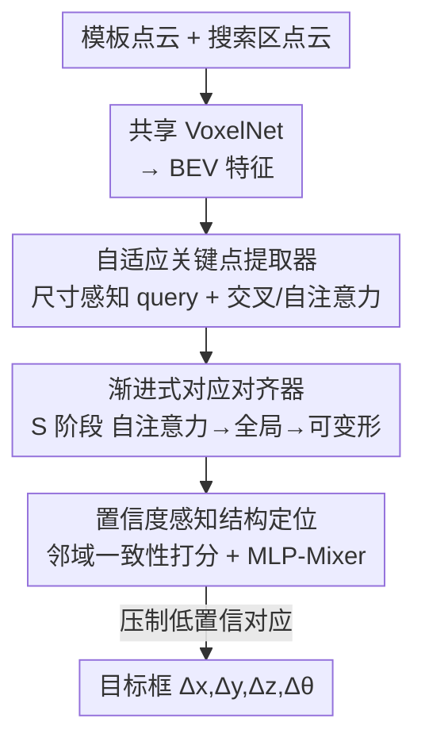

# Generalizable Structure-Aware Keypoint Correspondence for Category-Unified 3D Single Object Tracking

**会议**: CVPR 2026  
**论文**: [CVF OpenAccess](https://openaccess.thecvf.com/content/CVPR2026/html/Xiao_Generalizable_Structure-Aware_Keypoint_Correspondence_for_Category-Unified_3D_Single_Object_Tracking_CVPR_2026_paper.html)  
**代码**: 无  
**领域**: 3D视觉  
**关键词**: 3D单目标跟踪, 点云跟踪, 类别统一, 关键点对应, 结构感知  

## 一句话总结
UniKPT 提出用一组**自适应稀疏关键点**替代逐点稠密匹配，通过"自适应关键点提取 → 渐进式对应对齐 → 置信度感知结构定位"三模块，在单个模型里统一跟踪行人、卡车、巴士等差异巨大的类别，在 nuScenes 上比类别专属 SOTA 还高出 4.37%/5.16%（Success/Precision）。

## 研究背景与动机

**领域现状**：3D 单目标跟踪（3D SOT）给定首帧目标的 3D 框，要在后续 LiDAR 点云序列中持续定位它，是自动驾驶和机器人感知的基础能力。主流做法是 Siamese 范式：共享 backbone 提取模板（template）和搜索区域（search region）的点特征 → 做**逐点稠密特征交互**（point-point dense interaction）→ 回归目标框。

**现有痛点**：几乎所有方法都是**类别专属（category-specific）**范式——给每个类别（车/行人/卡车/自行车……）单独训练一个模型。这在部署上是灾难：多类别场景下要维护一堆模型，可扩展性和泛化性都极差。一个自然的想法是把现有框架直接扩成"一个模型管所有类别"，但实践证明行不通。

**核心矛盾**：失败的根因在于现有 pipeline 的两处先天缺陷。其一，点云稀疏、有噪声、频繁遮挡，模板和搜索区之间**常常根本不存在精确的对应点对**；逐点稠密交互机制在没有类别先验时，很难学到稳定可靠的几何对应。其二，现有定位策略要么从**单点特征**回归框（缺乏对周围上下文的感知），要么从**全局池化表示**回归框（把空间拓扑压扁了），两者都丢掉了目标内部的细粒度结构关系。类别间巨大的尺度/结构差异（行人 vs 卡车）让这两个缺陷在统一设定下被放大。

**本文目标**：作者把"造一个鲁棒的类别统一 3D tracker"拆成三个子问题——(1) 如何提取对不同尺度都适配的特征？(2) 如何在没有类别先验、只有框级标注的情况下建立鲁棒几何对应？(3) 如何把结构感知能力嵌入定位？

**切入角度**：与其在稀疏噪声点云上硬找逐点对应，不如退一步——只在模板上提取**少量但有代表性的关键点**，让它们感知各自周围的上下文，再去搜索区找对应。稀疏关键点天然比稠密点对更抗遮挡和噪声，且关键点之间的相对几何关系正是各类物体共享的"通用结构属性"。

**核心 idea**：用**稀疏的、尺度自适应的结构关键点之间的对应**（keypoint-to-keypoint）替代逐点稠密匹配（point-to-point），并显式建模关键点间的相对结构关系来做定位，从而在单模型内跨类别泛化。

## 方法详解

### 整体框架

UniKPT 的输入是相邻两帧的模板点云 $P_{t-1}\in\mathbb{R}^{N_{t-1}\times3}$ 和搜索区点云 $P_t\in\mathbb{R}^{N_t\times3}$，输出是目标在当前帧相对上一帧的位姿变化 $[\Delta x,\Delta y,\Delta z,\Delta\theta]$。整个流程先用共享的体素化 backbone（VoxelNet）把两帧点云编码为鸟瞰图（BEV）特征 $F_{t-1},F_t\in\mathbb{R}^{HW\times C}$，再串行经过三个模块：

- **自适应关键点提取器（AKE）**：从模板里抽出一组稀疏但有代表性、尺度自适应的关键点特征；
- **渐进式对应对齐器（PCA）**：把这些模板关键点逐阶段地与搜索区中的对应点对齐，得到鲁棒的跨帧几何对应；
- **置信度感知结构定位（CASL）**：先判断每个对应可不可信、压制不可靠的，再让可靠的关键点对相互交换结构信息，回归出最终目标框。

三个模块按序协作、相互依赖：AKE 决定"看哪些点"，PCA 决定"它们在搜索区落在哪"，CASL 决定"哪些对应可信、怎么用它们的结构关系定位"。

### 关键设计

**1. 自适应关键点提取器（AKE）：用尺寸感知 query 抽出尺度自适应的稀疏关键点**

痛点是：类别尺度差异巨大，固定方式提取的特征往往偏向某种尺寸或形状，对行人这种小而细密、卡车这种大而稀疏的物体没法同时表达好。AKE 的做法是把模板框 $B_{t-1}$ 沿三个轴均匀网格采样成 $n_x\times n_y\times n_z$ 个格子，格子中心作为初始关键点坐标 $R_{t-1}\in\mathbb{R}^{N_q\times3}$（$N_q=n_x n_y n_z$），并初始化一组可学习 query $Q^0\in\mathbb{R}^{N_q\times C}$。这种"按框尺寸初始化"天然保证了无论物体多大多小，关键点都能均匀覆盖其几何，提供显式空间先验。随后用 $L$ 层 Transformer 精炼：每层先把关键点坐标经轻量 MLP 编码后加进 query 以注入空间感知 $\widetilde{Q}^l=Q^{l-1}+\text{MLP}(R_{t-1})$，再用多头自注意力建模关键点间的内部几何关系，用多头交叉注意力让 query 去模板特征 $F_{t-1}$ 上聚合上下文（此时 query 充当"关键点检测器"），最后 FFN 精炼。$L$ 层后得到语义丰富、结构自适应的模板关键点特征 $F_{t-1}^{kpt}=Q^L$。关键在于"坐标先验 + 注意力精炼"让关键点既覆盖几何又有判别力，且这套机制不依赖任何类别先验。

**2. 渐进式对应对齐器（PCA）：多阶段从全局到局部地建立跨帧对应**

痛点是：点云稀疏、噪声、遮挡，一步到位地找模板关键点在搜索区的对应很不稳。PCA 用 query $Q_t^0$ 以模板关键点特征初始化、坐标 $R_t^0$ 设为模板关键点坐标，然后在 $S$ 个阶段里逐步精炼。每个阶段（图 2d）有四步交互：先把当前坐标编码加入 query 形成位置感知 query $\widetilde{Q}_t^s=Q_t^{s-1}+\text{MLP}_{PE}(R_t^{s-1})$；再用自注意力建模关键点间结构依赖；接着用**全局交叉注意力**把整个搜索区特征 $F_t$ 聚合进来（保证不漏掉任何潜在目标区域）；最后用**可变形交叉注意力**（deformable attention）只在当前关键点坐标 $R_t^{s-1}$ 周围稀疏采样局部特征，把聚合范围收窄、提升判别性：

$$Q_t^s=\hat{Q}_t^s+\text{DefAttn}(\hat{Q}_t^s,R_t^{s-1},F_t)$$

每阶段还预测坐标偏移更新关键点位置 $R_t^s=R_t^{s-1}+\text{MLP}_{offset}(Q_t^s)$，上一阶段的对齐结果作为下一阶段的先验。这套"全局保不漏 + 可变形收窄 + 逐阶段细化"的设计，是它能在没有类别先验下也建立稳定对应的关键。可视化（Fig.4）显示早期关键点常落在物体外或挤成一团，逐阶段后才精确铺满整个目标。

**3. 弱监督下的关键点坐标监督：用框级真值合成关键点级监督信号**

这是 PCA 能学起来的前提。难点在于 3D 跟踪数据集只有框级标注（相邻帧的相对平移 $t_{gt}$ 和旋转 $\Delta\theta$），没有关键点级对应真值。作者用真值相对位姿把模板关键点坐标变换到搜索帧得到伪真值 $R_t^{gt}=\mathbf{T}_\theta R_{t-1}+\mathbf{t}_{gt}$（$\mathbf{T}_\theta$ 是 yaw 角导出的旋转矩阵），再对每个阶段的预测坐标用 $\ell_1$ 损失监督 $\mathcal{L}_{coord}=\frac{1}{S}\sum_{s=1}^S\|R_t^s-R_t^{gt}\|_1$。因为目标尺寸假设跨帧不变，模板关键点经刚体变换就能得到它们"应该在搜索帧的哪"，这把框级标注巧妙转成了密集的关键点级监督——消融显示去掉它会从 64.21 暴跌到 60.63。

**4. 置信度感知结构定位（CASL）：靠邻域一致性给对应打分，再用 MLP-Mixer 做结构推理**

即便有了 PCA，遮挡和稀疏仍会留下错配或缺失的对应。CASL 先做**置信度估计**：判断一个对应可不可信的依据是"它在模板里的局部邻域关系，是否在搜索区被保持"。具体先算模板内所有关键点的两两特征差 $\Delta F_{t-1}^{(i,j)}=F_{t-1}^{kpt(i)}-F_{t-1}^{kpt(j)}$ 来刻画相对几何关系，经 1D 卷积压成关系特征 $G_{t-1}$，搜索区同理得 $G_t$，拼接后过 MLP+sigmoid 得到每个对应的可靠度 $s=\sigma(\text{MLP}_{confidence}([G_{t-1},G_t]))\in[0,1]^{N_q}$。然后做**置信度加权结构推理**：把模板和搜索关键点特征拼接并用 $s^{(i)}$ 重加权 $\tilde{F}_{pair}^{(i)}=s^{(i)}\cdot[F_{t-1}^{kpt(i)},F_t^{kpt(i)}]$，喂给轻量 **MLP-Mixer** 让所有对应在"对应维度"和"通道维度"双向交互、聚合成紧凑结构表示，最后定位头回归目标框，用残差对数似然损失 $\mathcal{L}_{loc}$ 训练。用邻域关系而非绝对特征判可信、用 MLP-Mixer 做跨对应交互，正好对应"压制 outlier + 利用内部结构关系"两个目标——消融显示去掉置信度分支掉到 63.34，把 MLP-Mixer 换成普通 MLP 掉到 62.51。

### 损失函数 / 训练策略
总损失为关键点坐标监督与框回归两项加权：$\mathcal{L}=\lambda_1\mathcal{L}_{coord}+\lambda_2\mathcal{L}_{loc}$。nuScenes 训 30 epoch、KITTI 训 150 epoch，AdamW（初始 lr $1\times10^{-4}$，weight decay $1\times10^{-5}$），单张 RTX 3090。默认 $S=3$ 阶段、$3\times3\times3=27$ 个关键点。

## 实验关键数据

### 主实验

评测指标为 Success（IoU 曲线 AUC）和 Precision（中心距离曲线 AUC）。在 nuScenes 上 UniKPT 作为**统一模型**全面刷新 SOTA，甚至超过带显式类别先验的类别专属方法：

| 数据集 | 范式 | 方法 | Mean Success | Mean Precision |
|--------|------|------|--------------|----------------|
| nuScenes | 类别专属 | P2P (IJCV'25) | 59.84 | 72.13 |
| nuScenes | 类别统一 | TrackAny3D (ICCV'25) | 54.57 | 66.25 |
| nuScenes | 类别统一 | **UniKPT (Ours)** | **64.21** | **77.29** |

相比统一基线 TrackAny3D 高 9.64/11.04，相比最强类别专属 P2P 高 4.37/5.16。在 KITTI 上 UniKPT 在长尾 Van 类比统一基线 MoCUT 高 4.2/2.6（68.7/81.4 vs 64.5/78.8），整体与类别专属方法保持竞争力。

### 消融实验

在 nuScenes 上做的组件消融（Mean Success/Precision）：

| 配置 | Success | Precision | 说明 |
|------|---------|-----------|------|
| (1) w/o $\mathcal{L}_{coord}$ | 60.63 | 73.30 | 去掉关键点坐标监督，掉最多 |
| (2) 只在最后阶段监督 | 61.57 | 74.63 | 失去逐阶段监督收益 |
| (3) w/o 可变形注意力 | 62.58 | 75.41 | 换成稠密交叉注意力 |
| (4) w/o 置信度估计 | 63.34 | 76.31 | 不压制不可靠对应 |
| (5) MLP-Mixer→MLP | 62.51 | 75.63 | 失去跨对应交互 |
| (6) MLP-Mixer→Self-Attn | 63.02 | 76.21 | 略逊于 Mixer |
| (7) **Ours（完整）** | **64.21** | **77.29** | — |

另有超参与设计分析：阶段数 $S=1/2/3/4$ 对应 62.0/63.4/64.2/63.8，第 4 阶段反而引入冗余更新和累积噪声，故选 $S=3$；关键点数 $2^3/3\!\cdot\!3\!\cdot\!2/3^3/4\!\cdot\!4\!\cdot\!3$ 对应 62.1/63.0/64.2/64.0，$3\times3\times3$ 是覆盖与效率的平衡点。效率上（Tab.6）关键点设计比逐点 baseline 更准（64.2/77.3 vs 59.3/71.6）且 FLOPs 减半（0.55G vs 1.11G）、FPS 更高（37 vs 32）。

### 关键发现
- **坐标监督是命门**：去掉 $\mathcal{L}_{coord}$ 掉 3.6 个点，是所有消融里最大跌幅——说明在弱（框级）监督下，用刚体变换合成的关键点级伪监督对建立稳定对应至关重要。
- **稀疏 > 稠密**：关键点-关键点匹配不仅比逐点匹配更准，还更省算力更快，验证了"稠密局部相关在无强先验时既不鲁棒又昂贵"的论断。
- **渐进精炼有上限**：阶段数和关键点数都存在饱和点，过度精炼/过密采样只会带来冗余噪声和算力浪费而无几何增益。
- **结构可视化自洽**：高置信度关键点集中在边界和判别性几何部位（Fig.3），早期关键点散乱、逐阶段铺满目标（Fig.4），与设计动机吻合。

## 亮点与洞察
- **范式级转换**：把"逐点稠密匹配"换成"稀疏结构关键点匹配"，一举解决可扩展性（单模型管所有类别）、鲁棒性（抗遮挡噪声）、效率（FLOPs 减半）三件事，是这篇最让人"啊哈"的地方。
- **框级标注变关键点监督**：利用"目标尺寸跨帧不变"的物理假设，用真值刚体变换把模板关键点投到搜索帧当伪真值——这个把弱标注转成密集监督的 trick 很可迁移，凡是有刚体运动假设、只有框级标注的跟踪/配准任务都能借鉴。
- **邻域一致性判置信度**：不直接看单点特征像不像，而看"局部相对几何关系是否被保持"，这种关系式可靠度估计对 outlier 更鲁棒，可迁移到点云配准、特征匹配等需要剔除误匹配的场景。
- **全局+可变形的两段式交叉注意力**：先全局保不漏、再可变形收窄，兼顾召回和判别，是处理"大搜索区里找小目标"的实用组合。

## 局限与展望
- KITTI 上 UniKPT 并未全面超过最强类别专属方法（如 Car 69.7 vs MBPTrack 73.4），在数据量小、多样性低时统一范式的优势没在 nuScenes 那么明显——说明该方法更吃大规模多类别数据。
- 关键点数和阶段数都靠网格搜索定死（$3^3$、$S=3$），没有按物体复杂度自适应分配关键点预算，对极端形状（如超长拖车 vs 行人）可能不是最优。
- 行人这类高度遮挡、非刚体的类别提升相对有限（nuScenes 45.03，未超 P2P 的 46.43），刚体结构假设在可形变目标上偏弱。
- 论文未开源代码，复现细节（如 backbone 配置、$\lambda_1,\lambda_2$ 取值）需查补充材料 ⚠️ 以原文为准。
- 可改进方向：让关键点数量/分布随类别或观测密度自适应；为非刚体目标引入可形变结构先验；探索时序多帧关键点轨迹约束。

## 相关工作与启发
- **vs 类别专属 Siamese 方法（P2B/MBPTrack/P2P）**：它们逐类训练、靠逐点稠密交互+类别先验，单类性能强但要维护一堆模型；UniKPT 用单模型 + 稀疏关键点匹配，无需类别先验，统一设定下反而更优。
- **vs 类别统一前作（MoCUT、TrackAny3D）**：MoCUT 靠自适应感受野缓解尺寸差异，TrackAny3D 靠预训练 3D 模型迁移；二者仍依赖稠密逐点交互。UniKPT 的差异在于从"匹配粒度"上动刀——稀疏结构关键点 + 渐进对应 + 置信度结构定位，在 nuScenes 上大幅领先 TrackAny3D（+9.64/+11.04）。
- **vs 运动中心范式（M2-Track/BEVTrack/P2P）**：它们直接预测帧间运动场，UniKPT 仍属 Siamese 匹配范式但用结构对应取代外观稠密相关，对稀疏遮挡更鲁棒。
- **启发**：稀疏结构关键点是统一异质类别的好抓手——当不同类别共享"内部相对几何关系"这一通用属性时，与其学类别专属外观先验，不如学跨类别通用的结构对应，这个思路对多类别检测、跨域配准等都有借鉴价值。

## 评分
- 新颖性: ⭐⭐⭐⭐⭐ 把类别统一 3D 跟踪从逐点稠密匹配重构为稀疏结构关键点对应，范式清晰且自洽。
- 实验充分度: ⭐⭐⭐⭐☆ 两大数据集 + 七项消融 + 效率/可视化分析充分，但未开源、KITTI 上优势有限。
- 写作质量: ⭐⭐⭐⭐⭐ 动机层层递进、三模块分工清晰、图文消融自洽，读完能复述全流程。
- 价值: ⭐⭐⭐⭐⭐ 单模型统一多类别且超越类别专属 SOTA，部署价值高、思路可迁移。

<!-- RELATED:START -->

## 相关论文

- [\[CVPR 2026\] MimiCAT: Mimic with Correspondence-Aware Cascade-Transformer for Category-Free 3D Pose Transfer](mimicat_mimic_with_correspondence-aware_cascade-transformer_for_category-free_3d.md)
- [\[CVPR 2026\] UniCorrn: Unified Correspondence Transformer Across 2D and 3D](unicorrn_unified_correspondence_transformer_across_2d_and_3d.md)
- [\[CVPR 2026\] H²A²: Homogeneity-Aware and Heterogeneity-Aware Feature Perception for Unified Indoor 3D Object Detection](h2a2_homogeneity-aware_and_heterogeneity-aware_feature_perception_for_unified_in.md)
- [\[CVPR 2026\] From Pairs to Sequences: Track-Aware Policy Gradients for Keypoint Detection](from_pairs_to_sequences_track-aware_policy_gradients_for_keypoint_detection.md)
- [\[ICCV 2025\] GSOT3D: Towards Generic 3D Single Object Tracking in the Wild](../../ICCV2025/3d_vision/gsot3d_towards_generic_3d_single_object_tracking_in_the_wild.md)

<!-- RELATED:END -->
