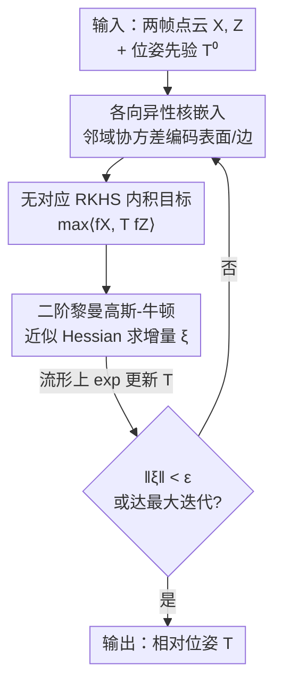

# Generalized-CVO: Fast and Correspondence-Free Local Point Cloud Registration with Second Order Riemannian Optimization

**会议**: CVPR 2026  
**论文**: [CVF Open Access](https://openaccess.thecvf.com/content/CVPR2026/html/Zhang_Generalized-CVO_Fast_and_Correspondence-Free_Local_Point_Cloud_Registration_with_Second_CVPR_2026_paper.html)  
**代码**: 无（项目页 https://sites.google.com/tri.global/gcvo）  
**领域**: 3D视觉  
**关键词**: 点云配准, 无对应配准, RKHS核嵌入, 各向异性核, 黎曼优化  

## 一句话总结
G-CVO 把点云表示成 RKHS 里的连续函数、用各向异性核编码局部表面几何，再用带近似黎曼 Hessian 的二阶高斯-牛顿在 SE(3) 流形上求解配准，做到无需点对应、对特征稀疏场景鲁棒，且比同类一阶 RKHS 方法快约 10 倍。

## 研究背景与动机
**领域现状**：帧间点云配准（tracking）是 LiDAR / 视觉里程计的核心环节——给定一个位姿先验，迭代地把新一帧 $Z$ 对齐到目标帧 $X$。主流是 ICP 系（ICP、GICP、Fast-VGICP、NDT）的两步交替优化：先找最近邻建立点对应，再在对应约束下最小化残差求相对位姿。

**现有痛点**：ICP 系的整套逻辑都压在"点对应能可靠建立"这个假设上。在乡村、越野、赛道这类**特征稀疏**环境里，几何特征少、点云退化，最近邻匹配会大量出错，配准随之崩掉（表 1 里 ICP/NDT 在高速公路序列 01 上平移误差高达几十上百米）。无对应的 RKHS 方法（CVO 系）把点云当成连续函数、用函数内积做配准，绕开了显式匹配、对噪声和外点更鲁棒，但有两个老问题：(1) 用的是**各向同性核**，完全没利用点云本就是"表面扫描"这一局部几何结构；(2) 全部依赖**一阶**黎曼梯度上升求解，在高性能驾驶这类对延迟敏感的场景里慢到不可用（一阶要 1200+ 次迭代才收敛）。

**核心矛盾**：想要鲁棒（无对应、RKHS）就得放弃 ICP 几十年积累的"点到面/点到边"几何先验和成熟的二阶求解器；而想要快和准（二阶、用几何结构）的方法又都绑死在点对应上。两条路线的优点没人合到一起。

**本文目标**：在无对应的 RKHS 框架里，(1) 把局部表面几何塞进核函数，(2) 推导出可用的二阶黎曼求解器，让无对应配准既鲁棒又快又准。

**切入角度**：作者注意到点云扫描本质是**表面采样**——一个点的局部邻域协方差就编码了它落在平面、边还是角上。把这个各向异性的局部协方差直接做进 RKHS 核，就能让配准"沿表面法向贴紧、沿切向放松"，相当于免特征提取地复刻了 ICP 的点到面/点到边先验。

**核心 idea**：用各向异性核嵌入（surface-aware）替代各向同性核来注入几何，并用近似黎曼高斯-牛顿替代一阶梯度上升来加速——合称 Generalized CVO（G-CVO）。

## 方法详解

### 整体框架
G-CVO 把配准建成一个 SE(3) 流形上的**迭代极大化**问题：把两帧点云各自表示成 RKHS 中的函数 $f_X, f_Z$，配准目标是最大化二者内积 $\langle f_X, T f_Z\rangle$（等价于最小化函数空间里的距离），而不是去找点对点的最近邻。整条流水线从位姿先验 $T^{(0)}$ 出发，每一轮先用当前估计把 $Z$ 变换到 $T^{-1}Z$、按局部邻域算各向异性协方差 $\Sigma_{ij}$，再算目标函数值、黎曼梯度和近似 GN Hessian，最后在流形上做一步 $\exp$ 更新，直到位姿增量收敛。整个过程没有 KD-tree 匹配、没有显式对应。

### 关键设计

**1. 各向异性核嵌入：让 RKHS 核自己"看见"表面与边**

CVO 的各向同性核把每个点当成各向同性的"球"，完全无视点云是表面扫描这一事实，配准时各方向一视同仁、精度受限。G-CVO 把核推广成各向异性指数核

$$k(x,z) = \sigma^2 \exp\!\Big(-\tfrac{1}{2}\big\langle (x-z),\ \Sigma(x,z)^{-1}(x-z)\big\rangle\Big),$$

其中 $\Sigma$ 由局部邻域的经验协方差给出：对目标帧某点 $x$，取其 $\bar X$ 中 $n$ 个最近邻 $N_{\bar X}(x)$（通过 KD-tree 球查询得到），算

$$\Sigma(x;\bar X) = \frac{1}{n-1}\sum_{y\in N_{\bar X}(x)} (y-x)(y-x)^\top,\qquad \Sigma(x,z)=\Sigma(x;\bar X)+R^\top\Sigma(z;\bar Z)R,$$

$R$ 是两帧间的旋转。这个协方差天然编码了局部几何：落在平面上的点其协方差有一个小特征值（法向），落在边上的点有两个小特征值——作者据此把点分成"surface/edge"两类（图 2）。Mahalanobis 形式的核因此会沿法向贴得紧、沿切向放松，**免特征提取地**复刻了 ICP 系点到面/点到边残差的效果，这是它在特征稀疏场景更准的根源。

**2. 各向异性退化的特征模正则：防止法向被过度压制**

⚠️ 这是设计 1 的必要补丁（原文 Remark 1）。直接用经验协方差会让损失既稀疏又含噪：核会**衰减掉与高方差法向对齐的分量**，反而把对配准最有用的法向约束削弱，造成退化。G-CVO 对 $\Sigma(x,z)$ 的主特征模施加上界，约束"法向—切向"的加权比，保证各几何方向对损失都有数值稳定的贡献。换句话说，设计 1 给了几何敏感性，这一步把它的副作用（法向退化）摁住，二者合起来才能稳定提升精度。

**3. 近似黎曼高斯-牛顿求解器：把一阶的上千次迭代压到几十次**

无对应 RKHS 此前只有一阶梯度上升，对所有维度用同一个步长、不带曲率信息，收敛极慢（KITTI 上 >1200 次迭代）。注意到目标 $f(T)=\langle f_X,Tf_Z\rangle=\sum_{ij}\langle\ell_X,\ell_Z\rangle\,k(x_i,T^{-1}z_j)$ 在 $G=SE(3)$ 上局部二次，作者推导出闭式的黎曼梯度（Lemma 1）和近似黎曼 Hessian，做高斯-牛顿更新：

$$T^{(k+1)} = T^{(k)}\exp\!\Big(-\big[(\mathrm{Hess}_{GN}f)^{-1}\,\mathrm{grad}f^{\vee}\big]^{\wedge}\Big).$$

关键的工程取舍是**两处近似**（Remark 2）：协方差 $\Sigma_{ij}$ 每轮只更新一次、步内当常数；Hessian 的方向导数只保留式 (19c) 的主导末项（受 inexact GN 启发）。KITTI 消融显示：用精确 Hessian（G-CVO-E）只换来边际的收敛速度提升，却显著抬高每轮开销，总时间反而更糟——所以近似版 G-CVO-2 是更优的"准确度/速度"折中。另有两个细节让流形优化数值更干净：用左不变度量把切空间量左平移回单位元 $g\cong\mathbb R^6$ 处理；每轮都用 $(T^{(k)})^{-1}$ 变换 $Z$，使每步都从单位元起步（Remark 4），免去把梯度在不同切空间间搬运。

### 损失函数 / 训练策略
G-CVO 是优化方法、无学习参数。一阶版（G-CVO-1）用式 (15) 的四阶多项式展开做线搜索定步长 $\mu$（取最小正实根）；二阶版（G-CVO-2）用上述 GN 更新。两版共享 Algorithm 1 的迭代外壳，迭代上限设 200（对齐典型 LiDAR 里程计设置），CUDA 实现在 GPU 上跑。

## 实验关键数据

### 主实验
在 KITTI（特征丰富城市驾驶，11 序列，体素 0.25m 下采样）上做帧间 tracking，指标为 KITTI 官方平移误差（RTE）/ 旋转误差（RRE）。下表为各序列均值：

| 数据集 | 指标 | G-CVO-2 (本文) | G-CVO-1 (本文) | Fast-VGICP | CVO(一阶) | GICP | ICP | NDT |
|--------|------|------|------|------|------|------|------|------|
| KITTI 均值 | RTE↓ | **1.389** | 1.393 | 1.833 | 1.974 | 37.51 | 8.906 | 71.39 |
| KITTI 均值 | RRE↓ | **0.0069** | 0.0078 | 0.0060 | 0.0116 | 0.0200 | 0.0305 | 0.2024 |

G-CVO 平移误差最低、旋转误差与 Fast-VGICP 持平；在难找对应的高速公路序列 01/04 上对基线优势尤其大（如序列 01：G-CVO-2 RTE 2.08，Fast-VGICP 8.50，CVO 4.37）。

在自采的**特征稀疏赛道**数据（128 线 LiDAR，Skid Pad / Race Track / Dirt Track 三序列，体素 2m 下采样，求收敛 <100ms）上：

| 数据集 | 指标 | G-CVO-2 (本文) | G-CVO-1 | Fast-VGICP | GICP | ICP | CVO(二阶) |
|--------|------|------|------|------|------|------|------|
| 赛道 均值 | RTE↓ | **4.319** | 19.88 | 11.53 | 16.05 | 34.59 | 9.897 |
| 赛道 均值 | RRE↓ | **0.0139** | 0.0552 | 0.0359 | 0.1605 | 0.0996 | 0.0315 |

G-CVO-2 在最难的特征稀疏场景里平移/旋转漂移都最低，相对次优基线在两项上均有 >55% 的漂移降低；对照实验把经典 CVO 也换上同款二阶求解器（CVO 二阶），它仍明显劣于 G-CVO，说明增益主要来自**各向异性核的表面先验**而不只是二阶优化。室内 ETH3D RGB-D（5 序列，~3000 点）上，G-CVO-2 在 APE 上平均最优（均值 0.191），RPE 次优。

### 消融实验
| 配置 | 关键现象 | 说明 |
|------|---------|------|
| G-CVO-2（近似 Hessian） | KITTI seq03 约 30 次迭代收敛 | 完整二阶版 |
| G-CVO-1（一阶梯度上升） | 同精度需 >1200 次迭代 | 去掉二阶曲率信息 |
| G-CVO-E（精确 Hessian） | 收敛圈数与 G-CVO-2 相近，单轮更贵 | 总耗时反而更高 |
| 各向同性核（CVO 二阶） | 表 2 漂移显著高于 G-CVO | 去掉各向异性表面先验 |

### 关键发现
- **二阶求解是速度命门**：G-CVO-2 收敛只需约 30 次迭代，一阶要 1200+；端到端比一阶 RKHS 方法快约 10 倍，~10⁴ 点时 <100ms，4k 点可做到 10Hz tracking。
- **近似 Hessian 是更优折中**：相比精确 Hessian（G-CVO-E），近似版省约 50% 计算且收敛到同解——精确 Hessian 的收益边际、不抵其每轮开销。
- **核的各向异性贡献独立于二阶**：把 CVO 也配上二阶求解器仍输给 G-CVO，证明表面感知核本身带来精度增益。
- **复杂度代价**：单轮 $O(N_X N_Z)$，高于 KD-tree ICP 的 $O(N_X\log N_Z)$，靠 GPU 与二阶收敛把总时间扳回来。
- **物体级配准**（ModelNet40）：洁净设定下 G-CVO-2 旋转误差 0.267°，优于学习型 GeoTransformer 的 0.650°；但裁剪 30% 重叠下降到 32.8°（缺学习到的不变特征）。用 G-CVO 精化 GeoTransformer 初值能稳定提升（裁剪 30%：GeoTransformer 0.934° → 精化后 0.355°），适合做全局配准的局部细化。

## 亮点与洞察
- **用核函数"偷渡"几何先验**：把局部邻域协方差直接做进 RKHS 核，就免特征提取地实现了 ICP 的点到面/点到边效果——这是无对应方法首次系统吃到表面结构红利，思路可迁移到任何核方法里注入结构先验。
- **二阶 + 近似 Hessian 的工程判断很实在**：先推闭式黎曼 Hessian 拿到收敛速度，再果断只留主导项换速度，并用 KITTI 消融证明"精确反而更慢"，是把理论与延迟约束对齐的好范例。
- **每轮从单位元起步**（Remark 4）：用 $(T^{(k)})^{-1}$ 重置问题，规避切空间间梯度搬运，是流形优化里干净又省事的小技巧。
- **可作全局配准的细化层**：天然能精化 GeoTransformer 等学习型全局配准的输出，定位清晰（局部细化而非全局求解）。

## 局限与展望
- **依赖 GPU**：稠密两两核与雅可比求值开销大，作者承认快速评估高度依赖 GPU；单轮 $O(N_X N_Z)$ 复杂度在大点数下劣于 KD-tree 方法，未用 VGICP 的体素哈希加速。
- **假设充分重叠**：求解器面向 odometry，假设两帧足够重叠；大运动 / 低重叠（如 ModelNet40 裁剪 30%）下精度大幅退化，因为缺学习到的不变特征。
- ⚠️ **未做完整里程计**：实验只评估连续帧帧间 tracking，没有局部建图 / 回环，未接成完整 VO/LiDAR 里程计系统——作者把这列为未来工作。
- **改进方向**：把 G-CVO 嵌入完整里程计管线；把目标函数做成可微层接入深度网络（端到端学习核内的点级特征）。

## 相关工作与启发
- **vs CVO / SemanticCVO**：同属无对应 RKHS 配准、同样最大化函数内积，但 CVO 用各向同性核 + 一阶求解；G-CVO 换成各向异性表面感知核 + 二阶近似 GN，更准且快约 10 倍（令 $\Sigma\to I$ 即退化回 CVO）。
- **vs ICP / GICP / NDT**：它们靠最近邻对应 + SVD/流形求解，特征稀疏时匹配崩溃；G-CVO 无对应、对外点更不敏感，赛道场景漂移降低 >55%，但单轮复杂度更高、需 GPU。
- **vs GeoTransformer（学习型全局配准）**：GeoTransformer 靠学习不变特征擅长大初始误差、低重叠；G-CVO 是局部细化，洁净物体配准下反超它，并能稳定精化其输出，二者互补而非替代。

## 评分
- 新颖性: ⭐⭐⭐⭐ 把各向异性表面几何注入 RKHS 核、并配上二阶黎曼 GN，是无对应配准路线上扎实的一步组合创新。
- 实验充分度: ⭐⭐⭐⭐ 覆盖 KITTI / 自采赛道 / ETH3D / ModelNet40 四类数据，含收敛与计算量消融，但未接完整里程计系统。
- 写作质量: ⭐⭐⭐⭐ 推导严谨、Remark 把工程取舍交代清楚，公式偏密但逻辑连贯。
- 价值: ⭐⭐⭐⭐ 特征稀疏 LiDAR tracking 的实用增益明显，且能作学习型全局配准的细化层。

<!-- RELATED:START -->

## 相关论文

- [\[CVPR 2026\] SuP: Sub-cloud Driven Point Cloud Registration](sup_sub-cloud_driven_point_cloud_registration.md)
- [\[CVPR 2026\] Registration-Free Learnable Multi-View Capture of Faces in Dense Semantic Correspondence](registration-free_learnable_multi-view_capture_of_faces_in_dense_semantic_corres.md)
- [\[CVPR 2026\] C-GenReg: Training-Free 3D Point Cloud Registration by Multi-View-Consistent Geometry-to-Image Generation with Probabilistic Modalities Fusion](c-genreg_training-free_3d_point_cloud_registration_by_multi-view-consistent_geom.md)
- [\[CVPR 2026\] MHopReg: Efficient Hierarchical Multi-Hop Graph Search for Point Cloud Registration](mhopreg_efficient_hierarchical_multi-hop_graph_search_for_point_cloud_registrati.md)
- [\[CVPR 2026\] 4D Local Modeling Toward Dynamic Global Perception for Ambiguity-free Rotation-Invariant Point Cloud Analysis](4d_local_modeling_toward_dynamic_global_perception_for_ambiguity-free_rotation-i.md)

<!-- RELATED:END -->
