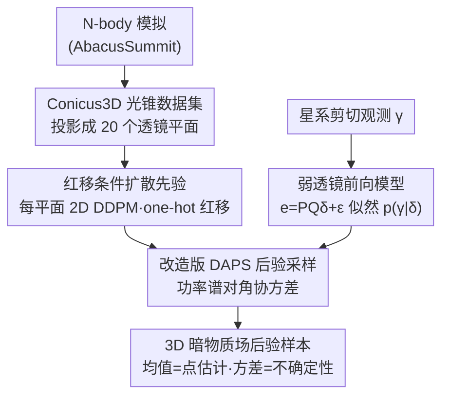

# Generative Diffusion Priors for 3D Mapping of the Dark Universe

**会议**: CVPR 2026  
**arXiv**: [2606.00803](https://arxiv.org/abs/2606.00803)  
**代码**: 论文承诺公开数据与代码（暂未给出仓库地址）  
**领域**: 3D视觉 / 扩散模型 / 科学反问题  
**关键词**: 暗物质质量映射, 弱引力透镜, 扩散先验, 后验采样, 宇宙学

## 一句话总结
本文把"从弱引力透镜观测重建暗物质三维分布"这一高度病态的宇宙学反问题，转化为扩散模型后验采样：先用 N-body 模拟构建 Conicus3D 光锥数据集、训练一个按红移条件化的 2D 扩散先验，再用改造过的 DAPS 算法把这个数据驱动先验和可微的弱透镜物理前向模型耦合起来，在模拟 JWST COSMOS-Web 巡天上把 3D/2D 重建相关性和功率谱保真度都显著推高于 Wiener 滤波与 Neural Ensemble 基线。

## 研究背景与动机
**领域现状**：暗物质不发光，只能通过它对背景星系光线的弱引力透镜（weak lensing, WL）效应间接推断。从星系形状的微小、相干"剪切"（shear $\gamma$）反演出沿视线方向的质量分布，就是"质量映射"（mass mapping）反问题。2D 投影质量映射（重建积分后的会聚 $\kappa$）相对良态，已有 Kaiser-Squires 解析反演、Wiener 滤波、稀疏正则、U-Net 与扩散模型等方案。

**现有痛点**：真正难的是**三维**重建。我们只有**单一视线**这一个视角，星系距离只能靠测光红移粗估（噪声大），加上星系本征形状带来的"形状噪声"（shape noise，量级比剪切信号大两个数量级），三者叠加使 3D 反演极端病态。天体物理界现有做法（高斯先验、稀疏约束、奇异向量截断、小波多分辨率）都依赖手工平滑先验，结果被过度抹平，丢掉了宇宙网那种非高斯的纤维状结构；机器学习的 neural-field / ensemble 方法能给近似不确定性，但**并不对应严格的贝叶斯后验**。

**核心矛盾**：反问题需要强先验来约束病态解，但手工解析先验无法刻画结构形成的非线性、非高斯统计；而能逼近真实统计的来源——高分辨率宇宙学模拟——此前没有被组织成可学习的生成先验喂进反演框架。

**本文目标**：(1) 提供一个能从中学到真实 3D 暗物质统计的数据集；(2) 设计一个把"模拟学到的先验"与"已知物理前向模型"严格结合、能做后验采样的重建框架。

**切入角度**：新一代 N-body 模拟（AbacusSummit）已能高保真演化结构形成。把模拟输出整理成光锥数据，训练扩散模型当先验，再借鉴近年即插即用（plug-and-play）扩散反问题求解器，就能在保物理一致的前提下采样后验。

**核心 idea**：用"模拟驱动的红移条件扩散先验 + 可微弱透镜前向模型"替代手工平滑先验，把 3D 质量映射做成扩散后验采样，从而既恢复小尺度纤维结构、又给出可校准的不确定性。

## 方法详解

### 整体框架
整篇方法可以拆成"离线建先验"和"在线解反问题"两条线。离线侧：从 AbacusSummit N-body 模拟里抽取暗物质光锥、投影成一摞按共动距离等距排列的透镜平面（lens plane），构成 Conicus3D 数据集，再用它训练一个**按红移条件化的 2D 扩散模型**当先验 $p(\delta)$。在线侧：给定一次巡天的星系剪切观测，套上弱透镜的可微前向模型得到似然 $p(\gamma|\delta)$，用改造过的 DAPS（Decoupled Annealing Posterior Sampling）把先验和似然耦合，从后验 $p(\delta|\gamma)\propto p(\gamma|\delta)p(\delta)$ 里采样出一批物理自洽的 3D 暗物质过密度场 $\delta$，其均值当点估计、其方差当不确定性。

### 关键设计

**1. Conicus3D：把 N-body 模拟整理成可学习的 3D 光锥先验来源**

病态反问题缺的是能刻画真实非高斯结构的先验，而以往要么用解析平滑先验、要么没有现成的 3D 训练资源。本文从 AbacusSummit 模拟（演化超 3000 亿粒子）里直接把粒子投影到观测者的光锥几何上，对延伸到 $z\approx 2$ 的一系列红移壳层计算过密度 $\delta=(\rho-\bar\rho)/\bar\rho$，按**共动距离等距**分箱成 20 个透镜平面，再裁剪到 COSMOS 巡天的天区足迹，使数据几何与真实观测对齐。数据集含 20,000 个同分布（fiducial 宇宙学）光锥、800 个异分布（改宇宙学参数）光锥，外加带真实星系位置/红移/投影权重的模拟形状目录。这样既给扩散模型提供了学非线性统计的素材，又因为统一的光锥几何天然可扩展到 FRB、CMB 次级各向异性、21cm 等其他视线投影观测——它是后两个设计能成立的物理底座

**2. 红移条件化的光锥扩散先验：用 2D 图像去噪器拼出 3D 体积场**

直接学 3D 体积分布既贵又难。本文利用一个物理近似：因为透镜平面跨越极大的距离尺度，不同红移平面的分布可近似独立，于是把光锥先验因子化为 $p(\delta)=\prod_{z=1}^{M}p(\delta^{(z)})$（$M$ 个固定红移）。这样只需训练一个**条件 2D 扩散模型**估计各红移的边缘先验 $p(\delta^{(z)}|z)$：标准 DDPM U-Net、作用在 $128\times128$ 的透镜平面图上，把红移以 one-hot 向量拼接进输入。生成 3D 光锥时，对一批图各自从高斯噪声起步、带着对应红移编码一起去噪，就得到一个红移连贯的体积场。它把"3D 生成"巧妙降维成"按红移批量做 2D 去噪"，既省算力又让先验能被严格当作分数估计器 $\nabla_\delta\log p(\delta)$ 接进后验采样

**3. 改造版 DAPS：用功率谱对角化的协方差注入宇宙学先验结构**

有了先验分数和物理似然，要从后验里采样。本文以 DAPS 为骨架：它通过从 $t=T$ 到 $0$ 的退火序列采样噪声后验 $p(\delta_t|\gamma)$，每步交替 (1) 采 $\delta_{0|\gamma}\sim p(\delta_0|\delta_{t+\Delta t},\gamma)$、(2) 采 $\delta_t\sim\mathcal{N}(\delta_{0|\gamma},\sigma_{t_2}^2\mathbf{I})$。原始 DAPS 在第 (1) 步把难解的 $p(\delta_0|\delta_t)$ 近似成**像素空间对角协方差**的高斯，完全无视场内的空间相关性。本文的关键改动是：依据宇宙学的平移不变性与各向同性，把协方差改成在**傅里叶空间**按物质功率谱（power spectrum）$P_k$ 对角化：

$$\mathbf{\Sigma}_t^{-1}=F^{-1}\operatorname{diag}\!\left(\sigma_t^{-2}+P_k^{-1}\right)F$$

其中 $P_k$ 由训练数据经验估计（对训练集求平均）。这等于把"宇宙物质场是近平稳随机场、各尺度功率由 $P_k$ 决定"这一先验结构注入采样过程，让重建在保留小尺度功率的同时不被像素级对角假设抹平。作者指出这种傅里叶对角结构对任何近平稳场反问题（自适应光学、地球物理反演、CMB 制图）都通用

### 损失函数 / 训练策略
扩散先验按标准条件 DDPM 的分数匹配/去噪目标训练，作用于 $128\times128$ 透镜平面、以 one-hot 红移为条件；不需要任何成对的"观测—真值"监督，纯粹学先验 $p(\delta^{(z)}|z)$。反问题侧不再训练，靠改造版 DAPS 在推理时把先验分数与可微前向模型给出的高斯似然耦合做后验采样。似然来自前向模型 $e_{\text{obs}}=\mathbf{P}\mathbf{Q}\delta+\varepsilon,\ \varepsilon\sim\mathcal{N}(0,\sigma_{\text{shape}})$：$\mathbf{Q}$ 是把过密度沿视线加权积分成会聚 $\kappa$ 的投影（式中含 $H_0,\Omega_m$ 等宇宙学参数与膨胀因子 $a(w)$，并把测光红移不确定性以对距离 $w$ 取期望的方式直接吸收进前向模型），$\mathbf{P}$ 是用复核 $\mathcal{D}(\boldsymbol\theta)=-1/(\boldsymbol\theta^*)^2$ 把 $\kappa$ 卷成剪切 $\gamma$；两个算子对 $\delta$ 都线性，故这是一个带高斯形状噪声的线性反问题。

## 实验关键数据

### 主实验
评测设定为模拟 JWST COSMOS-Web 巡天：天区 0.54 deg²、源星系密度约 261 个/arcmin²、本征形状噪声弥散 $\sigma_e\approx0.25$、测光红移弥散 $\sigma_z=0.11(1+z)$。基线为解析 Wiener 滤波重建与 Neural Ensemble 估计器。每个方法对 128 个样本求后验均值作点估计，用"去均值 Pearson 互相关系数"评估与真值的一致性（因前向模型对 $\kappa$ 加常数不变）。3D 评估时还会对真值和重建沿径向 $z$ 方向用 $\sigma=4$ 透镜平面的高斯核模糊后再算相关（$\rho_{\text{blur}}^{3D}$），以体现径向位置的固有不确定性。

| 体积 | 方法 | $\rho_{\text{blur}}^{3D}\uparrow$ | $\rho^{3D}\uparrow$ | $\rho^{2D}\uparrow$ |
|------|------|------|------|------|
| 1 | **Ours** | **0.83** | **0.23** | **0.87** |
| 1 | Neural Ensemble [49] | 0.79 | 0.21 | 0.86 |
| 1 | Wiener [42] | 0.71 | 0.21 | 0.77 |
| 2 | **Ours** | **0.83** | **0.27** | **0.88** |
| 2 | Neural Ensemble [49] | 0.80 | 0.21 | 0.87 |
| 2 | Wiener [42] | 0.72 | 0.23 | 0.83 |
| 3 | **Ours** | **0.92** | **0.18** | **0.98** |
| 3 | Neural Ensemble [49] | 0.86 | 0.09 | 0.96 |
| 3 | Wiener [42] | 0.84 | 0.13 | 0.92 |

三个光锥体积上，本文方法在 2D 与 3D（含 blur 与全分辨率）相关系数上**一致优于**两个基线。提升最显著的是 $\rho_{\text{blur}}^{3D}$（如体积 3：0.92 vs 0.86/0.84）和全分辨率 $\rho^{3D}$（体积 3：0.18 vs 0.09/0.13，几乎是 Neural Ensemble 的两倍）。需诚实指出：全分辨率 $\rho^{3D}$ 的绝对值普遍偏低（0.18–0.27），反映 3D 径向重建本身极病态，单视角+噪声下只能恢复有限径向分辨率。

### 消融与分析实验
论文没有给传统"逐模块开关"的消融表，而是用**功率谱保真度**、**宇宙学失配泛化**、**不确定性校准**三组分析验证各设计的价值：

| 分析维度 | 关键现象 | 说明 |
|------|---------|------|
| 角功率谱 $C_\ell^\kappa$（样本级） | 本文样本在高 $\ell$（小尺度）保留正确功率；Neural Ensemble 在噪声功率超过信号时过度平滑、被先验主导 | 设计 2/3 让单样本保小尺度结构 |
| 径向功率谱（沿透镜平面） | 本文样本径向谱近似平坦 = 红移平面间去相关；Neural Ensemble 出现虚假视线相关 | 印证"平面独立"因子化假设合理 |
| 宇宙学失配（无质量中微子 OOD） | 先验是 fiducial 宇宙学，但 OOD 真值功率更高、透镜信号更强，似然引导让后验谱仍匹配真值 | 设计 3 的似然项在先验失配时纠偏 |
| 不确定性校准 | 体素级"样本标准差 vs 真实 MAE"相关 $r=0.92$（本文）/ $r=0.90$（Neural Ensemble），但只有本文对应严格贝叶斯后验 | 后验采样的核心卖点 |

### 关键发现
- **小尺度功率是分水岭**：基线的平滑正则在噪声功率压过信号时会抹掉高频结构，使重建"看起来很糊"；扩散后验则在全尺度匹配真值角功率谱，这对依赖小尺度/径向结构的下游统计（峰计数、空洞、Minkowski 泛函、双谱、与星系/CMB 交叉相关）至关重要。
- **似然引导能救先验失配**：异分布宇宙学（无质量中微子）下真值功率更高，但更强的透镜信号让似然部分压过失配先验，后验样本谱仍贴合真值——方法对适度宇宙学偏差稳健。
- **后验采样 ≠ ensemble 的"伪不确定性"**：虽然两者校准相关系数接近（0.92 vs 0.90），但只有本文样本对应良定义的贝叶斯后验，使得非线性统计量的后验预测区间在真实数据上才可能正确校准。

## 亮点与洞察
- **把 3D 生成降维成"红移条件的 2D 批量去噪"**：靠"透镜平面跨大尺度近似独立"这一物理近似把先验因子化，用一个普通 DDPM U-Net 就拼出连贯 3D 光锥——既省算力，又让先验能严格当分数估计器接进后验采样，是工程与物理双赢的巧思。
- **把宇宙学结构编码进采样协方差**：用功率谱在傅里叶空间对角化协方差（式 7），等于把"近平稳随机场"的先验结构注入 DAPS 内层高斯近似，比像素级对角假设更贴合物理。作者点明这套谱采样可迁移到自适应光学、地球物理反演、CMB 制图等任何近平稳场反问题——是可复用的通用 trick。
- **"严格后验 vs 近似不确定性"的清醒区分**：论文反复强调 Neural Ensemble 的 ensemble 只是近似不确定性，而本文对应真贝叶斯后验，因此样本级（而非仅均值）统计才无偏——这对从模拟走向真实数据做宇宙学参数推断是决定性的。
- **数据集即基础设施**：Conicus3D 的光锥几何/红移分箱/共动距离采样统一框架，天然能复用到 FRB、21cm、CMB 次级各向异性等视线投影观测，给 CV 与天体物理两个社区都留了接口。

## 局限与展望
- **作者承认**：重建对"模拟来源先验"的选择敏感性尚未充分分析（不同宇宙学参数设定、不同模拟代码会带来多大差异），是明确列出的未来工作。
- **全分辨率 3D 相关性绝对值偏低**（$\rho^{3D}$ 仅 0.18–0.27）：单视角 + 大噪声下径向分辨率本质受限，论文不得不引入"径向高斯模糊后再比"的评估方式，说明真正逐切片的 3D 定位仍很弱。
- **"平面独立"是近似而非真理**：把红移平面当独立虽让径向谱平坦、避免虚假视线相关，但真实结构沿视线存在相关性（纤维、星系团延展），这个简化可能在更宽红移跨度或更高分辨率下失效。
- **仅在模拟上验证**：所有评测都基于模拟 JWST COSMOS-Web，真实 COSMOS-Web 剪切目录未公开；模拟到真实数据的域差（选择效应、PSF、星系本征对齐等）尚待检验。
- **改进方向**：把红移平面间的弱相关显式建模进先验、对先验宇宙学做敏感性/边缘化、以及把多种下游非线性统计（峰计数、交叉相关）直接纳入校准评测，会让"可校准不确定性"的承诺更扎实。

## 相关工作与启发
- **vs Wiener 滤波 [42]**：Wiener 用解析高斯先验做线性 MMSE 反演，结果被严重过度平滑、丢小尺度功率；本文用数据驱动扩散先验 + 后验采样，恢复纤维结构且功率谱全尺度匹配，三个体积 2D/3D 相关全面更高。
- **vs Neural Ensemble [49]**：两者都能给"样本"做不确定性，但 Neural Ensemble 是 neural-field / ensemble 近似、不对应严格后验，且平滑正则在低信噪比时抹掉小尺度、产生虚假视线相关；本文对应真贝叶斯后验，样本级统计无偏、径向谱去相关。
- **vs DPS [11] 等 guidance 类扩散反问题求解器**：DPS 用似然梯度"轻推"样本，但不保证收敛到真后验；本文走 plug-and-play / DAPS 路线，把似然分数以有原则的方式并入逆过程，并针对宇宙场改造协方差，物理一致性更强。
- **vs BORG 等贝叶斯前向建模 [35,36]**：BORG 通过采样初条件再经引力求解器演化保证物理自洽，但计算极昂贵；本文用模拟训练的生成先验近似这套统计，推理成本低得多。
- **启发**：把"领域物理（功率谱、平移不变性）写进扩散后验采样的协方差/因子化结构"是一条把生成先验落地到科学反问题的通法——凡是近平稳随机场、单/少视角、强噪声的成像反问题（医学、地球物理、天文）都可借鉴这套"模拟造数据集 → 条件扩散先验 → 物理似然 + 谱协方差后验采样"的范式。

## 评分
- 新颖性: ⭐⭐⭐⭐⭐ 首个面向 3D 弱透镜质量映射的光锥数据集 + 把功率谱协方差注入 DAPS 的后验采样，跨 CV 与宇宙学的实打实创新。
- 实验充分度: ⭐⭐⭐⭐ 多体积、多指标、宇宙学失配与校准分析齐全，但仅限模拟、缺逐模块消融、全分辨率 3D 相关绝对值偏低。
- 写作质量: ⭐⭐⭐⭐⭐ 物理背景、前向模型与方法推导讲得清晰自洽，图表与结论对应严谨。
- 价值: ⭐⭐⭐⭐⭐ 开放数据/代码搭建可复现测试床，为暗物质 3D 制图与一类近平稳场反问题提供可迁移范式。

<!-- RELATED:START -->

## 相关论文

- [\[CVPR 2026\] Scene Reconstruction as Mapping Priors for 3D Detection](scene_reconstruction_as_mapping_priors_for_3d_detection.md)
- [\[CVPR 2026\] HAD: Hallucination-Aware Diffusion Priors for 3D Reconstruction](had_hallucination-aware_diffusion_priors_for_3d_reconstruction.md)
- [\[CVPR 2026\] Unsupervised Monocular 3D Keypoint Discovery from Multi-View Diffusion Priors](unsupervised_monocular_3d_keypoint_discovery_from_multi-view_diffusion_priors.md)
- [\[CVPR 2026\] Paparazzo: Active Mapping of Moving 3D Objects](paparazzo_active_mapping_of_moving_3d_objects.md)
- [\[CVPR 2026\] IR-HGP: Physically-Aware Gaussian Inverse Rendering for High-Illumination Scenes via Generative Priors](ir-hgp_physically-aware_gaussian_inverse_rendering_for_high-illumination_scenes_.md)

<!-- RELATED:END -->
