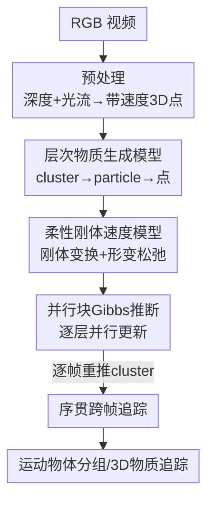

# GenMatter: Perceiving Physical Objects with Generative Matter Models

**会议**: CVPR 2026  
**arXiv**: [2604.22160](https://arxiv.org/abs/2604.22160)  
**代码**: 项目页 esli999.github.io/genmatter（未明确开源仓库）  
**领域**: 3D视觉 / 运动分割 / 生成式感知  
**关键词**: 生成式物质模型, 层次贝叶斯, 块吉布斯采样, Spelke 物体, 运动分组

## 一句话总结
GenMatter 把"从运动中分割可独立移动的物体"重新建模成一个两级层次生成模型（cluster→particle→3D 点）下的在线概率推断，用并行块 Gibbs 采样反演该模型，从而在随机点动图、伪装旋转物体、自然 RGB 视频三类生物视觉能搞定但现有 CV 系统各自失灵的设定上，用同一套不需任务特定训练的引擎复现人类感知并匹配监督式追踪器。

## 研究背景与动机
**领域现状**：从运动中发现物体结构，当下主流靠学习——光流分割（FlowSAM）、点追踪 + SAM2 分组（SegAnyMo）、大规模监督的可提示分割（SAM2）等前馈网络。每种方法在自己擅长的域里表现不错。

**现有痛点**：没有任何一个 CV 系统具备人类视觉的"通用性"。人能在三种截然不同的刺激下都稳健分割运动物体：① 几乎没有形状线索、只有稀疏运动的随机点动图（RDK）；② 纹理与背景匹配、只有靠运动才能看出来的伪装旋转物体；③ 自然场景。学习式方法换一个域就崩——FlowSAM 在 RDK 上几乎零相关，SegAnyMo 在伪装刺激上检测不到物体。

**核心矛盾**：现有方法要么手工塞死板的正则约束（如固定半径的 as-rigid-as-possible），要么干脆回避显式的"物体级分组"，于是无法处理发生显著形变的实体；而把运动分组当成纯前馈回归又丢掉了人类感知里那种"模糊时给出渐变不确定性"的特性。

**本文目标**：建一个统一框架，既能跨三类输入工作，又能复现人类感知（含渐变不确定性），还能在自然视频上匹配监督式追踪器。

**切入角度**：借鉴人类视觉的"分析-合成"（analysis-by-synthesis）原则——感知 = 在结构化生成模型里做贝叶斯推断。作者假设：可独立移动的"物质块"应该被显式地建模成一个层次先验，而不是用手工正则去近似。

**核心 idea**：用层次生成模型把低层运动线索 + 高层外观特征先聚成 particle（表示局部物质的小高斯），再把 particle 聚成 cluster（连贯且可独立移动的物理实体），把"感知分组"转化为对这个生成模型的在线概率推断。

## 方法详解

### 整体框架
GenMatter 的输入是 RGB 视频，预处理成"带速度标签的 3D 点云"（每个像素经单目深度 + 光流抬升成 3D 点，并附上速度）。模型把场景表示成两级层次：**cluster（连贯刚体群）→ particle（局部物质的小高斯）→ data point（位置-速度观测）**。生成方向是 cluster 生成 particle、particle 生成 3D 点；推断方向则反过来，条件于观测 3D 点去反推 particle 和 cluster 的参数。最终每个 particle 被涂上所属 cluster 的颜色，就揭示出哪些物质属于哪个独立运动的实体。整条管线是"预处理特征 → 层次生成模型 → 块 Gibbs 推断 → 跨帧序贯追踪"。

### 关键设计

**1. 两级层次物质生成模型：把"物体"建成 cluster→particle→点的高斯混合**

痛点是现有方法回避显式物体级分组，无法表示发生形变的实体。GenMatter 把场景过程式地定义成两层（Algorithm 1）：每个 cluster $k$ 由一个空间高斯 $(\bm{\mu}_k^{\mathcal{H}},\bm{\Sigma}_k^{\mathcal{H}})$ 加一个刚体变换 $(\mathbf{R}_k,\mathbf{t}_k)$ 描述；每个 particle $\ell$ 先按 $z_\ell^{\mathcal{H}}\sim\text{Cat}(\bm{\pi}^{\mathcal{H}})$ 分到某 cluster，再从该 cluster 的空间高斯里采出自己的均值 $\bm{\mu}_\ell^{\mathcal{B}}\sim\mathcal{N}(\bm{\mu}_k^{\mathcal{H}},\bm{\Sigma}_k^{\mathcal{H}})$，自带协方差 $\bm{\Sigma}_\ell^{\mathcal{B}}$ 表示这一小块物质的范围；观测点 $\mathbf{x}_n$（位置-速度对）再从 particle 的高斯里采出。要融入图像外观时，把数据点扩成 $\tilde{\mathbf{x}}_n=[\mathbf{x}_n;\mathbf{f}_n]$，协方差取块对角（空间和特征维独立）。这套"cluster 管整体刚性、particle 管局部、点管观测"的层次，让物体既能保持整体一致的运动、又能容纳局部形变，这正是手工正则做不到的

**2. 柔性刚体速度模型：用"刚体诱导速度 + 各级噪声松弛"同时容纳刚性与形变**

如果直接把整团物质当刚体，遇到形变就崩；如果完全不约束，又退化成各点乱动。GenMatter 让每个 particle 的期望速度由父 cluster 的刚体变换诱导：$\bar{\mathbf{v}}_\ell=\mathbf{t}_k+(\mathbf{R}_k-\mathbf{I})(\bm{\mu}_\ell^{\mathcal{B}}-\bm{\mu}_k^{\mathcal{H}})$，其中 $(\mathbf{R}_k-\mathbf{I})$ 是绕 cluster 中心旋转的一阶近似。然后逐级加噪松弛：particle 速度 $\mathbf{v}_\ell\sim\mathcal{N}(\bar{\mathbf{v}}_\ell,\sigma_V^2\mathbf{I})$ 允许偏离纯刚性，点速度 $\mathbf{v}_n\sim\mathcal{N}(\mathbf{v}_\ell,\bm{\Sigma}_\ell^{\mathcal{V}})$ 再允许偏离 particle 运动。作者还从小方差渐近（$\epsilon/\eta\to0$）推出它与经典 ARAP 正则的联系：极限下退化成一个类 K-means 目标 $\mathcal{L}=\sum_n\|\mathbf{x}_n+\mathbf{v}_n-\mathbf{x}_n'\|_2^2$（$\mathbf{x}_n'$ 是刚体变换后的预测位置），交替算质心 + Procrustes 求最优刚体变换。关键区别在于：ARAP 靠固定半径 $r$ 的距离惩罚强加局部刚性，而 GenMatter 把刚性耦合进对 cluster 分配的概率推断里，后验自然揭示"哪些 particle 属于哪个独立运动实体"，因此能建模物体间不连续的运动

**3. 并行块 Gibbs 采样推断：利用层次条件独立把逐层变量并行更新**

离散地在所有分配上做优化是不可解的，所以作者用块 Gibbs 采样反演生成模型。核心是层次的条件独立结构：给定其他层，同一层（点 / particle / cluster）的变量可并行更新。分配更新走分类 Gibbs 条件——点按空间 + 速度似然分到 particle：$p(z_n^{\mathcal{B}}=\ell\mid\cdot)\propto\pi_\ell^{\mathcal{B}}\cdot\mathcal{N}(\mathbf{x}_n\mid\bm{\mu}_\ell^{\mathcal{B}},\bm{\Sigma}_\ell^{\mathcal{B}})\cdot\mathcal{N}(\mathbf{v}_n\mid\mathbf{v}_\ell,\bm{\Sigma}_\ell^{\mathcal{V}})$，particle 按刚体运动拟合分到 cluster。参数更新尽量用共轭（Normal-Inverse-Wishart 更新协方差、Normal-Normal 更新均值、Dirichlet-Categorical 更新混合权重）；刚体变换则把 SE(3) 离散化后并行枚举候选、按似然评分。整套在 GenJAX 概率编程框架里向量化实现，单张 NVIDIA L4（24GB）就能跑，且核心推断引擎不需任务/域特定训练，源码只占几 KB。初始化用层次 K-Means（K-Means++ 初始化 particle、第二趟初始化 cluster 中心）近似 burn-in，刚体变换用 Kabsch 对齐初始化

**4. 序贯跨帧追踪：逐帧重推 cluster 分配以避开"刚体跨越铰接部件"**

两帧生成模型要扩到视频，最直接的做法是把 cluster 分配也一路传播下去，但作者发现传播的 cluster 可能错误地跨越铰接（articulated）部件。GenMatter 的做法是：帧 $t$ 先用上一帧速度把 particle 均值前推 $\tilde{\bm{\mu}}_\ell^{\mathcal{B},t}=\bm{\mu}_\ell^{\mathcal{B},t-1}+\mathbf{v}_\ell^{t-1}$；由于只观测到无序点云、没有对应关系，先按空间邻近把点分到 particle，更新 particle 均值后再自底向上（点→particle→cluster）做 Gibbs 扫描；**关键是每帧都重新推断 cluster 分配与变换，而非传播**，这受粒子 MCMC 中滤波思想启发，在保持后验可解的同时实现稳定追踪。这个看似"反直觉"的丢弃-重推策略，正是它能跟踪发生形变 / 铰接物体的原因

## 实验关键数据

在三类设定上评测：2D 随机点动图（RDK）、伪装 3D Gestalt 刺激、自然 RGB 视频；所有置信区间为 95% bootstrap（50,000 次重采样）。

### 主实验

伪装 3D Gestalt 刺激（140 段视频，20 种几何 × 7 种与背景匹配纹理）：

| 方法 | 准确率 Accuracy | Jaccard |
|------|------|---------|
| SegAnyMo | 0.33 [0.28, 0.37] | 0.26 [0.22, 0.31] |
| FlowSAM | 0.87 [0.85, 0.88] | 0.67 [0.63, 0.70] |
| **GenMatter** | **0.94 [0.93, 0.94]** | **0.72 [0.70, 0.74]** |

GenMatter 在 Jaccard 上对 FlowSAM 赢 111/140 段、对 SegAnyMo 赢 133/140 段（$p<1\times10^{-6}$，配对 $t$ 检验），且跨所有纹理一致领先。

自然 RGB 视频（TAP-Vid-DAVIS，与监督式追踪器 CoTracker3 对比，指标为 matter-weighted Jaccard $J_m$）：

| 指标 | CoTracker3 | GenMatter | GenMatter (消融) |
|------|------|------|------|
| $J_m$ (SAM 初始化) | 0.78 [0.69, 0.87] | **0.79 [0.73, 0.84]** | 0.69 [0.61, 0.77] |
| $J_m$ (GT 初始化) | 0.78 [0.69, 0.87] | 0.77 [0.73, 0.84] | 0.68 [0.58, 0.73] |

GenMatter 在**无任务特定预训练**下达到 0.79，匹配监督式 CoTracker3 的 0.78。

RDK 人类判断对齐：GenMatter 与人类二元同物判断相关 $r^2=0.86$（$t(25)=12.4$, $p<0.001$）。

### 消融实验

| 配置 | 关键指标 | 说明 |
|------|---------|------|
| Full（层次模型） | RDK $r^2=0.86$ | 完整 cluster+particle 两级 |
| w/o cluster（fixed particles, K=5） | RDK $r^2=0.35$ | 去掉 cluster 层，仅 particle 推断 |
| w/o cluster（adaptive particles, K=500） | RDK $r^2=0.41$ | 同上，在线更新协方差 |
| FlowSAM（baseline） | RDK $r^2=0.04$ | 学习式运动分割，几乎零相关 |
| w/o cluster（DAVIS） | $J_m$ 0.79→0.69 | 去层次结构在自然视频上也大掉 |
| w/o depth（Gestalt） | Accuracy 0.94→0.89 | 仅光流仍略超 FlowSAM(0.87) |
| w/o depth（DAVIS, SAM 初始化） | $J_m=0.69$ [0.61, 0.77] | 深度确有超出运动之外的贡献 |

### 关键发现
- **cluster 层是性能命脉**：去掉 cluster 层在 RDK 上 $r^2$ 从 0.86 暴跌到 0.35/0.41，在 DAVIS 上 $J_m$ 从 0.79 跌到 0.69——层次结构是复现人类感知与稳健追踪的关键，而非可有可无的装饰。
- **光流是伪装刺激的主驱动**：在 Gestalt 上完全去掉深度仅从 0.94 掉到 0.89，仍略高于 FlowSAM 的 0.87，说明该 benchmark 上单目深度在伪装纹理上常不可靠，光流才是主力。
- **层次结构换来算力可调**：因为数据点在最底层，对点做子采样可直接减少隐变量。从 1/8 到 1/128 子采样无统计显著掉点（$J_m=0.76$–$0.79$），却能快至 12×（1/128 时 9.8 FPS vs 全分辨率 0.80 FPS）；只有到 1/512 极端子采样才崩到 0.56。这种速度-精度连续可调是端到端学习架构给不了的。
- **GT 初始化反而更差**：用真值分割初始化把 DAVIS 的 $J_m$ 从 0.79（SAM 初始化）降到 0.77，因为 GT 在帧 0 强加的硬几何约束不总与含噪光流/深度对齐，且 GT 前景掩码只给单一二值分割、不分解背景；SAM2 的多段分解反而更利于建模物体与非物体区域。

## 亮点与洞察
- **把"感知分组"重写成在线概率推断**：核心推断引擎不需任务/域特定训练、源码仅几 KB，却在抽象点刺激到自然视频上都匹配数据驱动学习——这是对"必须大规模监督才能通用"的一次有力反例。
- **小方差渐近搭桥 ARAP**：通过 $\epsilon/\eta\to0$ 把概率模型退化成类 K-means + Procrustes 目标，既给了优化派一个熟悉的解读入口，又点明 GenMatter 的增益来自"联合推断分组 + 刚体运动"而非固定半径惩罚，这个理论连接很漂亮。
- **复现人类的"渐变不确定性"**：模型不仅在清晰场景高准确，在模糊 RDK（如慢速滑动）上也和人一样犯同样的错（88% vs 人类 84% 误判同物），把它确立为人类感知的计算模型而不只是工程分割器。
- **可迁移思路**："每帧重推而非传播离散结构"这一招，可借鉴到任何会随时间发生铰接/形变的结构化追踪任务，避免历史分组把演化中的部件错误粘连。

## 局限与展望
- **没有显式动力学**：当前只表示物质、不建物理动力学，无法做前向预测，因此在完全遮挡时性能下降（缺乏重初始化/重识别完全隐藏物质的机制）。作者设想加入类游戏引擎的物质 + 动力学联合模型。
- **固定 particle 数 $L$**：限制了对尺度变化、物体进出场景的适应；可用贝叶斯非参的动态 particle 分配缓解。
- **评测仍偏代理**：RDK 与 Gestalt 用二元响应，会把后验坍缩成离散判断；3D 追踪因缺乏形变物体的 3D 真值数据集，只能用 2D 掩码作代理。需要更细的逐被试后验和真正的 3D 标注数据集来做更严格 benchmark。
- **依赖预训练特征抽取器**：虽然推断引擎本身免训练，但 RAFT / VideoDepthAnything / DINO / SAM2 等前端仍是预训练的，整体并非完全 from scratch。

## 相关工作与启发
- **vs ARAP 正则追踪（如 [62]）**：ARAP 用固定半径 $r$ 内的成对距离变化惩罚强加局部刚性，回避显式物体分组；GenMatter 把刚性耦合进对 cluster 分配的层次贝叶斯推断，后验直接给出物体级分组并能建模不连续运动，理论上还能小方差渐近退化到类 ARAP 目标。
- **vs FlowSAM / SegAnyMo（学习式运动分割）**：它们是前馈学习、各自只在擅长域工作（FlowSAM 在 RDK 近零相关、SegAnyMo 在伪装刺激上检测失败）；GenMatter 用同一套结构化先验跨三域通用，且在伪装 Gestalt 上以 0.94 准确率 / 0.72 Jaccard 超过两者。
- **vs CoTracker3（监督点追踪）**：CoTracker3 追踪单像素、需仿真监督；GenMatter 的 particle 表示带空间范围的高斯物质区域、免任务训练即匹配（$J_m$ 0.79 vs 0.78），还能显式吸收 SAM2 分割提案、并支持算力可调。
- **vs 经典分析-合成 / 人类感知生成模型**：前者受计算复杂度所迫常对纹理几何强加限制假设；GenMatter 提供一个可解的概率模型，在自然视觉输入上达到类人的抗噪与抗歧义鲁棒性。

## 评分
- 新颖性: ⭐⭐⭐⭐⭐ 把跨域运动感知统一成层次生成模型 + 在线概率推断，并用小方差渐近搭桥 ARAP，视角新且自洽
- 实验充分度: ⭐⭐⭐⭐⭐ 三类设定、人类对照、监督 baseline、层次/深度消融、算力-精度权衡都覆盖到，统计检验扎实
- 写作质量: ⭐⭐⭐⭐ 生成模型与推断推导清晰、图示到位，但概率符号密集、对非贝叶斯读者门槛偏高
- 价值: ⭐⭐⭐⭐⭐ 用免训练、几 KB 的引擎匹配监督式方法并复现人类感知，对"结构化先验 vs 大规模学习"之争有标杆意义

<!-- RELATED:START -->

## 相关论文

- [\[CVPR 2026\] Circular-DPO: Aligning Multi-Stage 3D Generative Models via Preference Feedback Loop](circular-dpo_aligning_multi-stage_3d_generative_models_via_preference_feedback_l.md)
- [\[NeurIPS 2025\] ROGR: Relightable 3D Objects using Generative Relighting](../../NeurIPS2025/3d_vision/rogr_relightable_3d_objects_using_generative_relighting.md)
- [\[CVPR 2026\] Choreographing a World of Dynamic Objects](choreographing_a_world_of_dynamic_objects.md)
- [\[CVPR 2026\] PhysGS: Bayesian-Inferred Gaussian Splatting for Physical Property Estimation](physgs_bayesian-inferred_gaussian_splatting_for_physical_property_estimation.md)
- [\[CVPR 2026\] BrickNet: Graph-Backed Generative Brick Assembly](bricknet_graph-backed_generative_brick_assembly.md)

<!-- RELATED:END -->
