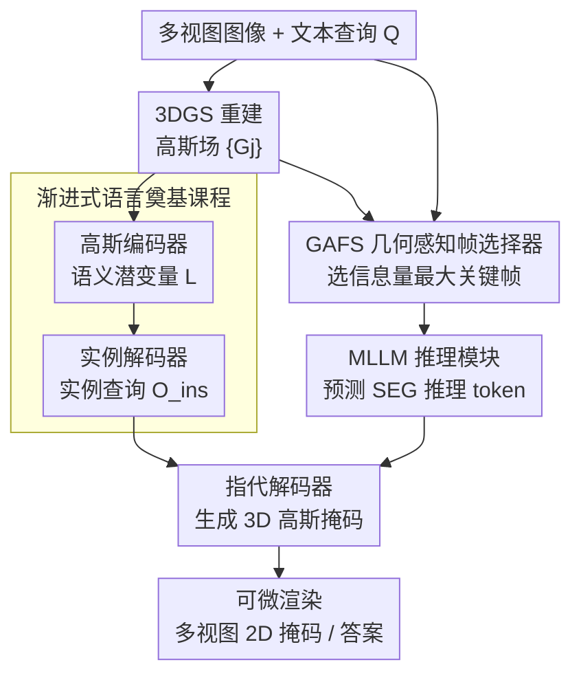

# GenSplat: Bridging the Generalization Gap in 3DGS Language Comprehension

**会议**: CVPR 2026  
**论文**: [CVF Open Access](https://openaccess.thecvf.com/content/CVPR2026/html/Liu_GenSplat_Bridging_the_Generalization_Gap_in_3DGS_Language_Comprehension_CVPR_2026_paper.html)  
**代码**: https://github.com/fawnliu/GenSplat （作者承诺开源，截稿时尚未放出）  
**领域**: 3D视觉  
**关键词**: 3D高斯泼溅, 语言理解, 指代分割, MLLM推理, 跨场景泛化  

## 一句话总结
GenSplat 把 3DGS 场景的语言理解拆成「语义→实例→自由文本」的渐进式课程，再用 MLLM 推理出的 `<SEG>` token 去查询 3D 高斯特征，配合几何感知的关键帧选择器，做到了**一个模型跨场景、跨任务**（指代分割 / VQA / 开放词表）都 SOTA，且推理时不再需要逐场景优化。

## 研究背景与动机
**领域现状**：3DGS（3D Gaussian Splatting）能高质量重建几何与渲染，但在它之上做「语言驱动的高层语义理解」还很弱。主流路线是把 CLIP 的语义特征嵌进每个高斯基元（LangSplat 一系），用文本 embedding 去查询高斯做开放词表分割。

**现有痛点**：这条路线有两个互斥的失败模式。一类（CLIP 嵌入式、SceneSplat）要么**逐场景优化**、要么**绑死预定义词表**——能跨场景泛化的代价是只认固定类别，处理不了自由文本查询，也做不了 VQA、captioning 这类超出分割的空间推理；另一类（ReferSplat、ReasonGrounder）能吃自由文本，但靠**逐场景过拟合**换来的弱视觉-语言对齐，换个没见过的场景就崩。

**核心矛盾**：作者诊断这种「要么过拟合词表、要么过拟合场景」的根因，是模型缺乏**底层几何与多层级语言之间的层次化学习**——它被要求一步到位地把复杂自由文本直接映射到高斯基元，却从没先学会「整场景描述→类别→实例」这种逐级的基础概念接地。没有地基，自然只能死记硬背。

**本文目标**：在 3DGS 里实现既鲁棒于自由文本、又能跨场景泛化的语言理解 + 空间推理，且推理时不做逐场景优化。

**切入角度 / 核心 idea**：把 3D 语言理解**显式建模成一个渐进的「基元→概念」对齐过程**——先把高斯基元对齐到语义级表示，再聚合成实例级概念，最后才对齐自由文本；而自由文本这一步交给 MLLM，用它的语义/空间先验生成一个推理 token 来条件化 3D 定位。

## 方法详解

### 整体框架
GenSplat 的输入是一组多视图 RGB 图像 $I=\{I_i\}_{i=1}^N$ 和一句文本查询 $Q$（指代分割或 VQA），输出是标示目标物体的 3D 高斯掩码（可微渲染成多视图一致的 2D 掩码）或文本答案。整条管线由三个核心组件串起来：**高斯编码器（Gaussian Encoder）**、**实例解码器（Instance Decoder）**、**MLLM 引导的指代解码器（Referring Decoder）**。

流程是：先把多视图重建成高斯场 $G=\{G_j\}_{j=1}^M$；高斯编码器把每个高斯基元编成语义潜变量 $L=\{l_j\}$；实例解码器进一步把语义特征聚合成实例级查询 $O_{ins}\in\mathbb{R}^{N_q\times C}$。与此同时，**GAFS（几何感知帧选择器）**根据文本 $Q$ 自适应挑出信息量最大的几张关键帧，连同 $Q$ 一起喂给 MLLM，让它推理并把语义+空间线索编码进一个 `<SEG>` 推理 token $t_{seg}$（VQA 任务则直接生成答案 token）。最后，指代解码器吃下实例查询 $O_{ins}$、投影后的 $\hat t_{seg}$ 和语义特征，预测出指代目标的高斯掩码。上面这三大组件的训练，统一被「渐进式语言奠基课程」按语义→实例→自由文本三阶段组织起来。

### 关键设计

**1. 渐进式语言奠基课程：先学会基础概念，再去拼复杂句子**

针对「直接把自由文本硬映射到高斯、导致过拟合词表或场景」这个根因，GenSplat 把训练拆成三个由浅入深、互为地基的阶段。**(I) 语义级对齐**：用一个标准 SparseConvUNet 当高斯编码器 $E_g$，把每个高斯 $G_j$ 编成语义特征 $l_j=E_g(G_j)$，再可微渲染成 2D 特征图 $F_i$，用 LangSplat 式的 2D 语言特征（SAM+CLIP 抽的 $\hat F_i$）做监督，损失为 $L_1=\frac1N\sum_i\lVert F_i-\hat F_i\rVert_1$；同时按几何位置+语义做聚类平均池化，把海量高斯压成 $\hat L=\{\hat l_k\}_{k=1}^m$ 来稳住学习。**(II) 实例级对齐**：实例解码器拿一组可学习的物体查询 $O_q$（用池化语义 $\hat L$ 初始化以注入语义先验）和 $\hat L$ 做交叉/自注意力，迭代 $n$ 层后得到实例级嵌入 $O_{ins}$，并接 mask head + 分类 head，用 2D GT 掩码以 $L_{ins}=L_{ce}+L_{mask}$（BCE+dice+分类）监督。**(III) 自由文本对齐**：到这里才引入 MLLM，让它产出 `<SEG>` token 去和实例特征对齐，在指代解码器里完成复杂语言→实例的匹配。这种「语义→实例→自由文本」的逐级接地，构建出一个泛化的语言特征空间，正是不再过拟合固定词表/单场景的关键——消融里 (I)→(II)→(III) 在所有任务上单调上涨印证了这点。

**2. MLLM 引导的推理模块：用一个 `<SEG>` token 把 2D 语义先验注入 3D 定位**

针对「直接拿 MLLM 处理 3D 高斯特征会因 3D 表示与 MLLM 原生 2D 视觉空间的域差而失效」这个问题，作者不把 3D 特征塞给 MLLM，而是**用 2D 视图当 MLLM 的视觉接口**。给定查询，MLLM 输出一个专用分割 token `<SEG>`，其末层隐状态 $t_{seg}$ 线性投影成 $\hat t_{seg}\in\mathbb{R}^{1\times C}$——这个 token 编码了目标物体的语义身份与空间先验。指代解码器复用实例解码器的架构，但同时处理三路输入：实例查询 $O_{ins}$、投影后的 $\hat t_{seg}$、语义特征 $\hat L$；把 $O_{ins}$ 和 $\hat t_{seg}$ 拼接成查询，与 $\hat L$ 交叉注意力后用更新的 $\hat t_{seg}$ 去预测被指代实例，生成可渲染成 2D 的 3D 指代掩码。MLLM 用 LoRA 与指代解码器联合训练，目标是 $L_{align}=L_{text}+\lambda_m L_{mask}$（$\lambda_m=0.1$），其中 $L_{text}$ 是 next-token 生成损失，$L_{mask}$ 含 BCE+dice。这样 MLLM 的强语义/空间先验通过一个轻量 token 注入到 3D 高斯定位中，比直接喂 3D 特征干净得多——消融 (III)→(IV)/(VIII) 的大幅跳升说明这一步是「transformative」。

**3. GAFS 几何感知帧选择器：给 MLLM 喂「最值钱」且不冗余的几帧**

如果把整个场景所有视图都丢给 MLLM，算力不可承受；纯 2D 视图又缺乏几何结构、难以推理相邻/朝向这类空间关系。GAFS 解决「喂哪几帧」。它把文本 $Q$、多视图 $\{I_i\}$、3D 高斯语义特征 $L$ 一起处理：每张图经 VLM 视觉编码器抽特征 $V_i$，再经线性投影+Transformer 得视觉嵌入 $v_i$；文本同样路径得查询向量 $\hat q$；接着对每个视图取其**可见的 3D 高斯语义特征 $L_i$**（CLIP 对齐 embedding + 精确 3D 位置）当几何上下文，用交叉注意力融进视觉嵌入得 $\hat v_i$；相关性分数 $s_i$ 是 $\hat v_i$ 与 $\hat q$ 的余弦相似度，用 BCE 监督（$\hat s_i=1$ 表示该视图含目标物体）：
$$L_{bce}=-\frac1N\sum_{i=1}^N\big[\hat s_i\log s_i+(1-\hat s_i)\log(1-s_i)\big].$$
推理时按分数排名后，作者发现 top 帧常因空间邻近而严重视觉重叠，于是加一步**冗余抑制**：从最高分视图起迭代，用平移+朝向的加权差衡量视图间距离 $D_{ij}=\lambda_t\lVert t_i-t_j\rVert_2+\lambda_r\cdot\mathrm{ang}(R_i,R_j)$，只保留与所有已选视图距离都超过阈值 $\tau_d$ 的视图（$\lambda_t=\lambda_r=1.0$，$\tau_d=0.5$），最终选 $N^*=32$ 帧匹配 MLLM 上下文窗口。把几何特征注入选帧，正是 GAFS 比 uniform/BLIP 检索强的根源——它选出的帧既相关、又覆盖多样的几何视角。

### 损失函数 / 训练策略
三阶段分别用 $L_1$（语义级渲染对齐）、$L_{ins}=L_{ce}+L_{mask}$（实例级）、$L_{align}=L_{text}+\lambda_m L_{mask}$（自由文本级，$\lambda_m=0.1$）；GAFS 单独用 $L_{bce}$ 训练。高斯编码器先在 ScanNet 训 100 epoch，再与实例解码器在 ScanNet200 训 512 epoch；MLLM 基座为 LLaVA-Video，用 LoRA 在 ScanRefer/Nr3D/Sr3D/Multi3DRefer/ScanQA/SQA3D/Scan2Cap 等多数据集上联合指令微调。SQA3D 缺帧级标注，作者用 GPT-5 自动标注 ⚠️ 以原文为准。全程 8×H100。

## 实验关键数据

### 主实验

3D 指代分割（ScanRefer / Multi3DRefer 验证集），GenSplat 用 GS+I 模态，对比 2D MLLM、专家模型、3D MLLM：

| 方法 | 模态 | ScanRefer mIoU↑ | ScanRefer A@0.25↑ | ScanRefer A@0.5↑ | Multi3DRefer mIoU↑ |
|------|------|------|------|------|------|
| LISA-7B（2D MLLM） | I | 21.2 | 35.8 | 8.0 | - |
| LiftGS（专家·GS） | GS | - | 49.7 | 36.4 | - |
| 3D-LLaVA（3D MLLM） | PC | 43.3 | - | - | 42.7 |
| 3D-LLaVA*（适配为GS） | GS | 29.8 | 44.2 | 22.7 | - |
| **GenSplat** | GS+I | **43.6** | **61.3** | **42.4** | **46.2** |

在 ReferSplat 选的 5 个场景上，对比逐场景优化方法（mIoU）：Grounded-SAM 12.4 / LangSplat 11.2 / ReferSplat 16.5 / **GenSplat 28.2**——不做逐场景优化反而几乎翻倍。

3D 问答（ScanQA 验证 / SQA3D 测试）：

| 方法 | ScanQA C↑ | ScanQA M↑ | ScanQA R↑ | SQA3D EM↑ | SQA3D EM-R↑ |
|------|------|------|------|------|------|
| SplatTalk（I） | 77.5 | 15.6 | 38.5 | 47.6 | 49.4 |
| 3D-LLaVA（PC） | 92.6 | 18.4 | 43.1 | 54.5 | 56.6 |
| **GenSplat（GS+I）** | **95.1** | **18.9** | **44.9** | **56.0** | **58.9** |

### 消融实验
逐组件累加（mIoU / C / EM-R 等，节选 Table 4）：

| 配置 | ScanRefer mIoU↑ | Multi3DRefer mIoU↑ | ScanQA C↑ | SQA3D EM-R↑ | 说明 |
|------|------|------|------|------|------|
| (I) Baseline | 26.6 | 33.8 | 71.7 | 48.6 | 无 MLLM 推理与指代解码器 |
| (II) +语义级预训练 | 29.4 | 35.6 | 73.9 | 48.9 | 课程第一级 |
| (III) +实例级预训练 | 33.1 | 38.2 | 75.6 | 49.6 | 课程第二级 |
| (IV) MLLM 直接吃 3D 特征 | 33.9 | 40.3 | 93.2 | 53.9 | 验证 3D↔2D 域差 |
| (V) 均匀采样选帧 | 32.3 | 27.3 | 94.9 | 55.2 | 替换 GAFS |
| (VI) BLIP 检索选帧 | 36.7 | 36.1 | 96.7 | 56.4 | 替换 GAFS |
| (VII) GAFS 仅用 2D 视图 | 41.4 | 42.9 | 96.9 | 57.2 | 去掉几何特征注入 |
| (VIII) GenSplat | **43.6** | **46.2** | **98.3** | **58.9** | 完整模型 |

### 关键发现
- **渐进课程是地基**：(I)→(II)→(III) 在所有任务上单调上涨（ScanRefer mIoU 26.6→29.4→33.1），说明语义→实例的逐级接地不可跳过。
- **MLLM 推理是质变点**：(III)→(VIII) ScanQA CIDEr 从 75.6 飙到 98.3，验证 MLLM 引导推理对场景理解是「transformative」。
- **2D 视图是跨域桥**：(IV) 直接喂 3D 特征明显逊于 (VII) 用 2D 视图，证实 3D 表示与 MLLM 原生 2D 空间存在域差，得靠信息量大的 2D 视图来弥合。
- **选帧策略很关键，且几何融合协同增益**：(VII) 明显优于 (V)/(VI)，说明 GAFS 选的帧更相关更多样；(VIII) 再优于 (VII)，说明把 2D 外观与 3D 结构融合选帧能进一步抬高 MLLM 的空间推理。Multi3DRefer 上 (V) 均匀采样仅 27.3、远低于 GAFS 的 46.2，反差最刺眼。

## 亮点与洞察
- **「过拟合」的统一诊断很漂亮**：把「绑死词表」和「绑死场景」两种看似不同的失败，归因于同一件事——缺少几何到多层级语言的层次化学习，再用一个课程一并解决，立意干净。
- **`<SEG>` token 当「胶水」**：不让 MLLM 直接碰 3D 特征，而是让它吐一个 token 去条件化 3D 解码器，巧妙绕过 3D↔2D 域差，这套「token 桥接」思路可迁移到任何「强 2D 基座 + 弱 3D 表示」的对齐场景。
- **GAFS 把几何塞进选帧**：选帧时不只看 2D 相似度，还注入可见高斯的 3D 位置/语义，再加基于相机位姿的冗余抑制——这是「选对输入比堆模型更省」的典型，对长上下文/算力受限的 3D-LLM 很实用。
- **推理零逐场景优化**：除了 3DGS 重建本身，测试时不再 per-scene 训练，这是它能称「generalizable」的硬指标。

## 局限与展望
- **作者承认**：场景里语义相似物体很多时（如成排同款椅子）会产生模糊定位（Fig. 5 失败案例），作者建议训练时引入更细粒度几何先验缓解。
- **依赖重资源**：8×H100、512 epoch、多数据集联合微调，复现门槛高；且仍需先做 3DGS 重建，重建质量会传导到下游 ⚠️。
- **GAFS 的 GT 选帧依赖标注**：训练用 GT 选中视图，SQA3D 缺帧级标注还得靠 GPT-5 补标，标注噪声对选帧器的影响未单独评估 ⚠️。
- **可改进**：把冗余抑制的硬阈值 $\tau_d$ 换成可学习/查询自适应的多样性约束，或在 `<SEG>` token 之外引入多 token 表达多目标（Multi3DRefer 这种变数量指代场景）可能更稳。

## 相关工作与启发
- **vs LangSplat / SceneSplat**：它们给高斯学语义属性、靠 CLIP 文本查询，要么逐场景优化要么绑定词表；GenSplat 用渐进课程 + MLLM 推理打开自由文本与跨场景泛化，且支持分割之外的 VQA。
- **vs ReferSplat / ReasonGrounder**：同样吃自由文本，但它们逐场景优化、视觉-语言对齐弱、换场景就掉；GenSplat 单模型在 ReferSplat 选的 5 场景上把 mIoU 从 16.5 提到 28.2，且无需 per-scene 优化。
- **vs 3D-LLaVA / Reason3D 等点云 3D-MLLM**：它们直接拿 MLLM 处理 3D/点云特征，受 3D↔2D 域差之苦；GenSplat 改用「信息量大的 2D 视图 + 几何感知选帧 + token 条件化」搭起 2D 感知与 3D 几何推理的连贯管线，在 Multi3DRefer 上比 3D-LLaVA 高 +8.2 mIoU。

## 评分
- 新颖性: ⭐⭐⭐⭐⭐ 首个可泛化的 3DGS 语言理解框架，渐进课程 + `<SEG>` token + 几何感知选帧三件套自洽且各有针对性。
- 实验充分度: ⭐⭐⭐⭐⭐ 跨三类任务、多基准、8 组消融，对域差/选帧策略逐一拆解，结论扎实。
- 写作质量: ⭐⭐⭐⭐ 动机诊断清晰、图文对应好；个别符号（$N^*$、GT 选帧细节）需翻补充材料。
- 价值: ⭐⭐⭐⭐⭐ 推理免逐场景优化 + 一模型多任务 SOTA，对 3DGS 语言交互、具身/AR 落地有直接价值。

<!-- RELATED:START -->

## 相关论文

- [\[CVPR 2026\] GAI-GS：用几何代数注意力把光线-物体交互注入 3DGS 的无线信道预测框架](a_geometric_algebra-informed_3dgs_framework_for_wireless_channel_prediction.md)
- [\[CVPR 2026\] GAP: Action-Geometry Prediction with 3D Geometric Prior for Bimanual Manipulation](action-geometry_prediction_with_3d_geometric_prior_for_bimanual_manipulation.md)
- [\[CVPR 2026\] EmbodiedSplat: Online Feed-Forward Semantic 3DGS for Open-Vocabulary 3D Scene Understanding](embodiedsplat_online_feed-forward_semantic_3dgs_for_open-vocabulary_3d_scene_und.md)
- [\[CVPR 2026\] DiffusionHarmonizer: Bridging Neural Reconstruction and Photorealistic Simulation with Online Diffusion Enhancer](diffusionharmonizer_bridging_neural_reconstruction_and_photorealistic_simulation.md)
- [\[CVPR 2026\] Mamba Learns in Context: Structure-Aware Domain Generalization for Multi-Task Point Cloud Understanding](mamba_learns_in_context_structure-aware_domain_generalization_for_multi-task_poi.md)

<!-- RELATED:END -->
