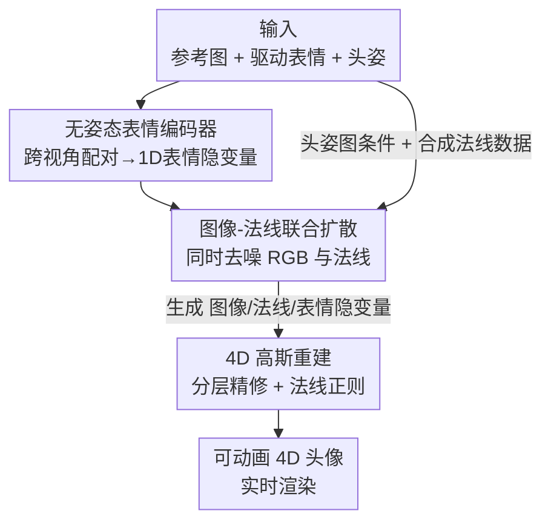

# GeoDiff4D: Geometry-Aware Diffusion for 4D Head Avatar Reconstruction

**会议**: CVPR 2026  
**论文**: [CVF Open Access](https://openaccess.thecvf.com/content/CVPR2026/html/Xu_GeoDiff4D_Geometry-Aware_Diffusion_for_4D_Head_Avatar_Reconstruction_CVPR_2026_paper.html)  
**代码**: 项目页 https://lyxcc127.github.io/geodiff4d/ （未见正式代码仓库）  
**领域**: 3D视觉 / 扩散模型  
**关键词**: 4D头像重建, 几何感知扩散, 表面法线, 3D高斯泼溅, 单图驱动

## 一句话总结
GeoDiff4D 从单张人像出发，让扩散模型在生成肖像帧的同时联合生成对应的表面法线，再把"图像 + 法线 + 表情隐变量"一起喂给 3D 高斯重建，从而把扩散模型里隐含的 3D 几何先验真正蒸馏进可动画的 4D 头像，在身份保持、表情还原和跨视角一致性上显著超过现有方法。

## 研究背景与动机
**领域现状**：从单张人像重建可动画、表情丰富的 4D 头像是数字人方向的核心问题。近期主流是借助扩散模型：要么直接做 2D 肖像动画（保身份、迁表情都不错），要么把扩散生成的人像送去优化一个 3D 高斯（3DGS）头像。

**现有痛点**：纯 2D 方法缺乏 3D 一致性，换个视角质量就崩；引入显式 3D 表示的方法又牺牲了身份保持和细微表情。把扩散 + 3DGS 组合起来的两阶段方法也有三个老毛病：(1) 表情控制依赖 landmark / 隐式 motion / 3DMM 参数，3D 一致性与表现力难以兼得；(2) 扩散模型只学到了像素级对应这类 2D 先验，没真正抓住底层 3D 几何；(3) 重建阶段只用扩散生成的 RGB 肖像做监督，扩散与重建两个阶段的连接很弱，没把扩散模型的知识充分蒸馏出来。

**核心矛盾**：扩散模型擅长生成逼真外观（2D 先验强），但 RGB 像素里几乎不含可靠的 3D 几何信号；而高质量 4D 重建恰恰最缺这块几何约束。两阶段之间只靠 RGB 传递信息，几何信息在中途丢失了。

**本文目标**：让扩散模型本身就"懂几何"，并把这份几何先验完整地传给下游 3DGS 重建。具体拆为：表情表示要既有表现力又跨视角一致；扩散生成要带上几何线索；重建监督要用上几何信号。

**切入角度**：表面法线天然编码了 RGB 里没有的 3D 几何（皱纹、发丝走向）。如果让扩散模型在生成 RGB 的同时联合生成法线，它就被迫去建模二者的联合分布、变成几何感知的；而生成出来的法线又能反过来当作重建阶段的强监督，一举打通两阶段的几何传递。

**核心 idea**：用"图像-法线联合扩散 + 无姿态表情编码 + 法线监督的 3DGS"把扩散里的几何先验蒸馏进 4D 头像，而不是只传 2D 外观。

## 方法详解

### 整体框架
GeoDiff4D 输入一张参考图、一段驱动表情和目标头姿，输出一个可实时渲染、可自由驱动的 4D 头像。整条管线由三个组件串成：先用**无姿态表情编码器**把驱动帧压成一个 1D、与头姿解耦、跨视角一致的表情隐变量；再用一个**图像-法线联合扩散**模型，以参考图身份特征和表情隐变量为条件，同时去噪生成一序列肖像帧及其对应的表面法线；最后把生成的图像、法线和表情隐变量一起送入**4D 高斯重建**，在 RGB 与法线双重监督下优化绑定在 FLAME 网格上的 3D 高斯，得到最终头像。关键在于：法线既让扩散变得几何感知，又作为额外的几何监督回流到重建，串起整个流程。

### 关键设计

**1. 无姿态表情编码器：把表情与头姿、身份彻底解耦，且跨视角一致**

痛点直接对应"表情控制难兼顾 3D 一致与表现力"。作者沿用 X-NeMo 的隐式表情表示思路，用编码器 $E_{mot}$ 把单帧图像压成低维隐变量 $f_{mot}$，丢掉空间外观信息以鼓励表情与身份解耦。和以往把头姿、表情塞进同一个隐变量不同，这里把头姿单独拎出来用显式头姿图控制（见设计 2），让隐变量只负责表情。

真正让它"跨视角一致"的是**跨视角配对训练**：对同一身份、同一时间戳，从不同视角各采一帧组成配对，配对内表情完全相同、只有视角不同（驱动帧与目标帧表情一致而姿态不同）。这迫使编码器抹掉头姿和身份泄漏、只保留表情特征，从而学到 view-invariant 的表示。编码器不靠任何额外的专门损失，而是直接和扩散模型端到端联合训练、只由扩散去噪损失监督；再配合只对裁剪后人脸驱动图做的像素增强（亮度/对比度/饱和度/噪声/模糊）和空间增强（缩放/旋转/平移），进一步压低对空间布局的敏感度。消融里去掉跨视角配对带来的整体掉点最大，说明它是几何一致性的关键来源。

**2. 几何感知的图像-法线联合扩散：让扩散在生成外观时同时学几何**

这是全文核心，针对"扩散只学 2D 先验、不懂 3D 几何"。作者在 X-NeMo 的 UNet 隐式扩散框架上，把去噪目标从单一 RGB 扩展为 RGB + 表面法线的联合生成，建模联合分布

$$P(I_{rgb}, I_{norm} \mid I_{ref}, M_{ref}, I_{exp}, M_{drv})$$

参考图 $I_{ref}$ 经 VAE 压缩后由 reference network 抽出层级身份特征 $F_{ref}$，驱动帧经表情编码器得到 $F_{exp}$，二者通过 cross-attention 注入；扩散同时对 RGB 与法线的噪声隐变量去噪，得到 $Z_{rgb}$ 与 $Z_{norm}$ 再解码回图像和法线。实现上，目标视频与法线视频各自编码成形如 $[B\times D\times C\times T\times H\times W]$ 的隐变量、沿域维 $D$ 拼接，每个时间步对两域施加**相同噪声**并用 class label 区分域。为让两域真正交互，作者把普通 2D self-attention 换成 **3D Domain-Spatial attention**：卷积时把域维并进 batch 维 $[(B\times D)\,C\times T\times H\times W]$ 保持各域独立，进注意力前把两域沿宽度维拼成 $[B\times C\times T\times H\times (2W)]$ 做注意力，从而在卷积里保域独立、在注意力里做受控的跨域信息交换。法线由现成估计器（含皱纹、发丝等细节）得到。

为支持显式头姿，作者引入**头姿图** $M_{tar}$——本质是只表示头姿的法线图：用 FLAME tracker 估出 3DMM 参数重建网格，把顶点法线按相机内外参光栅化到 2D，并把表情相关参数置零以减少身份泄漏；头姿图插值到隐变量分辨率后与噪声隐变量拼接送入网络。此外针对"真实数据缺高质量法线标注、伪法线受估计器精度限制"的问题，引入带真值法线的合成数据集 SynthHuman，并用加权随机采样让多视角数据被采样的频率约为合成数据的 10×，兼顾多样性与可靠性。消融显示去掉联合表示会明显削弱几何感知、去掉 domain attention 会一致性下降。

**3. 4D 高斯重建：分层精修 + 法线正则把几何先验落到头像上**

针对"重建阶段只用 RGB、几何信息没传过去"。重建基于 GaussianAvatars，把 3D 高斯绑定到 FLAME 网格三角面上；先把扩散生成的多视肖像当作单目输入，用 Pixel3DMM 估初始 FLAME 参数。由于单目 FLAME tracking 本身不准、3DMM 模板与真实脸几何有差，作者用**分层精修**逐级补偿：先给 FLAME 参数加可学习残差修正 tracking 误差；再 remesh 头部、用 U-Net 预测逐顶点形变，并且不是在 UV 图里采相邻像素、而是在 3D 空间构建 face graph、按原始空间关系重排 UV 网格，且形变定义在只由表情参数驱动的 canonical 空间位置图上、再用表情编码器的隐变量经 cross-attention 条件化 U-Net；最后用轻量 MLP 预测逐基元的高斯属性残差，以捕获共享属性表达不了的表情相关动态。

**法线正则**则把生成的法线真正用作几何监督：跟随 GaussianShader，取每个高斯基元最短轴作为其法线 $\hat n$、给 3DGS 加专门的法线通道，对前景区域渲染法线做 L1 监督

$$L_n = \lambda_n L_1(\hat n,\ \alpha n)$$

其中 $\hat n$、$n$ 为预测法线与伪真值法线，$\alpha$ 是前景掩码，$\lambda_n$ 为权重。⚠️ 原文公式写作 $L_1(\hat n, \alpha n)$，掩码应是同时作用于两者，以原文为准。正是这一步让扩散学到的几何先验落地为更平滑准确的法线、减少新视角渲染伪影。

### 损失函数 / 训练策略
扩散模型用多视角数据集 + 合成数据集联合训练，全部处理到 $512\times512$。训练分两阶段：第一阶段不带时序模块、batch size 32；第二阶段引入 16 帧序列做时序学习、batch size 8。两阶段均用 AdamW、学习率 $1\mathrm{e}{-5}$，分别训 80K / 20K 步，4 张 A800 共约 3–4 天。表情编码器只由扩散去噪损失端到端监督，无额外损失。重建阶段沿用 GaussianAvatars 训练，法线正则项 $L_n$ 作为额外几何监督。推理时先用扩散生成约 12 视角、200 帧的肖像视频（25 步 DDIM，单卡 H800 约 1 小时），再跑 100K 步重建（RTX 3090 约 3 小时）。

## 实验关键数据

### 主实验
在 NeRSemblev2 上做自重演（self-reenactment，10 个未见主体、80 段驱动），并在 NeRSemblev2 子集 + in-the-wild 混合数据上做跨身份重演（cross-reenactment）。其中 **VGM** 指仅用视频生成模型直接渲染的结果，**GeoDiff4D** 指完整 4D 重建后的头像。

| 方法 | Self PSNR↑ | Self SSIM↑ | Self LPIPS↓ | Self CSIM↑ | Self JOD↑ | Cross CSIM↑ | Cross JOD↑ |
|------|-----------|-----------|------------|-----------|----------|-------------|-----------|
| GAGAvatar | 17.550 | 0.789 | 0.229 | 0.714 | 6.244 | 0.588 | 5.081 |
| Portrait4D-v2 | 13.689 | 0.701 | 0.310 | 0.702 | 4.933 | 0.608 | 4.656 |
| LAM | 16.354 | 0.759 | 0.251 | 0.608 | 5.772 | 0.516 | 5.079 |
| CAP4D | 19.295 | 0.811 | 0.195 | 0.719 | 6.561 | 0.655 | 5.064 |
| **Our VGM** | **21.586** | **0.831** | **0.174** | **0.754** | **7.127** | **0.671** | 5.066 |
| GeoDiff4D | 19.951 | 0.822 | 0.195 | 0.721 | 6.720 | 0.656 | **5.178** |

VGM 在几乎所有图像质量指标上拿到最优，身份保持（CSIM）和时序一致性（JOD）均领先；GeoDiff4D（重建后头像）多数指标排第二、优于全部 baseline，且在跨重演 JOD 上反而最高。作者强调即便量化没有项项第一，在极端头姿和夸张表情下（图 5）GeoDiff4D 与 VGM 的视觉质量明显更好。

### 消融实验
在 NeRSemblev2 自重演集上拆解各组件（上半为视频生成模型 VGM，下半为重建）：

| 模块 | 配置 | PSNR↑ | CSIM↑ | JOD↑ | AKD↓ | AED↓ |
|------|------|-------|-------|------|------|------|
| VGM | w/o 联合表示 | 20.809 | 0.757 | 6.960 | 4.216 | 2.489 |
| VGM | w/o domain attn. | 20.984 | 0.743 | 7.029 | 4.195 | 2.556 |
| VGM | w/o 跨视角配对 | 19.895 | 0.734 | 6.859 | 5.367 | 3.113 |
| VGM | w/o 合成数据 | 20.892 | 0.743 | 6.978 | 4.339 | 2.527 |
| VGM | **完整** | **21.586** | 0.754 | **7.127** | **4.016** | **2.340** |
| Recon | w/o 分层精修 | 19.816 | 0.736 | 6.758 | 4.227 | 2.603 |
| Recon | w/o 法线正则 | 19.950 | 0.734 | 6.774 | 4.291 | 2.713 |
| Recon | w DAViD 法线 | 19.947 | 0.736 | 6.782 | 4.247 | 2.553 |
| Recon | **完整** | 19.953 | 0.737 | 6.780 | 4.248 | 2.563 |

### 关键发现
- **跨视角配对是 VGM 里最关键的组件**：去掉它整体掉点最大（PSNR 21.586→19.895，AKD 4.016→5.367，AED 2.340→3.113），印证多视角几何约束对身份/表情准确度的决定性作用。
- **联合表示与 domain attention 共同支撑几何感知**：去掉联合表示削弱几何意识、去掉 domain attention 削弱跨域信息交换，都带来一致下降；合成数据主要补身份多样性与泛化。
- **重建侧各 ablation 的量化差异较小**（PSNR 都在 19.8–20.0），但作者指出补充材料的定性结果差异明显：完整模型伪影更少、时序更稳；用扩散生成的法线（vs. 用 DAViD 单目估计法线）能带来更细的面部细节，因其更细粒度、时序更连贯且与 RGB 对齐更好。

## 亮点与洞察
- **"联合生成法线"把几何先验显式塞进扩散**：相比只生成 RGB 再硬塞 3D 表示，让扩散同时建模图像与法线的联合分布，是一种低成本、自监督式地让 2D 扩散变得几何感知的思路，可迁移到其它"生成 + 重建"两阶段任务。
- **生成的法线既是输出又是监督，一鱼两吃**：法线既让扩散懂几何，又作为下游 3DGS 的强监督回流，巧妙地打通了扩散与重建两阶段断裂的几何信息流。
- **Domain-Spatial attention 的"卷积保独立、注意力做交换"很值得借鉴**：沿宽度维拼接两域做注意力、卷积时并回 batch 维保独立，是处理多模态联合扩散时控制信息泄漏的实用技巧。
- **头姿图 = 置零表情的法线图**：用只含头姿的法线图做显式姿态条件，既解耦了姿态又复用了法线这一表示，设计上自洽。

## 局限与展望
- 作者承认：重度依赖单目 3DMM tracking 估头姿，本身是 ill-posed 的难题；虽然 VGM 支持舌头运动，但受 FLAME 结构和缺乏舌头精细参数化所限，最终头像无法准确重建舌头；和所有扩散方法一样采样慢，难以真正实时部署。
- 自己发现：⚠️ 摘要宣称"支持实时渲染"，但这指的是重建后 3DGS 的渲染实时，生成阶段（25 步 DDIM、约 1 小时合成视频）并不实时，二者不应混为一谈。
- 重建侧消融的量化差异极小、主要靠定性图说明优势，说服力略弱；法线监督在 PSNR/CSIM 上的增益不明显，可改进方向是设计更直接反映几何质量的量化指标。
- 整条管线组件较多（表情编码器 + 联合扩散 + 分层精修 + 法线正则），工程复杂度高，端到端简化是潜在方向。

## 相关工作与启发
- **vs Portrait4D-v2 / X-NeMo（2D 肖像动画）**：它们保身份、迁表情强但缺 3D 一致性，换视角易崩；本文用联合法线扩散 + 3DGS 重建补上几何一致，跨视角与极端姿态更稳。
- **vs GAGAvatar / LAM（显式 3D 表示的可泛化框架）**：它们靠 3DMM 参数驱动、几何一致但细微表情和身份保持受限；本文用隐式表情隐变量 + 跨视角配对，兼顾表现力与一致性。
- **vs CAP4D（扩散 + 3DGS 两阶段）**：同属"扩散生成肖像再优化高斯"，但 CAP4D 只用 RGB 监督、两阶段连接弱；本文让扩散联合生成法线并把法线作为重建监督，把几何先验真正蒸馏到头像，量化与极端场景视觉质量均更优。

## 评分
- 新颖性: ⭐⭐⭐⭐⭐ 首个联合生成肖像帧与表面法线的视频扩散，把几何先验自监督地注入扩散并回流到 3DGS 重建。
- 实验充分度: ⭐⭐⭐⭐ 自/跨重演 + 多 baseline + 细致消融，但重建侧消融量化差异小、主要靠定性图支撑。
- 写作质量: ⭐⭐⭐⭐ 三组件结构清晰、动机层层递进；个别公式（法线正则）记号略含糊。
- 价值: ⭐⭐⭐⭐⭐ 单图驱动高保真 4D 头像，身份/表情/跨视角全面领先，对数字人、虚拟会议等落地价值高。

<!-- RELATED:START -->

## 相关论文

- [\[CVPR 2026\] Feed-forward Gaussian Registration for Head Avatar Creation and Editing](feed-forward_gaussian_registration_for_head_avatar_creation_and_editing.md)
- [\[CVPR 2026\] UIKA: Fast Universal Head Avatar from Pose-Free Images](uika_fast_universal_head_avatar_from_pose-free_images.md)
- [\[CVPR 2026\] Fresco: Frequency-Spatial Consistent Optimization for Fine-Grained Head Avatar Modeling](fresco_frequency-spatial_consistent_optimization_for_fine-grained_head_avatar_mo.md)
- [\[CVPR 2026\] HAD: Hallucination-Aware Diffusion Priors for 3D Reconstruction](had_hallucination-aware_diffusion_priors_for_3d_reconstruction.md)
- [\[CVPR 2026\] MoRe: Motion-aware Feed-forward 4D Reconstruction Transformer](more_motion-aware_feed-forward_4d_reconstruction_transformer.md)

<!-- RELATED:END -->
