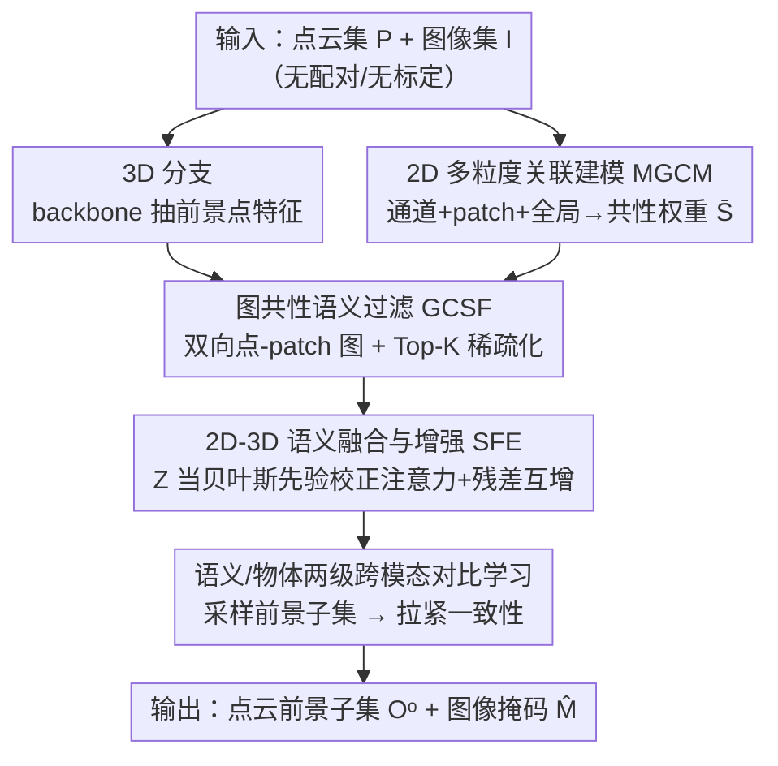

# GeoFree-CoSeg: Unsupervised Point Cloud-Image Cross-Modal Co-Segmentation Without Geometric Alignment

**会议**: CVPR 2026  
**论文**: [CVF Open Access](https://openaccess.thecvf.com/content/CVPR2026/html/Duan_GeoFree-CoSeg_Unsupervised_Point_Cloud-Image_Cross-Modal_Co-Segmentation_Without_Geometric_Alignment_CVPR_2026_paper.html)  
**代码**: 未公开  
**领域**: 3D视觉  
**关键词**: 跨模态协同分割, 点云-图像, 无监督, 语义一致性, 图稀疏化  

## 一句话总结
GeoFree-CoSeg 提出"无监督点云-图像跨模态协同分割"这一新任务，用粗到细的双分支框架——各模态先抽粗粒度共性语义，再用跨模态语义图把它们提纯成 Top-K 点-patch 对应、最后融合互增——在**完全不需要几何对齐和分割标注**的前提下，把两个标准点云基准与两个新建图像数据集上的无监督 SOTA 全面刷高（S3DIS 上 3D 平均 mIoU 比 LogoSP 高 6 个点）。

## 研究背景与动机
**领域现状**：协同分割（co-segmentation）的目标是在一组点云或一组图像里，不知道类别名的情况下，把反复出现的"共性物体"找出来并分割掉（比如一堆场景里反复出现的"椅子"）。这是个 class-agnostic 的设定，对物体检索、新类发现、3D 缺件检测都有用。现有工作几乎都是**单模态**的：要么只在 3D 点云里做（Yang [45]），要么只在 2D 图像里做。

**现有痛点**：单模态语义线索太弱。点云结构不规则、标注极贵，单看点云很难稳定地把共性物体抠出来，往往要靠 ground-truth mask 兜底；单看图像又缺几何信息。另一条路线——无监督 3D 语义分割（GrowSP [51]、LogoSP [52]）虽然会借 2D 图像增强 3D，但它们**依赖几何对齐**：必须有相机参数、把 2D 像素和 3D 点严格标定到一起。这一要求既贵又把可用的 2D 数据集死死限制在"和点云配对、标定过"的那批上。

**核心矛盾**：想用 2D 帮 3D，传统做法绑定在"像素-点几何对应"上；可现实里两个模态往往只共享**语义**（都拍的是椅子），并不共享**几何**（不是同一时刻、同一相机拍的同一把椅子）。把跨模态信息流死锁在几何对齐上，就用不了海量"语义相关但几何无关"的图像。

**本文目标**：定义并解决一个全新任务——给一组点云 $P=\{P_i\}$ 和一组图像 $I=\{I_i\}$（二者含同一未知类别的共性物体，但**没有任何配对/标定关系**），同时为每个点云估计前景子集 $O_i^o \subset P_i$、为每张图估计掩码 $\hat{M}_i$，全程无标注、无几何对齐。

**切入角度**：作者主张跨模态共性应在**语义层面**而非**特征对齐层面**建立——只要两边讲的都是"椅子"，就能互相补充，不必逐点对应。

**核心 idea**：用"语义一致性"取代"几何对齐"，以**粗到细**的方式建立跨模态对应——先各自抽粗语义，再用一张稀疏化的点-patch 关联图把最相关的对应挑出来当先验，最后双向融合互增。

## 方法详解

### 整体框架
GeoFree-CoSeg 是一个 3D 分支 + 2D 分支并行、再跨模态耦合的框架。3D 分支把每个点云送进带 mutual correlation 的 backbone，得到前景/背景点特征 $F^{3D}_f, F^{3D}_b$（把协同分割建模成"前景点采样"问题）；2D 分支用 DINO 预训练的 ViT 抽 patch 特征 $F^{2D}$。两边特征经线性投影进**共享语义空间**后，整条 pipeline 分三步走：

1. **粗语义**：2D 多粒度关联模块（MGCM）在通道/patch/全局三个粒度上提取 2D 共性语义权重 $\bar{S}_i$，顺带产出图像掩码 $\hat{M}_i$；3D 分支给出粗前景特征。
2. **提纯**：基于图的共性语义过滤（GCSF）把两边粗特征构成双向点-patch 关联图，用 KNN 稀疏化只保留 Top-K 最相关的对应，得到细粒度关联矩阵 $Z^{P\to I}, Z^{I\to P}$。
3. **融合互增**：2D-3D 语义融合与增强（SFE）以 $Z$ 当贝叶斯先验校正注意力，双向融合后用残差互相增强；再采样出前景/背景子集，配两条跨模态对比损失把"语义级"和"物体级"一致性拉紧。

整个对应关系由"语义相似度 + 图先验"决定，从头到尾**没有用到相机参数或点-像素几何对应**，这正是 "GeoFree" 的来历。

### 关键设计

**1. 2D 多粒度关联建模 MGCM：单看一张图语义模糊，就在三个粒度上把"哪些 patch 是共性物体"问明白**

针对"单模态图像协同分割语义歧义大"的痛点，MGCM 不只在 patch 层算相关，而是**通道-patch-全局**三粒度递进。先用 FFN 做通道交互，让每个通道汇聚其它通道信息：$F^{2D}_{i,c}=F^{2D}_i+\mathrm{FFN}_1(N(F^{2D}_i))$；再用自注意力算跨图 patch-to-patch 相关 $S=\frac{1}{\sqrt d}\phi_q(F^{2D}_c)\otimes\phi_k(F^{2D}_c)^\top$，这一步把"一组图里反复出现的 patch"挑出来；最后引入 DINO 的 CLS token $Z$ 当**全局语义锚**，按 $\hat{S}=S+\lambda\cdot\frac{1}{\sqrt d}Z\phi_k(F^{2D}_c)^\top$ 注入粗粒度全局相关（$\lambda=0.2$ 控制全局引导强度）。对 $\hat{S}$ 做行均值 + Sigmoid 出掩码 $\hat{M}_i$，再 Softmax 归一化得到共性语义权重 $\bar{S}_i$，作为送给跨模态阶段的 2D 引导。消融显示三粒度齐全比只用 patch 级相关高 5% P / 14% J（表 7）。

**2. 基于图的共性语义过滤 GCSF：粗语义里夹着背景噪声，用 Top-K 稀疏化只留最铁的跨模态对应**

拿到粗 3D 点特征和 2D patch 特征后，先把两者投到共享语义空间得 $\hat{F}^{3D}_{f,i}, \hat{F}^{2D}_i$；patch 嵌入还会拼上自己的语义权重 $\bar{S}_i$ 再过 $1\times1$ 卷积细化：$\tilde{F}^{2D}_i=\mathrm{Conv}(\mathrm{CAT}[\hat{F}^{2D}_i,\bar{S}_i])$。然后算 L2 归一化后的点-patch 相似度 $S^{P\to I}=\|\hat{F}^{3D}_{f,i}\|\otimes\|\tilde{F}^{2D}_i\|^\top$ 和反向的 $S^{I\to P}$，构成双向图 $G^{P\to I}, G^{I\to P}$。关键一招是**KNN 稀疏化**：对每个点只保留它 Top-K 最相关的 patch，$c^{P\to I}_m=\arg\mathrm{topk}(S^{P\to I}_m)$，反向同理。但为了不把弱却有用的语义彻底丢掉，作者把被剪掉的零边换成小常数形成"软掩码"，再 Softmax 归一化：$Z^{P\to I}=\mathrm{Softmax}(M^{P\to I}\odot S^{P\to I})$。$K$ 的取值有讲究——太小限制跨模态交互、太大引入背景噪声，实验里 $K\in[20,35]$ 平衡最好、$K=20$ 最优，且复杂场景（S3DIS）比物体中心数据（ScanObjectNN）对 $K$ 更敏感。这套稀疏化正是"不靠几何、只靠语义相关"能站住脚的关键：对应是从相似度里挑出来的，不是标定出来的。

**3. 2D-3D 语义融合与增强 SFE：把上一步的细粒度对应当贝叶斯先验，让两个模态互相"借语义"**

SFE 先融合再增强。融合时以点嵌入 $\hat{F}^{3D}_{f,i}$ 当 query、patch 嵌入当 key/value 算多头相似度 $A^{P\to I}=\frac{1}{\sqrt d}\hat{F}^{3D}_{f,i}\otimes(\hat{F}^{2D}_i)^\top$，它衡量每个点对应每个 patch 的似然。作者套用**贝叶斯原则**（后验 ∝ 似然 × 先验），把 GCSF 给的 $Z^{P\to I}$ 当先验去校正这个似然：

$$\tilde{A}^{P\to I}_{i,j}=\mathrm{Softmax}\big(A^{P\to I}_{i,j}+\alpha Z^{P\to I}_{i,j}\big)=\frac{\exp(A^{P\to I}_{i,j})\exp(\alpha Z^{P\to I}_{i,j})}{\sum_k \exp(A^{P\to I}_{i,k})\exp(\alpha Z^{P\to I}_{i,k})}$$

于是 $\tilde{A}^{P\to I}_{i,j}$ 就是一个后验：语义相似似然被共性语义先验加权。加权聚合 patch 嵌入得融合特征，再经残差 $F^{P\to I}=\mathrm{FFN}_2(\phi_p(\hat{A}^{P\to I})+\hat{F}^{3D}_{f,i})$，反向 $F^{I\to P}$ 同理。增强阶段为保住各模态自身特性，用残差把融合特征加回原特征：$\tilde{F}^{3D}_{f,i}=\mathrm{MLP}_1(F^{3D}_{f,i}+\lambda_P F^{P\to I})$、$\tilde{F}^{2D}_{c,i}=\mathrm{MLP}_2(F^{2D}_i+\lambda_I F^{I\to P})$（$\lambda_P=\lambda_I=0.5$）。这一步让 3D 借到 2D 的强语义、2D 借到 3D 的结构线索，且因为先验来自语义图而非几何对齐，整条增强链路天然 geometry-free。

**4. 语义级 + 物体级双对比学习：用两条 NT-Xent 把"两模态讲的是同一个东西"硬性拉齐**

融合后的点特征 $\tilde{F}^{3D}_{f,i}$ 会采样出一个不被原点云限制的简化前景子集 $\hat{O}^o_i$，经特征提取器编码成 $\hat{X}^o_i$；同理得背景 $\hat{X}^b_i$，以及经 soft projection 严格落回原点云的前景/背景特征 $X^o_i, X^b_i$。**语义级一致性**用 NT-Xent 把 $\hat{X}^o_i$ 拉近 2D 全局语义原型 $\bar{F}^{2D}_{i,s}$（对 $\tilde{F}^{2D}_{c,i}$ 做 GAP 得到）、推远背景 $\hat{X}^b_i$；**物体级一致性**则把 $X^o_i$ 拉近 2D 物体原型 $\bar{F}^{2D}_{i,o}$（对 $\hat{F}^{2D}_i$ 做 GAP）、推远 $X^b_i$。两条损失形如 $L_{sem}=\frac{1}{N}\sum_i -\log\frac{\exp(\hat{s}^+_i/\tau)}{\exp(\hat{s}^+_i/\tau)+\sum_k\exp(\hat{s}^-_i/\tau)}$，正负相似度由 L2 归一化内积给出。两级互补：语义级管"是不是同一概念"、物体级管"具体物体对不对"，消融里两者都用比只用其一在 mIoU 上各高 3~5 个点（表 3）。

### 损失函数 / 训练策略
总损失 $L=L_{sem}+L_{obj}+L_p+L_s$，其中 $L_p$ 是沿用 Yang [45] 的无监督点云协同分割损失、$L_s$ 是沿用 SCoSPARC [4] 的无监督图像协同分割损失。训练采用三阶段学习率：先用 Adam（lr $=10^{-4}$）预训练 2D 分支拿到稳定图像语义，再训 3D 分支（lr $=10^{-3}$）并以极小 lr $=10^{-6}$ 微调 2D 分支。backbone 用 PointNet（SampleNet 的骨干）+ 冻结的预训练 DGCNN 当特征提取器，2D 用 patch size 8 的 ViT-B/DINO；$M_o=512$、$M_P=2048$、组大小 $N=24$，单卡 RTX 4090。

## 实验关键数据

### 主实验
两个标准点云基准（S3DIS、ScanObjectNN，仅用 XYZ 坐标）评 3D 分支 mIoU；两个新建图像数据集（S3DIS-Coseg、ScanObjectNN-Coseg）评 2D 分支 Precision (P) 与 Jaccard (J)。由于是首个跨模态协同分割工作、无直接可比 baseline，作者对比点云协同分割 / 点云语义分割 / 图像协同分割三类 SOTA。

| 数据集（分支） | 指标 | 本文 | 之前SOTA | 提升 |
|--------|------|------|----------|------|
| S3DIS（3D, 5类均值） | mIoU | 0.54 | 0.48 (LogoSP) | +6 点 |
| S3DIS（3D） | mIoU | 0.54 | 0.46 (Yang) | +8 点（bookcase +15、door +12） |
| ScanObjectNN（3D, 15类均值） | mIoU | 0.63 | 0.60 (LogoSP) | +3 点 |
| S3DIS-Coseg（2D） | P / J | 0.83 / 0.59 | 0.74 / 0.38 (SCoSPARC) | +9 P / +21 J |
| ScanObjectNN-Coseg（2D） | P / J | 0.78 / 0.53 | 0.75 / 0.48 (SCoSPARC) | +3 P / +5 J |

值得注意的是，被超过的 LogoSP 本身也借了 DINOv2 的 2D 特征做点云分割，但它需要几何对齐；GeoFree-CoSeg 不要对齐还更高，说明"语义一致性"路线确实更通用。

### 消融实验

**模块消融（S3DIS / S3DIS-Coseg，表 6）**

| 配置 | mIoU | P | J | 说明 |
|------|------|---|---|------|
| Baseline（仅 2D+3D 基础分支） | 0.46 | 0.76 | 0.39 | 下界 |
| + MGCM | 0.48 | 0.80 | 0.53 | 多粒度 2D 关联 |
| + MGCM + GCSF | 0.51 | 0.82 | 0.57 | 加图稀疏化提纯 |
| Full（+ SFE） | 0.54 | 0.83 | 0.59 | 比 Baseline 3D +8 mIoU、2D +7 P / +20 J |

**损失消融（表 3）**

| 配置 | mIoU | P | J |
|------|------|---|---|
| 仅 $L_{sem}$ | 0.49 | 0.80 | 0.54 |
| 仅 $L_{obj}$ | 0.51 | 0.81 | 0.57 |
| $L_{sem}+L_{obj}$ | 0.54 | 0.83 | 0.59 |

**MGCM 内部粒度消融（表 7，单 2D 分支）**：仅 patch 级 P/J = 0.74/0.38；+channel = 0.76/0.42；+global = 0.77/0.46；三粒度全开 = 0.79/0.52。

### 关键发现
- **三个模块逐级增益、coarse-to-fine 成立**：MGCM→GCSF→SFE 每加一个 mIoU 都涨，定性图（图 5）也显示分割从粗到细被逐步修干净，验证了粗到细设计而非堆模块。
- **图稀疏化的 K 是双刃剑**：$K$ 太小限制跨模态交互、太大引入背景噪声，$K\in[20,35]$ 为甜点区、$K=20$ 最优；复杂场景比物体中心数据对 $K$ 更敏感。
- **2D 提升最猛在 J 指标**：S3DIS-Coseg 上 J 从 0.38 飙到 0.59（+21），说明 3D 结构语义对 2D 边界质量帮助巨大——这正是跨模态互增的直接证据。
- **两级对比缺一不可**：语义级和物体级单独用都不如合用，二者分别约束"同概念"与"具体物体"，互补性明确。

## 亮点与洞察
- **"用语义一致性替代几何对齐"是真正解锁点**：把跨模态信息流从"点-像素几何对应"里解放出来，意味着可以用任意语义相关的 2D 图像辅助 3D，而不必标定配对——这对数据可得性是质的松绑，思路可迁移到 3D 检测、检索等需要 2D 先验但缺对齐数据的任务。
- **贝叶斯先验注入很优雅**：把 GCSF 的稀疏关联图当先验、注意力似然当 likelihood，$\tilde{A}\propto A\cdot Z$ 的形式让"图过滤出的可靠对应"自然地校正"暴力注意力"，比直接拼接/相加更有解释性，是个可复用的"用结构先验正则化 attention"的 trick。
- **软掩码保弱语义**：稀疏化时不把剪掉的边置零而换小常数，避免 Top-K 误杀有用弱信号，是个细节但对召回友好。
- **数据集补缺**：为这个新任务专门构建 S3DIS-Coseg / ScanObjectNN-Coseg 两个图像协同分割数据集（类别与点云基准对齐），把"无可比 baseline"的空白补上。

## 局限性 / 可改进方向
- **只用 XYZ 坐标、室内数据**：两个点云基准都是室内、仅用坐标特征，室外/大场景、带颜色或法向的点云上是否同样稳健未验证。⚠️ 跨域泛化（如真实机器人采集的噪声点云）作者未做实验。
- **新任务无外部 baseline**：由于首创，所有对比对象都是"为别的任务设计的方法被搬来比"，缺少同设定下第三方方法的对照，绝对难度参照系偏弱。
- **依赖 DINO/DGCNN 等预训练 backbone**：2D 强语义高度依赖 DINO 预训练质量、3D 依赖冻结 DGCNN，若目标域与预训练分布差异大，"共性语义"可能本身就抽不准。
- **$K$ 需按场景调**：复杂场景对 $K$ 敏感意味着部署到新数据时可能需要重新搜参，缺自适应 $K$ 机制。
- 可改进：把 soft projection、$K$ 选择做成可学习/自适应；或引入开放词表文本模态做三模态协同。

## 相关工作与启发
- **vs Yang [45]（点云协同分割）**：Yang 是单模态、把协同分割建模成前景点采样，受限于点云本身的弱语义；本文沿用其前景采样建模与 $L_p$，但引入 2D 语义互补，S3DIS 上平均 mIoU +8 点（bookcase/door 各 +15/+12），证明跨模态语义补偿的价值。
- **vs LogoSP [52] / GrowSP [51]（无监督点云语义分割）**：它们也借 2D（LogoSP 用 DINOv2），但**必须几何对齐**、需相机标定、把可用 2D 数据集锁死；本文只要语义一致、不要对齐，反而 mIoU 更高（S3DIS +6）。
- **vs SCoSPARC [4] / DVF [1] / ReClip [38]（无监督图像协同分割）**：它们纯 2D，缺 3D 结构线索；本文用 3D 共性语义反向增强 2D 分支，S3DIS-Coseg 上 P/J +9/+21，凸显跨模态互增对 2D 边界的提升。
- **vs 2DPASS / VeXKD / TTT-KD（2D-3D 知识蒸馏）**：这些方法靠点-像素映射或蒸馏，前提都是两模态几何对齐、共享同一物体；本文是首个在"只共享语义、不共享几何"前提下做跨模态迁移的框架。

## 评分
- 新颖性: ⭐⭐⭐⭐⭐ 首次定义并解决"无几何对齐的点云-图像跨模态协同分割"，把跨模态从几何对齐解绑到语义一致。
- 实验充分度: ⭐⭐⭐⭐ 四数据集 + 模块/损失/粒度/K 多维消融扎实，但局限于室内、仅 XYZ，缺跨域验证。
- 写作质量: ⭐⭐⭐⭐ 粗到细主线清晰、公式完整，贝叶斯先验解释到位；模块缩写较多需对照图读。
- 价值: ⭐⭐⭐⭐ 解锁"任意语义相关 2D 辅助 3D"的实用范式，附两套新数据集，对 3D 检索/导航/场景图有迁移潜力。

<!-- RELATED:START -->

## 相关论文

- [\[CVPR 2026\] Geometry-Aware Cross-Modal Graph Alignment for Referring Segmentation in 3D Gaussian Splatting](geometry-aware_cross-modal_graph_alignment_for_referring_segmentation_in_3d_gaus.md)
- [\[CVPR 2026\] Geometric-Aware Hypergraph Reasoning for Novel Class Discovery in Point Cloud Segmentation](geometric-aware_hypergraph_reasoning_for_novel_class_discovery_in_point_cloud_se.md)
- [\[CVPR 2026\] PointGS: Semantic-Consistent Unsupervised 3D Point Cloud Segmentation with 3D Gaussian Splatting](pointgs_semantic-consistent_unsupervised_3d_point_cloud_segmentation_with_3d_gau.md)
- [\[CVPR 2026\] CMHANet: A Cross-Modal Hybrid Attention Network for Point Cloud Registration](cmhanet_a_cross-modal_hybrid_attention_network_for_point_cloud_registration.md)
- [\[CVPR 2026\] Image-to-Point Cloud Feature Back-Projection for Multimodal Training of 3D Semantic Segmentation](image-to-point_cloud_feature_back-projection_for_multimodal_training_of_3d_seman.md)

<!-- RELATED:END -->
