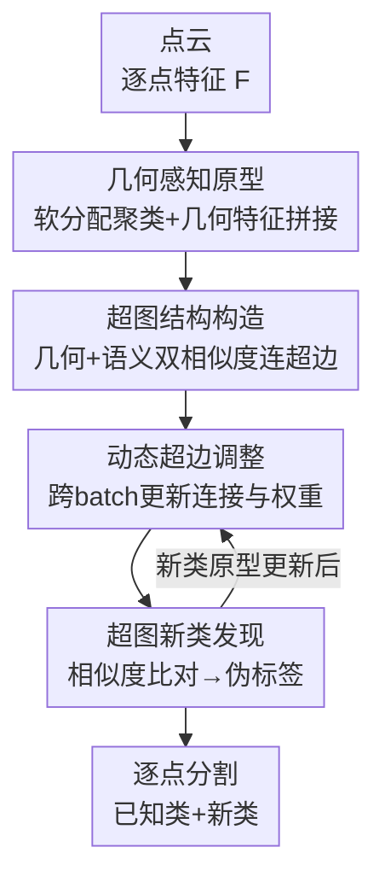

# Geometric-Aware Hypergraph Reasoning for Novel Class Discovery in Point Cloud Segmentation

**会议**: CVPR 2026  
**论文**: [CVF Open Access](https://openaccess.thecvf.com/content/CVPR2026/html/Zhang_Geometric-Aware_Hypergraph_Reasoning_for_Novel_Class_Discovery_in_Point_Cloud_CVPR_2026_paper.html)  
**代码**: https://github.com/2490o/HyperNCD  
**领域**: 3D视觉  
**关键词**: 点云分割, 新类发现, 超图推理, 几何感知原型, 开放世界  

## 一句话总结
用超图把"一个新类同时关联多个已知类原型"的高阶关系建模出来，再给每个原型补上几何结构特征，让模型在没见过的点云类别（如 bed）上靠已知类（chair/sofa/table）协同推理出语义，在 SemanticKITTI / SemanticPOSS 上新类 mIoU 大幅领先。

## 研究背景与动机
**领域现状**：点云语义分割在自动驾驶、机器人里价值很高，但绝大多数方法都假设训练时所有类别已知，开放世界里一旦出现没标注的新类就失效。Riz 等人提出的 Novel Class Discovery in Point Cloud Segmentation（点云分割中的新类发现，NCD）任务正是要解决这个问题：用已知类的几何与语义知识，自动把点云里未标注的新类分割出来。

**现有痛点**：现有方法（NOPS 基于在线聚类 + 不确定性估计，DASL 基于区域一致性 + 半松弛最优传输）做类别关联和标签分配时，依赖的都是**二元关系**——要么点对点、要么点对区域、要么类对类成对相似。这意味着一个新类只能跟"最像的那一两个"已知类挂钩，无法同时利用多个已知类的信息。

**核心矛盾**：新类的语义往往是多个已知类的"组合体"（bed 介于 chair / sofa / table 之间），二元关系天然表达不了这种"一对多"的高阶关联；而且现有方法过度关注语义特征，几乎忽略了点云最本质的 3D 几何结构（曲率、平面性、线性度），导致新类边界和小目标分割不准。

**本文目标**：(1) 用一种结构同时连接多个已知类原型，建模新类↔多已知类的高阶关联；(2) 把几何空间结构注入原型，弥补纯语义特征的不足。

**切入角度**：超图（hypergraph）的一条超边可以同时连接多个节点，而不是普通图只能连两个点——这恰好对应"一个新类原型同时关联多个已知类原型"的需求。

**核心 idea**：用**几何感知原型**当超图节点、用**几何+语义双相似度**连成超边，让多个已知类原型在一条超边内协同推理出新类，并随训练动态调整超边以应对新类涌现和类别不平衡。

## 方法详解

### 整体框架
方法叫 Geometric-Aware Hypergraph Reasoning（HyperNCD）。输入是一帧点云，输出是包含已知类与新类的逐点分割。整条流水线是：骨干网络抽逐点特征 → 把点软分配聚成几何感知原型（每类一个原型，作为超图节点）→ 用几何+语义双相似度给原型连超边、构成本 batch 的原型超图 → 跨 batch 动态调整超边权重与连接 → 在超图上对新原型做相似度比对，生成伪标签完成新类发现。其中原型携带几何信息、超边承载高阶关联、动态机制负责适配，是三个核心贡献点。

### 关键设计

**1. 几何感知原型：给原型补上点云最本质的 3D 结构信息**

针对"现有方法只抠语义、丢掉几何"这个痛点，作者让每个类的原型同时携带语义和几何两部分特征。给定骨干抽出的特征图 $F \in \mathbb{R}^{N \times P \times C}$（N 为 batch、P 为点数、C 为通道），先 reshape 成 $F_{flat} \in \mathbb{R}^{N \cdot P \times C}$，用 1D 卷积映射到 $K$ 个簇（K 等于类别数）得到 $\sigma = \text{Conv1d}(F_{flat})$，再沿 K 维做 softmax 得到软分配矩阵 $S_p = \text{softmax}(\sigma)$，其中 $s_{i,k}$ 是第 $i$ 个点分给第 $k$ 个原型的权重。

每个点的特征由语义和几何拼接而成：$F_i = [f_{sem}(x_i); f_{geo}(x_i)]$。几何特征 $f_{geo}(x_i)$ 的算法是：先用 KNN（$K=15$）取局部邻域 $N(x_i)$，再对邻域点的欧氏距离协方差矩阵求特征值，从中提取 Linearity（线性度）、Planarity（平面性）、Scattering（散度）这类刻画**局部曲率**的结构线索；语义特征 $f_{sem}(x_i)$ 则在邻域上叠多层 3D 卷积逐层聚合高层上下文。原型更新用软加权残差：$R_k = \sum_{i=1}^{N \cdot P} s_{i,k} \cdot (F^i_r - P_k)$，再 L2 归一化 $P'_k = R_k / \lVert R_k \rVert_2$，让原型动态收敛到点云中空间与语义模式的中心。这一步的价值在消融里很直接——它单独就能把新类 mIoU（Ground 类）从 35.9 提到 54.5。

**2. 双相似度超边构造：让一个新类原型同时挂上多个已知类原型**

二元关系的根本问题是一个原型只能跟最近的一个挂钩，捕捉不到"新类是多个已知类组合"的高阶关系。作者用超边解决：一条超边可以同时框住多个原型节点。两原型间的相似度由几何和语义两部分加权：$S_b(P_i, P_j) = \alpha \cdot S_g(P_i, P_j) + \beta \cdot S_s(P_i, P_j)$，其中 $\beta = 1 - \alpha$。

几何相似度先算两原型对应邻域点集间的平均局部距离 $D_g(P_i, P_j) = \frac{1}{|N_i| \cdot |N_j|} \sum_{x_p \in N_i} \sum_{x_q \in N_j} \lVert x_p - x_q \rVert_2$，再用高斯核归一化 $S_g(P_i, P_j) = \exp(-D_g(P_i, P_j) / \tau)$（温度 $\tau = 0.1$）；语义相似度用余弦相似度 $S_s(P_i, P_j) = \frac{P_i \cdot P_j}{\lVert P_i \rVert_2 \lVert P_j \rVert_2}$。然后为每个原型 $P_i$ 选出最相似的 $M$ 个原型，构成一条超边 $e_i = \{P_i, P_{j_1}, \dots, P_{j_M}\}$。$M$ 是控制连接数的关键超参——太大就引入冗余语义、反而掉点，实验在 $M=8$ 时最优。这样一条超边内的多个已知类原型就能协同地把信息传给新类原型，这是"用多个 base 类共同推断新类"的载体。

**3. 动态超边调整机制：应对新类涌现和跨 batch 的类别不平衡**

固定超边在开放世界里有硬伤——新类会随训练逐步出现，原型分布也在变，一成不变的连接没法跟上。作者给每条超边算一个动态权重 $w(e_i) = \frac{1}{M} \sum_{P_j \in N_i} [\alpha S_g(P_i, P_j) + (1-\alpha) S_s(P_i, P_j)]$（$\alpha$ 与超边构造里同一个、$|N_i| = M$），并在每个 batch 结束后根据更新后的原型重算相似度、重建超边集 $E^{(b+1)} = \{e_i^{(b+1)} \mid i = 1, \dots, K\}$。$\alpha$ 本身从 0.5 起步、训练中动态调整，平衡几何与语义的权重。这个"边构造—权重—重建"的回环让超图能持续吸收新出现的类别结构，也缓解了不同 batch 间样本数悬殊带来的类别不平衡。

**4. 超图驱动的新类发现：用相似度阈值判定旧类归属还是开新类**

有了超图后，新类发现落到伪标签生成上。对 batch $b$ 中遇到的新原型 $P_i$，算它与当前所有原型的相似度 $S_b(P_i, P_j)$：若与某已知原型的相似度超过阈值，就把该类的伪标签赋给它 $\hat{y}_i^{(b)} = \arg\max_{P_j \in V} S_b(P_i, P_j)$；否则判为新类、分配新标签，并把它纳入训练集，用 $P_j^{(b+1)} = P_j^{(b)} + \gamma \cdot (x_u - P_j^{(b)})$ 更新原型（$\gamma$ 为学习率、$x_u$ 为新样本特征）。为提升伪标签鲁棒性还加了标签平滑（$\epsilon = 0.15$）。注意这里"超过阈值赋旧标签、否则开新类"是一套阈值规则，配合上面的原型更新和超边重建形成闭环。⚠️ Algorithm 1 与正文 Eq.(6) 在符号上略有出入（Eq.6 写 $\beta$、算法里写 $1-\alpha$，实为同一量），损失函数与阈值具体取值原文放在补充材料，以原文/补充为准。

### 一个完整示例
以新类 **bed** 为例走一遍：骨干抽完特征后，bed 区域的点被软分配聚成一个几何感知原型，它既带 bed 表面的平面性/散度等几何线索，也带语义特征。构造超边时，系统对它算双相似度，发现 chair、sofa、table 三个已知类原型都比较像（几何上有大平面、语义上同属家具），于是把它们连进同一条超边（$M=8$ 时还会带上更多近邻）。在这条超边内，chair/sofa/table 的几何与语义信息协同传到 bed 原型上——即便从没在 bed 上训练过，模型也能据此推断出 bed 的语义结构。随训练推进，动态机制不断重算相似度、刷新这条超边，bed 原型逐渐稳定，最终生成准确的逐点分割。

## 实验关键数据

### 主实验
两个数据集：SemanticKITTI（19 类）和 SemanticPOSS（13 类），沿用 NOPS / DASL 的划分，各取一个子集当新类、其余当已知类，在序列 08 / 03 上评测；新类经匈牙利匹配后算 IoU，再对所有类取列均值。下面汇总各 split 的整体 mIoU（All）与新类 mIoU（Novel）。

| 数据集 / Split | 指标 | NOPS | DASL | 本文 (Ours) |
|--------------|------|------|------|------|
| POSS Split 2 | Novel mIoU | 9.0 | 12.6 | **22.3** |
| POSS Split 2 | All mIoU | 36.0 | 44.3 | **47.0** |
| POSS Split 3 | Novel mIoU | 10.9 | 17.7 | **37.8** |
| POSS Split 3 | All mIoU | 36.3 | 44.7 | **46.8** |
| KITTI Split 1 | All mIoU | 40.7 | 44.5 | **46.3** |
| KITTI Split 3 | All mIoU | 41.2 | 45.8 | **45.9** |

POSS Split 3 的新类 mIoU 从 DASL 的 17.7 跳到 37.8，几乎翻倍；SemanticKITTI 四个 split 的整体 mIoU 全部最高。部分 split（KITTI Split 1/3）的结果已逼近全监督上界（Full 49.8）。

### 消融实验
在 SemanticPOSS Split 0 上逐模块加（GAP = 几何感知原型，HSC = 超图结构构造，DHAM = 动态超边调整），Avg 为四个 split 的平均 mIoU。

| 配置 | Ground (新类) | Avg mIoU | 说明 |
|------|------|------|------|
| Baseline (MinkUNet-34C) | 35.9 | 23.2 | 仅骨干 |
| + GAP | 54.5 | 27.4 | 加几何感知原型，新类大涨 |
| + HSC | 68.4 | 32.8 | 加超图，建模多类高阶交互 |
| + GAP + HSC | 72.4 | 34.2 | 几何原型替换普通原型 |
| Full (+ DHAM) | 80.9 | **36.5** | 动态超边再补，缓解不平衡 |

### 关键发现
- **几何信息贡献最直接**：单加 GAP 就把 Ground 类从 35.9 提到 54.5，证明点云里几何结构被现有方法严重低估。
- **超图是涨点主力**：HSC 把 Avg 从 27.4 推到 32.8，高阶关联确实比二元关联更能服务新类推理。
- **超边连接数 M 有最优点**：POSS 和 KITTI 都在 $M=8$ 时最好；$M=10$ 时两者都掉点，因为过多连接引入冗余语义。
- **标签平滑对类多的数据更有用**：$\epsilon$ 越大在类别更丰富的 SemanticKITTI 上越能抑制过拟合、改善推理。
- **小目标分割更准**：可视化显示本文对车辆等小目标能保持更完整形状、更贴近 GT。

## 亮点与洞察
- **把超图引入 NCD 是首次**：作者声称这是第一个把高阶超图推理用到点云新类发现的工作，"一条超边连多个已知类原型"恰好匹配"新类=多已知类组合"的本质，比普通图的二元约束表达力强一档。
- **几何特征的注入方式很轻量可复用**：用 KNN 邻域协方差特征值算 Linearity/Planarity/Scattering，再和语义特征拼接成原型——这套"几何描述子 + 语义特征"的拼法可以迁移到任何点云原型学习里。
- **双相似度 + 高斯核**：几何用平均局部距离过高斯核、语义用余弦，再加权融合，给"几何/语义谁更重要"留了一个可学的 $\alpha$，思路干净。
- **vs 开放词表方法**：作者特意论证 NCD 比 open-vocabulary 更适合 3D——后者依赖大语言模型先验，在文本稀疏的 3D 场景和超出语义覆盖的概念上会退化，而 NCD 靠对已知类的自组织推理、不需语言先验。

## 局限与展望
- **某些类反而掉点**：在 KITTI 主表里 person、truck 等个别类本文低于 DASL，trashcan、trunk 这类小/稀疏类波动很大（POSS 上 trashcan 仅 3.3~13.0），说明高阶关联对极端少样本类未必稳。
- **依赖原型数 = 类别数**：$K$ 直接设成类别数，意味着需要预知类别总数，真正完全开放（类别数未知）的场景适配性存疑。
- **关键细节在补充材料**：损失函数、相似度阈值、局部曲率量化的具体公式都放到了补充，正文无法完全复现；阈值是固定还是自适应也没在正文交代。⚠️ 以原文/补充为准。
- **改进思路**：把"超过阈值赋旧标签"的硬阈值换成可学习的开集判别、或对极少样本类做超边层面的重加权，可能缓解小类不稳。

## 相关工作与启发
- **vs NOPS [18]**：NOPS 开创了点云 NCD，用在线聚类 + 不确定性估计，但靠类间二元关系做信息关联和标签分配，捕捉不到多类高阶关联；本文用超图把"一对多"关系显式建模，新类 mIoU 普遍大幅领先。
- **vs DASL [31]**：DASL 用区域一致性 + 半松弛最优传输缓解类别不平衡，但信息关联仍限于点-区域这类成对、紧邻关系；本文的超边能跨多个类传播几何+语义信息，且专门补了几何特征，在 POSS Split 2/3 新类上拉开明显差距。
- **vs 普通图/2D NCD 方法**：2D NCD 多用聚类 + 二元特征相似度，丢掉高阶类关系；本文借超图的多节点超边把这层关系补回来，并叠加点云特有的几何描述子。
- **vs 开放词表分割**：开放词表靠 LLM 语言先验，文本稀疏的 3D 里易退化；NCD 纯靠视觉+几何自组织推理，作者在相同设置下仍优于开放词表方法（补充材料）。

## 评分
- 新颖性: ⭐⭐⭐⭐⭐ 首次把高阶超图推理引入点云新类发现，"超边连多已知类原型"切中二元关系的根本短板。
- 实验充分度: ⭐⭐⭐⭐ 两数据集四 split 全覆盖 + 三模块消融 + M/ε 超参分析，但损失与阈值细节藏在补充、个别小类掉点未深究。
- 写作质量: ⭐⭐⭐⭐ 动机—方法—实验链条清晰、公式完整，但 Algorithm 与正文符号有小出入。
- 价值: ⭐⭐⭐⭐ 开放世界点云分割的实用方向，几何感知原型 + 双相似度超边的设计可复用性强。

<!-- RELATED:START -->

## 相关论文

- [\[ECCV 2024\] Dual-level Adaptive Self-Labeling for Novel Class Discovery in Point Cloud Segmentation](../../ECCV2024/3d_vision/dual-level_adaptive_self-labeling_for_novel_class_discovery_in_point_cloud_segme.md)
- [\[NeurIPS 2025\] Novel Class Discovery for Point Cloud Segmentation via Joint Learning of Causal Representation and Reasoning](../../NeurIPS2025/3d_vision/novel_class_discovery_for_point_cloud_segmentation_via_joint_learning_of_causal_.md)
- [\[CVPR 2026\] Hyper-PCN: Hypergraph-Based Point Cloud Completion via High-Order Correlation Modeling](hyper-pcn_hypergraph-based_point_cloud_completion_via_high-order_correlation_mod.md)
- [\[CVPR 2026\] GeoFree-CoSeg: Unsupervised Point Cloud-Image Cross-Modal Co-Segmentation Without Geometric Alignment](geofree-coseg_unsupervised_point_cloud-image_cross-modal_co-segmentation_without.md)
- [\[CVPR 2026\] QD-PCQA: Quality-Aware Domain Adaptation for Point Cloud Quality Assessment](qd-pcqa_quality-aware_domain_adaptation_for_point_cloud_quality_assessment.md)

<!-- RELATED:END -->
