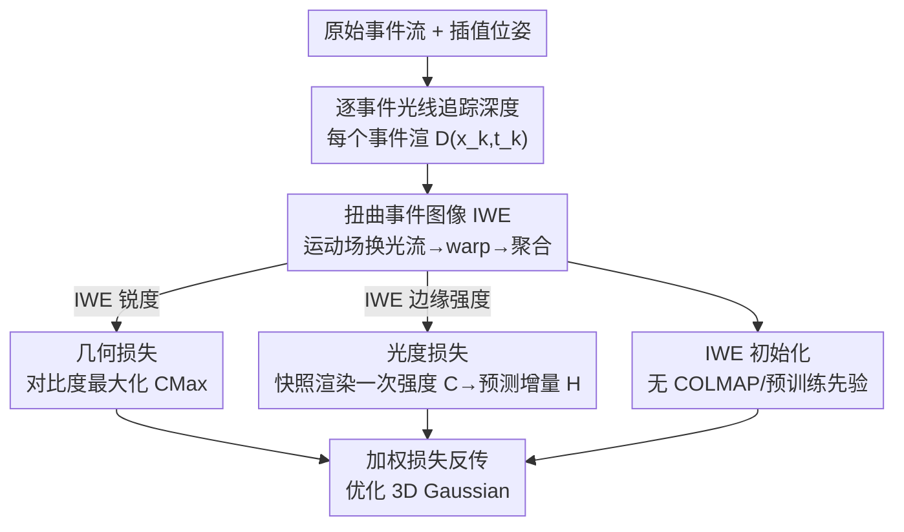

# Geometric-Photometric Event-based 3D Gaussian Ray Tracing

**会议**: CVPR 2026  
**论文**: [CVF Open Access](https://openaccess.thecvf.com/content/CVPR2026/html/Kohyama_Geometric-Photometric_Event-based_3D_Gaussian_Ray_Tracing_CVPR_2026_paper.html)  
**代码**: https://github.com/e3ai/gpert  
**领域**: 3D视觉  
**关键词**: 事件相机, 3D Gaussian Splatting, 光线追踪, 对比度最大化, 新视角合成  

## 一句话总结
GPERT 把纯事件驱动的 3DGS 渲染拆成两条互补支路——逐事件（时间密集、空间稀疏）的光线追踪深度渲染算几何损失、每个事件批只渲染一次（空间密集、时间稀疏）的辐射图算光度损失，靠"扭曲事件图像"(IWE) 把两条支路缝起来，从而摆脱"渲染两次相减"范式里精度与时间窗口之间的死结，在真实事件数据集上做到 SOTA 且训练最快、不依赖任何预训练模型或 COLMAP 初始化。

## 研究背景与动机
**领域现状**：事件相机以 µs 级时间分辨率异步记录每个像素的对数亮度变化，天然适合恢复运动与结构；3D Gaussian Splatting 又是当前光度三维重建和新视角合成（NVS）的 SOTA 表示。把两者结合的"纯事件 3DGS"被寄予厚望，因为事件流没有运动模糊、动态范围高，能绕过帧相机的固有短板。

**现有痛点**：现有事件 NeRF / GS 的主流做法是"渲染两次相减"——在事件切片的首末两个时间戳各渲染一张稠密强度图 $C(t_1)$、$C(t_2)$，用差分图 $\Delta C = C(t_2)-C(t_1)$ 去拟合事件按像素累加得到的边缘图。这套范式有两个硬伤：一是每个样本要做两次全像素稠密渲染，训练慢；二是陷入"精度 vs 时间窗口"的两难——时间窗口取太短，只产生几个事件的细微亮度变化抓不住；窗口取太长，预测的边缘图被运动拍糊，反而丢掉了事件本该携带的细粒度时间信息。

**核心矛盾**：事件流测量的是"在准连续时刻、准连续视角上的稀疏亮度差分"，而 3DGS 渲染出来的是"某个确定视角和时刻的绝对强度图"——两种量在物理上几乎是对立的。强行用"两帧相减"去逼近事件，本质上是把时间密集的事件硬塞进时间稀疏的稠密渲染里，时间分辨率必然被牺牲。此外，多数事件 3DGS 还要靠 E2VID 等预训练视频重建模型或深度模型来做初始化和正则，限制了灵活性。

**本文目标**：让稠密强度图每个样本只渲染一次（render-once），同时保留事件的高时间分辨率；并且彻底甩掉预训练先验和 COLMAP 初始化。

**切入角度**：作者意识到 3DGS 渲染里其实有两个性质截然不同的量——"连续时间、空间稀疏的深度"和"瞬时、空间稠密的强度"，没必要用同一套稠密渲染去同时承载。把它们解耦，各取所需，就能同时要到时间分辨率和效率。

**核心 idea**：把渲染拆成两条支路——用光线追踪做逐事件的深度（结构）渲染、用一次快照渲染做稠密强度（外观），再用扭曲事件图像 IWE 当桥梁分别构造几何损失和光度损失。

## 方法详解

### 整体框架
GPERT 的输入是原始事件流 $\mathcal{E}=\{(\mathbf{x},t,p)\}$ 和已知相机位姿，输出是优化好的一组 3D Gaussian（结构 + 外观参数），可用于 NVS。整套优化的关键是把渲染解耦成两条支路：上支路是"逐事件、时间密集、空间稀疏"的深度渲染，专门服务几何损失；下支路是"一次快照、空间密集、时间稀疏"的强度渲染，专门服务光度损失。两条支路通过同一张扭曲事件图像（IWE）连接——IWE 既反映运动对齐的边缘（喂给几何损失），又反映边缘强度（喂给光度损失）。

具体到一个事件切片 $\mathcal{E}=\{e_k\}_{k=1}^{N_e}$（取中点时刻 $t_{\mathrm{mid}}$ 作参考）：先对每个事件用插值位姿做光线追踪，渲出逐事件深度 $D(\mathbf{x}_k,t_k)$，再由运动场方程换算成逐事件光流，把事件扭曲到 $t_{\mathrm{mid}}$ 聚合成 IWE；IWE 越锐利说明运动估计越准，由此构造对比度（几何）损失。同时在 $t_{\mathrm{mid}}$ 渲一次稠密强度图 $C$，按事件生成模型算出瞬时亮度增量预测 $\hat{H}$，与 IWE 做 L2 + SSIM 比较构成光度损失。两类损失加权求和反传，端到端优化高斯参数。

### 关键设计

**1. 逐事件光线追踪深度：让每个事件单独携带深度，而不是稠密渲染再掩码**

针对"渲染两次相减"里稠密渲染昂贵、又抹掉时间分辨率的痛点，作者借鉴 3DGRT / 3DGUT 等光线追踪 GS，把渲染从"图像光栅化"换成"逐事件光线追踪"。事件在像素空间稀疏、在时间上准连续，所以理应稀疏渲染。对每个事件 $e_k=(\mathbf{x}_k,t_k,p_k)$，在其时间戳 $t_k$ 算出插值位姿 $(R(t_k),T(t_k))$ 和过光心、过像素 $\mathbf{x}_k$ 的光线，用 GPU 加速的光线追踪渲出该事件对应的深度 $D(\mathbf{x}_k,t_k)$——这是空间和时间的二元函数。深度本身沿用 3DGS 的不透明度加权期望：$D(\mathbf{x})=\frac{\sum_i Z_i w_i(\mathbf{x})\prod_{j<i}(1-w_j)}{\sum_i w_i(\mathbf{x})\prod_{j<i}(1-w_j)+\epsilon}$，其中 $Z_i=\mathbf{e}_3^\top\boldsymbol{\mu}_i$ 是第 $i$ 个高斯在相机系下的均值深度，$w_i=\alpha_i G_i$ 是其对该像素的贡献权重。作者特别强调，稀疏深度/光流不是把稠密结果掩码出来的，而是真正逐事件光线追踪算出来的——这是连接"逐事件深度估计"和"3DGS"的关键实现，也是整套 render-once 框架能跑起来的前提。

**2. 几何损失：用对比度最大化把"深度算对没"无监督地表达出来**

有了逐事件深度，怎么判断它对不对？作者套用对比度最大化（CMax）框架。在亮度恒定假设下，事件由运动边缘产生，若运动已知就能把事件"运动补偿"对齐到参考时刻。逐事件深度可经运动场方程换成逐事件光流：$\mathbf{v}(\mathbf{x},t)=\frac{1}{D(\mathbf{x},t)}A(\mathbf{x})\mathbf{V}+B(\mathbf{x})\boldsymbol{\omega}$（$\mathbf{V},\boldsymbol{\omega}$ 为已知相机线/角速度）。再把事件按 $\mathbf{x}'_k=\mathbf{x}_k+(t_k-t_{\mathrm{ref}})\,\mathbf{v}(\mathbf{x}_k,t_k)$ 扭曲并聚合成 IWE。真实运动会让 IWE 边缘锐利、对齐，所以用 IWE 的锐度（梯度 L1 范数，且用零光流处的值归一化）作几何损失：$\mathcal{L}_c\doteq G(\mathbf{0};-)/G(\mathbf{v}(D);t_{\mathrm{ref}})$，$G(\mathbf{v}(D))=\frac{1}{|\Omega|}\int_\Omega\|\nabla\,\mathrm{IWE}(\mathbf{x})\|_1\,d\mathbf{x}$（因为是最小化形式所以取倒数）。这等于让 3DGS 把深度估对——深度对了，光流对，IWE 才锐——是完全无监督、不需要任何深度真值或预训练深度模型的几何约束。

**3. 光度损失：稠密强度只渲一次，用 IWE 边缘强度拟合瞬时亮度增量**

IWE 不只编码运动对齐的边缘，还编码边缘强度（即沿光流方向的强度梯度），所以同一张 IWE 也能用来构造光度损失，这正是 render-once 的精髓。作者按事件生成模型预测参考时刻的边缘强度：$\hat{H}(\mathbf{x};t_{\mathrm{ref}})\doteq\frac{\partial\log C}{\partial t}\Delta t\approx-\nabla\log(C)\cdot\mathbf{v}\,\Delta t$，其中 $C$ 是在参考位姿下"渲染一次"得到的稠密强度图，$\mathbf{v}$ 是用该时刻渲染深度算出的运动场。然后把带极性的 IWE 与这个预测做 L2 + SSIM 比较：$\mathcal{L}_p\doteq\frac{1}{|\Omega|}\|\mathrm{IWE}-\hat{H}\|^2$、$\mathcal{L}_s\doteq\mathrm{SSIM}(\mathrm{IWE},\hat{H})$。作者明确论证为什么"扭曲"比传统"按像素累加极性"更能榨干高时间分辨率：累加方式会(i)产生模糊边缘丢时间信息、(ii)正负极性相互抵消(neutralization)、(iii)需要两次稠密渲染、(iv)丢掉对深度/光流的依赖——而 warp 方案这四点都避开了，且只渲一次。总损失为 $\mathcal{L}\doteq\lambda_c\mathcal{L}_c+\lambda_p\mathcal{L}_p+\lambda_s\mathcal{L}_s$。

**4. IWE 初始化：用锐利的扭曲事件图像替代 COLMAP / 预训练先验**

3DGS 的高斯初始化很关键，帧式方法常用 COLMAP 把初始高斯放到纹理边缘上，而前作 EventSplat 还要靠 E2VID 重建强度再跑 COLMAP。GPERT 直接用不带极性的 $\mathrm{IWE}(\mathbf{x};t_{\mathrm{mid}})$ 和渲染图 $C(\mathbf{x})$ 来初始化，其余管线不变。因为 IWE 对边缘响应、且经 warp 后比"按像素累加事件"的图更锐利，能把初始高斯中心的可能位置收得更窄，从而让初始高斯天然落在场景结构上。这一步让整套方法完全不依赖任何预训练模型或 COLMAP，是"无先验"卖点的落地实现。

### 损失函数 / 训练策略
对每个事件切片取中点时刻为参考 $t_{\mathrm{ref}}\doteq t_{\mathrm{mid}}$。超参：对比度阈值 $C_{th}=0.25$，损失权重 $\lambda_c=0.125,\lambda_p=500,\lambda_s=1$；事件数 EDS 与合成数据 $N_e=125\mathrm{k}$、TUM-VIE $N_e=500\mathrm{k}$；初始化 10k 步，总训练 40k 步。

## 实验关键数据

### 主实验
真实世界数据集 EDS（640×480 事件相机）与 TUM-VIE（1280×720，1 兆像素），平均指标对比（↑ 越大越好，LPIPS↓ 越小越好）：

| 数据集 | 指标 | 本文 | EventSplat (CVPR'25) | IncEventGS (CVPR'25) | Robust E-NeRF (ICCV'23) |
|--------|------|------|------|------|------|
| EDS | PSNR↑ | **19.47** | 18.86 | 15.21 | 16.25 |
| EDS | SSIM↑ | **0.816** | 0.792 | 0.691 | 0.739 |
| EDS | LPIPS↓ | **0.357** | 0.362 | 0.561 | 0.543 |
| TUM-VIE | PSNR↑ | **13.09** | – (无开源) | 10.09 | 11.79 |
| TUM-VIE | SSIM↑ | **0.716** | – | 0.533 | 0.573 |
| TUM-VIE | LPIPS↓ | **0.411** | – | 0.685 | 0.588 |

真实数据上三项指标平均全部 SOTA，且不依赖预训练深度模型、不依赖视频引导初始化与三次样条位姿插值。合成彩色数据集（Robust E-NeRF 的 800×800 Bayer 彩色，由事件模拟器生成）上则为有竞争力但非最优——本文 PSNR 23.11 落后 EventSplat 28.14 / Robust E-NeRF 28.19，作者归因于 Bayer 彩色对 warp 方法不友好（不同颜色的 warped 像素可能不落同一位置、绿像素是红蓝的两倍导致颜色分布不均）。

### 消融实验
对比度损失与初始化的消融（Tab. 3，PSNR↑）：

| 配置 | 合成 | EDS | TUM-VIE | 说明 |
|------|------|------|---------|------|
| 完整模型 | 23.11 | 19.47 | 13.09 | Full |
| w/o 对比度损失 | 9.60 | 15.52 | 13.45 | 去掉几何损失，合成数据暴跌至 9.60 |
| w/o 初始化 | 20.82 | 17.34 | 11.36 | 用随机 10⁵ 高斯起步，EDS 掉 2.13 |

### 关键发现
- **对比度（几何）损失贡献巨大**：合成数据上去掉它 PSNR 从 23.11 崩到 9.60，SSIM 从 0.927 到 0.810，证明逐事件光线追踪深度 + CMax 这条几何支路是重建质量的支柱（TUM-VIE 上 PSNR 反而略升至 13.45，作者未深入解释，⚠️ 推测与该集噪声/翻拍特性有关，以原文为准）。
- **render-once 对事件数 $N_e$ 鲁棒**：传统"render-twice"在 $N_e$ 增大时边缘变糊、质量下降；本文 render-once 因 warp 去模糊，PSNR/SSIM 随 $N_e$ 基本不变（Fig. 6），而 $N_e$ 本是受分辨率/纹理/运动影响、很难调的敏感参数。
- **训练最快**：EDS / 合成 30–45 分钟，TUM-VIE 80–130 分钟；渲染 $N_g=0.1$M 约 3 ms、$N_g=1$M 约 30 ms。对比 Robust E-NeRF 与 IncEventGS 在 EDS 上需约 3 小时、EventSplat 报告 1–3 小时。
- **闪烁光照下仍收敛**：EDS 含大量闪烁灯事件（违反亮度恒定假设），出人意料地靠对比度损失也能成功重建（但作者在局限里承认大量闪烁事件会让外观与深度估计不稳）。

## 亮点与洞察
- **"解耦两种量"是真正的洞察点**：把 3DGS 渲染里"连续时间空间稀疏的深度"和"瞬时空间稠密的强度"分开各取所需，一举破解"精度 vs 时间窗口"的死结——这是比单纯换个 loss 更结构性的视角转变。
- **一张 IWE 缝两条支路**：同一张扭曲事件图像既提供运动对齐的边缘（几何损失），又提供边缘强度（光度损失），优雅地把 render-once 变成可能，避免了 render-twice 的双倍开销与极性抵消。
- **逐事件光线追踪 + CMax 的桥接**：把传统运动估计里的对比度最大化框架接到 3DGS 的可微深度渲染上，让几何约束完全无监督、不需任何深度真值，这套"几何损失驱动结构、光度损失驱动外观"的思路可迁移到其他事件式重建任务。
- **去先验**：用 IWE 自带的锐利边缘做初始化，干净地甩掉 E2VID/COLMAP 依赖，对部署灵活性是实打实的好处。

## 局限与展望
- 作者承认：基于对比度损失的无监督方法依赖亮度恒定假设，遇到大量闪烁事件时外观恢复与深度估计会不稳定。
- 假设**静态场景**，对动态场景不奏效；作者点出 event-based 4D GS 是值得做的方向。
- **彩色 Bayer 数据是软肋**：warp 方法在 Bayer 模式上吃亏，合成彩色数据明显落后帧式/NeRF 强基线，限制了向彩色事件相机的推广。
- 自己发现：真实数据上的定量评测本身有噪声——事件相机 HDR、事件相机与帧相机视场/光度不一致，PSNR 这类指标未必完全公平；TUM-VIE 上去掉对比度损失反而涨点这一反常现象论文未充分解释。

## 相关工作与启发
- **vs EventSplat / Event-3DGS（两次渲染的事件 3DGS）**: 他们渲两次稠密强度相减算光度损失、且依赖 E2VID 预训练或 COLMAP 初始化；本文只渲一次、用逐事件光线追踪深度 + warp 显式引入几何 + 光度损失，去掉所有先验，真实数据 SOTA 且更快、对 $N_e$ 更鲁棒。
- **vs IncEventGS**: 它是增量式跟踪建图、用预训练深度模型 bootstrap；本文不需深度预训练，几何信息完全由逐事件光线追踪 + CMax 无监督得到。
- **vs Robust E-NeRF（逐事件损失的事件 NeRF）**: 同样走逐事件、光线追踪路线，但它是 NeRF，对真实相机的事件噪声更敏感、渲染慢；本文用 3DGS 表示，真实数据更稳、训练显著更快。
- **vs PAEv3D / EF-3DGS（并行提出 event warping）**: 这两者也用事件扭曲，但前者是 NeRF、后者需事件+帧联合，且都没做纯事件 GS、也没实现逐事件深度渲染——本文是首个纯事件、逐事件深度渲染的 GS 框架。

## 评分
- 新颖性: ⭐⭐⭐⭐⭐ 首个把渲染解耦成"逐事件深度 + 一次快照强度"双支路的纯事件 3DGS，视角转变而非缝补。
- 实验充分度: ⭐⭐⭐⭐ 真实+合成多数据集、消融、$N_e$ 鲁棒性与运行时都覆盖，但 TUM-VIE 反常点与彩色短板解释不足。
- 写作质量: ⭐⭐⭐⭐⭐ 动机推导清晰、公式与图示完整，render-once 的优劣论证到位。
- 价值: ⭐⭐⭐⭐⭐ 破解精度/时间窗口死结、去先验、训练最快，对事件式三维重建是扎实推进。

<!-- RELATED:START -->

## 相关论文

- [\[CVPR 2026\] UTrice: Unifying Primitives in Differentiable Ray Tracing and Rasterization via Triangles for Particle-Based 3D Scenes](utrice_unifying_primitives_in_differentiable_ray_tracing_and_rasterization_via_t.md)
- [\[CVPR 2026\] eRetinexGS: Retinex Modeling for Low-Light Scene Enhancement via Event Streams and 3D Gaussian Splatting](eretinexgs_retinex_modeling_for_low-light_scene_enhancement_via_event_streams_an.md)
- [\[CVPR 2026\] Unsupervised 3D Motion Estimation Using Event Camera](unsupervised_3d_motion_estimation_using_event_camera.md)
- [\[CVPR 2025\] IRGS: Inter-Reflective Gaussian Splatting with 2D Gaussian Ray Tracing](../../CVPR2025/3d_vision/irgs_inter-reflective_gaussian_splatting_with_2d_gaussian_ray_tracing.md)
- [\[CVPR 2026\] AnchorSplat: Feed-Forward 3D Gaussian Splatting with 3D Geometric Priors](anchorsplat_feed-forward_3d_gaussian_splatting_with_3d_geometric_priors.md)

<!-- RELATED:END -->
