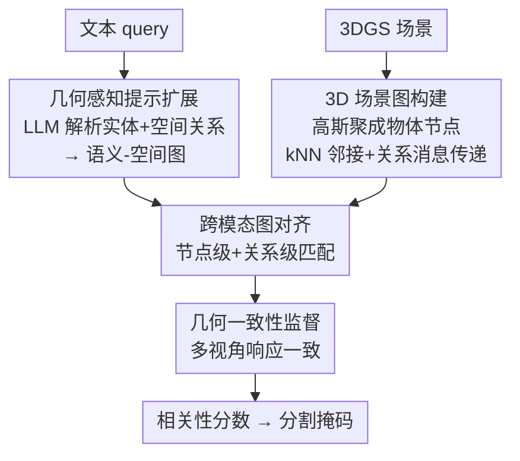

# Geometry-Aware Cross-Modal Graph Alignment for Referring Segmentation in 3D Gaussian Splatting

**会议**: CVPR 2026  
**论文**: [CVF Open Access](https://openaccess.thecvf.com/content/CVPR2026/html/Tao_Geometry-Aware_Cross-Modal_Graph_Alignment_for_Referring_Segmentation_in_3D_Gaussian_CVPR_2026_paper.html)  
**代码**: 无  
**领域**: 3D视觉  
**关键词**: 指代分割, 3D高斯泼溅, 跨模态对齐, 图匹配, 空间推理

## 一句话总结
GeoCGA 把"用自然语言在 3DGS 场景里指认并分割目标物体"这件事，重新表述成一个**几何感知的跨模态图对齐**问题：一边把文本扩成带空间关系的语义图，一边把高斯点云抽成物体级几何图，再让两张图在节点和边两个层级对齐，并用多视角一致性约束稳住接地，在 Ref-LERF / LERF-OVS / 3D-OVS 上相对 mIoU 分别提升 20.8% / 5.7% / 1.0%，且参数和 FLOPs 还都更省。

## 研究背景与动机
**领域现状**：3D 指代分割（Referring 3D Segmentation）要根据一句话（如"放在凳子上、靠近苹果的那个"）在三维场景里定位并分割目标。3D 高斯泼溅（3DGS）因为可微、可实时渲染、几何外观一体，成了这个任务的主流表征。代表方法 ReferSplat 把语言特征和高斯表征对齐，用置信度加权的伪掩码做监督，是第一个 R3DGS 框架。

**现有痛点**：这类方法**空间推理能力很弱**。作者做了实证分析（论文第 4 节）：同一个物体，给"有杯子"的简单 prompt 时 ReferSplat 能定位对，但一旦换成"挨着黄碗的那只高玻璃杯"这种空间关系主导的描述，它就会错指到旁边的物体；即使定位对了，掩码也常常粗糙、跨视角漂移。

**核心矛盾**：作者把病根归到两点。其一，**语言编码器（BERT/CLIP 文本端）天生没有显式位置编码**，"左边/上方/靠近"这类空间介词只能退化成弱的词共现相似度，根本表达不出结构化的几何关系。其二，**跨模态注意力是自强化的**——一旦模型早期把词关联到"外观相似但空间错误"的区域，这个偏差会在整个高斯场训练过程中被不断放大，错上加错。两者叠加，意味着现有框架把几何和语义**纠缠**在一起，没有任何显式机制去**解耦再对齐**。

**本文目标**：在语言侧和 3D 侧都注入显式的几何结构，并在**关系层级**（而不仅是节点特征相似度）上把两侧对齐，同时跨视角稳住空间对应。

**核心 idea**：把指代分割改写成"两张关系图的跨模态对齐"——文本侧建语义-空间图、场景侧建物体级几何图，节点对齐 + 关系对齐 + 多视角几何一致性，三件事一起做。

## 方法详解

### 整体框架
GeoCGA 的输入是一句文本 query 和一个重建好的 3DGS 场景 $\mathcal{G}=\{g_i\}_{i=1}^N$（每个高斯有均值 $\mu_i$、协方差 $\Sigma_i$、不透明度 $\sigma_i$、颜色 $c_i$），输出是每个高斯的相关性分数 $r_i$，据此挑出属于目标物体的高斯子集、渲染成分割掩码。整条管线分四步：先用 **GAPE** 把原始文本扩成"实体 + 空间关系"的三元组并建成语义-空间图 $\mathcal{G}_{text}$；并行地，用 **3DSGC** 把零散的高斯基元聚成物体级节点、按几何邻接建成场景图 $\mathcal{G}_{sg}$；然后 **CMGA** 在共享隐空间里同时做节点对齐和关系对齐，把语言实体和高斯物体精细对应起来；最后 **GCS** 用多视角一致性约束，让同一个高斯在不同相机视角下的响应保持一致，避免接地漂移。

整体损失是对齐项加几何正则项：

$$\mathcal{L}_{total} = \mathcal{L}_{align} + \lambda_{geo}\,\mathcal{L}_{geo}$$

其中 $\mathcal{L}_{align}$ 监督节点级和关系级的语言-几何匹配，$\mathcal{L}_{geo}$ 强制跨视角响应一致，$\lambda_{geo}$ 控制几何正则强度。

### 关键设计

**1. 几何感知提示扩展 GAPE：给只懂词频的语言编码器补上空间结构**

针对"BERT/CLIP 文本端没有位置先验、空间介词被压成弱语义相似度"这个痛点，GAPE 不再把文本当纯语义信号，而是在语言侧加一层显式的空间推理。给定 query $S=\{w_t\}_{t=1}^T$，先用预训练语言模型拿到逐 token 的上下文嵌入 $f_w$；再用一个轻量 LLM（LLaMA-3.1-8B）做**结构感知的提示扩展**，把句子解析成实体集合 $E$ 和空间关系集合 $R$，产出扩展描述

$$S' = \{(e_i, r_{ij}, e_j) \mid e_i, e_j \in E,\; r_{ij} \in R\}$$

每个关系 $r_{ij}$ 表达一种几何依赖（"left of""above""near"）。比如"坐在凳子上、靠近苹果的那个"会被展开成"目标 X 在凳子 S 的座面平面上、有小的垂直间隙；X 在 S 上方；X 在图像平面里靠近苹果 A"。扩展文本重新编码得到增强嵌入 $f'_w$，然后据此建语义-空间图 $\mathcal{G}_{text}=(V_t,E_t)$：节点是实体嵌入，边由学到的关系向量 $r_{ij}$ 加权。和普通序列编码器相比，这张图把全局空间依赖和关系层级**显式存了下来**，才能在后面跟 3D 几何结构直接对齐。

**2. 3D 场景图构建 3DSGC：把碎片化的高斯基元抬升到物体级关系表征**

3DGS 用大量低级基元描述局部外观和密度，但基元之间没有显式结构关系，粒度和"物体 + 空间关系"的语言描述天然错配——只靠基元级推理，模型只能从碎片线索里隐式猜物体结构，视角一变就对齐模糊。3DSGC 用预训练模型 Dr. Splat 拿到物体级表征，建物体级场景图 $\mathcal{G}_{sg}=(V,E)$：每个节点的初始描述子聚合了位置和外观 $f^{(0)}_i=[\mu_i, c_i]$；边连向几何最近邻 $\mathcal{N}(i)$，边属性是相对距离和方向 $e_{ij}=[\lVert\mu_i-\mu_j\rVert_2,\ \mathrm{dir}(\mu_i,\mu_j)]$。然后做一轮关系消息传递细化节点嵌入：

$$f'_i = \phi\Big(f^{(0)}_i,\ \{\psi(f^{(0)}_j, e_{ij}) \mid v_j \in \mathcal{N}(i)\}\Big)$$

$\psi,\phi$ 是可学的关系聚合函数，细化后的嵌入编码了更高阶的空间配置和几何上下文。这样得到的图显式刻画了场景拓扑，能和语言侧的关系线索直接对齐。

**3. 跨模态图对齐 CMGA：节点对齐之外，强制"语言里的关系=3D里的几何排布"**

两张图虽都编码了关系，但模态的特征空间和拓扑根本不同，所以要在节点和关系两个层级一起匹配。**节点级**：对文本节点 $F_{text}$ 和几何节点 $F_{geo}$ 算跨模态相似度矩阵

$$A_{t,g} = \frac{\exp(f'_t \cdot f'_g / \tau)}{\sum_{g'} \exp(f'_t \cdot f'_{g'} / \tau)}$$

$\tau$ 是温度系数（取 0.07），$A_{t,g}$ 衡量文本实体 $t$ 和高斯 $g$ 的对应概率，形成场景上的软对齐图。**关系级**：语言里的"left of""behind"隐含结构依赖，应该在几何域被保住——对一对文本实体 $(t_i,t_j)$ 的关系嵌入 $r_{ij}$ 和对应高斯对 $(g_p,g_q)$ 的几何边 $e_{pq}$，定义关系一致性分数 $S_{ij,pq}=\mathrm{sim}(r_{ij}, \phi(e_{pq}))$，其中 $\phi(\cdot)$ 把几何边投到语言关系同一隐空间。总对齐目标把两者合在一起：

$$\mathcal{L}_{align} = -\sum_{(t,g)} \log A_{t,g} - \lambda_{rel}\sum_{(i,j,p,q)} S_{ij,pq}$$

$\lambda_{rel}$（取 1.0）平衡关系匹配的权重。这一项同时管住了局部语义对齐和全局结构一致——这正是它优于"只比节点特征相似度"旧做法的地方：消融里关系显式匹配比关系隐式匹配在 Ramen/Kitchen 上分别再涨 +1.0/+0.6。

**4. 几何一致性监督 GCS：用多视角约束替代单视角伪掩码，稳住跨视角接地**

单视角内的跨模态对齐解决不了跨相机视角的漂移——缺乏全局几何正则，局部对齐在新视角或遮挡下会跑偏。ReferSplat 依赖单视角伪掩码，恰恰鼓励了"视角依赖"的相关而非真 3D 几何。GCS 改成显式约束多视角一致：给训练视角集 $\{V_s\}_{s=1}^S$，每个视角渲出相关性图 $M_s(v)$，理想情况下同一个 3D 高斯 $g_i$ 在不同视角的投影响应应当一致，于是用一致性损失惩罚跨视角差异：

$$\mathcal{L}_{geo} = \frac{1}{N}\sum_{i=1}^N \sum_{(s_1,s_2)} \big\lVert R_{s_1}(g_i) - R_{s_2}(g_i) \big\rVert_2^2$$

$R_s(g_i)$ 是高斯 $g_i$ 在视角 $V_s$ 下的渲染响应。它把模型隐式正则到一个全局自洽的 3D 解释上。消融显示这个一致性损失比伪掩码监督在 Ramen/Kitchen 上分别多 +1.2/+0.9。

### 损失函数 / 训练策略
总损失 $\mathcal{L}_{total}=\mathcal{L}_{align}+\lambda_{geo}\mathcal{L}_{geo}$，$\lambda_{geo}=0.2$、$\lambda_{rel}=1.0$、$\tau=0.07$，所有超参跨数据集固定。实现上语言特征用 CLIP（ViT-B/16），文本扩展用离线的 LLaMA-3.1-8B（不计入可训练参数和推理 FLOPs），物体级表征用 Dr. Splat。每个场景训 4 个 epoch，AdamW（lr $1\times10^{-4}$，weight decay $1\times10^{-2}$），单张 RTX 5090。

## 实验关键数据

### 主实验
在三个基准上都刷到最好，且越是空间关系复杂的场景增益越大（Ref-LERF 平均相对 +20.8%，‡ 为作者复现取五次平均）。

| 数据集 | 指标 | GeoCGA | 次优 (ReferSplat‡) | 相对提升 |
|--------|------|--------|----------|----------|
| Ref-LERF (Average) | mIoU | **30.2** | 25.0 | +20.8% |
| LERF-OVS (Average) | mIoU | **55.6** | 52.6 | +5.7% |
| 3D-OVS (Average) | mIoU | **93.7** | 92.9 (LangSplat 93.4) | +1.0% |

> Ref-LERF 上 Kitchen 子场景相对提升高达 +50.7%（20.1 → 30.3），印证作者"几何推理在复杂空间场景里收益最大"的说法；3D-OVS 因为场景干净、baseline 已接近饱和，提升空间有限。

效率上反而更省（只算可训练参数和推理 FLOPs，离线 LLM 不计）：

| 方法 | Params (M) | FLOPs (G) | Ref-LERF 相对增益 |
|------|-----------|-----------|------------------|
| ReferSplat | 304.18 | 41.82 | 0.0 |
| GeoCGA | **128.48** (−57.8%) | **25.28** (−39.6%) | +20.8% |

省的来源是"在紧凑的物体级几何图上推理"而非稠密高斯特征，外加轻量 GCN 对齐模块替代 transformer 设计。

### 消融实验
表 5 拆语义图和几何图（Baseline 0 即 ReferSplat 复现），表 6 从 GNN / Loss / Matching 三个角度细拆（数值为 Ramen / Kitchen mIoU）：

| 配置 | 语义图 | 几何图 | Ramen | Kitchen |
|------|--------|--------|-------|---------|
| Baseline 0 | ✗ | ✗ | 28.3 | 20.1 |
| Baseline 1 | ✔ | ✗ | 29.5 (+1.2) | 23.8 (+2.7) |
| Baseline 2 | ✗ | ✔ | 30.4 (+2.1) | 26.5 (+6.4) |
| Full (Ours) | ✔ | ✔ | **32.1 (+3.8)** | **30.3 (+10.2)** |

| 角度 | 对比 | Ramen | Kitchen |
|------|------|-------|---------|
| GNN | Semantic GNN → Edge-aware Semantic GNN | 31.5 → **32.1** (+0.6) | 29.1 → **30.3** (+1.2) |
| Loss | Pseudo Mask Loss → Consistency Loss (Eq.11) | 30.9 → **32.1** (+1.2) | 29.4 → **30.3** (+0.9) |
| Matching | Relation-Implicit → Relation-Explicit (Eq.10) | 31.1 → **32.1** (+1.0) | 29.5 → **30.3** (+0.6) |

### 关键发现
- **几何图比语义图单独更管用**：Baseline 2（只几何图）在 Kitchen 上 +6.4，远超 Baseline 1（只语义图）的 +2.7，说明 3D 侧的显式拓扑是空间推理的主力；但两者互补，合起来才到 +10.2。
- **三个细设计（边感知消息传递、一致性损失、关系显式匹配）各自都正贡献**，没有一个是凑数的，验证了"结构化图推理 + 显式关系建模"协同有效。
- **学到的关系图能自我纠错**（图 7）：训练后把虚假边压下去（筷子↔杯子从 1.0 降到 0.48）、把缺失的有意义关系补上来（牛角包↔鸡蛋从 0 升到 0.66），说明它能超越粗糙的 kNN 初始结构。

## 亮点与洞察
- **把"语言没有位置先验"这个老问题外包给离线 LLM 解析空间三元组**，再回灌成图——既不用改编码器结构，也把 LLM 算力挡在训练/推理 FLOPs 之外，工程上很讨巧。
- **"节点对齐 + 关系对齐"的双层匹配**是这篇最核心的可迁移点：很多跨模态接地任务只做节点级相似度，而把"文本里的关系=空间里的几何排布"显式当成一项损失来约束，对任何需要关系推理的 grounding 任务都值得借鉴。
- **用多视角响应一致性替代单视角伪掩码监督**，从根上回避了 ReferSplat"视角依赖相关被自强化"的病，是一个把 3D 一致性当正则的干净思路。

## 局限与展望
- 作者承认依赖预训练模型（Dr. Splat）拿物体级表征，分割/特征抽取一旦不准，误差会向下传播；物体级聚类在高度杂乱或无纹理场景里也会引入噪声。
- 长程关系和细粒度物体边界仍难建模；失败案例里遇到多个视觉相似物体的指代歧义时，GeoCGA 只能命中两个正确区域之一（虽比 ReferSplat 完全错指好）。
- ⚠️ 实证分析（第 4 节）主要靠定性图例（图 3/4）和对已有文献的引用支撑"BERT 缺空间语义、注意力自强化"两个论断，缺少定量探针实验，结论的因果强度需以原文为准。
- 展望：端到端可微的物体发现以减少对预训练表征的依赖、更可扩展的图匹配应对大场景、以及扩展到交互式编辑和开放词表 4D 推理。

## 相关工作与启发
- **vs ReferSplat**：同为 R3DGS，ReferSplat 靠置信度加权的单视角伪掩码把语言对齐到高斯，本文指出其空间推理弱、跨视角漂移；GeoCGA 用显式双图 + 关系对齐 + 多视角一致性替换之，Ref-LERF 相对 +20.8% 且参数砍掉一半多。
- **vs LangSplat / LERF / Feature-3DGS**：这些把 2D 语义特征蒸馏进高斯或学跨模态嵌入，擅长类别级理解但缺关系级空间推理（"桌子左边的椅子"答不好）；GeoCGA 显式引入几何结构来补这块短板，在 3D-OVS 这种已近饱和的基准上仍小幅领先（93.7 vs LangSplat 93.4）。
- **vs Grounded SAM / GS-Grouping**：跨视角提升 2D 掩码做 3D 监督的路线，几何一致性弱；本文的 GCS 把跨视角一致直接写进损失，定位更稳。

## 评分
- 新颖性: ⭐⭐⭐⭐ 把指代分割重述为几何感知图对齐、并在节点+关系双层做跨模态匹配，角度清晰；但用 LLM 扩 prompt、用图对齐都各有先例，是巧妙组合而非全新机制。
- 实验充分度: ⭐⭐⭐⭐ 三基准 + 效率对比 + 三角度消融 + 关系图可视化，较扎实；实证分析偏定性、缺定量探针稍可惜。
- 写作质量: ⭐⭐⭐⭐ 动机—分析—方法链条顺，公式和模块命名一致，框架图清楚。
- 价值: ⭐⭐⭐⭐ 在复杂空间场景大幅领先且更省算力，对语言引导 3D 理解有实用与启发价值。

<!-- RELATED:START -->

## 相关论文

- [\[CVPR 2026\] Cross-Instance Gaussian Splatting Registration via Geometry-Aware Feature-Guided Alignment](cross-instance_gaussian_splatting_registration_via_geometry-aware_feature-guided.md)
- [\[CVPR 2026\] ST4R-Splat: Spatio-Temporal Referring Segmentation in 4D Gaussian Splatting](st4r-splat_spatio-temporal_referring_segmentation_in_4d_gaussian_splatting.md)
- [\[CVPR 2026\] GeoFree-CoSeg: Unsupervised Point Cloud-Image Cross-Modal Co-Segmentation Without Geometric Alignment](geofree-coseg_unsupervised_point_cloud-image_cross-modal_co-segmentation_without.md)
- [\[CVPR 2026\] MVGGT: Multimodal Visual Geometry Grounded Transformer for Multiview 3D Referring Expression Segmentation](mvggt_multimodal_visual_geometry_grounded_transformer_for_multiview_3d_referring.md)
- [\[CVPR 2026\] AffordGrasp: Cross-Modal Diffusion for Affordance-Aware Grasp Synthesis](affordgrasp_cross-modal_diffusion_for_affordance-aware_grasp_synthesis.md)

<!-- RELATED:END -->
