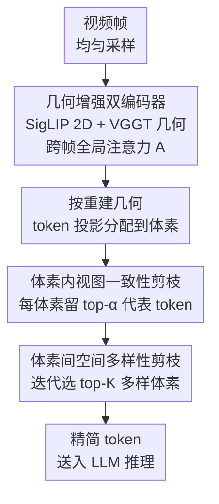

# Geometry-Guided 3D Visual Token Pruning for Video-Language Models

**会议**: CVPR 2026  
**arXiv**: [2604.18260](https://arxiv.org/abs/2604.18260)  
**代码**: https://github.com/homothetic/Geo3DPruner (待开源)  
**领域**: 3D视觉 / 多模态VLM / LLM效率  
**关键词**: 3D场景理解, 视觉token剪枝, 几何引导, 多视角一致性, VideoLM

## 一句话总结
把 3D 场景当成"多视角的空间视频"喂给 VideoLM 时会产生上千个冗余 visual token，本文提出 Geo3DPruner，用 VGGT 几何编码器的跨帧全局注意力，分体素内（去多视角重复）和体素间（保空间多样性）两阶段剪枝，剪掉 90% token 还能保住约 92% 的原始性能，显著超过 FastV、VisPruner 等通用剪枝方法。

## 研究背景与动机

**领域现状**：让多模态大模型（MLLM）理解 3D 场景是迈向空间智能的关键，但点云/网格这类原生 3D 数据稀缺。近期一批工作（Video-3D LLM、VG LLM 等）改用"3D 空间视频"表示——把场景拍成一串带相机位姿和深度的图像帧，这样就能直接复用在海量图文上预训练好的 VideoLM 的 2D 视觉知识来做 3D 推理。

**现有痛点**：这种视频化表示的代价是 token 爆炸。16 帧就有 3136 个 visual token，32 帧翻倍到 6272 个，要想采更多帧/更高分辨率来覆盖完整场景，推理开销飙升。现有训练无关的剪枝方法分两类——文本引导（FastV 等，看 token 和问题文本的 cross-attention）和视觉引导（VisPruner 等，看 [CLS] 注意力或自注意力的视觉显著性）——但它们都只在单帧或时间相邻帧内操作。

**核心矛盾**：3D 空间视频本质是同一个完整 3D 场景的多视角投影，同一个物体（一张木桌、一把转椅）会在任意多帧里反复出现。受时间局部性约束的剪枝方法看不到这种"任意帧间"的视图一致性，因此删不掉这种全局冗余；更糟的是，它们只盯视觉显著性/文本相关性，忽略了保留 token 的空间多样性——在物体密集的 3D 场景里，剪枝容易把 token 全集中在同一个显著物体上，丢掉其他区域，对 3D dense captioning、3D grounding 这类 object-centric 任务是致命的。

**本文目标**：在 VideoLM 的 3D 场景理解里做一个训练无关的剪枝器，既要跨帧消除多视角重复，又要保住整个场景的空间完整性。

**切入角度**：既然问题根源是缺乏全局 3D 几何建模，那就引入一个 3D 几何编码器（VGGT），用它跨帧全局注意力天然刻画的几何对应关系来指导剪枝——同一空间位置的多视角特征可以聚合去重，不同空间位置的体素要尽量铺开覆盖。

**核心 idea**：用 3D 几何编码器的跨帧全局注意力，把视觉特征对齐到体素，再做"体素内去视图冗余 + 体素间保空间多样性"的两阶段剪枝。

## 方法详解

### 整体框架

Geo3DPruner 以 Video-3D LLM（基于 LLaVA-Video 7B，2D 编码器 SigLIP + LLM Qwen2-7B）为底座，但把它原本手工设计的 3D 位置编码换成 VGGT 提取的几何特征（沿用 VG LLM 的做法）。输入是均匀采样的视频帧，输出是剪枝后喂给 LLM 的一小撮 visual token。中间走两条并行编码 + 两阶段剪枝：2D 视觉编码器抽图像特征 $\mathbf{E}_s$，3D 几何编码器（VGGT）抽几何特征 $\mathbf{G}_s$ 并通过全局注意力建模跨帧长程依赖；两者相加得到几何增强特征 $\mathbf{F}_s = \mathbf{E}_s + \mathbf{G}_s$。随后依据重建出的 3D 几何把每个 token 投影分配到体素，再先做体素内的视图一致性剪枝（VCP）选代表性 token，后做体素间的空间多样性剪枝（SDP）选铺得开的体素子集，最终在严格 token 预算下保住 3D 结构完整性。整个剪枝过程训练无关、推理时即插即用，VGGT 参数全程冻结。

### 关键设计

**1. 几何增强双编码器与跨帧全局注意力：给剪枝装上"3D 全局视野"**

通用剪枝方法之所以删不掉多视角冗余，是因为它们只有 2D 视觉特征、没有跨帧的几何对应信息。本文在原 2D 分支（SigLIP）之外并行加一条 3D 几何编码器分支（VGGT-1B，冻结），它在 forward 时用全局注意力层建模所有帧间 patch 的长程依赖，联合预测相机参数 $\mathbf{C}_s \in \mathbb{R}^9$（可解出外参 $\mathbf{R}_s, \mathbf{T}_s$ 和内参 $\mathbf{Y}_s$）和深度图 $\mathbf{D}_s$，并产出一张全局注意力图 $\mathbf{A} \in \mathbb{R}^{N \times N}$，其中 $N = S \times H_p \times W_p$ 是所有帧所有 patch 的总数。几何特征以 $\mathbf{F}_s = \mathbf{E}_s + \mathbf{G}_s$ 的形式注入视觉特征。这张 $\mathbf{A}$ 是后续两阶段剪枝唯一的"裁判"——它天然编码了"哪些跨帧 patch 在几何上对应同一结构"，让剪枝第一次有了真正的跨任意帧全局相关性，而不再被时间局部性困住。消融里把它换成简单的几何特征余弦相似度（Sim.），平均性能从 94.0% 掉到 89.9%，说明注意力的自适应性（动态强调几何一致区、抑制噪声相关）确实强于静态相似度

**2. 体素内视图一致性剪枝 VCP：同一空间位置只留最有代表性的那几个观测**

第一阶段要解决的痛点是"同一 3D 位置在多帧里反复出现"。借助 VGGT 给出的相机内外参，每个像素 token $(u_s, v_s)$ 经逆相机投影算出世界坐标，再按预设体素尺寸 $\delta=0.1\text{m}$ 落进某个体素。设体素 $k$ 内 token 索引集为 $\mathcal{T}_k$（$|\mathcal{T}_k|=N_k$），从全局注意力图里抠出体素内子矩阵 $\mathbf{A}_k = \mathbf{A}[\mathcal{T}_k, \mathcal{T}_k]$，token $i$ 的贡献分定义为它收到的平均注意力：

$$a_i = \frac{1}{N_k} \sum_{j \in \mathcal{T}_k} \mathbf{A}_k[j, i]$$

$a_i$ 衡量 token $i$ 相对于投影进同一体素的其他多视角特征有多"被需要"。VCP 每个体素只保留贡献分 top-$\alpha$（$\alpha=50\%$）的 token，把对同一 3D 位置的冗余观测压掉，留下几何上最一致、信息量最高的代表。只用 VCP 时性能 89.4%——它能保证空间位置铺得广，但每体素特征过稀，所以还需要第二阶段配合

**3. 体素间空间多样性剪枝 SDP：迭代选体素，逼着 token 铺满整个场景**

第二阶段的痛点是 object-centric 场景里实例多，一次性按全局重要度剪体素会产生强烈的"intra-object bias"——同一物体的多个体素互相强注意、被一起保留，token 全堆在那个显著物体上，其他区域被剪光，预算越紧性能崩得越快。SDP 把体素级剪枝建模成一个子集选择问题：给定体素 $k,l$，跨体素注意力子矩阵 $\mathbf{A}_{k \to l} = \mathbf{A}[\mathcal{T}_k, \mathcal{T}_l]$，先行内求和再列上平均得 $a_{k \to l} = \frac{1}{|\mathcal{T}_k|} \sum_j \sum_i \mathbf{A}_{k \to l}(j,i)$，体素 $l$ 收到的全局注意力为 $a_l = \sum_k a_{k \to l}$。关键不是一次性按 $a_l$ 取 top，而是迭代启发式：每轮在剩余候选 $\mathcal{V} \setminus \mathcal{W}$ 上选 top-$K$（$K=8$）个最显著体素加入已选集 $\mathcal{W}$，然后**只在未选体素间重算注意力**，直到选中体素的 token 总数达到预算。重算这一步至关重要——它每轮都把已选物体的"自我强化注意力"剔出局，逼着下一轮去看别的实例，从而把 token 分散到不同物体和区域。消融显示 SDP 换成随机选体素（Rand.）或均匀采样（Unif.）平均性能只有 85.2%/85.4%，而 SDP 达 94.0%，证明 diversity-aware 的迭代选择远胜朴素子集选择

### 损失函数 / 训练策略
方法本身训练无关：VGGT 全程冻结，Video-3D LLM 的训练设置（优化器、学习率、训练 schedule）完全沿用其官方开源配置，剪枝只在推理时插入。帧统一 resize + center crop 到 $384 \times 384$，体素尺寸 $\delta = 0.1\text{m}$，VCP 保留比例 $\alpha = 50\%$，SDP 每轮选 $K=8$ 个体素。

## 实验关键数据

数据集均源自 ScanNet（1513 个室内场景），覆盖三类任务：3D 视觉定位（ScanRefer Acc@0.25/0.5、Multi3DRefer F1@0.25/0.5）、3D 密集描述（Scan2Cap BLEU-4/CIDEr@0.5）、3D 问答（ScanQA CIDEr/EM、SQA3D EM）。Avg. 是五个 benchmark、九个指标上"保留的性能百分比"的平均。

### 主实验（16 帧，3136 token，逐档加大剪枝比例）

| 剪枝设置 | 方法 | ScanRefer Acc@0.5 | Scan2Cap CIDEr@0.5 | SQA3D EM | Avg. |
|---------|------|------|------|------|------|
| 不剪 (3136) | Video-3D LLM† | 52.3 | 85.3 | 59.3 | 100% |
| 留 1280 (↓60%) | FastV | 49.6 | 73.1 | 57.6 | 94.5% |
| 留 1280 (↓60%) | VisPruner | 49.7 | 73.9 | 58.9 | 95.7% |
| 留 1280 (↓60%) | **Geo3DPruner** | **52.0** | **85.1** | **59.3** | **98.9%** |
| 留 640 (↓80%) | VisPruner | 48.3 | 66.6 | 56.7 | 91.6% |
| 留 640 (↓80%) | **Geo3DPruner** | **51.1** | **82.9** | **58.1** | **96.1%** |
| 留 320 (↓90%) | FastV | 45.8 | 53.0 | 53.5 | 81.0% |
| 留 320 (↓90%) | VisPruner | 46.8 | 57.3 | 54.6 | 84.9% |
| 留 320 (↓90%) | **Geo3DPruner** | **49.4** | **80.3** | **55.7** | **92.1%** |

32 帧（6272 token）下结论一致：留 640 token（↓90%）时 Geo3DPruner 保 92.0%，FastV/VisPruner 只有 82.4%/84.8%。差距在 Scan2Cap 这种 object-centric 任务上尤其大（90% 剪枝下 80.3 vs VisPruner 57.3），印证空间多样性对场景完整性的重要。

### 消融实验（均为 16 帧、90% 剪枝比例）

| 配置 | ScanRefer | Scan2Cap | SQA3D | Avg. | 说明 |
|------|------|------|------|------|------|
| 只用 VCP | 52.5 | 76.7 | 52.7 | 89.4% | 位置铺得广但体素内特征过稀 |
| 只用 SDP | 53.3 | 77.7 | 54.6 | 91.3% | 不先去体素内冗余→过度剪体素，掉 8.7% |
| VCP + SDP | 55.2 | 80.3 | 55.7 | 94.0% | 两者互补，最优 |
| SDP→随机选体素 | 53.0 | 61.4 | 55.4 | 85.2% | 朴素子集选择 |
| SDP→均匀采样 | 53.2 | 62.0 | 55.0 | 85.4% | 朴素子集选择 |
| 相关性用余弦相似度 | 52.9 | 76.4 | 53.3 | 89.9% | 替换全局注意力 |

> ⚠️ 表 3 中"只用 VCP"的 ScanRefer 列为 52.5、表 1 的 90% 档为 49.4，二者非同一指标口径（消融正文以 Acc@0.5 报告），引用时以原文表格为准。

### 关键发现
- **两阶段缺一不可且互补**：单 VCP（89.4%）保位置但体素内太稀，单 SDP（91.3%）会过度剪体素丢覆盖，合起来才到 94.0%——先在体素内去重、再在体素间保多样是正确的先后顺序。
- **迭代重算注意力是 SDP 的灵魂**：换成随机/均匀选体素直接掉到约 85%，说明性能不是来自"体素这个粒度"，而是来自每轮重算注意力以抑制 intra-object bias 的多样性选择。
- **注意力 > 相似度**：用 VGGT 跨帧注意力图比用几何特征余弦相似度高 4.1%（94.0% vs 89.9%），注意力能动态强调几何一致区、抑制噪声相关。
- **轻度剪枝甚至超过原模型**：32 帧只剪 20% token 时性能略超未剪基线，说明确实剪掉的是冗余/噪声 token，得到了更紧凑的场景表示。

## 亮点与洞察
- **把"剪枝"重定义成"3D 几何子集选择"**：跳出"看显著性删 token"的 2D 思路，先重建几何把 token 锚到体素，再分两个正交目标（视图去重 + 空间铺开）剪，这个问题分解很干净，可迁移到任何带位姿/深度的多视角任务。
- **复用现成几何编码器的注意力图当"免费裁判"**：VGGT 本来就要算跨帧全局注意力来重建几何，本文直接拿这张 $\mathbf{A}$ 当 token 重要度依据，零额外训练、零额外注意力计算，这种"白嫖中间产物"的思路很巧。
- **迭代 + 重算抑制 intra-object bias**：用"选一批就重算剩余候选注意力"来强制多样性，比一次性 top-K 优雅，本质是一种贪心去相关，在任何"显著性会扎堆"的选择问题里都能借鉴。
- **训练无关、即插即用**：底座模型一行不改、VGGT 冻结，只在推理时插剪枝，落地成本极低。

## 局限与展望
- **强依赖几何编码器质量**：整套方法建立在 VGGT 重建出的相机参数/深度和注意力图之上，几何估计差的场景（弱纹理、大范围室外、动态物体）下体素分配和注意力可能失真，论文只在 ScanNet 室内静态场景验证。
- **多了一条 VGGT-1B 编码分支**：虽然剪了 LLM 侧的 token，但前面要跑一个 10 亿参数的几何编码器，论文未报告这条分支的实际开销与端到端净加速比，"效率"主要体现在 LLM 输入 token 数上。
- **超参偏经验**：体素尺寸 $\delta=0.1\text{m}$、$\alpha=50\%$、$K=8$ 都是固定值，未见对体素尺寸/$\alpha$ 的敏感性分析，不同场景尺度下是否需要自适应未知。
- **改进思路**：可探索深度/几何置信度加权的自适应体素尺寸，或把两阶段剪枝与 LLM 层间逐步剪枝结合，进一步压上下文。

## 相关工作与启发
- **vs FastV / 文本引导剪枝**：FastV 在第 2 层后按 token 对末尾文本 token 的注意力删 token，只看单帧内文本相关性；本文用跨帧几何注意力，能删任意帧间的多视角冗余，90% 剪枝下平均性能高出约 11 个百分点（92.1% vs 81.0%）。
- **vs VisPruner / 视觉引导剪枝**：VisPruner 按视觉注意力选重要 token 再按 token 相似度去冗余，仍是逐帧的视觉显著性，缺全局 3D 建模，在 object-centric 任务（Scan2Cap）上 token 易扎堆同一物体；本文用 SDP 显式保空间多样性，Scan2Cap 上优势最大。
- **vs Video-3D LLM / VG LLM（底座）**：Video-3D LLM 把 3D 位置编码注入视频特征，VG LLM 引入几何编码器注入空间先验；本文站在 VG LLM 的几何特征之上，第一次把几何编码器的注意力图用于 token 剪枝而非仅做位置增强。
- **vs PruneVid 等 VideoLM 剪枝**：PruneVid 按问题相关性合并时空 token，针对通用视频；本文专攻 3D 场景理解的多视角一致性，是首批为该任务设计剪枝的工作之一。

## 评分
- 新颖性: ⭐⭐⭐⭐ 首次用几何编码器的跨帧注意力做 3D VideoLM token 剪枝，"体素内去重 + 体素间保多样"的分解干净且有针对性。
- 实验充分度: ⭐⭐⭐⭐ 五 benchmark、两种帧长、三档剪枝比例 + 四组消融覆盖全面；但缺端到端净加速（含 VGGT 开销）和体素尺寸敏感性分析。
- 写作质量: ⭐⭐⭐⭐ 动机—痛点—方法逻辑清晰，公式与图示到位，两阶段分工讲得明白。
- 价值: ⭐⭐⭐⭐ 训练无关、即插即用，给 3D VideoLM 的长上下文/推理效率提供了实用且可迁移的剪枝范式。

<!-- RELATED:START -->

## 相关论文

- [\[CVPR 2026\] MonoVLM: Monocular 3D Visual Grounding with Vision Language Models](monovlm_monocular_3d_visual_grounding_with_vision_language_models.md)
- [\[CVPR 2026\] Fast SceneScript: Fast and Accurate Language-Based 3D Scene Understanding via Multi-Token Prediction](fast_scenescript_fast_and_accurate_language-based_3d_scene_understanding_via_mul.md)
- [\[CVPR 2026\] Aligning Text, Images and 3D Structure Token-by-Token](aligning_text_images_and_3d_structure_token-by-token.md)
- [\[CVPR 2026\] MoRE: 3D Visual Geometry Reconstruction Meets Mixture-of-Experts](more_3d_visual_geometry_reconstruction_meets_mixture-of-experts.md)
- [\[CVPR 2026\] Unlocking the Power of Critical Factors for 3D Visual Geometry Estimation](unlocking_the_power_of_critical_factors_for_3d_visual_geometry_estimation.md)

<!-- RELATED:END -->
