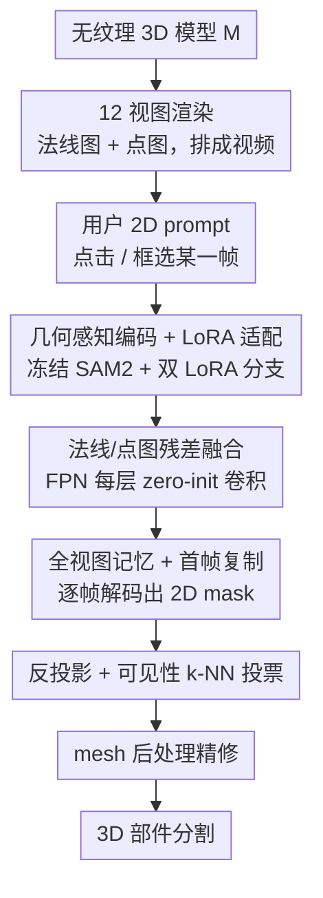

# GeoSAM2: Unleashing the Power of SAM2 for 3D Part Segmentation

**会议**: CVPR 2026  
**论文**: [CVF Open Access](https://openaccess.thecvf.com/content/CVPR2026/html/Deng_GeoSAM2_Unleashing_the_Power_of_SAM2_for_3D_Part_Segmentation_CVPR_2026_paper.html)  
**代码**: 待确认  
**领域**: 3D视觉  
**关键词**: 3D部件分割, SAM2, 多视图分割, LoRA, 交互式prompt  

## 一句话总结
GeoSAM2 把无纹理 3D 模型的部件分割重新表述成"多视图 2D mask 预测"任务：渲染 12 个视角的法线图和点图，让用户在任意一个视角用点击/框选给出 2D prompt，由一个带 LoRA 和几何残差融合的共享 SAM2 backbone 逐帧出 mask，再反投影回 3D 并用可见性投票聚合，在 PartObjaverse-Tiny 和 PartNetE 上以约 30 秒/物体的速度刷到 class-agnostic SOTA。

## 研究背景与动机
**领域现状**：3D 部件分割是机器人操作、3D 生成、交互式编辑的基础环节。由于精细的 3D 部件标注极其昂贵稀缺，主流路线转向 zero-shot / 弱监督，核心思路是借力强大的 2D 视觉基础模型（SAM、DINOv2、GLIP 等），把多视图渲染喂给 2D 模型再把结果"抬升"回 3D。

**现有痛点**：作者把现有方法归成两类，都各有硬伤。一类是基于"全局尺度/聚类"的方法（SAMPart3D、PartField）：SAMPart3D 用一个连续的 scale 旋钮控制粒度，但这个旋钮极不直观——调 scale 经常产生没有语义依据的不可预测切分，而且需要对每个物体做 per-shape MLP 拟合，单物体要好几分钟；PartField 虽然前馈一遍很快，但只能靠固定簇数粗调粒度，且默认物体每个区域都该被标注。另一类是基于 2D mask proposal 抬升的方法（SAMesh）：把 SAM2 的多视图 mask 用社区检测/迭代优化聚合到 mesh 上，后处理同样要几分钟，而且没有任何机制做"针对某个特定部件"的查询。

**核心矛盾**：现有 pipeline 要么"快但不可控"（PartField），要么"表达力强但慢"（SAMPart3D、SAMesh）；更根本的是，没有一个方法真正把 **2D 交互**和 **3D 部件结果**对齐——用户的控制信号是全局且粗粒度的，无法表达"我就要这个部件"的精确意图。

**切入角度**：作者注意到 SAM2 本来就是为"可 prompt 的视频分割"设计的——它天然支持点/框 prompt、天然有跨帧记忆做时序一致。如果把多视图渲染按一定顺序排成一段"视频"，3D 部件分割就能直接套用 SAM2 的可交互、可追踪范式，把显式、空间可定位、可解释的 2D prompt 直接变成对齐的 3D 标签。

**核心 idea**：把无纹理 3D 模型的部件分割重写为"多视图 2D mask 预测 + 反投影聚合"，用一个几何感知改造过的共享 SAM2 backbone 处理 12 视角法线/点图视频，让 2D prompt 直接驱动 3D 部件选择。

## 方法详解

### 整体框架
给定一个无纹理 3D 模型 $M$，GeoSAM2 先从预定义相机位姿 $\{P_i\}_{i=1}^{N}$ 渲染出 $N=12$ 张法线图 $\{I_i\}$ 和对应点图 $\{\Pi_i\}$，并按方位角逆时针排列成一段 12 帧"视频"。用户在任意一帧上画 2D prompt（点击或框选），这一帧作为视频的起始帧。每帧的法线图和点图分别经过**冻结的 SAM2 图像编码器（用 LoRA 微调）**编码，在 FPN 每一层做**法线/点图残差融合**，再由 mask decoder 解出该视角的 2D mask。为保证跨视图一致，所有视角的 embedding 都保留在一个**全视图记忆库**里（并用首帧复制做 bootstrap）。最后把逐帧 2D mask 用相机位姿反投影到 3D 点云，做**可见性感知的 k-NN 投票**赋予一致标签，对 mesh 形态的模型再做小连通块剔除 + 标签平滑的后处理精修。

### 关键设计

**1. 几何感知编码 + LoRA 适配：让 RGB 上预训练的 SAM2 读懂无纹理几何**

SAM2 在 RGB 域训练，强烈依赖外观纹理线索，而法线图这类无纹理渲染根本没有这些线索；同时稀疏多视图之间视角跳变大、遮挡复杂，比稠密视频帧更难建立跨视图对应。作者的做法是把几何结构直接注入模型：除了法线图，还为每个视角配一张点图 $\Pi_i$——把深度图按相机参数反投影到世界坐标，每个像素 $(u,v)$ 拿到一个 3D 坐标 $x_i(u,v)=D_i(u,v)\cdot K^{-1}[u,v,1]^T R_i^{-1}-R_i^{-1}t_i$，这张点图编码了视图一致的空间结构，帮助消歧和跨视图对应推理。为避免全量微调 SAM2 既贵又破坏预训练先验，作者用 LoRA 只更新一个低秩子空间：对任意线性层权重 $W_0\in\mathbb{R}^{m\times n}$ 引入可训练矩阵 $A\in\mathbb{R}^{m\times r}$、$B\in\mathbb{R}^{r\times n}$，使适配后权重 $W=W_0+AB$（$r\ll\min(m,n)$），前向时 $Wf=W_0f+A(Bf)$，$W_0$ 始终冻结。关键是为法线图和点图各开**一条独立的 LoRA 分支**，每个 transformer block 注入一层 LoRA 就足以把 SAM2 引导到几何模态上。

**2. 法线/点图残差融合：保住 RGB 统计的同时渐进吸收几何线索**

法线图特征更接近 RGB 纹理、和 SAM2 backbone 的预训练统计更匹配；点图特征几何线索强，但如果直接融合容易引入分布漂移。作者提出一个"保守初始化、渐进自适应"的残差融合：在 FPN 每个分辨率层，把对齐的法线特征 $G_i\in\mathbb{R}^{H\times W\times C}$ 和点图特征 $P_i$ 沿通道拼接成 $X_i=[G_i\,\|\,P_i]\in\mathbb{R}^{H\times W\times 2C}$，过一个**权重零初始化**的 $3\times3$ 卷积得到 $Y_i=\mathrm{Conv}_{3\times3}(X_i;W{=}0)$，再残差加回法线特征 $\hat{G}_i=G_i+Y_i$。

$$\hat{G}_i = G_i + \mathrm{Conv}_{3\times3}\big([\,G_i\,\|\,P_i\,];\,W{=}0\big)$$

因为卷积初始权重为零，训练初期 $Y_i\equiv0$，网络完全依赖法线特征，从而不会突然改变特征分布，梯度再逐步塑造点图分支的贡献。这个融合在 FPN 每一层独立施加。消融显示，把它换成 kernel size=1 的朴素卷积注入（即 w/o feature fusion）会在细节上明显变差。

**3. 全视图记忆 + 首帧复制：把视频 FIFO 记忆改成适配多视图的引导记忆**

SAM2 原本用固定大小的 FIFO 记忆库保留近期帧，假设相邻帧冗余且过渡平滑——但多视图设定恰恰相反，每个视角携带独特且互补的几何信息，丢弃早期视角会造成不可逆的信息损失。作者把记忆机制重组为**保留全部视角**的 embedding：12 个视角在方位角上均匀分布、跨三个仰角（$25^\circ$、$0^\circ$、$-25^\circ$）排布，保证几何覆盖完整，模型可以引用之前所有视角来推理遮挡和部件边界。此外作者观察到一个有意思的现象：序列第一帧分割质量很差，因为记忆库初始为空、只能靠稀疏 prompt，而记忆一旦被填充质量就显著提升——说明记忆库不只是时序一致机制，还充当了一种隐式引导（guidance）。据此作者提出极简的 **bootstrap**：在正式处理前把第一帧复制一份，立刻给模型一个有意义的记忆先验，显著改善起始帧质量、让后续视角的 mask 更锐利连贯。

**4. mesh 后处理精修：把多视图 mask 干净地落到每个面上**

逐帧 2D mask 反投影到 3D 后就能拿到初始 3D mask，对 mesh 形态的模型可以进一步利用网格连通性精修。借鉴 SAMesh，作者的后处理两步：(1) 先剔除面积小于 $A_{\text{mesh}}=PA_{\text{mesh}}\cdot N_{\text{faces}}$ 的小连通块（如 $PA_{\text{mesh}}=0.01$）；(2) 再平滑 mesh 标签——按连通性迭代平滑面标签（这步耗时，可选），然后对剩余没有标签的面用 K 近邻投票，保证每个面都有标签。由于 3D 标签和 2D mask 严格对齐，这套后处理不会强迫每个面都携带标签，因此在 PartNetE 这种部分标注数据集上也能保持准确。

### 损失函数 / 训练策略
冻结 SAM2 绝大部分参数，主要训练两个 rank=4 的 LoRA 模块（加到网络所有 Q/K/V 注意力层）以及特征融合块（3 层 kernel size=3 的卷积）。为让 SAM2 预测的 mask 贴合数据集 mask 的尺度，还训练了 IoU 预测头。在自标注的约 4700 个物体数据集上微调 SAM2 base+ 版本 50 个 epoch，8 张 A800、batch size 8、学习率 5e-5，loss 沿用 SAM2 原始 loss；为稳定训练，特征融合块卷积层零初始化。

## 实验关键数据

### 主实验
class-agnostic 部件分割，指标为 mean IoU（%）。GeoSAM2 在两个 benchmark 上均显著领先，且速度远快于慢速优化类方法。

| 数据集 | 指标 | GeoSAM2 | 之前最好 | 提升 |
|--------|------|---------|----------|------|
| PartObjaverse-Tiny | Avg. mIoU | 84.06 | 79.18 (PartField) | +4.88 |
| PartNetE | Avg. mIoU | 74.42 | 59.10 (PartField) | +15.32 |

运行时间对比（PartNetE）：

| 方法 | Avg. mIoU | 运行时间 |
|------|-----------|----------|
| Find3D | 21.69 | ~10s |
| SAMesh | 26.66 | ~7min |
| SAMPart3D | 56.17 | ~15min |
| PartField | 59.10 | ~10s |
| GeoSAM2 (Ours) | **74.42** | ~30s |

### 消融实验
逐步加回各组件（mean IoU，%）：

| 配置 | PartObjaverse-Tiny | PartNetE | 说明 |
|------|--------------------|----------|------|
| Vanilla SAM2 | 62.59 | 66.55 | 直接拿 SAM2 跑多视图法线图，追踪能力不足 |
| w/o point map | 75.56 | 71.26 | 只对法线图做 LoRA 微调，补上了 RGB→几何域差 |
| w/o feature fusion | 81.39 | 72.25 | 加点图但用 kernel=1 卷积朴素注入，缺细节 |
| Full (Ours) | **84.06** | **74.42** | 完整残差融合 |

### 关键发现
- **从 Vanilla SAM2 到 Full 的逐级提升说明三件事都不可少**：LoRA 微调（+13 在 PartObjaverse-Tiny）补的是 RGB 与法线分布之间的域差；点图补的是空间歧义/追踪；残差融合补的是细节质量。
- **mesh 连通性先验是把双刃剑**：SAMesh 和 PartField 从 PartObjaverse-Tiny 到 PartNetE 出现 20%–30% 的 mIoU 崩塌，直接暴露它们对 mesh 连通性先验的依赖；GeoSAM2 在被剥夺 mesh 先验时也会掉一些，但仍大幅领先所有 baseline。
- **首帧复制的价值**：记忆库为空时第一帧质量很差，复制首帧提供记忆先验后起始帧和后续帧 mask 都更锐利（论文图 6 定性验证）。
- **可泛化到生成模型**：作者把方法扩展到 TripoSG 等生成的 3D 模型上做层级分割，即使几何边界模糊也能保持清晰的部件感知；还能和 HoloPart 等 3D 部件补全模型组合，实现 zero-shot 3D 部件 amodal 分割。

## 亮点与洞察
- **"把多视图当视频"这个范式转换很巧**：它不是又训一个 3D 网络，而是直接复用 SAM2 现成的可 prompt + 记忆追踪能力，把"显式、空间可定位、可解释"的 2D 交互 1:1 对齐成 3D 标签——相比 scale 旋钮这种全局粗控，用户能精确指定"就要这个部件"。
- **零初始化残差融合是一个可复用 trick**：当要把一个新模态（点图）接进一个已经训好的 backbone 时，用零初始化卷积让新分支从"完全不起作用"开始渐进生效，避免分布漂移破坏预训练统计——这个思路可迁移到任何"给冻结基础模型加新输入模态"的场景。
- **"记忆即引导"的观察**：发现 SAM2 的记忆库不只做时序一致、还充当隐式引导，并用"复制首帧"这种极低成本的方式把它利用起来，是典型的"先看现象、再用最简手段吃掉红利"。

## 局限与展望
- **依赖渲染视角覆盖**：固定 12 视角（3 仰角×方位角）对大多数物体够用，但对深内腔、强自遮挡结构是否仍完整覆盖，论文未充分讨论 ⚠️ 以原文为准。
- **prompt 仍需人工**：虽然 2D prompt 比 scale 旋钮直观，但精细分割仍需用户在视角上逐部件点选；评测时用的是前视图 GT mask 当 prompt 来模拟"精确用户输入"，真实交互成本和鲁棒性如何还需更多验证。
- **被剥夺 mesh 连通性先验时会掉点**：在纯点云的 PartNetE 上虽仍 SOTA，但相比有 mesh 先验的 PartObjaverse-Tiny 仍有下降，说明后处理对 mesh 结构有一定依赖。
- **改进方向**：自动 prompt 生成（用别的模型先提议候选部件再交给 SAM2）、自适应视角选择、以及把点图融合从 FPN 残差扩展到 decoder 端，都是自然的延伸。

## 相关工作与启发
- **vs SAMPart3D**：它用 3D 预训练把多视图 DINOv2 特征蒸馏进 3D 编码器，但仍需 per-shape 微调（分钟级）且只能用 scale 旋钮全局控粒度；GeoSAM2 不做 per-shape 优化、用 2D prompt 局部精确控制，且推理仅 ~30s。
- **vs PartField**：它直接在点云上用 triplane 预测特征场再聚类，前馈很快但只能靠固定簇数粗调，且假设每个区域都该标注；GeoSAM2 同样快但可做像素级精确控制，且不强迫每个面携带标签。
- **vs SAMesh**：两者都把 SAM2 多视图 mask 抬升到 3D，但 SAMesh 靠社区检测/迭代优化（几分钟）且无法做部件特定查询、倾向过度细分；GeoSAM2 用记忆追踪+反投影投票，可交互、更快、更可控。
- **vs Find3D**：它是文本输入的前馈对齐方法，开放世界语义下精度明显偏低（Avg. 21.28）；GeoSAM2 走 class-agnostic 交互路线，精度高得多。

## 评分
- 新颖性: ⭐⭐⭐⭐⭐ 把 3D 部件分割重述为可 prompt 的多视图 SAM2 视频分割，范式干净且打通了 2D 交互↔3D 结果的对齐
- 实验充分度: ⭐⭐⭐⭐ 两个 benchmark + 速度对比 + 逐级消融 + 生成模型泛化，但 prompt 鲁棒性/交互成本的评测偏理想化
- 写作质量: ⭐⭐⭐⭐ 动机与方法链条清晰，公式给得到位；个别记号和后处理细节需查补充材料
- 价值: ⭐⭐⭐⭐⭐ 又快又可控又准，能直接与生成/补全模型组合，对 3D 编辑和生成管线实用价值高

<!-- RELATED:START -->

## 相关论文

- [\[CVPR 2026\] Unleashing the Power of Chain-of-Prediction for Monocular 3D Object Detection](unleashing_the_power_of_chain-of-prediction_for_monocular_3d_object_detection.md)
- [\[CVPR 2026\] MSGNav: Unleashing the Power of Multi-modal 3D Scene Graph for Zero-Shot Embodied Navigation](msgnav_unleashing_the_power_of_multi-modal_3d_scene_graph_for_zero-shot_embodied.md)
- [\[AAAI 2026\] 3DTeethSAM: Taming SAM2 for 3D Teeth Segmentation](../../AAAI2026/3d_vision/3dteethsam_taming_sam2_for_3d_teeth_segmentation.md)
- [\[CVPR 2026\] S2AM3D: Scale-controllable Part Segmentation of 3D Point Clouds](s2am3d_scale-controllable_part_segmentation_of_3d_point_cloud.md)
- [\[CVPR 2026\] Part$^{2}$GS: Part-aware Modeling of Articulated Objects using 3D Gaussian Splatting](part2gs_part-aware_modeling_of_articulated_objects_using_3d_gaussian_splatting.md)

<!-- RELATED:END -->
