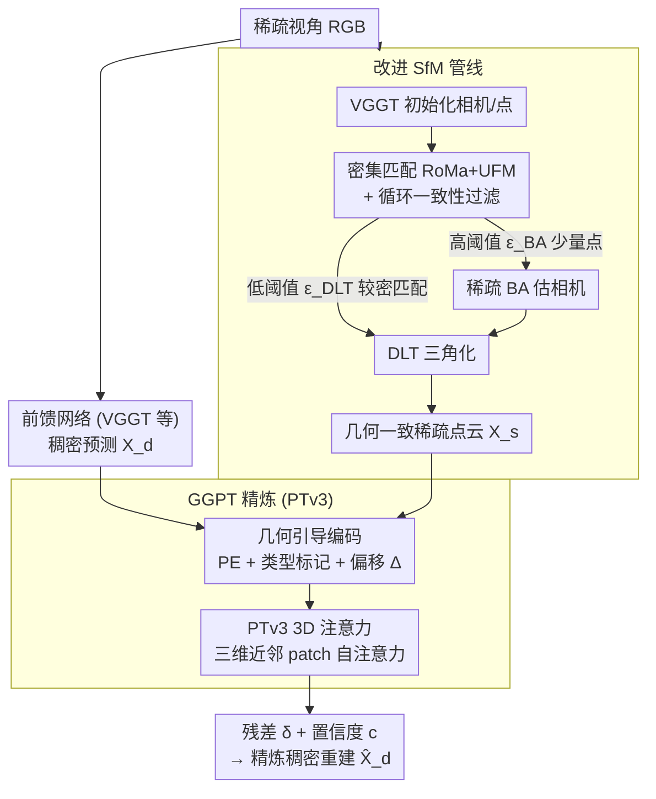

# GGPT: Geometry-Grounded Point Transformer

**会议**: CVPR 2026  
**arXiv**: [2603.11174](https://arxiv.org/abs/2603.11174)  
**代码**: [有](https://chenyutongthu.github.io/research/ggpt)  
**领域**: 3D视觉 / 3D重建  
**关键词**: sparse-view 3D重建, Point Transformer, SfM, feed-forward, multi-view geometry  

## 一句话总结

提出GGPT框架：通过改进的轻量SfM管线(密集匹配+稀疏BA+DLT三角化)获取几何一致稀疏点云，再用3D Point Transformer V3在三维空间直接融合稀疏几何引导与前馈稠密预测进行residual refinement，仅在ScanNet++上训练即可跨架构、跨数据集显著提升多种前馈3D重建模型。

## 研究背景与动机

**领域现状**：前馈3D重建网络(DUSt3R→MASt3R→VGGT)可一次前传预测稠密点图和相机参数，速度快且视觉效果好，但缺乏显式多视约束导致几何不一致，尤其在分布外场景(医学/手术/人体)中偏差严重。

**现有痛点**：(1) SfM几何一致但在宽基线/稀疏视角下脆弱且只恢复稀疏点；(2) 此前融合几何引导的方法依赖伪GT的SfM点或密集视频序列，真实稀疏场景中不可用；(3) 已有refinement方法在2D图像空间(深度补全/图像Transformer)操作，无法实现真正的跨视一致性。

**核心矛盾**：前馈预测稠密但不一致，SfM一致但稀疏——现有方法要么依赖不切实际的GT引导，要么在2D空间refinement无法保证3D一致性。

**本文目标** 在3D空间中将SfM的几何精度与前馈网络的稠密完整性有机结合，实现无需微调就能跨架构泛化的稀疏视角3D重建refinement。

**切入角度**：两阶段——先用改进SfM从输入RGB获取真实稀疏几何，再用3D Point Transformer在点云空间直接做注意力和残差修正。

**核心 idea**：在3D空间而非2D图像空间做几何融合refinement是跨域泛化的关键。

## 方法详解

### 整体框架

GGPT 想弥合的是一对矛盾：前馈网络（DUSt3R→MASt3R→VGGT）一次前传就能给出稠密点图、但缺多视约束所以几何不一致；传统 SfM 几何一致、却只在稀疏视角下脆弱地恢复少量点。它的解法是两阶段流水线。第一阶段是改进的轻量 SfM：先用前馈模型初始化相机和点，经密集匹配器（RoMa+UFM）拿到全局对应、做循环一致性过滤，再按两级阈值分别用高置信少量点做稀疏 BA（仅 2048 点/视图）估相机、用较低阈值的更密匹配做 DLT 三角化得到几何一致的稀疏点云 $\mathbf{X}_s$。第二阶段才是 GGPT：先把前馈稠密预测 $\mathbf{X}_d$ 与对应稀疏引导点之间的偏移做几何引导编码，再用 Point Transformer V3（53M 参数）在全局 3D 坐标系里联合处理稠密预测 $\mathbf{X}_d$ 和稀疏引导 $\mathbf{X}_s$，预测残差位移 $\boldsymbol{\delta}$ 和置信度 $c$，输出精炼后的稠密重建 $\hat{\mathbf{X}}_d$。

### 关键设计

**1. 改进 SfM 管线：从稀疏视角 RGB 拿到几何一致的真实稀疏点云**

稀疏视角下传统 SfM 脆弱、而此前融合几何引导的方法又依赖伪 GT 的 SfM 点或密集视频序列，真实稀疏场景里不可用。GGPT 用前馈模型（VGGT）初始化相机和点，经密集特征匹配（RoMa+UFM）得到全对应张量 $\mathbf{T} \in \mathbb{R}^{N \times N \times W \times H \times 2}$、循环一致性过滤（Eq.3），再按两级置信度阈值 $\epsilon_{BA} > \epsilon_{DLT}$ 切出 BA 和 DLT 各自的匹配子集。关键巧思是把非线性优化和线性三角化分离：稀疏 BA 只拿极少量高置信点就能精确估相机，DLT 三角化则用较低阈值的更密匹配高效线性重建出大量 3D 点，两者各取所长。

**2. 几何引导编码：把"稠密预测和几何先验差多少"直接喂给网络**

光把稀疏点云丢进网络还不够，得让它知道该往哪修。稠密点 $\mathbf{x}_d$ 的嵌入因此包含四样东西：自身位置编码 $\text{PE}(\mathbf{x}_d)$、类型标记 $\mathbf{e}_{type(d)}$、对应稀疏引导点的位置编码 $\text{PE}(\mathbf{x}_{d \to s})$，以及偏移量 $\Delta_{d \to s} = \mathbf{x}_{d \to s} - \mathbf{x}_s$。其中 $\Delta_{d \to s}$ 直接编码了"这个点需要修正多少"的信号，让网络显式感知稠密预测与几何先验之间的差异——消融里它是最关键的组件。

**3. 3D 空间直接注意力 PTv3：在三维近邻而非像素上做注意力，天然保证跨视一致**

此前的 refinement 都在 2D 图像空间（深度补全/图像 Transformer）操作，view-dependent、做不到真正的跨视一致。GGPT 改用 Point Transformer V3（8 层、53M 参数，远小于 2D ViT 的 ~300M）在 3D 近邻上做 patch-wise 自注意力，感受野由空间邻近性而非像素坐标定义，因此天然保证多视一致。为应对大场景，它把场景切成重叠立方体块（半径 = 0.2×场景半径），每块至多 40 万点独立处理、重叠区取平均。

### 损失函数 / 训练策略

- **置信度加权回归**：$\mathcal{L}_{conf} = \sum c \|\hat{\mathbf{x}} - \mathbf{x}_{GT}\| - \alpha \log c$，异方差形式让模型在不确定区域自动降低权重
- **恒等一致性**：$\mathcal{L}_{id} = \sum \|\hat{\mathbf{x}} - \mathbf{x}_{d \to s}\|$，鼓励有对应的稠密点向几何引导对齐
- 总损失 $\mathcal{L} = \mathcal{L}_{conf} + \lambda_{id} \mathcal{L}_{id}$，$\lambda_{id}=1, \alpha=0.2$
- 训练：ScanNet++ 上 20k 序列，8×GH200 训练一天

## 实验关键数据

### 主实验 (AUC@5/10 cm ↑, 8视角)

| 方法 | ScanNet++ | ETH3D | T&T |
|---|---|---|---|
| VGGT | 19/32 | 23/36 | 25/39 |
| VGGT + Ours | **45/60** | **47/61** | **42/57** |
| Pi3 | 56/71 | 25/41 | 26/42 |
| Pi3 + Ours | **56/72** | **36/53** | **32/50** |
| MapAnything | 38/57 | 7/15 | 9/20 |
| MapAnything + Ours | **48/64** | **33/45** | **40/55** |

### 消融实验

| 消融项 | ScanNet++ 4v | ETH3D 4v | 备注 |
|---|---|---|---|
| 完整GGPT | 38/53 | 41/55 | Baseline |
| 去掉 $\mathbf{X}_s$ 引导 | 可学但域外崩溃 | 大幅下降 | 引导不可或缺 |
| 去掉对应编码 $\Delta_{d \to s}$ | 下降显著 | 下降显著 | 最关键组件 |
| 2D Transformer替代PTv3 | 域内差距小 | 域外差距大 | 3D空间注意力泛化优势 |
| Patch r=0.1 vs 0.2 vs 0.5 | r=0.2最优 | — | 小patch增强泛化 |

### 关键发现

- **域外泛化极强**：仅在ScanNet++训练，提升5种方法在5个数据集上的表现，无需任何微调
- **VGGT改进最大**：AUC@5从19→45(+137%)在ScanNet++，从23→47(+104%)在ETH3D
- **域外数据惊艳**：4D-DRESS上VGGT AUC@1/5cm 10/45→+Ours 66/77；MV-dVRK 8/33→45/61
- **3D vs 2D refinement**：PTv3在跨域数据上显著优于2D Transformer方案，这是本质性提升
- **SfM消融**：密集匹配器 >> 稀疏匹配器(MASt3R)；DLT比RANSAC三角化快数百倍精度相当；稀疏BA 512点即够用

## 亮点与洞察

- 在3D空间而非2D图像空间做几何融合是本质性提升——跨域泛化优势巨大
- "仅训练一个配置，无需微调即可改进多种前馈方法"的通用性设计理念极有价值
- 稀疏BA+DLT的分离策略简洁高效：非线性优化只用于高置信稀疏点，三角化用线性方法
- 几何引导编码的设计巧妙：$\Delta_{d \to s}$直接编码"修正量"，给网络提供最直接的supervisory signal

## 局限与展望

- **SfM错误传播**：SfM与GGPT顺序执行，SfM如果失败(如极少纹理场景)refinement也无法挽救
- **Patch拼接伪影**：分块处理可能产生边界不连续，虽然重叠区取平均可缓解但无法完全消除
- **仅室内场景训练**：大规模室外场景和多于16视角场景未验证
- **计算开销**：需要额外运行密集匹配器和BA，总推理时间增加

## 相关工作与启发

- **vs DUSt3R/VGGT**：前馈预测快但不一致；GGPT作为通用后处理模块补齐几何一致性
- **vs COLMAP**：传统增量SfM在稀疏视角下脆弱；本文的全局SfM+密集匹配更鲁棒高效
- **vs 2D深度补全方法**：在图像空间refinement固有的view-dependent局限；3D空间注意力根本性解决跨视一致性
- **启发**：3D空间处理 > 2D图像处理的范式值得在更多任务中验证(如语义分割、物体检测的多视融合)

## 评分

⭐⭐⭐⭐⭐ (5/5)

**理由**：方法设计优雅且有充分的动机（3D空间 vs 2D空间refinement），实验极其全面（5种前馈方法×5个数据集，含域外医学/人体数据），泛化能力惊人（仅训练一个配置即可通用提升），消融实验详尽且结论清晰。改进SfM管线和3D Point Transformer的设计都有独立价值。是sparse-view 3D重建领域的高质量工作。

<!-- RELATED:START -->

## 相关论文

- [\[CVPR 2026\] OmniVGGT: Omni-Modality Driven Visual Geometry Grounded Transformer](omnivggt_omni-modality_driven_visual_geometry_grounded_transformer.md)
- [\[CVPR 2026\] Fast Spatial Tracking with Visual Geometry Transformer](fast_spatial_tracking_with_visual_geometry_transformer.md)
- [\[CVPR 2026\] MVGGT: Multimodal Visual Geometry Grounded Transformer for Multiview 3D Referring Expression Segmentation](mvggt_multimodal_visual_geometry_grounded_transformer_for_multiview_3d_referring.md)
- [\[ICLR 2026\] Quantized Visual Geometry Grounded Transformer](../../ICLR2026/3d_vision/quantized_visual_geometry_grounded_transformer.md)
- [\[CVPR 2025\] VGGT: Visual Geometry Grounded Transformer](../../CVPR2025/3d_vision/vggt_visual_geometry_grounded_transformer.md)

<!-- RELATED:END -->
