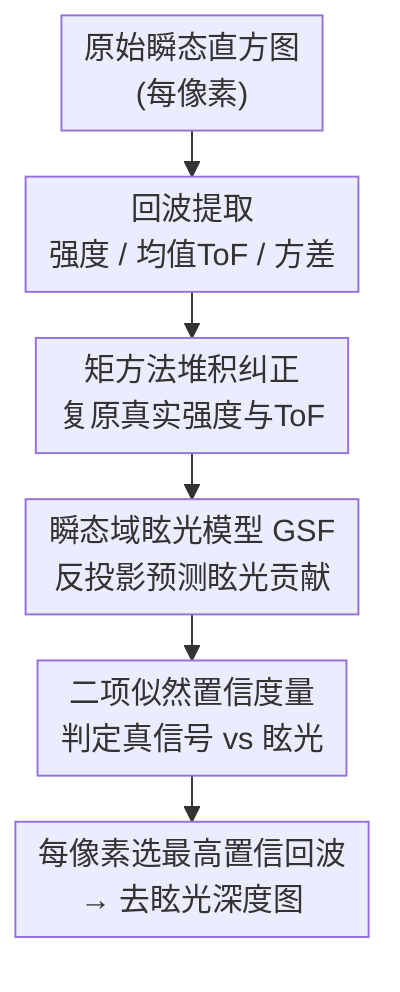

# Ghosts in the Point Clouds: De-glaring LiDAR in the Transient Domain

**会议**: CVPR 2026  
**arXiv**: [2605.24753](https://arxiv.org/abs/2605.24753)  
**代码**: 无（项目页 wisionlab.com/project/deglaring-LiDAR）  
**领域**: 3D视觉 / 自动驾驶 / 单光子LiDAR  
**关键词**: 内部多径眩光、瞬态域、眩光扩散函数(GSF)、光子堆积(pileup)、训练-free 去眩光

## 一句话总结
针对新一代固态单光子 LiDAR 因"相机化"产生的内部多径眩光（在点云里凭空冒出"幽灵"物体、又遮住真实物体），本文把眩光建模成一个**线性、与场景无关的眩光扩散函数(GSF)**，在点云形成之前、直接对每个像素的低层回波(echo)做处理：先用矩方法纠正光子堆积失真，再用 GSF 预测每个回波的眩光贡献，最后用一个二项分布置信度量判断该回波是真信号还是眩光——完全无需训练数据，可直接部署在未改装的商用传感器上。

## 研究背景与动机

**领域现状**：LiDAR 正从笨重、机械扫描的旧架构（如 Velodyne HDL-64e）快速转向紧凑、低成本的固态 SPAD（单光子雪崩二极管）阵列。后者分辨率高、像相机一样密集成像，被寄望成为"另一台、但信息更丰富的相机"。

**现有痛点**：相机化的代价是——整个阵列共享同一套光学元件。当一束很强的回波（来自反光体）进入系统时，本该聚焦到单个像素的光，会在镜头和传感器之间多次内反射、在光学组件内散射，**扩散到周围一大片像素**。结果就是"内部多径眩光"（社区也叫 blooming）：在高速公路上凭空出现一堵"幽灵墙"导致车辆急刹；而站在反光停车标志下的小孩可能被眩光淹没、彻底"消失"。路标、车牌、安全锥、反光背心这些**逆反射体**在现代基础设施里无处不在，正是最常见的眩光源。

**为什么以前没人管**：旧式扫描 LiDAR 在设计上就规避了这个问题——把探测器分组放在独立光路后面，且**任意时刻每组只点亮一个探测器**，从源头避免 blooming。代价是体积大、机械旋转、点云稀疏。也正因如此，主流数据集（用旧硬件采的）里几乎看不到眩光，导致这个失效模式"对研究界隐形"。固态 LiDAR 把这个被硬件掩盖的问题重新放了出来，而且变成**高频、严重**的常态。

**核心矛盾**：眩光破坏了 LiDAR 处理的一条根基假设——"一个像素对应一个场景点"的一一对应关系。一旦光扩散开，下游的峰值检测、去噪、点云处理全都在被污染的数据上运行。**等到点云形成后再处理就太晚了**：眩光已经和真实几何纠缠在一起，逆反射体驱动的"幽灵"甚至比真实物体看起来更"自信"。

**本文目标 / 切入角度**：把去眩光**提前到点云形成之前**，在单光子 LiDAR 的瞬态直方图/低层回波层面解决。作者的关键观察是：在瞬态测量空间里，内部眩光的物理过程可以表示成一个**线性、与场景无关的算子**作用在理想无眩光直方图上。

**核心 idea**：用一个预标定一次、对所有场景通用的眩光扩散函数(GSF)当作前向模型，在每个回波上"反问"它有多大概率来自眩光，从而在点云形成前就把眩光回波识别并抑制掉——training-free、可propagate置信度、能无缝接进现有 LiDAR DSP 管线。

## 方法详解

### 整体框架
方法整体是一条作用在**单像素低层回波**上的串行管线（论文 Fig. 2）：输入是每像素的原始瞬态直方图，输出是一张去眩光后的深度图。流程为——① 从原始直方图提取每像素若干个回波的强度、平均飞行时间(ToF)和 ToF 方差；② 对诱发眩光的最亮回波做**光子堆积纠正**（pileup 会把强回波的强度压低、把时间提前，不纠正会让眩光预测既偏低又错位）；③ 用 GSF **预测**每个回波处的眩光贡献；④ 用二项分布**置信度量**判断每个回波"超出预测眩光"的信号有多少；最后在每个像素选置信度最高的回波形成深度。整条管线作用在 echo 空间，因此能直接嵌入现有信号处理流程、部署在未改装的商用传感器上。

### 关键设计

**1. 瞬态域眩光模型与 GSF：把眩光写成一个线性、与场景无关的算子**

痛点是：眩光在点云域里和几何纠缠不清，没法用简单模型刻画。作者退回到更底层的瞬态测量空间——dToF LiDAR 的原始测量是一个三维数据立方 $y(u,v,t)$，同时分辨像素位置 $(u,v)$ 和飞行时间 $t$。眩光形成是**线性过程**（眩光强度随入射光强线性响应），于是可以用一个六维**瞬态眩光扩散函数(TGSF)** $a(u,v,t,u',v',t')$ 把测量 $y$ 写成对真实无眩光强度 $x$ 的积分：$y(u,v,t)=\iiint a(\cdot)\,x(u',v',t')\,du'dv'dt' + \eta$，其中 $\eta$ 是环境光/暗计数/afterpulse 等加性噪声。关键简化是：散射造成的时间延迟相对 LiDAR 时间分辨率非常小，可忽略，于是 TGSF 退化为**时间无关**的眩光扩散函数(GSF) $a(u,v,u',v')$，等价于被动摄影里用于去眩光的 GSF。这一步之所以有效，是因为 GSF 只取决于传感器**内部光学特性**、与场景无关——只需对每个传感器预标定一次（用同波长 940nm 红外手电在 49 个视场位置采样、再插值），就能泛化到任意反光体类型、朝向、数量、布局，这正是它相对学习方法的根本优势

**2. 矩方法光子堆积纠正：先把强回波"复原"，眩光预测才不会偏**

如果直接把 GSF 模型逐时间切片当独立图像去眩光，在实际 SPAD LiDAR 上会失败，原因是**光子堆积(pileup)**几乎总和眩光同时出现。SPAD 每检测一个光子后要有几纳秒死时间复位，在极高光通量下早到的光子会"审查"掉晚到的光子，使测得波形相对真实入射波形发生畸变——具体表现为测得强度被压低、信号被整体提前（range-walk 误差）。而诱发眩光的恰恰是反光体那种**极高通量**直接回波，所以二者强相关；眩光本身比直接回波弱好几个数量级、不受 pileup 影响。若拿被 pileup 污染的直方图去预测眩光，会得到既偏低又时间错位的眩光估计。作者的做法是只在**有限个低层回波**上纠正而非"完全还原"整条直方图：用匹配滤波找三个最高峰，对每个峰开窗估计光子到达时间的前三阶矩（光子数、均值 ToF、ToF 方差）。随着真实强度升高、pileup 加剧，光子挤进更少时间 bin → **方差变小**、信号**均值提前**；作者据此建一个 pileup 模型（需波形形状、死时间、背景计数率），离线编成查找表：测量时先由方差反查真实强度，再由强度查出 pileup 造成的均值偏移、减掉它得到纠正后的真实 ToF 与强度。它有效是因为这种基于矩+回波的纠正动态范围远高于 Coates 法（后者在 1–10 光子/脉冲就饱和），足以应付逆反射体的极端回波

**3. echo 空间眩光预测：用反投影近似，避免逐帧解线性系统**

把连续 GSF 模型离散到回波空间后，每个回波强度 $y_{uk}$（像素 $u$、第 $k$ 个回波）等于所有像素真实强度经 GSF $a(u,u')$ 加权、再乘一个**时间重叠函数** $o(\delta t)$ 之和。$o(\delta t)$ 用发射波形与拟合窗的相关来定义，刻画另一像素回波 $k'$ 在时间上有多少落进当前回波窗、从而贡献眩光（因为不同像素回波的拟合窗时间上未必完全对齐）。整体可写成线性系统 $\mathbf{y}=\mathbf{A}\mathbf{x}+\eta$。理论上能求逆得到无眩光强度 $\mathbf{x}$，但 $\mathbf{A}$ 依赖逐帧变化的 ToF $\mathbf{t}$，每帧解一个独立线性系统计算太重。作者改用**反投影近似**直接估计眩光强度：$\bar{g}_{uk}=\sum_{u'} a(u,u')\big[\sum_{k'} o(t_{u'k'}-t_{uk})\,y_{u'k'}\big]$，等价于 $\bar{\mathbf{g}}=\tilde{\mathbf{A}}^{T}\mathbf{y}$，其中 $\tilde{\mathbf{A}}$ 是把对角线置零的 $\mathbf{A}$（对角置零表示"一个回波不给自己贡献眩光"）。这一步轻量、可逐帧实时算，且用的是已测得的 $\mathbf{y}$ 而非未知 $\mathbf{x}$，把"求逆"换成"前向算一遍"，正是 efficiency 原则的落点

**4. 二项似然置信度量：判断回波里是否有"超出眩光"的真信号**

有了每个回波的预测眩光 $\bar g_{uk}$，还需要一个度量来判定该回波到底是真表面回波还是纯眩光。作者把 pileup 纠正前的回波光子检测数 $Y$ 建模成二项分布，试验次数 $N$ 为激光脉冲数，单次成功概率 $P_G=G/N$，其中 $G$ 是 $N$ 次试验中"若入射通量恰等于预测眩光通量"所期望的眩光光子数（低通量时 $G\approx g_{uk}$，高通量需经 pileup 查找表）。于是观测到 $Y$ 个光子的概率 $\mathbb{P}(Y;P_G,N)=\binom{N}{Y}P_G^{Y}(1-P_G)^{N-Y}$。直觉是：若 $Y$ 远大于 $NP_G$（实测光子数远超眩光能解释的量），这个概率会很小，说明这里**有额外真信号**。据此定义置信度：
$$C=\begin{cases}-\ln\mathbb{P}(Y;P_G,N), & Y\ge NP_G\\ 0, & Y< NP_G\end{cases}$$
当检测计数低于眩光期望时 $C=0$（判为眩光，被抑制），超出时 $C$ 随超出量单调增大。实测中每像素选 $C$ 最高的回波即可同时"去眩光"和"保真"——这正解决了其他方法"太激进、把信号连同眩光一起删掉"的问题（比如被反光背心遮住的人也能保留），因为这里是基于统计显著性而非一刀切阈值

## 实验关键数据

实验用商用 SP-LiDAR 评测套件 **ADS6311（Adaps Photonics）**：192×256 SPAD 宏像素的 dToF 阵列，垂直扫描、水平线光束照明；GPU 为 RTX 4090（24GB），Ubuntu 22.04。GSF 在 49 个光源位置标定后插值。因传感器六行同步行扫描，眩光呈"六行带状"分布，作者对手电标定结果做掩码重建该带状效应。评测用一批常见路面逆反射体：停车标志、车牌、交通锥、反光安全背心、交通鼓。真值通过用黑色卡纸/胶带遮住反光元件后重采得到。

### 主实验（与基于深度学习的去眩光基线对比）

定量指标为 RMSE（深度均方根误差，米，越低越好）与 $\delta_1$（深度相对误差在 1% 内的像素比例，越高越好，定义见原文 Eq. 9）。论文以图内 inset 形式给出每个场景的数值，定性上：

| 场景/方法 | 测得(含眩光) | DL 基线 [5] | 本文 | 真值 |
|-----------|--------------|-------------|------|------|
| 停车标志等单/多反光体场景 | 严重幽灵 + 遮挡 | 简单几何尚可，复杂几何（锥/背心）失效 | 显著抑制眩光、保留真实结构 | 遮挡反光体后采集 |

> ⚠️ 论文未在正文给出统一的数值汇总表，RMSE / $\delta_1$ 的具体数字以各图 inset 为准（以原文为准）。关键结论是：DL 基线 [5] 把 GSF 建成指数衰减、用合成数据训练、依赖简单反光体几何（八边形/矩形），在交通锥、反光背心这类复杂几何上明显退化；本文因 GSF 只依赖传感器内部特性、与场景无关，泛化到任意反光体。

### 关键对比实验（与摄影去眩光法对比，验证 pileup 的致命性）

针对反光停车标志场景采两组数据，对比"把每个时间切片当独立图像、用 Talvala 等 [26] 的摄影去眩光法"与本文：

| 条件 | 摄影去眩光 [26] | 本文 |
|------|-----------------|------|
| 加 ND 滤镜（OD4，衰减 $10^4$、积分 1.16s，pileup 可忽略） | 成功抑制眩光 | 成功抑制眩光 |
| 不加 ND（未改装传感器，pileup 严重） | **失败**：range-walk 把直接回波提前到更早时间片，眩光不动，二者被分到不同时间切片，导致早切片过度预测眩光、真眩光没被去掉 | 成功抑制眩光 |

### 关键发现
- **pileup 纠正是成败关键**：去掉它（直接逐时间切片去眩光）在真实未改装传感器上必然失败，因为强直接回波的 range-walk 误差会把眩光和"侵略者"信号分到不同时间片，线性去眩光算子在错的切片上算，导致眩光预测错位。
- **echo 空间是正确的操作层级**：在点云形成前、在有限个低层回波上处理，既能高动态范围纠正 pileup，又能 propagate 置信度进下游 DSP。
- **"保真"能力是安全关键**：在"小孩过马路"模拟（黑色人偶 + 与停车标志/交通鼓同深度）里，本文能在 bloom 污染同一时间 bin 的情况下恢复弱信号；反光背心穿在人身上时也能抑制眩光而保留人体——这是其他过激方法做不到的。

## 亮点与洞察
- **把"难缠的点云幽灵"退回到一个线性、与场景无关的算子**：眩光在点云域和几何纠缠到几乎不可分，但在瞬态/echo 空间它就是一个一次标定、对所有场景通用的 GSF。这个"换空间换表示"的洞察是整篇论文的支点，也是 training-free 能成立的根本原因。
- **识别出一个被旧硬件长期掩盖的失效模式**：作者指出旧式扫描 LiDAR 之所以采用次优的旋转架构，本质就是为了规避 blooming；固态化把这个问题重新暴露出来。这个"硬件史"视角很有说服力，也解释了为何现有数据集里几乎没有眩光样本。
- **用二项似然把"去眩光"变成"统计显著性检验"**：不是设硬阈值砍掉一片，而是问"这个回波的光子数有没有显著超过眩光能解释的量"，从而温和地保留被眩光部分遮挡的弱真信号——这个思路可迁移到任何"信号 vs 结构化干扰"的检测问题。
- **可直接落地**：作用在 echo 空间、训练-free、轻量、可部署在未改装商用传感器，作者预期 de-glare 会像去噪/压缩一样成为 3D 感知管线的标准模块。

## 局限与展望
- **作者承认的局限**：尚未在室外交通场景测试，那里太阳背景光更强，可能干扰置信度判定；方法需对每个传感器预标定 GSF，而灰尘、凝露、镜面划痕等真实工况可能让 GSF 失效/漂移。
- **自己发现的局限**：定量评测规模偏小（室内可控场景、几类常见反光体），缺乏统一数值汇总表和大规模 benchmark（作者也指出目前没有 LiDAR 眩光数据集）；真值靠"物理遮住反光体"获取，难以扩展到大规模/动态场景。GSF 用距离加权插值近似空变特性，强空变（边缘视场）下的精度未充分量化。
- **改进思路**：把 GSF 做成可随工况在线自标定/自适应（应对灰尘、划痕）；与现有 pileup 纠正、去噪、压缩、下游学习模块组装成模块化光子处理管线；构建公开的 LiDAR 眩光数据集（含室外强日光）以支撑更全面评测，并探索自监督方式减少对物理遮挡真值的依赖。

## 相关工作与启发
- **vs 被动摄影/天文去眩光 [26, 30]**：它们也用线性 GSF + 反卷积去 veiling glare，但针对的是太阳、车灯、亮星等**外部强光源**；本文眩光是强回波**自诱发**的，且额外建模了瞬态特性和 SP-LiDAR 独有的非线性 pileup——后者正是直接套用摄影去眩光法会失败的原因。
- **vs 基于学习的 LiDAR 去 blooming [5, 29]**：它们在**点云域**操作、依赖合成训练数据、对反光体几何（八边形/矩形）做强假设，复杂几何（锥、背心）下退化、跨类型泛化差；本文 GSF 只依赖传感器内部特性，training-free、泛化到任意场景，且提前到点云形成前处理。
- **vs SPAD 电串扰研究 [20, 2, 27]**：电串扰是雪崩中次级光子重触发相邻像素，范围局限于邻近少数像素、现代器件用深沟槽隔离基本抑制；本文的内部光学眩光来自阵列与共享光学间的反射/散射，可扩散到传感器大片区域，是不同尺度的问题。
- **vs 单光子计算成像（pileup 建模、光子受限去噪、瞬态压缩）[9, 11, 24, 15, …]**：这些工作处理的 SP-LiDAR 伪影与眩光正交、互补；本文去眩光可与它们的 pileup 纠正、去噪、峰值检测、压缩、下游学习自由组合，指向一条模块化的下一代 LiDAR 光子处理管线。

## 评分
- 新颖性: ⭐⭐⭐⭐⭐ 首次把内部多径眩光识别为固态 LiDAR 的关键失效模式，并给出瞬态域线性算子建模 + training-free echo 空间解法，视角和方法都很原创。
- 实验充分度: ⭐⭐⭐⭐ 真实单光子硬件、多种反光体、与 DL 基线和摄影去眩光法都做了对比，关键的 pileup 致命性实验设计巧妙；但缺统一数值表、室外场景和大规模 benchmark。
- 写作质量: ⭐⭐⭐⭐⭐ 物理动机、硬件史背景和方法推导层层递进，"幽灵"叙事生动且把安全关键性讲透。
- 价值: ⭐⭐⭐⭐⭐ 直击自动驾驶安全痛点、可部署在未改装商用传感器、有望成为 3D 感知标准模块，应用价值高。

<!-- RELATED:START -->

## 相关论文

- [\[CVPR 2026\] Vista4D: Video Reshooting with 4D Point Clouds](vista4d_video_reshooting_with_4d_point_clouds.md)
- [\[CVPR 2026\] QD-PCQA: Quality-Aware Domain Adaptation for Point Cloud Quality Assessment](qd-pcqa_quality-aware_domain_adaptation_for_point_cloud_quality_assessment.md)
- [\[CVPR 2026\] mmWaveFlow: Unified Enhancement and Generation of mmWave Human Point Clouds](mmwaveflow_unified_enhancement_and_generation_of_mmwave_human_point_clouds.md)
- [\[CVPR 2026\] PointINS: Instance-Aware Self-Supervised Learning for Point Clouds](pointins_instance-aware_self-supervised_learning_for_point_clouds.md)
- [\[CVPR 2026\] LiDAR Prompted Spatio-Temporal Multi-View Stereo for Autonomous Driving](lidar_prompted_spatio-temporal_multi-view_stereo_for_autonomous_driving.md)

<!-- RELATED:END -->
