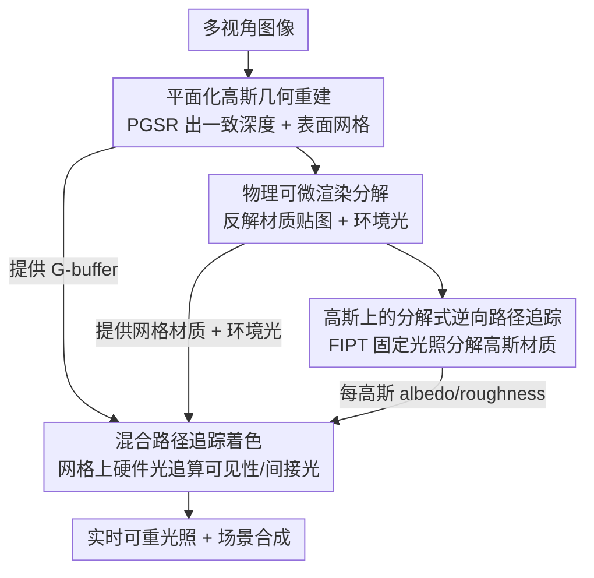

# GHPT: Real-Time Relightable Gaussian Splatting using Hybrid Path Tracing

**会议**: CVPR 2026  
**论文**: [CVF Open Access](https://openaccess.thecvf.com/content/CVPR2026/html/Bo_GHPT_Real-Time_Relightable_Gaussian_Splatting_using_Hybrid_Path_Tracing_CVPR_2026_paper.html)  
**代码**: 无  
**领域**: 3D视觉  
**关键词**: 可重光照高斯泼溅, 混合路径追踪, 逆向渲染, G-buffer延迟着色, 实时全局光照  

## 一句话总结
GHPT 用"高斯泼溅出 G-buffer、底层网格上做硬件加速光线追踪"的混合路径追踪范式，配合三阶段逆向渲染（先重建几何、再分解材质与环境光、最后在高斯上做分解式逆向路径追踪），第一次让 3DGS 模型既能高质量可重光照、又能在 RTX 4080 上 1920×1080 实时（113 fps）做带软阴影/间接光的场景合成。

## 研究背景与动机
**领域现状**：3D 高斯泼溅（3DGS）以一堆各向异性高斯基元显式表达场景，靠光栅化 + alpha 混合实现高保真、高速的新视角合成，已经成为 NeRF 之后的主流场景表达。但要把 3DGS 当成"资产"插进新场景、换一张环境光重新打光，需要的是逆向渲染（反解几何/材质/光照）+ 物理渲染（重新着色），而这两件事 3DGS 原生都做不到。

**现有痛点**：路径追踪这类蒙特卡洛物理渲染没法直接套在 3DGS 上，因为高斯是半透明体、没有明确表面可供光线求交。现有可重光照高斯方法被逼上两条都不理想的路：一条是**用近似渲染公式**（split-sum 近似、屏幕空间环境光遮蔽 AO、近似间接光），换来速度但牺牲真实感，软阴影和互反射要么糊要么没有；另一条是**直接对高斯做光线追踪**（Gaussian ray tracing，如 3DGRT 给高斯建 BVH 求交），全局光照算得准但渲染速度暴跌，远达不到实时。

**核心矛盾**：在 3DGS 上做重光照，"物理正确的全局光照"和"实时渲染效率"被现有方案当成了二选一——半透明高斯没有一个干净的表面让光线高效求交，逼得方法要么近似（快但不真）、要么硬追踪高斯（真但极慢）。

**本文目标**：拿到一个既能**物理正确地重光照与合成**（带可见性、软阴影、间接光/色溢出），又能**实时**渲染的高斯泼溅模型。

**切入角度**：作者借鉴实时渲染器/游戏引擎里成熟的 **hybrid path tracing**——不从相机逐像素打光线，而是先光栅化出 G-buffer（屏幕空间的几何缓冲：法线、深度、命中点），再从 G-buffer 出发追踪光线算可见性和间接光。关键观察是：高斯本身不好求交，但 PGSR（平面化高斯）能从同一批高斯重建出一张**显式三角网格**；那就让高斯负责出 G-buffer 和着色，让网格负责被光线高效求交，两者各司其职。

**核心 idea**：把"高斯泼溅出 G-buffer"和"底层网格上做硬件加速光线追踪"缝在一起做延迟着色，用三阶段（几何 → 材质/环境光 → 高斯材质分解）的逆向渲染拿到可重光照高斯，从而在保住物理真实感的同时跑进实时。

## 方法详解

### 整体框架
GHPT 是一条 **三阶段逆向渲染管线**。输入是一组多视角图像，输出是一个可重光照、可合成的高斯泼溅模型（每个高斯带 albedo/roughness）外加一张环境光贴图与一张带材质的底层网格。三个阶段的核心分工：**阶段一**用 PGSR（平面化高斯）从多视角图像重建出多视角一致的深度，并提取出表面网格；**阶段二**在这张网格上做基于物理的可微渲染（PBDR），反解出网格的材质贴图（albedo/roughness）和环境光贴图；**阶段三**在 PGSR 光栅化出的 G-buffer 上做分解式逆向路径追踪（FIPT），用阶段二的"带材质网格 + 环境光"作为光线追踪的代理几何来评估可见性与间接光，最终把材质属性分解到每个高斯上。

之所以拆成"先几何、再网格材质/环境光、最后高斯材质"这个顺序，是为了让第三阶段能用上 FIPT：FIPT 要求**环境光固定、且有现成的代理几何**才能把光照预烘焙出来；阶段二恰好提前把环境光和带材质网格备齐，于是阶段三只需在固定光照下分解高斯材质，训练既快又稳。

### 关键设计

**1. 混合路径追踪渲染模型：让高斯出 G-buffer、让网格被光线追踪**

这是全文的地基，针对的是"半透明高斯没法被高效光线求交"这个根本痛点。GHPT 不直接对高斯打光线，而是采用**延迟着色（deferred shading）**：先用 PGSR 把高斯光栅化成一张 G-buffer（法线图 + 深度图，进而得到每个像素的主命中点），再从这些命中点出发，在阶段一/二产出的**显式三角网格**上做路径追踪来评估可见性和间接光。这样"被求交的几何"是干净的网格（可建 BVH、可吃现代 GPU 的硬件加速光线追踪），而"被着色/表达细节的载体"仍是高斯，两边各取所长。

渲染遵循渲染方程 $L_o(x,\omega_o)=\int_{\Omega^+}L_i(x,\omega_i)f_r(x,\omega_i,\omega_o)(n\cdot\omega_i)\,d\omega_i$，并把出射辐射拆成直接光与间接光两部分蒙特卡洛估计：直接光 $L_o^{direct}\approx\frac1N\sum_k \frac{L_i^{env}(\omega_k)f_r(x,\omega_k,\omega_o)(n\cdot\omega_k)}{p(\omega_k)}$ 由环境光贴图打来，间接光 $L_o^{ind}$ 则靠在网格上递归追踪光线得到。这套从 G-buffer 出发的混合追踪正是实时渲染器里成熟的做法，被作者搬来解决高斯重光照——相比纯近似公式它能算出真·软阴影与色溢出，相比纯高斯光追它省掉了对半透明体反复求交的开销。

**2. 法线先验引导的平面化高斯几何重建：拿到可靠的代理网格**

混合路径追踪的前提是有一张几何准确的网格，否则光线在错误表面上求交会产生伪影。作者用 **PGSR** 把 3D 高斯压成 2D 平面表示，先 alpha 混合渲染出平面的法线图 $n=\sum_i T_i\alpha_i R_c^\top n_i$ 和到相机的距离图 $D=\sum_i T_i\alpha_i d_i$，再通过 $D(p)=\frac{D}{n(p)K^{-1}\tilde p}$ 把它们转成深度图——相比"直接对高斯深度做 alpha 混合"，先出平面法线/距离再转深度能保证深度落在高斯的扁平面上，避免几何冲突、得到多视角一致的无偏深度。

为了对抗高光反射对几何重建的干扰，作者额外引入 StableNormal 的**单目法线先验**作监督，加一项法线一致性损失 $L_{normal}=\sum(1-n_{render}\cdot n_{mono})$ 把渲染法线对齐到先验法线；同时用二元交叉熵 mask 损失 $L_{mask}=-M\log O-(1-M)\log(1-O)$ 约束物体轮廓（$O$ 为累积不透明度）。重建出的网格再被简化到 50 万三角面、并用 Blender 生成 UV 图集，供后续可微渲染优化材质贴图。

**3. 基于物理的可微渲染分解材质与环境光：为 FIPT 备好固定光照与代理材质**

这一步针对"逆向渲染高度病态、材质与光照互相纠缠"的难点，目标是先在网格上稳稳地反解出环境光和材质贴图，给阶段三铺路。渲染器对每个蒙特卡洛样本走**两遍（two-pass）**：第一遍不可微，负责求主命中、样本对环境光的可见性、以及间接出射辐射并存下来；第二遍用这些可见性 + 环境光 + 命中点 BRDF 算直接辐射、再叠加间接辐射得到最终辐射，与目标图算逐像素 L1 损失反传，优化 BRDF 和环境光。采样上用**下一事件估计（NEE）**配 alias table 直接采环境光，并用平衡启发式的**多重重要性采样（MIS）**融合 BRDF 采样与环境光采样降方差。

训练分两段：第一段（5000 迭代）主要优化环境光，第二段（1000 迭代）固定环境光、重置粗糙度后只优化材质贴图。作者发现优化容易把光照"烘焙"进 albedo 而得不到高对比度环境光，于是把环境光做了 $1.35$ 次幂的对比度增强来更好地解耦材质与光照（⚠️ 这个幂指数是经验值，以原文为准）。

**4. 高斯上的分解式逆向路径追踪（FIPT）：把材质高效分解到每个高斯**

有了固定环境光和带材质网格后，阶段三才在高斯上分解材质。每个高斯额外带 albedo $a$ 和 roughness $r$，alpha 混合得到 $\{A,R\}=\sum_i T_i\alpha_i\{a_i,r_i\}$。核心是借 **FIPT** 把光照传输积分**因式分解**：把出射辐射重写成 $L_o=k_dL_d(x)+k_sL_s^0(x,\omega_o,r)+L_s^1(x,\omega_o,r)$，其中漫反射着色 $L_d$、两个对应 Fresnel 分量（$F_0=1-(1-h\cdot\omega_i)^5$、$F_1=(1-h\cdot\omega_i)^5$）的高光着色 $L_s^0,L_s^1$ 都被**预烘焙**出来，把 $k_d=a$、$k_s=0.04$、$r$ 从积分里彻底剥离。高光着色随粗糙度的变化用 6 个均匀采样粗糙度等级的预计算结果线性插值近似 $L_s^*(\cdot,r)\approx\mathrm{lerp}(\{L_s^*(\cdot,r_i)\}_{i=1}^6,r)$。

这样做的好处是：着色项可以用很高的 spp（256）一次性预烘焙、训练时只需查表，于是材质分解又快又稳，可见性与间接光则继续靠在网格上硬件光追评估。一个工程细节是 PGSR 网格表面和实际 G-buffer 略有偏差，混合光追时可能自交，作者通过忽略命中距离小于 0.1 的求交和背面命中来缓解。优化目标为 $L=L_{shade}+\lambda_a L_{s,a}+\lambda_r L_{s,r}$，其中 $L_{shade}$ 是 FIPT 渲染图与目标图的 L1，$L_{s,a},L_{s,r}$ 是 albedo/roughness 的**边缘感知平滑**正则（如 $L_{s,a}=\|\nabla A\|\exp(-\|\nabla I_{gt}\|)$，在图像梯度大处放松平滑约束）。

### 损失函数 / 训练策略
- 阶段一（PGSR）：法线先验损失权重 0.15、mask BCE 权重 0.05；网格按体素 0.002（合成数据集）/0.01（MIP-NeRF 360）重建后简化到 500k 面。
- 阶段二（PBDR）：256 spp（128 BRDF + 128 环境光采样），两段训练（5000 + 1000 迭代），材质梯度每步除以 8（沿用 NVDIFFREC/NVDIFFRECMC 做法）。
- 阶段三（FIPT）：256 spp 预烘焙一次着色，材质分解训 5000 迭代，$\lambda_{s,a}=0.025$、$\lambda_{s,r}=0.05$；推理时 256 spp + 窗口 9 的边缘感知空间去噪。
- 实时渲染：仅 2 spp（1 BRDF + 1 环境光）+ 空间滤波 + 历史长度 20 的时间累积来压噪声。

## 实验关键数据

### 主实验
两个合成数据集（SYNTHETIC4RELIGHT、TENSOIR SYNTHETIC）上对比 NeRF/GS 系逆向渲染基线，重点看重光照（Relighting）的 PSNR/SSIM/LPIPS。

| 数据集 | 任务 | 指标 | GHPT(本文) | 最强基线 | 说明 |
|--------|------|------|-----------|----------|------|
| SYNTHETIC4RELIGHT | 重光照 | PSNR↑ | **35.87** | IRGS 34.76 | 重光照 PSNR 最优 |
| SYNTHETIC4RELIGHT | 新视角合成 | PSNR↑ | **37.11** | R3DG 36.06 | NVS PSNR 最优 |
| TENSOIR SYNTHETIC | 重光照 | PSNR↑ | **32.46** | SVG-IR 31.10 | 重光照 PSNR 最优 |
| TENSOIR SYNTHETIC | albedo | PSNR↑ | **33.67** | IRGS 33.40 | albedo PSNR 最优 |

GHPT 在两个数据集的重光照 PSNR 上都拿了第一，SSIM 也与最佳相当（如 SYNTHETIC4RELIGHT 重光照 SSIM 0.971，TENSOIR 0.948），LPIPS 同样靠前。在新视角合成与 albedo 反解上也分别拿下若干第一项，说明几何/材质分解整体过硬，而不是只在重光照上调参取巧。

### 实时性能（RTX 4080，1920×1080，2 spp）
| 场景 | G-buffer 渲染 | 混合路径追踪 | 去噪 | 总计(ms) |
|------|--------------|-------------|------|----------|
| GARDEN | 3.51 | 2.70 | 1.74 | 7.95 |
| KITCHEN | 3.03 | 2.54 | 1.75 | 7.32 |
| ROOM | 3.35 | 4.65 | 1.75 | 9.75 |

三个 MIP-NeRF 360 场景里总耗时 7.3~9.8 ms（约 100~135 fps，封面图标 113 fps），证明确实做到了实时重光照与合成。ROOM 的路径追踪耗时明显更高，因为墙体部分遮挡环境光、加长了光线路径——一个符合直觉的几何相关现象。

### 消融实验
SYNTHETIC4RELIGHT / TENSOIR 上的重光照 PSNR：

| 配置 | S4R PSNR | TENSOIR PSNR | 说明 |
|------|----------|--------------|------|
| Full | **35.87** | **32.46** | 完整模型 |
| Underlying mesh | 34.83 | 31.81 | 仅用阶段二网格、不分解到高斯 |
| w/o denoising | 35.46 | 32.06 | 去掉空间去噪，结果更噪 |
| 16 spp (relight) | 34.87 | 31.69 | 采样数太低，噪声明显 |
| 64 spp (relight) | 35.71 | 32.22 | 接近但仍逊于 256 spp |
| w/o indirect | 34.68 | 32.28 | 训练时不考虑间接光 |

### 关键发现
- **把材质分解到高斯（Full）比只用阶段二网格更好**：完整模型相比 "underlying mesh" 在两个数据集分别 +1.04 / +0.65 PSNR，说明阶段三的高斯材质分解确有增益，而非锦上添花。
- **间接光对正确性很关键**：训练时去掉间接光会让凹陷区域的 albedo **过亮**；训练和渲染都去掉间接光则导致**过暗**——间接光直接影响材质反解的正确性，不只是观感。
- **spp 与去噪决定噪声水平**：16/64 spp 与无去噪都明显更噪，256 spp + 去噪才稳；而实时阶段靠 2 spp + 时间累积（history 20）才把开销压进 10 ms 量级，说明"训练用高 spp、推理用低 spp + 时空降噪"是这套管线实时化的关键工程取舍。

## 亮点与洞察
- **"高斯出 G-buffer、网格被光追"的分工很巧**：它绕开了"半透明高斯难求交"的死结——不强行让高斯既好看又好求交，而是各派一个最擅长此事的表示，把游戏引擎里成熟的 hybrid path tracing 直接迁了过来。
- **三阶段顺序是为 FIPT 量身定制的**：先把环境光和代理网格材质备齐，第三阶段才能在固定光照下用 FIPT 预烘焙着色、训练时只查表，这是"既物理正确又训练高效"的关键，体现了"为了用某个高效算法而倒推管线结构"的设计思维。
- **可迁移的 trick**：训练高 spp、推理低 spp + 时空联合降噪（空间边缘感知滤波 + 历史长度 20 的时间累积）这套"质量与实时分离"的策略，可直接搬到其它需要实时蒙特卡洛渲染的神经/高斯表示上。
- 环境光"幂次对比度增强"解耦光照与 albedo 是个实用的小补丁，针对逆向渲染常见的"光照被烘进反照率"顽疾。

## 局限与展望
- **强依赖网格质量**：整条管线建立在 PGSR 重建的代理网格上，作者自己也提到网格与 G-buffer 有偏差会引发自交（靠忽略近距离/背面命中缓解），对几何复杂、薄结构或强高光场景，网格不准可能直接拖垮光追结果。
- **只在合成数据上做定量评测**：重光照/albedo 的定量对比都在 SYNTHETIC4RELIGHT 与 TENSOIR SYNTHETIC 合成数据集上，真实采集场景仅做合成展示，泛化到真实复杂材质/光照仍是问号。⚠️ 真实数据上的可重光照定量表现以后续工作为准。
- **多处经验超参**：体素大小、环境光 1.35 次幂、自交 0.1 阈值、各损失权重等都是手调，换数据集/场景的鲁棒性未充分讨论。
- **改进思路**：可探索端到端联合优化几何与材质（而非严格三段串行），或用更鲁棒的法线/几何先验减少对单目法线模型的依赖；以及把代理几何从三角网格换成更轻量的可求交结构以进一步提速。

## 相关工作与启发
- **vs 近似渲染类（GS-IR / GI-GS）**：它们用 split-sum 近似、AO、近似间接光换速度，重光照真实感受限（如 GI-GS 在 TENSOIR 重光照仅 24.70 PSNR）；GHPT 走真·路径追踪，重光照大幅领先且仍实时。
- **vs 高斯光追类（R3DG / IRGS / 3DGRT）**：它们对高斯直接做光线追踪，全局光照准但渲染慢；GHPT 把光追挪到代理网格上、高斯只负责 G-buffer 与着色，在重光照 PSNR 反超 IRGS（35.87 vs 34.76）的同时做到实时。
- **vs 显式几何逆向渲染（NVDIFFREC/MC、FIPT 原作）**：GHPT 把这套"网格 + 物理可微渲染 + FIPT 因式分解"的成熟逆向渲染流程嫁接到高斯表示上，等于给 3DGS 接上了图形学正统的可微渲染管线，是"高斯表达 + 图形学渲染"两条线的缝合。

## 评分
- 新颖性: ⭐⭐⭐⭐ 把 hybrid path tracing 的"G-buffer + 代理网格光追"范式系统迁到高斯重光照，缝合得干净且解决了真实痛点，但各组件（PGSR/PBDR/FIPT）多为已有积木的组合。
- 实验充分度: ⭐⭐⭐⭐ 两数据集多任务对比 + 实时计时 + 多维消融较完整，但缺真实数据集的定量重光照评测。
- 写作质量: ⭐⭐⭐⭐ 三阶段动机与公式交代清晰，部分实现细节（两遍渲染、自交处理）需翻补充材料。
- 价值: ⭐⭐⭐⭐ 首个兼顾物理真实感与实时的可重光照高斯方案，对 AR/VR 资产化、场景合成有直接落地价值。

<!-- RELATED:START -->

## 相关论文

- [\[CVPR 2026\] SketchFaceGS: Real-Time Sketch-Driven Face Editing and Generation with Gaussian Splatting](sketchfacegs_real-time_sketch-driven_face_editing_and_generation_with_gaussian_s.md)
- [\[CVPR 2026\] Seele: A Unified Acceleration Framework for Real-Time Gaussian Splatting on Mobile Devices](seele_a_unified_acceleration_framework_for_real-time_gaussian_splatting_on_mobil.md)
- [\[ICCV 2025\] Radiant Foam: Real-Time Differentiable Ray Tracing](../../ICCV2025/3d_vision/radiant_foam_real-time_differentiable_ray_tracing.md)
- [\[CVPR 2026\] KV-Tracker: Real-Time Pose Tracking with Transformers](kv-tracker_real-time_pose_tracking_with_transformers.md)
- [\[CVPR 2026\] Geometric-Photometric Event-based 3D Gaussian Ray Tracing](geometric-photometric_event-based_3d_gaussian_ray_tracing.md)

<!-- RELATED:END -->
