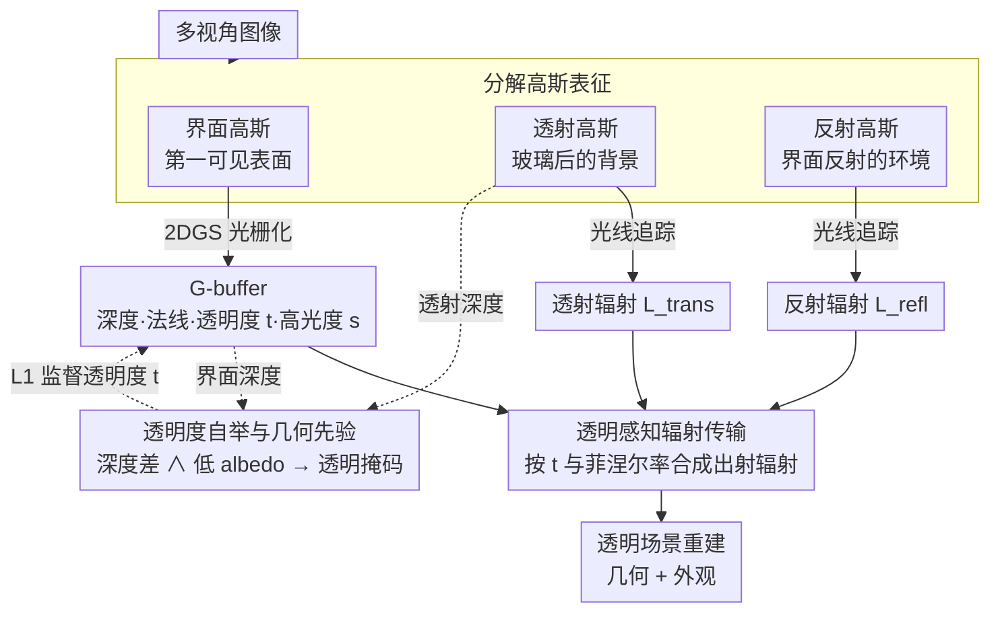

# GLINT: Modeling Scene-Scale Transparency via Gaussian Radiance Transport

**会议**: CVPR 2026  
**arXiv**: [2603.26181](https://arxiv.org/abs/2603.26181)  
**代码**: [https://youngju-na.github.io/GLINT](https://youngju-na.github.io/GLINT)  
**领域**: 3D视觉  
**关键词**: 高斯溅射、透明表面重建、辐射传输分解、混合渲染、场景重建

## 一句话总结
GLINT 通过将高斯表征分解为界面、透射、反射三个组件，结合光栅化+光线追踪的混合渲染管线，在场景级透明表面（如玻璃墙、展示柜）的几何和外观重建上取得了 SOTA 效果。

## 研究背景与动机

**领域现状**：3D 高斯溅射（3DGS）凭借实时渲染和高视觉保真度成为 3D 重建的主流范式。大量后续工作改进了几何精度（2DGS、PGSR 等平面约束高斯）和非朗伯效应建模（GaussianShader、EnvGS 等反射分解方法）。

**现有痛点**：3DGS 的核心 alpha-blending 机制无法处理透明表面。在透明场景中（如建筑玻璃、展示柜、窗户），单个像素接收来自不同物理位置的反射和透射分量的叠加辐射。为了渲染真实的透射效果，位于玻璃位置的高斯需要极低的 opacity 或被剪枝，但这会导致玻璃的几何信息丢失。反之，高 opacity 会把玻璃当作不透明遮挡物，阻断透射背景。这就是"透明-深度困境"。

**核心矛盾**：alpha-blending 将几何和外观耦合在单一合成流中——同一个 opacity 参数同时控制着几何存在性和辐射贡献度，这对透明物体是根本性的冲突（几何上存在but辐射上需要透过去）。

**本文目标** (1) 如何在高斯溅射框架下解耦透明表面的几何和外观？(2) 如何同时重建透射和反射辐射而不需要手动分割掩码？(3) 如何扩展到场景级的复杂透明结构？

**切入角度**：现有方法要么是 object-centric 需要分割掩码（TransparentGS、TSGS），要么只处理反射不处理透射（EnvGS、DeferredGS）。作者提出将场景显式分解为三个功能集：第一可见界面、透射几何、反射环境，分别用独立的高斯集合表示和优化。

**核心 idea**：将高斯溅射的表征分解为界面/透射/反射三组件，用光栅化+光线追踪的混合管线实现物理一致的透明辐射传输。

## 方法详解

### 整体框架
GLINT 的输入是多视角图像，输出是包含透明表面的完整 3D 场景重建（几何+外观）。场景的高斯被显式划分为三组：界面高斯 $\mathcal{G}_{\text{intr}}$（捕捉第一可见表面，包括透明和不透明边界）、透射高斯 $\mathcal{G}_{\text{trans}}$（建模通过透明表面看到的背景几何）、反射高斯 $\mathcal{G}_{\text{refl}}$（编码从界面反射的环境辐射）。界面组件通过光栅化产生 G-buffer（深度、法线、透明度、高光度），然后通过光线追踪查询透射和反射组件，最终按透明度和菲涅尔反射率加权合成出射辐射。

### 关键设计

**1. 分解高斯表征：把一个被 alpha-blending 耦死的 opacity 拆成三套各管一摊的高斯**

透明-深度困境的根子在于：标准 3DGS 用同一个 opacity 既表示"这里有没有几何"又表示"这里贡献多少辐射"，对玻璃这种"几何上确实存在、辐射上却要让光透过去"的表面是死结。GLINT 的解法是干脆把场景分成三套互不干扰的高斯，让每套只承担一种光学角色。界面高斯 $\mathcal{G}_{\text{intr}}$ 负责第一可见表面（玻璃边界和不透明物体），透射高斯 $\mathcal{G}_{\text{trans}}$ 负责透过玻璃看到的背景，反射高斯 $\mathcal{G}_{\text{refl}}$ 负责界面反射的环境。其中界面组件用 2DGS 光栅化出一张 G-buffer $\mathcal{B} = \{z, \mathbf{n}, t, s\}$，给出每个像素的深度、法线、透明度 $t \in [0,1]$ 和高光度 $s \in [0,1]$：$t$ 决定这一点走不透明路径还是透明路径，$s$ 决定漫反射和镜面反射各占多少。透射和反射两套高斯各自独立优化，谁也不再去抢界面那个矛盾的 opacity，几何和外观就此解耦。

**2. 透明感知辐射传输：用一套受 BSDF 启发的混合公式，把界面、透射、反射三股辐射物理一致地合成回一个像素**

分解之后还得把三套高斯重新合成出一张图，否则就是各画各的。GLINT 用透明度 $t$ 作为软开关，把出射辐射写成不透明分支和透明分支的加权和：

$$L_o = (1-t)\, L_{\text{opaque}} + t\, L_{\text{transparent}}$$

两个分支结构对称，都先用 Schlick 菲涅尔近似 $F(\omega_o) = F_0 + (1-F_0)(1 - \max(0, \omega_o \cdot \mathbf{n}))^5$ 算出镜面占比 $k_s = s + (1-s) F(\omega_o)$，再按 $k_s$ 混合一条"漫反射式"路径和一条反射路径——不透明分支是 $L_{\text{opaque}} = (1-k_s) L_{\text{intr}} + k_s L_{\text{refl}}$，透明分支则把界面基色换成透射辐射 $L_{\text{transparent}} = (1-k_s) L_{\text{trans}} + k_s L_{\text{refl}}$。这里的反射和透射辐射都不是预存的，而是当场用光线追踪去查对应那套高斯：$L_{\text{refl}} = \text{Trace}(\mathcal{G}_{\text{refl}}, \mathbf{x}, \omega_r)$，$L_{\text{trans}} = \text{Trace}(\mathcal{G}_{\text{trans}}, \mathbf{x}, \omega_t)$。为了不引入额外的折射求解，作者取光学薄假设，认为透射方向几乎沿原视线 $\omega_t \approx \omega_o$、忽略玻璃内的弯折。这样一来，反射和透射被基于表面属性显式分到两条路径上，优化时再也不用为了"让背景透出来"而把玻璃的 opacity 压到违反物理的低值。

**3. 透明度自举与几何先验：不靠分割掩码，而是让"玻璃在哪"从优化过程的副产物里自己浮现出来**

前两步要工作，前提是知道哪些像素是透明的——但场景级玻璃边界模糊、透射辐射叠在背景上，现成的分割模块经常失灵。GLINT 不额外训练分割器，而是直接读分解表征里自然涌现的两个信号来定位玻璃：一是界面和透射的深度差 $\Delta z = |z_{\text{intr}} - z_{\text{trans}}|$，差得大说明同一像素后面藏着多层深度，很可能是玻璃；二是漫反射 albedo 图 $\hat{a}$（来自预训练视频重光照模型），albedo 低说明这里以镜面/透射传输为主。两个条件取交集得到二值掩码 $M_{\text{trans}} = \mathbf{1}\big((\Delta z > \tau_d) \land (\hat{a} < \gamma_a)\big)$，再用 L1 损失反过来监督光栅化预测的透明度 $t$——所谓"自举"，就是表征越准、掩码越准、监督又让表征更准的正反馈。同一个视频重光照模型还顺带提供深度 $\hat{z}$ 和法线 $\hat{\mathbf{n}}$ 先验，通过尺度不变深度损失和法线角度损失稳住界面几何；选视频模型而非单目深度估计，是因为它的预测在帧间更一致，不会让透明区域的几何抖动。

### 损失函数 / 训练策略
总损失：$\mathcal{L}_{\text{photo}} = \lambda_1 \mathcal{L}_1 + \lambda_{\text{ssim}} \mathcal{L}_{\text{SSIM}} + \lambda_{\text{lpips}} \mathcal{L}_{\text{LPIPS}}$（光度重建）+ $\mathcal{L}_{\text{geo}} = \lambda_d \mathcal{L}_{\text{depth}} + \lambda_n \mathcal{L}_{\text{normal}}$（几何正则化）+ $\mathcal{L}_{\text{trans}} = \lambda_t \|M_{\text{trans}} - t\|_1$（透明度监督）。使用 2DGS 光栅化器 + 修改版 OptiX 光线追踪器。自适应密化和剪枝+边缘感知法线平滑。$\tau_d = 0.01$，$\gamma_a = 0.05$。单卡 RTX 4090 训练。

## 实验关键数据

### 主实验 — 合成数据集 3D-FRONT-T (几何评估)

| 方法 | Normal MAE↓ | 11.25°↑ | Depth AbsRel↓ | CD↓ | F1↑ |
|------|-------------|---------|---------------|-----|-----|
| 2DGS | 25.97 | 52.19 | 0.20 | 0.85 | 0.688 |
| EnvGS | 14.37 | 68.22 | 0.13 | 0.87 | 0.640 |
| TSGS | 9.89 | 86.29 | 0.08 | 0.52 | 0.798 |
| **GLINT** | **7.96** | **86.37** | **0.04** | **0.34** | **0.836** |

### 主实验 — 渲染质量

| 方法 | DL3DV-10K PSNR↑ | DL3DV-10K SSIM↑ | 3D-FRONT-T PSNR↑ |
|------|-----------------|-----------------|-------------------|
| EnvGS | 29.65 | 0.91 | 33.71 |
| TSGS | 25.94 | 0.85 | 28.80 |
| **GLINT** | **30.21** | **0.92** | **34.50** |

### 消融实验

| 配置 | PSNR↑ | MAE↓ | AbsRel↓ |
|------|-------|------|---------|
| Full model | **34.50** | **7.96** | **0.035** |
| w/o $\mathcal{G}_{\text{trans}}$ | 32.26 | 8.11 | 0.038 |
| w/o $\mathcal{G}_{\text{refl}}$ | 32.70 | 8.78 | 0.038 |
| w/o $\mathcal{L}_{\text{trans}}$ | 33.57 | 8.07 | 0.037 |
| w/o $\mathcal{L}_{\text{geo}}$ | 33.62 | 24.69 | 0.126 |

### 关键发现
- 去掉透射组件 $\mathcal{G}_{\text{trans}}$ 导致最大的性能下降（PSNR -2.24），因为背景内容错误地混入界面高斯，产生几何歧义
- 去掉几何正则化 $\mathcal{L}_{\text{geo}}$ 导致法线 MAE 从 7.96 飙升到 24.69，深度 AbsRel 从 0.035 飙升到 0.126，说明先验对稳定透明区域几何至关重要
- TSGS 虽然在几何上有一定效果，但渲染质量明显低于 GLINT（PSNR 差 5+ dB），因为它只建模第一表面无法恢复透射辐射
- 透明度自举成功识别了各种场景中的玻璃区域，无需任何手动标注

## 亮点与洞察
- 三组件分解设计直接且优雅地解决了"透明-深度困境"。将光学角色显式分离为界面/透射/反射，使得每个组件的 opacity 不再承受矛盾约束。这种结构化分解的思路可推广到其他光学现象（如半透明、次表面散射）
- 透明度自举的方法非常聪明：利用深度差作为主要信号、albedo 作为辅助信号来检测透明区域，完全来自分解优化过程的副产物，不需要额外的分割模型
- 混合渲染（光栅化+光线追踪）的设计平衡了效率和物理正确性。界面用高效的光栅化，二次反射/透射用光线追踪，是实用的工程选择

## 局限与展望
- 基于光学薄假设，即折射弯曲可忽略。对于厚玻璃、水族箱等有明显折射的场景，该假设不成立
- 需要预训练的视频重光照模型作为先验，增加了依赖和部署复杂度
- 光线追踪部分的计算开销限制了实时应用的可能性（虽然在 RTX 4090 上可行）
- 仅在 5 个合成场景和 8 个真实场景上评估，场景多样性有待扩展
- 透明度掩码的阈值 $\tau_d$ 和 $\gamma_a$ 在所有场景中固定，可能不是最优的

## 相关工作与启发
- **vs 2DGS/PGSR**: 这些方法改善了高斯的几何精度，但完全无法处理透明表面，在玻璃区域产生缺失或嘈杂的法线/深度
- **vs EnvGS**: 专门建模反射的方法（独立环境高斯+光线追踪），但不处理透射辐射，因此在透明场景中渲染和几何都不理想
- **vs TSGS**: 专门建模透明表面的方法（第一表面光栅化），但只做第一表面不做透射分解，导致透过玻璃看到的物体渲染模糊。GLINT 同时解决了几何和外观
- **vs TransparentGS**: 处理折射透明（体积建模折射介质），但是 object-centric 且需要分割。GLINT 是 scene-scale 且不需要掩码

## 评分
- 新颖性: ⭐⭐⭐⭐⭐ 三组件分解+混合渲染管线的设计对透明场景重建是本质性的推进
- 实验充分度: ⭐⭐⭐⭐ 合成+真实数据集，完整消融，但场景数量有限
- 写作质量: ⭐⭐⭐⭐⭐ 物理建模严谨，图表丰富直观
- 价值: ⭐⭐⭐⭐⭐ 解决了3DGS的根本性限制，引入的3D-FRONT-T基准对后续工作有重要价值

<!-- RELATED:START -->

## 相关论文

- [\[CVPR 2026\] RayNova: Scale-Temporal Autoregressive World Modeling in Ray Space](raynova_scale-temporal_autoregressive_world_modeling_in_ray_space.md)
- [\[CVPR 2026\] Sky2Ground: A Benchmark for Site Modeling under Varying Altitude](sky2ground_a_benchmark_for_site_modeling_under_varying_altitude.md)
- [\[CVPR 2026\] EMGauss: Continuous Slice-to-3D Reconstruction via Dynamic Gaussian Modeling in Volume Electron Microscopy](emgauss_continuous_slice-to-3d_reconstruction_via_dynamic_gaussian_modeling_in_v.md)
- [\[ICML 2026\] Streaming Sliced Optimal Transport](../../ICML2026/3d_vision/streaming_sliced_optimal_transport.md)
- [\[CVPR 2026\] Extend3D: Town-Scale 3D Generation](extend3d_town-scale_3d_generation.md)

<!-- RELATED:END -->
