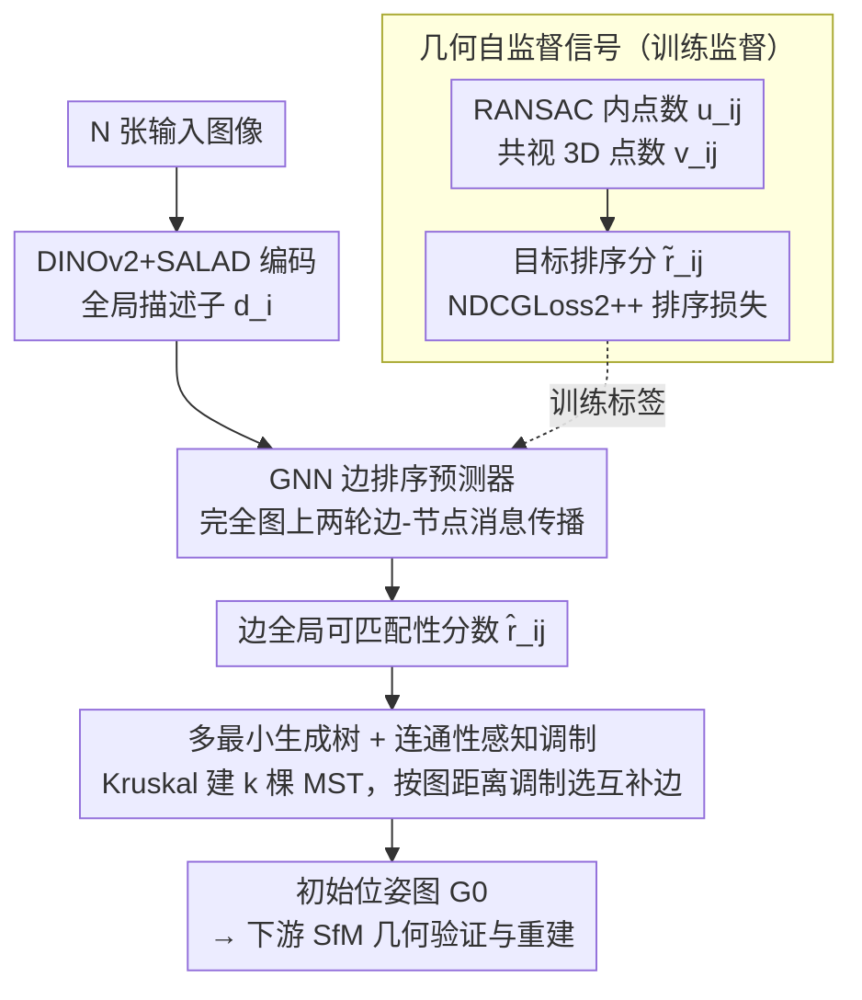

# Global-Aware Edge Prioritization for Pose Graph Initialization

**会议**: CVPR 2026  
**arXiv**: [2602.21963](https://arxiv.org/abs/2602.21963)  
**代码**: [GitHub](https://github.com/weitong8591/global_edge_prior)  
**领域**: 3D视觉  
**关键词**: Structure-from-Motion, 位姿图初始化, 图神经网络, 最小生成树, 边排序

## 一句话总结

提出基于GNN的全局边优先级排序方法，将位姿图初始化从独立的逐对图像检索升级为全局结构感知的边排序+多最小生成树构建，在极稀疏设置下显著提升SfM重建精度。

## 研究背景与动机

**领域现状**：Structure-from-Motion (SfM) 是从图像集合重建3D结构和相机位姿的经典问题。无论增量式（COLMAP）还是全局式（GLOMAP），所有SfM流程都始于同一步：构建初始位姿图——从 $\binom{N}{2}$ 个候选图像对中选出稀疏子集进行几何验证。

**现有痛点**：
   - 当前方法几乎全部依赖**逐图像检索**（如NetVLAD、CosPlace、MegaLoc），将每张图像独立连接到其 $k$ 个最近邻
   - 这种贪心策略**忽略全局结构**：可能产生细长链条、弱连接区域或多个松耦合子结构
   - 初始边一旦选定，后续阶段**只删不加**，全局关键连接一旦遗漏便不可恢复
   - Re-ranking方法（Patch-NetVLAD、VOP）仍在逐对层面运作，无法感知全局拓扑

**核心矛盾**：位姿图是SfM的结构骨架，其质量决定重建成败。但当前初始化策略仅考虑局部视觉相似度，不具备全局推理能力，在稀疏或歧义场景下尤其脆弱。

**本文切入点**：引入"边优先级"概念——不再独立评估图像对，而是对所有候选边按其**对SfM的全局效用**进行排序，再通过多最小生成树构建紧凑且全局连通的位姿图。

## 方法详解

### 整体框架

给定 $N$ 张图像，目标是构建初始位姿图 $\mathcal{G}_0 = (\mathcal{V}, \mathcal{E}_0)$，让后续 SfM 只在这张稀疏图上做几何验证与重建。传统流程靠逐图像检索把每张图连到 $k$ 个最近邻来凑边，本文换成"先全局排序、再按结构选边"的两段式：先用 DINOv2+SALAD 把每张图编码成全局描述子 $d_i$；再在所有图像构成的完全图上跑 GNN 消息传播，给每条候选边打一个全局可匹配性分数 $\hat{r}_{ij}$；最后不靠贪心阈值，而是用多棵最小生成树（MST）依次选边，并在选边过程中根据当前图的连通状态动态调制分数，保证选出的边既紧凑又全局连通。这套全局边排序由几何自监督信号训练得到——直接从 SfM 自身产出读取排序标签，无需人工标注。

### 关键设计

**1. GNN 边排序预测器：让每条边的评分"看见"整张图**

逐对余弦相似度的问题在于只看两张图自己，分不清"局部长得像但对全局重建没用"的边。这里改在图像嵌入构成的完全图上做边-节点交替的消息传播：每条有向边先初始化为 $e_{ij}^0 = \text{ReLU}(f_l[d_i, d_j, \langle d_i, d_j \rangle])$，把两端描述子和它们的内积拼起来当起点；随后两轮传播里，边特征按 $e_{ij}^t = f_{\text{edge}}([e_{ij}^{t-1}, d_i^t, d_j^t])$ 更新，节点则聚合邻居消息 $m_i^t = \frac{1}{N}\sum_j m_{ji}^t$ 后用 $d_i^{t+1} = f_{\text{update}}([d_i^t, m_i^t])$ 刷新自己，最后一层 MLP 把边特征读出成排名分数 $\hat{r}_{ij} = f_{\text{MLP}}(e_{ij}^2)$。经过这一圈传播，每条边的分数都综合了整个图像集的上下文，而不再是孤立的两图相似度，因此能把全局冗余或误导的边压下去。

**2. 几何自监督信号：用 SfM 自己的产出当排序标签**

难点是"边的全局效用"没有现成标注。本文不去人工标，而是直接从 SfM 流程里读两个互补信号来生成监督：RANSAC 内点数 $u_{ij}$ 反映两视图几何的即时可验证性，共同可见 3D 点数 $v_{ij}$ 反映这条边对全局重建的长期贡献，归一化后组合成目标分 $\tilde{r}_{ij} = \frac{1}{2}(\text{norm}(u_{ij}) + \text{norm}(v_{ij}))$。训练时用 **NDCGLoss2++** 这一可微排序损失，直接优化预测排序与真实排序的 NDCG 一致性，而不是去回归 $\tilde{r}_{ij}$ 的绝对值——因为最终只关心"哪些边该优先选进图"，排序对了即可，逼近绝对数值反而是多余的约束。

**3. 多最小生成树 + 连通性感知调制：把分数选成全局连通的紧凑边集**

有了分数还得选边，按阈值或 kNN 直接取容易选出碎片化、子结构松耦合的图。本文先把分数转成权重 $w_{ij} = 1 - \hat{r}_{ij}$，用 Kruskal 迭代建 $k$ 棵 MST，每建一棵就把已选边赋 $\infty$ 权重排除掉，逼着下一棵去选互补的边。关键一步是从第二棵 MST 起，用当前图里的距离来调制分数：

$$s_{ij}^{(m)} = (1-\lambda)\hat{r}_{ij} + \lambda \bar{d}^{(m-1)}(i,j)$$

其中 $\bar{d}^{(m-1)}(i,j)$ 是当前图中归一化的最短路径距离。这样两端在图里已经很远的强边会被提升优先级，等于优先去补"跨区域的捷径"，从而压小图直径、加固弱连接区域。为了不让噪声边被误抬，调制只作用在每张图 top-5 的候选边上，并丢弃分数低于 0.9 的边。

### 损失函数 / 训练策略

- **损失**：NDCGLoss2++，基于LambdaRank的可微NDCG近似
- **训练数据**：MegaDepth 153个场景，每batch取单场景240张图，至多4 batch/场景
- **优化器**：AdamW，学习率 $10^{-5}$，50 epochs
- **大规模扩展**：>500张图时用METIS图分割为子图分批推理，重叠边分数取均值

## 实验关键数据

### 主实验

| 数据集 | 指标 | 本文 (k=2 MSTs) | MegaLoc | 提升 |
|--------|------|------|----------|------|
| IMC23-PhotoTourism | AUC@5° | ~71.7 | ~65.3 | +6.4 |
| MegaDepth | AUC@5° | 领先所有基线 | 次优 | 在k=1-2时优势最大 |
| VisymScenes | 正确重建相机% (k=5) | >75% | <75% | 超越DoppelGanger++ |

### 消融实验

| 配置 | AUC@5° (k=1/2/3/5) | 说明 |
|------|---------|------|
| 完整方法 | 64.2/71.7/72.6/73.5 | 全组件启用 |
| 去掉GNN | 55.4/70.4/72.3/72.3 | k=1时大幅下降，证明全局推理重要性 |
| 用SALAD骨干 | 61.2/71.0/72.4/73.4 | 略降但仍远超原始SALAD，证明骨干无关性 |
| Oracle-RANSAC | 65.7/72.4/73.0/74.1 | 小k最优（即时可验证性） |
| Oracle-3D点 | 65.4/72.1/73.5/74.3 | 大k最优（长期效用） |
| kNN选边 vs MST | MST远优于kNN | kNN易碎片化，MST保证连通 |

### 关键发现

- 全局边排序在**极稀疏设置**（k=1-2棵MST）下优势最大，随着k增大各方法趋于收敛
- **所有基线**在MST框架下都优于其原生kNN选边，MST本身就是更好的结构先验
- 连通性调制在歧义场景（VisymScenes）中尤其关键，分数从61.9提升到66.0（k=2时）
- 在VisymScenes上**无需重训练**即超越专门的Doppelganger++滤波算法，证明全局推理天然抑制误导边
- 推理开销：GNN预测比纯检索慢，但相比COLMAP耗时可忽略不计

## 亮点与洞察

- **问题定义精准**：将位姿图初始化从"检索"重新定义为"排序"问题，抓住了SfM流程中最关键且最不可逆的瓶颈
- **自监督信号设计巧妙**：用SfM自身产出（RANSAC内点+3D共视点）生成排序监督，两个信号互补且完全自动
- **MST框架通用性强**：不仅自己方法受益，所有基线在MST框架下都提升，说明MST本身是比kNN更好的图构建策略
- **连通性调制简洁有效**：用图最短路径距离线性调制分数，几乎无额外开销却显著改善全局拓扑

## 局限与展望

- 推理时GNN需完全图上的消息传播，大规模场景需图分割近似，可探索更高效的稀疏GNN
- 当前仅用两轮消息传播，更深的GNN可能捕获更丰富的全局模式
- 调制权重 $\lambda$ 固定，可学习自适应权重
- 未探索与全局SfM（如GLOMAP）的结合效果
- 失败案例中低分辨率和小比例地标仍有困难

## 相关工作与启发

- **MegaLoc/SALAD**：当前最强检索基线，但仍是逐对评估
- **DoppelGanger++**：专门处理歧义场景的边过滤方法，但作用于几何验证之后，本文方法在验证之前即可抑制歧义
- **PoGO-Net、Damblon et al.**：用GNN优化/过滤已有位姿图，本文是首个将GNN用于**初始化阶段**的工作
- **启发**：全局推理 + 结构感知的选择策略可推广到其他图构建问题（如场景图构建、点云配准图等）

## 评分

- 新颖性: ⭐⭐⭐⭐ 将位姿图初始化重新定义为全局排序问题，GNN+多MST+连通性调制的组合是全新的
- 实验充分度: ⭐⭐⭐⭐ 三个数据集、多个基线、详细消融、oracle对比、时间分析，非常完整
- 写作质量: ⭐⭐⭐⭐ 问题陈述清晰，方法动机充分，公式和图示到位
- 价值: ⭐⭐⭐⭐ 直接可插入现有SfM流程，在稀疏和歧义场景下实用价值高
- 价值: 待评

<!-- RELATED:START -->

## 相关论文

- [\[CVPR 2026\] E2EGS: Event-to-Edge Gaussian Splatting for Pose-Free 3D Reconstruction](e2egs_event-to-edge_gaussian_splatting_for_pose-free_3d_reconstruction.md)
- [\[CVPR 2026\] Foundry: Distilling 3D Foundation Models for the Edge](foundry_distilling_3d_foundation_models_for_the_edge.md)
- [\[NeurIPS 2025\] Mesh Interpolation Graph Network for Dynamic and Spatially Irregular Global Weather Forecasting](../../NeurIPS2025/3d_vision/mesh_interpolation_graph_network_for_dynamic_and_spatially_irregular_global_weat.md)
- [\[CVPR 2026\] MimiCAT: Mimic with Correspondence-Aware Cascade-Transformer for Category-Free 3D Pose Transfer](mimicat_mimic_with_correspondence-aware_cascade-transformer_for_category-free_3d.md)
- [\[AAAI 2026\] Enhancing Rotation-Invariant 3D Learning with Global Pose Awareness and Attention Mechanisms](../../AAAI2026/3d_vision/enhancing_rotation-invariant_3d_learning_with_global_pose_awareness_and_attentio.md)

<!-- RELATED:END -->
