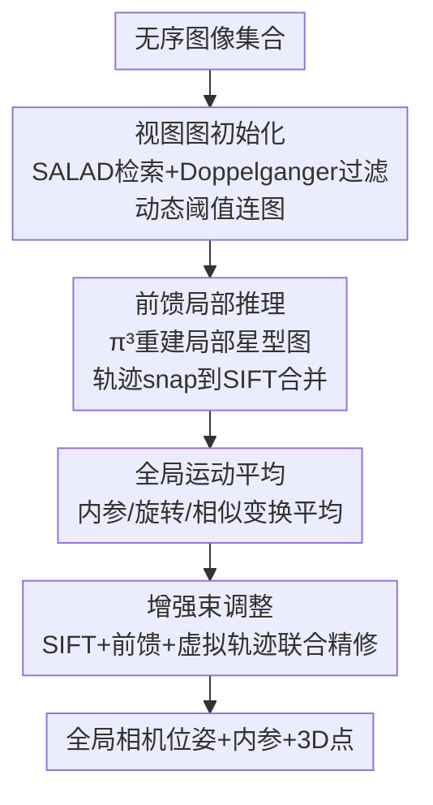

# Global Structure-from-Motion Meets Feedforward Reconstruction

**会议**: CVPR2026  
**arXiv**: [2605.26103](https://arxiv.org/abs/2605.26103)  
**代码**: https://github.com/colmap/gluemap (有)  
**领域**: 3D视觉  
**关键词**: Structure-from-Motion, 前馈重建, 全局运动平均, 束调整, 相机位姿估计

## 一句话总结
GLUEMAP 把经典全局 SfM 的可扩展性/全局一致性和前馈多视图重建网络（π³）的局部鲁棒性拼在一起：用稀疏视图图限制前馈网络只做局部推理、用全局运动平均把上万张局部重建拼成全局解、再用"虚拟轨迹"增强束调整，在 5 个差异极大的数据集上同时超过纯经典和纯前馈方法，并能扩展到数万张图像、跑在单张 RTX 4090 上。

## 研究背景与动机

**领域现状**：Structure-from-Motion（SfM，从一堆图像同时估相机位姿和 3D 结构）有两条技术路线。**经典方法**（COLMAP、GLOMAP）靠 SIFT 特征匹配 + 鲁棒优化（增量式或全局式），在纹理丰富、重叠充分的场景里精度和可靠性都是天花板。**前馈方法**（DUSt3R、VGGT、π³）用一个 transformer 端到端直接回归多视图 3D，靠大规模训练学到的场景先验，在低纹理、低重叠、低视差这些经典方法翻车的极端场景里表现亮眼。

**现有痛点**：两条路各有死穴。经典方法在纹理缺失（匹配失败）、重叠不足（尺度无法约束）、低视差（相对位姿退化）、对称结构（Doppelganger 歧义导致重建坍缩）这四类场景下系统性失败。前馈方法则受三重限制：①**可扩展性差**——transformer 全局注意力受显存约束，最多几百张低分辨率图，再多就 OOM；②**精度不足**——在经典方法擅长的常规场景里，前馈位姿精度明显落后；③**鲁棒性差**——无法可靠处理多连通分量、对称结构，甚至出现"加更多输入图反而结果变差"的反直觉行为。

**核心矛盾**：前馈网络的"全局注意力"在大场景（视图图半径大）里成了负担——所有图两两交互，二次方的连接数让网络分不清相关/无关信息，对称场景下更糟；而经典方法的全局优化恰恰擅长大规模一致性，却缺少对极端局部场景的先验。两者的强项几乎完全互补。

**本文目标**：先系统分析经典与前馈各自在什么"结构性场景属性"（视图图半径、密度）下失效，再据此设计一条把两者强项缝合的统一 pipeline。

**核心 idea**：**别让前馈网络做全局推理，把它降级成"局部专家"**——用经典的图像检索构造稀疏视图图，前馈网络只在每张图的局部星型邻域里做小规模重建（天然避开 OOM、可并行、注意力更聚焦因而更准），再交回经典的全局运动平均和束调整去做大规模拼接与精修。

## 方法详解

### 整体框架
GLUEMAP 的输入是一组无序图像，输出是一个子集图像的相机位姿、内参和 3D 场景点。整条 pipeline 串成四个阶段：**视图图初始化**（用可扩展检索 + Doppelganger 过滤选出可能重叠的图对，构造稀疏图）→ **前馈局部推理**（把视图图拆成局部星型图，用 π³ 批量并行重建每个局部、并合并跨星的轨迹）→ **全局运动平均**（用旋转平均 + 相似变换平均把 n 个局部重建对齐成一个全局解）→ **增强束调整**（混合经典 SIFT 轨迹、前馈轨迹和"虚拟轨迹"联合精修位姿与结构）。核心思路是：前两步借前馈网络拿到鲁棒的局部位姿和深度，后两步借经典优化拿到全局一致性与高精度。

### 关键设计

**1. 稀疏视图图 + Doppelganger 动态阈值：把"全局注意力"换成"局部注意力"**

前馈方法最大的两个毛病——显存爆炸和对称坍缩——都源于它对所有图做全局注意力。GLUEMAP 直接釜底抽薪：不让网络全局看，而是先用可扩展检索 SALAD 为每张图 $I_i$ 召回固定数量 $c$ 个候选邻居，把全局 $O(n^2)$ 的连接降成 $O(c\cdot n)$ 的稀疏视图图 $G(\mathcal{I},\mathcal{E})$，前馈推理只在这张稀疏图上局部进行。这样既能并行批处理大量小问题、避开 OOM，又能扩展到任意张输入。

对称歧义则交给 Doppelganger++ 显式过滤：对每条候选边 $(i,j)$ 算分数 $\alpha_{ij}=\text{DG}(I_i,I_j)$，再用**动态阈值**保证图连通——从空图出发、初始阈值 $\delta_0=0.8$，只在不同连通分量间加满足 $\alpha_{ij}>\delta_t$ 的边；若仍不连通就把阈值降 0.1 重试，直到 $\delta_t<0.2$ 才停并保留最大连通分量。动态阈值的好处是：高阈值优先保留高置信、非对称的边，只有在不得已（会断图）时才放宽，从而在"过滤掉对称错边"和"维持图连通"之间自适应取舍

**2. 局部星型图前馈推理 + 轨迹 snap 合并：把局部重建缝成可复用的全局轨迹**

把视图图按每张中心图 $l$ 拆成局部星型图 $S_l$（中心 $l$ + 它的邻居 $\mathcal{N}_l$），用 π³ 批量独立重建，一次拿到局部位姿、深度图、焦距和轨迹 $(\mathcal{P}_l,\mathcal{F}_l,\mathcal{D}_l,\mathcal{T}_l)=\text{FF}(I_{\mathcal{N}_l})$（邻居超过 25 个就只保留 DG 分最高的 25 帧）。问题是每张图会出现在多个星里、产生重叠且冲突的轨迹。解法很巧：把前馈轨迹位置 snap 到半径 $\beta=1\text{px}$ 内的 SIFT 关键点上，snap 到同一关键点的轨迹就合并——既统一了跨星轨迹，又顺手白嫖了一批 SIFT 特征供后续 BA 使用。

为判断星内两图是否真有视觉重叠，作者做前向-后向深度一致性检验：把像素经深度反投影到邻图、再投回来算重投影误差 $\epsilon_{i\to j}$，用阈值 $\tau$ 统计满足 $\epsilon_{i\to j}<\tau$ 的像素比例得到原始重叠率 $\tilde{o}_{ij}^l$，再沿图上路径取乘积的最大值 $o_{ij}^l=\max_{\tilde{\mathcal{O}}}\prod \tilde{o}_{pq}^l$ 来度量传递性共视，重叠太低的边被滤掉（除非会断图）。这个重叠率后面会作为优化权重反复用到

**3. 全局运动平均：用尺度自洽的局部重建做更稳的相似变换平均**

这一步把 n 个独立局部重建合并成全局解，分内参/旋转/相似变换三步。内参对每个物理相机取所有推断焦距的中位数；旋转平均从相对旋转 $R_{ij}^l$ 解全局旋转，用重叠率加权 + Huber 鲁棒化优化 $\min_R\sum \rho(o_{ij}^l\cdot d(R_{ij}^l,R_jR_i^\top))$。

关键改进在相似变换平均（解相机中心 $c_i$）。经典 translation averaging 的老问题是：两视图相对平移只有方向、尺度未知，公式常常病态。GLUEMAP 利用一个事实——**同一个局部星内的相对平移天然尺度自洽**，所以每个星只需一个尺度 $s^l$ 而非每条边一个尺度，相对平移写成 $t_{ij}^l=s^l\cdot R_{ij}^l(c_i-c_j)$。优化 $\min_{c,s}\sum o_{ij}\cdot d(R_{ij}^\top t_{ij}-s_l(c_i-c_j))$，用最大生成树（边权=重叠率）初始化。相比从噪声三角化里估每条边尺度的原始做法，这个"一星一尺度"显著更抗噪

**4. 增强束调整：用"虚拟轨迹"把前馈先验注入经典 BA**

标准 BA 只在有大量多视图共视轨迹时才良态，但低重叠/低纹理场景下根本建立不起这种轨迹。前馈网络的强项恰恰是即便只有两视图甚至零重叠也能给出准确的相对位姿和一致深度——作者把这种先验编码成**虚拟轨迹**注入 BA。具体是在每个星中心图 $l$ 采样像素 $(x,y)$，按局部深度和位姿（式 14）或全局位姿（式 15）反投影到邻图，生成两类虚拟轨迹 $\mathcal{V}$、$\tilde{\mathcal{V}}$。它们与普通特征轨迹不同：允许投影到邻图画面外、3D 点甚至可以在邻居相机后方。经验上每个星采 ≈100 条虚拟轨迹、其中 10% 条件于全局位姿（比例越高，BA 结果越靠近运动平均输出）。

最终 BA 混用三类轨迹：前馈轨迹 $\mathcal{T}$、虚拟轨迹 $\mathcal{V}/\tilde{\mathcal{V}}$、经典 SIFT 轨迹，对 SIFT 和前馈轨迹用 Huber、对虚拟轨迹用 Arctan 鲁棒化。虚拟 3D 点位置由构造已知，其余靠三角化。这一步让 BA 在轨迹本应不足的极端场景里也能良态收敛，是精度从"运动平均够用"提升到 SOTA 的关键

### 损失函数 / 训练策略
GLUEMAP 本身不训练网络，是一个把现成前馈模型（π³ 做局部推理、SALAD 做检索、Doppelganger++ 做过滤）当作模块嵌入经典优化 pipeline 的系统。优化目标即上文的旋转平均、相似变换平均和增强 BA 的鲁棒重投影代价。实验在 96GB GH200 上完成，但整套方法可塞进 24GB RTX 4090。

## 实验关键数据

评测指标统一用 AUC@X（位姿误差的召回曲线下面积，X 为角度阈值）：阈值越紧反映精度、越松反映完整度。对比覆盖 5 个差异极大的数据集。

### 主实验

ETH3D（高精度、聚焦精度）上 GLUEMAP 在校准/非校准设定下都拿最高精度，与前馈方法差距巨大：

| 方法 | AUC@1 | AUC@3 | AUC@5 |
|------|-------|-------|-------|
| GLOMAP+SIFT（经典） | 45.6 | 62.2 | 66.7 |
| GLOMAP+ALIKED+LightGlue | 42.9 | 62.1 | 67.4 |
| π³（前馈 SOTA） | 13.2 | 36.1 | 48.9 |
| π³ + BA | 30.6 | 55.1 | 65.1 |
| GLUEMAP† (仅运动平均) | 20.3 | 49.0 | 61.9 |
| **GLUEMAP** | **53.0** | **76.9** | **83.6** |
| GLUEMAP*（GT 内参） | 74.0 | 85.9 | 89.0 |

LaMAR（数千张图、视图图半径 49–61，最考验可扩展性 + 对称）上**所有前馈方法直接 OOM**，经典方法在室内场景也基本失败，GLUEMAP 大幅领先：

| 方法 | CAB(6587) AUC@3 | HGE(7553) AUC@3 | LIN(9319) AUC@3 | 平均 AUC@10 |
|------|------|------|------|------|
| GLOMAP+SIFT | 0.6 | 2.6 | 4.6 | 12.4 |
| GLOMAP+AL+LG | 1.1 | 8.0 | 23.7 | 30.1 |
| π³ / MASt3R-SfM | OOM | OOM | OOM | OOM |
| GLUEMAP† | 2.6 | 22.1 | 30.2 | 53.7 |
| **GLUEMAP** | **4.5** | **37.3** | **37.3** | **59.1** |

### 消融实验

论文把 pipeline 的中间产物当作消融变体来比较，最能说明各阶段的边际贡献：

| 配置 | 说明 | 典型表现 |
|------|------|---------|
| π³ (纯前馈) | 只用前馈网络 | ETH3D AUC@1 仅 13.2，大场景 OOM |
| π³ + BA | 前馈 + 标准 BA | ETH3D AUC@1 升到 30.6，仍受限 |
| GLUEMAP† | 完整 pipeline 但停在全局运动平均、**不做增强 BA** | ETH3D AUC@1 20.3；LaMAR 可跑通 |
| **GLUEMAP (Full)** | + 增强束调整 | ETH3D AUC@1 53.0；LaMAR 全面提升 |

### 关键发现
- **增强 BA 是精度的临门一脚**：ETH3D 上从 GLUEMAP†（20.3）到 GLUEMAP（53.0），AUC@1 翻了一倍多，证明虚拟轨迹注入对最紧阈值（精度）贡献巨大。
- **前馈方法有"加图变差"的反直觉行为**：图分析实验显示 VGGT/MapAnything 在更稀疏（低密度）输入下精度反而更高，而 GLUEMAP 像经典优化方法一样——输入越密、冗余观测越多、精度越高。
- **场景结构决定谁赢**：随视图图半径增大，前馈方法性能急剧下降（半径 49+ 时直接失效），GLUEMAP 继承经典 pipeline 因而对大半径稳定；IMC2021 上图像少时前馈占优、图像多时经典 SIFT 反超，GLUEMAP 在各种输入规模下都保持竞争力。
- **SMERF 低重叠场景**：经典方法基本失败、π³ 因高半径 + 对称导致多房间坍缩，GLUEMAP 靠 Doppelganger++ 过滤成功区分不同房间，精度优于专门针对低重叠设计的 MP-SFM（稀疏轨迹版）。

## 亮点与洞察
- **"前馈降级为局部专家"是核心洞察**：与其和前馈网络的可扩展性死磕，不如承认它只擅长局部、把全局交还给经典优化——稀疏视图图既解决 OOM 又让注意力更聚焦，一举两得。这种"用经典结构约束学习模块的作用域"的思路可迁移到任何"全局学习模型扛不住大规模"的任务。
- **虚拟轨迹把前馈先验"翻译"成 BA 能吃的语言**：BA 只认轨迹和重投影误差，而前馈网络输出的是位姿+深度。作者通过反投影采样把深度先验构造成 3D 位置已知的虚拟轨迹（甚至允许投到画面外/相机后方），优雅地让两套范式在同一个优化目标里协作。
- **"一星一尺度"的相似变换平均**：利用局部星内尺度自洽这个结构性事实，把病态的逐边尺度估计降成每星一个标量，是个简单却显著抗噪的工程巧思。
- **轨迹 snap 到 SIFT 顺手白嫖经典特征**：合并跨星前馈轨迹时 snap 到 SIFT 关键点，既统一了轨迹又免费得到 SIFT 特征供 BA 用，一个操作两份收益。

## 局限与展望
- **强依赖局部前馈重建质量**：整条 pipeline 的下限由 π³ 等前馈模型决定，前馈模型的偏差会向后传导。作者也指出这是双刃剑——前馈模型变强，GLUEMAP 自动受益。
- **相机模型受限**：因前馈模型只在针孔相机上训练，目前无法处理鱼眼图像（尽管后续经典阶段理论上能处理）。
- **纯旋转运动未解决**：增强 BA 的当前形式不支持纯旋转运动，作者建议未来引入局部重建的（软）深度先验来增强这类场景。
- **需要拼装多个前馈模型**（检索、过滤、局部重建各一个），不够统一；理想方向是一个共享前馈架构端到端解决。
- 笔者补充：方法是多个现成模型 + 经典优化的系统级缝合，单个组件创新有限；其优势完全建立在"前馈与经典互补"这一前提上，若未来出现既可扩展又高精度的单一前馈模型，这套混合范式的价值会被压缩。

## 相关工作与启发
- **vs GLOMAP（经典全局 SfM）**: GLOMAP 用全局定位同时解位姿和 3D 点，但轨迹不足时易陷局部极小、且在低纹理/低重叠/对称场景失败。GLUEMAP 沿用全局 SfM 范式但把局部重建交给前馈网络，并用虚拟轨迹补足轨迹不足的场景，鲁棒性大幅提升。
- **vs π³ / VGGT（端到端前馈）**: 它们全局注意力受显存约束（几百张图就 OOM）、大半径场景精度崩、对称场景坍缩。GLUEMAP 把它们限制在局部星型图里当局部专家，规避 OOM 与对称问题，并接经典优化拿到全局一致性。
- **vs MASt3R-SfM / VGGT-SfM（前馈侧改可扩展性）**: 这类方法靠分段 + 因子图对齐或把前馈轨迹注入 BA，但仍普遍不如经典系统准、且难破上千张图。GLUEMAP 能扩展到数万张图并在多场景同时超越经典与前馈。
- **vs MP-SFM（学习先验 + 增量 SfM）**: MP-SFM 把单目先验塞进增量 pipeline 专攻低重叠，但增量性质 + 深度/法向优化成本使其难扩展到大规模。GLUEMAP 走全局范式，可扩展性更好，SMERF 上稀疏轨迹设定下精度反超 MP-SFM。

## 评分
- 新颖性: ⭐⭐⭐⭐ 系统级缝合而非单点突破，但"前馈降级为局部专家 + 虚拟轨迹注入 BA"的组合思路新颖且洞察深刻
- 实验充分度: ⭐⭐⭐⭐⭐ 5 个差异极大的数据集 + 视图图半径/密度的结构性分析，把经典与前馈各自的失效边界量化得很透
- 写作质量: ⭐⭐⭐⭐⭐ 动机推导清晰，先分析失效再对症设计，pipeline 四阶段层次分明
- 价值: ⭐⭐⭐⭐⭐ 开源（colmap/gluemap）、可扩展到数万图、单张 4090 可跑，对实际三维重建工程价值很高

<!-- RELATED:START -->

## 相关论文

- [\[CVPR 2026\] Dark3R: Learning Structure from Motion in the Dark](dark3r_learning_structure_from_motion_in_the_dark.md)
- [\[CVPR 2026\] FF3R: Feedforward Feature 3D Reconstruction from Unconstrained Views](ff3r_feedforward_feature_3d_reconstruction_from_unconstrained_views.md)
- [\[CVPR 2026\] Voxify3D: Pixel Art Meets Volumetric Rendering](voxify3d_pixel_art_meets_volumetric_rendering.md)
- [\[CVPR 2026\] MoRE: 3D Visual Geometry Reconstruction Meets Mixture-of-Experts](more_3d_visual_geometry_reconstruction_meets_mixture-of-experts.md)
- [\[CVPR 2026\] PromptStereo: Zero-Shot Stereo Matching via Structure and Motion Prompts](promptstereo_zero-shot_stereo_matching_via_structure_and_motion_prompts.md)

<!-- RELATED:END -->
