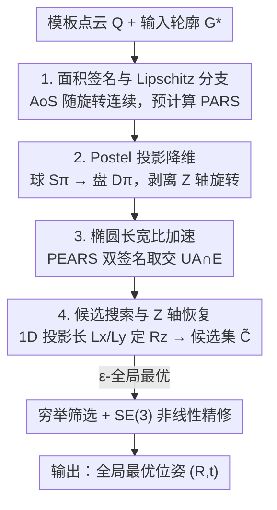

# Globally Optimal Pose from Orthographic Silhouettes

**会议**: CVPR 2026  
**论文**: [CVF Open Access](https://openaccess.thecvf.com/content/CVPR2026/html/Sengupta_Globally_Optimal_Pose_from_Orthographic_Silhouettes_CVPR_2026_paper.html)  
**代码**: https://agnivsen.github.io/pose-from-silhouette/  
**领域**: 3D视觉  
**关键词**: 位姿估计, 物体轮廓, 全局最优, 正交投影, 形状签名  

## 一句话总结
给定一个已知 3D 模板和它在图像里的一条无遮挡轮廓线，本文把"从轮廓求位姿（Pose-from-Silhouette, PfS）"建模为在 $\mathbb{SO}(3)$ 上最小化两条轮廓的 Hausdorff 距离，利用"轮廓面积随旋转连续变化"这一被忽视的性质把搜索空间强分支，得到**第一个对任意形状（不限凸性与亏格）、无需对应点的全局最优 PfS 解法**，在合成与真实数据上的朝向误差比最接近的基线低 ~86%–90%。

## 研究背景与动机

**领域现状**：从单张图像估计 3D 物体位姿，主流靠物体模板与图像之间的**点对应**（特征匹配、PnP 一类）。当纹理稀缺、只剩一条物体外轮廓（silhouette）可用时，对应关系无从建立。

**现有痛点**：现有"用轮廓"的方法几乎都把轮廓**当作辅助线索**，必须搭配特征对应、图像灰度或时序先验才能工作。纯粹"只给轮廓求位姿"在一般形状上**没有全局最优解法**：已有的工作要么只针对特殊形状（椭球、旋转体、柱体），要么是依赖初值的局部方法（深度学习的 Deep Active Contours 需要初始位姿且要边界颜色），要么是带随机性的粒子群（PSO）方法（STI-Pose，依赖近似深度界、无最优性保证）。

**核心矛盾**：PfS 本身是**病态**的——搜索空间是非凸的 $\mathbb{SO}(3)$ 流形，目标函数（Hausdorff 距离）也非凸，加上对称形状会导致全局解不唯一。直接在 $\mathbb{SO}(3)$ 上做 Branch-and-Bound（BnB）虽然能保证全局最优，但代价高得不实用。

**本文目标**：在不假设形状凸性、亏格、对称性的前提下，**只用一条无遮挡轮廓 + 模板**，把位姿求到全局最优（直到离散化精度），且不需要初值。

**切入角度**：作者抓住一个简单但少有人用的性质——**轮廓所围面积（Area-of-Silhouettes, AoS）关于旋转是 Lipschitz 连续的**。既然连续，输入轮廓的面积就能在"所有可能旋转对应的面积曲面"上切出一条等值线，全局最优一定落在这条等值线附近，于是搜索空间从整个 $\mathbb{SO}(3)$ 被强分支到一个低维子集。

**核心 idea**：把"难搜的旋转空间"换成"易查的预计算形状签名响应面"——离线把模板在各个朝向下的面积（PARS）和拟合椭圆长宽比（PEARS）存成响应曲面，在线时用输入轮廓的面积/长宽比去查表分支，得到少量候选旋转后再穷举筛选，最后做流形精修。

## 方法详解

### 整体框架

问题被写成一个带约束的优化：设模板点云为 $Q\in\mathbb{R}^{3\times M}$，旋转 $R\in\mathbb{SO}(3)$、平移 $t\in\mathbb{R}^2$ 作用后的正交投影轮廓为 $\tilde{S}(Q,R,t)=S\!\big(\Pi_O(RQ+(t^\top,0)^\top)\big)$，目标是让它与输入轮廓 $G^*$ 的 Hausdorff 距离最小：

$$\min_{R\in\mathbb{SO}(3),\,t\in\mathbb{R}^2} H(\tilde{G},G^*),\quad \text{s.t. }\tilde{G}=\tilde{S}(Q,R,t).$$

整条管线分**离线**与**在线**两段。离线阶段：把旋转空间重参数化到一个二维圆盘上，半稠密采样，记录每个朝向对应的轮廓面积和椭圆长宽比，得到两张响应面 PARS、PEARS。在线阶段：对输入轮廓算出面积与长宽比，分别和 PARS、PEARS 求交得到候选旋转集合，再用 1D 投影长度恢复绕 Z 轴的旋转、补齐 $\tilde{C}$，最后在这个**大幅缩小**的可行集上穷举筛选并做 $SE(3)$ 流形上的非线性精修。

### 关键设计

**1. 面积签名与 Lipschitz 分支：用连续的面积曲面把 SO(3) 强分支**

直接在非凸的 $\mathbb{SO}(3)$ 上做 BnB 太贵，作者改用一个全局几何特征——轮廓所围**面积** $\mathcal{A}(\tilde{G})$——来切分搜索空间。关键性质是 **Theorem 1**：只要模板能用有限多个三角形表示，$\mathcal{A}(\tilde{G})$ 关于任意 Lipschitz 连续的旋转序列就是 Lipschitz 连续的，因而几乎处处可微且梯度有界。这意味着存在一个映射 $\vartheta:\mathbb{SO}(3)\mapsto\mathbb{R}$ 把每个朝向映到它的轮廓面积，所有可能的 $\mathcal{A}(\tilde{G})$ 构成一张**连续曲面**。由于 $H(\tilde{G},G^*)\approx 0$ 必然蕴含 $|\mathcal{A}(G^*)-\mathcal{A}(\tilde{G})|\approx 0$，输入面积 $\mathcal{A}(G^*)$ 与这张曲面相交得到的等值线**必定包含全局最优**。把这条等值线当作候选集，就把"在整个 $\mathbb{SO}(3)$ 暴搜"变成了"沿一条低维等值线找"，这是全局最优却可行的根本来源。

**2. Postel 投影降维：把球面冗余压成一张二维圆盘**

面积签名对平移 $t$ 和绕 Z 轴旋转 $R_Z$ 都不变（投影在 XY 平面上），因此 $t$ 可由两条轮廓质心之差 $t=\mathcal{C}(\tilde{S}(Q,I_3,0))-\mathcal{C}(G^*)$ 直接闭式求出，搜索只需关注让面积平滑变化的 X、Y 轴旋转 $R_{XY}$。但欧拉角因 $R_{XY}$ 与 $R_Z$ 不对易而不好用，作者改用 **Postel 投影**（方位等距投影）：把"绕单位向量 $\hat v$ 转角 $\alpha$"的旋转映成点 $\alpha\hat v$，落在半径 $\pi$ 的"Postel 球" $S_\pi$ 内。再借 **Lemma 1**——只要 $\hat v$ 与 Z 轴夹角相同，面积签名就相同——把球面进一步塌缩到它与 XZ 平面相交的**Postel 圆盘** $D_\pi\subset\mathbb{R}^2$。于是离线只需在二维圆盘 $D_\pi$ 上半稠密采样，记录每点的面积，得到响应面 **PARS（Projected Area Response Surface）**，这是一个非单射映射 $\mathcal{A}:D_\pi\mapsto\mathbb{R}$。把三维旋转搜索压成二维查表，是整套方法效率可行的支点。

**3. 椭圆长宽比加速：第二个全局签名进一步分支**

只靠面积切出的等值线 $U_\mathcal{A}$ 仍可能较大。作者引入第二个全局签名——给投影轮廓代数拟合一个椭圆 $E$，取其**长短轴之比 $AR_E$**。$AR_E$ 在多数情况下也启发式地关于旋转 Lipschitz 连续（无需严格证明，因为它只用于加速、不影响全局最优性）。同样在 $D_\pi$ 上学一张响应面 **PEARS（Projected Elliptical Aspect Response Surface）** $\mathcal{E}:D_\pi\mapsto\mathbb{R}$。在线时先用面积求交得 $U_\mathcal{A}$，再用长宽比求交得 $U_\mathcal{E}$，取两者的近邻交集 $U_{\mathcal{A}\cap\mathcal{E}}$（在每个点周围一个无穷小圆 $\epsilon_\cap$ 内算"相交"），候选区域被压得更小。两个独立的全局签名联合分支，把候选数量进一步压低。

**4. 候选搜索、Z 轴恢复与 ε-全局最优：补齐绕 Z 轴的自由度并保证最优**

因为 $D_\pi$ 只覆盖 $R_{XY}$、对 $R_Z$ 不敏感，候选集还缺绕 Z 轴的旋转。作者利用轮廓沿 X、Y 方向的 **1D 投影长度** $L_x(\tilde{G})$、$L_y(\tilde{G})$ 作为额外约束：对每个候选点 $d_j$，在 $\theta_{z,k}\in U(0,2\pi)$ 上均匀采样 Z 轴角，令 $R_c=R_z F(G(d_j))$，凡同时满足 $|L_x(\tilde{S}(Q,R_c,t))-L_x(G^*)|\le\epsilon_z$ 且 $|L_y(\cdot)-L_y(G^*)|\le\epsilon_z$ 的就收为候选，汇成全局候选集 $\tilde{C}=\bigcup_j C_j$，再在这个**已大幅缩小**的可行集上穷举筛选。**Theorem 2（ε-全局最优）**保证 $\tilde{C}$ 中必存在一个解，它到 $\mathbb{SO}(3)$ 上全局最优的距离被 $\epsilon_o$ 界住，且当采样阈值 $\epsilon_{xy},\epsilon_z\to0$ 时 $\epsilon_o\to0$——即采样越细越逼近真全局最优。实践中对 $|\tilde{C}|$ 设上界 $\lambda_c$（超了就随机剔除）以加速收敛。最后用一个**分辨率金字塔**逐级收紧 $(\epsilon_{xy},\epsilon_z,\epsilon_e,\epsilon_\cap)$ 直到 $H(\tilde{G},G^*)\le\epsilon_H$，并在 $SE(3)$ 切平面上做局部非线性精修，得到最终位姿 $(R_{ref},t_{ref})$。无精修版记作 **GlOptiPoS**，带精修版记作 **GlOptiPoS+**。

### 损失函数 / 训练策略

本方法不含可学习参数，无训练。优化目标即 Hausdorff 距离 $H(\tilde{G},G^*)$（式 (2)），精修阶段用标准 $SE(3)$ 流形优化器沿切平面下降并回缩。对**透视投影**，由于透视把签名与平移耦合，全局最优性不直接成立；作者沿用先验的"粗深度先验"假设（来自 RGB-D 或单目估计），在该深度下离线预计算透视版 PARS/PEARS，再走同样流程，得到 GlOptiPoSΠ / GlOptiPoSΠ+，达到**近最优**精度。

## 实验关键数据

实验用三个 3D 模型 Stanford Bunny (SB)、Phlegmatic Dragon (PD)、Pelvic Bone (PB)（约 2.9 万点）做正交投影合成实验，并用 BcOT 真实数据集的 20 个物体做透视实验。指标：朝向误差 OE（度）、平移误差 TE、整体 RMSE（TE/RMSE 对合成数据按包围盒最大对角线 LDoBB 的百分比、对 BcOT 按 mm）。对比方法含非线性精修 NlR、投影-精修 Nl-PaR、多起点全局优化 Ms-GO，以及最接近的近期基线 STI-Pose（及其正交版 STI-PoseΠO）。

### 主实验（正交轮廓，均值，对比第二好的 STI-PoseΠO）

| 模型 | 指标 | STI-PoseΠO | **GlOptiPoS+** | mean OE 改善 |
|------|------|-----------|----------------|--------------|
| SB | OE / RMSE / TE | 3.12 / 9.75 / 9.74 | **0.32 / 0.46 / 0.14** | 89.74% |
| PD | OE / RMSE / TE | 4.29 / 101.55 / 101.41 | **0.61 / 0.91 / 0.32** | 85.78% |
| PB | OE / RMSE / TE | 3.47 / 78.99 / 78.90 | **0.50 / 0.76 / 0.26** | 85.59% |

GlOptiPoS+ 在所有形状上的**平均 OE 都 ≪ 1°**，而 STI-PoseΠO 虽是第二名，其最大误差却高得离谱（OE 可达 ~110°，源于其随机性），最坏情况甚至差于 NlR/Nl-PaR/Ms-GO。本方法最坏 OE 约 8.6°（PB，源于数值伪影，非"灾难性"）。值得注意的是无精修的 GlOptiPoS 因平移闭式求解而 TE 更准，GlOptiPoS+ 在 $SE(3)$ 上优化时优先压低 OE、轻微牺牲 TE。

### 透视轮廓（BcOT 真实数据，RMSE/mm，代表性非对称物体）

| 物体 | STI-Pose-B | **GlOptiPoSΠ+** |
|------|-----------|-----------------|
| Cat | 19.29 | **0.72** |
| Stitch | 18.87 | **0.71** |
| Driller | 62.74 | **1.31** |
| Standtube | 29.05 | **1.08** |
| Wall Shelf | 37.30 | **0.76** |

GlOptiPoSΠ+ 在所有形状上整体最优，第二名在 RMSE/TE 上由 STI-Pose-B 与扰动版 GlOptiPoSΠ±8 瓜分；而在 OE 上 GlOptiPoSΠ±8 反超 STI-Pose-B，印证本方法在**朝向估计**上的优势。STI-Pose-A 在所有指标都明显落后，说明 STI-Pose 对不准的深度界很敏感。非对称物体精度极高，对称物体因多解模糊而下降——这是只用轮廓的几何宿命。

### 消融与分析

| 分析维度 | 现象 | 结论 |
|----------|------|------|
| 噪声鲁棒性 | 低/中噪声下排名第一的候选 100% 成功；高噪声时最优候选下沉到更深层级 | 候选采样足够时仍能恢复，符合"优雅降级" |
| 阈值 $\epsilon_\cap$ | RMSE 随 $\epsilon_\cap\in[0,0.15]$ 呈 V 形，在 ~0.08 最小（维持 $\lambda_c\approx10^2$） | 候选数与精度需平衡 |
| 对称性↔候选数 | $|\tilde{C}|$ 随对称性下降近似对数衰减，完美球体则指数级爆炸 | 真实（弱对称）物体效率更高，强对称物体本质模糊 |
| 模板点数 $P$ | 精度随 $P\in[100,29121]$ 上升、但运行时间增加 | 精度-耗时折中 |

**关键发现**：① 候选集大小 $|\tilde{C}|$ 是衡量难度的天然代理——对称性越强候选越多、越慢、越易模糊；② 两个全局签名（面积 + 椭圆长宽比）联合分支是把暴搜变可行的关键，缺一会让候选集过大；③ 透视下精度对深度先验偏差敏感（Ape 的中位精度稳但会出离群大误差），但 ±8cm 扰动仍可用。

## 亮点与洞察
- **把"难优化"换成"易查表"**：核心洞察是 AoS 关于旋转 Lipschitz 连续，于是用预计算响应面 + 等值线求交代替昂贵的 $\mathbb{SO}(3)$ BnB，既保全局最优又实用——这是可迁移的思路（任何"随位姿连续变化的全局标量签名"都能照此分支）。
- **Postel 圆盘降维很漂亮**：通过"面积对 $t$、$R_Z$ 不变 + Lemma 1 的方位等价"两步，把三维旋转搜索硬塞进一张二维圆盘，离线预计算量大幅缩小。
- **双签名分支**：面积之外再加椭圆长宽比作第二把"分支刀"，且第二把刀不要求严格证明连续性（只用于加速），工程上很务实。
- **ε-全局最优是带证明的**：Theorem 2 给出"采样越细越逼近真最优"的可控保证，区别于 STI-Pose 这类无保证的随机方法。
- **候选数 = 难度代理**：用 $|\tilde{C}|$ 随对称性的衰减曲线把"为什么对称物体难"量化出来，是个有解释力的副产品。

## 局限与展望
- **强遮挡/重噪声无解**：作者承认在强遮挡或重噪声下会失败，且这类设定对所有"只用轮廓"的方法都是根本性病态——方法只针对无遮挡轮廓仍含信息的区间。
- **对称物体多解**：对称形状全局解不唯一，只能给出其中一个；完美球体候选数指数爆炸。
- **透视需深度先验**：透视版的全局最优性不成立，依赖外部粗深度（RGB-D 或单目），精度对深度偏差敏感。
- **运行时间偏长且未并行**：MATLAB 实现跑在 24 核 i9 上，运行时间是 BnB 类方法的典型量级，作者把并行化列为未来工作。⚠️ 论文未给具体绝对耗时数字，只做相对趋势分析。
- 个人观点：需要已知精确 3D 模板 + 干净分割轮廓，这在很多真实场景（未知物体、分割噪声）会受限；可探索把签名学习与轮廓提取联合、或对部分遮挡轮廓做鲁棒化。

## 相关工作与启发
- **vs STI-Pose（粒子群，最接近的基线）**：STI-Pose 依赖近似深度界、随机且无最优性保证，最大误差可达 ~110°；本文给出带证明的 ε-全局最优，平均 OE ≪1°，正交下 mean OE 改善 ~86%–90%。
- **vs Deep Active Contours（DAC）等深度方法**：DAC 是局部方法，需要初始位姿且要边界颜色信息；本文无需初值、不需颜色，纯几何。
- **vs 专用形状解法（椭球-椭圆 P1E、旋转体、柱体）**：这些只对特定形状成立；本文对任意凸性/亏格的形状通用。
- **vs 经典 BnB（Hartley & Kahl）**：本文在其框架上引入"随朝向连续变化的轮廓签名"实现非平凡分支，避免了对整个 $\mathbb{SO}(3)$ 暴力 BnB 的高昂代价。

## 评分
- 新颖性: ⭐⭐⭐⭐⭐ 首个对任意形状、无对应点的全局最优 PfS 解法，AoS 连续性 + 响应面分支的思路新颖且有证明。
- 实验充分度: ⭐⭐⭐⭐ 合成（3 模型）+ 真实（BcOT 20 物体）、正交与透视、噪声/对称/参数消融齐全；但绝对耗时与并行性未充分量化。
- 写作质量: ⭐⭐⭐⭐ 问题建模与定理脉络清晰，但大量关键推导（算法 1/2、证明）放在补充材料，正文略密。
- 价值: ⭐⭐⭐⭐ 在机器人、医学影像、AR 等只能拿到轮廓的场景有实用价值，且提供了可复用的"签名分支"范式。

<!-- RELATED:START -->

## 相关论文

- [\[CVPR 2026\] Revisiting Optimal Coding for I-ToF under Practical Sensor Constraints](revisiting_optimal_coding_for_i-tof_under_practical_sensor_constraints.md)
- [\[ICML 2026\] Streaming Sliced Optimal Transport](../../ICML2026/3d_vision/streaming_sliced_optimal_transport.md)
- [\[CVPR 2026\] Energy-GS: Image Energy-guided Pose Alignment Gaussian Splatting with redesigned pose gradient flow](energy-gs_image_energy-guided_pose_alignment_gaussian_splatting_with_redesigned_.md)
- [\[ICML 2026\] AvAtar: Learning to Align via Active Optimal Transport](../../ICML2026/3d_vision/avatar_learning_to_align_via_active_optimal_transport.md)
- [\[CVPR 2026\] SceneMaker: Open-set 3D Scene Generation with Decoupled De-occlusion and Pose Estimation Model](scenemaker_open-set_3d_scene_generation_with_decoupled_de-occlusion_and_pose_est.md)

<!-- RELATED:END -->
