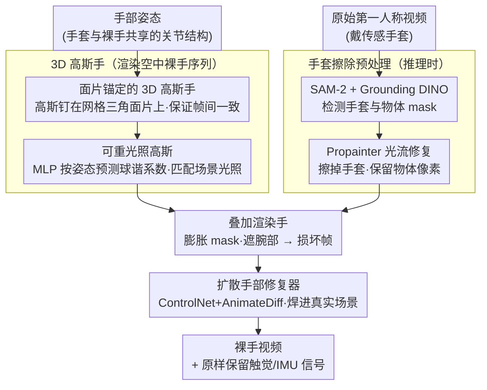

# Glove2Hand: Synthesizing Natural Hand-Object Interaction from Multi-Modal Sensing Gloves

**会议**: CVPR 2026  
**arXiv**: [2603.20850](https://arxiv.org/abs/2603.20850)  
**代码**: [https://mlzxy.github.io/glove2hand](https://mlzxy.github.io/glove2hand)  
**领域**: 3D视觉  
**关键词**: 手物交互、传感手套、视频翻译、3D高斯手模型、扩散模型

## 一句话总结
提出 Glove2Hand 框架，将佩戴传感手套的第一人称视频翻译为逼真的裸手视频，同时保留触觉和 IMU 信号，并构建了首个多模态手物交互数据集 HandSense，显著提升下游裸手接触估计和遮挡手部追踪性能。

## 研究背景与动机

**领域现状**：手物交互（HOI）理解是计算机视觉、机器人和 AR/VR 的基础问题。当前主流方法通过采集第一人称视频来开发数据驱动算法，但这些系统基本只依赖视觉模态。

**现有痛点**：纯视觉 HOI 数据存在两大根本性缺陷：(1) 缺乏力和接触等物理量信息，现有方法如 ContactPose 只能估计二值指尖接触且仅适用于预扫描刚体；(2) 有限视角导致严重的手部遮挡，多相机工作室方案在野外不可行。传感手套虽能提供 IMU 和触觉信号，但手套与裸手之间巨大的外观差异使得在手套数据上训练的视觉模型无法泛化到裸手任务。

**核心矛盾**：传感手套提供了丰富的物理信号但引入了domain gap，而裸手视频有好的视觉但缺少物理信息——这两者之间存在无法调和的矛盾。

**本文目标** 如何将传感手套视频翻译为逼真裸手视频，同时保留触觉/IMU，使物理信号能用于裸手学习任务？具体子问题包括：(1) 实现跨帧时空一致性（而非只处理静态图像）；(2) 处理与未知/非刚性物体的复杂交互。

**切入角度**：关键观察是尽管手套和裸手外观差异巨大，但两者共享相同的关节结构（hand pose）。因此可以将问题分解为两步：先将手套视频变成一致的空中裸手序列（用3D重建保证一致性），再将裸手嵌入场景并修复交互细节（用扩散模型保证灵活性）。

**核心 idea**：结合3D高斯手模型的时空一致性和扩散手部修复器的生成灵活性，实现传感手套到裸手的视频翻译，同时保留多模态传感信号。

## 方法详解

### 整体框架
这篇论文要把"戴着传感手套的第一人称视频"翻译成"看起来像裸手的视频"，同时把手套测到的触觉和 IMU 信号原样保留下来——这样物理信号就能拿去训练裸手任务的模型。难点在于手套和裸手长得完全不一样，但两者的关节姿态是共享的，于是作者把翻译拆成两步走，各管一件事。第一步用一个 3D 高斯手模型，只吃手部姿态，渲染出一段在帧间不抖、光照对得上的"空中裸手"序列，靠几何重建保证时空一致；第二步用一个扩散手部修复器，把这段渲染手"焊"进真实场景里，修好它和物体的接触边界、和手腕的衔接。推理时还要先把画面里的手套擦掉：用检测器框出手套区域，再用光流把它补成背景，物体像素保留不动，然后才叠上渲染手交给扩散模型收尾。

### 关键设计

**1. 面片锚定的 3D 高斯手：让渲染出来的裸手在帧间不抖**

时空一致性是整个 pipeline 的地基——如果逐帧渲染的手会抖、会闪，后面再怎么修也救不回来。作者的做法是把 3D 高斯直接钉在规范手部网格的三角面片上，每个高斯用重心坐标权重 $\mathbf{w}$、2D 尺度 $\mathbf{s}$ 和旋转 $\phi$ 参数化，相当于让高斯"贴"在网格表面活动而不是自由漂在 3D 空间里。手做动作时不需要给每个高斯单独算线性蒙皮，只要把网格三角形变形，再用 2D 仿射变形梯度 $\mathbf{A}=\mathbf{M}_{\text{deform}}\mathbf{M}_{\text{canon}}^{-1}$ 把高斯椭圆跟着映射过去即可。和 2DGS 那种"先在 3D 空间定义高斯、再用正则项硬把它们压成面"的做法相比，这里直接拿网格面当几何先验，先验更强、变形也更稳；同时网格自带的表面法线还顺手为下一步的光照估计提供了一致来源。

**2. 可重光照高斯：让渲染手的明暗跟着第一人称场景走**

第一人称视频里光照是一直变的——手转个方向、走进阴影，亮度就不一样，渲染手如果光照固定就会显得"贴上去"的假。作者用一个小 MLP 根据手部姿态 $\mathbf{P}$ 预测球谐系数 $\mathbf{l}$，把颜色拆成固有色与光照的乘积 $\mathbf{c}\odot\text{SH}(\mathbf{l},\mathbf{n})$，并且给手掌和手背各预测一套独立的环境贴图。这里能成立的关键还是上一条：法线来自网格几何而不是高斯本身，所以"到底是固有色暗还是光照暗"这个经典的 albedo-illumination 歧义被大幅压下去了。相比之下 LumiGauss 假设场景只有一张静态环境贴图，搬到光照动态变化的第一人称场景就不够用。

**3. 扩散手部修复器：把渲染手"焊"进真实场景**

光有一段干净的"空中裸手"还不够——直接糊到原视频上会出现手穿进物体、悬浮在半空、腕部衔接生硬、手套边缘残留这些毛病。作者基于 ControlNet + AnimateDiff 训练一个修复器，训练时故意制造"损坏"输入：把渲染手叠到裸手视频帧上，膨胀 mask、遮住腕部区域，让网络学会从这种损坏状态恢复出原始的干净视频。推理时这套损坏-恢复的能力就用来收尾：先用 SAM-2 + Grounding DINO 检测手套和物体 mask，用 Propainter 光流修复把手套区域擦成背景、物体像素原样保留，再叠上渲染手送进修复器。选择在像素域用扩散模型处理交互和背景，而不是去显式建模物体几何，是因为物体未知且可能非刚性，像素域生成要灵活得多。

### 一个完整示例

拿一帧"戴手套握住一个瓶子"的画面走一遍：手套姿态先喂给面片锚定高斯手，渲染出一只悬空、帧间稳定、明暗匹配当前光照的裸手；与此同时 SAM-2 + Grounding DINO 在原帧上框出手套和瓶子，Propainter 用光流把手套区域擦掉补成背景，瓶子像素原封不动留着；接着把渲染的裸手叠回到这张"少了手套、留着瓶子"的帧上，膨胀 mask、遮住手腕，得到一张明显"损坏"的合成帧；最后扩散修复器把它恢复成自然画面——裸手贴合瓶子表面、接触处无穿透、手腕平滑过渡、手套伪影消失。整段视频逐帧这么处理，触觉和 IMU 信号则全程原样挂在对应帧上，于是输出就是一段"裸手 + 完整物理信号"的视频。

### 损失函数 / 训练策略
3D 高斯手模型用图像重建损失通过可微渲染训练，每个受试者单独优化一个模型；冻结受试者专属的高斯手之后，再训练一个统一的扩散手部修复器。训练数据来自 HOT3D 和 HandSense。

## 实验关键数据

### 主实验

| 方法 | FID ↓ | FVD ↓ | FVD-long ↓ |
|------|-------|-------|------------|
| HandRefiner | 35.5 | 24.2 | 29.7 |
| BrushNet | 37.9 | 34.5 | 40.4 |
| Pix2Pix | 38.6 | 24.7 | 31.4 |
| **Glove2Hand (Ours)** | **30.1** | **19.5** | **24.5** |

### 消融实验

| 配置 | FID ↓ | FVD ↓ | FVD-long ↓ |
|------|-------|-------|------------|
| 2DGS | 91.1 | 50.0 | 62.9 |
| +Surface Grounding | 60.3 | 35.1 | 46.6 |
| +Relightable | 56.7 | 30.7 | 40.2 |
| +Diffusion | 32.3 | 19.8 | 22.7 |
| +Glove Removal | 31.2 | 20.9 | 25.0 |
| +Object Mask (Full) | 30.1 | 19.5 | 24.5 |

### 下游任务：接触估计

| 训练数据 | Contact IoU (%) | Precision (%) | Recall (%) |
|----------|----------------|---------------|------------|
| Glove only | 71.5 | 82.8 | 83.9 |
| G2H only | 75.6 | 90.6 | 82.0 |
| Hand only | 85.3 | 90.0 | 94.2 |
| **Hand + G2H** | **88.2** | **92.6** | **94.9** |

### 下游任务：遮挡手部追踪

| 方法 | MKPE (Occ) ↓ | MKPE (All) ↓ |
|------|-------------|-------------|
| UmeTrack | 19.2 | 19.5 |
| UmeTrack + Glove | 27.2 | 26.5 |
| **UmeTrack + G2H** | **16.6** | **17.8** |

### 关键发现
- Surface Grounding 和 Diffusion Restorer 贡献最大，分别带来 FID 从 91.1→60.3 和 56.7→32.3 的大幅下降
- 直接在手套数据上训练手部追踪器反而恶化性能（19.5→26.5），证实domain gap的严重性
- 合成裸手视频与真实裸手数据结合训练接触估计器达到最佳效果，验证了框架作为数据生成引擎的价值
- 人类评估显示生成的手在静态图像中几乎无法与真实手区分

## 亮点与洞察
- 将硬件传感（触觉+IMU）与视觉生成对齐，开辟了"传感器作为免标注ground-truth"的数据生成范式，这个思路可迁移到其他需要昂贵标注的领域
- 面片锚定高斯的设计非常优雅：一个简单的几何先验同时解决了时空一致性、重光照和变形三个问题，且实现极简
- 从 unpaired 数据学习 glove-to-hand 映射，避免了配对数据的采集成本

## 局限与展望
- 每个受试者需要单独优化一个3D高斯手模型，限制了直接推广到新用户
- 依赖 SAM-2 和 Grounding DINO 的自动化流水线，可能在极端遮挡或复杂背景下失败
- 数据集规模有限（5个受试者），泛化性还需更大规模验证
- 非刚性物体交互虽然在像素域灵活处理，但缺乏物理合理性保证（如力一致性）

## 相关工作与启发
- **vs HandRefiner**: HandRefiner 是扩散独有方法聚焦单帧手部修复，本文结合3D重建保证时空一致性，FID 低 5.4 点
- **vs 手部Avatar方法 (HandSplat等)**: 传统Avatar需要密集多视角和受控光照，本文的surface-grounded设计适应稀疏egocentric相机和动态光照
- **vs MeDM等视频翻译方法**: 通用视频翻译无法处理手套-裸手之间巨大的 embodiment 差异，本文利用共享关节结构解耦问题

## 评分
- 新颖性: ⭐⭐⭐⭐ 面片锚定高斯+扩散修复的组合架构新颖，但各组件单独看是已有技术的良好整合
- 实验充分度: ⭐⭐⭐⭐⭐ 视频质量评估+人类评估+两个下游任务+完整消融，非常全面
- 写作质量: ⭐⭐⭐⭐⭐ 问题定义清晰，方法动机链完整，图示直观
- 价值: ⭐⭐⭐⭐ 为HOI领域提供了新的数据生成范式，HandSense数据集有长期价值

<!-- RELATED:START -->

## 相关论文

- [\[AAAI 2026\] STMI: Segmentation-Guided Token Modulation with Cross-Modal Hypergraph Interaction for Multi-Modal Object Re-Identification](../../AAAI2026/3d_vision/stmi_segmentation-guided_token_modulation_with_cross-modal_hypergraph_interactio.md)
- [\[CVPR 2026\] CARI4D: Category Agnostic 4D Reconstruction of Human-Object Interaction](cari4d_category_agnostic_4d_reconstruction_of_human_object_interaction.md)
- [\[CVPR 2026\] PAD-Hand: Physics-Aware Diffusion for Hand Motion Recovery](pad-hand_physics-aware_diffusion_for_hand_motion_recovery.md)
- [\[CVPR 2026\] AffordGrasp: Cross-Modal Diffusion for Affordance-Aware Grasp Synthesis](affordgrasp_cross-modal_diffusion_for_affordance-aware_grasp_synthesis.md)
- [\[CVPR 2026\] ArtHOI: Taming Foundation Models for Monocular 4D Reconstruction of Hand-Articulated-Object Interactions](arthoi_taming_foundation_models_for_monocular_4d_reconstruction_of_hand-articula.md)

<!-- RELATED:END -->
