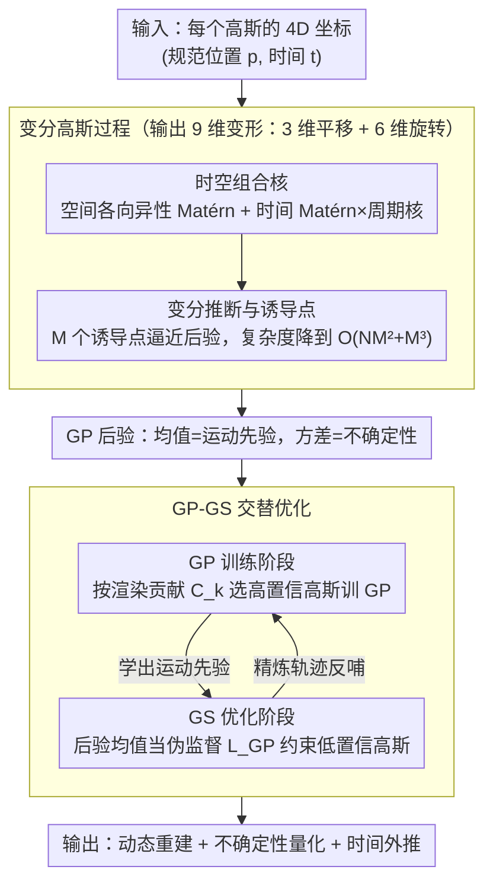

# GP-4DGS: Probabilistic 4D Gaussian Splatting from Monocular Video via Variational Gaussian Processes

**会议**: CVPR 2026  
**arXiv**: [2604.02915](https://arxiv.org/abs/2604.02915)  
**代码**: 无  
**领域**: 3D视觉  
**关键词**: 4D高斯溅射、高斯过程、不确定性量化、运动外推、动态场景重建

## 一句话总结
提出 GP-4DGS，将变分高斯过程（GP）整合到 4D 高斯溅射中，通过时空组合核和变分推断实现概率化运动建模，同时赋予 4DGS 不确定性量化、运动外推和自适应运动先验三大新能力。

## 研究背景与动机

**领域现状**：4D 高斯溅射（4DGS）是动态新视角合成的主流方法，通过将 3D 高斯原始体随时间变形来建模动态场景。现有方法如 D-3DGS（MLP变形）、4DGS（HexPlane）、STG（多项式变形）已达到很好的视觉质量。

**现有痛点**：(1) 现有方法将运动视为确定性优化问题，施加手工设计的运动先验（多项式变形、刚性约束等），这些固定先验在所有原始体上统一应用，对观测不充分或被遮挡的区域不合适；(2) 缺乏对运动预测的不确定性估计机制；(3) 无法在训练帧之外进行时间外推。

**核心矛盾**：固定的确定性运动先验无法区分观测良好和观测稀疏的区域——对前者过度约束，对后者约束不足。需要一种能根据观测置信度自动调节正则化强度的机制。

**本文目标** (1) 如何为 4DGS 的运动预测提供原理性的不确定性量化？(2) 如何从观测良好的区域学习运动先验并传播到稀疏/未观测区域？(3) 如何实现训练帧之外的时间外推？

**切入角度**：高斯过程天然是概率函数族上的分布，其核函数定义了数据之间的相关结构。将 GP 用于建模变形场，可同时实现自适应先验、不确定性量化和外推——这些能力直接来自GP的概率公式化，无需额外建模。

**核心 idea**：用变分高斯过程替代确定性变形函数，通过时空组合核捕获几何和运动相关性，在GP后验均值引导4DGS优化的同时自然获得不确定性和外推能力。

## 方法详解

### 整体框架
GP-4DGS 想解决的问题是：单目视频里大量高斯原始体的运动只有零星几帧的可靠观测，旧方法靠手工固定先验硬套，既约束不住稀疏区也压死了密集区。它的做法是把"每个高斯怎么动"从一个确定性的变形函数换成一个**变分高斯过程**——把每个原始体的 4D 坐标 $\mathbf{x}=(\bm{p}, t)$（规范 3D 位置加时间）喂给 GP，由 GP 输出 9 维变形向量（3 维平移加 6 维连续旋转表示）。整条 pipeline 是两阶段交替转的：先在观测可靠的那批高斯上训练 GP、学出运动的相关结构，再回到 4DGS 优化阶段，用 GP 的后验均值当伪监督去约束那些观测不足、容易乱动的高斯。因为 GP 本身就是"函数上的概率分布"，不确定性、外推、自适应先验这三件事不用额外建模，直接从它的后验里读出来。

### 关键设计

**1. 时空组合核：让空间几何和时间运动各管各的相关性**

痛点在于标准 GP 核默认各向同性，可时空数据里"两个高斯在空间上挨得近"和"同一个高斯在不同时刻"是两种完全不同的相关结构，用一个核硬描述必然顾此失彼。GP-4DGS 把核拆成空间项和时间项相加 $k_i(\mathbf{x},\mathbf{x}') = k_i^{\text{spatial}}(\bm{p},\bm{p}') + k_i^{\text{temporal}}(\mathbf{x},\mathbf{x}')$。空间部分用各向异性 Matérn 核而不是 RBF，因为 Matérn 容许不连续，能干净地隔开空间上不连通的不同物体；时间部分则把逐轴 Matérn 核乘上一个周期核

$$k^{\text{periodic}}(t,t') = \sigma^2 \exp\!\left(-\frac{2\sin^2(\pi|t-t'|/\tau)}{\ell^2}\right)$$

让相关性随运动周期 $\tau$ 起伏，同时保留空间局部性。这个周期核是整套方法能做时间外推的关键——它给"运动会循环"这件事注入了强归纳偏置，所以预测训练帧之外的时刻时不会发散。

**2. 变分推断与诱导点：把 GP 算得动**

精确 GP 推断是 $\mathcal{O}(N^3)$，面对一个场景动辄数万个高斯根本跑不起来。这里引入 $M$ 个诱导点 $\mathbf{Z}=\{\mathbf{z}_m\}_{m=1}^M$（$M \ll N$）当作 GP 的"代表性支撑集"，并用变分后验 $q(\mathbf{u}_i)=\mathcal{N}(\mathbf{m}_i, \mathbf{S}_i)$ 去逼近真实后验，通过最大化 ELBO 同时学核超参、诱导点位置和变分参数。这样整体复杂度降到 $\mathcal{O}(NM^2+M^3)$，单个查询点只要 $\mathcal{O}(M)$，数万原始体的推断才变得可行。诱导点不是随便撒的：先用 Chronos 从每个原始体的时间序列里提特征，再 k-means 聚类挑出有代表性的规范位置，时间轴上均匀采样——论文里这种基于时序特征的初始化比随机或按速度初始化拿到更高的 ELBO（平均 1.53 对 1.10 对 1.37）。

**3. GP-GS 交替优化：让可靠观测和运动先验互相喂**

GP 和 4DGS 哪个都不能单独把场景重建好，所以这里设计成两阶段交替、互为反馈。GP 训练阶段先给每个原始体算一个置信度——累积它在所有图像所有光线上的渲染贡献 $C_k = \sum_{\mathbf{I}}\sum_{\mathbf{r}} \omega_{k,t}^{\pi}(\mathbf{r})$，只挑 $C_k > \tau_C$ 的高置信子集来训 GP，并往空间坐标里注点噪声当正则化，确保学到的运动先验来自真正看得清的那批高斯。GS 优化阶段反过来，把 GP 的后验均值 $\bar{\bm{\mu}}$ 当伪监督信号，对偏离 GP 预测的原始体施加正则

$$\mathcal{L}_{\text{GP}} = \frac{1}{NT}\sum_{k,t} \delta_{(k,t)} \left\|\mathbf{y}_{(k,t)} - \bar{\bm{\mu}}_{(k,t)}\right\|^2$$

其中门控阈值 $\tau_\delta$ 随训练逐步收紧、约束越来越严，GP 预测每 2000 步缓存一次以省算力。两阶段这么转下来形成自强化循环：看得清的区域不断精炼出更准的运动先验，这个先验又回头稳住看不清区域的轨迹，把噪声和抖动磨平成物理上更合理的运动。

### 一个完整示例
设想一个被前景手臂周期性遮挡的背景高斯：它在 15 帧视频里只有 4 帧被清晰观测到，其余帧贡献度 $C_k$ 很低。GP 训练阶段只会从那 4 帧可靠数据里学这个高斯的运动相关性，靠周期核推断出它遮挡期间应当沿着同一周期继续摆动；回到 GS 优化阶段时，门控 $\delta$ 对这个低置信高斯打开，$\mathcal{L}_{\text{GP}}$ 就用 GP 推出的后验均值把它拉回合理轨迹，而不是任由稀疏观测把它优化飞。与此同时，GP 后验在遮挡帧上方差很大——这部分方差直接被读作不确定性输出，越是观测不足的时刻不确定性越高。

### 损失函数 / 训练策略
总损失 $\mathcal{L}_{\text{total}} = \mathcal{L}_{\text{recon}} + \lambda_{\text{GP}}\mathcal{L}_{\text{GP}}$，$\lambda_{\text{GP}}=0.1$。重建损失沿用 SoM 的光度损失、D-SSIM、流损失和平滑损失。不确定性通过蒙特卡洛采样从 GP 后验获取（旋转的非线性变换无法直接传播方差，故走采样）。

## 实验关键数据

### 主实验（DyCheck）

| 方法 | mPSNR ↑ | mSSIM ↑ | mLPIPS ↓ |
|------|---------|---------|----------|
| D-3DGS | 11.92 | 0.49 | 0.66 |
| 4DGS | 13.42 | 0.49 | 0.56 |
| HyperNeRF | 15.99 | 0.59 | 0.51 |
| Gaussian Marbles | 15.84 | 0.54 | 0.57 |
| SoM | 17.09 | 0.65 | 0.39 |
| **GP-4DGS** | **17.38** | **0.65** | **0.37** |

### 运动外推实验（PSNR ↑）

| 方法 | 周期运动(5帧) | 周期运动(15帧) | 非周期运动(5帧) | 非周期运动(15帧) |
|------|-------------|-------------|--------------|--------------|
| Linear extrapolation | 11.55 | 8.11 | 15.02 | 11.92 |
| **GP-4DGS** | **17.62** | **16.65** | **15.27** | **13.22** |

### 不确定性量化（AUSE-MSE ↓ ×10⁻²）

| 方法 | Top 20 帧 | Top 40 帧 | 所有帧 |
|------|----------|----------|-------|
| Random | 9.76 | 9.30 | 10.98 |
| UA-4DGS | 7.60 | 8.11 | 8.62 |
| **GP-4DGS** | **7.22** | **8.00** | **8.49** |

### 关键发现
- 在 DyCheck 挑战子集上性能差距更大（mPSNR 14.56→15.02，mLPIPS 0.53→0.51），证明 GP 先验对稀疏观测区域最有价值
- 周期运动外推优势巨大（17.62 vs 11.55），因为周期核精确捕获了循环动力学
- GP 指导有效正则化了运动轨迹，消除噪声和波动，产生物理合理的运动模式
- 诱导点时间序列初始化比随机和速度 KNN 初始化一致取得更高 ELBO（平均 1.53 vs 1.10 vs 1.37）
- 在 DAVIS 极端视角偏移下保持了更好的几何结构完整性

## 亮点与洞察
- 将概率建模引入 4DGS 的思路非常优雅：不确定性量化和运动外推是 GP 概率公式化的自然副产物，无需额外设计。这种"免费获得"额外能力的方式比专门设计模块更干净
- GP-GS 交替优化的设计精巧：置信度加权的数据选择确保 GP 从可靠数据学习，GP 预测反过来指导不可靠区域——像是一种"自举学习"
- 时空组合核的设计有物理直觉：空间 Matérn 允许不连续（不同物体）、时间周期核编码运动规律性，两者正交组合

## 局限与展望
- GP 推断仍引入额外计算开销（每2000步更新一次GP缓存），对实时应用可能是瓶颈
- 周期核假设运动具有周期性，对于非周期复杂运动外推仍然有限（非周期场景提升较小）
- 仅在 DyCheck（7个场景）和 DAVIS 上评估，场景多样性有限
- 变分 GP 的近似精度受 inducing points 数量限制，极高分辨率场景可能需要更多inducing points

## 相关工作与启发
- **vs SoM（STG）**: SoM 使用多项式变形作为固定先验，GP-4DGS 学习数据自适应先验，在挑战子集上优势明显（14.56→15.02）
- **vs Stochastic GS**: Stochastic GS 对高斯属性建模随机变量但仅限静态场景，本文首次将概率建模扩展到4D动态场景
- **vs UA-4DGS**: UA-4DGS 尝试动态场景不确定性估计，但 GP-4DGS 通过核相关结构提供更可靠的校准（AUSE 更低）
- **vs D-3DGS/4DGS**: 这些确定性方法在稀疏观测区域缺乏约束，GP 的空间相关先验有效填补了这一空白

## 评分
- 新颖性: ⭐⭐⭐⭐⭐ 将 GP 与 4DGS 结合是全新的方向，时空核设计和交替优化策略有深度
- 实验充分度: ⭐⭐⭐⭐ 重建质量+外推+不确定性+消融全面覆盖，但评估场景数量较少
- 写作质量: ⭐⭐⭐⭐⭐ 数学推导严谨，方法动机清晰，图示精美
- 价值: ⭐⭐⭐⭐ 为4DGS引入概率建模开辟新方向，不确定性量化对自动驾驶等安全关键应用有实际价值

<!-- RELATED:START -->

## 相关论文

- [\[CVPR 2026\] 4C4D: 4 Camera 4D Gaussian Splatting](4c4d_4_camera_4d_gaussian_splatting.md)
- [\[CVPR 2026\] PackUV: Packed Gaussian UV Maps for 4D Volumetric Video](packuv_packed_gaussian_uv_maps_for_4d_volumetric_video.md)
- [\[CVPR 2026\] PhysHO: Physics-Based Dynamic 3D Gaussian Human and Object from Monocular Video](physho_physics-based_dynamic_3d_gaussian_human_and_object_from_monocular_video.md)
- [\[CVPR 2026\] 4DEquine: Disentangling Motion and Appearance for 4D Equine Reconstruction from Monocular Video](4dequine_disentangling_motion_and_appearance_for_4d_equine_reconstruction_from_m.md)
- [\[CVPR 2026\] Mark4D: Temporally-Consistent Watermarking for 4D Gaussian Splatting](mark4d_temporally-consistent_watermarking_for_4d_gaussian_splatting.md)

<!-- RELATED:END -->
