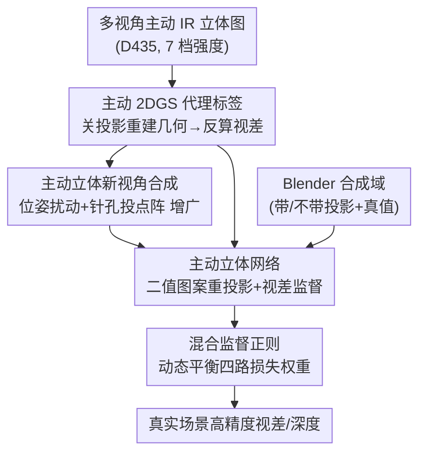

# GS-ASM: 2DGS-Supervised Active Stereo Matching

**会议**: CVPR 2026  
**论文**: [CVF Open Access](https://openaccess.thecvf.com/content/CVPR2026/html/Wu_GS-ASM_2DGS-Supervised_Active_Stereo_Matching_CVPR_2026_paper.html)  
**代码**: 待发布（论文称代码与数据集将开源）  
**领域**: 3D视觉  
**关键词**: 主动立体匹配, 深度估计, 2D高斯泼溅, 代理标签, 混合监督  

## 一句话总结
针对主动立体匹配缺真值、只能自监督导致精度受限的问题，本文用 2D 高斯泼溅（2DGS）从真实场景重建几何并渲染出高质量视差「代理标签」，把无真值的主动立体网络变成「有监督」训练，再配一套动态平衡代理监督与自监督的混合监督正则策略，在多种 backbone 上刷出 SOTA，并超过商用 RealSense D435 深度相机。

## 研究背景与动机
**领域现状**：主动立体相机（如 Intel RealSense D435）靠红外（IR）发射器把伪随机点阵投到场景上，两路 IR 相机拍下投影图案再做立体匹配，从而在弱纹理、重复纹理、非朗伯材质这些经典立体匹配会失败的区域也能拿到稠密深度，兼具主动传感的鲁棒和相机的低成本高分辨率，因此被工业界和学术界广泛使用。

**现有痛点**：商用相机内部仍用经典（手工）立体匹配算法，普遍存在过度平滑、物体边缘深度丢失、测量噪声大的问题。换成学习方法本可以更准更完整，但深度立体网络要靠海量 ground-truth 视差做监督，而主动立体匹配这个领域**几乎没有大规模带准确深度标签的真实数据集**——真实场景采集稠密准确深度极其昂贵耗时。

**核心矛盾**：缺真值 → 只能走两条退路，但都不够好。其一是**纯自监督**（用左右视图重投影误差当监督信号），损失不稳定，预测往往糊、细节差、精度低；其二是**合成数据监督**（用 Blender 造主动 IR 场景拿真值），清晰是清晰，但合成与真实之间存在 domain gap。ActiveZero 试图混合两者来缩 gap，合成集上不错，**一到真实场景就显著掉点**，甚至不如 D435 原生输出。

**本文目标**：在**不需要任何真值深度**的前提下，让主动立体网络也能享受「有监督训练」的精度——即直接在真实场景上产出可信的监督信号。

**切入角度**：作者观察到 2DGS 这类显式表面重建方法，能从多视角图像把真实场景几何重建出来；而且主动 IR 成像可分解为「环境光 + 投影图案」，只要在**关闭投影**的模式下重建几何，再从重建结果反算视差，就能得到一份和 D435 误差 1 像素内的「代理深度真值」。

**核心 idea**：用 2DGS 重建真实场景 → 渲染出视差**代理标签（proxy label）**当作伪真值，把主动立体匹配从「自监督」升级为「代理标签监督」，并借 2DGS 的新视角合成能力顺手做数据增广；同时设计动态权重策略缓和代理标签噪声带来的训练震荡。

## 方法详解

### 整体框架
GS-ASM 的输入是用手持 RealSense D435 在真实室内场景多视角采集的主动 IR 立体图（每个视角还在 7 档不同 IR 发射强度下各拍一组），输出是训练好的、能在真实场景做高精度视差/深度估计的主动立体网络。整条 pipeline 的关键不在网络本身（沿用 PSMNet / RAFT / StereoNet 等现成 backbone），而在于**怎么凭空造出监督信号**：先用「关投影」模式的 IR 图训一个主动 2DGS 模型重建场景几何，从渲染深度反算出视差代理标签；再利用 2DGS 的新视角渲染能力，对相机位姿做受限扰动合成更多带主动 IR 图案的立体对及其代理标签，扩充训练数据；最后把真实域（代理监督 + 自监督）和 Blender 合成域（真值监督 + 自监督）一起喂给立体网络，用一套自适应混合监督正则动态调节四路损失权重做稳定优化。

### 关键设计

**1. 主动 2DGS 代理标签生成：在「关投影」模式下重建几何，再反算出 1 像素内的视差伪真值**

这是全文的根基，针对的就是「真实主动立体没有真值」这个死穴。难点在于：主动 IR 图上叠着投影点阵，而点阵会**违反体渲染的假设**（它不是场景固有外观，而是打上去的图案），直接拿带图案的 IR 图去训 GS 会把图案错当几何。作者把 IR 成像显式建模为环境光、投影图案与噪声之和：$x_l(u,v) = I_l(u,v) + \alpha\cdot e\cdot K_l(u,v) + \epsilon,\; e\ge 0$，其中 $I_l$ 是环境光强、$K_l$ 是投影二值图案、$\alpha$ 是表面反射系数、$e$ 是图案发射强度、$\epsilon$ 是传感器噪声。关键一招是只取**发射功率为零（$e=0$）**的 IR 图来训 2DGS，这样渲染只捕捉纯场景几何、不被图案干扰。

选 2DGS 而非 3DGS，是因为 3DGS 的体表示存在多视角几何不一致、表面重建质量受限；2DGS 把高斯压成平面 2D 圆盘（去掉协方差矩阵第三行列），在局部切空间算光线-圆盘交点，避免掠射角下的 splat 退化，几何更一致。训练完成后，每个像素深度按和颜色渲染相同的 alpha-blending 权重 $\omega_i$ 加权求和，再经 TSDF fusion 提网格，最后把深度转成视差：

$$z(x) = \frac{\sum_i \omega_i z_i}{\sum_i \omega_i}, \qquad d(x) = \frac{b\cdot f}{z(x)}$$

其中焦距 $f$ 由 COLMAP 估计、$b$ 是深度相机基线。转出来的视差与 D435 实测对齐，误差控制在 1 像素以内——这就是可直接当监督的「代理标签」。

**2. 主动立体新视角合成：用 2DGS 渲新视角 + 针孔模型重投点阵，给增广样本配上一致的主动 IR 图案**

光有原视角的代理标签还不够，真实采集的视角有限。这一步利用 2DGS 的新视角渲染能力（即整体框架里同一套 alpha-blending）做数据增广，痛点是：单纯渲新视角容易掉质量，而且新视角上**没有对应的主动投影图案**，立体网络又恰恰要靠图案在弱纹理区匹配。作者的做法分两层：几何上，对 COLMAP 估出的相机位姿施加**受限扰动**，让新视角与原视角偏差有限，既增加视角多样性又保住渲染保真度，立体对的基线 $b$ 同样取自 COLMAP 坐标系下的相对位姿，保证与原重建的几何/度量一致；图案上，用针孔相机模型把点阵模板投到新视角——先把像素 $x=(u,v)$ 按 2DGS 给出的深度反投到 3D：$P_{cam} = z(x)\cdot K^{-1}\cdot[u,v,1]^\top$，再按深度 $z(x)$ 缩放点阵模板并与合成视图融合，使主动照明与新视角几何对齐。最终每个增广样本都是「几何一致的立体对 + 主动 IR 图案 + 准确代理标签」三件套，等于把有限真实数据扩成了带可靠标注的大规模训练集。

**3. 基于投影图案的二值重投影自监督：把图案从时序图里抽成二值码，剔除纹理和环境光只留图案做重投影**

代理标签终究有噪声，作者保留自监督作为互补信号，但不是普通的光度重投影——直接对原始 IR 图做重投影会被物体纹理和环境光污染。这一步先从一组不同强度的时序 IR 图 $x^{(0)},\dots,x^{(n)}$ 出发，用线性回归估出 $\hat{x}^{(0)},\dots,\hat{x}^{(n)}$，对差分做局部窗归一化增强关键特征，再按阈值二值化抽出纯投影图案：当 $\|\hat{x}^{(n)}(u,v)-\hat{x}^{(0)}(u,v)\| > \delta(u,v)+c$ 时 $K(u,v)=1$ 否则为 0，其中 $\delta(u,v)=\frac{1}{w^2}\sum\|W(\hat{x}^{(n)},u,v)-W(\hat{x}^{(0)},u,v)\|$ 是以 $(u,v)$ 为中心、窗口大小 $w$ 的局部窗均值，$c$ 是抑制噪声和小区域的阈值（真实数据 $n$ 取 0–6，合成数据取 0、1）。然后在抽出的左右二值图案 $K_l,K_r$ 上构重投影损失 $L_{self}(K_l,K_r,\hat{I}_c^d)=\|K_l(u_p,v_p)-\hat{K}_r(u_p,v_p)\|^2$。二值 IR 图案消除了物体纹理和环境光影响、只保留投影图案，让自监督在弱纹理区也鲁棒。代理监督侧则用平滑 L1：$L_{disp}=L1_{smooth}(F(y_l,y_r), y_d)$，$F$ 为立体网络。

**4. 混合监督正则：按各路损失的收敛趋势自适应调权，压住代理标签噪声引起的训练震荡**

真实数据的代理监督有噪声，会让损失振荡、收敛不稳。本文不固定损失权重，而是让真实/合成两域、代理监督/自监督两类共四项损失的权重随训练动态演化：

$$L(x_l,x_r,y_d) = \mu(t)\cdot[L_{real\text{-}disp}+L_{sim\text{-}disp}] + \lambda(t)\cdot[L_{real\text{-}self}+L_{sim\text{-}self}]$$

核心规则是**按损失变化趋势反向调权**：哪一类损失在上升就提高它的权重、哪一类在收敛就降权，从而把优化「拉」向还没学好的那部分。更新式为 $\hat{\mu}(t+1)=\hat{\mu}(t)\cdot\big(1+\alpha\cdot(\frac{L_{disp\text{-}total}(t)}{L_{disp\text{-}total}(t-1)}-1)\big)$，$\hat{\lambda}$ 对自监督总损失同理，更新率 $\alpha=0.1$。初值 $\mu(0)=0.01$、$\lambda(0)=2$（一开始更信自监督、对噪声代理标签留余地），权重用 softmax 归一化保持相对比例、并 clamp 到 $[10^{-3},10]$ 防极端值。这套机制让多源监督相互平衡，得到更稳更准的收敛。

### 损失函数 / 训练策略
总损失即上式四项加权和。backbone 用 PSMNet / RAFT / StereoNet，与 baseline 用完全相同的数据增广（亮度 0.4–1.4、对比度 0.8–1.2 缩放，9×9 高斯模糊、标准差 0.1–2）。batch size = 4，随机裁剪到 256×512，真实数据与合成数据同时训练，单张 4090 GPU。

## 实验关键数据

### 主实验
合成测试集（Blender）上跨三种 backbone 的视差估计对比（EPE 越低越好，1/3/5px 命中率越高越好）：

| Backbone | 方法 | EPE(px)↓ | 1px↑ | 3px↑ | 5px↑ |
|----------|------|----------|------|------|------|
| PSMNet | D435 | 0.5488 | 0.9032 | 0.9811 | 0.9911 |
| PSMNet | Baseline(ActiveZero) | 0.4300 | 0.9446 | 0.9829 | 0.9910 |
| PSMNet | **Ours** | **0.2613** | **0.9597** | **0.9897** | **0.9955** |
| RAFT | D435 | 0.5428 | 0.9513 | 0.9820 | 0.9889 |
| RAFT | Baseline | 0.4715 | 0.9306 | 0.9719 | 0.9856 |
| RAFT | **Ours** | **0.1279** | **0.9744** | **0.9925** | **0.9955** |
| StereoNet | D435 | 0.7190 | 0.8340 | 0.9752 | 0.9890 |
| StereoNet | Baseline | 0.5551 | 0.9206 | 0.9691 | 0.9826 |
| StereoNet | **Ours** | **0.4124** | **0.9223** | **0.9839** | **0.9936** |

无论换哪种网络架构，本文在所有指标上都全面领先 baseline 和 D435。RAFT 上 EPE 从 baseline 的 0.4715 降到 0.1279（约降 73%），提升最显著。真实场景定性对比中，ActiveZero 虽在合成集表现好，但泛化到真实数据反而比 D435 更差、多处出现严重深度估计失败；本文即便在代理标签本身可能有误差的困难区域仍保持鲁棒。

### 消融实验
RAFT backbone 上逐组件累加（三组件：代理标签 / 新视角增广 / 混合监督正则）：

| 配置 | 代理标签 | 新视角 | 正则 | EPE(px)↓ | 1px↑ | 3px↑ | 5px↑ |
|------|:---:|:---:|:---:|----------|------|------|------|
| Baseline | – | – | – | 0.4715 | 0.9306 | 0.9719 | 0.9856 |
| +代理标签 | ✓ | – | – | 0.3482 | 0.9526 | 0.9880 | 0.9942 |
| ++新视角 | ✓ | ✓ | – | 0.2736 | 0.9647 | 0.9885 | 0.9945 |
| 完整模型 | ✓ | ✓ | ✓ | **0.1279** | **0.9744** | **0.9925** | **0.9955** |

三个组件逐级累加都带来稳定增益：代理标签把 EPE 从 0.4715 降到 0.3482（最大单步贡献，~26%），新视角增广再降到 0.2736，混合监督正则最后降到 0.1279。另有一组 2DGS 重建质量随 IR 强度变化的分析（I0–I6）：强度 0（关投影）重建最好（PSNR 33.23、SSIM 0.9683、LPIPS 0.0762），随强度上升质量单调下降（I6 SSIM 跌到 0.7533、LPIPS 升到 0.3936），印证了「用 $e=0$ 的 IR 图训 2DGS」这一选择的必要性。

### 关键发现
- **代理标签是地基**：单加代理标签监督就拿下最大单步降幅（EPE −0.123），说明「用 2DGS 造伪真值把自监督升级成有监督」本身就是核心红利，尤其改善真实场景物体边缘的视差。
- **正则在收尾阶段贡献巨大**：从 0.2736 到 0.1279（再降一半多），自适应权重成功平衡多源监督，对真实场景细几何和合成场景远处物体精度都有提升。
- **强度 0 是甜点**：投影强度越高，二值图案越清晰但 2DGS 几何重建越差，因此几何重建必须在关投影下做、图案则单独抽取——把「重建几何」和「提图案」解耦是设计上的关键取舍。

## 亮点与洞察
- **「主动成像可加性分解」是破局点**：把 IR 图拆成「环境光 + 图案 + 噪声」，只取 $e=0$ 分量重建几何，巧妙绕开了「投影图案违反体渲染假设」这一矛盾，让 GS 重建在主动立体场景下变得可行。这个分解思路可迁移到任何结构光/主动照明的神经重建任务。
- **把生成式重建当「真值工厂」**：不是用 2DGS 做新视角渲染本身，而是反过来用它的几何当监督信号去训判别式立体网络——「重建模型造标签、判别模型吃标签」的协同范式，对所有缺真值的稠密预测任务都有启发。
- **2DGS 的几何一致性被双重利用**：既用于反算视差代理标签，又用于位姿扰动下的新视角增广（还顺带把点阵按深度重投上去），一个模型撑起了「造标签 + 扩数据」两件事。
- **趋势驱动的损失调权**：按损失环比变化反向调权（涨的加权、收敛的降权）是个轻量且通用的多任务平衡 trick，配 softmax 归一 + clamp 防爆，工程上很好复用。

## 局限与展望
- **依赖主动光源**：作者承认主动立体网络受环境光干扰，在户外强光下会噪声大、采集失败，且依赖特定硬件和受控环境，跨场景泛化受限。
- **代理标签噪声仍是上限**：代理标签靠 2DGS 重建质量，弱纹理或重建欠佳区域的标签会带误差（论文也展示了 Figure 6d 代理标签本身不准的情况）；虽然正则能缓和震荡，但伪真值的系统误差难以完全消除。⚠️ 论文未量化代理标签自身的误差分布对最终精度的影响上界。
- **采集成本前移**：虽省了人工标深度，但每视角要拍 7 档强度、还要跑 COLMAP + 2DGS 重建，数据准备本身不轻，规模化采集仍有开销。
- **展望**：作者建议融合 LiDAR / ToF 等互补模态做多模态数据融合，以增强复杂光照下的泛化与鲁棒性。

## 相关工作与启发
- **vs ActiveZero（baseline）**：ActiveZero 用「真实域自监督 + 合成域有监督」的混合域策略缩 domain gap，合成集好但真实场景显著掉点、甚至不如 D435。本文不止混合域，而是**直接在真实场景造代理标签**把真实域也变成有监督，因此真实场景泛化大幅改善（RAFT 真实场景定性远超 ActiveZero，合成 EPE 也从 0.4715→0.1279）。
- **vs 纯自监督立体**：自监督靠左右一致/光度重投影，损失不稳、弱纹理区差。本文保留自监督但改成在**二值 IR 图案**上做重投影（去纹理去环境光），并以代理监督为主、自监督为辅，稳定性和精度都更好。
- **vs 合成数据监督（Blender）**：合成数据有真值但存在 sim-to-real gap。本文用合成数据补充监督的同时，以真实场景代理标签直接覆盖真实域，从源头减小 gap，而非只靠域适应去对齐。
- **vs 3DGS 重建**：3DGS 体表示多视角几何不一致、表面质量受限；本文选 2DGS 的平面圆盘表示与切空间光线-盘相交，几何更一致，才适合用来反算可信视差。

## 评分
- 新颖性: ⭐⭐⭐⭐⭐ 「用 2DGS 重建造视差代理标签、把无真值主动立体升级为有监督」是个干净有力的新范式，主动成像分解 + 关投影重建的处理尤其巧。
- 实验充分度: ⭐⭐⭐⭐ 三种 backbone × 合成/真实双场景验证通用性，消融逐组件清晰；但定量评测主要在合成集（真实场景以定性为主，缺真实定量），代理标签误差对上限的影响也未量化。
- 写作质量: ⭐⭐⭐⭐ 动机和方法链条讲得清楚，公式完整；个别符号（如 $\hat{I}_c^d$）交代略简。
- 价值: ⭐⭐⭐⭐⭐ 直击主动立体「无大规模真值数据集」的产业痛点，附带开源真实数据集 + 主动 2DGS 模型，落地与后续研究价值都高。

<!-- RELATED:START -->

## 相关论文

- [\[CVPR 2025\] GS-2DGS: Geometrically Supervised 2DGS for Reflective Object Reconstruction](../../CVPR2025/3d_vision/gs-2dgs_geometrically_supervised_2dgs_for_reflective_object_reconstruction.md)
- [\[CVPR 2026\] Lite Any Stereo: Efficient Zero-Shot Stereo Matching](lite_any_stereo_efficient_zero-shot_stereo_matching.md)
- [\[CVPR 2026\] PIP-Stereo: Progressive Iterations Pruner for Iterative Optimization based Stereo Matching](pip-stereo_progressive_iterations_pruner_for_iterative_optimization_based_stereo.md)
- [\[CVPR 2026\] EventHub: Data Factory for Generalizable Event-Based Stereo Networks without Active Sensors](eventhub_data_factory_for_generalizable_event-based_stereo_networks_without_acti.md)
- [\[CVPR 2026\] PromptStereo: Zero-Shot Stereo Matching via Structure and Motion Prompts](promptstereo_zero-shot_stereo_matching_via_structure_and_motion_prompts.md)

<!-- RELATED:END -->
