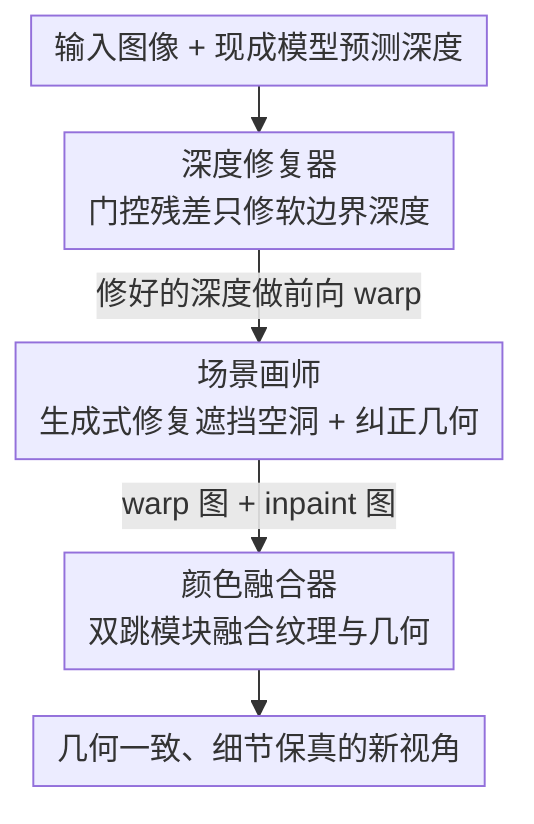

# Guardians of the Hair: Rescuing Soft Boundaries in Depth, Stereo, and Novel Views

**会议**: CVPR 2026  
**论文**: [CVF Open Access](https://openaccess.thecvf.com/content/CVPR2026/html/Zhang_Guardians_of_the_Hair_Rescuing_Soft_Boundaries_in_Depth_Stereo_CVPR_2026_paper.html)  
**代码**: 未公开  
**领域**: 3D视觉  
**关键词**: 软边界, 单目深度估计, 立体转换, 新视角合成, 图像抠图  

## 一句话总结
HairGuard 借用图像抠图（matting）数据集来构造软边界（如发丝）的精细深度监督，用「深度修复器 + 场景画师 + 颜色融合器」三件套即插即用地修正深度、修复遮挡、融合纹理，在单目深度、立体转换和新视角合成上对软边界细节都取得 SOTA。

## 研究背景与动机
**领域现状**：得益于基础模型和大规模数据集，单目深度估计、立体转换、新视角合成（NVS）都进步很快，被广泛用于影视制作、AR/VR、机器人等。

**现有痛点**：在「软边界」区域——发丝、毛发、半透明结构等前景背景颜色混在一起的地方——主流方法集体翻车：Depth Anything V2 会把发丝的深度估断、估缺；Depth Pro 细节稍好但软边界深度往往落在真实表面后面，渲染点云时头发会「飘」出来；隐式生成式 NVS（如 ReCamMaster）因为扩散模型的幻觉本性会编造不一致的纹理；StereoCrafter 这类潜空间方法又因 pixel-to-latent 压缩导致纹理退化。

**核心矛盾**：软边界本质上是一个 alpha 混合问题——像素同时收到前景和背景的贡献（$\alpha\in(0,1)$），导致深度和颜色的对应关系天然模糊、病态。而现有深度数据集几乎只标注硬边界，缺乏软边界处的精细深度真值；想定位软边界又依赖 trimap 这类手工线索，难以泛化。

**切入角度**：2D 视觉里的图像抠图（matting）早就为软边界给出了显式建模——用不透明度图（alpha matte）刻画前景背景的混合。作者的关键观察是：抠图数据集里恰好有大量带 alpha 的软边界目标，可以「借」过来当作软边界深度的监督信号源。

**核心 idea**：用抠图数据集合成「带软边界精细深度真值」的训练对，训练一个能自动定位并精修软边界深度的修复网络，再配合专门处理软边界的画师和融合器，把深度的修复红利一路传导到立体转换和新视角合成。

## 方法详解
### 整体框架
HairGuard 把图像抠图的合成公式 $I = \alpha\cdot I_{FG} + (1-\alpha)\cdot I_{BG}$ 当作软边界的统一定义：软边界即 $\alpha\in(0,1)$ 的混合区。整个系统是一条「深度先修好，再做视图合成」的串行流水线，由三个「队友」协作：

- **深度修复器（depth fixer）**：输入一张图和某个现成深度模型（如 DAv2）给出的深度，自动找出软边界区域并只在这些地方精修深度，全局深度保持不动——因此能即插即用地挂在任意零样本深度模型上；
- **场景画师（scene painter）**：用修好的深度做前向 warp 得到初步新视角，再用生成模型填补 warp 出来的遮挡空洞，同时纠正 warp 引入的几何错误；
- **颜色融合器（color fuser）**：把「warp 结果」（细节真但有冗余背景色）和「inpaint 结果」（补得全但有纹理幻觉）自适应融合，产出几何一致、纹理高保真的最终视图。

支撑这三件套的还有一条贯穿训练的数据合成策略：因为没有现成的软边界深度/多视图真值，作者全程用抠图数据集去「造」训练数据。

### 关键设计

**1. 抠图数据合成软边界监督：用 alpha matte 造出深度数据集没有的精细标签**

软边界深度真值几乎无法人工采集，作者转而从抠图数据集「合成」。把抠图数据当前景集 $I_{FG}=\{(\alpha, I_{FG})_i\}$、普通图像当背景集 $I_{BG}$。由于 alpha matte 在软边界处是平滑过渡、和深度的阶跃特性不一致，先用阈值 $\alpha_{th}$ 把它二值化为掩码 $M_\alpha=\{p\mid \alpha_{th}<\alpha(p)\}$；再给前景加绿幕增强对比后估前景深度 $d_{FG}=M_\alpha\odot\mathrm{Depth}(I_{FG})$，背景深度 $d_{BG}=\mathrm{Depth}(I_{BG})$，并从 $[d_{min},d_{max}]$ 随机采样把 $d_{FG}$ 重缩放（取 $d_{min}=\max_{p\in M_\alpha}d_{BG}(p)$ 保证前景在前的正确遮挡序）。最后按深度合成

$$d = d_{FG}\odot M_\alpha + d_{BG}\odot(1-M_\alpha)$$

巧妙之处在于「靠调阈值同时造出输入和真值」：用低 $\alpha_{th}$ 生成富含软边界细节的真值 $d_{GT}$，用高 $\alpha_{th}$ 模拟「断裂/缺失」的输入 $d_{in}$；生成 $d_{in}$ 时对 $M_\alpha$ 加随机高斯模糊、生成 $d_{GT}$ 时用不模糊的锐利掩码——一对「坏深度→好深度」训练样本就此自动产生，完全不需要 trimap 等手工线索。

**2. 深度修复器的门控残差：只在软边界动手，全局深度纹丝不动**

直接预测精修深度或用普通残差，要么破坏全局深度、要么细节糊掉。修复器用双分支提特征：DINOv2+DPT 的特征分支抓语义、U-Net 的像素分支抓局部结构；为自动定位软边界，先对输入深度做 Sobel 得到边缘引导 $e=\mathrm{Sobel}(d_{in})$，与图像 $I_{in}$、深度 $d_{in}$ 拼接喂入像素分支，让网络聚焦高深度梯度区。核心是预测一张门控图 $G\in[0,1]$（$G<1$ 标记软边界），按门控残差得到精修深度

$$\hat{d} = d_{in}\cdot G + d_{res}\cdot(1-G)$$

其中 $d_{res}$ 是估计的深度残差。门控把「深度估计」和「软边界修复」解耦——硬边界处 $G\to1$ 直接放行原深度，软边界处才让残差接管，因此既保住了基础模型的零样本能力，又能即插即用挂到任意 SOTA 深度模型上。训练上采用两阶段「先局部后全局」策略：先用软边界掩码 $M_{soft}=\{p\mid\alpha_{min}<\alpha(p)<\alpha_{max}\}$ 加重软边界惩罚，

$$\mathcal{L}^{stage1}_{depth} = \mathcal{L}_1(\hat{d}, d_{GT}) + \mathcal{L}_\alpha(\hat{d}\odot M_{soft}, d_{GT}\odot M_{soft})$$

（$\mathcal{L}_\alpha$ 是借自 ViTMatte 的抠图损失，便于抠细节）以防门崩塌成 $G=1$ 的平凡解；但只用第一阶段会在软边界周围留下光晕（halo），于是第二阶段把约束放到全局 $\mathcal{L}^{stage2}_{depth}=\mathcal{L}_\alpha(\hat{d}, d_{GT})$ 修整体质量。

**3. 场景画师：前向 warp 保细节 + 抠图式数据合成训练遮挡修复**

视图合成先用修好的深度做前向 warp，这样能保住深度里的软边界细节；但前景背景在软边界混合会让 warp 结果带上冗余背景色。由于现成多视图数据集几乎只有硬边界，作者又用抠图数据集合成软边界的 warp 训练数据：给定背景多视图序列，先用现成光流估计器算背景光流 $f_{BG}$，再采样一张前景图、给它一个随机平移位移 $(u,v)$ 生成纯平移的前景光流 $f_{FG}$，按掩码做光流合成

$$f = f_{FG}\odot M_\alpha + f_{BG}\odot(1-M_\alpha)$$

因为前景只在像平面内平移，对 $I_{FG}$ 和背景套用合成公式 $I=\alpha I_{FG}+(1-\alpha)I_{BG}$ 就能轻松得到真值视图；前景运动虽简单，但背景保留了真实的视角变化和复杂相机运动，足以训练鲁棒的遮挡修复。画师基于 Wan2.1-1.3B 的预训练 VACE 模型微调，并对背景套用 SplatDiff 的对齐合成策略做精确视角控制。

**4. 颜色融合器的双跳模块：在「真细节」与「补全」之间自适应取长补短**

画师能消掉冗余背景，但生成本性会幻觉出不一致纹理（warp 图有真细节却带冗余背景色，inpaint 图补得全却纹理幻觉）。融合器建在预训练 VAE 上以借其重建先验，但 VAE 本身会压缩细节，于是设计双跳（dual skip）模块：用冻结的 VAE 编码器分别提取 inpaint 图和 warp 图的多尺度特征，与 warp 掩码拼接后送进 VAE 解码器补偿纹理细节。训练时还专门用画师对真值图 $I_{GT}$ 生成带幻觉纹理的「假 inpaint 输入」，再微调 VAE 解码器：

$$\mathcal{L}_{color} = \mathcal{L}_1(\hat{I}, I_{GT}) + \lambda\cdot\mathcal{L}_{lpips}(\hat{I}, I_{GT})$$

其中 $\lambda=0.1$，$\mathcal{L}_{lpips}$ 为感知损失。最终融合图同时去掉了冗余背景色和幻觉纹理，几何与纹理双优。

### 损失函数 / 训练策略
深度修复器分两阶段（局部→全局），均用 AdamW、$448\times448$ patch、batch 32、学习率 $1\times10^{-5}$、各阶段 35K 迭代，特征分支用 DAv2 权重初始化；场景画师在 $480\times832$、batch 4、10K 迭代下微调 VACE；颜色融合器在 VAE 解码器加残差块融合双跳特征，$448\times448$、batch 16、35K 迭代。整体训练在 4 张 RTX A6000 上约 4 天。

## 实验关键数据

### 主实验
立体图像/视频转换在自建 Marvel-10K（501 段漫威电影立体视频、12,525 对立体帧，含大量复杂发丝）上对比：

| 任务 | 指标 | HairGuard | SplatDiff（次优） | 提升 |
|------|------|-----------|-------------------|------|
| 立体图像转换 | PSNR ↑ | 36.59 | 36.23 | +0.36 |
| 立体图像转换 | SSIM ↑ | 0.8953 | 0.8857 | +0.0096 |
| 立体图像转换 | LPIPS ↓ | 0.0909 | 0.1116 | 更优 |
| 立体图像转换 | DISTS ↓ | 0.0331 | 0.0435 | 更优 |
| 立体视频转换 | PSNR ↑ | 36.58 | 36.24 | +0.34 |

软边界深度边界精度（零样本，自然图像抠图数据集），深度修复器即插即用挂在不同深度模型上：

| 基座模型（AIM-500） | DBE acc ↓ | EP(%) ↑ | ER(%) ↑ |
|------|------|------|------|
| Depth Anything V2 | 3.29 | 19.90 | 6.50 |
| + Depth Fixer | **2.10** | **34.56** | **13.08** |
| Depth Pro | 3.80 | 15.92 | 6.12 |
| + Depth Fixer | **2.30** | **35.01** | **17.33** |
| UniDepthV2 | 3.87 | 19.52 | 5.14 |
| + Depth Fixer | **2.71** | **33.06** | **10.98** |

新视角合成在抠图数据集上 FID 也最低（AIM-500：18.82 vs SplatDiff 19.26；P3M-10K：21.38 vs 21.61），27 人 1332 票的用户研究同样压倒性偏好 HairGuard。零样本深度（NYUv2/KITTI/ETH3D/ScanNet/DIODE）上挂上修复器后整体深度几乎不变（如 DIODE AbsRel 26.24→26.24、UniDepthV2 在 DIODE 23.94→23.87），印证「只修软边界、不伤全局」。

### 消融实验
在 Marvel-10K 立体图像转换上逐组件叠加：

| 配置 | PSNR ↑ | LPIPS ↓ | SIoU ↑ | 说明 |
|------|--------|---------|--------|------|
| #1 仅 DAv2 warp | 36.26 | 0.1490 | 0.3097 | 基线 |
| #2 + 深度修复器 | 36.28 | 0.1458 | 0.3118 | 修软边界深度，SIoU 升 |
| #3 + 场景画师 | 35.82 | 0.1246 | 0.3015 | 补遮挡，LPIPS 大降但 PSNR 退（细节压缩+幻觉） |
| #4 + 颜色融合器（Full） | **36.59** | **0.0909** | **0.3337** | 融合后全指标最优 |

### 关键发现
- **颜色融合器是「救场」组件**：#3 加了场景画师后 PSNR 反而从 36.28 掉到 35.82（生成式幻觉+细节压缩拖累像素级指标），#4 加上融合器后一举回升到 36.59 并把 LPIPS 压到 0.0909，说明「warp 的真细节」必须被融合器找回来。
- **深度修复器贡献偏几何**：#2 主要体现在 SIoU（立体效果一致性）从 0.3097 升到 0.3118，PSNR 改动微小——契合「软边界只占图像很小区域」的事实，但对立体观感关键。
- **门控残差保零样本**：5 个未见深度基准上挂修复器后指标基本不变，是即插即用能成立的前提。

## 亮点与洞察
- **跨域「借数据」**：把 2D 抠图数据集的 alpha matte 当作 3D 软边界深度/视图的合成监督源，绕开了「软边界深度真值无法采集」的死结——这种「用相邻任务的成熟标注造缺失任务的训练对」思路可迁移到任何缺真值的精细几何任务。
- **门控残差解耦**：$\hat d = d_{in}G + d_{res}(1-G)$ 用一张门控图把「该不该修」和「怎么修」分开，硬边界放行、软边界接管，是「即插即用增强」最干净的实现，几乎不破坏基础模型。
- **双阶段防门崩塌**：直接训会让门退化成 $G=1$（啥也不修）的平凡解，先局部加重惩罚撑开门、再全局收光晕，是个很实在的训练 trick。
- **三件套对症下药**：warp 保细节、画师补空洞、融合器去幻觉，每个组件精确对应软边界视图合成的一类失败模式，分工清晰。

## 局限与展望
- 软边界通常只占图像很小区域，主实验的像素级指标（PSNR/SSIM）提升幅度有限（+0.3~0.4 dB），论文的真实价值更多体现在边界精度（DBE/EP/ER 翻倍级提升）和主观质量上——纯看整图 PSNR 容易低估贡献。
- ⚠️ 训练数据合成里前景运动被简化为「纯像平面平移」，真实场景中头发的复杂非刚性运动、自遮挡是否被充分覆盖，论文未深入讨论，可能限制极端运动场景的泛化。
- 流水线较重：三个网络串行、训练 4 天/4×A6000，且依赖外部深度模型、光流估计器、VACE/Wan2.1 生成模型，工程复杂度和推理开销偏高。
- 代码与 Marvel-10K 数据集（涉及版权电影画面）的可获取性存疑，复现门槛较高。

## 相关工作与启发
- **vs Depth Pro / Depth Anything V2 / UniDepthV2**：它们都是端到端深度模型，软边界处或断裂或落后真实表面；本文不重训深度模型，而是做一个即插即用的「修复器」只精修软边界，保住基座零样本能力的同时把边界精度翻倍。
- **vs SplatDiff**：同为「深度引导 + 扩散」的 NVS，但 SplatDiff 性能高度依赖深度质量、软边界处深度出错就连带翻车；本文先用深度修复器把软边界深度修好，再用颜色融合器找回纹理，从源头堵住误差传播。
- **vs ReCamMaster / StereoCrafter（隐式生成式）**：隐式方法靠生成先验处理遮挡但有幻觉、且潜空间压缩损纹理；本文走「显式 warp 保细节 + 生成补遮挡 + 融合去幻觉」的混合路线，在软边界上几何更一致、纹理更保真。

## 评分
- 新颖性: ⭐⭐⭐⭐⭐ 「借抠图 alpha 造软边界 3D 监督 + 门控残差即插即用修复」是个很有启发的跨域组合
- 实验充分度: ⭐⭐⭐⭐⭐ 覆盖深度/立体/NVS 三任务，多基座、多基准、消融、用户研究齐全
- 写作质量: ⭐⭐⭐⭐ 三件套分工和公式交代清晰，但小指标提升与边界提升的落差需读者自行体会
- 价值: ⭐⭐⭐⭐ 直击影视/AR-VR 里发丝软边界这一长期痛点，即插即用属性实用性强

<!-- RELATED:START -->

## 相关论文

- [\[CVPR 2026\] PRIMU: Uncertainty Estimation for Novel Views in Gaussian Splatting from Primitive-Based Representations of Error and Coverage](primu_uncertainty_estimation_for_novel_views_in_gaussian_splatting_from_primitiv.md)
- [\[ECCV 2024\] Flying with Photons: Rendering Novel Views of Propagating Light](../../ECCV2024/3d_vision/flying_with_photons_rendering_novel_views_of_propagating_light.md)
- [\[CVPR 2026\] CGHair: Compact Gaussian Hair Reconstruction with Card Clustering](cghair_compact_gaussian_hair_reconstruction_with_card_clustering.md)
- [\[CVPR 2026\] Depth Hypothesis Guided Iterative Refinement for Event-Image Monocular Depth Estimation](depth_hypothesis_guided_iterative_refinement_for_event-image_monocular_depth_est.md)
- [\[CVPR 2026\] SPE-MVS: Spatial Position Encoding Enhanced Multi-View Stereo with Monocular Depth Priors](spe-mvs_spatial_position_encoding_enhanced_multi-view_stereo_with_monocular_dept.md)

<!-- RELATED:END -->
