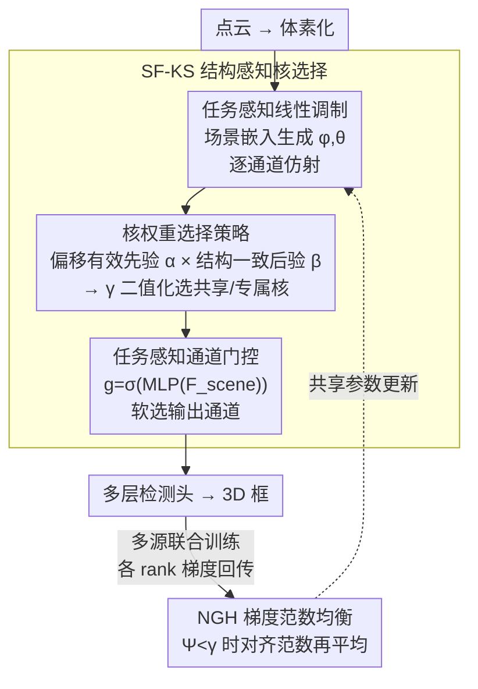

# H²A²: Homogeneity-Aware and Heterogeneity-Aware Feature Perception for Unified Indoor 3D Object Detection

**会议**: CVPR 2026  
**论文**: [CVF Open Access](https://openaccess.thecvf.com/content/CVPR2026/html/Xie_H2A2_Homogeneity-Aware_and_Heterogeneity-Aware_Feature_Perception_for_Unified_Indoor_3D_CVPR_2026_paper.html)  
**代码**: 无  
**领域**: 3D视觉  
**关键词**: 室内3D检测, 跨场景联合训练, 同质/异质特征, 稀疏卷积核选择, 梯度均衡  

## 一句话总结
作者发现室内 3D 检测里线/面/角这类基础几何结构会在不同场景诱发**高度一致的稀疏卷积核偏移响应**（同质特征），而场景特有结构则产生异质响应；H²A² 用一套结构感知的卷积核选择机制（SF-KS）在每个偏移位置上动态决定该用"跨场景共享核"还是"场景专属核"，再配一个梯度范数均衡算法（NGH）稳住多源联合训练，在 ScanNet/SUN RGB-D/S3DIS 上比强基线 TR3D 普遍涨 1~7.6 mAP。

## 研究背景与动机

**领域现状**：室内 3D 检测的主流是基于稀疏卷积的体素方法，代表作 FCAF3D 是首个全卷积、anchor-free 的稀疏体素检测器，TR3D 在其上剪枝瘦身做到 2× 推理加速。这些方法的训练范式都是**单场景独立训练**——在 ScanNet、SUN RGB-D、S3DIS 上各训一个模型。

**现有痛点**：单场景训练浪费了一个被忽视的事实：不同室内场景其实**共享大量基础几何结构**。作者在 Fig.1 里展示，平面、边界、直线这些局部结构，即使跨场景、跨物体，稀疏卷积核学到的有效偏移（offset）模式也高度相似。单场景训练等于让每个数据集各自从零学一遍这些通用结构，没有利用这种跨场景同质性。

**核心矛盾**：一个直白的补救是"共享 backbone + 各数据集专属检测头"。但这种朴素共享在联合优化时会把各场景**无关的异质信号搅在一起**：采集设备、场景尺度、空间布局的差异，会让共享参数被推向相互冲突的优化方向，反而拖垮结果。也就是说——同质特征值得共享，异质特征必须隔离，但现有方法没有机制把两者**在同一套卷积核内分开处理**。

**本文目标**：在跨场景联合训练下，既精确建模"哪些是该共享的同质结构"，又专门刻画"每个场景独有的异质属性"。

**切入角度**：作者的关键观察落在**稀疏卷积核的偏移层面**——同质结构在不同场景会诱发对齐的、按偏移索引的激活模式，因此对应的核表示也一致；而物体边界附近某些偏移会落在无效支撑区（落在点云稀疏/遮挡区），产生特征性的不连续。既然同质/异质的差别在偏移粒度上可分辨，那就**在偏移粒度上做核选择**。

**核心 idea**：给每个卷积核偏移配一个判别分数 $\gamma_j$，用"长期统计先验 × 当前场景结构后验"决定该偏移走共享核还是专属核，从而在单一混合核里同时优化同质特征、专门化异质特征；再用梯度范数均衡防止某个场景在联合训练里独占梯度。

## 方法详解

### 整体框架

H²A² 沿用 TR3D 的整体配置：点云输入 → 体素化 → MinkResNet（稀疏卷积 backbone）→ 多层检测头回归 3D 框。核心改动是把 backbone 里的普通稀疏卷积换成**结构感知核选择（SF-KS）**模块，并在多源联合训练时套上 **NGH** 梯度均衡。

SF-KS 内部是一条三段流水：先用**任务感知线性调制（TLM）**对输入特征做场景自适应的逐通道仿射，放大场景相关结构、压低噪声；再用**核权重选择策略**在每个偏移位置算出判别分数 $\gamma_j$，按 $\gamma_j$ 在共享核 $W^{sh}$ 与专属核 $W^{ex}$ 之间插值出最终混合核去做卷积；最后用**任务感知通道门控**对输出特征做逐通道软选择，抑制场景无关响应。训练侧，由于每个数据并行 rank 绑定一个数据源，rank 间梯度范数不平衡就直接反映了数据集间的"优势失衡"，NGH 据此在共享参数上把各 rank 的梯度范数拉齐后再平均。

### 关键设计

**1. 任务感知线性调制（TLM）：在卷积前先把"场景相关通道"挑出来**

朴素共享 backbone 的第一个问题是：输入特征里同质结构信号和场景噪声混在一起，直接送进卷积核很难分辨。TLM 的做法是在卷积输入处加一层**场景驱动的逐通道仿射**。设输入特征 $F_{in}\in\mathbb{R}^{N\times C_{in}}$（$N$ 个 active site），引入一组可学习的场景嵌入 $F_{scene}$ 编码场景级结构特征，用一个轻量 MLP 调制函数 $\mathcal{F}$ 把它映射成逐通道仿射参数：

$$(\varphi,\theta)=\mathcal{F}(F_{scene}),\qquad \widehat{F}_{in}=F_{in}\odot\varphi+\theta$$

其中 $\odot$ 是沿空间维 $N$ 广播的逐通道乘。这样放大判别性通道、压低弱相关响应，等于给后续核选择喂进"已经凸显了场景结构"的特征。注意场景嵌入是独立可学习的、不取自当前特征本身，作者特意这样设计以**避免自指调制**（self-referential modulation）。消融里把 TLM 换成线性注意力（LA）或干脆去掉，精度都会下降，说明这层廉价的仿射确实有用。

**2. 核权重选择策略：用"先验×后验"在偏移粒度上决定共享还是专属**

这是全文的核心。稀疏卷积核在 active site 周围按一组预定义偏移聚合邻域，作者要在**每个偏移 $j$** 上判断它对应的权重该跨场景共享（编码同质结构）还是场景专属（编码异质结构）。判断由两部分融合：

- **偏移有效先验 $\alpha$（数据无关、全局统计）**：受点云稀疏性、遮挡、边界影响，稀疏卷积常出现"有效邻域缺失"。给每个偏移配一个可学习参数 $O\in\mathbb{R}^V$（$V$ 为核体积），过 sigmoid 得到可靠性分 $\alpha=\sigma(O)\in(0,1)^V$。训练会自然把"长期缺乏支撑、贡献低"的偏移压到小权重。这一项不依赖手工启发式，刻画偏移在整个训练里的全局可用性。
- **结构一致后验 $\beta$（数据相关、当前场景）**：给每个偏移配一个结构原型向量 $p_j\in\mathbb{R}^{V\times d}$，端到端训练中用它和当前场景结构特征的余弦相似度参与门控选择与回传。高频出现的结构会持续给出一致、累积的梯度方向，把 $p_j$ 推向收敛；零星/噪声模式的梯度互相抵消，难以塑形成稳定原型。特征与原型都做 $\ell_2$ 归一化（只看形状不看幅值），对当前场景所有 active site 做相似度查询再均值池化，得到 $\beta_j\in[0,1]$ 表示该原型在本场景的一致性。

两者融合成判别分数并二值化：

$$\gamma_j=\mathrm{Binarization}(\alpha_j\beta_j;\tau)$$

若 $\alpha_j\beta_j\ge\tau$ 则 $\gamma_j=1$，该偏移走**共享核**（稳定表征同质特征）；否则 $\gamma_j=0$，走**专属核**处理场景特有结构。最终卷积核按偏移逐位插值：

$$W_j=\gamma_j\,W_j^{sh}+(1-\gamma_j)\,W_j^{ex},\quad j=1,\dots,V$$

$W\in\mathbb{R}^{V\times C_{in}\times C_{out}}$ 作为混合稀疏卷积的核。这样核的使用同时被"偏移可用性的长期统计先验"和"当前场景的结构一致后验"约束，避免只凭单次观测或固定范式去决定某偏移激活与否——这正是它比"单纯共享 backbone"更细腻的地方：共享/专属的边界画在偏移粒度，而非整张核或整个 backbone。

**3. 任务感知通道门控：卷积后再清一遍场景无关响应**

混合核卷完后，输出特征仍可能残留跨场景的统计冲突与分布漂移。作者在输出端再做一次**逐通道软选择**。设输出 $F_{out}\in\mathbb{R}^{N\times C}$、场景向量 $F_{scene}\in\mathbb{R}^d$，算门控因子并重标定：

$$\mathbf{g}=\sigma(MLP(F_{scene}))\in(0,1)^C,\qquad F=F_{out}\odot(1+\mathbf{g})$$

用 $1+\mathbf{g}$ 而非直接 $\mathbf{g}$ 是为了做"增强为主"的软重标定，抑制场景无关通道、增强相关通道，缓解核混合带来的数值漂移，换来更可控的值域和更稳的训练。它和 TLM 一前一后夹住核选择：TLM 在卷积前净化输入，门控在卷积后净化输出。

**4. 基于范数的梯度均衡（NGH）：别让某个场景的大梯度独占共享参数**

多源联合优化里共享参数有两类梯度冲突：方向不一致（拖慢收敛）和范数差异（造成优化主导）。作者引用已有结论指出前者只是延缓收敛，后者才会"压垮"小范数目标；而在他们的迭代训练下方向问题已基本缓解，**范数差异成了核心瓶颈**——大范数场景独占更新、淹没其它任务。

由于每个数据并行 rank 绑定一个数据源，rank 间范数不平衡 = 数据集间主导。设 $K$ 个 rank，共享参数 $p$ 在 rank $k$ 的局部梯度 $g_k^p=\nabla_p L_k$，范数 $n_k=\|g_k^p\|_2$。先用一个对称相似度度量各 rank 范数的均衡度：

$$\Psi=\frac{1}{K(K-1)}\sum_{i\neq j}\frac{2\,n_i n_j}{n_i^2+n_j^2+\varepsilon}$$

$\Psi\in(0,1]$ 越小说明越不均衡。仅当 $\Psi<\gamma$（默认 $\gamma=0.9$）才触发均衡（⚠️ 此处阈值 $\gamma$ 与核选择里的判别分数 $\gamma_j$ 同符号但含义不同，以原文为准）：取目标范数 $M_t=\frac1K\sum_k n_k$，把每个 rank 的梯度缩放 $s_k=M_t/(n_k+\varepsilon)$、$\tilde g_k^p=s_k g_k^p$，再跨 rank 平均 $\bar g^p=\frac1K\sum_k\tilde g_k^p$。因为 $s_k>0$，**方向严格保持不变**（$\tilde g_k/\|\tilde g_k\|=g_k/\|g_k\|$），只拉平范数。这点和"显式改变下降方向"的梯度手术（gradient surgery）不同——NGH 只在平均前对齐范数，保住各任务方向、又压住 rank 主导，且通信开销极小。

## 实验关键数据

三个室内基准：ScanNet v2（18 类）、SUN RGB-D（10 类）、S3DIS（Area 5，5 类）。基于 MMDetection3D，3×RTX 4090 训练，loss/优化器/学习率均沿用 TR3D 以公平对比。

### 主实验（几何输入，对比 SOTA）

| 数据集 | 指标 | H²A² | TR3D(基线) | 提升 |
|--------|------|------|-----------|------|
| ScanNet v2 | mAP@0.25 | **77.5** | 72.9 | +4.6 |
| ScanNet v2 | mAP@0.5 | **63.8** | 59.3 | +4.5 |
| SUN RGB-D | mAP@0.25 | **68.0** | 67.1 | +0.9 |
| SUN RGB-D | mAP@0.5 | **51.4** | 50.4 | +1.0 |
| S3DIS | mAP@0.25 | **78.7** | 74.5 | +4.2 |
| S3DIS | mAP@0.5 | **59.3** | 51.7 | +7.6 |

三个数据集全面超过 TR3D 及更新的 SOTA（Point-GCC、SPGroup3D、DLLA 等）。代价是推理变慢：ScanNet 上 FPS 从 23.7 降到 18.2，但精度提升更显著。

### 消融实验（SF-KS 与 NGH 逐步叠加，mAP@0.25 / mAP@0.5）

| SF-KS | NGH | ScanNet | SUN RGB-D | S3DIS |
|-------|-----|---------|-----------|-------|
| ✗ | ✗ | 70.8 / 54.6 | 64.4 / 43.6 | 76.4 / 56.8 |
| ✓ | ✗ | 76.7 / 61.3 | 67.3 / 48.1 | 77.8 / 56.0 |
| ✗ | ✓ | 72.9 / 56.1 | 65.5 / 48.4 | 76.7 / 58.2 |
| ✓ | ✓ | **77.5 / 63.8** | **68.0 / 51.4** | **78.7 / 59.3** |

SF-KS 是主要涨点来源（ScanNet mAP@0.25 单独 +5.9），NGH 单独也有贡献且与 SF-KS 叠加后进一步提升。

### 其它分析
- **可迁移性**：把 SF-KS+NGH 移植到 FCAF3D，三数据集一致提升（ScanNet +2.1/+3.3、S3DIS +3.4/+2.8），说明模块通用、不绑死 TR3D。
- **TLM 消融**：去掉 TLM 或换成线性注意力（LA）精度都下降，确认这层廉价仿射的必要性。
- **零样本泛化**：在未见数据集 3RScan 上，H²A² 50.7/39.1 vs TR3D 47.6/37.6，跨场景联合训练带来更强迁移性。
- **t-SNE 可视化**：SF-KS 学到的特征能同时区分同质/异质结构，印证其结构感知能力。

### 关键发现
- 涨点主力是 SF-KS（核选择），NGH 更像是把多源训练"稳住"的辅助件——单加 NGH 提升有限，但和 SF-KS 合用才达最优。
- S3DIS 的 mAP@0.5 涨幅最大（+7.6），说明在样本量小、场景规整的数据集上，跨场景同质特征共享的收益尤其大。

## 亮点与洞察
- **把"共享/专属"的决策粒度细到卷积核偏移**：不是整个 backbone 共享、也不是整张核共享，而是每个偏移位置独立判断——这是比"共享 backbone+专属头"精细一个量级的设计，直接对应作者"同质/异质在偏移层面可分辨"的观察。
- **先验×后验融合很巧**：$\alpha$（全局统计可用性）× $\beta$（当前场景一致性）再二值化，既避免只凭单次观测决策，又把"长期该不该用这个偏移"和"此刻这个场景符不符合"解耦后再合议，思路可迁移到任何"动态参数选择"场景。
- **NGH 只动范数不动方向**：相比 PCGrad 这类改方向的梯度手术，NGH 论证了在迭代训练下方向冲突已不是主因、范数失衡才是，于是只做范数对齐、通信开销极小——这个"诊断瓶颈再对症"的思路值得借鉴。
- **模块可热插拔**：迁移到 FCAF3D 一致涨点，说明这套机制和具体检测头解耦。

## 局限性 / 可改进方向
- **推理变慢**：核混合与双路核（共享+专属）带来额外开销，ScanNet FPS 23.7→18.2，实时性场景需权衡。
- **场景嵌入是离散的"数据集级"**：场景嵌入按数据源/任务区分，对**同一数据集内部的强异质性**（如极端布局差异）是否够细，论文未深入；⚠️ 场景向量 $F_{scene}$ 的具体维度与初始化细节正文交代有限，以原文/附录为准。
- **NGH 依赖"rank=数据源"的绑定假设**：当数据并行划分与数据源不一一对应时，rank 范数能否仍代表数据集主导，需要额外验证。
- **二值化阈值 $\tau$ 的敏感性**：$\gamma_j$ 由硬二值化得到，正文未报告 $\tau$ 的选择与敏感性分析。

## 相关工作与启发
- **vs TR3D / FCAF3D**：两者都是单场景独立训练的稀疏体素检测器，H²A² 在 TR3D 配置上做跨场景联合训练并替换核选择机制，把"各练各的"变成"共享同质、隔离异质"，主实验即以 TR3D 为基线全面超越。
- **vs UniDet3D（统一室内检测）**：UniDet3D 通过合并六个数据集的标签空间做联合训练，属通用统一范式；H²A² 不同点在于**显式建模几何同质/异质性**，在偏移粒度上做核选择，联合优化更稳、跨域表示更鲁棒。
- **vs 多数据联合学习（Omnivore / M3ViT）**：这类工作靠共享 backbone + 自适应共享控制特征共享程度，偏架构层面；H²A² 把共享决策下沉到稀疏卷积核偏移，并配 NGH 解决联合训练的梯度范数冲突，更针对 3D 稀疏卷积的特性。

## 评分
- 新颖性: ⭐⭐⭐⭐ 把同质/异质特征的区分下沉到卷积核偏移粒度，先验×后验融合选核是有辨识度的设计
- 实验充分度: ⭐⭐⭐⭐ 三基准+迁移+零样本+消融较完整，但缺 $\tau$/场景嵌入维度等超参敏感性分析
- 写作质量: ⭐⭐⭐ 观察动机清晰，但符号 $\gamma$ 复用、部分公式排版混乱，可读性受影响
- 价值: ⭐⭐⭐⭐ 为室内 3D 检测的多源联合训练提供了可热插拔、可迁移的核选择范式

<!-- RELATED:START -->

## 相关论文

- [\[CVPR 2026\] Towards Intrinsic-Aware Monocular 3D Object Detection](towards_intrinsic-aware_monocular_3d_object_detection.md)
- [\[CVPR 2026\] Few-Shot Incremental 3D Object Detection in Dynamic Indoor Environments](few-shot_incremental_3d_object_detection_in_dynamic_indoor_environments.md)
- [\[CVPR 2026\] Generalizable Structure-Aware Keypoint Correspondence for Category-Unified 3D Single Object Tracking](generalizable_structure-aware_keypoint_correspondence_for_category-unified_3d_si.md)
- [\[CVPR 2026\] UniPR: Unified Object-level Real-to-Sim Perception and Reconstruction from a Single Stereo Pair](unipr_unified_object-level_real-to-sim_perception_and_reconstruction_from_a_sing.md)
- [\[CVPR 2026\] From Pairs to Sequences: Track-Aware Policy Gradients for Keypoint Detection](from_pairs_to_sequences_track-aware_policy_gradients_for_keypoint_detection.md)

<!-- RELATED:END -->
