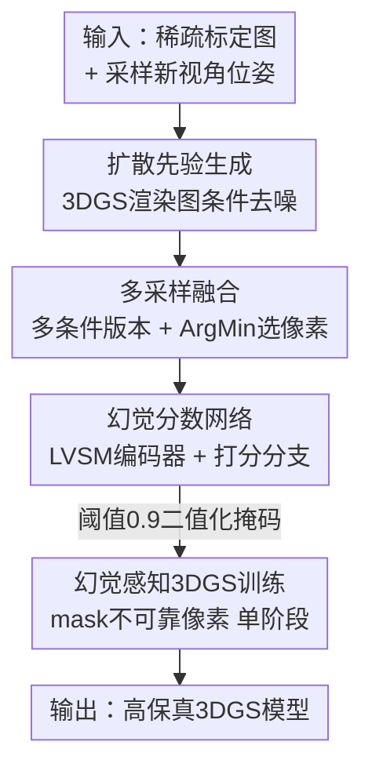

# HAD: Hallucination-Aware Diffusion Priors for 3D Reconstruction

**会议**: CVPR2026  
**arXiv**: [2605.16873](https://arxiv.org/abs/2605.16873)  
**代码**: 项目主页（论文称已公开，未给出具体仓库链接）  
**领域**: 3D视觉 / 新视角合成 / 扩散先验  
**关键词**: 稀疏视角重建、3D高斯泼溅、扩散先验、幻觉抑制、新视角合成

## 一句话总结
针对扩散先验在稀疏视角 3D 重建中"画质变好但会编造出输入里不存在的内容（幻觉）"这一痛点，HAD 用一个预训练前馈 NVS 网络（LVSM）作多视角编码器、配一个轻量分支逐像素预测"幻觉分数图"，在 3DGS 训练时把高分（不可靠）像素 mask 掉，再用多采样融合进一步压低幻觉比例，最终在 DL3DV 上 PSNR 提升 0.78dB、MipNeRF360 上提升 0.69dB，达到 SOTA。

## 研究背景与动机
**领域现状**：NeRF 和 3DGS 是新视角合成（NVS）的两大主流范式，但它们都依赖稠密相机覆盖和高质量输入图。在稀疏视角、极端外推等"数据不足"场景下，渲染质量会急剧退化。一类主流补救手段是用生成式扩散先验（如 Difix3D）在新视角上"去伪存真"——把 3DGS 渲染出的有瑕疵图当作"带噪样本"，用扩散模型条件于原始输入视角去噪，从而补出逼真的增强视角来扩充训练数据。

**现有痛点**：扩散去噪虽然让增强视角变得 photorealistic，却**不保真**——它在设计上不会严格保留条件输入视角的内容，于是生成图里会出现输入中根本不存在的"外星人式"伪影（hallucinated aliens）。一旦这些幻觉内容被灌进 3DGS 模型，就形成 3D 重建的"幻觉问题"：渲染出来看着清晰漂亮，但对输入视角的保真度很低。

**核心矛盾**：扩散先验"高频细节强但保真差"与"想用它补数据却会污染 3D 模型"之间存在根本张力。近期工作试图通过视频扩散、多视角扩散等手段**强迫扩散更尊重输入视角**来减轻幻觉，但只要扩散的生成本性还在，多视角不一致就消不掉。

**本文目标**：不再徒劳地"彻底防止幻觉发生"，而是换思路——**承认幻觉会发生，但要有能力在把增强图灌进 3D 模型时把幻觉内容筛掉**。子问题拆为：(1) 怎么逐像素量化"这块是不是幻觉"；(2) 怎么在 3DGS 优化里用这个量化结果；(3) 怎么进一步降低生成图里的幻觉占比。

**切入角度**：作者观察到前馈 NVS 网络（如 LVSM）天生就被训练成"高保真还原输入视角"，因此其特征骨干蕴含强大的**多视角推理能力**——正好可以用来判断"扩散增强图里哪些像素与输入多视角不一致"。借用这个预训练知识，就能在很小的精选数据集上训练幻觉打分器，绕开"为每个样本都跑完整 3D 重建 + 渲染 + 扩散去噪"的大规模数据制备难题。

**核心 idea**：用预训练 NVS 骨干当多视角编码器，逐像素预测幻觉分数图，把不可靠像素从 3DGS 监督里 mask 掉，再用多采样 ArgMin 融合压低幻觉——即"幻觉感知（hallucination-aware）"而非"幻觉杜绝"。

## 方法详解

### 整体框架
输入是一组带位姿的稀疏标定图（如 9 张），目标是训练出一个既能渲染训练视角、也能在欠约束新视角上高质量渲染的 3DGS 模型。HAD 的关键转变是：在交替进行的"视角增强 + 训练"循环里，每生成一张扩散增强的新视角图，就同时预测一张逐像素的幻觉分数图，用它把不可靠像素从新视角监督损失里屏蔽掉。整条管线由三块拼起来：沿用 Difix3D 的扩散先验负责生成增强视角；幻觉打分网络（冻结的 LVSM 多视角编码器 + 轻量打分分支）负责输出可靠性掩码；多采样策略对同一新视角生成多个版本再融合成一张更干净的图。最后这些"带掩码的增强视角"和原始输入视角一起，单阶段地监督 3DGS 优化。

### 关键设计

**1. 幻觉分数网络：借 NVS 骨干的多视角推理来逐像素判幻觉**

痛点是扩散增强图里"哪些像素是编出来的"无从判断——直接学一个判别器又得制备海量"输入多视角 + 增强新视角"配对样本，每个样本都要跑完整重建+渲染+去噪，代价极高。作者把判别器拆成两件：一个多视角特征编码器 $\mathcal{V}$ 和一个打分分支 $\mathcal{S}$。关键在于 $\mathcal{V}$ 直接用预训练好的 LVSM 特征骨干并**冻结**——LVSM 作为 SOTA 前馈 NVS 网络，已在大规模 3D 数据上学会"理解多视角上下文、高保真还原新视角"，这种多视角推理能力恰好能识别"增强图与输入多视角的不一致"。打分分支 $\mathcal{S}$ 仅是一个三层 UNet，输入把多视角特征 $\mathbf{F}_{\tilde{\mathbf{c}}}=\mathcal{V}(\mathbf{P}\mid\tilde{\mathbf{c}})$、扩散增强图 $\tilde{\mathbf{i}}_{\mathcal{G}}$、以及可选的 3DGS 渲染图拼接起来，输出逐像素幻觉分数图 $\mathbf{s}=\mathcal{S}_\theta(\tilde{\mathbf{i}}_{\mathcal{G}}\mid\mathcal{R}_{\Phi}(\tilde{\mathbf{c}}),\mathbf{F}_{\tilde{\mathbf{c}}})$。训练时 ground-truth 幻觉分数定义为"扩散生成图与真值图之间的逐像素 MAE"，用 L2 损失监督预测分数。因为 $\mathcal{V}$ 冻结、只训一个小 UNet，整个网络在仅 116 个场景的精选小数据集上 fine-tune 1 万次迭代就够了。消融（Tab. 6）显示：去掉预训练多视角编码器后幻觉预测 MAE 从 0.043 退化到 0.054，而 retrained Difix3D（无多视角推理）更差到 0.058——证明"借 NVS 骨干"是这套打分能成立的根基

**2. 幻觉感知 3DGS 训练：把不可靠像素从监督里 mask 掉，并简化成单阶段**

有了分数图，问题变成怎么用它。HAD 把扩散增强的新视角损失 $\mathcal{L}_{\text{novel}}$ 改写成"带掩码"的形式：分数图按阈值 0.9 二值化成掩码 $\mathbf{m}$，对高分（幻觉）像素取反屏蔽，只在可靠区域计算 $\mathcal{L}_1$ 和 $\mathcal{L}_{\text{D-SSIM}}$：

$$\mathcal{L}_{\text{novel}}=\mathcal{L}_1(\lnot\mathbf{m}\odot\mathcal{R}_{\Phi}(\tilde{\mathbf{c}}),\,\lnot\mathbf{m}\odot\tilde{\mathbf{i}})+\mathcal{L}_{\text{D-SSIM}}(\lnot\mathbf{m}\odot\mathcal{R}_{\Phi}(\tilde{\mathbf{c}}),\,\lnot\mathbf{m}\odot\tilde{\mathbf{i}})$$

总目标为 $\lambda_{\text{input}}\mathcal{L}_{\text{input}}+\lambda_{\text{novel}}\mathcal{L}_{\text{novel}}$（两个系数都设为 1）。这样幻觉内容就不会反传进高斯参数，避免污染 3D 模型。更妙的是它带来一个简化：Difix3D 必须先把 3DGS 完整训好、再用小学习率两阶段地慢慢注入扩散先验（怕一上来灌脏数据），而 HAD 因为有掩码保护，从训练第一步就能同时用输入视角和扩散增强视角监督，**单阶段**搞定，无需预训练好的 3DGS 初始化

**3. 多采样策略：同一新视角生成多版本，ArgMin 逐像素挑最干净的拼**

Difix3D 每次去噪只条件于最近的那一张参考图 $\mathbf{i}_{\text{ref}}$，没充分利用其他视角的互补线索。HAD 对同一个新视角位姿，条件于 $K$ 张不同的采样输入视角，生成 $K$ 个版本及各自的幻觉分数图 $\{(\tilde{\mathbf{i}}_{\mathcal{G}}^k,\mathbf{s}^k)\}$，然后逐像素挑"幻觉分数最低"的那个版本拼出最终图：$\tilde{\mathbf{i}}[i]=\tilde{\mathbf{i}}_{\mathcal{G}}^{k^\ast}[i],\ k^\ast=\arg\min_k \mathbf{s}^k[i]$。这相当于在**不重训扩散模型**的前提下，把单一参考扩成多参考，让先验看到更广的多视角上下文，从而结构性地降低生成图里的幻觉占比。消融（Tab. 5）显示 ArgMin 选像素优于加权平均（PSNR 22.134 vs 21.856），因为加权平均会把不同版本的内容糊在一起、反而损失锐度；版本数从 1→2→3 单调提升（Tab. 4），作者取 3 个版本权衡边际收益与计算开销

### 损失函数 / 训练策略
- **3DGS 训练**：总损失 $\lambda_{\text{input}}\mathcal{L}_{\text{input}}+\lambda_{\text{novel}}\mathcal{L}_{\text{novel}}$，两系数均为 1；输入视角损失沿用 3DGS 的 $0.8\mathcal{L}_1+0.2\mathcal{L}_{\text{D-SSIM}}$；新视角损失带幻觉掩码。掩码阈值经验设为 0.9。学习率：高斯均值 $8e^{-5}$、不透明度 $5e^{-2}$、旋转 $1e^{-3}$、0 阶 SH $5e^{-4}$、高阶 SH $2.5e^{-5}$，训练 30k 迭代。
- **幻觉打分网络训练**：$\mathcal{V}$（LVSM 骨干）冻结，只训三层 UNet 打分分支 $\mathcal{S}$；GT 分数为扩散生成图与真值图的逐像素 MAE，用 L2 损失监督。数据用 Difix3D 管线制备：每场景先用 9 张输入训 3DGS，再生成 100 张 960×540 的扩散增强新视角；fine-tune 10k 迭代、batch size 2/GPU，8×V100 32GB 约 28 小时。

## 实验关键数据

### 主实验
DL3DV（in-domain，幻觉网络在此训练）与 MipNeRF360（cross-domain）两个标准 NVS 基准，9 张稀疏输入视角，指标 PSNR↑/SSIM↑/LPIPS↓。

| 数据集 | 方法 | PSNR↑ | SSIM↑ | LPIPS↓ |
|--------|------|-------|-------|--------|
| DL3DV | LVSM (前馈) | 19.855 | 0.636 | 0.252 |
| DL3DV | Gsplat-mcmc | 20.532 | 0.721 | 0.225 |
| DL3DV | Difix3D (SOTA基线) | 21.355 | 0.734 | 0.199 |
| DL3DV | **Ours** | **22.134** | **0.757** | **0.190** |
| MipNeRF360 | GenFusion (视频扩散) | 18.360 | 0.496 | 0.465 |
| MipNeRF360 | Difix3D | 18.001 | 0.475 | 0.350 |
| MipNeRF360 | **Ours** | **18.689** | **0.5094** | **0.334** |

相对 Difix3D，DL3DV 上 PSNR +0.779dB（21.355→22.134）、MipNeRF360 上 +0.688dB（18.001→18.689），各项指标全面领先。值得注意的是 MipNeRF360 上即便对手 GenFusion 用了多视角一致性更好的视频扩散，HAD 仍凭幻觉感知策略反超。post-rendering 设置下（Ours+ vs Difix3D+），LPIPS 更低（0.177 vs 0.181）但 PSNR/SSIM 这类保真指标会下降——作者诚实指出 post-rendering 提升 photorealism 却牺牲保真。

### 消融实验
| 配置 | PSNR↑ | SSIM↑ | LPIPS↓ | 说明 |
|------|-------|-------|--------|------|
| Difix3D | 21.355 | 0.734 | 0.199 | 基线 |
| Difix3D + HAD | 21.779 | 0.749 | 0.195 | 加幻觉感知掩码 |
| Difix3D + HAD + M.S. | 21.983 | 0.755 | 0.195 | 再加多采样 |
| Ours (full, 单阶段) | 22.134 | 0.757 | 0.190 | 完整模型 |

多采样版本数与融合策略：

| 消融维度 | 配置 | PSNR↑ | SSIM↑ | LPIPS↓ |
|---------|------|-------|-------|--------|
| 版本数 | 1 (无 M.S.) | 21.779 | 0.749 | 0.195 |
| 版本数 | 2 | 21.938 | 0.754 | 0.195 |
| 版本数 | 3 (采用) | 21.983 | 0.755 | 0.195 |
| 融合方式 | Weighted Average | 21.856 | 0.747 | 0.190 |
| 融合方式 | ArgMin (采用) | 22.134 | 0.757 | 0.190 |

幻觉打分器对比（MAE↓，越低越准）：retrained Difix3D 0.058 / Ours w/o 预训练编码器 0.054 / **Ours full 0.043**。

### 关键发现
- **多视角推理骨干是命门**：去掉预训练 LVSM 编码器，幻觉预测 MAE 从 0.043 退化到 0.054；纯 retrained Difix3D 更差（0.058）。证明"借 NVS 骨干的多视角推理"是幻觉打分能成立的核心，而非可有可无的工程选择。
- **幻觉感知本身贡献最大**：Difix3D→Difix3D+HAD 单加掩码就把 PSNR 从 21.355 抬到 21.779（+0.42），多采样再加 +0.20，单阶段训练再 +0.15。掩码这一步收益最显著。
- **ArgMin 优于加权平均**：逐像素挑最干净版本（22.134）比加权融合（21.856）高 0.28 PSNR——融合时"挑选"比"平均"更能保住锐度，因为平均会把不同版本糊在一起。
- **跨域仍领先视频扩散对手**：cross-domain 的 MipNeRF360 上，即使 GenFusion 用了一致性更强的视频扩散，HAD 仍反超，说明幻觉感知的增益与具体扩散模型类型解耦。

## 亮点与洞察
- **"承认幻觉、事后筛掉"是范式级转向**：与其和扩散的生成本性死磕去"杜绝幻觉"，不如承认它必然发生、转而精准地把幻觉像素从监督里 mask 掉。这个思路把一个看似无解的"保真 vs 生成"矛盾，转化成一个可学习的"逐像素可靠性预测"问题。
- **冻结 NVS 骨干当"幻觉探测器"很巧**：前馈 NVS 网络被训成高保真还原输入，其特征天然编码了"什么内容与输入一致"。复用它当判别器，既省下海量配对数据制备，又把"多视角一致性"这一难量化的概念落到了具体特征上——这个"用任务 A 的预训练模型当任务 B 的判别器"思路可迁移到很多保真性检测场景。
- **掩码副产物简化了训练流程**：有了可靠性掩码兜底，3DGS 不再需要 Difix3D 那种"先训好再小心翼翼注入"的两阶段，直接单阶段同时喂输入+增强视角，工程上更干净。
- **ArgMin 融合的洞察**：多版本融合时"逐像素择优"比"加权平均"更保锐度，这条经验对任何多采样/多假设融合的任务都适用。

## 局限与展望
- **依赖小数据集精选 + Difix3D 管线**：幻觉打分网络仍需用 Difix3D 管线制备约 116 个训练场景的配对数据；虽比大规模制备省，但仍非零成本，且打分器质量受这批精选场景分布影响。
- **绑定特定扩散先验与 NVS 骨干**：方法以 Difix3D（单步扩散）和 LVSM 为底座，虽声称能泛化到视频/多视角扩散，但换骨干时打分器是否需重训、阈值 0.9 是否仍最优，文中未充分展开。
- **阈值与系数偏经验**：掩码阈值 0.9、损失系数全设 1 都是经验值，缺少对不同场景/稀疏度下敏感性的系统分析。
- **post-rendering 的保真-真实感权衡未解**：Ours+ 在 post-rendering 下 LPIPS 更好但 PSNR/SSIM 下降，说明"看着真实"和"忠于输入"的张力依然存在，幻觉感知缓解了但没消除。
- **改进思路**：把幻觉分数从二值掩码升级为软加权（连续可微）可能比硬阈值更平滑；将打分器与扩散先验联合微调、或引入几何/深度一致性作额外监督，或可进一步压低幻觉。

## 相关工作与启发
- **vs Difix3D**：Difix3D 是最直接的对比对象——同样用扩散先验增强 3DGS，但它只能"尽量让扩散尊重输入"、无法识别和剔除已产生的幻觉，且需两阶段训练。HAD 在其扩散先验之上加幻觉打分 + 掩码 + 多采样，单阶段即可，DL3DV 上 PSNR +0.78dB。劣势是多了一个打分网络和多采样的推理开销。
- **vs GenFusion（视频扩散先验）**：GenFusion 走"用多视角一致性更强的视频扩散来减少幻觉"路线，属于"从源头压幻觉"。HAD 走"承认幻觉、事后筛"路线，cross-domain 上仍反超，且策略与扩散类型解耦——两条路线互补，理论上可叠加。
- **vs 3D 不确定性估计方法**：以往不确定性方法量化的是最终 3D 表示的不确定性，HAD 则直接在增强新视角层面抑制幻觉，从源头减少不确定性向 3D 模型的传播，定位更靠前。
- **vs 几何约束类先验（深度/语义一致性）**：几何方法靠额外约束稳住训练，但受估计本身不准的限制；HAD 不依赖显式几何估计，而是让数据驱动的打分器隐式学"一致性"，对估计误差更鲁棒。

## 评分
- 新颖性: ⭐⭐⭐⭐⭐ 首个把"幻觉分数建模"引入扩散辅助 3D 重建的框架，"承认幻觉、事后筛"的思路有范式价值
- 实验充分度: ⭐⭐⭐⭐ in/cross-domain 双基准 + 组件/版本数/融合/编码器多维消融充分，但仅 2 个数据集、缺更多扩散骨干的系统验证
- 写作质量: ⭐⭐⭐⭐ 动机推导清晰、公式完整，对 post-rendering 的保真-真实感权衡诚实交代
- 价值: ⭐⭐⭐⭐ 为稀疏视角重建提供了即插即用的幻觉抑制思路，可迁移到多种扩散先验场景

<!-- RELATED:START -->

## 相关论文

- [\[CVPR 2026\] Generative Diffusion Priors for 3D Mapping of the Dark Universe](generative_diffusion_priors_for_3d_mapping_of_the_dark_universe.md)
- [\[CVPR 2026\] GeoDiff4D: Geometry-Aware Diffusion for 4D Head Avatar Reconstruction](geodiff4d_geometry-aware_diffusion_for_4d_head_avatar_reconstruction.md)
- [\[CVPR 2026\] VDFE: Difference-Aware 3D Scene Editing with Non-Intrusive Video Diffusion Priors for Multi-View Consistency and Efficiency](vdfe_difference-aware_3d_scene_editing_with_non-intrusive_video_diffusion_priors.md)
- [\[CVPR 2026\] Scene Reconstruction as Mapping Priors for 3D Detection](scene_reconstruction_as_mapping_priors_for_3d_detection.md)
- [\[CVPR 2026\] Learning 3D Reconstruction with Priors in Test Time](tco_learning_3d_reconstruction_with_priors_in_test_time.md)

<!-- RELATED:END -->
