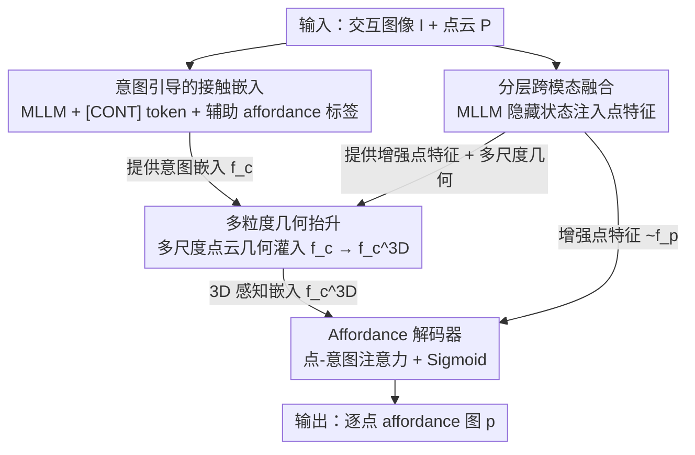

# HAMMER: Harnessing MLLMs via Cross-Modal Integration for Intention-Driven 3D Affordance Grounding

**会议**: CVPR 2026  
**论文**: [CVF Open Access](https://openaccess.thecvf.com/content/CVPR2026/html/Yao_HAMMER_Harnessing_MLLMs_via_Cross-Modal_Integration_for_Intention-Driven_3D_Affordance_CVPR_2026_paper.html)  
**代码**: https://rayyoh.github.io/Hammer/ (项目页，代码与权重已开源)  
**领域**: 3D视觉  
**关键词**: 3D affordance grounding, 意图驱动, 多模态大模型, 跨模态融合, 点云

## 一句话总结
HAMMER 用多模态大模型（MLLM）把交互图像里的"意图"压缩成一个接触感知嵌入，再通过分层跨模态融合把 MLLM 的隐藏状态注入点云特征、并用多粒度几何抬升给这个嵌入补上 3D 空间信息，从而在不依赖中间文本描述或 2D mask 的情况下，更准、更鲁棒地在点云上定位可交互区域。

## 研究背景与动机
**领域现状**：意图驱动的 3D affordance grounding 任务是：给定一张人-物交互图像和对应的物体点云，预测点云上"哪些区域可以被这样交互"（如握、坐、按）。它要求模型同时具备视觉理解（读懂物体语义和交互意图）和空间认知（理解 3D 几何结构）。

**现有痛点**：当前两条主流路线都没把 MLLM 用好。① 生成式方法（如 GREAT）用 MLLM 生成一段物体属性/交互描述的文本，再喂给一个独立的图像分支去融合——但它需要人工标注模板、要两阶段训练，而且只把 MLLM 当"文本生成器"，没用上 MLLM 本身的 2D 理解能力。② 渲染式方法（如 InteractVLM）把点云渲染成多视角 2D 图，用现成分割器预测 2D 接触图，再反投影回 3D——这条路会因为视角覆盖不全导致几何不一致、细节丢失和误差累积。

**核心矛盾**：交互图像里藏着关键的人类意图线索，但目标 3D 物体在形状和尺度上变化很大；如何让"图像里的 2D 交互线索"真正补到"3D 点云表示"上，同时又不丢几何信息，是这个任务最难的地方。中间产物（文本 / 2D mask）恰恰是误差来源。

**本文目标**：不经过任何中间文本或 2D mask，直接（a）从 MLLM 里抽出一个干净的意图表示，（b）把 MLLM 的多模态知识灌进点特征，（c）给这个 2D 来源的意图表示补上 3D 几何意识。

**切入角度**：作者观察到 MLLM 的隐藏状态本身就"懂"任务相关内容——与其让它输出显式文本，不如直接取它的 hidden state 当作桥梁，绕开生成-再融合的损耗。

**核心 idea**：用一个特殊 token `[CONT]` 把交互意图聚合成接触感知嵌入，再用"分层跨模态融合 + 多粒度几何抬升"两件武器，把 MLLM 知识和点云几何在 3D 空间里对齐。

## 方法详解

### 整体框架
HAMMER 输入是点云 $P \in \mathbb{R}^{N\times 3}$ 和配对的交互图像 $I$，输出是逐点的 affordance 概率图 $p=\{p_i\}$（$p_i\in[0,1]$）。整条流水线是单向前馈的四段：先用 MLLM 把图像编码成接触感知意图嵌入 $f_c$，同时让 MLLM 顺带预测文字 affordance 标签作为辅助监督；接着用 MLLM 的隐藏状态分两步增强点云特征；然后把多尺度点云几何逐级灌进 $f_c$ 得到 3D 感知嵌入 $f_c^{3D}$；最后解码器联合处理增强后的点特征 $\tilde f_p$ 和 $f_c^{3D}$ 输出 affordance 图。

### 关键设计

**1. 意图引导的接触嵌入：用一个 token 把交互意图榨干，绕开中间文本**

针对"生成式方法把 MLLM 降格成文本生成器"的痛点，HAMMER 直接取 MLLM 的隐藏状态当意图表示。具体做法是给 MLLM 词表扩一个特殊 token `[CONT]` 专门聚合交互相关信息；同时设计了一个对象中心提示（object-centric prompting），把物体类别先验写进文本提示里，引导模型聚焦相关物体语义、屏蔽画面里的干扰元素。把图文对 $(I,T)$ 喂进 MLLM $F_\theta$ 后，取 `[CONT]` 的最后一层隐藏状态 $h_{[CONT]}$，过一个 MLP 头 $\psi_c$ 得到意图嵌入 $f_c=\psi_c(h_{[CONT]})$。为了让这个嵌入真的"懂"交互，作者还让 MLLM 顺带生成文字 affordance 标签作为辅助任务，用标准语言建模损失 $L_{txt}$ 监督——这一步把交互相关信息进一步压实进 $f_c$。消融显示，去掉类别提示掉 2.49% aIOU（seen）、去掉 affordance 标签预测掉 4.93%（unseen），说明这两个引导信号都是实打实有用。

**2. 分层跨模态融合：把 MLLM 的隐藏状态在"瓶颈层 + 特征层"两步灌进点特征**

针对"纯 3D backbone 抽出的点特征缺语义和交互信息"的痛点，HAMMER 把 MLLM 隐藏状态 $h$ 投影成 $f_h$，分两阶段注入点云的编码-解码流程。第一步（瓶颈级）：点云编码器产出瓶颈特征 $f_p^{enc}$，以它为 query、$f_h$ 为 key/value 做交叉注意力 $\tilde f_p^{enc}=\text{CrossAttn}(f_p^{enc}, f_h, f_h)$，让每个点选择性地吸收相关交互线索；增强后送进解码器恢复全分辨率特征并抽取多尺度特征 $\{f_p^{(i)}\}$。第二步（特征级）：因为物体通常只占图像一小块，作者用一个门控机制对 $f_h$ 的 token 自适应加权得到全局描述子 $f_h^g=\sum_m s_m f_{h,m}$（$s_m$ 是 softmax 归一化的注意力权重），复制对齐后与全分辨率点特征拼接、过 MLP 得到最终增强点特征 $\tilde f_p$。瓶颈级注入让点特征吸收全局上下文，特征级精修则强化对物体语义的整体理解。消融中去掉这一融合模块，unseen aIOU 从 13.71 掉到 10.50。

**3. 多粒度几何抬升：给 2D 来源的意图嵌入补上 3D 空间感**

针对"$f_c$ 来自 2D，缺精确 3D 定位所需的几何细节"的痛点，作者不像 InteractVLM 那样去抬升 2D 接触图，而是直接抬升嵌入本身——这省去了相机参数和中间 2D 结果，更通用。解码器产出的多尺度点特征 $\{f_p^{(i)}\}$ 从粗结构到细节都有，作者逐级把它们灌进嵌入：在第 $i$ 个尺度上，以上一级嵌入 $f_c^{(i-1)}$ 投影成 query、点特征 $f_p^{(i)}$ 投影成 key/value，做带残差的注意力更新 $f_c'^{(i)}=f_c^{(i-1)}+\text{Softmax}\!\big(\tfrac{q^{(i)}(k^{(i)})^\top}{\sqrt d}\big)v^{(i)}$，再过一个带残差的 FFN。逐级累积后最终嵌入 $f_c^{3D}=f_c^{(R)}$ 既含全局形状、又含局部表面特征，变得"3D 感知"。消融中去掉几何抬升，unseen aIOU 从 13.71 掉到 10.20；两个模块全去掉只剩 7.86。

### 损失函数 / 训练策略
总损失是语言建模损失与 affordance 损失的加权和 $L=\lambda_{txt}L_{txt}+\lambda_{aff}L_{aff}$，其中 affordance 损失沿用 GREAT 的做法用 focal loss + dice loss：$L_{aff}=L_{focal}+L_{dice}$。实现上 MLLM 用 Qwen2.5-VL、3D backbone 用 PointNet++，对 MLLM 的语言部分做 rank=16 的 LoRA 微调，端到端混合 BF16 精度训练（点 backbone 保持全精度以稳定优化），4 张 H20、全局 batch 64，AdamW，初始学习率 1e-4，$\lambda_{txt}=1.0$、$\lambda_{aff}=2.0$。

## 实验关键数据

### 主实验
数据集为 PIAD（7k+ 点云、23 类物体、17 种 affordance）与 PIADv2（38.8k 实例、43 类、24 种 affordance，分 Seen / Unseen Object / Unseen Affordance 三个划分）。评测指标：**aIOU**（average Interaction Over Union，预测与真值 affordance 区域的平均重叠，越高越好）、**AUC**（ROC 曲线下面积，越高越好）、**SIM**（相似度，越高越好）、**MAE**（平均绝对误差，越低越好）。

PIAD 上对比 SOTA（aIOU / AUC，%）：

| 方法 | Seen aIOU↑ | Seen AUC↑ | Unseen aIOU↑ | Unseen AUC↑ |
|------|-----------|-----------|--------------|-------------|
| IAGNet (ICCV 23) | 20.51 | 84.85 | 7.95 | 71.84 |
| GREAT (CVPR 25) | 19.61 | 85.22 | 8.32 | 67.46 |
| GEAL (CVPR 25, 语言驱动) | 22.50 | 85.00 | 8.70 | 72.50 |
| **HAMMER (本文)** | **22.20** | **88.43** | **13.71** | **80.92** |

HAMMER 在 PIAD Seen 上 aIOU 超 GREAT 2.59%、超 IAGNet 1.69%；Unseen 上超 GREAT 多达 5.39% aIOU、9.06% AUC，泛化优势最明显。PIADv2 上三个划分全面最优，Seen / Unseen Object / Unseen Affordance 的 aIOU 分别比 GREAT 高 2.45% / 5.12% / 0.5%（Unseen Object 增益最大，说明对新物体几何的理解更强；Unseen Affordance 增益较小，因为完全没见过的新交互类型本就最难）。鲁棒性方面，在按 GEAL 协议构造的加噪点云基准上，HAMMER 在抖动 / 局部丢点 / 局部加点等扰动下 aIOU 分别比 GREAT 高 5.69% / 9.31% / 6.17%。

### 消融实验
核心组件消融（PIAD，aIOU）：

| 配置 | Seen aIOU↑ | Unseen aIOU↑ | 说明 |
|------|-----------|--------------|------|
| HAMMER（完整） | 22.20 | 13.71 | 完整模型 |
| w/o 分层跨模态融合 | 21.15 | 10.50 | 去掉后 unseen 掉 3.21 |
| w/o 多粒度几何抬升 | 20.46 | 10.20 | 去掉后 unseen 掉 3.51 |
| w/o 两者 | 19.55 | 7.86 | 退化到普通 backbone |
| w/o $L_{txt}$ | 20.69 | 9.78 | 去掉辅助文本监督 unseen 掉 3.93 |

意图嵌入引导信号消融（aIOU）：含类别提示 + affordance 标签 22.20 / 13.71；去类别提示 21.95 / 12.35；两者都去 19.72 / 8.78。

### 关键发现
- 两个跨模态/几何模块在 **unseen** 划分上贡献远大于 seen——这正符合直觉：泛化到新物体/新交互时，MLLM 的语义先验和补回来的 3D 几何最能救场。
- 辅助文本监督 $L_{txt}$ 不只是"顺手"，去掉它 unseen aIOU 掉近 4 个点，说明让 MLLM 显式预测 affordance 标签确实把交互信息压实进了嵌入。
- 直接抬升"嵌入"而非"2D 接触图"，既省相机参数又避开反投影误差，是它在加噪基准上比 GREAT 更鲁棒的关键。

## 亮点与洞察
- **用 hidden state 当桥梁，绕开"生成文本再融合"**：把 MLLM 从文本生成器升级为可微的多模态特征源，省掉人工模板和两阶段训练，是这篇最"啊哈"的点。
- **`[CONT]` token + 对象中心提示**：用一个可学习 token 聚合交互意图、用类别先验聚焦目标物体，这套"以 token 收口 + 以提示去噪"的思路可迁移到其他需要从 MLLM 抽紧凑表示的任务（如 referring grounding）。
- **抬升嵌入而非抬升 mask**：把"补 3D 几何"问题从"反投影像素"转成"逐级注意力更新一个向量"，更通用、对噪声更稳，这个视角对所有 2D→3D 提升任务都有启发。

## 局限与展望
- 整套流程挂在一个 MLLM（Qwen2.5-VL）+ LoRA 上，推理/训练开销与显存占用不低（4×H20），落到机器人实时场景的成本未讨论。
- Unseen Affordance 增益仅 0.5% aIOU，说明对"完全没见过的交互类型"仍接近瓶颈——意图嵌入更多是迁移已见过的交互模式，而非真正零样本推理新 affordance。
- 评测仍限于 PIAD/PIADv2 这类单物体点云，场景级、多物体、遮挡严重的真实点云上的表现未知（作者把场景级留作未来方向）。

## 相关工作与启发
- **vs GREAT（CVPR 25）**: 同为意图驱动 3D affordance，GREAT 用 MLLM 生成文本描述再多分支融合、依赖独立图像编码器；HAMMER 直接取 MLLM 隐藏状态分层注入点特征，不要中间文本、不要额外图像分支，泛化与鲁棒性都更强。
- **vs InteractVLM**: InteractVLM 渲染点云→预测 2D 接触图→反投影回 3D，受视角覆盖和反投影误差拖累；HAMMER 直接抬升意图嵌入，免相机参数、免 2D 中间产物，避免几何不一致。
- **vs IAGNet（首个意图驱动基准 PIAD 的提出者）**: IAGNet 设计专门的跨模态融合分支但不含 MLLM 先验；HAMMER 引入 MLLM 的世界知识，在 unseen 上大幅领先（13.71 vs 7.95 aIOU）。

## 评分
- 新颖性: ⭐⭐⭐⭐ 把 MLLM 隐藏状态当跨模态桥梁、抬升嵌入而非 mask，思路清新但仍在已有任务框架内
- 实验充分度: ⭐⭐⭐⭐ 两个标准数据集 + 自建加噪基准 + 充分消融，unseen/鲁棒性都验证到位
- 写作质量: ⭐⭐⭐⭐ 动机清晰、图文对照好，部分公式记号稍密
- 价值: ⭐⭐⭐⭐ 为"如何把 MLLM 用进 3D 理解"给出可复用范式，对具身/机器人 affordance 有实用意义

<!-- RELATED:START -->

## 相关论文

- [\[CVPR 2026\] AffordGrasp: Cross-Modal Diffusion for Affordance-Aware Grasp Synthesis](affordgrasp_cross-modal_diffusion_for_affordance-aware_grasp_synthesis.md)
- [\[CVPR 2026\] Affostruction: 3D Affordance Grounding with Generative Reconstruction](affostruction_3d_affordance_grounding_with_generative_reconstruction.md)
- [\[CVPR 2026\] S$^2$-MLLM: Boosting Spatial Reasoning Capability of MLLMs for 3D Visual Grounding with Structural Guidance](s2-mllm_boosting_spatial_reasoning_capability_of_mllms_for_3d_visual_grounding_w.md)
- [\[CVPR 2025\] GREAT: Geometry-Intention Collaborative Inference for Open-Vocabulary 3D Object Affordance Grounding](../../CVPR2025/3d_vision/great_geometry-intention_collaborative_inference_for_open-vocabulary_3d_object_a.md)
- [\[CVPR 2025\] Grounding 3D Object Affordance with Language Instructions, Visual Observations and Interactions](../../CVPR2025/3d_vision/grounding_3d_object_affordance_with_language_instructions_visual_observations_an.md)

<!-- RELATED:END -->
