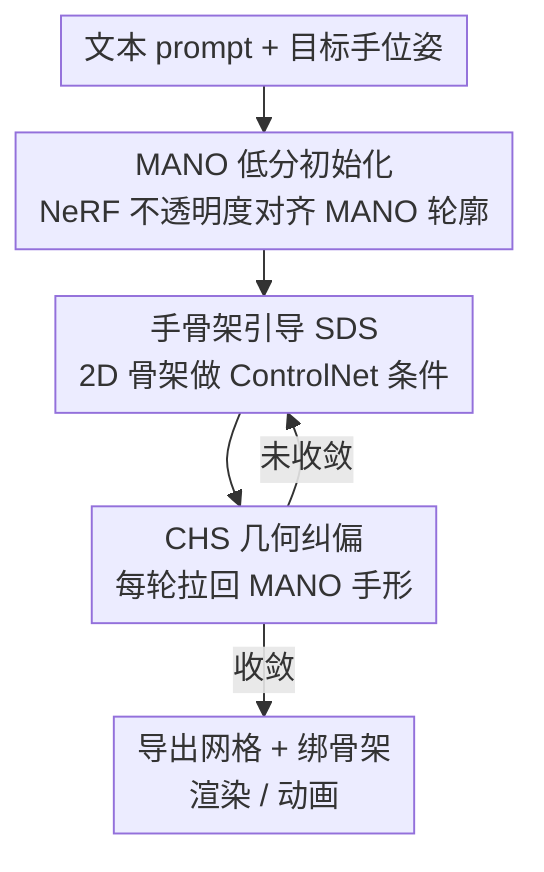

# HandDreamer: Zero-Shot Text to 3D Hand Model Generation using Corrective Hand Shape Guidance

**会议**: CVPR 2026  
**论文**: [CVF Open Access](https://openaccess.thecvf.com/content/CVPR2026/html/Rosh_HandDreamer_Zero-Shot_Text_to_3D_Hand_Model_Generation_using_Corrective_CVPR_2026_paper.html)  
**代码**: 无（论文未提供）  
**领域**: 3D视觉 / 扩散模型  
**关键词**: 文本到3D手部生成, Score Distillation Sampling, MANO先验, ControlNet手骨架引导, 视角一致性

## 一句话总结
HandDreamer 是首个零样本「文本→3D 手模型」方法：先用 MANO 手模型做低分初始化、再用 2D 手骨架作 ControlNet 条件压缩概率分布的模式数，并新增一个 corrective hand shape (CHS) loss 在 SDS 全程纠正几何，从而在不引入 Janus 多面伪影的前提下生成视角一致、细节丰富、可绑定动画的 3D 手。

## 研究背景与动机
**领域现状**：虚拟现实/游戏需要可定制的 3D 手部资产，但传统做法靠上百台相机的多视角采集 + 美术建模，又贵又慢。文本到 3D 这条路上，DreamFusion 提出的 Score Distillation Sampling (SDS) 用预训练 2D 扩散模型去蒸馏一个 3D 表示（NeRF / Gaussian Splatting），让「打一句 prompt 生成 3D 物体」成为可能。

**现有痛点**：通用 SDS 方法迁到手上会全面崩。文本到 3D 方法（ProlificDreamer、ESD、CFD）会出现多面「Janus 伪影」——手指长在不该长的位置、指头数量都不对；文本到人体方法（DreamWaltz、HumanNorm、DreamAvatar）虽有人体先验，但手部区域细节极少；基于单图的方法（OHTA）则泛化不了虚构手，纹理像「画上去」的。

**核心矛盾**：作者把矛头指向了 view-inconsistency 的根因。此前工作（ESD）认为 Janus 来自「mode collapse」——所有视角都塌到 $p_\phi(z_0|y')$ 的同一个模式上（$y'=y+y_v$，$y_v\in\{$front, back, side…$\}$ 是视角相关 prompt）。但本文反驳：**避免 mode collapse 并不能解决问题**。真正的麻烦是 $p_\phi(z_t|y')$ 这个概率分布本身就有**大量可能的模式**（因为相机位姿和手的关节摆位变化极大），SDS 优化并不保证每个视角都收敛到「正确」的那个模式。在低噪 timestep $t_{low}$ 时初始 latent 在分布外、score 不可靠，于是要去高噪 $t_{high}$ 估梯度；但加噪是随机的，相近视角会被推向不同模式 → 视角不一致。手的关节自由度极高，模式数爆炸，问题尤其严重；侧视图还有严重的手指自遮挡，进一步引入几何退化。

**核心 idea**：与其在优化里硬纠 mode，不如**从初始化和条件上压低问题难度**：(1) 用 MANO 手模型做「低分初始化」，让初始 3D 模型在语义和几何上就贴近正确的视角一致模式；(2) 给扩散模型喂一个同时编码视角+手位姿的 2D 手骨架条件，把可能模式数压下来；(3) 再用一个 CHS loss 在 SDS 全程持续把几何往合理手形拉，专治侧视图畸变。

## 方法详解

### 整体框架
HandDreamer 用 NeRF 作为 3D 表示，整条管线分两阶段串行。**阶段一（手形初始化）**：把目标手位姿下的 MANO 网格当几何先验，最小化 NeRF 渲染出的不透明度图与 MANO 轮廓掩码的误差，给 NeRF 的体密度一个「已经像只手」的起点——这一步与 prompt 无关，只需跑一次就能给任意 prompt 复用。**阶段二（CHS 引导的模型生成）**：在初始化好的 NeRF 上做手骨架引导的 SDS——每轮渲一张图、按退火 schedule 加噪得到 $I_t$，同时从 MANO 网格抽当前视角的 2D 手骨架 $S$，把 $(I_t, y, S)$ 喂给冻结的 ControlNet 估噪，回传 SDS 梯度更新 NeRF；与此同时每轮都用 CHS loss 把 NeRF 的不透明度往 MANO 轮廓上「纠」一下，防止几何跑偏。最终导出约 30 万顶点的网格、绑骨架即可做动画。

这是一个「先初始化、再条件引导生成 + 几何纠偏」的多阶段 pipeline，下面用框架图对照三个关键设计：

### 关键设计

**1. MANO 低分初始化：让起点就落在「正确模式」附近**

针对「随机/高分初始化导致相近视角收敛到不同模式」这个根因，作者先给了个理论刻画。设 $x^v_{latent}$、$x^v_{init}$ 分别是理想 3D 模型与初始 3D 模型在视角 $v$ 的渲染图，初始模型相对理想模型的期望绝对 score 为

$$|S_\phi| = \mathbb{E}_v\left[-\frac{\sqrt{\bar\alpha_t}}{1-\bar\alpha_t}\big(E(x^v_{init})-E(x^v_{latent})\big) + \frac{\sqrt{1-\bar\alpha_t}}{\sqrt{\bar\alpha_t}}\,\epsilon\right]$$

其中 $E(\cdot)$ 是 Stable Diffusion 的编码器，$\bar\alpha_t$ 是前向加噪参数（$t$ 越大 $\bar\alpha_t\to0$）。因为 $\epsilon\sim\mathcal N(0,I)$，样本多时第二项趋零；要拿到「低分初始」要么增大 $t$、要么让 $|z^v_{init}-z^v_{latent}|$ 在所有视角都很小。但增大 $t$ 会让 score 同时对**其他错误模式**也变小（$|S_\phi|$ 随 $\bar\alpha_t\to0$ 变得与理想模式无关），反而招来视角不一致。所以正解是后者：**让初始模型在语义/几何上贴近视角一致的真值**。作者据此用 MANO 网格初始化 NeRF 体密度，比标准球面初始化离正确模式近得多，使得低噪和高噪 timestep 下同视角的梯度都保持一致（论文 Fig.2 c/d）。

**2. 手骨架引导的 ControlNet SDS：把概率分布的模式数压下去**

即便初始化对了，prompt 描述的分布 $p_\phi(z_t|y')$ 模式仍然太多（手的关节变化大）。本文的做法是给扩散模型加一个**同时编码视角与手位姿**的条件：把 3D 手骨架投影到视角 $v$ 得到 2D 骨架图 $S$，作者实测这一张图就能把视角和位姿信息一起塞进去，从而有效压缩 $p_\phi(z|y')$ 的模式数。实现上用一个以手骨架为控制信号训练的 ControlNet，并配合 square-root timestep annealing 让采样噪声随优化逐渐降低。SDS 梯度因此变为带骨架条件的形式：

$$\nabla_\theta \mathcal L_{SDS} = \mathbb{E}_{t,\epsilon}\left[w(t)\big(\epsilon_\phi(I_t; y, t, S) - \epsilon\big)\frac{\partial I}{\partial\theta}\right]$$

相比原始 SDS（公式里没有 $S$），这一项把「该往哪个手形/视角收敛」直接钉死，避免相近视角被随机噪声推向不同模式。

**3. Corrective Hand Shape (CHS) loss：SDS 全程持续纠几何，专治侧视图畸变**

前两步把视角一致性救回来了，但作者观察到优化后期仍有几何畸变——尤其侧视图因手指自遮挡严重，会出现厚度不一致、断节等问题。CHS loss 的思路是**不止在初始化时对齐 MANO，而是在 SDS 的每一轮迭代里都做一次「形状纠偏」**：最小化 NeRF 不透明度 $O_v$ 与 MANO 轮廓掩码 $M_v$ 的 L2 距离，使每个视角都不偏离合理手形太远：

$$\mathcal L_{chs}(t) = \frac{\lambda^{chs}_t}{|V|}\sum_{v\in V}\lVert O_v - M_v\rVert^2$$

关键巧思是把权重 $\lambda^{chs}_t$ 按 timestep 退火——因为 SDS 在高噪 $t$ 时偏向更新几何、低噪 $t$ 时偏向更新纹理，所以让 CHS 在高噪时权重更大：

$$\lambda_t = \lambda^{chs}_{max}\frac{t-t_{min}}{t_{max}-t_{min}} + \lambda^{chs}_{min}\frac{t_{max}-t}{t_{max}-t_{min}}$$

论文取 $\lambda_{max}=15000,\lambda_{min}=1000,t_{max}=600,t_{min}=300$。NeRF 不透明度本身由体渲染累积得到 $O_{v,p}=\sum_{i=1}^{T}\big(\prod_{j=1}^{i-1}e^{-\sigma_j\delta_j}\big)(1-e^{-\sigma_i\delta_i})$，再做 min-max 归一化到 0/1。最终总损失为 $L = \lambda_{sds}L_{sds} + \lambda^{chs}_t L_{chs}(t) + \lambda_{img}L_{img} + \lambda_{zvar}L_{zvar}$，其中 $L_{img}$、$L_{zvar}$ 沿用已有工作稳定训练、锐化表面，$\lambda_{sds},\lambda_{img},\lambda_{zvar}=1,0.01,100$。

### 损失函数 / 训练策略
两阶段各自收敛：手形初始化约 2000 次迭代、约 15 分钟（一次性、可复用）；CHS 引导 SDS 约 8000 次迭代、约 45 分钟、占用约 30GB 显存。3D 表示用 NeRF，2D 生成器用 Stable Diffusion 1.5 + ControlNet 1.1，基于 Threestudio 框架，单张 NVIDIA RTX A6000（48GB）完成。

## 实验关键数据

### 主实验
测试集为 45 个 3D 模型、等距视角渲染共 5400 张图。指标含 CLIP-L14（文图相似度）、FID（真实感）、HPSv2（人类偏好）。

| 方法 | CLIP-L14 ↑ | FID ↓ | HPSv2 ↑ |
|------|-----------|-------|---------|
| DreamFusion'22 | 25.12 | 344.19 | 0.187 |
| LatentNerf'23 | 24.34 | 316.42 | 0.189 |
| DreamWaltz'23 | 23.96 | 265.11 | 0.222 |
| HumanNorm'24 | 23.01 | 327.42 | 0.177 |
| OHTA'24 | 22.59 | 467.51 | 0.181 |
| CFD'25 | 26.62 | 262.83 | 0.223 |
| **HandDreamer (Ours)** | **28.63** | **254.62** | **0.241** |

三项指标全面领先：相比此前最强的 CFD'25，CLIP +2.01、FID -8.21、HPSv2 +0.018。50 名 21–35 岁志愿者在 30 个 prompt 上对 8 种方法做盲测排序（几何/纹理/一致性，1–8 分），HandDreamer 三项均分均最高。

### 消融实验
逐步加入三个组件（Skeleton-CN = 手骨架 ControlNet，MANO Init = MANO 初始化，CHS = 纠偏损失），CLIP-L14：

| Skeleton-CN | MANO Init | CHS | CLIP-L14 ↑ | 说明 |
|:---:|:---:|:---:|:---:|------|
| ✗ | ✗ | ✗ | 26.40 | 全去掉：严重 Janus + 几何畸变，甚至不生成手 |
| ✓ | ✗ | ✗ | 26.67 | 只加骨架：有手形但指头数量等几何不准 |
| ✓ | ✓ | ✗ | 28.48 | 加 MANO 初始化：保真度升，但侧视图断节/畸变 |
| ✗ | ✓ | ✓ | 27.07 | 缺骨架条件 |
| ✓ | ✗ | ✓ | 28.02 | 缺 MANO 初始化 |
| ✓ | ✓ | ✓ | **28.63** | 完整模型最佳 |

### 关键发现
- **三个组件缺一不可，且各司其职**：骨架 ControlNet 负责「长出手的形状」、MANO 初始化负责「提升保真/落到正确模式」、CHS 负责「补救侧视图自遮挡导致的几何畸变」。从消融看 MANO 初始化对 CLIP 的边际增益最大（26.67→28.48，+1.81）。
- **CHS 的价值在定量分数上不算巨大（28.48→28.63）但在定性上很关键**：它专门解决侧视图断节/厚度不一致，这类几何问题用全局 CLIP 分未必充分反映，需结合 Fig.9 的可视化看。⚠️ 即「分数小、肉眼差距大」，需注意单看 CLIP 会低估 CHS 贡献。
- **几何先验对输出质量整体重要**：单独移除骨架条件（27.07）或 MANO 初始化（28.02）都低于完整模型（28.63），印证两类先验各自不可替代。

## 亮点与洞察
- **重新定位了 Janus 的根因**：把问题从「mode collapse」纠正为「概率分布模式过多 + 高分初始化让相近视角发散到不同模式」，并给出 score 期望的理论刻画来论证「低分初始化」为何有效——这个分析比单纯堆 trick 更有解释力。
- **一张 2D 手骨架同时编码视角+位姿**：用 ControlNet 条件而非额外网络就把「该看哪个视角、手摆什么姿势」一并钉死，是个轻量又对症的设计，可迁移到其它高关节自由度物体（如脚、全身、动物肢体）的文本到 3D 生成。
- **CHS 的 timestep 退火权重**：把「高噪改几何、低噪改纹理」这个 SDS 经验编进损失权重，让几何纠偏只在该发力的阶段发力，避免高权重 MANO 约束把纹理细节也压平——这种「按优化阶段调约束强度」的思路值得借鉴。
- **初始化可复用**：手形初始化与 prompt 解耦、只需跑一次，对同一手位姿生成大量不同外观的手时摊薄了成本。

## 局限与展望
- 作者承认：作为 SDS 类方法，会继承预训练扩散模型的偏见；且生成模型的关节动画需要先导出网格再绑骨架，不是端到端可动画，未来想做自动化 articulation。
- 自己发现的局限：方法强依赖 MANO 参数化，手位姿需事先指定（靠改 MANO 参数换姿势），对超出 MANO 表达范围的手（如多指虚构手、严重变形手）可能受限；⚠️ 论文未报告对极端/非真实手结构 prompt 的失败率。
- 单 prompt 约 45 分钟、30GB 显存的 SDS 优化仍偏重，离实时/交互式生成有距离；评测仅 45 个模型，规模偏小。

## 相关工作与启发
- **vs ESD / 通用文本到 3D SDS（ProlificDreamer、CFD）**：它们靠 joint-view 或多视角约束去抑制 view-inconsistency，但本文指出这对手这种高关节物体不够——会出现指头穿插、数量错误（CFD 会生成错误指数）。HandDreamer 改从初始化+骨架条件压模式数入手，定量全面领先。
- **vs 文本到人体（DreamWaltz、HumanNorm、DreamAvatar）**：它们用 SMPL/SMPL-X 人体先验，但手部区域细节极少。HandDreamer 专攻手、用 MANO 手先验，把细节和视角一致性都做上去。
- **vs 单图手生成（OHTA）**：OHTA 从学到的数据库取纹理，泛化不了虚构手，结果像「画上去」的；本文零样本纯文本驱动，纹理多样性和几何丰富度更好（FID 254.62 vs OHTA 467.51）。

## 评分
- 新颖性: ⭐⭐⭐⭐⭐ 首个零样本文本到 3D 手生成，且对 Janus 根因给出新分析与理论刻画
- 实验充分度: ⭐⭐⭐⭐ 三指标对比 + 用户研究 + 完整消融，但测试集仅 45 模型、缺失败案例统计
- 写作质量: ⭐⭐⭐⭐⭐ 从根因分析到方法设计逻辑清晰，公式与图示对照到位
- 价值: ⭐⭐⭐⭐ VR/游戏手部资产生成实用，初始化可复用，但优化成本偏高、依赖 MANO

<!-- RELATED:START -->

## 相关论文

- [\[CVPR 2026\] PAD-Hand: Physics-Aware Diffusion for Hand Motion Recovery](pad-hand_physics-aware_diffusion_for_hand_motion_recovery.md)
- [\[CVPR 2026\] Zero-Shot Depth Completion with Vision-Language Model](zero-shot_depth_completion_with_vision-language_model.md)
- [\[CVPR 2026\] TokenHand: Discrete Token Representation for Efficient Hand Mesh Reconstruction](tokenhand_discrete_token_representation_for_efficient_hand_mesh_reconstruction.md)
- [\[CVPR 2026\] UST-Hand: An Uncertainty-aware Spatiotemporal Point Cloud Interaction Network for 3D Self-supervised Hand Pose Estimation](ust-hand_an_uncertainty-aware_spatiotemporal_point_cloud_interaction_network_for.md)
- [\[ECCV 2024\] DreamView: Injecting View-specific Text Guidance into Text-to-3D Generation](../../ECCV2024/3d_vision/dreamview_injecting_view-specific_text_guidance_into_text-to-3d_generation.md)

<!-- RELATED:END -->
