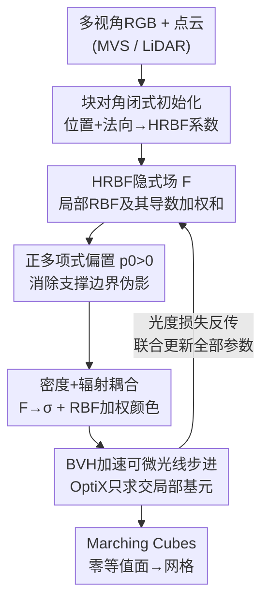

# Hermite Radial Basis Function for Surface Reconstruction via Differentiable Rendering

**会议**: CVPR 2026  
**论文**: [CVF Open Access](https://openaccess.thecvf.com/content/CVPR2026/html/Blanc_Hermite_Radial_Basis_Function_for_Surface_Reconstruction_via_Differentiable_Rendering_CVPR_2026_paper.html)  
**代码**: 无  
**领域**: 3D视觉  
**关键词**: 表面重建, HRBF隐式场, 可微渲染, 径向基函数, BVH加速  

## 一句话总结
把经典的 Hermite 径向基函数（HRBF）隐式曲面搬进可微渲染框架——用一组带导数的局部 RBF 基函数构造一个全局隐式场 $F$，其权重、位置、尺度全部通过多视角 RGB 图像的体渲染端到端优化，借助 BVH 加速光线求交，在 DTU/BlendedMVS 上取得了优于 PGSR、Fast Dipole Sums 的 Chamfer 距离。

## 研究背景与动机

**领域现状**：从多视角图像重建表面，近年走的是「可微渲染 + 辐射场」路线。NeRF 用 MLP 学密度/辐射但几何只是隐含在密度里；NeuS/VolSDF/Neuralangelo 把一个隐式函数 $F$（SDF 类）的零等值面定义为表面，再用体渲染监督它；3D Gaussian Splatting（3DGS）系列（2DGS、Gaussian Surfels、PGSR）则用大量局部高斯基元，靠光栅化（rasterization）快速渲染并事后抽表面。

**现有痛点**：光栅化路线虽快，但有两个结构性短板——其一，光栅化会引入闪烁等渲染伪影，且难以建模复杂相机模型和二次光线；其二，对表面重建而言，光栅化无法直接利用隐式函数提供的**连续曲面定义**，几何只能从离散高斯里近似抽取。另一支 RayGauss 把局部高斯改成体渲染（ray marching）解决了伪影问题，但它只做新视角合成，**没有显式的曲面表示**。

**核心矛盾**：「局部基函数带来的高效率+高表达力」与「连续、可解析微分的曲面几何」这两件好事，现有方法各占一半却没合到一起——3DGS 系有局部基函数没连续曲面，NeuS 系有连续曲面但用 MLP/哈希格被分辨率或网络容量约束。

**切入角度**：作者注意到，表面重建的经典文献早就用径向基函数（RBF）拟合点云隐式场，其中 **HRBF Implicits** 专门处理带法向的 Hermite 数据（点位置 + 法向），把隐式函数写成 RBF **及其导数**的加权和，能从稀疏、不规则的点采样里重建出细节丰富、法向一致的曲面，而且局部基函数天然可扩展、计算复杂度低。

**核心 idea**：用「局部 RBF + 其导数」构造的 HRBF 隐式场来当可微渲染里的那个隐式函数 $F$——不再从离散高斯云事后抽面、也不把隐式场绑死在固定高斯上，而是直接学一个全局 HRBF 场，它解析可微、求值只涉及少量局部相关基函数，同时保留 BVH 加速核方法（RayGaussX）的渲染效率。

## 方法详解

### 整体框架

输入是一组带位姿的多视角 RGB 图像，外加一份场景点云（来自 MVS 或 LiDAR，可稀疏可带噪）；输出是一个可解析微分的隐式场 $F$，其零等值面经 Marching Cubes 抽成三角网格。流程是：先用点云的位置+法向，通过一个**块对角近似的闭式 HRBF 解**把隐式场初始化好；这个隐式场 $F$ 通过 Objects-as-Volumes 的「倒数密度」公式映射成体密度 $\sigma$，再叠一个 RBF 加权的局部辐射场给颜色；然后用 BVH 加速的可微体渲染把每条光线积分成像素颜色，与真值算光度损失，把所有参数（基函数的中心 $\mu_j$、尺度 $R_j$、系数 $\alpha_j,\beta_j$、辐射参数、全局锐度 $s$）一起反传优化；收敛后抽面。

整条管线是「点云初始化 → 隐式场 → 密度+辐射耦合 → BVH 可微渲染 → 联合优化 → 抽面」的串行 pipeline：

### 关键设计

**1. HRBF 隐式场：用「RBF + 其导数」把曲面写成可微的全局隐式函数**

这是全文的表示核心，直接对应「既要局部基函数的效率、又要连续可微曲面」的核心矛盾。隐式函数被建模成一组局部 RBF 及其空间梯度的加权和：

$$F(x) = \sum_{j=1}^{N}\big(\alpha_j\,\phi_j(x) - \beta_j^\top \nabla\phi_j(x)\big) + p(x),\quad \phi_j(x)=\phi(\lVert x-\mu_j\rVert/R_j)$$

其中 $\phi_j$ 是以 $\mu_j$ 为中心、$R_j$ 为尺度的径向基函数（实验用 Wendland $C^2$ 核 $\phi_W(r)=(1-r)_+^4(4r+1)$ 或高斯核 $\phi_G(r)=\exp(-\tfrac12 r^2)$），$\alpha_j\in\mathbb{R}$、$\beta_j\in\mathbb{R}^3$ 是标量/矢量系数，$p(x)$ 是低阶多项式。和经典 HRBF 一样，它满足 Hermite 约束 $F(\mu_j)=0$ 且 $\nabla F(\mu_j)=n_j$——也就是同时拟合点的位置和法向。带导数项 $\nabla\phi_j$ 是它比「只拟合位置」的普通 RBF 几何更准、法向更连贯的关键。和 3DGS 系最大的区别在于：这里 $F$ 是一个**连续、解析可微**的标量场，零等值面 $F(x)=0$ 就是曲面，求值只需要落在当前点局部支撑内的少数基函数，因此既稀疏高效又有真正的曲面定义；而且所有 $\mu_j,R_j,\alpha_j,\beta_j$ 都是可学习参数，能在优化中漂移、缩放、重配权重，去补偿初始点云的缺陷。

**2. 正多项式偏置 $p_0>0$：杜绝局部支撑边界被「点亮」成伪影**

局部基函数有个隐患：在所有基函数支撑之外，$\phi_j=0$，于是 $F$ 的取值完全由多项式 $p(x)$ 决定。作者把 $p(x)$ 简化成常数 $p(x)=p_0$ 当超参。经典 HRBF（Liu 等）重建开放曲面时取 $p_0=0$，但那样会让支撑外 $F=0$ 平凡成立，得在抽面时额外加「邻域内 $F$ 真有符号翻转」的判据才能排除这些假零面。问题是这一招在 Miller 等的体渲染密度公式下**会失效**：随着优化收敛，全局锐度 $s$ 越来越大、把曲面附近的过渡削得越来越尖。作者用 Theorem 1 分析了单条光线 $r(t)=o+t\omega$ 上密度的渐近行为——当 $s\to\infty$，颜色积分只在「$v$ 单调且 $F\le 0$」的若干区间上保留贡献。若 $p_0\le 0$，则在 Wendland 支撑并集的**边界附近** $F\le 0$ 成立，这些边界区间不会被定理排除，于是贡献会在支撑交界处堆积，把本不该可见的支撑边界「点亮」成伪影。解决办法很直接：取 $p_0>0$，保证支撑外及边界上 $F>0$，从而彻底压掉边界伪影（高斯核因衰减极快也有类似问题，故全程都施加这个约束）。实验里固定 $p_0=0.5$。

**3. 块对角闭式初始化：把全局线性方程组拆成可解析求逆的小块**

确定式 (8) 里的系数等价于在 Hermite 约束下解一个正则化线性系统 $(A+\eta I)\lambda=b$，其中 $\lambda=[\alpha_1,\beta_1^\top,\dots,\alpha_N,\beta_N^\top]^\top\in\mathbb{R}^{4N}$，$A\in\mathbb{R}^{4N\times 4N}$ 编码所有中心两两交互，$\eta>0$ 调数据保真与平滑的折中。但 $N$ 一大，这个全局系统既病态又昂贵。因为这里只需要一个**初始化**（后面会被可微渲染继续优化），作者借鉴 Liu 等的做法，假设每个基函数只影响自己的中心，把 $A$ 近似成块对角 $D=\mathrm{diag}(D_1,\dots,D_N)$，每个 $4\times 4$ 块

$$D_i=\begin{bmatrix}\phi_i(\mu_i) & -\nabla\phi_i(\mu_i)^\top\\ \nabla\phi_i(\mu_i) & -H\phi_i(\mu_i)\end{bmatrix}$$

由此解耦系统 $\tilde\lambda=(D+\eta I)^{-1}b$ 对 Wendland/高斯核有简单闭式逆（细节在附录），$O(N)$ 就能从输入点云得到一个稳定、近似目标曲面的隐式场起点。尺度 $R_j$ 取到第 $K$ 近邻的距离（$K$ 是超参），全局锐度 $s$ 也一并初始化。这一步让方法能直接吃 MVS/LiDAR 现成点云，即便点云稀疏带噪，后续优化也能纠正。

**4. 密度-辐射耦合 + BVH 加速可微光线步进：把隐式场变成可优化的图像**

要做逆渲染，隐式场得先变成能被体渲染消费的密度和颜色。密度沿用 Objects-as-Volumes（Miller 等）的倒数密度公式 $\sigma(x,\omega)=\omega\cdot\nabla\log v(x)$，其中 $v(x)=\Psi(sF(x))$，$\Psi$ 是平滑非降的 CDF（实验用 logistic），$s>0$ 控制锐度——这样体渲染权重 $w(t)=T(t)\sigma(t)$ 会集中在 $F(x)=0$ 附近，把渲染和几何直接绑定（消融显示这个公式比 NeuS 的密度公式 Chamfer 更低，0.52 vs 0.55）。辐射场则是局部辐射基元的 RBF 加权混合 $c(\omega,x)=\sum_m w_m(x)\,c_m(\omega)$，权重 $w_m(x)=\phi(\lVert x-\mu_m\rVert/R_m)/\sum_j\phi(\cdot)$ 做归一化，每个基元的视角相关颜色用球谐（SH）+ 球高斯（SG）混合参数化。渲染时复用 RayGauss 的可微体光线步进实现：基于 NVIDIA OptiX 的 BVH 加速结构，只对落在光线上的局部基函数求交，避免逐点遍历全部 $N$ 个基元。对高斯核因无紧支撑，作者用阈值 $\lVert x-\mu_j\rVert^2/R_j^2<\tau$（$\tau=9.0$）截断其求值范围，截断带来的不连续在该阈值下对重建质量无可观察影响。

### 损失函数 / 训练策略
优化目标 $\mathcal{L}=\mathcal{L}_{\text{render}}+\mathcal{L}_{\text{reg}}$。光度项 $\mathcal{L}_{\text{render}}=(1-\lambda_r)\mathcal{L}_{\text{SSIM}}+\lambda_r\mathcal{L}_{L1}$ 混合结构相似度与逐像素 L1。正则项 $\mathcal{L}_{\text{reg}}=\lambda_\alpha\sum_j\alpha_j^2+\lambda_\beta\sum_j\lVert\beta_j\rVert_2^2$ 对 HRBF 系数加 L2 惩罚，抑制过大系数、稳定优化。所有参数（含基函数位置、半径）联合更新，使模型能补偿不完美的初始化。训练 15000 次迭代，每次处理一整张图像，单卡 RTX 4090。抽面用 Marching Cubes（DTU 用 $512^3$、BlendedMVS 用 $1024^3$ 网格），并后处理删去所有相机都看不见的三角面（局部基函数可能引入这类面）。

## 实验关键数据

### 主实验

DTU（15 个场景，Chamfer 距离 ↓，均值）：

| 方法 | 均值 Chamfer ↓ | 训练时间 (min) | 类型 |
|------|------|------|------|
| NeuS | 0.84 | 480 | 神经 SDF |
| Neuralangelo | 0.61 | 1080 | 哈希格 SDF |
| 2DGS | 0.80 | 27 | 高斯光栅化 |
| RaDe-GS | 0.69 | 20 | 高斯+深度 |
| Fast Dipole Sums* | 0.58 | 42 | dipole 隐式 |
| PGSR* | 0.58 | 26 | 高斯光栅化 |
| **本文** | **0.54** | 39 | HRBF 隐式场 |

\* 为作者重算值。本文取得最低均值 Chamfer 0.54，优于之前最好的 PGSR 与 Fast Dipole Sums（均 0.58），且定性上保留更细的几何细节（如羽毛结构）。

BlendedMVS（18 个场景，Chamfer ↓，均值）：

| 方法 | 均值 Chamfer ↓ | 训练时间 (min) |
|------|------|------|
| Gaussian Surfels | 1.28 | 3 |
| NeuS2 | 0.81 | 5 |
| Fast Dipole Sums* | 0.65 | 45 |
| **本文** | **0.52** | 15 |

本文均值 0.52 显著优于之前最好的 0.65，且只需 ~15 min/场景（Fast Dipole Sums 约 1 小时）。作者把增益归于可学习的点位置 + 局部 HRBF 表示更贴合场景几何。

### 消融实验

| 配置 | 均值 Chamfer ↓ | 说明 |
|------|------|------|
| 密度公式：NeuS | 0.55 | 替换为 NeuS 密度公式 |
| 密度公式：Objects-as-Volumes | **0.52** | 本文采用，更优 |
| RBF：Wendland $C^2$ | 0.58 | 紧支撑核 |
| RBF：高斯 | **0.52** | 本文采用，即便截断仍更优 |
| 多项式偏置 $p_0=0$ | 明显退化 | 出现支撑边界伪影 |
| $p_0>0$（约 0.5 取浅极小） | 显著更好且稳定 | 全程固定 $p_0=0.5$ |

### 关键发现
- **$p_0$ 是「生死开关」而非微调旋钮**：$p_0=0$ 重建质量明显崩坏（边界伪影），任何正值都显著更好且对取值不敏感（$[0,1]$ 内 $p_0\approx 0.5$ 处有浅极小），这与 Theorem 1 的渐近分析吻合——固定 $p_0=0.5$ 主要是为了规避 $p_0=0$ 的病态行为。
- **密度公式与核函数都是小而稳的增益**：换 Objects-as-Volumes（0.52 vs 0.55）和换高斯核（0.52 vs 0.58）各带来约 0.03–0.06 的 Chamfer 改善；高斯核即使被截断也优于紧支撑的 Wendland，说明软衰减+BVH 截断的组合是划算的。
- **效率不靠牺牲精度**：在 BlendedMVS 上既是最低 Chamfer 又是 SDF/dipole 类里最快之一（15 min vs Fast Dipole Sums 的 45 min），局部基函数 + BVH 求交的稀疏性是效率来源。

## 亮点与洞察
- **把「老算法」接进「新管线」的范式迁移**：HRBF Implicits 是点云重建的经典方法，本文最妙的是不把它当点云后处理，而是让它的系数/位置/尺度成为可微渲染的优化变量——经典几何先验 + 现代图像监督，互相补位（先验给好初始化，图像监督纠初始化缺陷）。
- **Theorem 1 把一个工程超参讲成了理论必然**：$p_0>0$ 看似是个 trick，作者却从体渲染密度的渐近极限推出「为什么必须正」，把「边界被点亮」这个现象解释清楚，这种「现象→机制→约束」的论证很值得借鉴。
- **可解析微分的曲面是隐藏红利**：相比从离散高斯抽面，$F$ 解析可微意味着法向、曲率等几何量都能直接求导拿到，对下游（重光照、物理仿真）更友好——虽然本文没展开，但这是表示层面相对 3DGS 系的结构性优势。
- **BVH + 截断**这一招可迁移到任何「大量局部核 + 体渲染」的场景，用空间加速结构把 $O(N)$ 逐核求值降到只算局部相关核。

## 局限与展望
- **依赖外部点云初始化**：方法需要 MVS 或 LiDAR 点云做起点，没有点云时如何冷启动、纯从图像 from-scratch 的表现如何，文中未给（⚠️ 论文强调初始化能纠错，但未提供无点云 baseline）。
- **评测规模偏小**：DTU/BlendedMVS 都只用了**子集**场景，且主战场是物体级/小场景；大型户外仅给了 Tanks and Temples 的 Ignatius 一个定性例子，缺乏无界大场景的定量对比。
- **超参与核选择仍需人工**：$K$（近邻定尺度）、$\tau$（高斯截断）、$p_0$、$\eta$ 等多个超参靠经验设定；高斯截断引入的 $F$ 不连续虽「观察不到影响」，但缺乏更严格的误差界。
- **改进思路**：可探索自适应增删基函数（让 $N$ 随几何复杂度变化）、把解析可微曲面用于逆渲染/材质分解，或在初始化阶段引入更高质量的法向估计以进一步压低 Chamfer。

## 相关工作与启发
- **vs NeuS / Neuralangelo（神经隐式 SDF）**：它们用 MLP/哈希格参数化 $F$，受网络容量或固定分辨率约束，且 Neuralangelo 训练长达 18 小时；本文用稀疏局部 RBF 参数化 $F$，无固定分辨率限制，精度更高（0.54 vs 0.61）且快一个数量级以上。
- **vs PGSR / 2DGS（3DGS 系光栅化重建）**：它们靠光栅化对齐高斯到表面再事后抽面，有光栅化伪影且无连续曲面定义；本文用体渲染 + 解析隐式场，Chamfer 更低（0.54 vs 0.58）、几何细节更锐。
- **vs Fast Dipole Sums（dipole 隐式 + 可微渲染）**：两者都用核函数构造隐式场并可微渲染，但 Fast Dipole Sums 依赖**静态**点云和全局 dipole 求值；本文的点位置/尺度全可学、且只在局部 BVH 内求值，既更准（0.52 vs 0.65 on BlendedMVS）又更快（15 vs 45 min）。
- **vs RayGauss / RayGaussX（局部高斯体渲染）**：本文直接复用其 BVH 加速可微光线步进实现，但把渲染目标从「新视角合成的辐射场」换成「带显式曲面的 HRBF 隐式场」，补上了 RayGauss 缺失的几何重建能力。

## 评分
- 新颖性: ⭐⭐⭐⭐ 把经典 HRBF Implicits 首次端到端接入可微渲染，并用理论（Theorem 1）证成关键设计 $p_0>0$，思路清晰且有原创性。
- 实验充分度: ⭐⭐⭐⭐ DTU/BlendedMVS 双数据集 SOTA + 完整消融（密度公式/核/偏置），但仅用子集场景、大场景只有定性。
- 写作质量: ⭐⭐⭐⭐ 公式与动机交代清楚，背景到方法的推导连贯；部分关键证明与闭式逆推到附录。
- 价值: ⭐⭐⭐⭐ 为「局部基函数 + 连续曲面 + 可微渲染」提供了兼顾精度与效率的新表示，对表面重建后续工作有借鉴价值。

<!-- RELATED:START -->

## 相关论文

- [\[CVPR 2026\] Distilling Unsigned Distance Function for Surface Reconstruction from 3D Gaussian Splatting](distilling_unsigned_distance_function_for_surface_reconstruction_from_3d_gaussia.md)
- [\[CVPR 2026\] 3D Gaussian Splatting with Self-Constrained Priors for High Fidelity Surface Reconstruction](3d_gaussian_splatting_with_self-constrained_priors_for_high_fidelity_surface_rec.md)
- [\[NeurIPS 2025\] LinPrim: Linear Primitives for Differentiable Volumetric Rendering](../../NeurIPS2025/3d_vision/linprim_linear_primitives_for_differentiable_volumetric_rendering.md)
- [\[CVPR 2026\] UTrice: Unifying Primitives in Differentiable Ray Tracing and Rasterization via Triangles for Particle-Based 3D Scenes](utrice_unifying_primitives_in_differentiable_ray_tracing_and_rasterization_via_t.md)
- [\[CVPR 2026\] D-Prism: Differentiable Primitives for Structured Dynamic Modeling](d-prism_differentiable_primitives_for_structured_dynamic_modeling.md)

<!-- RELATED:END -->
