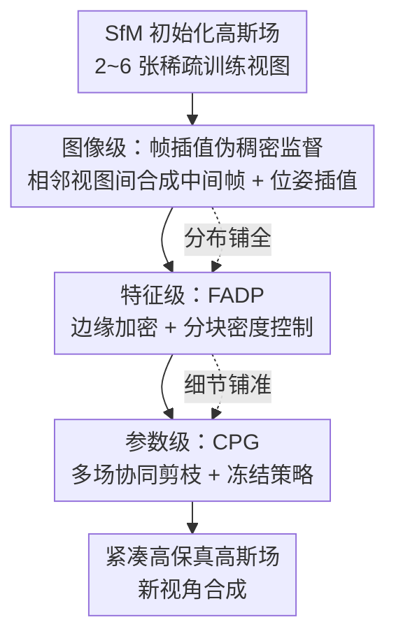

# HeroGS: Hierarchical Guidance for Robust 3D Gaussian Splatting under Sparse Views

**会议**: CVPR 2026  
**论文**: [CVF Open Access](https://openaccess.thecvf.com/content/CVPR2026/html/Li_HeroGS_Hierarchical_Guidance_for_Robust_3D_Gaussian_Splatting_under_Sparse_CVPR_2026_paper.html)  
**代码**: 无  
**领域**: 3D视觉  
**关键词**: 稀疏视角重建, 3D高斯泼溅, 帧插值伪标签, 自适应稠密化, 几何一致性剪枝  

## 一句话总结
HeroGS 把稀疏视角下 3DGS 的过拟合问题拆到图像、特征、参数三个层级逐级约束——图像级用帧插值合成伪稠密监督、特征级按边缘/分块自适应增删高斯、参数级靠多场协同剪枝去掉几何不一致的高斯，在 LLFF 2/3/6 视角上全面超过 FSGS、DropGaussian 等 SOTA。

## 研究背景与动机
**领域现状**：3DGS 用显式高斯基元做新视角合成，渲染质量逼近 NeRF 而速度实时，已经成为高保真重建的主流。但它的成功高度依赖密集相机覆盖。

**现有痛点**：一旦输入视角变稀疏（2~6 张图），监督信号严重不足，高斯分布会变得极不规则——具体表现为三类病灶：全局覆盖稀疏、背景区域模糊、高频细节区高斯错位/扭曲。落到现象上就是过拟合到少数训练视图、新视角一渲染就崩。

**核心矛盾**：稀疏视角下，落在视野之外的高斯几乎收不到梯度反馈，而仅有的训练视图又让模型迅速过拟合。已有的稀疏视角 3DGS 工作（FSGS 加速早期稠密化、DropGaussian 用 dropout 正则、CoR-GS 用多视角一致性）都只在**单一层级**打补丁，缺乏从全局到局部贯通的引导，因此高斯场始终优化得不彻底：背景高斯不够导致模糊，高频细节缺监督导致错位。

**本文目标**：在极稀疏输入下，让高斯分布既全局完整、又局部精确、还几何一致，三件事同时达成。

**切入角度**：作者观察到"加视角能改善梯度覆盖"（Fig. 1），于是想到——如果合成出介于训练视图之间的伪视图当监督，就能在不增加真实采集成本的前提下把稀疏监督变稠密；而伪标签精度有限的细节问题，再交给特征级和参数级逐层收紧。

**核心 idea**：用一个跨图像/特征/参数三层级、从全局到局部协同的分层引导框架，替代单层级补丁式正则，来系统性地塑形稀疏视角下的高斯分布。

## 方法详解

### 整体框架
HeroGS 从 SfM 初始化的高斯场出发，在训练全程叠加三个层级、互相递进的监督信号。整体逻辑是"先把分布铺全、再把细节铺准、最后把错的剔掉"：

1. **图像级（铺全）**：在相邻训练视图之间用帧插值模型合成中间 RGB 帧当伪标签，把稀疏监督转成伪稠密监督，全局规整高斯分布，给下游提供丰富的空间结构线索；
2. **特征级（铺准）**：FADP 利用训练视图的边缘特征和分块统计，在高频边界处加密高斯、在均质区域剪冗余、在稀疏背景补高斯，得到更精确紧凑的分布；
3. **参数级（剔错）**：CPG 引入两个辅助高斯场与主场联合训练，按几何一致性协同剪枝，删掉位置漂移、形状扭曲的不一致高斯。

三个层级不是孤立叠加，而是带反馈互联（论文里画成虚线）：上一级输出的更完整分布，是下一级能可靠工作的前提（如特征级的分块计数 $C$ 依赖图像级先把分布铺全，参数级的协同剪枝依赖特征级先把细节铺准）。

### 关键设计

**1. 图像级伪稠密监督：把稀疏视图插出"假"的密集监督**

针对的痛点是稀疏视角下高斯收不到足够梯度、容易过拟合。作者用 VFI 帧插值模型在相邻训练帧 $I_n$、$I_{n+1}$ 之间合成中间帧 $I_n^{(\alpha)} = \mathrm{VFI}(I_n, I_{n+1}, \alpha)$，$\alpha\in(0,1)$ 是插值权重。由于插值帧没有真值外参，相机位姿同样用插值给：旋转用球面线性插值 $R_n^{(\alpha)}=\mathrm{slerp}(R_n,R_{n+1},\alpha)$，平移用线性插值 $T_n^{(\alpha)}=(1-\alpha)T_n+\alpha T_{n+1}$。训练时从这些合成视角渲染并和伪标签比对，监督同时包含光度项（L1 + D-SSIM）和深度几何项（用 Pearson 相关系数约束渲染深度 $\hat D_n^{(\alpha)}$ 与估计深度 $D_n^{(\alpha)}$）：

$$L_g=\sum_{n=1}^{N-1}\Big[\lambda_1\lVert I_n^{(\alpha)}-\hat I_n^{(\alpha)}\rVert_1+\lambda_2 L_{\text{D-SSIM}}(I_n^{(\alpha)},\hat I_n^{(\alpha)})+\lambda_3\big(1-\mathrm{Corr}(D_n^{(\alpha)},\hat D_n^{(\alpha)})\big)\Big]$$

两个关键工程点保证伪标签可用：① 一个选择模块过滤掉低质量伪标签，只留高质量的参与训练（细节在附录）；② 因为插值模型没有 3D 感知，合成图和插值位姿之间会有轻微错位，所以把这些插值相机位姿设成**可学习变量**，和高斯场一起联合优化。它和"只在单视图上加正则"的旧做法的本质区别是：直接补上了缺失视角的梯度通路，让分布全局变均匀。

**2. 特征级 FADP：边缘加密 + 分块密度控制，专治高频与背景**

伪标签提供了全局监督，但细节精度有限、约束不住高频几何结构（Fig. 3），所以特征级用两条互补策略细化分布。其一是**边缘感知稠密化**：对每张训练图用边缘检测模型抽边缘图 $E_n$，沿边缘采 2D 点反投影到 3D 当新高斯中心，新高斯 $\hat G$ 的颜色/不透明度/形状由其 $K$ 近邻（默认 $K=3$）按反距离加权插值初始化，$\hat A=\frac{\sum_k w_k A_k}{\sum_k w_k}$，$w_k=\frac{1}{d_k+\epsilon}$——让高频边界处长出细节高斯。

其二是**分块密度控制**，防止边缘加密造成局部过采样。把图像切成 $m\times m$ 网格（默认 $m=8$），统计每块投影高斯数 $C=\{c_1,\dots,c_{m^2}\}$，再用分段函数重加权：

$$c_i'=\begin{cases}c_{\min}, & c\le\tau_{\text{sparse}}\\ c_i\cdot\lambda_{\text{low}}, & \tau_{\text{sparse}}<c<\tau_{\text{low}}\\ c_i, & \tau_{\text{low}}\le c\le\tau_{\text{high}}\\ c_i\cdot\lambda_{\text{high}}, & c>\tau_{\text{high}}\end{cases}$$

其中 $\lambda_{\text{low}}>1$ 给欠表达区域增采样、$\lambda_{\text{high}}<1$ 给过密区域压采样，稀疏块强制保底 $c_{\min}$ 保证覆盖；再做归一化 $C'\leftarrow\mathrm{round}\!\big(C'\cdot\frac{\sum_i c_i}{\sum_i c_i'}\big)$ 并加残差修正，使 $\sum_i c_i'=\sum_i c_i$，即在**不改变高斯总数**的前提下重新分配密度。两条策略紧耦合：边缘加密负责"在边界加细节"，分块控制负责"别让加的细节在别处造成过密或稀疏"，从而在纹理敏感稠密化和全局一致性之间取得平衡。

**3. 参数级 CPG：多场协同剪枝 + 冻结策略，剔掉几何不一致的高斯**

受 CoR-GS 启发，作者引入两个辅助高斯场和主场联合训练，用三场之间的自一致性来识别并删掉错误高斯。**协同剪枝准则**：给定源场 $G^s$ 和目标场 $G^t$，对源场每个高斯 $G_y^s$ 在目标场找最近邻 $z^*=\arg\min_z\lVert p_y^s-p_z^t\rVert_2$，记距离 $w_y=\lVert p_y^s-p_{z^*}^t\rVert_2$，若 $w_y>\delta$（设 $\delta=5$）就把它剪掉——即一个高斯在其他场里找不到几何上对得上的对应点，就判为不可靠。

**两阶段冻结策略（Post-Freeze）**是关键：在预设迭代 $N_{\text{iter}}$ 之前，三个场互相协同剪枝；之后把两个辅助场**部分冻结**（固定 scale 和 rotation），只让主场继续更新，剪枝转为单向——主场以两个冻结辅助场为几何参照被剪。这样做的好处是早期靠多场冗余对齐、后期靠冻结场稳定几何。消融显示两个辅助场分别冻结 scale / rotation（解耦几何表示）比单辅助场效果更好。整段训练里每个场都用训练视图损失 + 生成视图损失独立监督，总损失 $L=\lambda_g L_g+L_r$。

### 损失函数 / 训练策略
总目标 $L=\lambda_g L_g+L_r$，其中 $L_g$ 是生成（伪标签）视角上的光度 + 深度监督（Eq. 4），$L_r$ 是真实训练视图上的同形式损失。主场与两个辅助场各自独立用这套损失监督；参数级在 $N_{\text{iter}}$ 处切换为冻结 + 单向剪枝。插值因子 $S$（每对相邻视图间生成 $S-1$ 帧）默认取 $S=4$，在画质与计算开销间折中。

## 实验关键数据

### 主实验
LLFF（2/3/6 视角，8× 降采样）与 Tanks&Temples（3/6 视角，不降采样），指标 PSNR / SSIM / LPIPS。

| 数据集 | 视角 | 指标 | HeroGS | 次优基线 | 说明 |
|--------|------|------|--------|----------|------|
| LLFF | 2 | PSNR↑ | **18.78** | 17.38 (CoR-GS) | 极稀疏下领先最明显（+1.40） |
| LLFF | 2 | SSIM↑ | **0.595** | 0.539 (CoR-GS) | +0.056 |
| LLFF | 3 | PSNR↑ | **21.30** | 20.55 (DropGaussian) | +0.75 |
| LLFF | 6 | PSNR↑ | **24.59** | 24.55 (DropGaussian) | 稠密时差距收窄 |
| T&T | 3 | PSNR↑ | **17.51** | 17.06 (CoR-GS) | 大场景同样领先 |
| T&T | 6 | PSNR↑ | **24.70** | 24.15 (DropGaussian) | +0.55 |

可见越稀疏（2 视角）增益越大，验证了分层引导主要在"监督极度匮乏"时补位；6 视角时各方法差距自然收窄。

### 消融实验
逐级累加（LLFF，PSNR）：

| 配置 | 2 views | 3 views | 6 views | 说明 |
|------|---------|---------|---------|------|
| FSGS（baseline） | 15.65 | 20.43 | 24.15 | 起点 |
| + VFI（图像级） | 16.91 | 20.68 | 24.18 | 伪稠密监督贡献最大单跳 |
| + FADP（特征级） | 17.28 | 20.99 | 24.25 | 高频/背景细化 |
| + GSField 冻结 scale | 17.93 | 21.08 | 24.40 | 参数级雏形 |
| HeroGS（全） | **18.78** | **21.30** | **24.59** | 完整三级 |

层级互依（LLFF 2 视角，Tab. 6）：单层级平均 16.78 PSNR，加到两层平均 +0.9 PSNR / +0.038 SSIM，三层全开再 +1.1 PSNR / +0.055 SSIM，增量不降反升，说明三层不是简单相加而是互相增强。

其他分析表：

| 消融项 | 设置 | PSNR | 结论 |
|--------|------|------|------|
| Post-Freeze (3 views) | w/o → All | 21.16 → 21.30 | 冻结策略稳定净增 |
| 插值模型 (3 views) | PerVFI / GT / Ours | 20.78 / 21.09 / 21.30 | 选用的 VFI 甚至略超直接用 GT 帧 |
| 插值因子 $S$ | 2 → 4 → 8/16 | $S{=}4$ 后趋稳 | 折中取 $S=4$ |

### 关键发现
- **图像级伪标签是最大功臣**：从 FSGS 加 VFI，2 视角 PSNR 直接 +1.26，是单步增益最大的模块，证明"把稀疏监督插成稠密"对极稀疏场景最有效。
- **CPG 反而修复了插值的精度缺陷**：插值模型对比表里，选用的 VFI（21.30）甚至略高于"直接用均匀采样的 GT 图"（21.09，且该对比禁用了 CPG），作者解释是 CPG 能剪掉伪标签带来的局部几何错位，把这部分差距补回来。
- **更少高斯、更高 PSNR**：训练动态分析显示约 5K 迭代就超过 baseline，且全程维持显著更少的高斯数，重建更紧凑、显存更省、渲染更快。

## 亮点与洞察
- **"分层引导"把过拟合拆成了可分治的三层**：全局铺全（图像）→ 局部铺准（特征）→ 几何剔错（参数），每层对应稀疏视角下一类具体病灶（覆盖稀疏 / 高频错位 / 几何不一致），思路清晰且各层增益可叠加，是很值得迁移的"分而治之"范式。
- **可学习插值位姿**很巧：用帧插值当伪标签的最大隐患是合成图与位姿不匹配，作者干脆把插值位姿设成可学习变量随训练联合优化，绕过了"插值模型缺乏 3D 感知"的硬伤。
- **冻结辅助场做协同剪枝**：固定 scale/rotation 强迫两个辅助场收敛到不同局部最优，从而给主场提供更有判别力的几何参照来剪错误高斯——比单场自剪枝更稳，这个"多场冗余 + 后期冻结"的技巧可迁移到其他需要自一致性判别的重建任务。

## 局限与展望
- 依赖外部帧插值模型（VFI）生成伪标签，伪标签质量与场景运动幅度强相关；论文也承认插值帧细节精度不足、需靠 CPG 补救，若场景视差很大或非平滑相机轨迹，插值可能失效。
- 引入两个辅助高斯场联合训练会增加训练显存与计算（虽最终高斯数更少，但训练期多场并存的开销论文未量化）。⚠️ 低质量伪标签选择模块、辅助场数量/配置的更细对比放在附录，正文未给完整数据，需查附录确认。
- 评测集中在 LLFF 与 Tanks&Temples 的前向/室外场景，对 360° 环绕、强反射或动态场景的鲁棒性未验证。
- 改进方向：用带 3D 先验的视角合成（如扩散式 NVS）替代纯 2D 帧插值，可能从根上提升伪标签的几何准确度，减轻 CPG 的纠错负担。

## 相关工作与启发
- **vs FSGS**：HeroGS 基于 FSGS 实现，但 FSGS 只在早期加速稠密化补初始高斯不足，属单层级；HeroGS 在其上叠加图像/特征/参数三级引导，2 视角 PSNR 从 15.65 提到 18.78，说明分层引导对极稀疏的补位远超单纯加密。
- **vs DropGaussian**：DropGaussian 用 dropout 正则遮挡区高斯，但论文指出它在高频区因分布不准会有 ghosting；HeroGS 用 FADP 主动按边缘/分块塑形高频分布，纹理更锐利。
- **vs CoR-GS**：CPG 的多场协同剪枝思想源自 CoR-GS 的多视角一致性，但 HeroGS 加了"后期部分冻结 + 单向剪枝"的两阶段策略，并把它放进三级框架的末端，作为前两级铺好分布后的"几何质检"，而非独立正则。

## 评分
- 新颖性: ⭐⭐⭐⭐ 单个模块（伪标签/FADP/协同剪枝）多有前作影子，但"图像-特征-参数三级分层引导"的统一框架与各级互依设计是清晰的新组合。
- 实验充分度: ⭐⭐⭐⭐ 两数据集 × 2/3/6 视角 + 逐级消融 + 层级互依 + 插值模型/因子分析较完整，但部分关键消融（辅助场配置、伪标签筛选）放在附录。
- 写作质量: ⭐⭐⭐⭐ 动机—方法—实验逻辑顺畅，图示对照清晰；个别符号（如 $C$ 在特征级的角色）需结合图才好懂。
- 价值: ⭐⭐⭐⭐ 稀疏视角 3DGS 是高需求方向，分层引导范式与"更少高斯更高质量"的结果对实际部署有吸引力。

<!-- RELATED:START -->

## 相关论文

- [\[CVPR 2026\] Robust3DGSW: Toward Robust Watermarking for Quantization-Aware 3D Gaussian Splatting](robust3dgsw_toward_robust_watermarking_for_quantization-aware_3d_gaussian_splatt.md)
- [\[CVPR 2026\] AERGS-SLAM: Auto-Exposure-Robust Stereo 3D Gaussian Splatting SLAM](aergs-slam_auto-exposure-robust_stereo_3d_gaussian_splatting_slam.md)
- [\[CVPR 2026\] ULF-Loc: Unbiased Landmark Feature for Robust Visual Localization with 3D Gaussian Splatting](ulf-loc_unbiased_landmark_feature_for_robust_visual_localization_with_3d_gaussia.md)
- [\[CVPR 2026\] TextFM: Robust Semi-dense Feature Matching with Language Guidance](textfm_robust_semi-dense_feature_matching_with_language_guidance.md)
- [\[CVPR 2026\] Intrinsic Geometry-Appearance Consistency Optimization for Sparse-View Gaussian Splatting](intrinsic_geometry-appearance_consistency_optimization_for_sparse-view_gaussian_.md)

<!-- RELATED:END -->
