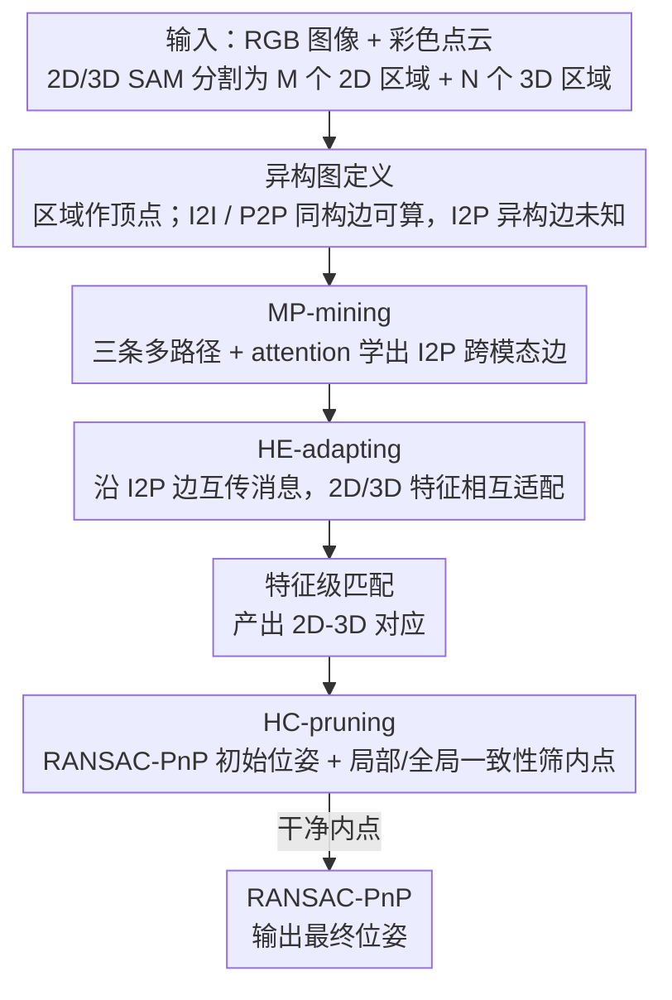

# Hg-I2P: Bridging Modalities for Generalizable Image-to-Point-Cloud Registration via Heterogeneous Graphs

**会议**: CVPR 2026  
**arXiv**: [2603.27969](https://arxiv.org/abs/2603.27969)  
**代码**: [https://github.com/anpei96/hg-i2p-demo](https://github.com/anpei96/hg-i2p-demo)  
**领域**: 3D视觉  
**关键词**: 图像-点云配准, 异构图, 跨模态特征适配, 对应关系剪枝, 跨域泛化

## 一句话总结

Hg-I2P 引入异构图（Heterogeneous Graph）来统一建模 2D 图像区域和 3D 点云区域之间的关系，通过多路径邻接关系挖掘学习跨模态边、基于异构边的特征适配和基于图的投影一致性剪枝，在六个室内外跨域基准上实现了最优的泛化能力和精度。

## 研究背景与动机

1. **领域现状**：图像到点云（I2P）配准旨在建立 2D 像素与 3D 点之间的对应关系，是视觉定位、导航和 3D 重建的基石。近年来基于学习的方法通过改进骨干网络、匹配策略和损失函数取得了进展，如 MATR 采用 coarse-to-fine 匹配、CoFiI2P 引入补丁级匹配。

2. **现有痛点**：现有方法在训练域内表现良好，但在未见过的场景中性能严重下降。核心原因是 2D 图像特征（基于外观）和 3D 点云特征（基于几何）分布差异巨大——即使是正确的对应关系，特征相似度也可能很低，神经网络难以区分正确匹配。

3. **核心矛盾**：现有改进要么只做特征精炼（缺乏显式跨模态推理），要么只做对应关系剪枝（依赖深度预测或手工启发式），两者割裂处理无法系统性解决泛化问题。虽然视觉基础模型（SAM、DepthAnything 等）能帮助桥接模态差距，但缺乏统一框架来同时利用特征精炼和对应关系剪枝。

4. **本文目标** (1) 如何构建一个统一结构，同时支持跨模态特征精炼和对应关系剪枝？(2) 如何有效学习 2D-3D 区域之间的跨模态映射关系？(3) 如何利用图结构中的一致性信息过滤错误匹配？

5. **切入角度**：用 2D/3D SAM 将图像和点云分割为区域，构建异构图来建模区域间的关系。图的异构边（I2P 边）定义了一种 2D-3D 区域映射，既能指导特征精炼（沿边进行跨模态消息传递），又能支持对应关系剪枝（通过图内的投影一致性检查）。

6. **核心 idea**：用异构图统一建模 2D-3D 区域关系，在同一图结构上同时进行跨模态特征适配和对应关系剪枝，实现强泛化的 I2P 配准。

## 方法详解

### 整体框架

Hg-I2P 要解决的是 I2P 配准"换个场景就崩"的泛化问题，根子在于 2D 外观特征和 3D 几何特征天差地别、即便是正确匹配相似度也可能很低。它的破题方式是把图像和点云都先切成区域、再用一张图把这两堆区域串起来统一推理。具体来说，输入一张 RGB 图像和一个彩色点云，先用 2D/3D SAM 把它们分割成 $M$ 个 2D 区域和 $N$ 个 3D 区域，每个区域当作图里的一个顶点，构成异构图 $\mathcal{G}_H = (\mathcal{V}_H, \mathcal{E}_H)$。图建好后，特征和对应关系都在这同一张图上流转：先由 MP-mining 在推理时把缺失的跨模态边补出来，再由 HE-adapting 沿这些边做跨模态消息传递、把两侧特征往对方拉近，最后用精炼后的特征做区域/点级匹配、由 HC-pruning 借图的投影一致性把错误匹配筛掉，剩下的内点交给 RANSAC-PnP 估出最终位姿。三个模块共用一套边，是这套方法"特征精炼和对应剪枝不再各干各的"的关键。

### 关键设计

**1. 异构图定义：把两种模态塞进同一张图，让边同时服务于精炼和剪枝**

以往方法要么只精炼特征、要么只剪枝对应，两件事各自为政，谁也没法系统性地治泛化。异构图的思路是给二者一个共同载体。顶点集 $\mathcal{V}_H = \mathcal{V}_I \cup \mathcal{V}_P$ 把 $M$ 个 2D 区域和 $N$ 个 3D 区域并到一起，每个顶点带一个 $c$ 维特征（区域内特征做平均池化）。边分三类：同构 2D-2D 边 $\mathbf{E}_{I2I}$ 按 2D 区域特征距离给出，$\mathbf{E}_{I2I}^{(i,j)} = e^{-\alpha\|\mathbf{v}_i^I - \mathbf{v}_j^I\|_2^2}$；同构 3D-3D 边 $\mathbf{E}_{P2P}$ 对称地按 3D 区域特征距离给出；真正关键的是异构 2D-3D 边 $\mathbf{E}_{I2P}$，它本该由 GT 位姿下 3D 区域投影到图像与 2D 区域的 IoU 来定义，可推理时根本拿不到 GT 位姿——所以这条边只能学出来，这也正是下一个模块要干的事。把模态内和模态间关系装进一张图后，后续的特征精炼（沿边传消息）和对应剪枝（查图内一致性）就能在同一结构里接力完成。

**2. MP-mining：在没有 GT 位姿时，借同模态的邻居把跨模态边"绕"出来**

异构边 $\mathbf{E}_{I2P}$ 推理时未知，直接靠初始特征匹配 $\tilde{\mathbf{E}}_{I2P}$ 估又往往不准。MP-mining 的办法是不指望一步到位，而是借已知的同构边当跳板，从三条路径间接逼近 2D-3D 邻接关系：

$$\mathbf{E}_{I2P}^1 = \mathbf{E}_{I2I}\tilde{\mathbf{E}}_{I2P}, \quad \mathbf{E}_{I2P}^2 = \tilde{\mathbf{E}}_{I2P}\mathbf{E}_{P2P}, \quad \mathbf{E}_{I2P}^3 = \mathbf{E}_{I2I}\tilde{\mathbf{E}}_{I2P}\mathbf{E}_{P2P}$$

第一条先在 2D 邻居间中转再跨模态，第二条跨完模态再在 3D 邻居间扩散，第三条两头都中转。三个矩阵拼起来送进一个 attention 层，预测出最终的 $\hat{\mathbf{E}}_{I2P}$。从贝叶斯推理的角度看，这些多路径其实是在对 2D-3D 区域间的间接因果关系做边际化：即便直接匹配 $\tilde{\mathbf{E}}_{I2P}$ 噪声很大，相似的同类区域会把彼此的邻接证据传过来、把估计往正确方向纠正，这比单看一条直连边稳得多。

**3. HE-adapting：沿学到的边互传消息，让 2D 特征"看见"几何、3D 特征"看见"外观**

模态差距大，是因为两侧特征各说各话。HE-adapting 用上一步学到的异构边作管道，让两种特征互相吸收对方信息，分两步走。先是消息生成：对每个 2D 区域 $\mathcal{I}_i$，从它通过 $\mathcal{E}_{I2P}$ 连到的那些 3D 区域邻居里加权聚合特征，得到一条跨模态消息 $\bar{\mathbf{m}}_i^I$，再用交叉注意力学这条消息和该 2D 区域自身特征的相关性。然后是消息交互：把原始区域特征和消息特征沿通道拼接，经自注意力融合后，按比例 $\beta$ 与原始特征加权组合，得到适配后的特征；3D 端对称地做一遍同样的操作。这样一来 2D 特征里就掺进了匹配 3D 区域的几何线索、3D 特征里掺进了匹配 2D 区域的外观线索，模态间的鸿沟被显式拉近，跨域时正确匹配的相似度也更容易拉开。

**4. HC-pruning：用图的投影一致性双标准，把混进来的错误匹配筛掉**

特征再精炼，匹配里也难免有假阳性，尤其当边没学完美或位姿有噪声时。HC-pruning 先拿精炼特征的匹配结果跑一遍 RANSAC-PnP，估出初始位姿 $\tilde{\mathbf{T}}$，再用两个互补的标准查每条对应是否自洽：一是局部约束，看这条对应是否落在 $\mathcal{E}_{I2P}$ 邻接关系内、且重投影距离小于阈值 $\delta_{\text{rej}}$；二是全局约束，比较由图投影导出的相对位置向量的余弦相似度，看方向是否一致。只要满足其中一个标准就保留为内点。两个标准一个管"离得近不近"、一个管"指向对不对"，互为补充，能挡住位姿噪声或边估计不准带来的假匹配，剩下的干净内点再喂回 PnP 得到最终位姿。

### 一个完整示例

设某次推理 SAM 给出 $M=20$ 个 2D 区域、$N=18$ 个 3D 区域。建图后 $\mathbf{E}_{I2I}$、$\mathbf{E}_{P2P}$ 这两类同构边可直接由区域特征算出，但 2D-3D 之间的初始匹配 $\tilde{\mathbf{E}}_{I2P}$ 噪声很大、不少区域连错。MP-mining 让证据沿三条路径在同类邻居间扩散，比如一个被直连误判的桌面 2D 区域，会经由它的 2D 邻居（同样属于桌子的区域）和正确 3D 桌面区域的 3D 邻居把邻接关系传过来，attention 层据此把 $\hat{\mathbf{E}}_{I2P}$ 修正到更接近真实投影 IoU。接着 HE-adapting 沿修正后的边互传消息，这些区域的特征被往对方模态拉近。随后特征级匹配产出一批 2D-3D 对应（含若干错配），RANSAC-PnP 估出初始位姿后，HC-pruning 逐条检查：某条对应虽特征相似，但重投影距离超过 $\delta_{\text{rej}}$、相对位置方向也和图投影对不上，两个标准都不满足，被判为外点剔除；满足任一标准的对应留下，作为干净内点重新估位姿，配准精度因此明显提升。

### 损失函数

$L_{\text{Hg-I2P}} = L_{\text{corr}} + \lambda_1 \|\hat{\mathbf{E}}_{I2P}[\text{mask}] - \mathbf{E}_{I2P}[\text{mask}]\|_2^2$

其中 $L_{\text{corr}}$ 是标准的 circle loss 对应关系损失，第二项监督异构边的学习（只在有效的非零位置上计算）。

## 实验关键数据

### 主实验

在 7-Scenes 数据集上的跨场景 I2P 配准（从一个场景训练，在其他场景测试）：

| 方法 | IR (C→) AVG | RR (C→) AVG | IR (K→) AVG | RR (K→) AVG |
|------|------------|------------|------------|------------|
| MATR | 0.387 | 0.478 | 0.537 | 0.706 |
| Top-I2P | 0.433 | 0.628 | 0.596 | 0.785 |
| MinCD | 0.445 | 0.592 | 0.568 | 0.814 |
| Hg-I2P† (无 HC-pruning) | 0.472 | 0.642 | 0.618 | 0.802 |
| **Hg-I2P (Ours)** | **0.581** | **0.667** | **0.688** | **0.853** |

在 RGBD-V2、ScanNet 等跨数据集设置上也有显著提升。

### 消融实验

| 配置 | IR AVG | RR AVG | 说明 |
|------|--------|--------|------|
| Hg-I2P (完整) | 0.581 | 0.667 | 完整模型 |
| Hg-I2P† (w/o HC-pruning) | 0.472 | 0.642 | 去掉 HC-pruning，IR 下降 18.8% |
| 基线 MATR | 0.387 | 0.478 | 基线方法 |

HC-pruning 的加入带来了约 23% 的 IR 提升和 4% 的 RR 提升，说明图基的对应关系剪枝对精确配准至关重要。

### 关键发现

- 异构图的统一框架显著优于仅做特征精炼或仅做对应关系剪枝的方法
- 在跨域（训练和测试来自不同数据集）设置下优势更为明显，验证了方法的泛化能力
- MP-mining 学到的异构边对后续的 HE-adapting 和 HC-pruning 都至关重要——准确的 2D-3D 区域映射是整个系统的基础
- 与同样使用 SAM 的先前工作相比（如 An et al.），Hg-I2P 通过图结构系统性地利用了边信息和投影约束

## 亮点与洞察

- **异构图作为统一框架**：将特征精炼和对应关系剪枝这两个传统上独立处理的问题统一到一个图结构中，优雅地避免了碎片化处理的弊端。图的边同时服务于特征传播（HE-adapting）和几何验证（HC-pruning），一举两得
- **多路径邻接关系挖掘的贝叶斯解释**：将同构边看作条件概率，多路径乘积对应贝叶斯推理的边际化，这个视角为图上的关系学习提供了优雅的理论基础
- **粗到细的跨模态消息传递**：消息先在区域级别（粗）聚合，再在像素/点级别（细）与原始特征交互，兼顾了效率和精度

## 局限与展望

- 依赖 2D/3D SAM 的分割质量——如果 SAM 在某些场景（如纹理缺失区域）分割不佳，异构图的构建质量会下降
- HC-pruning 需要先用 RANSAC-PnP 估计初始位姿，如果初始匹配质量太差，可能导致错误的位姿估计进而影响后续剪枝
- 图的顶点数量（$M + N$）取决于 SAM 的分割粒度，可能需要针对不同场景调整
- 文中未报告运行时间，SAM + 图构建 + 消息传递的总开销是否适合实时应用值得关注

## 相关工作与启发

- **vs MinCD (Bie et al.)**: MinCD 用 DepthAnything 将 I2P 转化为 3D-3D 配准，但预测深度缺乏真实尺度需要额外对齐。Hg-I2P 直接在 2D-3D 空间操作，避免了深度尺度不准确的问题
- **vs An et al. (2024)**: 同样使用 SAM，但只用于对齐物体对提取对应关系。Hg-I2P 更进一步地定义了异构图结构，系统性利用边信息进行特征适配和剪枝
- **vs MATR**: MATR 用 coarse-to-fine 匹配但缺乏跨模态推理，Hg-I2P 通过图消息传递显式引入了跨模态信息流

## 评分

- 新颖性: ⭐⭐⭐⭐ 异构图用于 I2P 配准是新的视角，MP-mining 和 HE-adapting 设计精巧
- 实验充分度: ⭐⭐⭐⭐ 六个数据集的跨域实验覆盖全面
- 写作质量: ⭐⭐⭐⭐ 图表清晰，公式推导详尽，但论文偏长
- 价值: ⭐⭐⭐⭐ 为 I2P 配准的泛化问题提供了系统性解决方案

<!-- RELATED:START -->

## 相关论文

- [\[CVPR 2026\] C-GenReg: Training-Free 3D Point Cloud Registration by Multi-View-Consistent Geometry-to-Image Generation with Probabilistic Modalities Fusion](c-genreg_training-free_3d_point_cloud_registration_by_multi-view-consistent_geom.md)
- [\[CVPR 2026\] SuP: Sub-cloud Driven Point Cloud Registration](sup_sub-cloud_driven_point_cloud_registration.md)
- [\[CVPR 2026\] MHopReg: Efficient Hierarchical Multi-Hop Graph Search for Point Cloud Registration](mhopreg_efficient_hierarchical_multi-hop_graph_search_for_point_cloud_registrati.md)
- [\[CVPR 2026\] Generalized-CVO: Fast and Correspondence-Free Local Point Cloud Registration with Second Order Riemannian Optimization](generalized-cvo_fast_and_correspondence-free_local_point_cloud_registration_with.md)
- [\[CVPR 2026\] CMHANet: A Cross-Modal Hybrid Attention Network for Point Cloud Registration](cmhanet_a_cross-modal_hybrid_attention_network_for_point_cloud_registration.md)

<!-- RELATED:END -->
