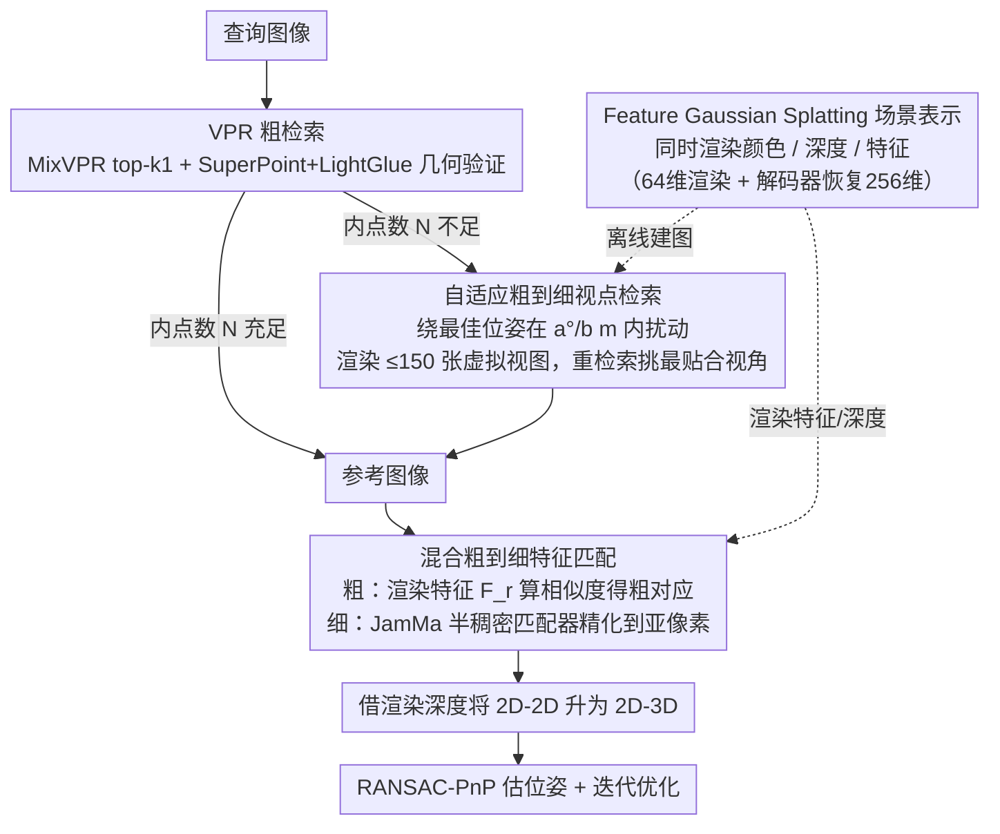

# Hierarchical Visual Relocalization with Nearest View Synthesis from Feature Gaussian Splatting

**会议**: CVPR 2026  
**arXiv**: [2603.29185](https://arxiv.org/abs/2603.29185)  
**代码**: [https://hqitao.github.io/SplatHLoc](https://hqitao.github.io/SplatHLoc)  
**领域**: 3D视觉  
**关键词**: 视觉重定位, 高斯溅射, 特征匹配, 新视角合成, 分层定位

## 一句话总结

提出 SplatHLoc，一种基于 Feature Gaussian Splatting 的分层视觉重定位框架，通过自适应视点检索合成更接近查询的虚拟视图，并设计混合特征匹配策略（渲染特征用于粗匹配、半稠密匹配器用于细匹配），在室内外重定位基准上取得 SOTA。

## 研究背景与动机

1. **领域现状**：视觉重定位是 3D 视觉的基础任务，主流方法分为三类：基于结构的方法（SfM 稀疏点云 + PnP）、基于回归的方法（直接回归位姿或场景坐标）、以及基于渲染的方法（NeRF/GS 的新视角合成）。其中，分层方法（如 HLoc）因模块化设计具有良好的可扩展性。

2. **现有痛点**：分层重定位方法依赖数据库中与查询视角足够接近的图像，当数据库图像分布稀疏时，难以建立可靠的特征对应关系。现有的虚拟关键帧增强方法（如 GPVK-VL）虽然合成了额外视图，但不能保证与查询视角对齐，且带来大量存储开销。

3. **核心矛盾**：GS 渲染的图像经常含有伪影，从渲染图像中提取的特征用于匹配时对应关系不稳定。而 FGS 直接渲染的特征虽然包含多视角知识、减少了误差累积，但与查询图像特征之间存在特征域差异（feature gap），不适合像素级精细匹配。

4. **本文目标**（a）稀疏数据库图像导致检索到的参考图像视角偏差大；（b）渲染特征与提取特征各有优劣，如何互补？

5. **切入角度**：作者发现渲染特征在粗匹配阶段表现更好（多视角知识、减少累积误差），而从图像直接提取的特征在细匹配阶段更好（精确的几何关系），因此可以分阶段使用不同特征。

6. **核心 idea**：在 FGS 场景表示上构建自适应视点检索（合成更接近查询的虚拟参考图）和混合特征匹配（粗阶段用渲染特征、细阶段用半稠密匹配器特征）。

## 方法详解

### 整体框架

SplatHLoc 要解决的是分层重定位里那个老问题：数据库图像太稀疏时，检索回来的参考图和查询视角差太远，匹配根本对不上。它的破局思路是先把场景重建成一张能直接渲染特征的高斯地图，再围绕它做两件事——视角不够近就当场"补"一张更贴合查询的虚拟参考图，特征匹配时则按粗细两阶段各用各的最优特征。

整条流水线是这样转的：查询图进来后先用 VPR 检索出最相似的数据库图像与其位姿；如果这张参考图与查询的几何对应不够可靠，就触发自适应视点检索，围绕它的位姿渲染一批虚拟视图、挑出最贴近查询的那张当参考。拿到参考图后，混合匹配器在查询与参考之间建立 2D-2D 对应，再借渲染出的深度图把对应升维成 2D-3D，最后用 RANSAC-PnP 估计位姿并迭代优化几轮。

### 关键设计

**1. Feature Gaussian Splatting 场景表示：把"渲染颜色"扩成"同时渲染颜色、深度和特征"**

要在高斯地图上做特征匹配，首先得让地图能渲染出特征图，而不只是 RGB。作者在标准 3DGS 的每个高斯原语上多挂一个 $d$ 维可学习特征 $\mathbf{f}_i$，训练时一边用 SuperPoint 编码器在真实图像上提取真值特征 $F_t$ 作监督，一边让高斯渲染出特征图去对齐它，整体联合优化光度损失和特征损失。难点在开销——直接渲染 256 维特征会把地图撑爆，所以这里用了一个压缩技巧：高斯只渲染一张 $C'=64$ 维的低维特征 $F_r^{low}$，再过一个 $3\times3$ 卷积解码器恢复到 $C=256$ 维去匹配。这个"低维渲染 + 解码器恢复"的设计几乎不掉精度却把资源砍掉一大截：地图从 904MB 降到 353MB、训练从 146 分钟降到 46 分钟、GPU 内存从 12GB 降到 4GB，让特征高斯地图在实际部署里真正用得起。

**2. 自适应粗到细视点检索：数据库不够近时，当场渲一张更贴合查询的虚拟参考图**

稀疏数据库的痛点是检索回来的参考图视角偏差太大，但又不能像 GPVK-VL 那样把所有可能视角都预渲染存下来——存储吃不消。作者的做法是按需补图、两阶段收缩。粗阶段先用 MixVPR 检索 top-$k_1$ 候选，用 SuperPoint+LightGlue 做几何验证选出最佳匹配 $I_c^c$；只有当它的内点数 $N$ 低于阈值、说明这张参考图确实不够贴时，才进入细阶段：以 $I_c^c$ 的位姿为中心，在 $a°$ 角度和 $b$ 米平移范围内随机扰动，渲染 $k_2\le 150$ 张虚拟视图，再走一遍检索+几何验证，挑出最贴近查询视角的那张当最终参考。关键是这套流程只在第一轮检索不够好时才启动，且搜索空间是从整库收缩到一个小邻域，所以补图是"按需"而非"穷举"，既补上了视角缺口又没引入大量预渲染存储。

**3. 混合粗到细特征匹配：粗匹配用渲染特征、细匹配换回图像特征，各取所长**

这是全篇最核心的洞察。渲染特征和图像提取特征各有命门：渲染特征裹挟了多视角先验、累积误差小，但和查询图之间存在 feature gap，做不了像素级精匹配；图像特征几何精确，却没有多视角知识。作者干脆按阶段拆开用。粗匹配阶段在 $C\times H/8\times W/8$ 分辨率上算查询特征 $F_t$ 与渲染特征 $F_r^{high}$ 的相似度矩阵，经双向 softmax + 互近邻过滤得到粗对应 $\mathcal{C}_{q,r}^c$；细匹配阶段则改用 JamMa 半稠密匹配器，从渲染图和查询图里提取 $H/2\times W/2$ 分辨率的细特征，在粗对应引导下于 $W\times W$ 特征窗口内算相关矩阵，再经解码器输出亚像素级对应。消融把这个分工说得很死：渲染特征一旦用在细匹配阶段，7-Scenes RR@[2cm,2°] 反而掉 0.61；而把它留在粗匹配、细匹配交给半稠密匹配器，则提升 2.91。这正印证了那条直觉——渲染特征适合 patch 级对齐，feature gap 卡死了它的像素级精度。

### 一个完整示例

设查询图来自 7-Scenes 的 Stairs（弱纹理、数据库稀疏）。粗阶段 MixVPR 检索回 top-$k_1$ 候选，SuperPoint+LightGlue 几何验证后选出最佳数据库图 $I_c^c$，但内点数 $N$ 低于阈值——说明它和查询视角差得远。于是触发细阶段：围绕 $I_c^c$ 的位姿在 $a°$、$b$ m 内扰动渲染出最多 150 张虚拟视图，再次检索+验证，挑出一张视角几乎贴合查询的虚拟参考图。接着进入混合匹配：先用渲染特征 $F_r^{high}$ 与查询特征算相似度、双向 softmax 得到一批粗对应；再用 JamMa 在这些粗对应附近的窗口里精化到亚像素。最后借渲染深度把 2D-2D 升成 2D-3D，RANSAC-PnP 解出位姿并迭代 4 次。正是"补虚拟图 + 粗细换特征"这两步，把 Stairs 的 RR@[5cm,5°] 从 baseline 的 75.5% 抬到 91.9%。

### 损失函数 / 训练策略

训练阶段联合优化光度损失（$\mathcal{L}_1$ + D-SSIM 加权）和特征损失（$\mathcal{L}_1$），权重 $\gamma=1$，$\lambda=0.2$，训练 30K 步。重定位阶段迭代优化 $n$ 次（室内 $n=4$，室外 $n=2$）。

## 实验关键数据

### 主实验

| 数据集 | 指标 | SplatHLoc | STDLoc (prev SOTA) | 提升 |
|--------|------|-----------|-------------------|------|
| 7-Scenes (avg) | 中位误差 cm/° | **0.55/0.17** | 0.76/0.24 | -28%/-29% |
| 12-Scenes (avg) | 中位误差 cm/° | **0.3/0.14** | - | - |
| Cambridge (avg) | 中位误差 cm/° | **9/0.13** | 10/0.14 | -10%/-7% |

7-Scenes 上 SplatHLoc 在所有 7 个场景上全面超越 STDLoc，平均中位平移误差从 0.76cm 降到 0.55cm。

### 消融实验

| 配置 | Stairs 误差 cm/° | RR@[5cm,5°] | 说明 |
|------|---------|------|------|
| Baseline (MixVPR + SP+LG) | 1.82/0.49 | 75.5% | 标准分层方法 |
| + Adaptive Retrieval | 1.57/0.45 | 80.5% | 自适应检索提升 5% |
| + Hybrid Matcher | 1.14/0.33 | 84.0% | 混合匹配器提升 8.5% |
| Full (两者结合) | **1.03/0.30** | **91.9%** | 组合收益最大 |

### 关键发现
- 混合匹配器是最大贡献模块，将弱纹理场景（Stairs）的 recall 从 75.5% 提升到 84.0%
- 渲染特征只适合粗匹配：用于细匹配时 RR 下降 0.61%，用于粗匹配时 RR 提升 2.91%
- FGS 地图压缩策略极其有效：相比 STDLoc 降低 61% 存储、68% 训练时间、67% GPU 内存
- 运行效率上，在迭代优化阶段 SplatHLoc 比 STDLoc 快约 2 倍

## 亮点与洞察
- **渲染特征分阶段使用的洞察非常精准**：不是简单地"渲染特征好或不好"，而是发现粗匹配阶段渲染特征更优（多视角先验）、细匹配阶段图像特征更优（精确几何），这个观察可以迁移到所有涉及合成-真实特征匹配的任务
- **按需合成虚拟视图**的策略比预渲染所有可能视图更高效：只在初始检索不够好时才启动，搜索空间逐步缩小
- **特征维度压缩 + 解码器**的设计很务实：64 维渲染 → 卷积恢复 256 维，在几乎不损失性能的前提下大幅削减资源消耗

## 局限与展望
- 性能依赖高斯地图质量，而地图质量受建图图像数量影响
- 室外大场景需要分块建图策略（作者提到未来工作）
- 依赖 SfM 初始化高斯原语，未来可考虑 3D 重建基础模型替代 COLMAP
- JamMa 匹配器是固定的，未来可探索端到端联合训练

## 相关工作与启发
- **vs STDLoc**: STDLoc 在粗细两阶段都用渲染特征，忽略了 feature gap 问题。SplatHLoc 的混合策略更合理，在所有数据集上超越。运行速度约为 STDLoc 的 2 倍。
- **vs GPVK-VL**: 预先渲染虚拟关键帧增加存储，SplatHLoc 按需合成更高效
- **vs ACE+GS-CPR**: GS-CPR 用 MASt3R 做匹配但分辨率低、计算量大，SplatHLoc 更轻量

## 评分
- 新颖性: ⭐⭐⭐⭐ 渲染特征的分阶段使用洞察新颖，但整体框架仍是分层匹配+迭代优化的渐进改进
- 实验充分度: ⭐⭐⭐⭐⭐ 三个数据集、完整消融、效率对比、可视化分析都很充分
- 写作质量: ⭐⭐⭐⭐ 条理清晰，图表信息丰富
- 价值: ⭐⭐⭐⭐ 实用性强，在效率和精度上都有明确提升

<!-- RELATED:START -->

## 相关论文

- [\[CVPR 2026\] ULF-Loc: Unbiased Landmark Feature for Robust Visual Localization with 3D Gaussian Splatting](ulf-loc_unbiased_landmark_feature_for_robust_visual_localization_with_3d_gaussia.md)
- [\[CVPR 2026\] Physically Inspired Gaussian Splatting for HDR Novel View Synthesis](physically_inspired_gaussian_splatting_for_hdr_novel_view_synthesis.md)
- [\[CVPR 2026\] Scaling View Synthesis Transformers (SVSM)](scaling_view_synthesis_transformers.md)
- [\[CVPR 2026\] Cross-View Splatter: Feed-Forward View Synthesis with Georeferenced Images](cross-view_splatter_feed-forward_view_synthesis_with_georeferenced_images.md)
- [\[CVPR 2026\] Splatent: Splatting Diffusion Latents for Novel View Synthesis](splatent_splatting_diffusion_latents_for_novel_view_synthesis.md)

<!-- RELATED:END -->
