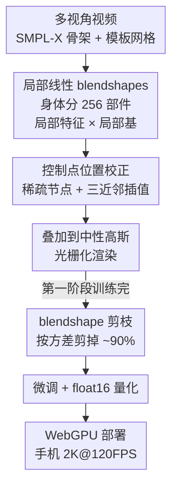

# High-Fidelity Mobile Avatars with Pruned Local Blendshapes

**会议**: CVPR 2026  
**arXiv**: [2605.01854](https://arxiv.org/abs/2605.01854)  
**代码**: https://gapszju.github.io/webavatar/ (有)  
**领域**: 3D视觉 / 人体理解 / 数字人  
**关键词**: 3D高斯, 数字人, blendshape剪枝, 移动端渲染, WebGPU

## 一句话总结
用「局部线性 blendshapes + 90% blendshape 剪枝」把 3DGS 全身数字人的姿态相关外观解码压到极致，端到端训练（无需预训练大模型）就能在手机浏览器里跑到 2K 分辨率 120 FPS、模型仅 19.4 MB。

## 研究背景与动机
**领域现状**：3D Gaussian Splatting（3DGS）已成为从多视角视频重建可驱动数字人的主流表示。为了让数字人随姿态变化产生真实的非刚性外观（衣褶、阴影），需要预测「姿态相关」的高斯属性。一类高质量方法（如 AnimatableGS）用卷积网络解码每个高斯的属性，质量好但解码很重；另一类移动端方法（TaoAvatar、SqueezeMe）受 SMPL blendshape 启发，把高斯属性建模成「全局姿态特征 × blendshapes」的线性组合，从而能在 VR/手机上实时跑。

**现有痛点**：移动端这条线有三个具体短板。其一，TaoAvatar / SqueezeMe 必须先训一个高质量大模型再蒸馏到小模型，训练慢、流程复杂。其二，它们用**一个全局姿态特征**去线性组合全身所有 blendshape，但高斯属性对姿态是**非线性**的，全局线性拟合误差大、丢细节。其三，blendshapes 本身体积庞大（往往是高斯属性的好几倍），在带宽受限的手机上是存储/显存/计算的主要负担；SqueezeMe 试图让邻近高斯共享 corrective 来省算力，结果细节严重退化。

**核心矛盾**：「用简单线性运算解码姿态相关外观（省算力）」与「准确拟合高度非线性的高斯属性（保细节）」之间存在根本张力——全局线性太粗，全局非线性太重。

**切入角度**：作者观察到高斯属性具有强**局部性**——身体某个局部区域内邻近高斯高度相关（如一块区域被遮挡时一群高斯一起变暗模拟阴影），但不同部位（手臂 vs 腿）之间相关性弱。从 PCA 视角看，把全身高斯一起做 PCA 难以捕捉这种聚簇式的精细协方差结构；而**分部位做局部 PCA** 既能抓住局部精细协方差，又能用很少的特征向量解释总方差。

**核心 idea**：把身体切成若干局部部件，**每个部件用各自的局部姿态特征 × 局部 blendshapes** 来线性表达该部件高斯的非线性变化（用局部线性逼近全局非线性）；再观察到「真正随姿态变的高斯只占少数」（鞋子、头几乎不变），用**剪枝**把大多数高斯的 blendshape 去掉变成常量高斯，极致压缩模型。整条流程端到端训练，无需预训练-蒸馏。

## 方法详解

### 整体框架
输入是多视角视频，先抽取人体 mask 并逐帧跟踪 SMPL-X 骨架，在模板网格上均匀采样 $N_g = 200K$ 个高斯。重建分两阶段：**第一阶段**把身体划分成 $N_G = 256$ 个局部部件，每个部件用一个小 MLP 从姿态+表情预测局部姿态特征，再与该部件的局部 blendshape 矩阵线性组合，得到旋转/缩放/颜色的 corrective，叠加到「中性高斯」上得到姿态相关外观（位置 corrective 单独用稀疏控制点插值）；**第二阶段**统计训练集上各高斯 corrective 的方差，把方差小的高斯的 blendshape 剪掉（剪掉约 90%），再微调。最后量化到 float16、用 Rust + WebGPU 实现，编译成浏览器网页跑在手机上。

### 关键设计

**1. 局部线性 blendshapes：用局部线性逼近全局非线性**

针对「全局姿态特征 × 全身 blendshapes 误差大、丢细节」的痛点。作者把模板网格用 Poisson-disk 采样出 $N_G = 256$ 个点，每个高斯按位置归到最近的采样点，形成 256 个局部部件（模板网格只用于初始化，分组完成后丢弃）。对第 $i$ 个部件定义局部 blendshape 矩阵 $B^i$，形状 $[N_{G^i}, N_B, 10]$，其中 $N_B = 16$ 是 blendshape 维度，10 对应四元数旋转、缩放与 RGB 颜色。每个部件配一个**专属小 MLP**，输入姿态 $\bm{\theta}_p$（63 维主关节轴角）与表情 $\bm{\theta}_e$（FLAME 前 10 维），输出局部姿态特征 $\mathbf{e}^i = \mathsf{MLP}^i(\bm{\theta}_p \oplus \bm{\theta}_e)$；非头部部件把姿态置零以削弱表情对身体的串扰。corrective 由 $\{\delta\mathbf{r}^k, \delta\mathbf{s}^k, \delta\mathbf{c}^k\} = B^i \cdot \mathbf{e}^i$ 在 $N_B$ 维上加权求和得到。之所以有效，是因为局部部件内高斯协方差结构精细、相关性强，少量基即可解释总方差——等价于分部位做局部 PCA，比全局线性拟合精确得多，而运算量仍只是简单线性组合

**2. 控制点位置校正：用稀疏节点摊薄逐高斯位移开销**

身体非刚性形变还需要位置 corrective $\delta\mathbf{x}$，但给 20 万个高斯每个都配位置 blendshape 太重。受 mmlphuman 启发，作者假设全身存在一个全局 corrective 函数、只需在离散节点上求值即可。具体地，从所有高斯里均匀采 $N_s = 10K$ 个作为控制节点，给每个部件的节点定义局部位置 blendshape 矩阵 $B^i_s$（形状 $[N_{G_s^i}, N_B, 3]$），节点位移同样由 $\{\delta\mathbf{x}_s^k\} = B^i_s \cdot \mathbf{e}^i$ 得到；每个高斯的位移再从最近 3 个节点用反距离权重插值 $\delta\mathbf{x} = \frac{\sum_j \alpha_j \delta\mathbf{x}_s^j}{\sum_j \alpha_j}$（$\alpha_j = 1/\|\mathbf{x} - \mathbf{x}_s^j\|$）。这样把逐高斯的位置预测降成「稀疏节点 + 局部插值」，既保住非刚性位移的表达力又省算力。颜色不用高阶 SH（人体多为漫反射）、不透明度设为常量，进一步减负

**3. blendshape 剪枝：把「真正会动的少数高斯」之外全部砍掉**

针对「blendshapes 体积是主要负担」的痛点。核心观察是：动态外观主要由少数高斯决定，大多数高斯（鞋、头）几乎不随姿态变化，它们的 blendshape 是冗余的。难点在于 blendshape 是学出来的、训练前不知道该剪谁，所以作者先训一个**过参数化**的完整 blendshape 模型，再剪。第一阶段收完后，统计每个高斯在所有训练姿态下旋转/缩放/颜色 corrective 的方差 $\hat{r} = Var(\{\delta\mathbf{r}_p\})$、$\hat{s} = Var(\{\delta\mathbf{s}_p\})$、$\hat{c} = Var(\{\delta\mathbf{c}_p\})$，对三类属性**各自独立**保留方差最大的前 $N_P = 20K$ 个高斯的 blendshape、剪掉其余（其余变成常量高斯），稀疏 blendshape 可用紧凑形式存储。为了让剪枝不破坏外观，第一阶段额外加 $L_1$ 约束 $\mathcal{L}_{cst} = \lambda_{\delta\mathbf{r}}\|\delta\mathbf{r}\|_1 + \|\delta\mathbf{s}\|_1 + \lambda_{\delta\mathbf{c}}\|\delta\mathbf{c}\|_1$（$\lambda_{\delta\mathbf{r}} = 0.02$、$\lambda_{\delta\mathbf{c}} = 0.002$）鼓励 corrective 尽量小，使被剪的高斯影响有限；微调阶段不再用此约束。最终能剪掉约 90% blendshape 参数，模型从 72.4 MB 降到 19.5 MB、显存从 155 MB 降到 105 MB，而画质几乎不掉

### 损失函数 / 训练策略
沿用 AnimatableGS 的损失：$\mathcal{L} = \mathcal{L}_1 + \lambda_{lpips}\mathcal{L}_{lpips} + \mathcal{L}_{scale} + \mathcal{L}_{cst}$，其中 $\lambda_{lpips} = 0.1$，$\mathcal{L}_{scale}$ 防止高斯过度膨胀，$\mathcal{L}_{cst}$ 仅第一阶段使用。第一阶段训练 200K 迭代、第二微调阶段 80K 迭代，batch size 4，整体在单张 RTX 4090 上约 7.5 小时。部署时把 MLP、blendshapes、属性全部量化到 float16、部分整型参数转 int16，模型仅约 19.4 MB；用 Rust + WebGPU 实现，compute shader 跑 MLP 推理与 blendshape 组合 + LBS，再用 c3dgs 的光栅化器排序混合。

## 实验关键数据

数据集：AvatarRex、TalkingBody4D、ActorsHQ、DREAMS-Avatar（多为 2K 分辨率、几十到上百相机）。对比 AnimatableGS、mmlphuman、TaoAvatar、SqueezeMe；后两者未开源，数值与图直接取自其论文（标 *）。

### 主实验

AvatarRex（novel view + novel pose，遵循 SqueezeMe 设置，2K 分辨率）：

| 方法 | L1↓ | PSNR↑ | SSIM↑ | LPIPS↓ | FPS@4090↑ | 移动端 |
|------|------|-------|-------|--------|-----------|--------|
| AnimatableGS | 0.02270 | 25.508 | 0.8655 | 0.1550 | 16 | 否 |
| mmlphuman | 0.02371 | 25.276 | 0.8617 | 0.1573 | 315 | 难（模型大）|
| SqueezeMe* | 0.059 | 20.051 | 0.849 | 0.158 | – | 是 |
| TaoAvatar* | – | – | – | – | 156 | 是 |
| **本文** | 0.02343 | 25.346 | 0.8606 | 0.1576 | **1683** | **是** |

要点：本文在能上移动端的方法里质量明显优于 SqueezeMe（PSNR 25.35 vs 20.05），与重量级的 AnimatableGS / mmlphuman 持平，但 4090 上的渲染速度（1683 FPS）远超所有对手。

TalkingBody4D 与 TaoAvatar 对比：

| 指标（Novel View / Novel Pose+Expr） | TaoAvatar* | 本文 |
|------|-----------|------|
| PSNR↑（NV / NP） | 33.81 / 28.38 | **34.44** / 27.90 |
| SSIM↑（NV / NP） | 0.9689 / 0.9389 | **0.9771** / **0.9395** |
| LPIPS↓（NV / NP） | 0.06437 / 0.08874 | **0.03642** / **0.05582** |

本文在多数指标上更优，能恢复裤子上的小字、衣物褶皱等细节（仅 novel-pose PSNR 略低于 TaoAvatar）。

### 消融实验

设计消融（AvatarRex，训练姿态 + novel view）：

| 配置 | L1↓ | PSNR↑ | SSIM↑ | LPIPS↓ |
|------|------|-------|-------|--------|
| Full（本文） | 0.01488 | 29.405 | 0.9207 | 0.1074 |
| Global feature 16 | 0.01777 | 27.645 | 0.8978 | 0.1276 |
| Global feature 64 | 0.01744 | 27.913 | 0.8988 | 0.1270 |
| No pruning | 0.01471 | 29.342 | 0.9188 | 0.1076 |

剪枝前后开销对比（RTX 3050，2K）：

| 配置 | FPS@3050↑ | 显存(MB) | 模型大小(MB) |
|------|-----------|----------|--------------|
| 本文 | **312** | **105** | **19.5** |
| No Pruning | 191 | 155 | 72.4 |

### 关键发现
- **局部特征是质量主因**：换成全局姿态特征（长度 16 或 64，64 即 SqueezeMe 设置）后 PSNR 从 29.41 掉到 27.6~27.9，明显丢细节，证明「局部线性」比「全局线性」准确得多。
- **剪枝几乎不掉质量、却大幅减负**：剪掉 90% blendshape 后 PSNR 仅从 29.34（No pruning）变到 29.41，画质持平，但模型从 72.4→19.5 MB、显存 155→105 MB、3050 上 FPS 191→312。
- **瓶颈在排序/光栅化而非解码**：blendshape 组合时间从 2.26 ms 降到 0.52 ms，但整帧大头是高斯排序+渲染，所以 FPS 提升幅度不及模型体积缩减比例。

## 亮点与洞察
- **「局部性 → 局部 PCA → 局部线性 blendshapes」这条推理链很漂亮**：从高斯属性协方差的聚簇结构出发，论证「分部位做局部线性就能逼近全局非线性」，把一个看似要靠重网络的非线性问题降成简单线性组合，是质量与效率兼得的关键。
- **「先过参数化再按方差剪枝」的剪枝范式可复用**：当基函数是学出来的、事先不知道剪谁时，先训满再用统计量（这里是 corrective 方差）做重要性排序剪枝，是处理「未知重要性的可学习基」的通用手段，可迁移到其他可学习 basis/字典的压缩。
- **端到端、无需预训练-蒸馏**：相比 TaoAvatar/SqueezeMe 必须先训大模型再蒸馏，本文直接优化 blendshape，流程更简单，也是其能开源完整训练代码的前提。
- **WebGPU + Rust 跨平台落地**：同一套实现可编译成桌面原生程序或浏览器网页，手机点开网页即用，工程上把「研究 demo」真正推到了消费级设备。

## 局限与展望
- **瓶颈转移到光栅化**：作者自承剪枝带来的 FPS 提升受限于排序/渲染瓶颈，解码已经很快，进一步提速需要优化高斯排序与混合而非解码端。
- **依赖多视角采集与 SMPL-X 注册**：方法需要多相机视频 + 准确骨架跟踪，对单目/野外场景适用性未验证（ActorsHQ 还要借用 AnimatableGS 的注册）。
- **部件划分是固定均匀采样**：256 部件由 Poisson-disk 采样得到，未自适应于身体各处的动态复杂度；高频运动区与近乎静止区用同样粒度，可能不是最优。
- **若干超参偏经验**：$N_G, N_B, N_s, N_P$ 等均为固定经验值，未给出敏感性分析；$N_P = 20K$ 的「保留 top-K」对不同体型/服装是否稳健有待考察。

## 相关工作与启发
- **vs TaoAvatar / SqueezeMe**：它们都用「全局姿态特征 × 全身 blendshapes」并依赖预训练大模型蒸馏；本文用局部特征 + 局部 blendshapes（更准、保细节），端到端训练（更简单），并加剪枝压模型。质量上在移动端方法里领先，且开源完整训练。
- **vs mmlphuman**：同样用 basis function 表达高斯属性，但 mmlphuman 的基冗余、存储与算力重、难上手机；本文的剪枝正是针对这种冗余，砍掉 90% 仍保质量。
- **vs AnimatableGS**：用卷积网络解码逐高斯属性，质量最高但很慢（4090 仅 16 FPS、上不了移动端）；本文用线性 blendshape 解码逼近其质量，速度快两个数量级。
- **vs SplattingAvatar / HRM2Avatar 等移动端方法**：它们要么不建模动态外观、要么聚焦单目，难以表达丰富的姿态相关细节；本文专门解决「移动端 + 高保真动态外观」这一组合。

## 评分
- 新颖性: ⭐⭐⭐⭐ 局部线性 blendshapes + 学习后按方差剪枝的组合很有洞察，单项思想各有渊源但组合落地扎实
- 实验充分度: ⭐⭐⭐⭐ 四数据集、对比四个代表方法、设计/剪枝消融齐全，唯部分对手数值取自其论文、缺敏感性分析
- 写作质量: ⭐⭐⭐⭐ 动机推理链清晰、公式完整，pipeline 与剪枝过程讲得明白
- 价值: ⭐⭐⭐⭐⭐ 首个开源、能在手机浏览器 2K@120FPS 跑高保真全身数字人的 3DGS 方法，落地价值高

<!-- RELATED:START -->

## 相关论文

- [\[CVPR 2026\] HyperGaussians: High-Dimensional Gaussian Splatting for High-Fidelity Animatable Face Avatars](hypergaussians_high-dimensional_gaussian_splatting_for_high-fidelity_animatable_.md)
- [\[CVPR 2026\] TopoMesh: High-Fidelity Mesh Autoencoding via Topological Unification](topomesh_high-fidelity_mesh_autoencoding_via_topological_unification.md)
- [\[CVPR 2026\] Depth Peeling for High-Fidelity Gaussian-Enhanced Surfel Rendering](depth_peeling_for_high-fidelity_gaussian-enhanced_surfel_rendering.md)
- [\[CVPR 2026\] LoG3D: Ultra-High-Resolution 3D Shape Modeling via Local-to-Global Partitioning](log3d_ultra-high-resolution_3d_shape_modeling_via_local-to-global_partitioning.md)
- [\[CVPR 2026\] VIAFormer: Voxel-Image Alignment Transformer for High-Fidelity Voxel Refinement](viaformer_voxel-image_alignment_transformer_for_high-fidelity_voxel_refinement.md)

<!-- RELATED:END -->
