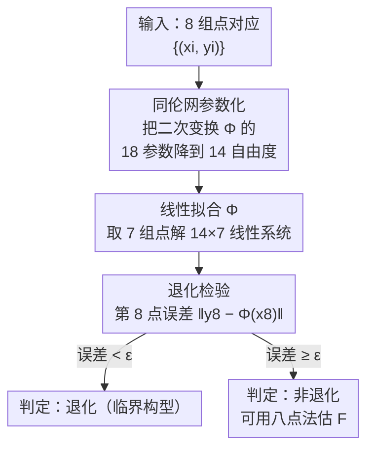

# Homaloidal parametrization for detecting critical two-view configurations

**会议**: CVPR 2026  
**论文**: [CVF Open Access](https://openaccess.thecvf.com/content/CVPR2026/html/Madhavan_Homaloidal_parametrization_for_detecting_critical_two-view_configurations_CVPR_2026_paper.html)  
**代码**: https://github.com/rakshith95/degeneracy-homoloidal  
**领域**: 3D视觉 / 多视图几何  
**关键词**: 基础矩阵, 临界构型, 退化检测, 二次变换, 同伦网

## 一句话总结
本文用射影几何里的"同伦二次曲线网（homaloidal net of conics）"给两视图临界曲面退化检测设计了一个全新的二次变换参数化，使得只需对 7 组图像对应点解一个**线性系统**就能拟合二次变换、再用第 8 点做检验，从而在**不预先估计基础矩阵**的前提下判定一组对应点是否退化，比唯一可比的 Luong–Faugeras 方法精度更高、速度快约 200×。

## 研究背景与动机

**领域现状**：从图像点对应估计基础矩阵 $F$ 是 SfM（运动恢复结构）流水线里的核心一步。但当场景几何处于某些"临界构型（critical configuration）"时，$F$ 的估计会变得不稳定甚至理论上不唯一——典型的退化有三类：两相机纯旋转、所有 3D 点与两相机中心共面、以及所有 3D 点和相机中心落在一张**直纹二次曲面（ruled quadric，如单叶双曲面、锥面、柱面）**上，最后这类称为"临界曲面"。

**现有痛点**：实践中只有"平面场景"这一特例发展出了被广泛采用的退化检测——用单应矩阵 $H$ 来判定（因为 $H$ 是两图像点之间的线性映射，估计容易）。但对最一般的**临界曲面**，至今缺一个实用的检测器：唯一已有的通用检测方法是 Luong–Faugeras [19]，它先估一个基础矩阵 $F_P$、再解非线性迭代优化配出第二个 $F_Q$，构成二次变换来检验。

**核心矛盾**：Luong–Faugeras 的两个根本问题——(1) 它**依赖预先估计的 $F_P$**，而恰恰在临界构型附近 $F$ 的估计本身就病态、不稳定，形成"要检测退化先得估个在退化处最不靠谱的量"的循环困境；(2) 非线性迭代优化既慢又常不收敛到最优。

**本文目标**：为一般临界曲面设计一个既稳定又实用的退化检测，要做到——不需要预先估基础矩阵、只解线性系统、能从 8 组对应点直接判定。

**切入角度**：作者注意到一个已知结论——落在临界曲面上的 3D 点，其两幅图像之间由一个**二次变换 $\Phi$**（平面到平面的 birational 映射，含 14 个自由度）相联系。问题转化为"如何稳定地、线性地拟合这个 $\Phi$"。

**核心 idea**：把 $\Phi$ 用经典代数几何里的"同伦二次曲线网"来参数化——这套工具此前从未被用于退化检测。借助它，$\Phi$ 的拟合退化成解一个线性系统，彻底绕开了基础矩阵估计。

## 方法详解

### 整体框架
输入是两幅图之间的 8 组点对应 $\{(x_i,y_i)\}_{i=1}^{8}$（齐次坐标），输出是一个二值判定：这 8 组对应是否来自临界构型（退化）。整条流水线是：先从 8 个点里随机取 7 个，用同伦网参数化把二次变换 $\Phi$ 通过一个 $14\times 7$ 的线性系统解出来；再把剩下的第 8 个点代入 $\Phi$，量它在第二幅图上的重投影误差 $\mathrm{err}(x_8,y_8)=\lVert y_8-\Phi(x_8)\rVert$；误差低于阈值 $\epsilon$ 就判退化，否则判非退化、可放心用八点法估 $F$。整个过程不出现基础矩阵。

### 关键设计

**1. 同伦二次曲线网参数化：把二次变换 $\Phi$ 的 14 个自由度显式提出来**

痛点是：一个最一般的平面到平面二次映射 $\Phi$，三个分量都是 $x_0,x_1,x_2$ 的二次齐次多项式（式 1），共 18 个参数；若直接线性拟合需要至少 9 个点，比估 $F$ 还多。但作为 birational 的二次变换，$\Phi$ 其实只有 14 个自由度。本文用同伦网的代数结构把这 14 个自由度干净地剥出来。

具体地，一个二次变换可写成一对**双线性方程** $y_0L_0+y_1L_1+y_2L_2=0$、$y_0M_0+y_1M_1+y_2M_2=0$（引理 1），其中 $L_i,M_i$ 是 $x$ 的线性形式、共 6 条线 18 个参数。关键观察（Prop. 3）是：对承载这 6 条线的 $2\times3$ 矩阵左乘任意 $2\times2$ 可逆矩阵 $H$，生成的同伦网不变（其三条二次曲线 $L_iM_j-L_jM_i=0$ 不变）。因此可以无损地把 $l_{00},l_{10},m_{00},m_{10}$ 这 4 个参数**固定为随机值**，剩下恰好 14 个自由参数。这一步是整套方法成立的代数基石——它把"$\Phi$ 有几个自由度"从抽象结论变成可直接代入求解器的具体参数集。

**2. 7 点线性拟合 $\Phi$：一个 $14\times 7$ 线性系统，不碰基础矩阵**

有了 14 参数化，每组对应 $(x_i,y_i)$ 由双线性方程贡献 2 条线性约束（式 12），7 组点正好给 14 条约束、对 14 个未知数构成线性系统 $Az=b$（Algorithm 1）：设计矩阵 $A$ 的每行由单项式 $[x_0y_2,x_1y_0,\dots,x_2y_2]$ 拼出，$b$ 收集由固定的 $l_{00},l_{10},m_{00},m_{10}$ 与已知坐标算出的常数项。7 点时系统恰定、可精确求解；点更多时转最小二乘。

这一步是相对 Luong–Faugeras 的本质区别：后者要先用七点法估出最多 3 个 $F_P$、再对每个解非线性 `lsqnonlin` 配 $F_Q$（式 4 的几何转移误差），既慢又在临界处病态。本文直接对图像对应解线性系统，**完全不出现基础矩阵**，因此在 $F$ 病态的临界区域反而最稳。

**3. 第 8 点退化检验：把"是否退化"变成一次重投影误差判阈**

7 个点无论是否临界都能精确拟出 $\Phi$，所以拟合本身不带判别信息——判别力来自留出的第 8 点。把 $x_8$ 过一遍拟好的 $\Phi$，量它在第二幅图上离真值 $y_8$ 的误差 $\mathrm{err}(x_8,y_8)=\lVert y_8-\Phi(x_8)\rVert$（式 13）：8 个点若同属临界曲面，第 8 点会高度服从 $\Phi$，误差极小；否则误差大。阈值 $\epsilon$ 与图像噪声同量级，可取和 RANSAC 估 $F$ 时相当的值。作者强调 $\epsilon$ 的选取不敏感——在很宽的阈值区间里 F1 都能到 1，这正是稳定参数化带来的好处。

### 损失函数 / 训练策略
本方法是几何求解器、无训练过程；MATLAB 实现，在 i5-14500HX + 16GB 笔记本上运行。

## 实验关键数据

实验主要在合成临界构型上做（与 [6,11,19] 一致），并辅以真实图像。临界曲面取单叶双曲面：随机生成两对不射影等价的相机 $(P_1,P_2)$、$(Q_1,Q_2)$，在曲面上采 8 个 3D 点投影得对应。唯一可比的基线是 Luong–Faugeras [19]（同任务同假设）。

### 主实验：无噪声稳定性 + 分类 F1

| 场景 | 指标 | 本文 | Luong–Faugeras [19] | 说明 |
|------|------|------|---------------------|------|
| 无噪声第 8 点误差（100 次试验） | 中位误差 | **9×10⁻¹⁵** | 3×10⁻⁵ | 本文误差范围 [1e-16, 7e-12]，LF 范围 [6e-15, **0.96**] |
| 无噪声临界/非临界分类 | F1 | **1.0**（宽阈值区间） | 始终 < 1 | LF 因 $F$ 估计不稳，永远到不了完美分类 |
| 运行时间（单次检验） | 时间 | **8.5 ms** | 1.65 s | 约 **200× 加速**（本文解线性、LF 解非线性） |

### 消融 / 敏感性分析

| 配置 | 关键现象 | 说明 |
|------|---------|------|
| 3D 偏离临界面距离 $\theta\in[10^{-20},10^0]$ | 本文误差随 $\theta$ 平缓上升；LF 即便微小偏离也误差大、方差大 | 近临界区 $F$ 病态，LF 受其拖累 |
| 2D 对应点高斯噪声 $\sigma\in[10^{-20},10^0]$ | 两者都随噪声退化，但本文在很宽噪声区间仍保持低误差与 F1≈1 | 验证参数化的鲁棒性 |
| 真实图像（圆柱状广场布局，近直纹面） | 第 8 点误差 ~4×10⁻⁵ 像素，正确判为临界 | 真实临界构型确认 |
| 真实平面场景 | 共面对应 err≈1.43×10⁻⁵（判退化）；一般位置 err≈0.94（判非退化） | 方法对"二次面退化为两平面"的平面退化也通用 |

### 关键发现
- **稳定性的根因是"绕开基础矩阵"**：LF 的全部不稳定都来自它在临界处先估 $F$；本文从图像对应直接线性求解，把病态环节整体删掉，因此中位误差比 LF 低约 10 个数量级。
- **阈值 $\epsilon$ 不敏感**：无噪声下 F1=1 覆盖很宽的阈值区间，意味着部署时不必精调阈值，这对实用性很关键。
- **通用性**：虽然平面退化有更对口的单应检测，但本文的二次变换检验对包括"退化为两平面"在内的任意临界曲面都成立，是真正的通用退化判据。

## 亮点与洞察
- **把代数几何工具搬进视觉退化检测**：同伦二次曲线网此前从未用于退化检测，本文借它的不变性（Prop. 3：左乘 $2\times2$ 可逆阵不改网）把 $\Phi$ 的 18 参数无损降到 14，这步参数化是"让非线性变线性"的转折点，思路可复用到其他需要拟合二次/birational 映射的几何问题。
- **"留一点检验"的极简判据**：7 点拟合 + 第 8 点测误差，把一个理论上微妙的退化判定压成一次重投影距离判阈，工程上极易落地（200× 加速、毫秒级）。
- **病态问题的处理范式**："不要在病态量上做估计，换一个等价但良态的量"——本文用 $\Phi$ 替代 $F$，是处理 ill-conditioned 估计的一个漂亮范例。

## 局限与展望
- 实验主体是合成数据，真实场景只给了少量定性验证（一对圆柱广场图 + 一组平面图），缺大规模真实基准上的定量评测——作者自己也把"更广泛的真实验证"列为未来工作。
- 方法针对非最小（≥8 点）情形；最小 7 点情形（退化定义不同）不在本文范围。
- 退化判定是二值的，没有进一步把临界几何信息（如曲面类型、平面视差）抽取出来用于重建；作者展望未来研究当临界点共面时 $\Phi$ 的行为，以及能否借平面视差辅助 3D 重建。
- ⚠️ 缓存为 OCR 文本，二次变换符号 $\Phi$ 在原文中以特殊字体出现、部分公式（如式 1、式 12 的下标）OCR 有错位，具体系数排布以原文为准。

## 相关工作与启发
- **vs Luong–Faugeras [19]**：同一任务同一假设。他们先估 $F_P$ 再非线性配 $F_Q$ 构成 $\Phi$；本文用同伦网参数化直接线性拟 $\Phi$、不碰 $F$。优势是稳定（中位误差低 ~10 个数量级）、快（200×）、阈值不敏感；劣势是同样限于非最小情形、且真实评测还偏少。
- **vs 单应 / 模型选择类退化检测（GRIC [27], DEGENSAC [8,14]）**：那些方法只覆盖纯旋转 / 平面退化（用线性的 $H$），本文覆盖最一般的临界曲面（用二次的 $\Phi$），是更通用的判据。
- **vs 7 点最小情形 [11,12]**：最小情形用黎曼流形框架定义病态轨迹、做 6.5 点曲线检验，需同伦延拓估隐函数，数学更重；本文走非最小、线性化的实用路线。
- **vs 机器学习 / 深度退化分类 [3,22,23]**：那类把退化检测当二分类、靠特征工程或深度分类器（且常需重建 3D 点）；本文是纯几何、无需训练、无需 3D 重建。

## 评分
- 新颖性: ⭐⭐⭐⭐⭐ 首次把同伦二次曲线网引入退化检测，参数化思路是真正的新视角
- 实验充分度: ⭐⭐⭐ 合成实验扎实且分析到位，但真实场景仅少量定性验证、缺大规模定量基准
- 写作质量: ⭐⭐⭐⭐ 几何推导清晰、与基线对比明确，但需要一定代数几何背景才读得顺
- 价值: ⭐⭐⭐⭐ 为 SfM 流水线补上一个稳定实用的通用退化判据，毫秒级、易落地

<!-- RELATED:START -->

## 相关论文

- [\[CVPR 2026\] ArchSym: Detecting 3D-Grounded Architectural Symmetries in the Wild](archsym_detecting_3d-grounded_architectural_symmetries_in_the_wild.md)
- [\[CVPR 2026\] Unlocking the Power of Critical Factors for 3D Visual Geometry Estimation](unlocking_the_power_of_critical_factors_for_3d_visual_geometry_estimation.md)
- [\[ICLR 2026\] UFO-4D: Unposed Feedforward 4D Reconstruction from Two Images](../../ICLR2026/3d_vision/ufo-4d_unposed_feedforward_4d_reconstruction_from_two_images.md)
- [\[CVPR 2026\] Learning Multi-View Spatial Reasoning from Cross-View Relations](learning_multi-view_spatial_reasoning_from_cross-view_relations.md)
- [\[CVPR 2026\] Cross-View Splatter: Feed-Forward View Synthesis with Georeferenced Images](cross-view_splatter_feed-forward_view_synthesis_with_georeferenced_images.md)

<!-- RELATED:END -->
