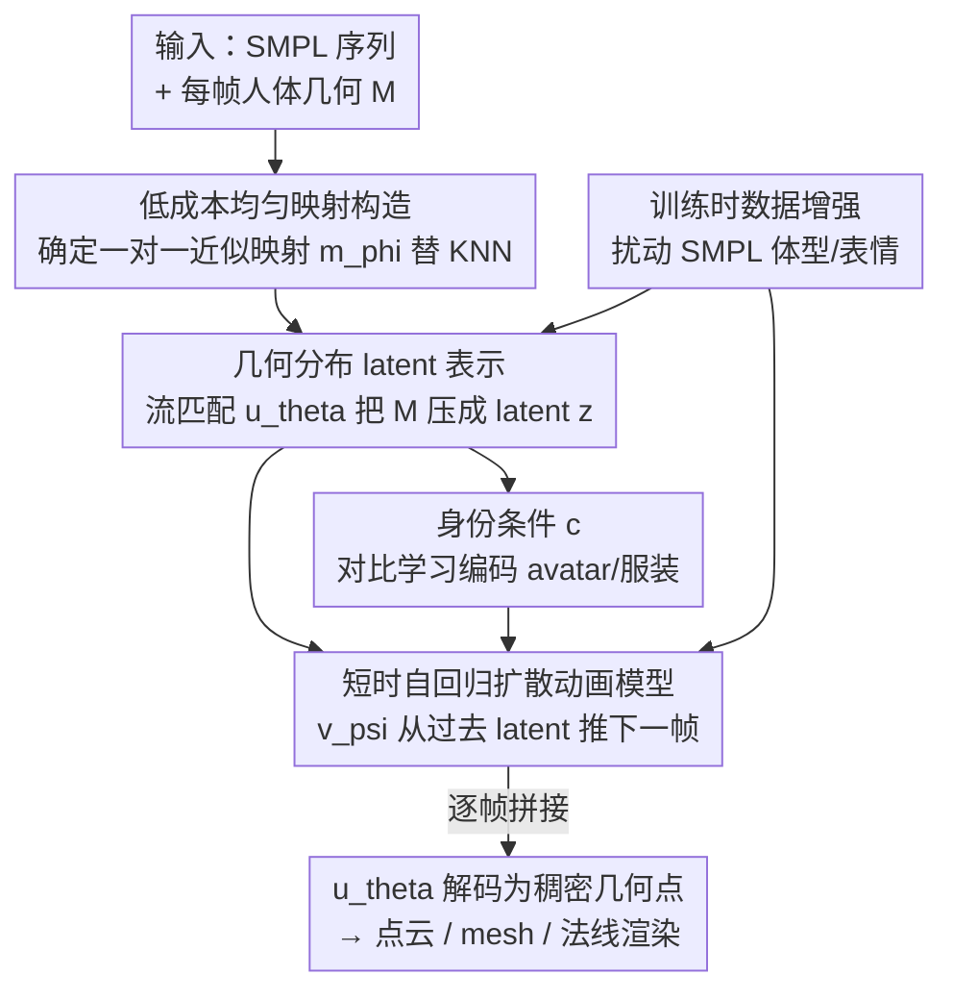

# Human Geometry Distribution for 3D Animation Generation

**会议**: CVPR 2026  
**论文**: [CVF Open Access](https://openaccess.thecvf.com/content/CVPR2026/html/Tang_Human_Geometry_Distribution_for_3D_Animation_Generation_CVPR_2026_paper.html)  
**代码**: 待确认  
**领域**: 3D视觉  
**关键词**: 3D人体动画生成、几何分布、流匹配、自回归扩散、服装动力学

## 一句话总结
本文提出一个两阶段生成框架，先用改进的「人体几何分布（HuGeoDis）」把每帧 3D 人体压成紧凑 latent、再在 latent 空间里用自回归条件扩散生成短时过渡，从而在极少的 3D 动画数据下合成出带细粒度服装褶皱、动态自然且身份一致的 3D 人体几何序列（重建 Chamfer 距离降低约 90%，用户研究分数提升 2.2 倍）。

## 研究背景与动机

**领域现状**：3D 人体动画生成要同时做到两件事——刻画细粒度几何细节（褶皱、布料皱褶）和合成随身体运动自然变形的服装动力学。早期数据驱动的服装变形方法（TailorNet、PBNS、DeePSD）能在有限数据下产生合理动力学，但它们绑定特定服装模板、不是生成式的，无法泛化到没见过的 avatar 或服装；而生成式 avatar 模型（GAN/NeRF/Gaussian Splatting 类）虽然能覆盖多样身份，却往往保不住高保真几何、也学不到真实的服装形变。

**现有痛点**：没有任何现有方法能**同时**满足「高保真几何 + 真实服装动力学 + 生成式泛化」。点云类方法（CloSET、SCALE）受限于采样稀疏，在宽松/高频区域细节糊掉；几何分布类的前作 HuGeoDis 能从紧凑表示合成高保真几何，但它用 KNN 在 SMPL 上找最近点构造映射，导致 SMPL 表面采样**严重不均**——有的点对应一大堆人体点、有的点几乎没有对应，结果是要画满几何就得采海量点（百万点都盖不全），效率极低。

**核心矛盾**：一方面 3D 人体动画数据极度稀缺，直接学长序列时序依赖容易过拟合、记不住「同一姿态对应多样动力学」；另一方面要细节又要紧凑表示，二者难以兼得。

**本文目标**：拆成两个子问题——(1) 造一个又紧凑又能表达高保真几何、且采样均匀高效的 latent 表示；(2) 在数据稀缺下学到能泛化的动画生成模型。

**切入角度**：作者观察到 HuGeoDis 的瓶颈不在表示本身，而在「SMPL↔人体」映射的不均匀；同时借鉴短时过渡建模比直接学长序列更省数据的经验，把动画拆成可自回归拼接的短时片段。

**核心 idea**：用一个**廉价、确定、一对一的近似映射**替换 KNN 来构造几何分布的目标分布，让采样均匀化；再在 latent 空间用**身份条件 + 短时自回归扩散**生成长动画。

## 方法详解

### 整体框架
方法是 latent diffusion 常见的两阶段框架。一个动态序列是 $N$ 帧的「SMPL–人体」配对 $H=\{(S_1,M_1),\dots,(S_N,M_N)\}$。**第一阶段**学 latent 空间：用 HuGeoDis 把每帧人体几何 $M$ 压成一个 rank-3 张量 latent $z\in\mathbb{R}^{C\times H\times W}$，由一个流匹配网络 $u_\theta(x_t\mid t,x_S,S,z)$ 在以 SMPL 点 $x_S$ 和 latent $z$ 为条件下还原出人体表面点；这里关键改进是用「低成本映射构造」替换 KNN，让 SMPL↔人体的对应更均匀。**第二阶段**学动画生成：把每帧的 latent $z$ 当作生成对象，用自回归条件扩散 $v_\psi$ 从过去若干帧 latent + 对应 SMPL 序列推下一帧 latent，并引入一个身份条件 $c$ 维持长程一致，最后逐帧拼成任意长度的序列。推理时先采 latent 序列，再用第一阶段的 $u_\theta$ 把每个 latent 解码成稠密几何点（可经 Poisson 重建转 mesh、经 Gaussian splatting 渲染法线/深度/上色）。

### 关键设计

**1. 低成本均匀映射构造：用确定的一对一映射替换 KNN 的不均匀对应**

几何分布把人体表面 $M$ 建模成概率分布，HuGeoDis 进一步引入 SMPL 表面 $S$，并不是直接学 $x_S\to x_M$，而是构造配对集 $p=\{(x_S,x_M)\}$、用流匹配学从 $\mathcal{N}(0,1)$ 到目标分布 $T(p)=\{x_M-x_S\mid (x_S,x_M)\sim p\}$ 的速度场 $u_\theta(x_t\mid t,x_S)$（其中 $x_t=(1-t)x_0+tx_1$，训练目标是 $\arg\min_\theta \mathbb{E}\,\|u_\theta(x_t\mid t)-(x_1-x_0)\|$）。问题出在配对集 $p$ 怎么造：HuGeoDis 用 KNN 给每个人体点找 SMPL 上最近点 $x_S=\arg\min_{x'_S\sim S}\|x_M-x'_S\|$，这会让 SMPL 上有些点对应一大堆人体点、有些点几乎没有（图 3 的 many-to-one），于是从 $S$ 均匀采样得到的 $M$ 上采样也不均匀，要盖满几何就得采百万级点还可能留洞。

理论上最优的构造是在人体与 SMPL 间做最优传输，但那对训练集里每个人体都要算一次，代价太大。作者改成训练一个监督模型 $m_\phi(x_S\mid S,z_m)$ 去学一个**粗糙但均匀、确定且一对一**的近似映射，目标是 Chamfer 距离 $\min_\phi \mathbb{E}\,\mathrm{Chamfer}(m_\phi(x_S\mid S,z_m),x_M)$。训练好 $m_\phi$ 后据它重新构造 $p$，再用流匹配学 $T(p)$。效果是脸、手这类与 SMPL 几乎一致的区域近似一对一，宽松衣物区域映射点密度更高，整体远比 KNN 均匀——于是用更少的点（约 30 万）就能完整覆盖几何，而 HuGeoDis 用一百万点都盖不全，长序列的采样效率因此大幅提升。

**2. 短时自回归扩散动画模型：把长序列拆成短过渡以对抗数据稀缺**

直接对长序列建模需要从极少样本里学复杂时序依赖，容易过拟合。作者把动画生成分解成一连串短时过渡并做成自回归过程：用流匹配 $v_\psi(z_t\mid t,z_{s-i:s},S_{s-i:s+1},c)$ 从过去 $i+1$ 帧 latent $z_{s-i:s}$ 和对应姿态 $S_{s-i:s+1}$ 推出下一帧 latent $z_{s+1}$，扩散目标为 $\min_\psi \mathbb{E}\,\|v_\psi(z_t\mid t,z_{s-i:s},S_{s-i:s+1},c)-(z_{s+1}-n)\|$（$z_t=(1-t)n+tz_{s+1}$）。固定一个短时上下文窗口后，模型能不增加计算复杂度地生成任意长度序列。为了能合成开头几帧（此时没有过去 latent），作者借鉴 classifier-free guidance，训练时随机把条件替换成 null embedding。这样既绕开了「长序列依赖难学」的数据瓶颈，又能用短片段把有限运动数据用得更充分。

**3. 身份条件 c：抑制自回归漂移、保住长程身份一致**

纯自回归会让人体几何随时间逐渐漂移、忘掉原始身份。作者额外加一个编码 avatar 身份与服装的条件 $c$：用一个下采样卷积模型 $w_\omega(z)$ 从 latent 提取 $c$，并用对比学习的 NT-Xent 损失训练，让同一 avatar/服装的帧靠近、不同的拉远（$\min_\omega -\frac{1}{N}\sum_{(i,j)\in A}\log\frac{\exp(\mathrm{sim}(c_i,c_j)/\tau)}{\sum_{k\neq i}\exp(\mathrm{sim}(c_i,c_k)/\tau)}$）。训练时 $c$ 从同序列任意一帧取，推理时只从首帧 $z_0$ 算一次并全程固定。这个条件提供了超出短时窗口的信息，正是它防住了长视频模型常见的「遗忘 / 身份漂移」问题——消融里去掉 $c$ 后身份随时间明显跑偏。

**4. 体型/表情数据增强：解耦外观 latent 与 SMPL**

在数据稀缺下，$u_\theta$ 容易记住「某个 SMPL $S$ ↔ 某种外观」的虚假相关，导致改变 SMPL 参数时合成不一致。作者在训练 $u_\theta$ 和 $v_\psi$ 时对 $S$ 做体型与表情参数增强：把参数与「无表情标准模板」按随机因子（范围 $(-1.0,1.5)$，0 是模板、1 是原始参数、负值产生反向形变、大于 1 产生夸张形变）插值，再在 batch 内随机打乱。这迫使外观 latent $z$ 与 SMPL $S$ 解耦，避免「姿态—外观」记忆，从而在变体型时仍保持一致合成。

### 损失函数 / 训练策略
第一阶段 latent 学习的目标是流匹配损失 + latent 的 L2 正则 $\beta\|z\|^2$（每个 $(S,M)$ 配一个可学习 latent，初始化为高斯噪声）。第二阶段动画模型总损失为 $L=L_{\text{diff}}+\alpha L_{\text{nt-xent}}$，即扩散损失加身份对比损失。监督映射 $m_\phi$ 单独用 Chamfer 距离训练。

## 实验关键数据

### 主实验

重建质量与效率（4d-dress 数据集，Chamfer 距离 $\times10^{-5}$，越低越好；时间为 A100 上 20 步去噪采样不同点数的耗时）：

| 方法 | 100K | 300K | 500K | 1M |
|------|------|------|------|------|
| HuGeoDis | 2.65 | 2.09 | 1.95 | 1.86 |
| Supervised（$m_\phi$） | 2.72 | 2.48 | 2.43 | 2.42 |
| **Ours** | **0.52** | **0.27** | **0.22** | **0.15** |
| 时间 (s) | 2.15 | 6.22 | 10.28 | 20.59 |

本文在各采样设置下都把 Chamfer 距离降了近一个数量级，约 30 万点即可完整覆盖几何，而 HuGeoDis 用 100 万点仍盖不全；作为参照的监督映射 $m_\phi$ 精度明显更差，反衬出「分布式表示」相比「确定映射」的必要性。

静态随机 3D 人体生成（THuman2，FID 越低越好，比较原始几何）：

| 方法 | Raw Geometry | Enhanced Rendering |
|------|------|------|
| ENARF | 223.72 | 223.72 |
| GNARF | 166.62 | 166.62 |
| EVA3D | 60.37 | 60.37 |
| E3Gen | 65.32 | 28.12 |
| GetAvatar | 56.07 | 22.77 |
| gDNA | 42.90 | 17.43 |
| HuGeoDis | 16.16 | 16.16 |
| **Ours** | **14.03** | **14.03** |

几何分布类（HuGeoDis 与本文）在原始几何对比上显著领先其它 3D 表示，本文又凭更好的映射构造超过 HuGeoDis。

### 消融实验

动画生成对比 + 消融（4d-dress，FID 越低越好，ID/Quality/Naturalness/Conformance 越高越好）：

| 方法 | FID ↓ | ID ↑ | Quality ↑ | Naturalness ↑ | Conformance ↑ |
|------|------|------|------|------|------|
| LHM (normal) | 33.37 | N/A | 3.3 | 2.7 | 2.0 |
| LHM (geometry) | 58.19 | N/A | 1.3 | 1.7 | 1.5 |
| long-term | 27.13 | 0.61 | 3.0 | 2.2 | 2.5 |
| w/o condition | 27.68 | 0.60 | 3.1 | 2.2 | 2.6 |
| w/o augment | 24.20 | 0.76 | 3.7 | 3.1 | 3.5 |
| **Ours** | 25.01 | **0.96** | **4.4** | **4.5** | **4.4** |

### 关键发现
- **身份条件 $c$ 贡献最大**：去掉后（w/o condition）ID 从 0.96 跌到 0.60，身份随时间明显漂移，印证它是维持时序稳定的关键。
- **数据增强是「FID 与一致性」的取舍**：w/o augment 的 FID 反而略低（24.20，更贴近数据集分布），但出现「姿态—外观」泄漏，ID 掉到 0.76、跨姿态一致性变差——说明单看 FID 会误判，本文宁可牺牲一点 FID 换身份一致。
- **长序列直接建模会过拟合**：long-term 模型在没见过的运动上质量低、不一致，验证了「拆短时过渡」的必要性。
- **LHM 靠 rigging 平移外观**：身份保持是「trivial」的，但服装细节几乎不变，用户研究的 Quality/Naturalness/Conformance 全面落后，说明它学不到真实布料动力学。

## 亮点与洞察
- **把「表示瓶颈」精准定位到映射不均匀**：作者没有推翻 HuGeoDis 的几何分布范式，而是发现真正的痛点是 KNN 造出的 many-to-one 映射，用一个廉价确定的监督映射 $m_\phi$ 替换最优传输，既避开了逐样本最优传输的高成本，又让采样均匀化、用 1/3 的点达成更好覆盖——这是「找对瓶颈再四两拨千斤」的典范。
- **短时自回归 + 身份条件的组合很务实**：在 3D 动画数据稀缺这一硬约束下，把长序列拆成短过渡缓解数据需求，再用对比学习的全局身份条件补回长程一致，两个设计各打一个痛点、互补得很干净。
- **可迁移 trick**：「用一个独立训练的确定映射来重构生成模型的目标分布、让采样更均匀」这一思路，可迁移到其它点云/表面生成任务；「FID 更低 ≠ 更好（可能是分布泄漏）」也是评估生成模型时值得警惕的洞察。
- **几何输出的下游友好**：生成的点云可直接 Poisson 重建成 mesh、可经 Gaussian splatting 渲染法线/深度，并用深度引导的视频模型（Wan 2.1）上色，几何与外观流水线打通。

## 局限与展望
- 作者承认：受 3D 人体动画数据稀缺限制，方法**不保证物理准确**——未见过的动力学是从不同材质服装泛化来的，可能出现「硬夹克却像软布料飘动」的材质不匹配；偶尔还会有轻微的服装—身体穿插，尤其在未见姿态下。
- 评估依赖用户研究来判断「形变自然度/贴合度」，缺乏标准量化指标，主观性较强；身份一致性用自训练的 DINO 分类器衡量，且因 LHM 法线落在分类器分布外而无法给 LHM 评 ID，横向比较有 caveat。
- 自己的观察：方法强依赖 SMPL 作为结构先验，对 SMPL 拟合误差或非标准体型可能敏感；两阶段 + 每样本可学习 latent 的训练范式扩到更大数据集时的可扩展性未充分讨论。
- 展望：作者提出可显式处理穿插以提升物理真实度，并考虑把 avatar 与服装解耦以支持细粒度编辑；更大更多样的数据集预计会改善物理真实性。

## 相关工作与启发
- **vs HuGeoDis [38]**：同属几何分布范式，但 HuGeoDis 用 KNN 构造 SMPL↔人体映射导致采样不均、需海量点；本文用确定的一对一近似映射 $m_\phi$ 让采样均匀，Chamfer 降约 90%、用 1/3 的点完整覆盖，且把范式从静态扩到带服装动力学的动画。
- **vs LHM [29]**：LHM 从大规模数据学 Gaussian splatting 可驱动 avatar、靠 rigging 形变外观，身份保持 trivial 但服装细节几乎不动；本文聚焦几何保真与真实布料动力学，FID 与用户研究全面更优。
- **vs 数据驱动服装变形（TailorNet/PBNS/DeePSD）**：它们能学细节但绑定服装模板、非生成式、不泛化；本文是生成式、跨身份/服装泛化。
- **vs 点云 avatar（CloSET/SCALE/DPF）**：DPF 学从规范空间到 posed 空间的过渡场以支持稠密采样，启发了本文「在 SMPL 与 avatar 之间构造分布」的思路；但本文进一步用几何分布 + 均匀映射解决稀疏采样导致的细节缺失。

## 评分
- 新颖性: ⭐⭐⭐⭐ 首个能同时保真几何 + 真实服装动力学的生成式 3D 人体动画框架，映射构造的改进巧妙但建立在 HuGeoDis 之上。
- 实验充分度: ⭐⭐⭐⭐ 重建/静态生成/动画三方面都有对比 + 消融，量化与用户研究兼顾；但动画指标偏主观、缺更多数据集验证。
- 写作质量: ⭐⭐⭐⭐ 动机—痛点—设计的逻辑链清晰，公式与图配合到位；部分符号（如各网络条件输入）稍密集。
- 价值: ⭐⭐⭐⭐ 给数据稀缺下的高保真 3D 人体动画提供了一条务实路线，几何输出下游友好，对 avatar 生成社区有实用参考价值。

<!-- RELATED:START -->

## 相关论文

- [\[CVPR 2026\] Improving Human Image Animation via Semantic Representation Alignment](improving_human_image_animation_via_semantic_representation_alignment.md)
- [\[CVPR 2026\] mmWaveFlow: Unified Enhancement and Generation of mmWave Human Point Clouds](mmwaveflow_unified_enhancement_and_generation_of_mmwave_human_point_clouds.md)
- [\[CVPR 2026\] Tracking-Guided 4D Generation: Foundation-Tracker Motion Priors for 3D Model Animation](tracking-guided_4d_generation_foundation-tracker_motion_priors_for_3d_model_anim.md)
- [\[CVPR 2025\] Disco4D: Disentangled 4D Human Generation and Animation from a Single Image](../../CVPR2025/3d_vision/disco4d_disentangled_4d_human_generation_and_animation_from_a_single_image.md)
- [\[CVPR 2026\] CaliTex: Geometry-Calibrated Attention for View-Coherent 3D Texture Generation](calitex_geometry-calibrated_attention_for_view-coherent_3d_texture_generation.md)

<!-- RELATED:END -->
