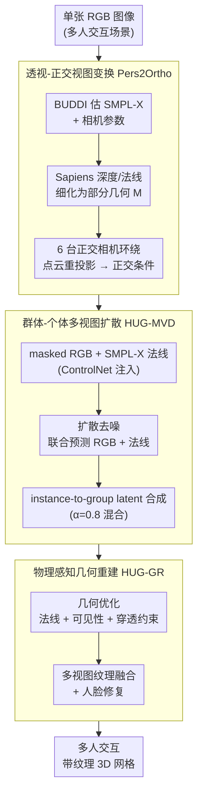

# Human Interaction-Aware 3D Reconstruction from a Single Image

**会议**: CVPR 2026  
**arXiv**: [2604.05436](https://arxiv.org/abs/2604.05436)  
**代码**: 无 (项目页: jongheean11.github.io/HUG3D_project)  
**领域**: 3D视觉  
**关键词**: 多人3D重建, 人体交互, 多视图扩散, 物理约束, 遮挡补全

## 一句话总结
提出HUG3D框架，通过透视-正交视图变换、群体-个体多视图扩散模型和物理感知几何重建，从单张图片实现交互多人的高保真纹理3D重建，在CD/P2S/NC等指标上全面超越现有方法。

## 研究背景与动机
1. **领域现状**: 单人3D重建已取得显著进展(SIFU/SiTH/PSHuman等)，但都聚焦于单一个体，对多人交互场景束手无策。
2. **现有痛点**: 多人场景存在三大核心挑战：(1)几何复杂度和透视畸变——多人场景深度变化大，正交假设不成立；(2)缺乏交互感知——独立重建各人导致肢体穿透、不自然距离等物理不合理；(3)遮挡区域的几何和纹理缺失——人与人之间遮挡导致关键身体部位信息丢失。
3. **核心矛盾**: 现有方法将每个人独立处理，完全忽略了群体上下文和交互先验，而多人交互中的物理合理性（接触、避免穿透）需要全局信息。
4. **本文目标**: 如何从单张图片重建出多人交互场景的高保真3D纹理模型，同时保证物理合理性。
5. **切入角度**: 同时利用群体级（group-level）和个体级（instance-level）信息，通过扩散模型隐式学习交互先验，通过物理约束显式强制接触和避免穿透。
6. **核心 idea**: 融合群体/个体双层次信息的多视图扩散模型补全遮挡+基于物理的几何优化保证交互合理性。

## 方法详解

### 整体框架
HUG3D包含三个阶段：(1) Pers2Ortho模块将输入透视图像转换为标准正交多视图表示；(2) HUG-MVD扩散模型联合补全遮挡区域的几何和纹理；(3) HUG-GR物理感知几何重建+纹理融合。输入是单张RGB图像，输出是多人交互的带纹理3D网格。

### 关键设计

**1. 透视-正交视图变换 Pers2Ortho：把畸变的透视图掰正成扩散模型吃得下的正交表示**

多人合影里深度跨度很大，近大远小的透视畸变让"正交假设"彻底失效，而多视图扩散模型恰恰是在正交视角上学得最稳——作者发现直接拿透视图喂扩散模型会训出严重形变（论文 Fig.3 有对比）。Pers2Ortho 的任务就是先搭一个干净的正交舞台。具体做法是：先用 BUDDI 估出每个人的 SMPL-X 网格和相机参数，再用 Sapiens 预测的深度/法线把初始网格细化成一份部分 3D 几何 $\mathcal{M}$；然后在归一化包围盒四周架 6 台正交相机（方位角 0°/45°/90°/180°/270°/315°），把输入图的 RGB 通过点云重投影"贴"到各个正交视角，得到带部分外观的条件输入 $x_{pcd}^{(i)}$。这里特意用点云重投影而非网格顶点着色，是因为前者保留了更密的外观细节。标准化的相机布局还有个隐藏好处：固定的视角让扩散模型更容易学到稳定的交互模式。

**2. 群体-个体多视图扩散 HUG-MVD：同一个扩散模型，既管全局交互一致，又管个体细节**

正交视图里被遮住的身体部位（人与人互相挡掉的区域）需要补全，但补全时面临一个数据两难：单人数据集（THuman2.0、CustomHumans）身份多样却没有交互，多人数据集（Hi4D）有真实交互却身份有限。HUG-MVD 的解法是"训练混采 + 推理双层"。模型基于 PSHuman/SD 2.1，输入 masked RGB 加上经 ControlNet 注入的 SMPL-X 法线，同时预测补全后的 RGB 和法线；训练时把单人与多人数据混在一起，让多样性和交互先验都进得来。推理阶段的关键是 instance-to-group latent composition——每个去噪步里，把各个体单独推得的 latent $z_{t,inst(k)}^{(i)}$ 注入到群体 latent $z_{t,group}^{(i)}$ 的对应空间区域，按平衡因子 $\alpha=0.8$ 混合。这样群体级 latent 负责守住全局一致（比如谁挡谁的遮挡关系），实例级 latent 负责拉细局部（手指、面部），二者互相增益，比训两个独立模型更省也更协调。

**3. 物理感知几何重建 HUG-GR：用穿透/接触约束把"看起来对"逼成"物理上对"**

扩散模型给的是外观与法线先验，但它并不保证两个人不会互相穿模、该接触的地方真的贴上。HUG-GR 在几何优化阶段补上这层显式约束，让 SMPL-X 网格既匹配扩散预测的法线、又满足物理合理性。总损失为

$$\mathcal{L}_{total} = \mathcal{L}_{normal} + \lambda_{vis}\mathcal{L}_{vis} + \lambda_{pen}\mathcal{L}_{pen}$$

其中法线监督 $\mathcal{L}_{normal}$ 分群体和个体两级施加；穿透损失 $\mathcal{L}_{pen}$ 对接触区域的身体部位对施加最小距离约束，用 softplus 做平滑惩罚，把"不该靠太近"写成可微目标；可见性损失 $\mathcal{L}_{vis}$ 则确保渲染出的遮挡关系和 GT 对得上。优化时对手、脸这类高频语义区域用更精细的学习率，避免细节被整体优化抹平。论文用接触精度指标 CP（contact precision，衡量重建结果中人与人接触是否合理、越高越好）来量化这层约束的效果，HUG-GR 正是直接优化它。

### 损失函数 / 训练策略
扩散模型训练：对RGB和法线同时做DDPM去噪目标（式3），双阶段课程——前1000步无遮挡mask，后1000步加入遮挡模拟。单A100(80GB)训练约两天，使用Adam优化器(lr=$5\times10^{-6}$, $\beta_1=0.9$, $\beta_2=0.999$，batch=16，梯度累积8步)。DDPM scheduler(1000步)用于训练，DDIM(40步, $\eta=1.0$)用于推理。HUG-GR几何优化200步，Adam(lr=0.01)，$\lambda_{group}=1.0, \lambda_{inst}=0.2, \lambda_{pen}=2.0, \lambda_{vis}=1.0$。对手、脸等高频区域使用更精细的学习率。纹理通过多视图RGB投影融合，遮挡区域用视图感知置信度mask混合，并对侧面视角应用高保真人脸修复。

## 实验关键数据

### 主实验 (MultiHuman数据集)

| 方法 | CD↓ | P2S↓ | NC↑ | F-score↑ | CP↑ |
|------|-----|------|-----|----------|-----|
| SIFU | 5.644 | 2.284 | 0.754 | 29.244 | 0.089 |
| SiTH | 9.251 | 3.185 | 0.709 | 21.037 | 0.135 |
| PSHuman | 15.579 | 6.088 | 0.617 | 9.749 | 0.027 |
| DeepMultiCap | 13.719 | 2.555 | 0.749 | 18.125 | 0.083 |
| **HUG3D** | **3.631** | **1.752** | **0.811** | **41.504** | **0.240** |

纹理质量：PSNR 16.456 (vs SIFU 15.202), SSIM 0.809, LPIPS 0.168

### 消融实验

| 配置 | CD↓ | Occ.Norm L2↓ | Occ.PSNR↑ |
|------|-----|-------------|-----------|
| Group-only训练 | 4.564 | 0.157 | 7.423 |
| Instance-only训练 | 4.645 | 0.156 | 7.726 |
| 无instance-to-group latent合成 | 4.646 | 0.159 | 7.916 |
| Instance-only法线监督 | 4.642 | 0.156 | 7.902 |
| Group-only法线监督 | 4.620 | 0.159 | 7.678 |
| **Full HUG3D** | **4.316** | **0.153** | **8.082** |

### 关键发现
- HUG3D在所有几何指标上大幅领先：CD降低35.7%(vs SIFU)，F-score提升41.8%。
- 接触合理性指标CP从最好的0.135提升到0.240，说明交互建模显著改善了物理合理性。
- 遮挡区域的法线和PSNR也明显提升，验证了扩散模型在遮挡补全上的有效性。
- 双层训练（group+instance）比任一单独策略都好，latent composition对遮挡区域PSNR贡献最大。

## 亮点与洞察
- **Pers2Ortho的实用性**：透视到正交变换对多人场景至关重要，直接在透视图上训练扩散模型效果很差（如图3所示导致严重形变）。这种变换思路可以推广到任何需要canonical空间的3D生成任务，是一个值得复用的通用模块。
- **双层latent composition的推理策略**：让同一个扩散模型同时做群体和个体推理，通过空间区域的latent注入实现两个层次的互补，比训练两个独立模型更高效。组级latent保证全局一致性（如遮挡关系），实例级latent保证局部细节（如手指、面部），两者通过$\alpha=0.8$的混合因子平衡。
- **CP指标的提出和优化**：量化了重建结果中人与人的接触合理性，HUG-GR的穿透损失直接优化这一指标，HUG3D的CP (0.240) 比所有基线（最高0.135）高出78%，为后续多人交互重建提供了可靠的评估维度。
- **PCD重投影优于网格顶点着色**：点云重投影保留了密集的外观细节，而网格着色通常稀疏且质量低。这个细节设计对纹理质量的贡献不可忽视。

## 局限与展望
- 目前只处理两人交互场景，扩展到3人以上的可扩展性未验证——组级表示如何随人数增长是关键挑战。
- 依赖SMPL-X的初始估计质量，特别是RoBUDDI对极端姿态和重度遮挡的鲁棒性有限，初始估计失败将导致整个pipeline级联失败。
- Pers2Ortho中的部分3D构建可能在极端遮挡下信息不足，仅有45°和315°的重投影视图。
- 训练数据主要来自实验室捕获的扫描数据（Hi4D、THuman2.0），对真实野外场景（复杂光照、杂乱背景）的泛化能力需要更多验证。
- 不处理人与外部物体的遮挡（如桌子遮挡下半身），这在现实场景中非常常见。
- HUG-GR优化需要200步迭代，加上扩散模型推理的40步去噪，单张图片的总处理时间仍然较长。

## 相关工作与启发
- **vs SIFU/PSHuman**: 这些单人方法独立处理每个人导致穿透和不一致，HUG3D的群体感知明显优势。SIFU (CD 5.644) vs HUG3D (CD 3.631) 降低36%。
- **vs BUDDI**: BUDDI只做SMPL-X级别的交互建模（粗糙几何），HUG3D扩展到完整纹理网格重建。本文的RoBUDDI是BUDDI的改进版，用于初始姿态估计。
- **vs DeepMultiCap**: 多人方法中P2S最好，但NC和F-score远不如HUG3D。且DeepMultiCap设计用于多视图输入，单图设置下表现不佳。
- **vs Multiply(视频方法)**: 设计用于视频输入，单帧设置下同样不适用。HUG3D专为单图场景设计，填补了这一空白。
- **对未来工作的启发**: HUG3D的三阶段框架可以扩展到人-场景交互重建，将Pers2Ortho应用于场景级别的多物体重建，用交互感知的扩散先验处理人-物体遮挡。
- **评估协议的贡献**: 定义了多人重建的全面评估体系（几何+纹理+遮挡区域+接触精度），为后续研究提供了统一的benchmark。
- **训练数据策略的启示**: 结合单人数据集（提供多样性）和多人数据集（提供交互知识）的策略可以推广到其他需要组合不同数据源优势的任务。

## 评分
- 新颖性: ⭐⭐⭐⭐ 第一个端到端解决单图多人纹理3D重建的完整框架，组-实例设计很有创见
- 实验充分度: ⭐⭐⭐⭐ 定量+定性+消融+野外图像全面覆盖，CP指标新颖有用
- 写作质量: ⭐⭐⭐⭐ 三个挑战的分析清晰，方法描述系统，图示优秀
- 价值: ⭐⭐⭐⭐ 为多人3D重建开辟了新路径，实际应用场景广泛（AR/VR、远程呈现、数字人类）

<!-- RELATED:START -->

## 相关论文

- [\[CVPR 2026\] CARI4D: Category Agnostic 4D Reconstruction of Human-Object Interaction](cari4d_category_agnostic_4d_reconstruction_of_human_object_interaction.md)
- [\[CVPR 2026\] CrowdGaussian: Reconstructing High-Fidelity 3D Gaussians for Human Crowd from a Single Image](crowdgaussian_reconstructing_high-fidelity_3d_gaussians_for_human_crowd_from_a_s.md)
- [\[CVPR 2026\] Coherent Human-Scene Reconstruction from Multi-Person Multi-View Video in a Single Pass](coherent_humanscene_reconstruction_from_multiperso.md)
- [\[CVPR 2026\] HumanOrbit: 3D Human Reconstruction as 360° Orbit Generation](humanorbit_3d_human_reconstruction_as_360_orbit_generation.md)
- [\[CVPR 2026\] Zero-Shot Reconstruction of Animatable 3D Avatars with Cloth Dynamics from a Single Image](zero-shot_reconstruction_of_animatable_3d_avatars_with_cloth_dynamics_from_a_sin.md)

<!-- RELATED:END -->
