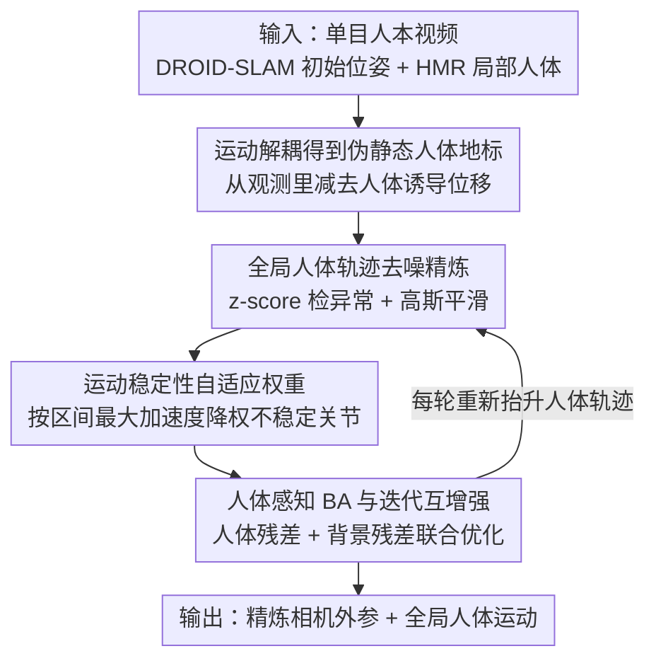

# HumanBA: Human-Aware Bundle Adjustment via Global Human-Camera Decoupling

**会议**: CVPR 2026  
**论文**: [CVF Open Access](https://openaccess.thecvf.com/content/CVPR2026/html/Yang_HumanBA_Human-Aware_Bundle_Adjustment_via_Global_Human-Camera_Decoupling_CVPR_2026_paper.html)  
**代码**: https://github.com/MartaYang/HumanBA  
**领域**: 3D视觉  
**关键词**: 全局人体重建, SLAM, 光束法平差, 运动解耦, 单目视频

## 一句话总结
针对单目视频里前景人体占满画面导致传统 SLAM 失效的问题，HumanBA 不再把人当作要被掩盖的动态干扰，而是先用 HMR 估计出人体自身运动并从观测轨迹里减掉它，得到一组"伪静态"人体关节地标，再按运动稳定性自适应加权后塞进光束法平差（BA），让相机位姿和全局人体重建在迭代中相互增益，在 EMDB2 / SLOPER4D 上同时降低了相机与人体的轨迹误差。

## 研究背景与动机

**领域现状**：从单目视频恢复世界坐标系下的人体网格（world-coordinate HMR），核心是把"相机运动"和"人体运动"从图像空间里解耦开。主流做法分两类：一类直接学一个 local-to-global 映射（WHAM / TRACE / GLAMR），把局部位姿/速度抬升到全局轨迹；另一类显式跑 SLAM 估出相机运动，再和局部人体预测组合（SLAHMR / TRAM），通常用 DROID-SLAM 这类现代后端。

**现有痛点**：第一类天生有歧义——同样的局部观测（如在跑步机上走路）可以对应天差地别的全局运动。第二类依赖 SLAM，而经典视觉 SLAM 假设场景大体静止，于是惯用套路是把动态的人 **mask 掉**（人体像素置零置信度、不参与特征匹配）。但在人本视频里，人往往占据大半个画面，激进地把人抹掉会一并删掉大量有用的几何约束，导致跟踪抖动甚至直接丢帧失败。

**核心矛盾**：人体既是"破坏静态假设的动态前景"，又是"画面里信息量最大的结构"。把它当 outlier 抹掉就丢约束，留着不处理又违反多视图一致性。问题的根本在于：人在两帧之间的**表观位移是相机运动和人体运动的混合**，naive 地相减会放大误差而非消除。

**本文目标**：把被 mask 掉的人重新塞回 BA，当作能稳定相机优化的伪静态地标，同时（1）正确地从观测里剥离人体自身运动，（2）抑制人体估计噪声对 BA 的污染。

**切入角度**：作者借鉴动态场景 SLAM（如 BA-Track 用 3D point tracker 做运动解耦）的观点——动态元素本身不是问题，问题是相机诱导与物体诱导运动的纠缠。但 BA-Track 是 object-agnostic 的，没用上人体先验；而人本任务恰恰有现成的 HMR 模型可以提供结构化的人体运动估计。

**核心 idea**：用 HMR 估出"人体诱导运动"并从观测关节轨迹里减掉它，得到只含相机诱导运动的伪静态人体地标，再按运动稳定性自适应加权，作为额外约束项加进 BA 目标——把动态的人从"要被剔除的离群点"变成"可用的世界坐标锚点"。

## 方法详解

### 整体框架
输入是单目人本视频，输出是精炼后的相机外参 $\{R_t, T_t\}$ 和世界坐标系下的全局人体运动 $\hat X^w$。流程是：先用 DROID-SLAM 拿到初始相机位姿和背景点云、用现成 HMR 拿到逐帧局部人体，抬升得到初始全局人体轨迹；然后对每个 BA 关键帧对 $(i,j)$ 做**运动解耦**，把人体自身位移从观测里减掉得到伪静态地标；对全局轨迹先做去噪精炼以提高地标精度；再按关节在该时间跨度内的运动稳定性给每个地标**自适应加权**；最后把加权后的人体残差项加进标准背景 BA，迭代优化——每轮更新完相机位姿后重新抬升人体轨迹，让更好的相机带来更干净的人体锚点，形成相互增强的闭环。

### 关键设计

**1. 运动解耦：把人变成伪静态 BA 地标**

痛点直白说就是：人在第 $i$ 帧到第 $j$ 帧的表观位移，既有相机动也有人自己动，混在一起没法直接当静态约束用。HumanBA 的做法是显式拆开这两部分。给定当前世界坐标系下的人体运动估计，人体自身（人体诱导）的世界位移是 $\Delta X^w(i,j) = X^w_j - X^w_i$，换算到第 $j$ 帧相机坐标系即 $\Delta X^j(i,j) = R_j\,\Delta X^w(i,j)$。把这部分从第 $j$ 帧观测到的人体关节 $X^j_j$ 里减掉，就得到"如果只有相机在动、人没动"时人体应该出现的位置 $X^j_i = X^j_j - \Delta X^j(i,j)$，这就是伪静态地标。投影后作为 BA 目标：

$$p^{hum*}_{ij} = \Pi_c\big(X^j_j - R_j(X^w_j - X^w_i)\big)$$

地标用的是 SMPL 的 24 个运动学关节（因为 DROID-SLAM 在 64×48 的特征图上工作，6890 个 SMPL 顶点全用不现实）。这一步之所以有效，是因为它没有像 masked SLAM 那样丢掉前景约束，而是把前景人体"复活"成和背景特征同等地位的可信地标，约束更多、相机优化更稳。

**2. 全局人体轨迹去噪精炼：让地标先变干净**

BA 对参考地标的精度非常敏感，而 HMR 抬升出来的全局人体轨迹本身是带噪的，直接拿去解耦反而会把误差注入相机优化。所以在构造地标之前，先对初始世界轨迹 $X^w$ 做一轮精炼：用 robust z-score 对世界坐标系下关节的速度/加速度做阈值检测（实现里取 $|z|>3.5$），把异常的增量用短时间窗内的局部均值替换，再累积积分重建轨迹，最后轻量高斯平滑。精炼后的 $\hat X^w$ 替换掉原始 $X^w$ 进入后续所有公式。消融显示，没有这一步去噪、直接拿人体关节当 BA 目标，增益明显小于带精炼的版本——说明先把全局轨迹的跳变压住，才能稳定后面的优化。

**3. 运动稳定性自适应权重：只信靠谱的关节和短跨度**

不是所有关节、所有帧对都同样可靠——四肢末端（手）抖得厉害，跨度长的帧对累积不确定性也大。HumanBA 给每个人体地标按运动稳定性自适应打分。先定义关节 $k$ 在区间 $[i,j]$ 内的最大离散加速度 $a_{ij,k} = \max_{t\in[i,j]} \|\Delta^2 \hat X^w_{t,k}\|_2$，再用一个有界单调递减函数映射成置信度：

$$w^{hum}_{ij,k} = \mathrm{clamp}\Big(1 - \log\big(\tfrac{\max(a_{ij,k},\epsilon)}{\tau}\big),\, 0,\, 1\Big)$$

其中 $\tau>0$ 控制衰减速率（EMDB2 用 $\tau=1.0$、SLOPER4D 用 $\tau=2.0$），$\epsilon$ 是小正数。这个权重天然呈现出两个符合直觉的行为：靠近躯干根部的关节（root / hip / spine）加速度小、得到更大权重，远端 end-effector（手腕、手）被降权；跨度 $|j-i|$ 越大权重越小。消融里"所有关节等权"反而比"只用 root 关节"更差（因为末端抖动污染），而自适应加权两个相机指标和人体指标都拿到最佳，说明加权机制确实在强调可靠约束、压制不稳定约束。

**4. 人体感知 BA 与迭代互增强：相机与人体相互喂数据**

把人体残差项加进标准背景 BA。对每个帧对 $(i,j)$、每个关节 $k$，人体残差是加权后的目标投影与几何投影之差 $\ell^{hum}_{ij} = \sum_k w^{hum}_{ij,k}\,\|p^{hum*}_{ij,k} - \Pi_c(G_{ij}\circ X^i_{i,k})\|^2$，总目标把背景像素重投影残差和人体地标残差相加一起最小化。关键在于**迭代互增强**：按标准 BA 迭代调度（沿用 DROID 的 19 轮），每次更新完相机外参 $\{R_t,T_t\}$ 后，立刻用新外参重新抬升世界人体轨迹 $\hat X^w$、刷新人体地标 $p^{hum*}$ 和权重 $w^{hum}$，再进入下一轮。这样"更准的相机 → 更干净的人体锚点 → 更可靠的 BA 目标"形成正反馈，相机轨迹的修正反过来也降低了世界坐标人体运动的误差，体现出人体线索与相机优化之间的相互收益。

### 损失函数 / 训练策略
HumanBA 不训练新网络，是一个在推理期作用于现成 SLAM + HMR 之上的优化框架。优化目标即上面的总 BA 代价（背景重投影残差 + 加权人体地标残差），用 DROID-SLAM 的循环优化器迭代求解。实现细节：基座为 DROID-SLAM，人体感知 BA 跑 19 轮（与原始迭代数一致），实验显示相机指标在 8–10 轮即收敛；地标取 24 个 SMPL 运动学关节；尺度可由背景场景（TRAM 方式）或前景人体接触关节（HAC 方式）标定。

## 实验关键数据

### 主实验

EMDB2（25 段动态相机序列）上，相对在 masked SLAM 基础上加尺度估计的强基线，HumanBA 在相机与人体指标上全面更优；在"帧间运动剧烈"的子集上提升尤其明显（说明它修的是失败案例而非只是平滑本已稳定的轨迹）。所有指标越低越好。

| 数据集 / 设置 | ATE-S↓ | ATE↓ | W-MPJPE↓ | WA-MPJPE↓ |
|--------|------|------|------|------|
| EMDB2 全集 · Masked DROID + 尺度估计 [TRAM] | 0.708 | 0.369 | 230.97 | 79.80 |
| EMDB2 全集 · Masked DROID + HumanBA（完整） | **0.682** | **0.358** | **195.97** | **70.10** |
| 运动剧烈子集 · Masked DROID + 尺度估计 [TRAM] | 0.649 | 0.323 | 232.34 | 84.93 |
| 运动剧烈子集 · Masked DROID + HumanBA | **0.525** | **0.285** | **193.69** | **74.49** |

> 指标定义：ATE（m）相机轨迹刚性对齐后的平均平移误差；ATE-S（m）不做尺度对齐的平移误差（更能反映尺度估计的准确度）；W-MPJPE（mm）每 100 帧段仅对齐前两帧后的关节误差；WA-MPJPE（mm）每 100 帧段整体对齐后的关节误差。

按序列长度分桶（EMDB2）时，HumanBA 的 ATE-S 在短/中/长各段都低于 TRAM（0.37 / 0.45 / … vs 0.48 / 0.62 / 0.78），平均 ATE 与 Masked DROID 持平（0.32）但尺度精度更好。

### 消融实验

EMDB2 全集，逐步加上各组件（均在 Masked DROID 之上，越低越好）：

| 配置 | ATE-S↓ | ATE↓ | W-MPJPE↓ | WA-MPJPE↓ | 说明 |
|------|------|------|------|------|------|
| HumanBA（无精炼、无加权） | 0.706 | 0.404 | 215.56 | 77.90 | 仅把人当地标 |
| + 精炼，所有关节等权 | 0.791 | 0.508 | 224.75 | 82.71 | 末端抖动反而拖累 |
| + 精炼，仅用 root 关节 | 0.718 | 0.398 | 211.86 | 74.81 | 根关节更稳，ATE-S 改善 |
| + 精炼 + 自适应加权（完整） | **0.682** | **0.358** | **195.97** | **70.10** | 全指标最佳 |

### 关键发现
- **去噪精炼不可省**：不做运动精炼直接用关节当地标，增益明显小于带精炼版本——BA 对参考噪声敏感，先压住全局轨迹跳变才能稳住优化。
- **"所有关节等权"是陷阱**：等权反而比"只用 root"更差，因为四肢末端关节噪声大、会污染约束；自适应加权才把这部分自动降权。
- **权重行为符合物理直觉**：学到的权重对躯干根部关节高、对手等远端关节低；对长跨度帧对自动降权，与"累积不确定性随跨度增大"一致。
- **互增强是双向的**：更好的相机轨迹反过来降低了世界坐标人体运动误差，人体线索与相机优化相互受益。
- **场景越难收益越大**：在帧间运动剧烈、masked SLAM 容易失败的子集上，HumanBA 的相对提升比全集更大。

## 亮点与洞察
- **视角反转最巧**：把"动态人体是要剔除的离群点"翻转成"信息量最大的伪静态地标"，这一念之转直接把 masked SLAM 丢掉的约束捡了回来——尤其在人占满画面、背景噪声大的场景，这正是传统方法翻车的地方。
- **运动解耦的减法很干净**：用现成 HMR 的结构化人体先验显式算出人体诱导位移并相减，比 BA-Track 那种 object-agnostic 的通用 point tracker 更贴合人本任务，不需要稠密跟踪也不需要事后深度精炼。
- **自适应权重几乎零成本却很关键**：仅凭一个基于区间最大加速度的单调递减函数，就同时实现了"关节级"和"时间跨度级"的可靠性筛选，可迁移到任何"用带噪轨迹当几何约束"的优化问题里。
- **即插即用**：整套方法作用在现成 SLAM + HMR 之上、不训练新网络，迭代闭环让它能直接嫁接到 DROID 这类已有 BA 框架。

## 局限与展望
- 地标受限于 SLAM 特征图分辨率（64×48），只能用 24 个 SMPL 关节而非全部顶点，几何约束的稠密度被限制。
- 整套精度依赖现成 HMR 的质量——若 HMR 在严重遮挡/极端姿态下崩坏，运动解耦的"减法"基础就不牢。
- 衰减系数 $\tau$ 是 per-dataset 手调的（EMDB2 用 1.0、SLOPER4D 用 2.0），缺少自适应或自动标定，换数据集需重调。
- SLOPER4D 上因 SLAM 关键帧上限，只能在 3 段子集上评测，长序列的可扩展性未充分验证。
- 多人场景未讨论，目前框架假设单主体人体。

## 相关工作与启发
- **vs Masked DROID-SLAM / TRAM**：它们把人 mask 掉以维持静态假设，HumanBA 反其道把人解耦后当伪静态地标重新塞回 BA，在人占满画面时不丢约束，相机和人体误差都更低。
- **vs BA-Track**：同样基于"运动解耦"思路，但 BA-Track 用通用 3D point tracker、object-agnostic；HumanBA 用结构化人体先验（HMR）做解耦，并加了运动稳定性自适应加权，更契合人本任务、无需稠密跟踪。
- **vs WHAM / TRACE / GLAMR（local-to-global 映射）**：这类直接从局部观测预测全局运动天生有歧义，HumanBA 走显式相机优化路线、用 BA 把多帧约束联合起来，从根上减少漂移。
- **vs HAC（前景深度做尺度）**：HumanBA 与尺度标定正交，可复用背景或前景接触关节来定尺度，重点在于把人体当 BA 约束而非仅作尺度来源。

## 评分
- 新颖性: ⭐⭐⭐⭐⭐ 把"被掩盖的动态人体"翻转为"伪静态 BA 地标"，视角清奇且自洽
- 实验充分度: ⭐⭐⭐⭐ EMDB2 / SLOPER4D 两基准 + 细致消融，但 SLOPER4D 仅 3 段、多人场景缺失
- 写作质量: ⭐⭐⭐⭐⭐ 运动解耦的几何推导清晰，图 3 的红/蓝/紫箭头把核心机制讲得很直观
- 价值: ⭐⭐⭐⭐ 即插即用、可嫁接现有 SLAM，对人本视频的全局重建有实用价值

<!-- RELATED:START -->

## 相关论文

- [\[CVPR 2026\] Parallel Rigidity Matters for Bundle Adjustment](parallel_rigidity_matters_for_bundle_adjustment.md)
- [\[CVPR 2026\] Human Interaction-Aware 3D Reconstruction from a Single Image](human_interaction-aware_3d_reconstruction_from_a_single_image.md)
- [\[CVPR 2026\] CARI4D: Category Agnostic 4D Reconstruction of Human-Object Interaction](cari4d_category_agnostic_4d_reconstruction_of_human_object_interaction.md)
- [\[CVPR 2026\] RHINO: Reconstructing Human Interactions with Novel Objects from Monocular Videos](rhino_reconstructing_human_interactions_with_novel_objects_from_monocular_videos.md)
- [\[CVPR 2026\] Recovering Physically Plausible Human-Object Interactions from Monocular Videos](recovering_physically_plausible_human-object_interactions_from_monocular_videos.md)

<!-- RELATED:END -->
