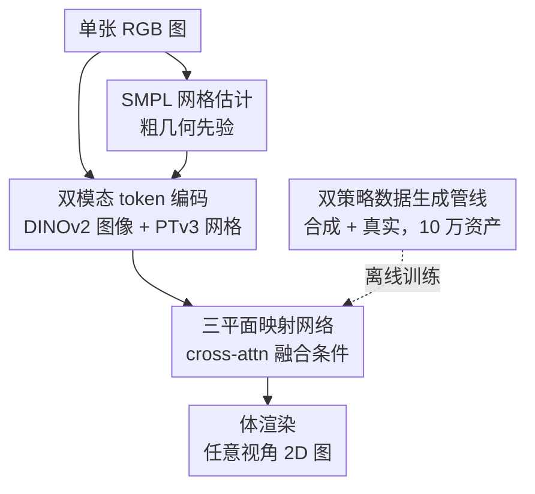

# HumanNOVA: Photorealistic, Universal and Rapid 3D Human Avatar Modeling from a Single Image

**会议**: CVPR2026  
**arXiv**: [2606.02573](https://arxiv.org/abs/2606.02573)  
**代码**: 项目页 https://HumanNOVA.github.io （未确认开源）  
**领域**: 3D视觉  
**关键词**: 单图人体重建, 前馈LRM, 三平面表示, SMPL先验, 大规模数据生成

## 一句话总结
HumanNOVA 把通用物体大重建模型（LRM）迁移到人体域，用「双模态 token 条件 + 三平面」前馈架构在 1 秒内从单张图重建照片级 3D 人体，并配套一条把训练数据扩到 10 万资产（约 20 倍）的合成+真实数据生成管线，在三个 benchmark 上相对 LPIPS 提升 40%+。

## 研究背景与动机
**领域现状**：单图照片级 3D 人体头像重建的主流做法（SiTH、SIFU 等）是「参数化人体先验（SMPL/SMPL-X）+ 高级 3D 表示（NeRF / 3DGS）+ 扩散先验幻想背面」。它们靠扩散模型把看不见的侧面/背面补全，再做逐实例优化得到最终几何与外观。

**现有痛点**：这类方法过度依赖扩散先验，需要**逐实例慢速优化**，单个 avatar 重建动辄数分钟，难以规模化部署；而且当训练数据有限时，扩散补全的泛化性也受限。

**核心矛盾**：照片级（photorealism）和泛化性（universal）很难兼得，根因是**高质量、多样化的 3D 人体数据极度稀缺**——通用物体有 Objaverse 这种 80 万实例的数据集，而现有人体数据集（THuman2、CustomHuman、2K2K）加起来只有几千个实例。数据不够，就训不出一个像通用 LRM 那样直接前馈出 3D 的人体模型。

**本文目标**：造一个「快（<1s）、不需测试时优化、泛化好、画质高」的单图人体重建模型，需同时解决两个子问题——(1) 数据从哪来；(2) 通用 LRM 架构如何注入人体先验。

**切入角度**：作者认为既然通用物体已经能靠大规模前馈 LRM 跳过逐实例优化，人体也应该能——只要把数据规模和人体特定先验补上。

**核心 idea**：**用「前馈 LRM + SMPL 网格先验」替代「逐实例扩散优化」**，并用一条可扩展的数据生成管线把人体训练数据放大约 20 倍，让数据驱动取代慢速优化。

## 方法详解

### 整体框架
HumanNOVA 要解决的是「单张 RGB 图 → 1 秒内出照片级 3D 人体」。整条链路是一次前馈：先对输入图估计一个粗糙的 SMPL 人体网格作为几何锚点，图像和网格分别被编码成紧凑 token，再被一个基于 cross-attention 的映射网络融合进可学习的三平面表示，最后用体渲染从任意视角渲出 2D 图。模型本身不大、但要喂得动，背后还有一条离线的数据生成管线把训练资产扩到 10 万。

### 关键设计

**1. 前馈三平面头像建模：用一次过的 LRM 替掉逐实例慢优化**

针对「扩散+逐实例优化太慢、没法规模化」这个痛点，HumanNOVA 直接借鉴通用物体大重建模型（LRM）的范式，把 3D 人体重建做成一次前馈：输入 token 经映射网络直接产出三平面表示 $\mathbf{T}\in\mathbb{R}^{3hw\times d}$，再标准 ray-marching 渲染 $\hat{I}_\Phi=\pi(\mathbf{T}^*,\Phi)$。映射网络基于 PointInfinity 实现，由多个 block 堆叠，每个 block 用三步 cross-attention 交替更新一组中间 latent $\mathbf{L}$ 与三平面 token $\mathbf{T}$：先以条件特征为 query 读三平面（$\mathbf{L}^l=\text{CrossAttn}(q=\mathbf{f_i}\|\mathbf{f_m},kv=\mathbf{T}^l)$），再反向把条件信息写回 latent，最后用三平面 token 去 query latent 完成 refine。这样三平面就是一组对所有输入共享初始化的可学习 token，靠条件信号被「雕刻」成具体人体。整条推理 <1 秒、无需任何测试时微调，这是「rapid + universal」的来源

**2. 双模态 token 条件 + SMPL 网格先验：给通用 LRM 补上人体专属几何锚**

通用 LRM 架构是为一般物体设计的，没有类别先验；而人体重建是个高价值的特化场景，作者认为人体先验会很有用。于是输入不只有图像：图像用 DINOv2 切成视觉 token $\mathbf{f_i}\in\mathbb{R}^{N_i\times d}$（$N_i=HW/p^2$），同时对输入图估计一个 SMPL 参数化网格、用点云 transformer PTv3 编码成网格 token $\mathbf{f_m}\in\mathbb{R}^{N_m\times d}$。这个 SMPL 网格虽然粗（没有细节几何和外观），但给出了**可靠的身体姿态与表面初始估计**，相当于告诉模型「人大概站成什么样、表面在哪」，缓解了单视图重建天然的歧义（背面看不见）。两路 token 拼接 $\mathbf{f_i}\|\mathbf{f_m}$ 后作为统一条件喂进映射网络的 cross-attention。消融显示去掉网格先验后 LPIPS 从 45.18 退化到 46.26，验证了这个几何锚的作用

**3. 双策略大规模数据生成管线：把人体训练数据放大约 20 倍到 10 万资产**

数据稀缺是迁移 LRM 到人体的根本障碍，作者用两条互补策略凑数据。**合成支**：拿现成的 rigged 人体资产，用从 AMASS 采样的真实日常姿态参数 $\{\mathbf{R}^{\text{src}},\mathbf{T}_{\text{src}}\}$ 去 animate（驱动）、re-center、再分配多个相机视角渲染，公式化为 $\{\mathbf{I}_i\}=\text{Render}(\text{RC}(A(\mathbf{M},\{\mathbf{R}^{\text{src}},\mathbf{T}_{\text{src}}\})),\{\mathbf{C}_i\})$；合成数据规模大，适合喂饱 LRM。**真实支**：拿 DNA-Rendering、MVHumanNet 这类多相机真人采集数据，对每个 mesh 顶点初始化一个 3D Gaussian，最小化光度损失 $\mathcal{L}=\|I_i-f(V(\theta),\pi_i)\|^2$ 拟合出 3DGS 表示，再从重定心后的 $G_p$ 在预设规范视角渲染出任意新视角；真实数据更照片级、分布更贴近真实应用。两条加起来生成 10 万资产、260 万张图，约为现有所有人体数据集总和的 20 倍。消融里两条支路缺一不可（去掉任一条 LPIPS 都从 45.18 上升到 46.51/47.83）

### 损失函数 / 训练策略
整体联合训练，目标函数 $\mathcal{L}=\frac{1}{N}\sum_{n=1}^N(\mathcal{L}_r^n+\lambda_m\mathcal{L}_m^n+\lambda_p\mathcal{L}_p^n)$，含 RGB 损失 $\mathcal{L}_r$、mask 损失 $\mathcal{L}_m$（约束累积密度与估计 mask 一致）、LPIPS 感知损失 $\mathcal{L}_p$，$\lambda_m=\lambda_p=0.5$。为省显存，所有损失都在 patch 级计算，并按每个 patch 的前景比例做加权采样，迫使模型聚焦人体细节。训练用 64 张 H100，渲染视角数 $N=4$，AdamW、lr 6e-4、batch 64，三平面空间分辨率 96，裁剪 patch 180。

## 实验关键数据

### 主实验
在 CustomHuman / THuman2 / 2K2K 三个 benchmark 上，输入正面视图、512×512 渲染，HumanNOVA 全面超越此前 SOTA（下表为 CustomHuman，LPIPS 已 ×100）：

| 方法 | PSNR↑ | SSIM↑ | LPIPS↓ |
|------|-------|-------|--------|
| PaMIR | 18.15 | 0.9070 | 88.12 |
| SiFU | 17.94 | 0.9091 | 85.75 |
| Trellis | 18.59 | 0.9123 | 74.98 |
| SiTH（此前最佳之一） | 19.13 | 0.9173 | 72.94 |
| Hunyuan2 | 19.42 | 0.9094 | 74.34 |
| SF3D | 19.46 | 0.9113 | 66.09 |
| **HumanNOVA** | **22.29** | **0.9360** | **42.42** |

LPIPS 从 SF3D 的 66.09 降到 42.42（相对降 ~36%），相对 SiTH 的 72.94 降幅达 42%，呼应「40%+ 相对 LPIPS 提升」的主张。THuman2 / 2K2K 上 HumanNOVA 同样三指标全胜（如 THuman2 LPIPS 42.13、2K2K 41.72）。

### 消融实验
均在 CustomHuman 上（LPIPS ×100）：

| 配置 | PSNR↑ | SSIM↑ | LPIPS↓ | 说明 |
|------|-------|-------|--------|------|
| Full (HumanNOVA) | 22.07 | 0.9344 | 45.18 | 完整模型 |
| w/o gen-data (assets) | 21.84 | 0.9333 | 46.51 | 去掉合成支数据 |
| w/o gen-data (multi-cam) | 21.76 | 0.9326 | 47.83 | 去掉真实多相机支数据 |
| 数据用 25% | 21.98 | 0.9313 | 50.14 | 数据规模消融 |
| 数据用 50% | 22.02 | 0.9338 | 47.03 | 数据规模消融 |
| w/o mesh prior | 21.89 | 0.9334 | 46.26 | 去掉 SMPL 网格先验 |
| small triplane (32) | 21.78 | 0.9323 | 48.33 | 三平面尺寸 96→32 |

> ⚠️ 主实验表与消融表的 HumanNOVA 数字略有差异（LPIPS 42.42 vs 45.18 等），原文为两套独立设置/统计，以原文为准。

### 关键发现
- **数据规模是最大杠杆**：训练数据从 25% → 50% → 100%，LPIPS 单调改善 50.14 → 47.03 → 45.18，说明把数据扩到 10 万确实是性能主因，而非单纯架构精巧。
- **合成+真实双支互补**：去掉真实多相机支（LPIPS 47.83）比去掉合成支（46.51）掉得更多，真实数据对照片级渲染贡献略大，但两者都必要。
- **几何锚与三平面容量都要够**：去掉 SMPL 网格先验掉到 46.26；三平面尺寸从 96 砍到 32 掉到 48.33，是单项里掉点最猛的，说明三平面表示容量对人体细节很关键。
- **数据可迁移增益**：把生成数据拿去微调另一方法 Real3D，CustomHuman LPIPS 从 95.12 暴降到 58.54，证明这批数据本身的价值不绑定于 HumanNOVA 架构。

## 亮点与洞察
- **把「人体重建」当成「数据问题」而非「先验工程问题」**：以往工作堆扩散先验补背面，本文反其道——承认根因是数据稀缺，造一条管线把数据放大 20 倍，让前馈模型自己学会泛化。这个判断被规模消融直接验证。
- **合成（量）+ 真实（质）双支的分工很清醒**：合成数据靠 rigged 资产 × AMASS 姿态海量生成保证规模，真实数据靠 3DGS 拟合多相机采集保证照片级分布对齐，两者短板互补，是可复用的数据 scaling 思路。
- **SMPL 网格当「软几何锚」而非硬约束**：网格只提供粗姿态/表面，用 PTv3 编码成 token 与图像 token 平等地做 cross-attn 条件，既给了人体先验又不被粗网格的误差锁死，比早期 mesh-offset 类方法更灵活。
- **可迁移性**：「用参数化模型 token 当类别先验注入通用 LRM」这套，理论上可推广到动物、手、脸等其它有强参数化模型的特化重建任务。

## 局限与展望
- **依赖 SMPL 估计质量**：输入网格由现成估计器给出，复杂姿态/严重遮挡下 SMPL 估计若失败，作为几何锚会误导重建（论文未深入讨论失败案例）。
- **静态重建**：只重建单帧静态 avatar，不含可驱动（animatable）能力，离 telepresence/VR 实际「会动的 avatar」还差一步。
- **训练成本高**：64 张 H100 + 260 万张渲染图，复现门槛极高；数据生成管线本身依赖现成 rigged 资产与多相机采集，社区可得性存疑。
- **指标偏渲染质量**：主评估以 PSNR/SSIM/LPIPS 为主，几何指标（CD/NC/F-Score）仅作次要报告，对几何精度的体现有限。

## 相关工作与启发
- **vs SiTH / SIFU（扩散+逐实例优化）**：它们靠扩散幻想背面 + 逐实例慢优化，画质好但每个 avatar 要数分钟且数据有限时泛化差；HumanNOVA 改为前馈 <1s、用大数据取代扩散补全，速度与 LPIPS 双赢。
- **vs LRM / SF3D / Real3D（通用前馈重建）**：它们面向一般物体、无类别先验；本文在其上注入 SMPL 网格 token 先验并专门 scale 人体数据，把通用 LRM 的成功延伸到人体域，且证明数据可反哺 Real3D。
- **vs PaMIR / 早期 mesh-offset 方法**：受限于网格拓扑，难表达裙装等复杂衣物；本文用三平面隐式表示摆脱拓扑约束，同时仍保留 SMPL 作为弱先验。

## 评分
- 新颖性: ⭐⭐⭐⭐ 把 LRM 迁到人体并非全新范式，但「数据 scaling + SMPL token 先验」的组合与系统性数据管线很扎实
- 实验充分度: ⭐⭐⭐⭐⭐ 三 benchmark、七个对比方法、数据类型/规模/网格先验/三平面尺寸多维消融，还验证了数据可迁移
- 写作质量: ⭐⭐⭐⭐ 方法与动机清晰，但主表与消融表数字不一致处缺解释
- 价值: ⭐⭐⭐⭐ 1 秒级照片级单图人体重建 + 可复用数据生成思路，对 VR/telepresence 落地有实际意义

<!-- RELATED:START -->

## 相关论文

- [\[CVPR 2026\] Human Interaction-Aware 3D Reconstruction from a Single Image](human_interaction-aware_3d_reconstruction_from_a_single_image.md)
- [\[CVPR 2026\] FISHuman: Fine-grained Single-image 3D Human Reconstruction via Multi-view 4D Remeshing](fishuman_fine-grained_single-image_3d_human_reconstruction_via_multi-view_4d_rem.md)
- [\[CVPR 2026\] UIKA: Fast Universal Head Avatar from Pose-Free Images](uika_fast_universal_head_avatar_from_pose-free_images.md)
- [\[CVPR 2026\] CrowdGaussian: Reconstructing High-Fidelity 3D Gaussians for Human Crowd from a Single Image](crowdgaussian_reconstructing_high-fidelity_3d_gaussians_for_human_crowd_from_a_s.md)
- [\[ICCV 2025\] GAS: Generative Avatar Synthesis from a Single Image](../../ICCV2025/3d_vision/gas_generative_avatar_synthesis_from_a_single_image.md)

<!-- RELATED:END -->
